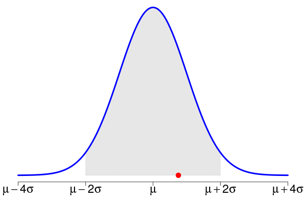

```{r setup0, echo=FALSE}
knitr::opts_chunk$set(fig.path="assets/fig/animatedGif-")
source('assets/Rfunctions/polyCurve_v1.R', encoding='UTF-8')
library(animation)
library(scales) # to use alpha()
```

***(latest update : `r Sys.time()`)***
<br/>

```{r gif_append, include=FALSE}
gif_append <- function(gif1, gif2, outgif, horizontal=TRUE, show=TRUE, extra.opts=""){
  command <- ifelse(horizontal, 
          sprintf("convert %s'[0]' -coalesce \\( %s'[0]' -coalesce \\) \\
          +append -channel A -evaluate set 0 +channel \\
          %s -coalesce -delete 0 \\
          null: \\( %s -coalesce \\) \\
          %s -gravity East -layers Composite %s", gif1, gif2, gif1, gif2, extra.opts, outgif),
          sprintf("convert %s'[0]' -coalesce \\( %s'[0]' -coalesce \\) \\
          -append -channel A -evaluate set 0 +channel \\
          %s -coalesce -delete 0 \\
          null: \\( %s -coalesce \\) \\
          %s -gravity South -layers Composite %s", gif1, gif2, gif1, gif2, extra.opts,  outgif))
  system.fun <- if (.Platform$OS.type == "windows") shell else system
  if(show) message("Executing: ", strwrap(command, exdent = 2, prefix = "\n"))
  system.fun(ifelse(.Platform$OS.type == "windows", sprintf("\"%s\"", shQuote(command)), command))
}
```

```{r gif_join, include=FALSE}
gif_join <- function(gif1, gif2, outgif, delay=3, show=TRUE, extra.opts=""){
  command <-  sprintf("convert %s -coalesce \\
       \\( +clone  -set delay %s/1 \\) +swap +delete \\
       \\( %s -coalesce \\) \\
       \\( +clone  -set delay %s/1 \\) +swap +delete \\
       %s -layers optimize %s", gif1, delay, gif2, delay, extra.opts, outgif)
  system.fun <- if (.Platform$OS.type == "windows") shell else system
  if(show) message("Executing: ", strwrap(command, exdent = 2, prefix = "\n"))
  system.fun(ifelse(.Platform$OS.type == "windows", sprintf("\"%s\"", shQuote(command)), command))
}
```

```{r gif_compress, include=FALSE}
gif_compress <- function(ingif, outgif, show=TRUE, extra.opts=""){
  command <-  sprintf("gifsicle -O3 %s < %s > %s", extra.opts, ingif, outgif)
  system.fun <- if (.Platform$OS.type == "windows") shell else system
  if(show) message("Executing: ", strwrap(command, exdent = 2, prefix = "\n"))
  system.fun(ifelse(.Platform$OS.type == "windows", sprintf("\"%s\"", shQuote(command)), command))
}
```


```{r makeanim, include=FALSE}
nanims <- 2
animnames0 <- sprintf("gausssample0%s.gif", 1:nanims)
animnames <- paste0("./assets/gif/", animnames0)
if(!all(file.exists("./assets/gif/compress_gausssample0102_join.gif"))){
  nsims <- 20
  seeds <- c(666, 314)
  xx <- seq(-4,4,length=150)
  yy <- dnorm(xx)
  rgba <- col2rgb("gray")
  tgray <- rgb(rgba[1,1], rgba[2,1], rgba[3,1], alpha=95, maxColorValue=255)
  cex.axis <- 1.9
  for(anim in 1:nanims){
    saveGIF({
      for(i in 1:nsims){
        set.seed(seeds[anim])
        simulation <- rnorm(i)
        cexpoints <- rep(1,i); cexpoints[i] <- 1.8
        cols <- alpha(rep("red", i), 0.5); cols[i] <- alpha("red",1)
        ats <- seq(-4,4,by=2)
        labs <- c(expression(mu-4*sigma), expression(mu-2*sigma), expression(mu), expression(mu+2*sigma), expression(mu+4*sigma))
        par(mar=c(3, 1, 0.1, 1))
        plot(xx, yy, type = "l", lwd=4, col="blue", xlim=c(-4,4), 
             panel.first =
               polyCurve(xx, yy, from = -2, to = 2,
                         col = tgray, border = tgray), 
             ylab=NA, xlab=NA, axes=FALSE)
        axis(1, at=ats, labels=labs, cex.axis=cex.axis)
        points(x=simulation, y=rep(0,i), col=cols, pch=19, cex=cexpoints)
      }
    }, movie.name = animnames0[anim], interval = 0.5, 
    ani.width = 600, ani.height = 400, autobrowse=FALSE, loop=0)
  }
  file.copy(animnames0, animnames, overwrite=TRUE)
  file.remove(animnames0)
  gif_append("./assets/gif/gausssample01.gif", "./assets/gif/gausssample02.gif", "./assets/gif/gausssample0102_horizontal.gif")
  gif_append("./assets/gif/gausssample01.gif", "./assets/gif/gausssample02.gif", "./assets/gif/gausssample0102_vertical.gif", horizontal=FALSE, extra.opts="-resize 300x400")
  gif_join("./assets/gif/gausssample01.gif", "./assets/gif/gausssample02.gif", "./assets/gif/gausssample0102_join.gif", delay=4, extra.opts="-resize 400x300")
  gifs <- list.files("./assets/gif", pattern="gausssample", full.names=TRUE)
  sapply(gifs, function(gif) gif_compress(gif, paste0("./assets/gif/compress_", basename(gif)), extra.opts="--colors 256"))
  file.remove(gifs)
}
```

It took me some time to find how to merge two animated gifs (using freeware only, as usual). So it is worth sharing my notes. Below are the two animated gifs used for my example.

<div style="text-align:center">


<p style="clear: both;">
</div>


## Append one gif to the other

 Below these are the same animations but they are merged into only one single animated gif, by appending the second one at the right to the first one. 


The ImageMagick command I used to create it (found on [imagemagick.org](http://www.imagemagick.org/)) is the following one:

```
convert file1.gif'[0]' -coalesce \\( file2.gif'[0]' -coalesce \\) \\
          +append -channel A -evaluate set 0 +channel \\
          file1.gif -coalesce -delete 0 \\
          null: \\( file2.gif -coalesce \\) \\
          -gravity East -layers Composite output.gif
```

To append vertically, run:

```
convert file1.gif'[0]' -coalesce \\( file2.gif'[0]' -coalesce \\) \\
          -append -channel A -evaluate set 0 +channel \\
          file1.gif -coalesce -delete 0 \\
          null: \\( file2.gif -coalesce \\) \\
          -gravity South -layers Composite output.gif
```
and you will get this single animation:

 <div style="text-align:center"></div>


## Join one gif after the other one 

One can also join the two animations, the second one after the other one, including a delay between them (4 seconds in the example below):

```
convert file1.gif -coalesce \ \( +clone -set delay 4/1 \) +swap +delete
  \ \( file2.gif -coalesce \) \ \( +clone -set delay 4/1 \) +swap
  +delete \ -resize 400x300 -layers optimize output.gif
```

 <div style="text-align:center"></div>


## Compress a gif 

Finally I discovered [gifsicle](http://www.lcdf.org/gifsicle/) while I was searching a way to compress an animated gif. It achieves an amazing performance, by simply running this line:

```
gifsicle -O3 --colors 256 < infile.gif > outfile.gif
```

To know more about *gifsicle* (which not only serves to compress), take also a look at [this post on graphicdesign.stackexchange](http://graphicdesign.stackexchange.com/questions/20908/how-to-remove-every-second-frame-from-an-animated-gif/).

## R functions 

Obviously, the previous command lines are not user-friendly. I wrote some R functions to run them more conveniently (at least, for R users). Moreover, since I usually use the [animation package]() to create my animations, these functions provide additional tools. Here are two examples of my functions, they should be enough to understand how to use them: 

```{r, eval=FALSE}
gif_append("file1.gif", "file2.gif", "outfile.gif", horizontal=FALSE, extra.opts="-resize 300x400")
gif_append("file1.gif", "file2.gif", "outfile.gif", delay=4)
gif_compress("file.gif", "outfile.gif", extra.opts="--colors 256"))
```

And their code is given below: 

```{r, ref.label='gif_append'}
```

```{r, ref.label='gif_join'}
```

```{r, ref.label='gif_compress'}
```


