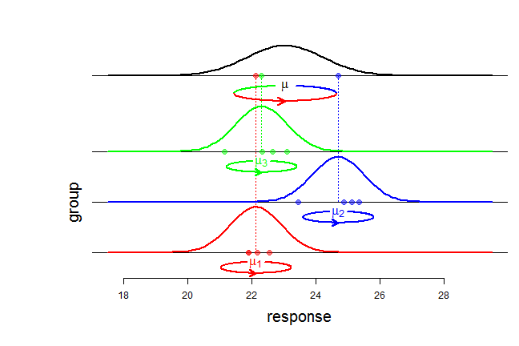

--- 
title: The balanced ANOVA model with random effects 
date : 2014-04-06
--- &lead

\(\newcommand{\indic}{\mathbf{1}}\)
\(\newcommand{\perpoplus}{\overset{\perp}{\oplus}}\)
\(\newcommand{\RR}{\mathbb{R}}\)

## The balanced ANOVA model with random effects  

The balanced ANOVA model is used to model a sample $y=(y_{ij})$ with a tabular structure:
$$y=\begin{pmatrix}
y_{11} & \ldots & y_{1J} \\
\vdots & y_{ij} & \vdots \\
y_{I1} & \ldots & y_{IJ}
\end{pmatrix},
$$
$y_{ij}$ denoting the $j$-th response in group $i$. 
In the model with *random effects*, 
it is assumed that the responses $y_{ij}$ are generated in two steps. 
First, the group means $\mu_i$ are independently generated according to a Gaussian 
distribution ${\cal N}(\mu, \sigma^2_b)$ where $\mu$ is the overall mean and 
$\sigma^2_b$ is the so-called *between variance*. 
Second, the responses $y_{ij}$, $j =1,\ldots,J$, for each group  
$i$, are independently distributed according to  a Gaussian distribution 
${\cal N}(\mu_i, \sigma^2_w)$ with *within variance* $\sigma^2_w$ and mean
$\mu_i$. Shortly, the model can be written:
 $$\begin{cases}
 (y_{ij} \mid \mu_i) \sim_{\text{iid}} {\cal N}(\mu_i, \sigma^2_w) & j=1,\ldots,J \\ 
\mu_i \sim_{\text{iid}} {\cal N}(\mu, \sigma^2_b) & i=1,\ldots,I
\end{cases}.$$

 

An equivalent writing of this model, and from now on using capital letters for random 
variables, is 
$$Y_{ij} = \mu + \sigma_bA_{i} + \sigma_wG_{ij},$$
where all random variables $A_i$ and $G_{ij}$ are independent and $\sim {\cal N}(0,1)$. 

## The three summary statistics $\bar{Y}_{\bullet\bullet}$, $SS_b(Y)$, $SS_w(Y)$

Using the tensor product language introduced in [this article](http://stla.github.io/stlapblog/posts/Anova1fixed.html), the model can be written 
$$Y = \mu({\bf 1}_I\otimes{\bf 1}_J) + \sigma_b A\otimes\indic_J +\sigma_wG, 
\qquad A \sim SN(\RR^I), \quad G \sim SN(\RR^I\otimes\RR^J).$$

The overall mean $\bar{Y}_{\bullet\bullet}$ is given by the projection of $Y$ on the subspace 
$[{\bf 1}_I]\otimes[{\bf 1}_J]$:  
$$P_{[{\bf 1}_I]\otimes[{\bf 1}_J]} Y = \bar{Y}_{\bullet\bullet}({\bf 1}_I\otimes{\bf 1}_J).$$

Then the variations $Y_{ij}-\bar{Y}_{\bullet\bullet}$ around the overall mean are given by the projection on the orthogonal complement ${\Bigl([\indic_I]\otimes[\indic_J]\Bigr)}^\perp$. 
Knowing that 
$$
\RR^I \otimes \RR^J  = 
\Bigl([\indic_I]\otimes[\indic_J]\Bigr) 
\perpoplus \Bigl([\indic_I]^\perp\otimes[\indic_J]\Bigr) 
\perpoplus \Bigl([\indic_I]\otimes[\indic_J]^\perp\Bigr) 
\perpoplus \Bigl([\indic_I]^\perp\otimes[\indic_J]^\perp\Bigr),
$$
one gets
$$
\begin{align}
\underset{\text{'total'}}{\underbrace{ {\Bigl([\indic_I]\otimes[\indic_J]\Bigr)}^\perp} }  & = 
\Bigl([\indic_I]^\perp\otimes[\indic_J]\Bigr) 
\perpoplus \Bigl([\indic_I]\otimes[\indic_J]^\perp\Bigr) 
\perpoplus \Bigl([\indic_I]^\perp\otimes[\indic_J]^\perp\Bigr) \\
& =  \underset{\text{'between'}}{\underbrace{\Bigl([\indic_I]^\perp\otimes[\indic_J]\Bigr)}} 
\perpoplus 
\underset{\text{'within'}}{\underbrace{\Bigl(\RR^I\otimes[\indic_J]^\perp\Bigr)}},
\end{align}
$$
thereby yielding the decomposition of the variations:
$$
P^\perp_{[\indic_I]\otimes[\indic_J]}Y = 
P_{[\indic_I]^\perp\otimes[\indic_J]}Y + P_{\RR^I\otimes[\indic_J]^\perp}Y,
$$
whose component formulae are: 

- ${\bigl(P^\perp_{[\indic_I]\otimes[\indic_J]}Y\bigr)}_{ij}=Y_{ij}-\bar{Y}_{\bullet\bullet}$

- ${\bigl(P_{[\indic_I]^\perp\otimes[\indic_J]}Y \bigr)}_{ij} = \bar{Y}_{i\bullet}-\bar{Y}_{\bullet\bullet}$ 

- ${\bigl(P_{\RR^I\otimes[\indic_J]^\perp}Y\bigr)}_{ij} = Y_{ij}-\bar{Y}_{i\bullet}$ 

Now we can see that the three summary statistics (*overall mean*, *between sum of squares*, *within sum of squares*)
$$\bar{Y}_{\bullet\bullet}, \quad 
SS_b(Y):={\Vert P_{[\indic_I]^\perp\otimes[\indic_J]}Y  \Vert}^2, \quad 
SS_w(Y):={\Vert P_{\RR^I\otimes[\indic_J]^\perp}Y \Vert}^2,$$
are independent random variables.
Indeed, the overall mean $\bar{Y}_{\bullet\bullet}$ is given by 
$$\begin{align}
P_{[{\bf 1}_I]\otimes[{\bf 1}_J]} Y &= \bar{Y}_{\bullet\bullet}({\bf 1}_I\otimes{\bf 1}_J) \\
& =  
\mu({\bf 1}_I\otimes{\bf 1}_J) + \sigma_b(P_{[{\bf 1}_I]}A)\otimes\indic_J+\sigma_wP_{[{\bf 1}_I]\otimes[{\bf 1}_J]}G,
\end{align}$$
the between variations are 
$$P_{[\indic_I]^\perp\otimes[\indic_J]}Y 
= \sigma_b(P^\perp_{[\indic_I]} A)\otimes\indic_J + \sigma_w P_{[\indic_I]^\perp\otimes[\indic_J]} G,$$
and the within variations are 
$$P_{\RR^I\otimes[\indic_J]^\perp}Y 
= \sigma_wP_{\RR^I\otimes[\indic_J]^\perp} G.$$
Independence follows from the independence b between $G$ and $A$ and 
from the orthogonality between the  ranges of the different projections.

It is easy to derive $\bar{Y}_{\bullet\bullet} \sim {\cal N}\left(\mu, \frac{\sigma^2}{IJ}\right)$ with $\sigma^2=J\sigma^2_b+\sigma^2_w$. 
It is also easy to get $SS_w(Y) \sim \sigma^2_w\chi^2_{I(J-1)}$ because of 
$$P_{\RR^I\otimes[\indic_J]^\perp}Y = \sigma_wP_{\RR^I\otimes[\indic_J]^\perp}G.$$ 
To derive the law of $SS_b(Y)$, 
note that 
$$
\begin{align}
P_{[\indic_I]^\perp\otimes[\indic_J]} G 
& = \begin{pmatrix} 
\bar{G}_{1\bullet} - \bar{G}_{\bullet\bullet} & \ldots & \bar{G}_{1\bullet} - \bar{G}_{\bullet\bullet} \\
\vdots & \vdots & \vdots \\
\bar{G}_{I\bullet} - \bar{G}_{\bullet\bullet} & \ldots & \bar{G}_{I\bullet} - \bar{G}_{\bullet\bullet} 
\end{pmatrix} \\
& = (P^\perp_{[\indic_I]}G_{\text{row}}) \otimes \indic_J
\end{align}$$
where $G_{\text{row}} = (\bar{G}_{i\bullet})$ is the vector of row means of $G$, and then one can write  
$$P_{[\indic_I]^\perp\otimes[\indic_J]} Y 
= \bigl(P^\perp_{[\indic_I]}(\sigma_b A + \sigma_w G_{\text{row}})\bigr) \otimes \indic_J.$$
Now it is easy to see that the components of $\sigma_b A + \sigma_w G_{\text{row}}$ are 
$\sim_{\text{iid}} {\cal N}(0, \sigma^2)$, and 
consequently $SS_b(Y) \sim \sigma^2\chi^2_{J-1}$. 

## Confidence interval for the overall mean 

By our previous derivations, the statistic 
$$ \frac{\bar Y_{\bullet\bullet}  - \mu}{\frac{1}{\sqrt{I}}\sqrt{\frac{SS_b(Y)}{J(I-1)}}}$$
has a Student $t$ distribution with $I-1$ degrees of freedom, wherefrom it is easy to get an exact confidence interval about the overall mean $\mu$.

