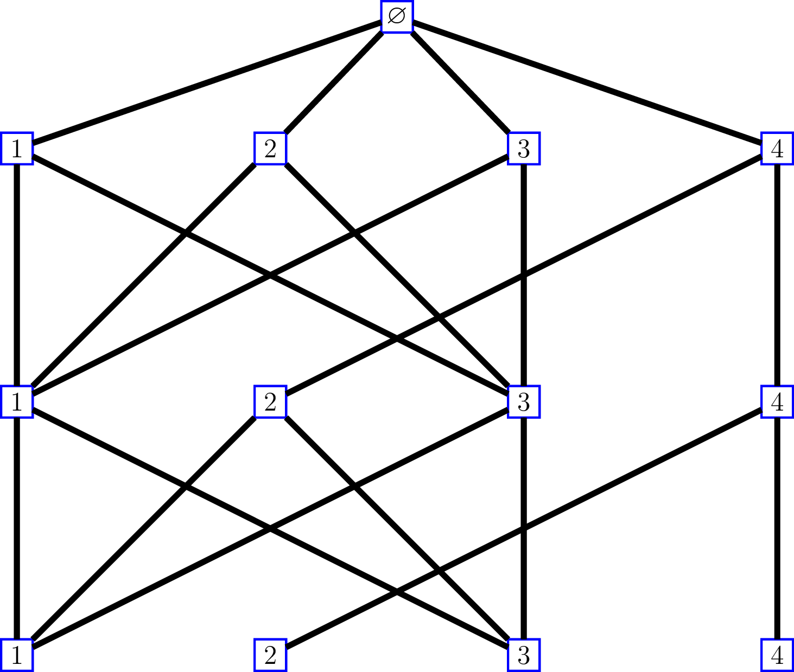
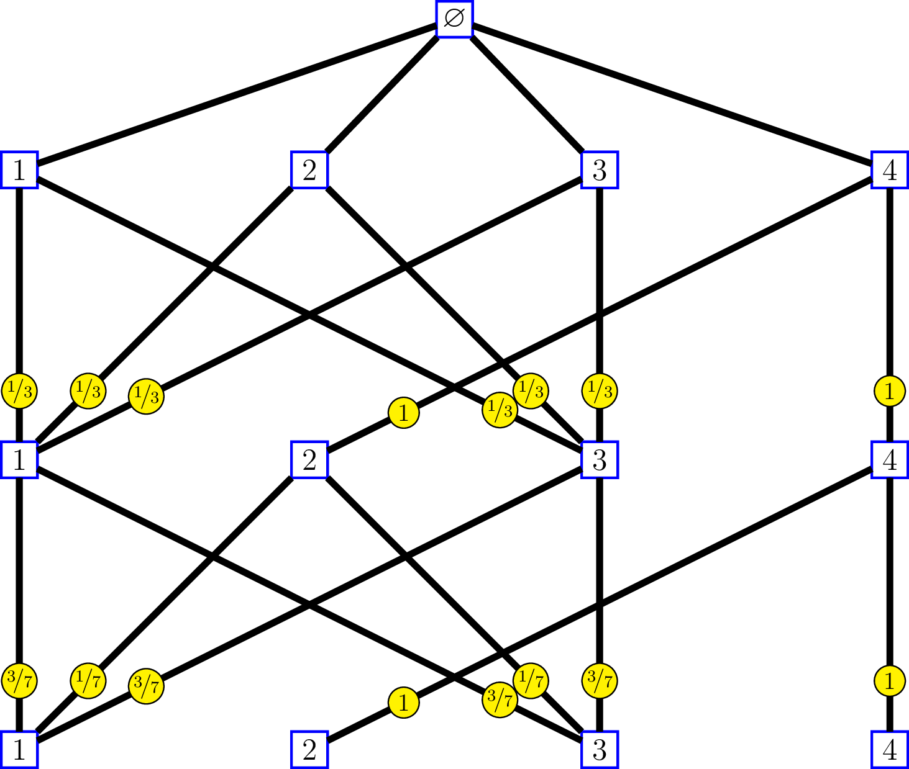
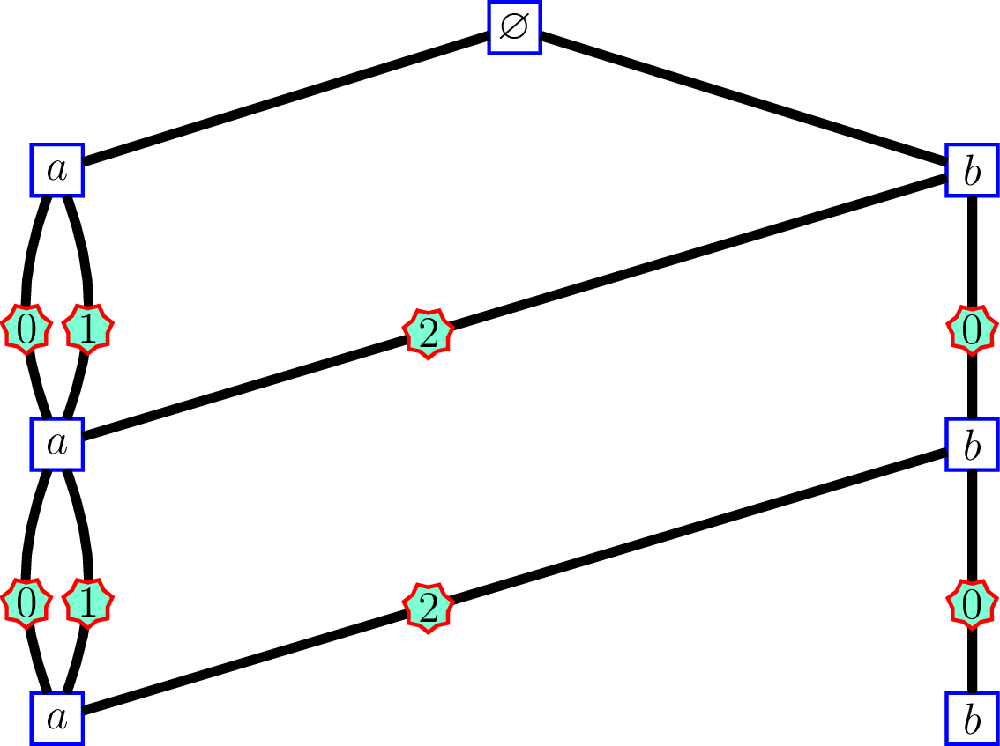
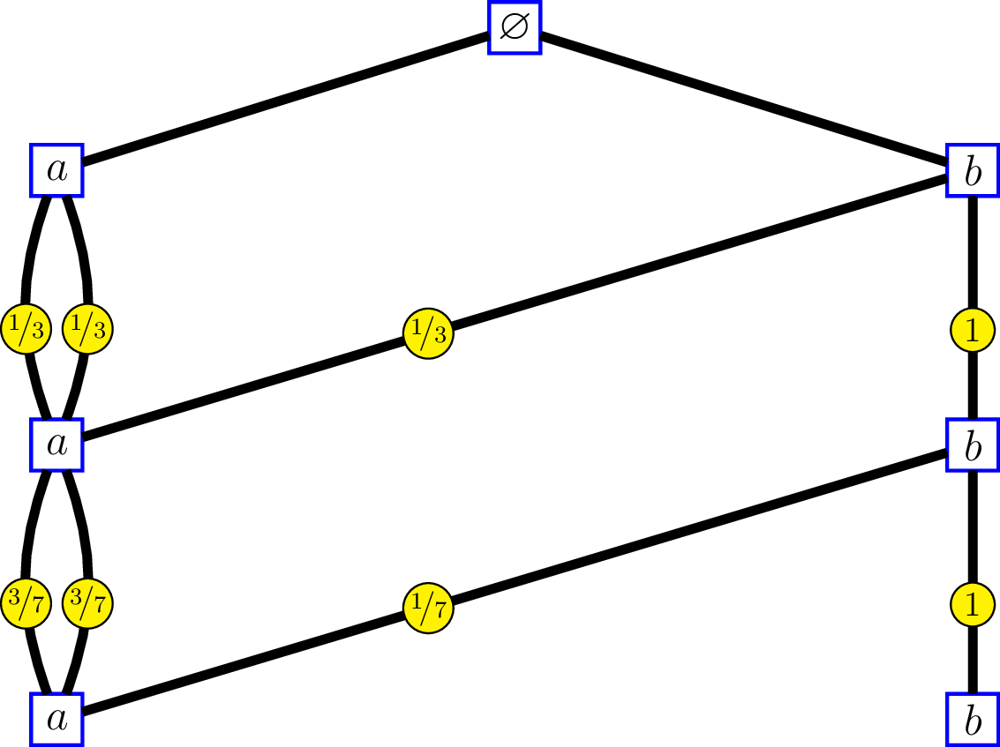

In my research in mathematics, I deal with the filtration generated by a "random walk" on a Bratteli graph, whose distribution is a *central measure*, that is to say the transition distributions from a level to the above level are the [central kernels](http://stla.github.io/stlapblog/posts/IntrinsicDistances.html). In some situations it is possible to replace the graph with another  graph having multiple edges and less vertices.

Consider for instance the following Bratteli graph:

whose incidence matrices are 
$$
M_0=\begin{pmatrix} 1 & 1 & 1 & 1 \end{pmatrix}, \, \text{and }
M_n = \begin{pmatrix}  1 &   0 &   1 &   0 \\ 
     1 &   0 &   1 &   0 \\ 
     1 &   0 &   1 &   0 \\ 
     0 &   1 &   0 &   1 
\end{pmatrix}\, \text{for } n\geq 1.
$$

The labels on the edges of the graph at the right side show the [intrinsic kernels](http://stla.github.io/stlapblog/posts/IntrinsicDistances.html). We'll come back later to that. 

Observe that the first and thirds columns of $M_n$ are the same: each of the two vertices $1$ and  $3$  at level $n$ are connected to vertices $1$,  $2$ and $3$ at level $n-1$. 
The second and fourth columns are the same as well: each of the two vertices $2$ and $4$ at level $n$ are connected to vertex $4$ at level $n-1$.

Identify an infinite path of this graph by a sequence of vertices $(v_1, v_2, \ldots)$, without including the root vertex which is useless.

On the other hand, consider the following Bratteli graph:

whose incidence matrices are 
$$
M_0 = \begin{pmatrix} 3 & 1 \end{pmatrix}, \, \text{and }
M_n = \begin{pmatrix}  2 &   0 \\ 
     1 &   1 
\end{pmatrix}\, \text{for } n\geq 1.
$$

The edges of the graph at left side are labelled by the "[order labels](http://stla.github.io/stlapblog/posts/OrderedBratteli.html)".

For this graph, identify an infinite path by the sequence $\bigl((v'_1, e_1), (v'_2, e_2), \ldots, \bigr)$ where $v'_n$ is the vertex at level $n$ and $e_n$ is the label of the edge connecting $v'_n$ and $v'_{n+1}$. 
Then there is a correspondance between the set of sequences identifying the paths of the first graph and the set of sequences identifying the paths of the second. At each level $n$:

- vertex $v_n=\,$$1$ on the first graph corresponds to $(v'_n,e_n)=(a, 0)$
- vertex $v_n=\,$$2$ on the first graph corresponds to $(v'_n,e_n)=(b, 2)$
- vertex $v_n=\,$$3$ on the first graph corresponds to $(v'_n,e_n)=(a, 1)$
- vertex $v_n=\,$$4$ on the first graph corresponds to $(v'_n,e_n)=(b, 0)$

At the right side, the labels on the edges show the intrinsic kernels.
Consider a "random walk" ${(V_n)}_{n \geq 1}$ on the first graph, whose transitions from level $n$ to level $n-1$ are given by these kernels:
$$
\begin{pmatrix}  1/3 &   1/3 &  1/3 &   0 \\ 
     0 &   0 &   0 &   1 \\ 
     1/3 &   1/3 &   1/3 &   0 \\ 
     0 &   0 &   0 &   1 
\end{pmatrix}, 
\begin{pmatrix}  3/7 &   1/7 &  3/7 &   0 \\ 
     0 &   0 &   0 &   1 \\ 
     3/7 &   1/7 &   3/7 &   0 \\ 
     0 &   0 &   0 &   1 
\end{pmatrix}, \ldots.
$$
and send ${(V_n)}_{n \geq 1}$ to a "random walk" ${(V'_n, \epsilon_n)}_{n \geq 1}$ on the second graph by the correspondance $v_n \mapsto (v'_n,e_n)$ previously seen. Therefore the reversed filtrations generated by the two random walks are isomorphic, and the transitions of  ${(V'_n, \epsilon_n)}_{n \geq 1}$ from level $n$ to level $n-1$ are given by the intrinsic kernels. 
