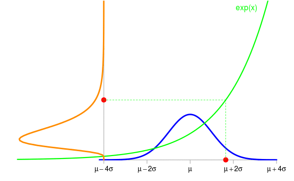
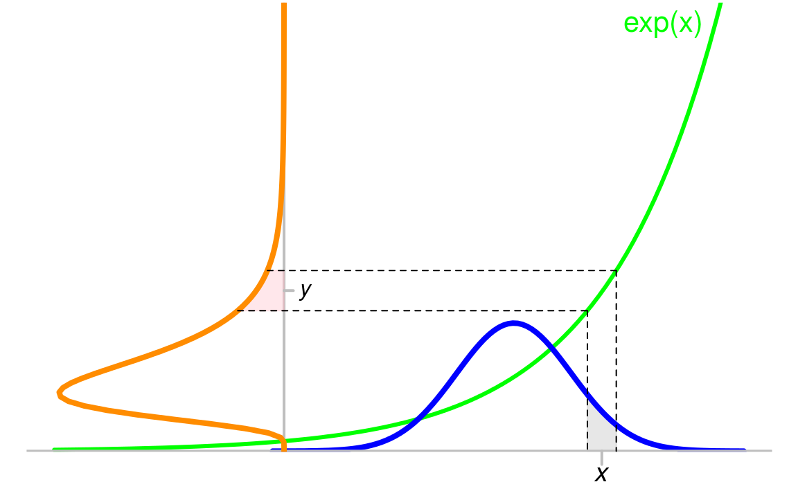

# The change of variables of formula for probability density functions
2015-12-25  

"How to derive the *pdf* of the random variable $Y=h(X)$ when one knows the *pdf* of the random variable $X$?". This question very frequently occurs on the internet. 

For a general function $h$, there is no direct formula to get the *pdf* of the random variable $Y=h(X)$ knowing the *pdf* of $X$ (assuming $X$ has a *pdf*). There is a formula in case when $h$ is a *differentiable one-to-one mapping* from the range (the *support*, I should say) of $X$ to the range of $Y$. 

Take for example a random variable $X \sim {\cal N}(\mu, \sigma^2)$ and set $Y=\exp(X)$. 
The animation below shows some simulations of $X$ and the corresponding values of $Y$. The density of $X$ is shown in blue and the one of $Y$ is shown in orange. 

Now the question is: knowing the density $f_{\textrm{blue}}$ of $X$, what is the density $f_{\textrm{orange}}$ of $Y$ ? 

Taking a point $y$ in the range of $Y$, the density $f_{\textrm{orange}}$ provides the probability that $Y$ belongs to a small area $\mathrm{d}y$ around $y$ by the formula
$$
\Pr(Y \in \mathrm{d}y) \approx f_{\textrm{orange}}(y)|\mathrm{d}y|
$$
where $|\mathrm{d}y|$ denotes the length of the small interval $\mathrm{d}y$. This formula is not a rigorous one, but it allows to do exact derivations when it is carefully used. The probability $\Pr(Y \in \mathrm{d}y)$ is the pink area on this figure: 

This probability also equals the probability $\Pr(X \in \mathrm{d}x)$, shown by the grey area below the blue curve, where $x=\log(y)$ because of $y=\exp(x)$, and $\mathrm{d}x$ is the small interval around $x$. And one similarly has 
$$
\Pr(X \in \mathrm{d}x) \approx f_{\textrm{blue}}(x)|\mathrm{d}x|. 
$$
It is clear that $|\mathrm{d}x| \neq |\mathrm{d}y|$. Recall that these two lengths are very small, hence the green function - now let us call it $h$  instead of $\exp$ - is like a segment on the interval $\mathrm{d}x$, and the slope of this segment is the value $h'(x)$ of the derivative of $h$ at $x$. Therefore $|\mathrm{d}y| \approx h'(x)|\mathrm{d}x|$, and we finally get 
$$
\Pr(Y \in \mathrm{d}y) = \Pr(X \in \mathrm{d}x)  \approx f_{\textrm{blue}}(x)\frac{|\mathrm{d}y|}{h'(x)}. 
$$
Expressing the right-hand side in terms of $y=h(x)$ instead of $x=h^{-1}(y)$, this gives 
$$
\Pr(Y \in \mathrm{d}y) \approx f_{\textrm{blue}}\bigl(h^{-1}(y)\bigr)\frac{|\mathrm{d}y|}{h'\bigl(h^{-1}(y)\bigr)}, 
$$
or, because of $\frac{1}{h'\bigl(h^{-1}(y)\bigr)}={(h^{-1})}'(y)$, this can be written 
$$
\Pr(Y \in \mathrm{d}y) \approx {(h^{-1})}'(y)\times f_{\textrm{blue}}\bigl(h^{-1}(y)\bigr)|\mathrm{d}y|.
$$
By identifying this formula by the one defining the density of $Y$:
$$
\Pr(Y \in \mathrm{d}y) \approx f_{\textrm{orange}}(y)|\mathrm{d}y|,
$$
we finally get
$$
f_{\textrm{orange}}(y) = {(h^{-1})}'(y)\times f_{\textrm{blue}}\bigl(h^{-1}(y)\bigr).
$$
This is the so-called *change of variables formula*. 

Be careful about one point: this formula is not correct in general. In my example, the factor $k$ relating $|\mathrm{d}x|$ and $|\mathrm{d}y|$ by $|\mathrm{d}y| \approx k|\mathrm{d}x|$ is $k = h'(x)$ because $h'(x)>0$ in this example ($h$ is increasing), and one has to take $k=-h'(x)$ in the case $h'(x)<0$. The general formula includes the absolute value:
$$
\boxed{f_{\textrm{orange}}(y) = \bigl|{(h^{-1})}'(y)\bigr|\times f_{\textrm{blue}}\bigl(h^{-1}(y)\bigr)}.
$$

