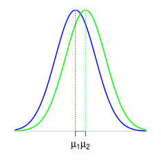
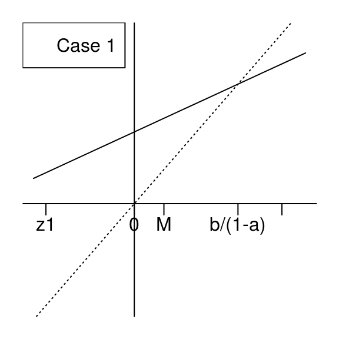
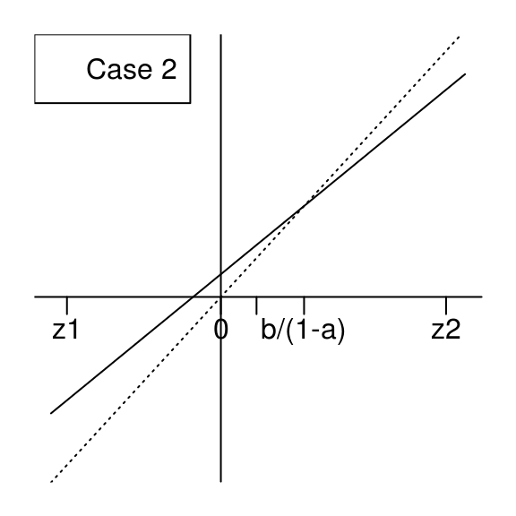
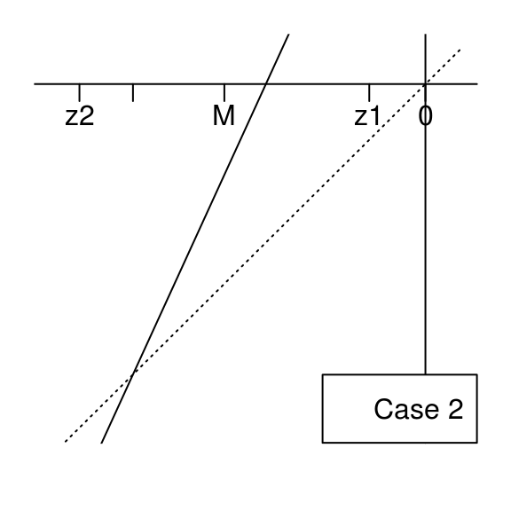

---
title: Equivalence testing based on exceedance probabilities 
date : 2015-01-06
--- &lead


## Introduction 

Equivalence testing is usually done by assessing the deviation between two 
Gaussian means $\mu_1$ and $\mu_2$.  
An acceptable deviation $\Delta$ between $\mu_1$ and $\mu_2$ has to be set by the user, and then equivalence is accepted if 
there is a statistical significant evidence that the deviation between $\mu_1$ and $\mu_2$ 
does not exceed $\Delta$. 

 

In some cases issued from fields of research such as psychology or agronomy, setting 
the acceptable deviation $\Delta$ should cause no problem for the expert: 
the psychologist has its own advice about which difference between the score means 
of two series of psychological tests is considered as expressive, and similarly 
the agronomist has its own advice about which difference between the weight means 
of two populations of fruits is considered as expressive, 

For industrial processes, the mean is not always the more relevant characteristic. 
For instance, an upper specification limit ($USL$) is given and the relevant characteristic 
of the process is the out-of-specification probability ($OOS$), that is, the probability 
that the process generates some data beyond $USL$. 

 

Some guidelines recommend to set the acceptable deviation $\Delta$ between the means by 
thinking in terms of specification limits. This requires to take into account the 
variability of the two processes under study. Once $USL$ is given, it is very 
more natural to set an acceptable deviation between the exceendance probabilities 
$OOS_1$ and $OOS_2$ rather than between the means $\mu_1$ and $\mu_2$. 
We achieve the development of this approach in this article, by providing a 
confidence interval about the difference $OOS_1-OOS_2$ between the two exceedance 
probabilities. We give a Bayesian method in the case of independant samples with equal variances, which can be similarly applied to the case of unequal variances and 
to the case of paired samples. 
Our methods are easily modified 
to handle the case of a lower specification limit as well as the case  of a 
specification two-sided interval. 


## Jeffreys posterior distribution for the ANOVA model

We assume two independent Gaussian sampling distributions sharing the same variance, that is, a one-way ANOVA model with two groups. We will perform statistical inference based on a noninformative Bayesian approach.  The `banova` function below generates the Jeffreys posterior distribution of the parameters.


```r
> banova <- function(y, group, nsims=100000){
+   group <- factor(group)
+   means <- aggregate(y~group, FUN=mean)$y # groups means
+   sizes <- table(group) # groups sizes
+   ssq <- crossprod(y-rep(means, times=sizes)) # residual sum of squares
+   sigma <- sqrt(ssq/rchisq(nsims,df=length(y)))
+   mu <- lapply(structure(1:nlevels(group), names=levels(group)),
+                function(i) rnorm(nsims, means[i], sigma/sqrt(sizes[i])))
+   return(data.frame(mu, sigma=sigma))
+ }
```

The model has three parameters $\mu_1$, $\mu_2$ and $\sigma$ and their posterior simulations are stored in a data frame. Let us see an example with a simulated balanced dataset with $20$ observations in each group:


```r
> I <- 2 # number of groups
> J <- 20 # number of replicates per group
> mu <- c(2,2.5) # group means
> sigma <- 1 # standard deviation within each group
> group <- gl(I, J, labels=sprintf("group%s", 1:I)) # groups
> set.seed(666)
> y <- c(sapply(mu, function(mu) rnorm(J, mu, sigma))) # response
```

The theoretical model is given by this picture:

 


The `banova` function takes a short time to generate $10^6$ samples of the posterior distribution:


```r
> system.time(sims <- banova(y, group, nsims = 1e+06))
   user  system elapsed 
  0.579   0.037   0.618 
> head(sims,3)
```


|   group1|   group2|    sigma|
|--------:|--------:|--------:|
| 1.905582| 2.146182| 1.099777|
| 1.836148| 2.097849| 1.259851|
| 1.773983| 2.618615| 1.103276|


## Frequentist matching property

An appealing property of the Jeffreys posterior distribution is the so-called *frequentist matching property*. That means that the posterior $100(1-\alpha)\%$-credibility intervals of a parameter of interest approximately have a $100(1-\alpha)\%$ frequentist coverage. This is not true in general for any model, and this is not true for any parameter of interest, but say it is expected to be true in general.

Here for example, this is true for the group means $\mu_1$ and $\mu_2$. They have a tractable posterior distribution, each of them follows a  scaled Student distribution centered around the least-squares estimates. Thus, the posterior means coincide with the least-square estimates:


```r
> names(sims)[1:2] <- c("µ1", "µ2")
> sapply(sims, mean)
      µ1       µ2    sigma 
2.001408 2.246180 1.197806 
> fit <- lm(y~0+group)
> coef(fit)
groupgroup1 groupgroup2 
   2.001438    2.246584 
```

Equi-tailed posterior credibility intervals are obtained by taking the quantiles of the posterior distributions:


```r
> sapply(sims, function(x) quantile(x, c(2.5, 97.5)/100))
```


|      |       µ1|       µ2|     sigma|
|:-----|--------:|--------:|---------:|
|2.5%  | 1.470561| 1.715085| 0.9649394|
|97.5% | 2.532203| 2.776631| 1.5032790|

We can get them without using the simulations with the help of the Student quantiles:


```r
> S2 <- crossprod(residuals(fit)) # sum of squares
> freqs <- sapply(unique(group), function(label) length(which(group==label))) # group sizes
> n <- sum(freqs)
> indexes <- setNames(1:I, paste0("µ", 1:I))
> vapply(indexes, function(i) coef(fit)[i] + sqrt(S2/(n*freqs[i]))*qt(c(2.5, 97.5)/100, n), FUN.VALUE=numeric(2))
```


|       µ1|       µ2|
|--------:|--------:|
| 1.470352| 1.715497|
| 2.532525| 2.777670|

This formula of the interval limits is close to the one giving the classical confidence interval (provided by `confint(fit)`):


```r
> vapply(indexes, function(i) coef(fit)[i] + sqrt(S2/(freqs[i]*(n-I)))*qt(c(2.5, 97.5)/100, n-I), FUN.VALUE=numeric(2))
```


|       µ1|       µ2|
|--------:|--------:|
| 1.455661| 1.700806|
| 2.547216| 2.792362|

The frequentist interval is a bit wider, and the difference disappears as $n$ increase.


## Comparing the OOS

Something very cool with the posterior simulations is the straightforward way to get posterior simulations of any quantity of interest $\theta=f(\mu_1, \mu_2, \sigma)$ by simply applying the function $f$ to the posterior simulations of $(\mu_1, \mu_2, \sigma)$. 
Here we are interested in the difference between $OOS_1$ and $OOS_2$, the probabilities to get an observation above $USL$ in twe two groups, for a given upper specification limit $USL$. The first one is $1-\Phi\left(\frac{USL-\mu_1}{\sigma}\right)$ and the second one is  $1-\Phi\left(\frac{USL-\mu_2}{\sigma}\right)$, thus we get the credibility intervals as follows, taking $USL=4$:


```r
> library(dplyr) 
> USL <- 4
> sims1 <- mutate(sims, OOS1 = 100*(1-pnorm(USL, µ1, sigma)), OOS2 = 100*(1-pnorm(USL, µ2, sigma)), Delta=OOS2-OOS1),
> kable(sims1 %>% reshape2::melt() %>% group_by(variable) %>% summarise(estimate=mean(value), lwr=quantile(value, 2.5/100), upr=quantile(value, 97.5/100)), digits=2, caption="Jeffreys estimates and $95\\%$-credibility intervals")
```


|variable | estimate|   lwr|   upr|
|:--------|--------:|-----:|-----:|
|µ1       |     2.00|  1.47|  2.53|
|µ2       |     2.25|  1.72|  2.78|
|sigma    |     1.20|  0.96|  1.50|
|OOS1     |     5.24|  1.16| 13.14|
|OOS2     |     7.65|  2.11| 17.32|
|Delta    |     2.41| -5.33| 11.36|

Note that the intervals around $OOS_1$, $OOS_2$ and $\Delta$ are quite large. That shows that the estimates are far to be precise. 

**(R point) The pipe operator `%>%`.** As you see, I used the `%>%` operator in the previous code block. This operator is provided by the `magrittr` package, which is automatically loaded here by loading the `dplyr` package. 
In case you don't know this operator, I will explain a shorter example in the next section. Here we use it in order to avoid to nest too many functions : `summarise(group_by(reshape2::melt(sims1, ...`. 


## Looking at the deviation in function of $USL$

It is interesting to look at the $OOS$ deviation in function of $USL$. For our example, here is the theoretical picture:

 

The maximal value of the $OOS$ deviation $\Delta$ is called the *Kolmogorov distance* between the two distributions. In our case of two Gaussian distributions with equal variances, it is attained for $USL=\dfrac{\mu_1+\mu_2}{2\sigma}$ (see the derivation in the Appendix), and shown by the orange line on the figure. 

Thus, we could derive an estimate and a credibility interval around the Kolmogorov distance, that is to say the maximal deviation between $OOS_1$ and  $OOS_2$ over all possible values of $USL$:

```r
> Kdist <- function(µ1, µ2, sigma) ((µ1+µ2)/2/sigma) %>% {pnorm(., µ1, sigma) - pnorm(., µ2, sigma)} %>% abs
> Kdist_sims <- with(sims, 100*Kdist(µ1, µ2, sigma))
> mean(Kdist_sims); quantile(Kdist_sims, probs = c(2.5,97.5)/100)
[1] 11.54142
      2.5%      97.5% 
 0.4700835 31.1350492 
```

But this is not really releveant in the context of $OOS$. It is clear on our example where $\sigma=1$ that we are not interested in the deviation $\Delta$ for a value of $USL$ such as  
 $USL=\dfrac{\mu_1+\mu_2}{2\sigma}$. In practice the value of $USL$ is usually located in the upper tails of the two Gaussian distributions. 

**(R point) The pipe operator `%>%`.** As promised, I detail an example of the use of the `%>%` operator.  Without this operator, I would have defined the `Kdist` function as follows:


```r
> Kdist <- function(µ1, µ2, sigma) abs(pnorm((µ1+µ2)/2/sigma, µ1, sigma) - pnorm((µ1+µ2)/2/sigma, µ2, sigma))
```
or, in order to avoid the double calculation of `(µ1+µ2)/2/sigma`:

```r
> Kdist <- function(µ1, µ2, sigma){
+   x <- (µ1+µ2)/2/sigma
+   abs(pnorm(x, µ1, sigma) - pnorm(x, µ2, sigma))
+ }
```
Here, the pipe operator `%>%` firstly allows up to map `(µ1+µ2)/2/sigma` conveniently:

```r
> ((µ1+µ2)/2/sigma) %>% {pnorm(., µ1, sigma) - pnorm(., µ2, sigma)}
```
Then the result is mapped to the `abs` function by adding `%>% abs` (equivalently `%>% abs(.)`), instead of encapsulating the result `abs(...)`. 


Now we calculate and plot the estimate of $\Delta$ and its credibility interval in function of $USL$. 


```r
> library(tidyr) # to use spread()
> sims <- reshape2::melt(data.frame(id=1:nrow(sims), sims), id.vars=c("id", "sigma"), value.name="µ", variable.name="group")
> levels(sims$group) <- c("group1", "group2")
> head(sims, 3)
```


| id|    sigma|group  |        µ|
|--:|--------:|:------|--------:|
|  1| 1.099777|group1 | 1.905582|
|  2| 1.259851|group1 | 1.836148|
|  3| 1.103276|group1 | 1.773983|

```r
> usl <- seq(0,5, by=0.25)
> sims <- data.frame(sims[,c("id","group")], setNames(lapply(usl, function(USL) 100*(1-pnorm(USL, sims$µ, sims$sigma))), paste0("OOS_", usl))) %>% 
+   cbind(USL=usl, reshape2::melt(., id.vars=c("group","id")) %>% spread(group, value) %>% 
+           mutate(Delta=group2-group1) %>% group_by(variable) %>% summarise(estimate=mean(Delta), lwr=quantile(Delta, 2.5/100), upr=quantile(Delta, 97.5/100)))[,-2]
Error in xj[i]: type 'list' d'indice incorrect
> head(sims,3)
```


| id|    sigma|group  |        µ|
|--:|--------:|:------|--------:|
|  1| 1.099777|group1 | 1.905582|
|  2| 1.259851|group1 | 1.836148|
|  3| 1.103276|group1 | 1.773983|


```r
> library(ggplot2)
> ggplot(sims, aes(x=USL)) + geom_line(aes(y=estimate)) +
+   geom_ribbon(aes(ymin=lwr, ymax=upr), alpha=0.1) +
+   ylab(expression(Delta)) + 
+   stat_function(fun=function(USL) 100*(pnorm(USL, mu[1], sigma)-pnorm(USL, mu[2], sigma)), color="red")
Error in eval(expr, envir, enclos): objet 'estimate' introuvable
```

The theoretical deviation is shown by the red curve, the estimated deviation is shown by the black curve. We still note how large are the credibility intervals, especially around the maximual value of the deviation.

## Appendix: Kolmogorov distance between two Gaussian distributions

Our purpose is to give an expression for the Kolmogorov distance $K(\mu_1,\sigma_1,\mu_2,\sigma_2)$ between the two Gaussian distributions  ${\cal N}(\mu_1, \sigma_1^2)$ and ${\cal N}(\mu_2, \sigma_2^2)$, defined by
 $$K(\mu_1,\sigma_1,\mu_2,\sigma_2) = \sup_{t \in \mathbb{R}} \bigl|\Pr(X \leq t) - \Pr(Y \leq t) \bigr|$$ with $X \sim {\cal N}(\mu_1, \sigma_1^2)$ and $Y \sim {\cal N}(\mu_2, \sigma_2^2)$.
 
Writing 
$$\Pr(X \leq t) - \Pr(Y \leq t) = \Pr\left(\frac{X-\mu_1}{\sigma_1} \leq \frac{t-\mu_1}{\sigma_1}\right) - \Pr\left(\frac{Y-\mu_2}{\sigma_2} \leq \frac{t-\mu_2}{\sigma_2}\right),$$
the expression we are looking for is obtained from the expression of 
 $$\sup_{z \in \mathbb{R}} \bigl|\Pr(Z_1 \leq z) - \Pr(Z_2 \leq az+b) \bigr|$$ with $Z_1, Z_2 \sim {\cal N}(0, 1)$ and $a>0$, by setting $a=\frac{\sigma_1}{\sigma_2}$ and $b=\frac{\mu_1-\mu_2}{\sigma_2}$. 
 Thus 
 $$K(\mu_1,\sigma_1,\mu_2,\sigma_2) = \sup_{z \in \mathbb{R}} \bigl|\Psi_{a,b}(z) \bigr|$$ 
 where $\Psi_{a,b}$ is the function defined by 
  $$\Psi_{a,b}(z)= \Phi(z) - \Phi(az+b)$$ 
for the values of $a$ and $b$ given above. By symmetry one can also take $a=\frac{\sigma_2}{\sigma_1}$ and $b=\frac{\mu_2-\mu_1}{\sigma_1}$, and then it suffices to focus on the case $b \geq 0$. 


By elementary calculus, the derivative of $\Psi_{a,b}$ is given by 
$$
{\Psi'}_{a,b}(z) =\frac{e^{-\frac{1}{2}z^2}-a e^{-\frac{1}{2} (b+a z)^2}}{\sqrt{2 \pi }}. 
$$
Discarding the trivial case $a=1$ and $b=0$, then ${\Psi_{1,b}}'(z)$ has a unique root at $z=-\frac{b}{2}$, and if $a\neq 1$ then ${\Psi_{a,b}}'(z)$ has two roots at 
$$ z_i= \frac{a b + {(-1)}^i \sqrt{b^2 + 2 (a^2-1) \log(a)}}{1-a^2}, \qquad i=1,2,$$
which we also write 
$$z_i = M + {(-1)}^i \Delta$$ 
where $M=\frac{a b}{1-a^2}$ and $\Delta=\frac{\sqrt{b^2 + 2 (a^2-1) \log(a)}}{1-a^2}$. 

Now we assume $0 < a < 1$ and $b \geq 0$, hence one has $0 \leq M \leq \frac{b}{1-a}$ and $\Delta>0$. Obviously $z_2>0$ and it is not hard to see that $z_1<0$.  
Furthermore, note that 
$$(az_i+b) -z_i =
\frac{b}{1+a} + {(-1)}^{i-1} (1-a)\Delta,$$ 
hence  $(az_1+b) -z_1 >0$, and note that 
$$\bigl((az_1+b) -z_1\bigr)\bigl((az_2+b) -z_2\bigr)=\frac{2 (1-a)\log(a)}{1+a} < 0,$$
therefore  $(az_2+b) - z_2 < 0$. 
Finally, in the case when $0 < a < 1$ and $b \geq 0$, one has 
$z_1 < 0 \leq M \leq \frac{b}{1-a} < z_2$ and we will now consider the two situations shown by these figures:

 
 

We will show that the supremum of $\bigl|\Psi_{a,b}\bigr|$ is attained at $z_1$ in both cases. 
Note that $\bigl|\Psi_{a,b}(z_1)\bigr|=\Psi_{a,b}(z_1)$ is the standard Gaussian measure of the interval $I_1=[z_1, az_1+b]$ and  $\bigl|\Psi_{a,b}(z_2)\bigr|=-\Psi_{a,b}(z_2)$ is the standard Gaussian measure of the interval $I_2=[az_2+b, z_2]$. The length of $I_1$ is always larger than the one of $I_2$. If $az_1+b \geq 0$ (case $1$), then $I_1$ contains $0$, and then it is clear that the standard Gaussian measure of $I_1$ is larger than the one of $I_2$ in this case. If $az_1+b < 0$ (case $2$), then one has $|az_1+b| < az_2+b$ because of the equality 
$$(az_1+b)+(az_2+b)=\frac{b}{a^2-1} \geq 0,$$
which is easy to get by elementary calculus. Therefore the  standard Gaussian measure of $I_1$  is larger than the one of $I_2$ also in case $2$. 

By doing similar considerations, the  case $a > 1$ and $b \geq 0$ is summarized by the two 
figures below, and we show by the same approach that  the supremum of $\bigl|\Psi_{a,b}\bigr|$ is attained at $z_1$. 


 
 

The R function `Kdist` below returns the Kolmogorov distance:


```r
Kdist00 <-  function(a,b){
  z <- (a * b - sign(b) * sqrt(b^2 + 2 * (a^2 - 1) * log(a)))/(1 - a^2)
  out <- pnorm(a*z+b)-pnorm(z)
  attr(out, "where") <- z
  return(out)
}
Kdist0 <- function(mu1,sigma1,mu2,sigma2){
  b <- (mu1-mu2)/sigma2
  a <- sigma1/sigma2
  if(b>=0){
    out <- Kdist00(a,b) 
    attr(out, "where") <- mu1 + sigma1*attr(out, "where")
    return(out)
  }else{
    return(Kdist0(mu2,sigma2,mu1,sigma1))
  }
}
Kdist <- function(mu1,sigma1,mu2,sigma2){
  if(sigma1==sigma2){
    where <- -(mu1-mu2)/sigma2/2
    out <-  abs(pnorm(where)-pnorm(-where))
    attr(out, "where") <- where
    return(out)
  }
  return(Kdist0(mu1,sigma1,mu2,sigma2))
}
```

