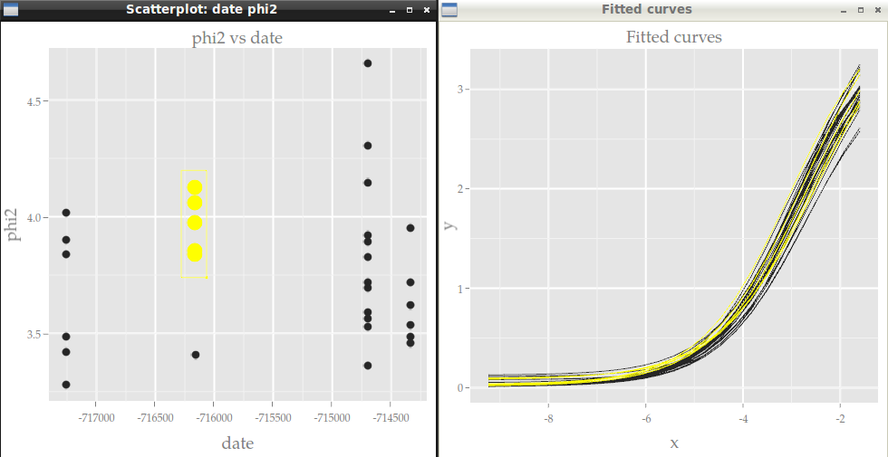

```{r setup, include=FALSE}
library(knitr)
opts_chunk$set(collapse=TRUE, fig.path="assets/fig/GGobi_FPL-")
library(magrittr)
library(dplyr)
options(dplyr.width = 65)
# replace cat with message in order to suppress
myprint.trunc_mat <- function (x, ...) 
{
  if (!is.null(x$table)) {
    print(x$table)
  }
  if (length(x$extra) > 0) {
    var_types <- paste0(names(x$extra), " (", x$extra, ")", 
                        collapse = ", ")
    message(dplyr:::wrap("Variables not shown: ", var_types), "\n", sep = "")
  }
  invisible()
}
assignInNamespace("print.trunc_mat", myprint.trunc_mat, "dplyr")
```

```{r load_data, include=FALSE}
# dat0 <- read.csv("./data/WT1dat0.csv")
# nexp <- 30
# dat0 <- dat0[,c(200,1:nexp)]
# dat1 <- read.csv("./data/WT1dat1.csv", colClasses = c(date="Date"))
# library(dplyr)
# dat1 <- dat1  %>% select(Manip, date) %>% filter(Manip %in% names(dat0)) %>% droplevels %>% rename(experiment=Manip)
# dat0 <- dat0  %>% setNames(c("concentration",myutils::charseq(nexp, prefix="M")))
# levels(dat1$experiment) <- names(dat0)[-1] # ok car même ordre
dat0 <- read.csv("./data/GGobiFPLdat0.csv")
dat1 <- read.csv("./data/GGobiFPLdat1.csv")
```

This article shows an example of interactive data visualization in R using [GGobi](http://www.ggobi.org/) and its successor [Cranvas](http://cranvas.org/). A very interesting feature of these two visualization tools is their ability to link two different datasets, and this is such an example I provide here. 

Firstly I am going to fit some parametric curves to a set of data, and then I will show how to create interactive and linked plots of these curves on one graphic and of their parameters on another graphic. 

## Loading data and fitting the curves 

Assume for example we have some data with an input variable in the first column and each other column, corresponding to an experiment, contains the values of a measurement made for each value of the input:

```{r, message=TRUE}
library(dplyr) # I use the dplyr format for a better printing 
dat0 <- read.csv("./data/GGobiFPLdat0.csv") %>% tbl_df
print(dat0, n=5)
```

In this example we fit a four-parameter logistic curve for each of the outcome columns:

```{r fit, message=FALSE}
# first melt the data
library(tidyr)
ldat0 <- dat0 %>% gather(experiment, value, -concentration)
# fit 
library(nlme)
fit <- nlsList(value~SSfpl(log(concentration), phi1, phi2, phi3, phi4) | experiment, data=ldat0, na.action=na.omit) 
Params <- coef(fit)
Params %>% glimpse(width=70)
```

Recall that the four-parameter logistic curve is defined by
$$
y = \phi_1 + \frac{\phi_2-\phi_1}{1+\exp\left(\dfrac{\phi_3-x}{\phi_4}\right)}.
$$
It can be shown on the figure below, taken from the book *Mixed Effects Models in S and SPlus* by Pinheiro and Bates. 

<div style="text-align:center">

</div>

Some softwares such as SAS and SoftmaxPro use a different parametrization of the four-parameter logistic function: instead of $\phi_1$, $\phi_2$, $\phi_3$, $\phi_4$, they use four parameters denoted by $A$, $B$, $C$, $D$ and the relations between these two different parameterizations are
$$
A=\phi_1, \qquad \frac{1}{B}=\phi_4, \qquad \log C = \phi_3, \qquad D=\phi_2.
$$
If you prefer this parametrization, then you could do `SSfpl(log(concentration), A, D, logC, inverseB)` in the `nlsList` function above.

Now, another dataset provides some information about the experiments, such as the date, and we merge it with the fitted parameters:

```{r showdat1}
( dat1 <- read.csv("./data/GGobiFPLdat1.csv", colClasses = c(date="Date")) %>% tbl_df )
( Params <- merge(dat1, Params, by.x="experiment", by.y="row.names") %>% tbl_dt )
```

Note that I transformed the dataset to a local data *table* by using `tbl_dt`. This is nice for making the dataset I will use to plot the fitted curves:

```{r fittedcurves, message=FALSE}
# four-parameter logistic function
fpl <- function(x,phi1,phi2,phi3,phi4){
  phi1+(phi2-phi1)/(1+exp((phi3-x)/phi4))
}
x <- with(dat0, seq(min(log(concentration)), max(log(concentration)), length.out=25))
Curves <- Params[, c(.SD, list(x=x, y=fpl(x,phi1,phi2,phi3,phi4))), by="experiment"]
library(ggplot2); library(scales)
ggplot(Curves, aes(x=x, y=y, color=experiment)) + geom_line()
```


## Using GGobi

As we can see, the legend does not allow to identify a curve: there are too many. 
This is an opportunity to use *GGobi* with the help of the **rggobi** package:

```{r ggobi1, eval=FALSE}
library(rggobi)
# put x and y in the first and second column
ggdata1 <- data.frame(Curves)[, taRifx::shift(seq_along(Curves), -2)]
g <- ggobi_longitudinal(ggdata1, id=experiment)
```

The above line of code opens *GGobi*. We firstly select `Brush` in the `Interaction` menu to get the graphics at left below. 
Then we select `Identify` in the same menu and get the graphics at right. 

<div style="text-align:center">
  
  
  <p style="clear: both;">
</div>

Now, let's look at the parameters in function of the date:

```{r paramsvsdate, fig.width=7, fig.height=5}
lParams <- Params %>% gather(parameter, value, -experiment, -date)
ggplot(lParams, aes(x=date, y=value)) +  geom_point() + 
  facet_grid(parameter~., scales="free_y") +
  scale_x_date(labels = date_format("%m-%Y"))
```

And let's plot each parameter vs each other on a scatter matrix:

```{r scatterparams, message=FALSE, warning=FALSE, fig.width=6, fig.height=6}
library(GGally)
ggpairs(Params[, list(phi1,phi2,phi3,phi4)])
```

Similarly, we would like to know which experiment corresponds to one point, or even which curve. 
So we add the `Params` dataset to *GGobi* and we open a new display:

```{r ggobi2, eval=FALSE}
ggdata2 <- data.frame(Params)
# GGobi does not handle the Date format - convert in integer
ggdata2 <- transform(ggdata2, ndate=as.integer(date))
g$ggdata2 <- ggdata2 
display(g["ggdata2"], vars=list(X="ndate", Y="phi2"))
```

And now this becomes really fun. We can create several graphics from the two datasets and they are linked to each other:

<div style="text-align:center">
<video width="620" controls="controls">
<source src="./assets/img/ggobi/ggobi_3win.ogg" type='video/ogg'/>
<source src="./assets/img/ggobi/ggobi_3win.mp4" type='video/mp4'/>
<source src="./assets/img/ggobi/ggobi_3win.webm" type='video/webm'/>
<p>This is fallback content</p>
</video>
</div>

## Using Cranvas

Now let's do the same with *Cranvas* instead of *GGobi*, except that scatter matrices are not implemented yet in *Cranvas*.

```{r cranvas, eval=FALSE}
library(cranvas)
qdata1 <- qdata(data.frame(Curves))
qdata2 <- qdata(data.frame(Params)) 
qtime(x, y, data=qdata1, hdiv=experiment, main="Fitted curves")
qscatter(date, phi2, data=qdata2, main="phi2 vs date")
# link the two datasets 
id <- link_cat(qdata1, "experiment", qdata2, "experiment")
```

<div style="text-align:center">
   
</div>

Contrary to *GGobi*, there is no standalone *Cranvas* software. Everything is run from R with the **cranvas** package, but some keyboard keys act on the graphics, for example to zoom or to change the size of points (see `?qtime`, `?qscatter`, etc).
