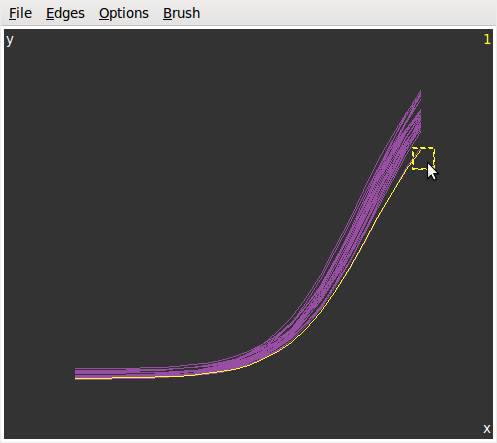

```{r setup, include=FALSE}
library(knitr)
opts_chunk$set(collapse=TRUE, fig.path="assets/fig/GGobi_FPL-")
library(magrittr)
library(dplyr)
options(dplyr.width = 60)
# replace cat with message in order to suppress
myprint.trunc_mat <- function (x, ...) 
{
  if (!is.null(x$table)) {
    print(x$table)
  }
  if (length(x$extra) > 0) {
    var_types <- paste0(names(x$extra), " (", x$extra, ")", 
                        collapse = ", ")
    message(dplyr:::wrap("Variables not shown: ", var_types), "\n", sep = "")
  }
  invisible()
}
assignInNamespace("print.trunc_mat", myprint.trunc_mat, "dplyr")
```


```{r load_data, include=FALSE}
dat0 <- read.csv("./data/WT1dat0.csv")
nexp <- 30
dat0 <- dat0[,c(200,1:nexp)]
dat1 <- read.csv("./data/WT1dat1.csv", colClasses = c(date="Date"))
library(dplyr)
dat1 <- dat1  %>% select(Manip, date) %>% filter(Manip %in% names(dat0)) %>% droplevels %>% rename(experiment=Manip)
dat0 <- dat0  %>% setNames(c("concentration",myutils::charseq(nexp, prefix="M")))
levels(dat1$experiment) <- names(dat0)[-1] # ok car même ordre
```

Assume for example you have some data with an input variable in the first column and each other column, corresponding to an experiment, contains the values of a measurement made for each value of the input:

```{r, message=TRUE}
# we use the dplyr format to print 
library(dplyr)
dat0 <- tbl_df(dat0)
print(dat0, n=5)
```

In our example we fit a four-parameter logistic curve for each of the outcome columns:

```{r fit, message=FALSE}
# first melt the data
library(tidyr)
ldat0 <- dat0 %>% gather(experiment, value, -concentration)
# fit 
library(nlme)
fit <- nlsList(value~SSfpl(log(concentration), A, D, logC, inverseB) | experiment, data=ldat0, na.action=na.omit) 
Params <- coef(fit)
Params %>% glimpse(width=70)
```

Another dataset provides some information about the experiments, such as the date, and we merge it with the fitted parameters:

```{r showdat1}
( dat1 <- tbl_df(dat1) )
( Params <- merge(dat1, Params, by.x="experiment", by.y="row.names") %>% tbl_dt )
```

Note that I transformed the dataset to a local data table with `tbl_dt`. This is nice for making the dataset used to plot the fitted curves:

```{r fittedcurves}
# four-parameter logistic function, message=FALSE 
fpl <- function(x,phi1,phi2,phi3,phi4){
  phi1+(phi2-phi1)/(1+exp((phi3-x)/phi4))
}
x <- with(dat0, seq(min(log(concentration)), max(log(concentration)), length.out=25))
#Curves <- merge(Params, Params[, list(x=x, y=fpl(x,A,D,logC,inverseB)), by="experiment"], by="experiment")
Curves <- Params[, c(.SD, list(x=x, y=fpl(x,A,D,logC,inverseB))), by="experiment"]
library(ggplot2); library(scales)
ggplot(Curves, aes(x=x, y=y, color=experiment)) + geom_line()
```

As we see, the legend does not allow to identify a curve: there are too many. 
This is an opportunity to use ***GGobi*** with the help of the **rggobi** package:

```{r ggobi1, eval=FALSE}
library(rggobi)
# put x and y in the first and second column
ggdata1 <- data.frame(Curves)[, taRifx::shift(seq_along(Curves), -2)]
g <- ggobi_longitudinal(ggdata1, id=experiment)
```

The above line of code opens `GGobi`. We firstly select `Brush` in the `Interaction` menu to get the graphics at left below. 
Then we select `Identify` in the same menu and get the graphics at right. 

<div style="text-align:center">
  
  
  <p style="clear: both;">
</div>

Now, let's look at the parameters in function of the date:

```{r paramsvsdate, fig.width=7, fig.height=5}
lParams <- Params %>% gather(parameter, value, -experiment, -date)
ggplot(lParams, aes(x=date, y=value)) +  geom_point() + 
  facet_grid(parameter~., scales="free_y") +
  scale_x_date(labels = date_format("%m-%Y"))
```

And let's plot each parameter vs each other on a scatter matrix:

```{r scatterparams, message=FALSE, warning=FALSE, fig.width=6, fig.height=6}
library(GGally)
ggpairs(Params[, list(A,D,logC,inverseB)])
```

Similarly, we would like to know which experiment corresponds to one point, or even which curve. 
So we add the `Params` dataset to *GGobi* and we open a new display:

```{r ggobi2, eval=FALSE}
ggdata2 <- data.frame(Params)
# GGobi does not handle the Date format - convert in integer
ggdata2 <- transform(ggdata2, ndate=as.integer(date))
g$ggdata2 <- ggdata2 
display(g["ggdata2"], vars=list(X="ndate", Y="A"))
```

And this becomes really fun. We can create several graphics from the two datasets and they are linked to each other:

<div style="text-align:center">
   
</div>

## Using Cranvas 

```{r cranvas, eval=FALSE}
library(cranvas)
qdata1 <- qdata(data.frame(Curves))
qdata2 <- qdata(data.frame(Params)) 
qtime(x, y, data=qdata1, hdiv=experiment)
qscatter(date, D, data=qdata2)
# link the two datasets 
id <- link_cat(qdata1, "experiment", qdata2, "experiment")
```

<div style="text-align:center">
   
</div>
