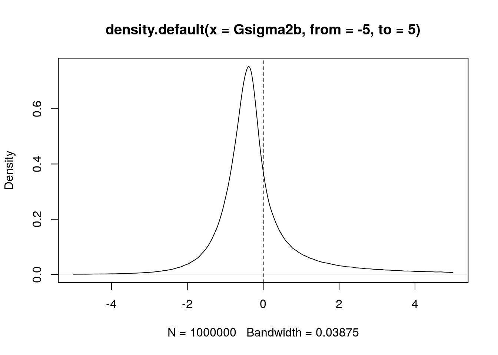
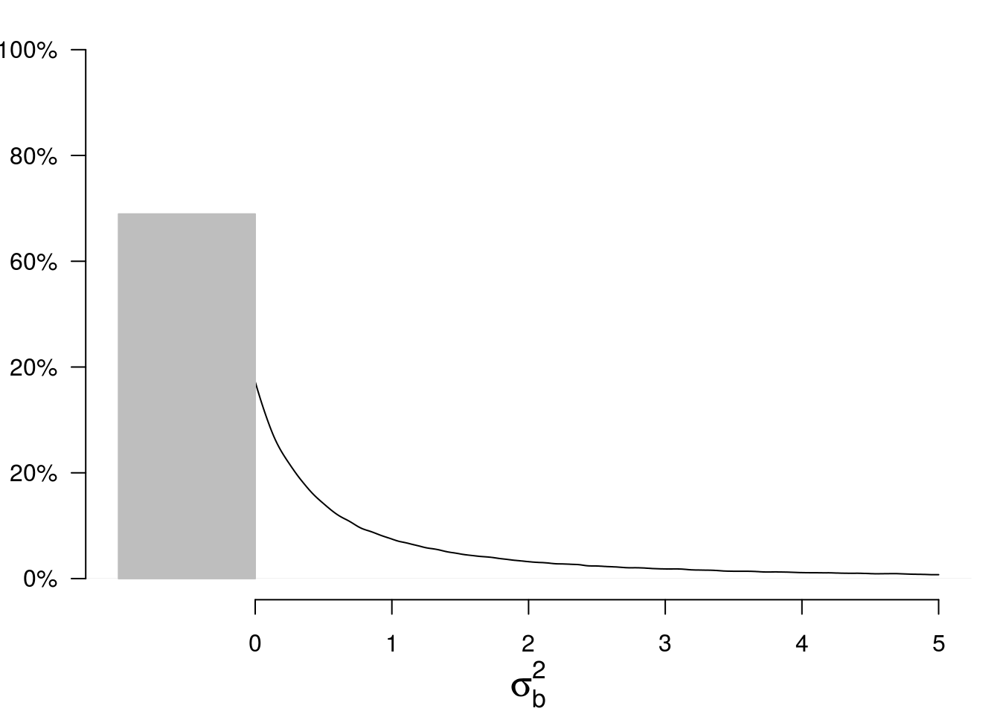
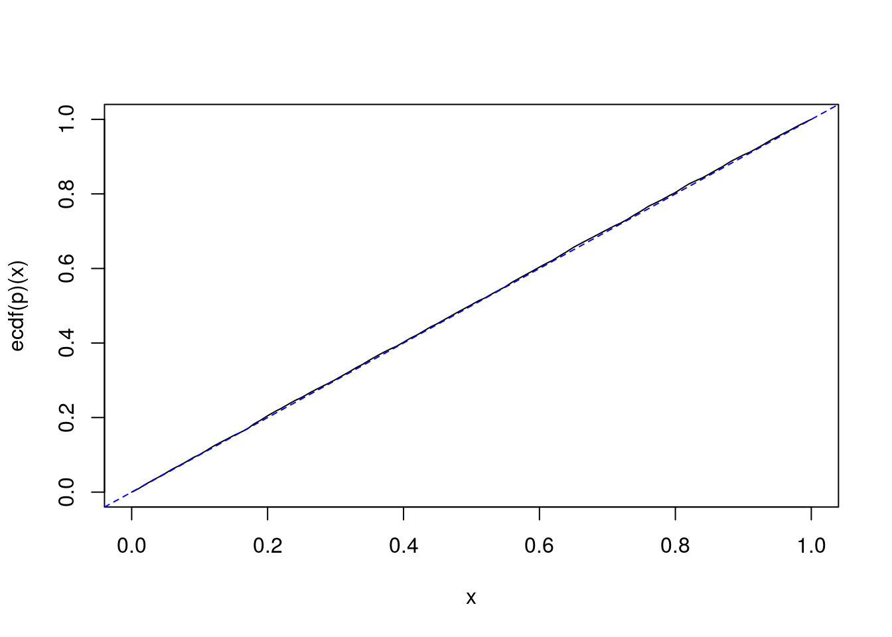
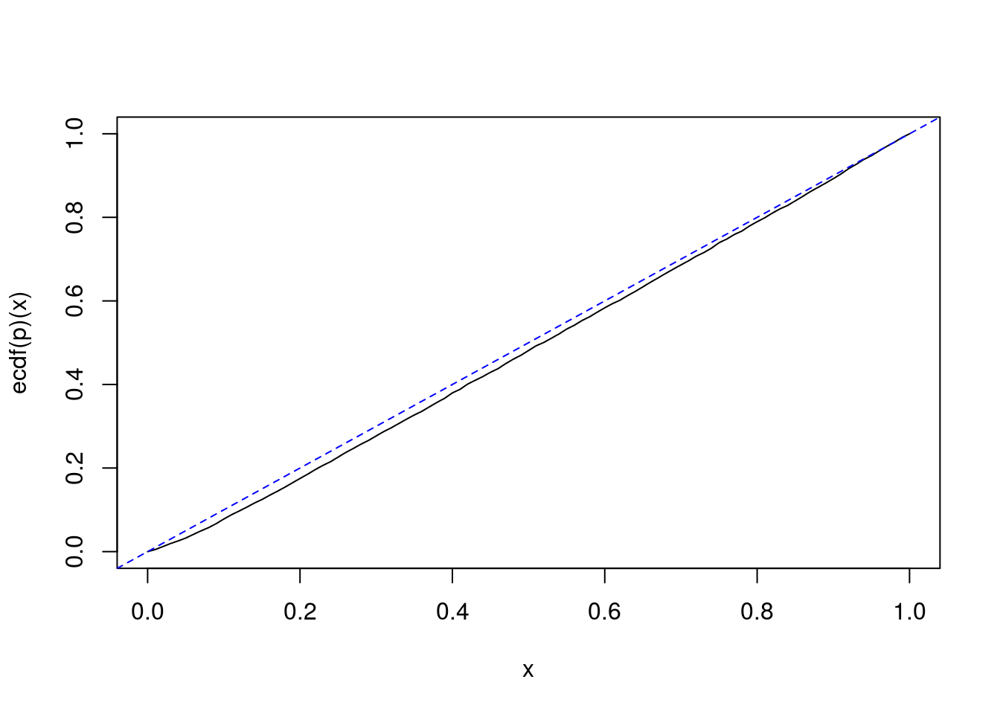

# Testing the nullity of the between variance
Stéphane Laurent  
2017-04-02  


\newcommand{\SS}{\mathrm{SS}}
\newcommand{\ss}{\mathrm{ss}}

This article is a follow-up of [the previous one](http://stla.github.io/stlapblog/posts/GeneralizedCI_BAV1R.html).

Recall that we consider the balanced one-way random effect ANOVA model. 
We use the index $i\in\{1,\ldots,I\}$ for the group index and the index $j\in\{1,\ldots,J\}$ for the observation index within a group.

The function `SimData` below simulates from this model.


```r
library(data.table)
SimData <- function(I, J, mu, sigmab, sigmaw){
  group <- gl(I, J, labels=LETTERS[1:I])
  DT <- data.table(group = group, 
                   y = mu + rep(rnorm(I, sd=sigmab), each=J) + rnorm(I*J, sd=sigmaw),
                   key = "group")
  return(DT)
}
( DT <- SimData(I=2, J=3, mu=0, sigmab=1, sigmaw=2) )
##    group           y
## 1:     A -1.89048285
## 2:     A  0.74904194
## 3:     A  2.70104706
## 4:     B -1.85308680
## 5:     B  0.09043998
## 6:     B -1.11898113
```

The `summaryStats` function below calculates the three summary statistics $\bar y$, $\ss_b$ and $\ss_c$.


```r
summaryStats <- function(DT){
  DT[, `:=`(means = rep(mean(y), each=.N)), by=group]
  ssw <- DT[, { squares = (y-means)^2
                .(ssw = sum(squares))}]$ssw
  ybar <- mean(DT$y)
  DT[, `:=`(Mean = ybar)] # A CORRIGER DANS LE PRECEDENT 
  ssb <- DT[, { squares = (means-Mean)^2
                .(ssb = sum(squares))}]$ssb
  return(c(ybar=ybar, ssb=ssb, ssw=ssw))
}
summaryStats(DT)
##      ybar       ssb       ssw 
## -0.220337  3.287427 12.546156
```

The distribution of the generalized pivotal quantity $G_{\sigma^2_b}$ can be seen as a "posterior distribution" of $\sigma^2_b$:


```r
set.seed(666)
I <- 3L; J <- 4L
mu <- 0; sigmab <- 0; sigmaw <- 2
#
n <- 1e6L
Z <- rnorm(n); U2b <- rchisq(n, I-1); U2w <- rchisq(n, I*(J-1))
#
sss <- summaryStats(SimData(I, J, mu, sigmab, sigmaw))
Gsigma2b <- 1/J*(sss["ssb"]/U2b - sss["ssw"]/U2w)
plot(density(Gsigma2b, from=-5, to=5))
abline(v=0, lty="dashed")
```

<!-- -->

However, the between variance $\sigma^2_b$ is a positive parameter. 
Therefore it makes sens to replace $G_{\sigma^2_b}$ with 
$\max\bigl\{0, G_{\sigma^2_b}\bigr\}$. 
Thus, our "posterior distribution" becomes a mixture of a Dirac mass at $0$ and a density on the positive numbers:


```r
par(mar=c(4,3,1,1))
p <- mean(Gsigma2b<0)
plot(density(Gsigma2b, from=0, to=5), main=NA,
     xlim=c(-1,5), ylim=c(0,1), 
     xlab=expression(sigma[b]^2), ylab=NA,
     axes=FALSE, cex.lab=1.5)
polygon(x=c(0,0,-1,-1), y=c(0,p,p,0), 
        col="lightgray", border="gray")
axis(1, at=0:5)
axis(2, at=seq(0,1,by=.2), las = 2,  labels=c("0%","20%","20%","60%","80%","100%"))
```

<!-- -->

The mass at $0$ is the posterior probability that $\sigma^2_b = 0$. 
Let us call $p$ this probability. 

It is quite interesting to observe the following fact. 
If $\sigma^2_b = 0$, then simulations show that $p$ seemingly follow a uniform distribution on $[0,1]$:


```r
I <- 2L; J <- 3L
mu <- 0; sigmab <- 0; sigmaw <- 2
#
n <- 1e6L
U2b <- rchisq(n, I-1); U2w <- rchisq(n, I*(J-1))
#
nsims <- 500
SIMS <- t(vapply(1:nsims, function(i){
   summaryStats(SimData(I, J, mu, sigmab, sigmaw))
  }, 
  FUN.VALUE=numeric(3)))
p <- numeric(nsims)
for(i in 1:nsims){
  ssb <- SIMS[i,"ssb"]; ssw <- SIMS[i,"ssw"]
  Gsigma2b <- 1/J*(ssb/U2b - ssw/U2w)
  p[i] <- mean(Gsigma2b<0)
}
curve(ecdf(p)(x))
abline(0, 1, lty="dashed", col="blue")
```

<!-- -->

In fact, it exactly follows a uniform distribution. We will easily prove it. 

Therefore, it provides a perfect $p$-value for the hypothesis $H_0\colon\{\sigma^2_b=0\}$: 
rejecting $H_0$ when $p < \alpha$ provides a test with significance level $\alpha$.


## Proof 

Assuming $\sigma^2_b=0$, 
$$
\begin{align*}
\Pr(G_{\sigma^2_b} < 0) & =
 \Pr\left(\frac{U^2_w}{U^2_b} < \frac{\ss_w}{\ss_b} \right) \\
& = 
  F\left(\frac{\ss_w}{\ss_b} \right)
\end{align*}
$$
where $F$ is the *cdf* of $\frac{U^2_w}{U^2_b}$. 

The result follows from the fact that $\frac{\SS_w}{\SS_b}$ has the same distribution as $\frac{U^2_w}{U^2_b}$, and from the well-known fact that $G(X)$ follows the uniform distribution on $[0,1]$ whenever $X$ is a continuous random variable and $G$ is its *cdf*. 

## One-sided confidence intervals

I do not know whether this is exactly true, but, in view of simulations, the above property also 
seems to work for the null hypothesis $H_0\colon\{\sigma^2_b=\theta_0\}$ for any $\theta_0$, versus the one-sided alternative hypothesis $H_1\colon\{\sigma^2_b>\theta_0\}$ or $H_1\colon\{\sigma^2_b<\theta_0\}$. 
That would mean that the one-sided generalized confidence intervals about $\sigma^2_b$ are exact.


```r
sigmab <- 2
SIMS <- t(vapply(1:nsims, function(i){
   summaryStats(SimData(I, J, mu, sigmab, sigmaw))
  }, 
  FUN.VALUE=numeric(3)))
p <- test <- numeric(nsims)
for(i in 1:nsims){
  ssb <- SIMS[i,"ssb"]; ssw <- SIMS[i,"ssw"]
  Gsigma2b <- 1/J*(ssb/U2b - ssw/U2w)
  p[i] <- mean(Gsigma2b<sigmab^2)
  test[i] <- sigmab^2 < quantile(Gsigma2b, 0.95)
}
curve(ecdf(p)(x))
abline(0, 1, lty="dashed", col="blue")
```

<!-- -->

```r
# coverage
mean(test)
## [1] 0.956
```


