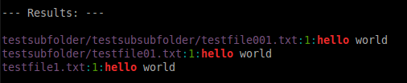

```{r setup, include=FALSE}
# use highlight
option_packages <- "-package-db /home/stla/.cabal-sandbox/x86_64-linux-ghc-7.10.3-packages.conf.d"
knitr::opts_chunk$set(echo = TRUE, collapse=TRUE, prompt=TRUE)
Sys.setenv(PATH = "/opt/ghc/7.10.3/bin:/home/stla/bin:/bin:/usr/bin")
knitr::opts_knit$set(root.dir = "./tests/testfolder/")
# set global chunk options
options(replace.assign=TRUE, width=90)
```

<style type="text/css">
/* background code blocks */ 
ol.linenums li {
  background-color: #f5f5f5; 
}

/* font size code blocks */
pre code {
  background-color: #f5f5f5;
}

/* inline code */
code {
	background-color: #f5f5f5;
}
</style>

<style type="text/css">code{white-space: pre;}</style>
<style type="text/css">
div.sourceCode, pre  { overflow-x: auto; }
table.sourceCode, tr.sourceCode, td.lineNumbers, td.sourceCode {
  margin: 0; padding: 0; vertical-align: baseline; border: none; }
table.sourceCode { width: 100%; line-height: 100%; }
td.lineNumbers { text-align: right; padding-right: 4px; padding-left: 4px; color: #aaaaaa; border-right: 1px solid #aaaaaa; }
td.sourceCode { padding-left: 5px; }
code > span.kw { color: #007020; font-weight: bold; } /* Keyword */
code > span.dt { color: #902000; } /* DataType */
code > span.dv { color: #40a070; } /* DecVal */
code > span.bn { color: #40a070; } /* BaseN */
code > span.fl { color: #40a070; } /* Float */
code > span.ch { color: #4070a0; } /* Char */
code > span.st { color: #4070a0; } /* String */
code > span.co { color: #60a0b0; font-style: italic; } /* Comment */
code > span.ot { color: #007020; } /* Other */
code > span.al { color: #ff0000; font-weight: bold; } /* Alert */
code > span.fu { color: #06287e; } /* Function */
code > span.er { color: #ff0000; font-weight: bold; } /* Error */
code > span.wa { color: #60a0b0; font-weight: bold; font-style: italic; } /* Warning */
code > span.cn { color: #880000; } /* Constant */
code > span.sc { color: #4070a0; } /* SpecialChar */
code > span.vs { color: #4070a0; } /* VerbatimString */
code > span.ss { color: #bb6688; } /* SpecialString */
code > span.im { } /* Import */
code > span.va { color: #19177c; } /* Variable */
code > span.cf { color: #007020; font-weight: bold; } /* ControlFlow */
code > span.op { color: #666666; } /* Operator */
code > span.bu { } /* BuiltIn */
code > span.ex { } /* Extension */
code > span.pp { color: #bc7a00; } /* Preprocessor */
code > span.at { color: #7d9029; } /* Attribute */
code > span.do { color: #ba2121; font-style: italic; } /* Documentation */
code > span.an { color: #60a0b0; font-weight: bold; font-style: italic; } /* Annotation */
code > span.cv { color: #60a0b0; font-weight: bold; font-style: italic; } /* CommentVar */
code > span.in { color: #60a0b0; font-weight: bold; font-style: italic; } /* Information */
</style>

La finalité de cet article est de créer, avec Haskell, un exécutable avec des arguments et des options.
Nous verrons en outre:

- comment exécuter une commande système depuis Haskell ;

- comment rechercher des fichiers dans Haskell avec des jokers ("glob") ;

- comment transformer des chemins absolus en chemins relatifs dans Haskell.

## Recherche de fichiers contenant un motif avec `grep`

Cette section ne concerne pas Haskell. 
Nous allons présenter une commande système et plus tard nous implémenterons cette commande dans Haskell.

Supposons que l'on recherche tous les fichiers de type `hs` contenant la chaîne de caractères "`hello`", à partir du répertoire courant.
On peut utiliser la commande 

```bash
grep hello *.hs -n -w
```

pour chercher uniquement dans le répertoire courant, et la commande

```bash
grep --include=\*.hs -n -w -r -e hello
```

pour chercher récursivement à partir dans le répertoire courant, c'est-à-dire dans le répertoire courant, ses sous-répertoires, ses sous-sous répertoires, etc.

Les options utilisées sont:

- `-n` pour afficher les numéros des lignes dans lesquelles apparaissent la chaîne de caractères recherchée ;

- `-w` (*match whole word*) pour rechercher "`hello`" en tant que mot entier (par exemple `hellooo` n'est pas pris en compte si on n'utilise pas cette option).

On peut aussi concaténer les options : `grep --include=\*.hs -nwr -e hello`.

Pour les illustrations, nous nous plaçons dans un répertoire avec ce contenu:

```{r include=FALSE}
options(prompt="$ ")
```

```{r engine='bash', comment=NA}
tree
```


## Exécuter une commande système dans Haskell

```{r include=FALSE}
knitr::opts_chunk$set(prompt=FALSE)
```


Dans Haskell, on peut éxecuter la commande précédente ainsi :

```{r engine='haskell', engine.path='ghc', engine.opts=option_packages}
import System.Process
r <- readCreateProcess (shell "grep --include=\\*.hs -n -w -r -e 'hello'") ""
putStrLn r
```

La fonction `readProcess` permet de passer les options à `grep` de façon plus commode, dans une liste :

```{r engine='haskell', engine.path='ghc', engine.opts=option_packages}
import System.Process
r <- readProcess "grep" ["--include", "*.hs", "-n", "-w", "-r", "-e", "hello"] ""
putStrLn r
```

Toutefois ces deux fonctions ont un inconvénient. Dans le cas où `grep` ne trouve aucun fichier correspondant, il retourne un code de sortie d'échec, et ces deux fonctions ne gèrent pas bien cette situation :

```{r engine='haskell', engine.path='ghc', engine.opts=option_packages}
import System.Process
r <- readProcess "grep" ["--include", "*.hs", "-n", "-w", "-r", "-e", "xxxxx"] ""
r
```

Il vaut mieux utiliser les fonctions `readCreateProcessWithExitCode` ou `readProcessWithExitCode` pour gérer cette situation. 
Avec ces fonctions on obtient un triplet contenant : le code de sortie, la sortie standard et la sortie d'erreur.

```{r engine='haskell', engine.path='ghc', engine.opts=option_packages}
import System.Process
(exitcode, stdout, stderr) <- readProcessWithExitCode "grep" ["--include", "*.hs", "-n", "-w", "-r", "-e", "hello"] ""
(exitcode, stdout, stderr)
```

```{r engine='haskell', engine.path='ghc', engine.opts=option_packages}
import System.Process
(exitcode, stdout, stderr) <- readProcessWithExitCode "grep" ["--include", "*.hs", "-n", "-w", "-r", "-e", "xxxxx"] ""
(exitcode, stdout, stderr)
```


## Jokers (glob)

Quand on exécute la commande 

```bash
grep hello *.hs
```

l'interpréteur développe `*.hs` en tous les fichiers `hs` du répertoire courant. La commande qui est finalement exécutée est 

```bash
grep hello testfile1.hs testfile2.hs
```

Ce n'est pas `grep` qui exécute cette tâche, et de ce fait, la commande Haskell

```haskell
readProcess "grep" ["hello", "*.hs"] ""
```

ne donnera pas le résultat escompté. 

C'est ce qu'on appelle un joker (wildcard), ou "glob" en anglais. 

Les jokers sont aussi utilisés par la commande `ls`. Rappelons la structure du répertoire courant:

```{r include=FALSE}
knitr::opts_chunk$set(prompt=TRUE, comment=NA)
```

```{r bash-tree, engine='bash'}
tree
```

Le joker `*.hs` correspond à tous les fichiers `hs` dans le répertoire courant :

```{r engine='bash'}
ls *.hs
```

Le joker `*/*.hs` correspond à tous les fichiers `hs` dans les sous-répertoires du répertoire courant :

```{r engine='bash'}
ls */*.hs
```

Et ainsi de suite :

```{r engine='bash'}
ls */*/*.hs
```

On peut ainsi contrôler la profondeur de la recherche quand on exécute `grep`. Plus tard, quand nous implémenterons `grep` dans notre exécutable Haskell, nous ajouterons une option pour contrôler la profondeur de la recherche.

Avant de revenir à Haskell, montrons quelques autres jokers : 

- fichiers `hs` et `txt` dans les sous-dossiers :

```{r engine='bash'}
ls */*.{hs,txt}
```

- fichiers qui ne se terminent pas par `t` :

```{r engine='bash'}
ls *.*[!t]
```

- en mettant en marche une option au préalable, on peut aussi appliquer la négation à une chaîne de caractères:

```bash
$ shopt -s extglob 
$ ls *.!(txt)
testfile1.hs
testfile2.hs
```

Cette option permet [d'autres possibilités](http://stackoverflow.com/a/217208/1100107). 

Revenons à Haskell. Les jokers sont implémentés dans le module `System.FilePath.Glob` de la librairie `glob`.

```{r include=FALSE}
knitr::opts_chunk$set(prompt=FALSE, comment="##")
```

```{r engine='haskell', engine.path='ghc', engine.opts=option_packages}
import System.FilePath.Glob (glob)
glob "*.hs"
```

La fonction `glob` retourne des chemins absolus. Si nous les utilisons avec `grep`, on obtiendra des chemins absolus aussi pour les fichiers trouvés, ce qui encombre la visibilité. On peut les transformer en chemins relatifs à l'aide du module `Path` de la librairie `path` :

```{r engine='haskell', engine.path='ghc', engine.opts=option_packages}
import System.FilePath.Glob (glob)
import System.Directory (getCurrentDirectory)
import Path (parseAbsFile, parseAbsDir, stripDir, fromRelFile)
:{
let absoluteFilePathToRelativeFilePath :: FilePath -> IO( FilePath )
    absoluteFilePathToRelativeFilePath file = 
      do
        currentDir <- getCurrentDirectory
        currentAbsDir <- parseAbsDir currentDir
        absFile <- parseAbsFile file
        relFile <- stripDir currentAbsDir absFile
        return $ fromRelFile relFile
:}
absFiles <- glob "*/*.hs"
mapM absoluteFilePathToRelativeFilePath absFiles
```


## Implémentation dans Haskell 

Mettons d'abord ensemble les choses vues précédemment. 
Nous créons d'abord un module qui transforme des chemins absolus en chemins relatifs au répertoire courant. 

```haskell
module AbsoluteFilePathToRelativeFilePath where

import Path (parseAbsFile, fromRelFile, parseAbsDir, stripDir)
import System.Directory (getCurrentDirectory)

absoluteFilePathToRelativeFilePath :: FilePath -> IO( FilePath )
absoluteFilePathToRelativeFilePath file = 
  do
    currentDir <- getCurrentDirectory
    currentAbsDir <- parseAbsDir currentDir
    absFile <- parseAbsFile file
    relFile <- stripDir currentAbsDir absFile
    return $ fromRelFile relFile
```

Nous créons maintenant un module qui exécute la commande `grep`. 
Nous mettons un argument `depth` qui contrôle la profondeur de la recherche. 
Le type de cet argument est `Maybe Int`. La recherche récursive sera exécutée si on attribue la valeur `Nothing` à `depth`. 
Le type `Maybe Int` sera très commode pour la suite, lorsque nous créerons l'exécutable avec des options. 

```haskell
module GetGrepResults where

import System.Process (readProcessWithExitCode)
import System.Exit (ExitCode)
import System.FilePath.Glob (glob)
import AbsoluteFilePathToRelativeFilePath

runGrep :: String -> String -> Bool -> Maybe Int -> IO(ExitCode, String, String)
runGrep fileType pattern wholeword depth = 
  do
    let option = if wholeword then "-nw" else "-n"
    case depth of 
       Nothing -> readProcessWithExitCode "grep" ([option] ++ ["--colour=always", "--include", "*." ++ fileType, "-r", "-e", pattern]) ""
       Just n -> do absFiles <- glob $ (foldr (++) "*." (replicate n "*/")) ++ fileType
                    relFiles <- mapM absoluteFilePathToRelativeFilePath absFiles
                    readProcessWithExitCode "grep" ([pattern] ++ relFiles ++ ["--colour=always", option]) ""
       
getGrepResults :: String -> String -> Bool -> Maybe Int -> IO()
getGrepResults fileType pattern wholeword depth = 
  do
    (_, stdout, stderr) <- runGrep fileType pattern wholeword depth
    putStrLn "\n--- Results: ---\n"
    case stdout of
      "" -> putStrLn "No result" 
      _ ->  putStrLn stdout
```


## Création de l'exécutable

Une librairie excellente et moderne pour créer des exécutables avec arguments et options: [optparse-applicative][http://hackage.haskell.org/package/optparse-applicative]. 

On crée d'abord un nouveau type de données `Arguments` pour les arguments et les options. Puis on modifie notre fonction principale `getGrepResults` de sorte qu'elle prenne en entrée une variable `Arguments`. 

Enfin, le code se passe de trop de commentaires tant il est lisible. On trouvera d'autres examples sur la page de la librairie `optparse-applicative` et [ici](http://stackoverflow.com/a/39049486/1100107). 

```haskell
module Main where

import GetGrepResults
import Options.Applicative
import Data.Monoid

data Arguments = Arguments
  { filetype :: String
  , pattern :: String
  , wholeword :: Bool
  , depth :: Maybe Int }

findFiles :: Arguments -> IO()
findFiles (Arguments filetype pattern w d) = getGrepResults filetype pattern w d  

run :: Parser Arguments
run = Arguments
     <$> argument str 
          ( metavar "FILETYPE"
         <> help "Type of the files to search in" )
     <*> argument str 
          ( metavar "PATTERN"
         <> help "The pattern to search" )
     <*>  switch
          ( long "wholeword"
         <> short 'w'
         <> help "Match whole word" ) 
     <*> ( optional $ option auto 
          ( metavar "DEPTH"
         <> long "depth"
         <> short 'd'
         <> help "Depth of the search (0: current directory)" ))

main :: IO ()
main = execParser opts >>= findFiles
  where
    opts = info (helper <*> run)
      ( fullDesc
     <> progDesc "Find files containing a pattern"
     <> header "findpatterninfiles -- based on grep" )
```

Ce code étant dans le fichier `findpattern.hs`, on crée un fichier exécutable `findpattern` en compilant avec la commande `ghc findpattern.hs`. 


```bash
$ findpattern txt "hello" 

--- Results: ---

testsubfolder/testsubsubfolder/testfile001.txt:1:hello world
testsubfolder/testfile01.txt:1:hello world
testfile1.txt:1:hello world
```

```bash
$ findpattern txt "hello" -d 1

--- Results: ---

testsubfolder/testfile01.txt:1:hello world
```

La sortie est en réalité en couleur :




## Note (2016-10-12)

Plutôt que d'utiliser les jokers, on peut utiliser le module `System.FilePath.Find` de la librairie `filemanip`. 

Pour chercher récursivement :

```{r engine='haskell', engine.path='ghc', engine.opts=option_packages}
import System.FilePath.Find
find always (extension ==? ".hs") "./"
```

Pour chercher jusqu'à une profondeur donnée :
```{r engine='haskell', engine.path='ghc', engine.opts=option_packages}
import System.FilePath.Find
find (depth <=? 1) (extension ==? ".hs") "./"
```