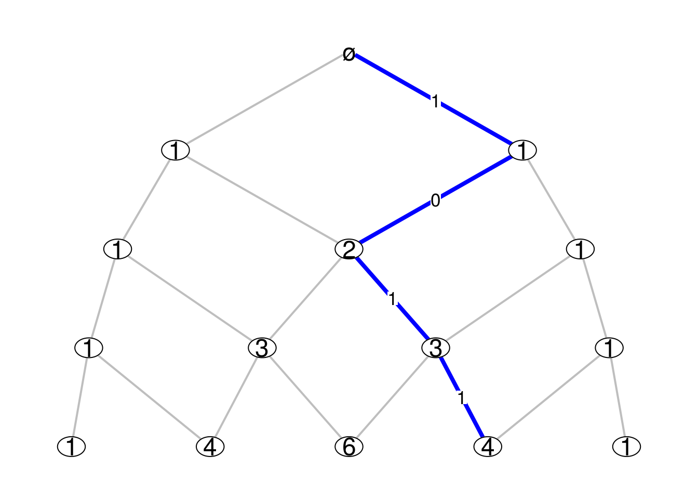

\newcommand{\Vb}{\boldsymbol V}
\newcommand{\given}{\mid}

```{r setup0, include=FALSE}
library(knitr)
opts_chunk$set(collapse=TRUE, fig.path="./assets/fig/IntrinsicDistances-")
```


On every [Bratteli graph](http://stla.github.io/stlapblog/posts/Bratteli.html) there is an intrinsic family of Markov kernels, which are also called the *central kernels*. 
Consider for example the Pascal graph below, where the integer shown at each vertex is the number of paths from this vertex to the root vertex $\varnothing$:



Consider the levels of the graph are indexed by the negative integers, the level $n=0$ being the one of the root vertex. Thus, for the example of the Pascal graph,  there are $|n|$ vertices at level $n$. We denote by $\Vb_n$ the set of vertices at level $n$. 

The intrinsic family of Markov kernels is the familiy of Markov kernels 
${(P_n)}_{n \leq -1}$ such that the source and the target 
of $P_n$ respectively are $\Vb_n$ and $\Vb_{n+1}$ and which are characterized 
by the following conditions:

* for each vertex $v_n \in \Vb_n$, the support of the probability $P_n(v_{n}, \cdot)$ is the set of vertices at level $n+1$ which are connected to $v_n$;

* for every integer $n_0 \leq -1$ and every vertex $v_{n_0} \in \Vb_{n_0}$, if $(v_{n_0}, V_{n_0+1}, \ldots, V_0)$  is a Markov vector  with initial value $v_{n_0}$ and transition distributions $\Pr(V_{n+1} \in \cdot \given V_n=v_n) = P_n(v_n, \cdot)$, then the path defined by its trajectory has the uniform distribution on the set of paths going from $v_{n_0}$ to the root vertex $\varnothing = V_0$.      

Thus $P_n(v_{n}, \cdot)$ is explicitely given by 
$$
\boxed{P_n(v_{n}, v_{n+1}) =  \dfrac{\dim(v_{n+1})}{\dim(v_n)}}
$$
where the *dimension* $\dim(v)$ of a vertex $v$  is the number of paths from a vertex $v$ to the root vertex $\varnothing$. 

### Computing the intrinsic kernels

When a function `Mn.fun` returns the incidence matrices of the Bratteli graph, it is not difficult to get the dimensions of the vertices and then the intrinsic Markov kernels. The function below does this job. I use the `gmp` package to get the results in big rationals. 

```{r, message=FALSE}
library(gmp)
centralKernels <- function(Mn.fun, N){
  L <- Kernels <- vector("list", N-1)
  # initialization 
  k <- 0
  M <- Mn.fun(k)
  m <- nrow(M); n <- ncol(M)
  if(m != 1) stop("M0 must have only one row")
  dims0 <-  as.vector(as.bigz(M))
  Kernels[[k+1]] <- matrix(as.character(dims0), dimnames=list(1:n, 1:m))
  for(k in 1:(N-1)){
    M <- Mn.fun(k)
    m <- nrow(M); n <- ncol(M)
    S <- lapply(1:ncol(M), function(i) which(M[,i]!=0)) 
    dims <- as.vector(dims0%*%M) 
    P <- lapply(1:n, function(i){
                             as.character(dims0[S[[i]]]*M[S[[i]],i]/dims[i])
                           })
    Kernels[[k+1]] <- matrix("0", nrow=n, ncol=m, dimnames=list(1:n,1:m))
    for(i in 1:n){
      Kernels[[k+1]][i,][S[[i]]] <- P[[i]]
    }
    dims0 <- dims
  }
  return(Kernels)
}
```

I try it below for the example of the Pascal graph. Recall that $M_0$ must always be a row matrix of ones.

```{r}
Pascal_Mn <- function(n){ 
  M <- matrix(0, nrow=n+1, ncol=n+2)
  for(i in 1:(n+1)){
    M[i,][c(i,i+1)] <- 1 
  }
  return(M)
}
Pascal_Mn(0)
```


```{r}
( ckernels <- centralKernels(Pascal_Mn, 4) )
```

### Computing the intrinsic distances 

Once one has the central kernels, one can compute the intrinsic distances, as defined in the paper [Standardness of monotonic Markov filtrations](http://arxiv.org/abs/1501.02166), with the help of the [kantorovich package](http://stla.github.io/stlapblog/posts/kantorovich-package.html). I provide the code below. 

```{r}
library(kantorovich)
RHO <- lapply(ckernels, function(kernel) matrix("", nrow=nrow(kernel), ncol=nrow(kernel)))  
RHO[[1]] <- (diag(2) + 1) %% 2
n <- length(ckernels)-1
for(k in 1:n){
  diag(RHO[[k+1]]) <- "0"
  K <- nrow(RHO[[k+1]])
  kernel <- ckernels[[k+1]]
  for(i in 1:(K-1)){
    for(j in (i+1):K){
      RHO[[k+1]][i,j] <- RHO[[k+1]][j,i] <- 
        as.character(kantorovich(as.bigq(kernel[i,]), as.bigq(kernel[j,]), dist = RHO[[k]]))
    }
  }
}
RHO
```

I hope this will help the people working on the theory of standard filtrations.