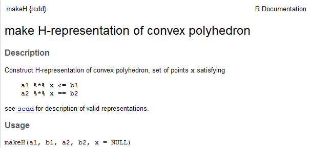

---
title: Using R to compute the Kantorovich distance
date : 2013-07-02
--- &lead

```{r setup0, echo=FALSE}
opts_chunk$set(fig.path="assets/fig/KantorovichWithR", tidy=FALSE)
```

```{r setup, echo=FALSE, message=FALSE}
library(rgl)
library(rcdd)
knit_hooks$set(webgl = hook_webgl)
```

The Kantorovich distance between two probability measures $\mu$ and $\nu$ on a finite set $A$ equipped with a metric $d$ is defined as 
$$d'(\mu,\nu)=
\min_{\Lambda \in {\cal J}(\mu, \nu)} \int d(x,y)\textrm{d}\Lambda(x,y) $$
where ${\cal J}(\mu, \nu)$ is the set of all joinings of $\mu$ and $\nu$, that is, the set of all probability measures $\Lambda$ on $A \times A$ whose margins 
are $\mu$ and $\nu$.    


The  Kantorovich distance can also be defined for more general metric spaces 
$(A,d)$ but our purpose is to show how to compute the Kantorovich distance in R when $A$ is finite.   


Actually the main part of the work will be to get the *extreme points* of 
the set of joinings ${\cal J}(\mu, \nu)$. 
Indeed, 
this set  has a convex structure and the numerical application 
$${\cal J}(\mu, \nu) \ni \Lambda \mapsto \int d(x,y)\textrm{d}\Lambda(x,y)$$
is linear. 
Therefore, any extremal value of this application, 
in particular the  Kantorovich distance $d'(\mu,\nu)$, 
is attained by an extreme joining $\Lambda \in {\cal J}(\mu, \nu)$. 
This latter point will be explained below, and we will also see 
that ${\cal J}(\mu, \nu)$ is a *convex polyhedron*. 


## Computing extreme joinings in R 

What is an extreme joining in ${\cal J}(\mu, \nu)$ ? 
First of all, what is a joining in ${\cal J}(\mu, \nu)$ ? 
Consider for instance $A=\{a_1,a_2,a_3\}$ then a joining of $\mu$ and $\nu$ is 
given by a matrix 
$$P=\begin{pmatrix}
p_{11} & p_{12} & p_{13} \\
p_{21} & p_{22} & p_{23} \\
p_{31} & p_{32} & p_{33} 
\end{pmatrix}$$
whose $(i,j)$-th entry $p_{ij}$ is the probability 
$p_{ij}=\Pr(X=i,Y=j)$ where $X \sim \mu$ and $Y \sim \nu$ are random variables on $A$. 
Given a distance $d$ on $A$, 
the Kantorovich distance $d'(\mu,\nu)$ is then the minimal possible value 
of the mean distance $\mathbb{E}[d(X,Y)]$ between $X$ and $Y$. 
Note that $\mathbb{E}[d(X,Y)]=\Pr(X \neq Y)$ when taking $d$ as the 
discrete $0-1$ distance on $A$. 


### The $H$-representation of ${\cal J}(\mu, \nu)$ 

The possible values of the $p_{ij}$ satisfy the following three sets of 
linear equality/inequality constraints:
$$\begin{cases}
{\rm (1a) } \quad \sum_j p_{ij} = \mu(a_i) & \forall i \\ 
{\rm (1b) } \quad \sum_i p_{ij} = \nu(a_j) & \forall j \\
{\rm (2) } \quad  p_{ij} \geq 0 & \forall i,j \\
\end{cases}.$$
Considering $P$ written in stacked form : 
$$P={\begin{pmatrix}
p_{11} & p_{12} & p_{13} &
p_{21} & p_{22} & p_{23} &
p_{31} & p_{32} & p_{33} 
\end{pmatrix}}'$$
then the first  set ${\rm (1a)}$ of linear equality constraints is $M_1 P = 0$ with 
$$ M_1 = \begin{pmatrix}
1 & 1 & 1 & 0 & 0 & 0 & 0 & 0 & 0 \\
 0 & 0 & 0 & 1 & 1 & 1  & 0 & 0 & 0 \\
 0 & 0 & 0 & 0 & 0 & 0 & 1 & 1 & 1  
\end{pmatrix} $$
and the second set ${\rm (1b)}$ of linear equality constraints is $M_2 P = 0$ with 
$$ M_2 = \begin{pmatrix}
1 & 0 & 0 & 1 & 0 & 0 & 1 & 0 & 0 \\
 0 & 1 & 0 & 0 & 1 & 0  & 0 & 1 & 0 \\
 0 & 0 & 1 & 0 & 0 & 1 & 0 & 0 & 1  
\end{pmatrix}. $$


With the terminology of the [cddlibb library](http://web.mit.edu/sage/export/tmp/cddlib-094b/doc/cddlibman.pdf), ${\cal J}(\mu, \nu)$ is a *convex polyhedron* and the linear constraints above define its *H-representation*. 
Schematically, one can imagine ${\cal J}(\mu, \nu)$ as a convex polyhedra embedded in a higher dimensional space:

```{r rglkantorovich1, echo=FALSE, webgl=TRUE}
M <- rbind(
  c(0,0,0),
  c(-1,4,0),
  c(4,9,0),
  c(6,3,0)
  )
  points3d(M,col='red')
 quads3d(M, col='green')
text3d(t(t(M)-c(0,0,0.5)), text=c("a","b","c","d"), col="green")
```
Here ${\cal J}(\mu, \nu)$ is a $4$-dimensional convex polyhedron embedded in a $9$-dimensional space: its elements are given by $9$ parameters $p_{ij}$ but they are determined by only $4$ of them because of the linear equality constraints ${\rm (1a)}$ and ${\rm (1b)}$.  

 
### Vertices of ${\cal J}(\mu, \nu)$ achieve the Kantorovich distance

In the introduction we mentionned that the application   
$${\cal J}(\mu, \nu) \ni \Lambda \mapsto \int d(x,y)\textrm{d}\Lambda(x,y)$$
is linear and we claimed that consequently any of its extremal values is attained by an *extreme point* of ${\cal J}(\mu, \nu)$. Why ?

Extreme points of a convex polyhedron are nothing but its vertices. Consider a point $x$ in a convex polyhedron which is not a vertex, as in the figure below. 
Then $x$ is a convex combination of the vertices $a$, $b$, $c$, $d$, and therefore the image $\ell(x)$ of $x$ by any linear function $\ell$ is the same  convex combination of $\ell(a)$, $\ell(b)$, $\ell(c)$, $\ell(d)$. 
See figure below, where the polyhedron is in the $xy$-plane and the value of 
$\ell$ is given on the $z$-axis. 

```{r rglkantorovich2, echo=FALSE, webgl=TRUE}
a <-  M[1,-3]
b <-  M[2,-3]
c <-  M[3,-3]
d <-  M[4,-3]
f <- function(x,y) 4*x+6*y+11
x <- seq(-3,9,length=30)
y <- seq(-3,12,length=30)
z <- outer(x, y, f)
#open3d()
bg3d("white")
material3d(col="black")
plot3d(x, y, z, aspect=c(1, 1, 0.5), col = "lightblue", type="n", 
       zlim=c(min(z)-3,max(z)+3),
        xlab = "", ylab = "", zlab = "", box=FALSE, axes=FALSE)
surface3d(x, y, z,  back="lines", col = "lightblue",  
        add=TRUE, alpha=0.5)
segments3d( # axe z 
  rbind(c(0,0,0),c(0,0,80)), 
  col='black'
  )
points3d(M, col='red',  size=8)
 quads3d(M, col='green')
fa <- c(a,f(a[1],a[2]))
fb <- c(b,f(b[1],b[2]))
fc <- c(c,f(c[1],c[2]))
fd <- c(d,f(d[1],d[2]))
fM <- rbind(fa,fb,fc,fd)
points3d(fM, col='red',  size=8)
Segments <- rbind(
  M[1,],
  fa,
  M[2,],
  fb,
  M[3,],
  fc,
  M[4,],
  fd
  )
segments3d(Segments, col='red')
zfa <- c(0,0,fa[3])
zfb <- c(0,0,fb[3])
zfc <- c(0,0,fc[3])
zfd <- c(0,0,fd[3])
segments3d(
  rbind(
    fa,
    zfa,
    fb,
    zfb,
    fc,
    zfc,
    fd,
    zfd
  )
, col='red')
X <- c(2.25, 4, 0 )
fX <- c(X[1:2], f(X[1],X[2]))
zfX <- c(0, 0, f(X[1],X[2]))
points3d(
  rbind(
  X,
  fX,zfX
  ), col='green', size=8)
points3d(rbind(
  zfa,
  zfb,
  zfc,
  zfd),
         col='red', size=8
  )
lines3d(
  rbind(
  X,
  fX,
  zfX
  ), col='green')
text3d(t(t(rbind(M,X))-c(0,0,6)), text=c("a","b","c","d","x"), col=c(rep("red",4),"green"))
text3d(t(t(rbind(
  zfa,
  zfb,
  zfc,
  zfd,
  zfX
))-c(0.35,0.35,0)), text=c("l(a)","l(b)","l(c)","l(d)","l(x)"), col=c(rep("red",4),"green"))
```
Consequently, among the four values $\ell(a)$, $\ell(b)$, $\ell(c)$, $\ell(d)$ of $\ell$ at the vertices, there is at least one lower than $\ell(x)$ and at least one higher than $\ell(x)$. 


### Getting the $V$-representation of ${\cal J}(\mu, \nu)$ and the Kantorovich distance with R

The [rccd package](http://cran.r-project.org/web/packages/rcdd/vignettes/vinny.pdf) for R provides an R interface to the cddlib library. 
Its main function `scdd()` performs the conversion between *$H$-representation* and *$V$-representation* of a convex polyhedron, which is given by the 
set of vertices of the convex polyhedron. 
The set of vertices provide a representation of a polyhedron because 
each point in the polyhedron is a convex combination of the vertices; 
we say that  the convex polyhedra is the convex hull of its extreme points. 

Let us use `scdd()` to get the vertices of ${\cal J}(\mu, \nu)$. 
We consider the following example:
```{r}
mu <- c(1/7,2/7,4/7)
nu <- c(1/4,1/4,1/2)
```

We firstly define its $H$-representation in a R object with the 
`makeH()` function, whose help page begins as follows:
```{r, eval=FALSE, message=FALSE}
library(rcdd)
help(makeH)
```




The matrix `a1` and the vector `b1` specify the linear inequality constraints. Our linear inequality constraints ${\rm 2)}$ are defined in this way in R as follows:
```{r}
m <- length(mu)
n <- length(nu)
a1 <- -diag(m*n)
b1 <- rep(0,m*n)
```
The matrix `a2` and the vector `b2` specify the linear equality constraints. 
We simply construct `b2` by concatenating $\mu$ and $\nu$:
```{r}
b2 <- c(mu,nu)
```
The matrix `a2` 
is obtained by stacking the two matrices $M_1$ and $M_2$ defined above. 
We construct it as follows in R:
```{r}
M1 <- t(model.matrix(~0+gl(m,n)))[,]
M2 <- t(model.matrix(~0+factor(rep(1:n,m))))[,] 
a2 <- rbind(M1,M2)
```
Then we can get the vertices of ${\cal J}(\mu, \nu)$ in a list as follows:
```{r}
H <- makeH(a1,b1,a2,b2)  # H-representation 
V <- scdd(H)$output[,-c(1,2)]  # V-representation (vertices), but not convenient
V <- lapply(1:nrow(V), function(i) matrix(V[i,], ncol=n, byrow=TRUE) )
```
The command lines below show that there are `r length(V)` vertices (extreme joinings) and display the first five of them:
```{r}
length(V)
head(V,5)
```
Now, to get the Kantorovich distance, it suffices to evaluate 
 $\mathbb{E}[d(X,Y)]$ for all extreme joinings, and to take the lower value. 
 Consider for instance the discrete distance $d$. Set it as a matrix in R:
```{r}
( D <- 1-diag(3) )
sapply(V, function(P){ sum(D*P) })
```
Then call `min()` to get the Kantorovich distance $d(\mu,\nu)$

## Use exact arithmetic ! 

Are you satisfied ? I'm not: my probability measures $\mu$ and $\nu$ have rational weights, and then the coordinates of the vertices should be rational too. 

How to get the vertices in exact rational arithmetic ? Remember [my article about the Gauss hypergeometric function](http://stla.overblog.com/the-binary-splitting-with-the-r-gmp-package-application-to-gauss-hypergeometric-function). 
Let's load the `gmp` package:
```{r, message=FALSE}
library(gmp) 
```
Actually this is the point suggested by the message appearing when loading `rcdd`:
```{r, results='asis', eval=FALSE}
library(rcdd)
If you want correct answers, use rational arithmetic.
See the Warnings sections added to help pages for
    functions that do computational geometry.
```
There's almost nothing to change to our previous code: everything is done in `rcdd` to handle rational arithmetic. You just have to set the input parameters as `bigq` numbers. Firstly  define $\mu$ and $\nu$ as "`bigq`" objects:
```{r}
( mu <- as.bigq(c(1,2,4),7) )
( nu <- as.bigq(c(1,1,1),c(4,4,2)) )
```
Then define `b2` as before:
```{r}
b2 <- c(mu,nu)
```
The other input parameters `a1`, `b1`, `a2` contain integers only, it is more straightforward to convert them. Actually these parameters must be in character mode to input them in the `makeH()` function, then we convert them as follows:
```{r}
asab <- function(x) as.character(as.bigq(x))
a1 <- asab(a1)
b1 <- asab(b1)
a2 <- asab(a2)
b2 <- asab(b2)
```
And now we run exactly the same code as before:
```{r}
H <- makeH(a1,b1,a2,b2)  # H-representation 
V <- scdd(H)$output[,-c(1,2)]  # V-representation (vertices), but not convenient
V <- lapply(1:nrow(V), function(i) matrix(V[i,], ncol=n, byrow=TRUE) )
head(V,5)
```
There's a slight problem when applying the `sapply()` function to a list of `bigq` objects. 
You can use the `lapply()` function which works well but returns a list:
```{r}
D <- as.bigq(D)
lapply(V, function(P){ sum(D*P) })
```
We can't convert this list to a `bigq` vector with the `unlist()` function: 
this does not work, and this is why `sapply()` does not work too. 

To get a vector, use a loop:
```{r}
distances <- as.bigq(rep(NA,length(V)))
  for(i in 1:length(V)){
		distances[i] <- sum(D*V[[i]])
	}
distances
```
The column structure of `distances` is unexpected. To get a usual vector, type:
```{r}
attr(distances,"nrow") <- NULL
distances
```
The `min()` function directly works with `bigq` objects:
```{r}
( Kantorovich <- min(distances) )
```
To get the numeric evaluation, use:
```{r}
asNumeric(Kantorovich)
```


That's all.
 

