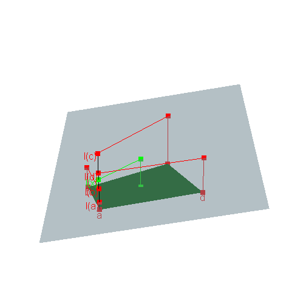

---
title: Using R to compute the Kantorovich distance
date : 2013-07-02
--- &lead


The Kantorovich distance between two probability measures $\mu$ and $\nu$ on a finite set $A$ equipped with a metric $d$ is defined as 
$$d'(\mu,\nu)=
\min_{\Lambda \in {\cal J}(\mu, \nu)} \int d(x,y)\textrm{d}\Lambda(x,y) $$
where ${\cal J}(\mu, \nu)$ is the set of all joinings of $\mu$ and $\nu$, that is, the set of all probability measures $\Lambda$ on $A \times A$ whose margins 
are $\mu$ and $\nu$.    


The  Kantorovich distance can also be defined for more general metric spaces 
$(A,d)$ but our purpose is to show how to compute the Kantorovich distance in R when $A$ is finite.   


Actually the main part of the work will be to get the *extreme points* of 
the set of joinings ${\cal J}(\mu, \nu)$. 
Indeed, 
this set  has a convex structure and the numerical application 
$${\cal J}(\mu, \nu) \ni \Lambda \mapsto \int d(x,y)\textrm{d}\Lambda(x,y)$$
is linear. 
Therefore, any extremal value of this application, 
in particular the  Kantorovich distance $d'(\mu,\nu)$, 
is attained by an extreme joining $\Lambda \in {\cal J}(\mu, \nu)$. 
This latter point will be explained below, and we will also see 
that ${\cal J}(\mu, \nu)$ is a *convex polyhedron*. 


## Computing extreme joinings in R 

What is an extreme joining in ${\cal J}(\mu, \nu)$ ? 
First of all, what is a joining in ${\cal J}(\mu, \nu)$ ? 
Consider for instance $A=\{a_1,a_2,a_3\}$ then a joining of $\mu$ and $\nu$ is 
given by a matrix 
$$P=\begin{pmatrix}
p_{11} & p_{12} & p_{13} \\
p_{21} & p_{22} & p_{23} \\
p_{31} & p_{32} & p_{33} 
\end{pmatrix}$$
whose $(i,j)$-th entry $p_{ij}$ is the probability 
$p_{ij}=\Pr(X=i,Y=j)$ where $X \sim \mu$ and $Y \sim \nu$ are random variables on $A$. 
Given a distance $d$ on $A$, 
the Kantorovich distance $d'(\mu,\nu)$ is then the minimal possible value 
of the mean distance $\mathbb{E}[d(X,Y)]$ between $X$ and $Y$. 
Note that $\mathbb{E}[d(X,Y)]=\Pr(X \neq Y)$ when taking $d$ as the 
discrete $0-1$ distance on $A$. 


### The $H$-representation of ${\cal J}(\mu, \nu)$ 

The possible values of the $p_{ij}$ satisfy the following three sets of 
linear equality/inequality constraints:
$$\begin{cases}
{\rm (1a) } \quad \sum_j p_{ij} = \mu(a_i) & \forall i \\ 
{\rm (1b) } \quad \sum_i p_{ij} = \nu(a_j) & \forall j \\
{\rm (2) } \quad  p_{ij} \geq 0 & \forall i,j \\
\end{cases}.$$
Considering $P$ written in stacked form : 
$$P={\begin{pmatrix}
p_{11} & p_{12} & p_{13} &
p_{21} & p_{22} & p_{23} &
p_{31} & p_{32} & p_{33} 
\end{pmatrix}}'$$
then the first  set ${\rm (1a)}$ of linear equality constraints is $M_1 P = 0$ with 
$$ M_1 = \begin{pmatrix}
1 & 1 & 1 & 0 & 0 & 0 & 0 & 0 & 0 \\
 0 & 0 & 0 & 1 & 1 & 1  & 0 & 0 & 0 \\
 0 & 0 & 0 & 0 & 0 & 0 & 1 & 1 & 1  
\end{pmatrix} $$
and the second set ${\rm (1b)}$ of linear equality constraints is $M_2 P = 0$ with 
$$ M_2 = \begin{pmatrix}
1 & 0 & 0 & 1 & 0 & 0 & 1 & 0 & 0 \\
 0 & 1 & 0 & 0 & 1 & 0  & 0 & 1 & 0 \\
 0 & 0 & 1 & 0 & 0 & 1 & 0 & 0 & 1  
\end{pmatrix}. $$


With the terminology of the [cddlibb library](http://web.mit.edu/sage/export/tmp/cddlib-094b/doc/cddlibman.pdf), ${\cal J}(\mu, \nu)$ is a *convex polyhedron* and the linear constraints above define its *H-representation*. 
Schematically, one can imagine ${\cal J}(\mu, \nu)$ as a convex polyhedra embedded in a higher dimensional space:

<script src="CanvasMatrix.js" type="text/javascript"></script>
<canvas id="unnamed_chunk_1textureCanvas" style="display: none;" width="256" height="256">
<br>
	Your browser does not support the HTML5 canvas element.</canvas>
<!-- ****** surface object 55 ****** -->
<script id="unnamed_chunk_1vshader55" type="x-shader/x-vertex">
	attribute vec3 aPos;
	attribute vec4 aCol;
	uniform mat4 mvMatrix;
	uniform mat4 prMatrix;
	varying vec4 vCol;
	varying vec4 vPosition;
	attribute vec3 aNorm;
	uniform mat4 normMatrix;
	varying vec3 vNormal;
	void main(void) {
	  vPosition = mvMatrix * vec4(aPos, 1.);
	  gl_Position = prMatrix * vPosition;
	  vCol = aCol;
	  vNormal = normalize((normMatrix * vec4(aNorm, 1.)).xyz);
	}
</script>
<script id="unnamed_chunk_1fshader55" type="x-shader/x-fragment"> 
	#ifdef GL_ES
	precision highp float;
	#endif
	varying vec4 vCol; // carries alpha
	varying vec4 vPosition;
	varying vec3 vNormal;
	void main(void) {
	  vec3 eye = normalize(-vPosition.xyz);
	  const vec3 emission = vec3(0., 0., 0.);
	  const vec3 ambient1 = vec3(0., 0., 0.);
	  const vec3 specular1 = vec3(1., 1., 1.);// light*material
	  const float shininess1 = 50.;
	  vec4 colDiff1 = vec4(vCol.rgb * vec3(1., 1., 1.), vCol.a);
	  const vec3 lightDir1 = vec3(0., 0., 1.);
	  vec3 halfVec1 = normalize(lightDir1 + eye);
      vec4 lighteffect = vec4(emission, 0.);
	  vec3 n = normalize(vNormal);
	  n = -faceforward(n, n, eye);
	  vec3 col1 = ambient1;
	  float nDotL1 = dot(n, lightDir1);
	  col1 = col1 + max(nDotL1, 0.) * colDiff1.rgb;
	  col1 = col1 + pow(max(dot(halfVec1, n), 0.), shininess1) * specular1;
	  lighteffect = lighteffect + vec4(col1, colDiff1.a);
	  gl_FragColor = lighteffect;
	}
</script> 
<!-- ****** lines object 56 ****** -->
<script id="unnamed_chunk_1vshader56" type="x-shader/x-vertex">
	attribute vec3 aPos;
	attribute vec4 aCol;
	uniform mat4 mvMatrix;
	uniform mat4 prMatrix;
	varying vec4 vCol;
	varying vec4 vPosition;
	void main(void) {
	  vPosition = mvMatrix * vec4(aPos, 1.);
	  gl_Position = prMatrix * vPosition;
	  vCol = aCol;
	}
</script>
<script id="unnamed_chunk_1fshader56" type="x-shader/x-fragment"> 
	#ifdef GL_ES
	precision highp float;
	#endif
	varying vec4 vCol; // carries alpha
	varying vec4 vPosition;
	void main(void) {
      vec4 colDiff = vCol;
	  vec4 lighteffect = colDiff;
	  gl_FragColor = lighteffect;
	}
</script> 
<!-- ****** text object 58 ****** -->
<script id="unnamed_chunk_1vshader58" type="x-shader/x-vertex">
	attribute vec3 aPos;
	attribute vec4 aCol;
	uniform mat4 mvMatrix;
	uniform mat4 prMatrix;
	varying vec4 vCol;
	varying vec4 vPosition;
	attribute vec2 aTexcoord;
	varying vec2 vTexcoord;
	attribute vec2 aOfs;
	void main(void) {
	  vCol = aCol;
	  vTexcoord = aTexcoord;
	  vec4 pos = prMatrix * mvMatrix * vec4(aPos, 1.);
	  pos = pos/pos.w;
	  gl_Position = pos + vec4(aOfs, 0.,0.);
	}
</script>
<script id="unnamed_chunk_1fshader58" type="x-shader/x-fragment"> 
	#ifdef GL_ES
	precision highp float;
	#endif
	varying vec4 vCol; // carries alpha
	varying vec4 vPosition;
	varying vec2 vTexcoord;
	uniform sampler2D uSampler;
	void main(void) {
      vec4 colDiff = vCol;
	  vec4 lighteffect = colDiff;
	  vec4 textureColor = lighteffect*texture2D(uSampler, vTexcoord);
	  if (textureColor.a < 0.1)
	    discard;
	  else
	    gl_FragColor = textureColor;
	}
</script> 
<!-- ****** text object 59 ****** -->
<script id="unnamed_chunk_1vshader59" type="x-shader/x-vertex">
	attribute vec3 aPos;
	attribute vec4 aCol;
	uniform mat4 mvMatrix;
	uniform mat4 prMatrix;
	varying vec4 vCol;
	varying vec4 vPosition;
	attribute vec2 aTexcoord;
	varying vec2 vTexcoord;
	attribute vec2 aOfs;
	void main(void) {
	  vCol = aCol;
	  vTexcoord = aTexcoord;
	  vec4 pos = prMatrix * mvMatrix * vec4(aPos, 1.);
	  pos = pos/pos.w;
	  gl_Position = pos + vec4(aOfs, 0.,0.);
	}
</script>
<script id="unnamed_chunk_1fshader59" type="x-shader/x-fragment"> 
	#ifdef GL_ES
	precision highp float;
	#endif
	varying vec4 vCol; // carries alpha
	varying vec4 vPosition;
	varying vec2 vTexcoord;
	uniform sampler2D uSampler;
	void main(void) {
      vec4 colDiff = vCol;
	  vec4 lighteffect = colDiff;
	  vec4 textureColor = lighteffect*texture2D(uSampler, vTexcoord);
	  if (textureColor.a < 0.1)
	    discard;
	  else
	    gl_FragColor = textureColor;
	}
</script> 
<!-- ****** text object 60 ****** -->
<script id="unnamed_chunk_1vshader60" type="x-shader/x-vertex">
	attribute vec3 aPos;
	attribute vec4 aCol;
	uniform mat4 mvMatrix;
	uniform mat4 prMatrix;
	varying vec4 vCol;
	varying vec4 vPosition;
	attribute vec2 aTexcoord;
	varying vec2 vTexcoord;
	attribute vec2 aOfs;
	void main(void) {
	  vCol = aCol;
	  vTexcoord = aTexcoord;
	  vec4 pos = prMatrix * mvMatrix * vec4(aPos, 1.);
	  pos = pos/pos.w;
	  gl_Position = pos + vec4(aOfs, 0.,0.);
	}
</script>
<script id="unnamed_chunk_1fshader60" type="x-shader/x-fragment"> 
	#ifdef GL_ES
	precision highp float;
	#endif
	varying vec4 vCol; // carries alpha
	varying vec4 vPosition;
	varying vec2 vTexcoord;
	uniform sampler2D uSampler;
	void main(void) {
      vec4 colDiff = vCol;
	  vec4 lighteffect = colDiff;
	  vec4 textureColor = lighteffect*texture2D(uSampler, vTexcoord);
	  if (textureColor.a < 0.1)
	    discard;
	  else
	    gl_FragColor = textureColor;
	}
</script> 
<!-- ****** points object 68 ****** -->
<script id="unnamed_chunk_1vshader68" type="x-shader/x-vertex">
	attribute vec3 aPos;
	attribute vec4 aCol;
	uniform mat4 mvMatrix;
	uniform mat4 prMatrix;
	varying vec4 vCol;
	varying vec4 vPosition;
	void main(void) {
	  vPosition = mvMatrix * vec4(aPos, 1.);
	  gl_Position = prMatrix * vPosition;
	  gl_PointSize = 3.;
	  vCol = aCol;
	}
</script>
<script id="unnamed_chunk_1fshader68" type="x-shader/x-fragment"> 
	#ifdef GL_ES
	precision highp float;
	#endif
	varying vec4 vCol; // carries alpha
	varying vec4 vPosition;
	void main(void) {
      vec4 colDiff = vCol;
	  vec4 lighteffect = colDiff;
	  gl_FragColor = lighteffect;
	}
</script> 
<!-- ****** quads object 69 ****** -->
<script id="unnamed_chunk_1vshader69" type="x-shader/x-vertex">
	attribute vec3 aPos;
	attribute vec4 aCol;
	uniform mat4 mvMatrix;
	uniform mat4 prMatrix;
	varying vec4 vCol;
	varying vec4 vPosition;
	attribute vec3 aNorm;
	uniform mat4 normMatrix;
	varying vec3 vNormal;
	void main(void) {
	  vPosition = mvMatrix * vec4(aPos, 1.);
	  gl_Position = prMatrix * vPosition;
	  vCol = aCol;
	  vNormal = normalize((normMatrix * vec4(aNorm, 1.)).xyz);
	}
</script>
<script id="unnamed_chunk_1fshader69" type="x-shader/x-fragment"> 
	#ifdef GL_ES
	precision highp float;
	#endif
	varying vec4 vCol; // carries alpha
	varying vec4 vPosition;
	varying vec3 vNormal;
	void main(void) {
	  vec3 eye = normalize(-vPosition.xyz);
	  const vec3 emission = vec3(0., 0., 0.);
	  const vec3 ambient1 = vec3(0., 0., 0.);
	  const vec3 specular1 = vec3(1., 1., 1.);// light*material
	  const float shininess1 = 50.;
	  vec4 colDiff1 = vec4(vCol.rgb * vec3(1., 1., 1.), vCol.a);
	  const vec3 lightDir1 = vec3(0., 0., 1.);
	  vec3 halfVec1 = normalize(lightDir1 + eye);
      vec4 lighteffect = vec4(emission, 0.);
	  vec3 n = normalize(vNormal);
	  n = -faceforward(n, n, eye);
	  vec3 col1 = ambient1;
	  float nDotL1 = dot(n, lightDir1);
	  col1 = col1 + max(nDotL1, 0.) * colDiff1.rgb;
	  col1 = col1 + pow(max(dot(halfVec1, n), 0.), shininess1) * specular1;
	  lighteffect = lighteffect + vec4(col1, colDiff1.a);
	  gl_FragColor = lighteffect;
	}
</script> 
<!-- ****** text object 70 ****** -->
<script id="unnamed_chunk_1vshader70" type="x-shader/x-vertex">
	attribute vec3 aPos;
	attribute vec4 aCol;
	uniform mat4 mvMatrix;
	uniform mat4 prMatrix;
	varying vec4 vCol;
	varying vec4 vPosition;
	attribute vec2 aTexcoord;
	varying vec2 vTexcoord;
	attribute vec2 aOfs;
	void main(void) {
	  vCol = aCol;
	  vTexcoord = aTexcoord;
	  vec4 pos = prMatrix * mvMatrix * vec4(aPos, 1.);
	  pos = pos/pos.w;
	  gl_Position = pos + vec4(aOfs, 0.,0.);
	}
</script>
<script id="unnamed_chunk_1fshader70" type="x-shader/x-fragment"> 
	#ifdef GL_ES
	precision highp float;
	#endif
	varying vec4 vCol; // carries alpha
	varying vec4 vPosition;
	varying vec2 vTexcoord;
	uniform sampler2D uSampler;
	void main(void) {
      vec4 colDiff = vCol;
	  vec4 lighteffect = colDiff;
	  vec4 textureColor = lighteffect*texture2D(uSampler, vTexcoord);
	  if (textureColor.a < 0.1)
	    discard;
	  else
	    gl_FragColor = textureColor;
	}
</script> 
<!-- ****** lines object 71 ****** -->
<script id="unnamed_chunk_1vshader71" type="x-shader/x-vertex">
	attribute vec3 aPos;
	attribute vec4 aCol;
	uniform mat4 mvMatrix;
	uniform mat4 prMatrix;
	varying vec4 vCol;
	varying vec4 vPosition;
	void main(void) {
	  vPosition = mvMatrix * vec4(aPos, 1.);
	  gl_Position = prMatrix * vPosition;
	  vCol = aCol;
	}
</script>
<script id="unnamed_chunk_1fshader71" type="x-shader/x-fragment"> 
	#ifdef GL_ES
	precision highp float;
	#endif
	varying vec4 vCol; // carries alpha
	varying vec4 vPosition;
	void main(void) {
      vec4 colDiff = vCol;
	  vec4 lighteffect = colDiff;
	  gl_FragColor = lighteffect;
	}
</script> 
<!-- ****** text object 72 ****** -->
<script id="unnamed_chunk_1vshader72" type="x-shader/x-vertex">
	attribute vec3 aPos;
	attribute vec4 aCol;
	uniform mat4 mvMatrix;
	uniform mat4 prMatrix;
	varying vec4 vCol;
	varying vec4 vPosition;
	attribute vec2 aTexcoord;
	varying vec2 vTexcoord;
	attribute vec2 aOfs;
	void main(void) {
	  vCol = aCol;
	  vTexcoord = aTexcoord;
	  vec4 pos = prMatrix * mvMatrix * vec4(aPos, 1.);
	  pos = pos/pos.w;
	  gl_Position = pos + vec4(aOfs, 0.,0.);
	}
</script>
<script id="unnamed_chunk_1fshader72" type="x-shader/x-fragment"> 
	#ifdef GL_ES
	precision highp float;
	#endif
	varying vec4 vCol; // carries alpha
	varying vec4 vPosition;
	varying vec2 vTexcoord;
	uniform sampler2D uSampler;
	void main(void) {
      vec4 colDiff = vCol;
	  vec4 lighteffect = colDiff;
	  vec4 textureColor = lighteffect*texture2D(uSampler, vTexcoord);
	  if (textureColor.a < 0.1)
	    discard;
	  else
	    gl_FragColor = textureColor;
	}
</script> 
<!-- ****** lines object 73 ****** -->
<script id="unnamed_chunk_1vshader73" type="x-shader/x-vertex">
	attribute vec3 aPos;
	attribute vec4 aCol;
	uniform mat4 mvMatrix;
	uniform mat4 prMatrix;
	varying vec4 vCol;
	varying vec4 vPosition;
	void main(void) {
	  vPosition = mvMatrix * vec4(aPos, 1.);
	  gl_Position = prMatrix * vPosition;
	  vCol = aCol;
	}
</script>
<script id="unnamed_chunk_1fshader73" type="x-shader/x-fragment"> 
	#ifdef GL_ES
	precision highp float;
	#endif
	varying vec4 vCol; // carries alpha
	varying vec4 vPosition;
	void main(void) {
      vec4 colDiff = vCol;
	  vec4 lighteffect = colDiff;
	  gl_FragColor = lighteffect;
	}
</script> 
<!-- ****** text object 74 ****** -->
<script id="unnamed_chunk_1vshader74" type="x-shader/x-vertex">
	attribute vec3 aPos;
	attribute vec4 aCol;
	uniform mat4 mvMatrix;
	uniform mat4 prMatrix;
	varying vec4 vCol;
	varying vec4 vPosition;
	attribute vec2 aTexcoord;
	varying vec2 vTexcoord;
	attribute vec2 aOfs;
	void main(void) {
	  vCol = aCol;
	  vTexcoord = aTexcoord;
	  vec4 pos = prMatrix * mvMatrix * vec4(aPos, 1.);
	  pos = pos/pos.w;
	  gl_Position = pos + vec4(aOfs, 0.,0.);
	}
</script>
<script id="unnamed_chunk_1fshader74" type="x-shader/x-fragment"> 
	#ifdef GL_ES
	precision highp float;
	#endif
	varying vec4 vCol; // carries alpha
	varying vec4 vPosition;
	varying vec2 vTexcoord;
	uniform sampler2D uSampler;
	void main(void) {
      vec4 colDiff = vCol;
	  vec4 lighteffect = colDiff;
	  vec4 textureColor = lighteffect*texture2D(uSampler, vTexcoord);
	  if (textureColor.a < 0.1)
	    discard;
	  else
	    gl_FragColor = textureColor;
	}
</script> 
<!-- ****** lines object 75 ****** -->
<script id="unnamed_chunk_1vshader75" type="x-shader/x-vertex">
	attribute vec3 aPos;
	attribute vec4 aCol;
	uniform mat4 mvMatrix;
	uniform mat4 prMatrix;
	varying vec4 vCol;
	varying vec4 vPosition;
	void main(void) {
	  vPosition = mvMatrix * vec4(aPos, 1.);
	  gl_Position = prMatrix * vPosition;
	  vCol = aCol;
	}
</script>
<script id="unnamed_chunk_1fshader75" type="x-shader/x-fragment"> 
	#ifdef GL_ES
	precision highp float;
	#endif
	varying vec4 vCol; // carries alpha
	varying vec4 vPosition;
	void main(void) {
      vec4 colDiff = vCol;
	  vec4 lighteffect = colDiff;
	  gl_FragColor = lighteffect;
	}
</script> 
<!-- ****** text object 76 ****** -->
<script id="unnamed_chunk_1vshader76" type="x-shader/x-vertex">
	attribute vec3 aPos;
	attribute vec4 aCol;
	uniform mat4 mvMatrix;
	uniform mat4 prMatrix;
	varying vec4 vCol;
	varying vec4 vPosition;
	attribute vec2 aTexcoord;
	varying vec2 vTexcoord;
	attribute vec2 aOfs;
	void main(void) {
	  vCol = aCol;
	  vTexcoord = aTexcoord;
	  vec4 pos = prMatrix * mvMatrix * vec4(aPos, 1.);
	  pos = pos/pos.w;
	  gl_Position = pos + vec4(aOfs, 0.,0.);
	}
</script>
<script id="unnamed_chunk_1fshader76" type="x-shader/x-fragment"> 
	#ifdef GL_ES
	precision highp float;
	#endif
	varying vec4 vCol; // carries alpha
	varying vec4 vPosition;
	varying vec2 vTexcoord;
	uniform sampler2D uSampler;
	void main(void) {
      vec4 colDiff = vCol;
	  vec4 lighteffect = colDiff;
	  vec4 textureColor = lighteffect*texture2D(uSampler, vTexcoord);
	  if (textureColor.a < 0.1)
	    discard;
	  else
	    gl_FragColor = textureColor;
	}
</script> 
<!-- ****** lines object 77 ****** -->
<script id="unnamed_chunk_1vshader77" type="x-shader/x-vertex">
	attribute vec3 aPos;
	attribute vec4 aCol;
	uniform mat4 mvMatrix;
	uniform mat4 prMatrix;
	varying vec4 vCol;
	varying vec4 vPosition;
	void main(void) {
	  vPosition = mvMatrix * vec4(aPos, 1.);
	  gl_Position = prMatrix * vPosition;
	  vCol = aCol;
	}
</script>
<script id="unnamed_chunk_1fshader77" type="x-shader/x-fragment"> 
	#ifdef GL_ES
	precision highp float;
	#endif
	varying vec4 vCol; // carries alpha
	varying vec4 vPosition;
	void main(void) {
      vec4 colDiff = vCol;
	  vec4 lighteffect = colDiff;
	  gl_FragColor = lighteffect;
	}
</script> 
<script type="text/javascript"> 
	function getShader ( gl, id ){
	   var shaderScript = document.getElementById ( id );
	   var str = "";
	   var k = shaderScript.firstChild;
	   while ( k ){
	     if ( k.nodeType == 3 ) str += k.textContent;
	     k = k.nextSibling;
	   }
	   var shader;
	   if ( shaderScript.type == "x-shader/x-fragment" )
             shader = gl.createShader ( gl.FRAGMENT_SHADER );
	   else if ( shaderScript.type == "x-shader/x-vertex" )
             shader = gl.createShader(gl.VERTEX_SHADER);
	   else return null;
	   gl.shaderSource(shader, str);
	   gl.compileShader(shader);
	   if (gl.getShaderParameter(shader, gl.COMPILE_STATUS) == 0)
	     alert(gl.getShaderInfoLog(shader));
	   return shader;
	}
	var min = Math.min;
	var max = Math.max;
	var sqrt = Math.sqrt;
	var sin = Math.sin;
	var acos = Math.acos;
	var tan = Math.tan;
	var SQRT2 = Math.SQRT2;
	var PI = Math.PI;
	var log = Math.log;
	var exp = Math.exp;
	function unnamed_chunk_1webGLStart() {
	   var debug = function(msg) {
	     document.getElementById("unnamed_chunk_1debug").innerHTML = msg;
	   }
	   debug("");
	   var canvas = document.getElementById("unnamed_chunk_1canvas");
	   if (!window.WebGLRenderingContext){
	     debug("<br> Your browser does not support WebGL. See <a href=\"http://get.webgl.org\">http://get.webgl.org</a>");
	     return;
	   }
	   var gl;
	   try {
	     // Try to grab the standard context. If it fails, fallback to experimental.
	     gl = canvas.getContext("webgl") 
	       || canvas.getContext("experimental-webgl");
	   }
	   catch(e) {}
	   if ( !gl ) {
	     debug("<br> Your browser appears to support WebGL, but did not create a WebGL context.  See <a href=\"http://get.webgl.org\">http://get.webgl.org</a>");
	     return;
	   }
	   var width = 505;  var height = 505;
	   canvas.width = width;   canvas.height = height;
	   gl.viewport(0, 0, width, height);
	   var prMatrix = new CanvasMatrix4();
	   var mvMatrix = new CanvasMatrix4();
	   var normMatrix = new CanvasMatrix4();
	   var saveMat = new CanvasMatrix4();
	   saveMat.makeIdentity();
	   var distance;
	   var posLoc = 0;
	   var colLoc = 1;
	   var zoom = 1;
	   var fov = 30;
	   var userMatrix = new CanvasMatrix4();
	   userMatrix.load([
	    1, 0, 0, 0,
	    0, 0.3420201, -0.9396926, 0,
	    0, 0.9396926, 0.3420201, 0,
	    0, 0, 0, 1
		]);
	   function getPowerOfTwo(value) {
	     var pow = 1;
	     while(pow<value) {
	       pow *= 2;
	     }
	     return pow;
	   }
	   function handleLoadedTexture(texture, textureCanvas) {
	     gl.pixelStorei(gl.UNPACK_FLIP_Y_WEBGL, true);
	     gl.bindTexture(gl.TEXTURE_2D, texture);
	     gl.texImage2D(gl.TEXTURE_2D, 0, gl.RGBA, gl.RGBA, gl.UNSIGNED_BYTE, textureCanvas);
	     gl.texParameteri(gl.TEXTURE_2D, gl.TEXTURE_MAG_FILTER, gl.LINEAR);
	     gl.texParameteri(gl.TEXTURE_2D, gl.TEXTURE_MIN_FILTER, gl.LINEAR_MIPMAP_NEAREST);
	     gl.generateMipmap(gl.TEXTURE_2D);
	     gl.bindTexture(gl.TEXTURE_2D, null);
	   }
	   function loadImageToTexture(filename, texture) {   
	     var canvas = document.getElementById("unnamed_chunk_1textureCanvas");
	     var ctx = canvas.getContext("2d");
	     var image = new Image();
	     image.onload = function() {
	       var w = image.width;
	       var h = image.height;
	       var canvasX = getPowerOfTwo(w);
	       var canvasY = getPowerOfTwo(h);
	       canvas.width = canvasX;
	       canvas.height = canvasY;
	       ctx.imageSmoothingEnabled = true;
	       ctx.drawImage(image, 0, 0, canvasX, canvasY);
	       handleLoadedTexture(texture, canvas);
   	       drawScene();
	     }
	     image.src = filename;
	   }  	   
	   function drawTextToCanvas(text, cex) {
	     var canvasX, canvasY;
	     var textX, textY;
	     var textHeight = 20 * cex;
	     var textColour = "white";
	     var fontFamily = "Arial";
	     var backgroundColour = "rgba(0,0,0,0)";
	     var canvas = document.getElementById("unnamed_chunk_1textureCanvas");
	     var ctx = canvas.getContext("2d");
	     ctx.font = textHeight+"px "+fontFamily;
             canvasX = 1;
             var widths = [];
	     for (var i = 0; i < text.length; i++)  {
	       widths[i] = ctx.measureText(text[i]).width;
	       canvasX = (widths[i] > canvasX) ? widths[i] : canvasX;
	     }	  
	     canvasX = getPowerOfTwo(canvasX);
	     var offset = 2*textHeight; // offset to first baseline
	     var skip = 2*textHeight;   // skip between baselines	  
	     canvasY = getPowerOfTwo(offset + text.length*skip);
	     canvas.width = canvasX;
	     canvas.height = canvasY;
	     ctx.fillStyle = backgroundColour;
	     ctx.fillRect(0, 0, ctx.canvas.width, ctx.canvas.height);
	     ctx.fillStyle = textColour;
	     ctx.textAlign = "left";
	     ctx.textBaseline = "alphabetic";
	     ctx.font = textHeight+"px "+fontFamily;
	     for(var i = 0; i < text.length; i++) {
	       textY = i*skip + offset;
	       ctx.fillText(text[i], 0,  textY);
	     }
	     return {canvasX:canvasX, canvasY:canvasY,
	             widths:widths, textHeight:textHeight,
	             offset:offset, skip:skip};
	   }
	   // ****** surface object 55 ******
	   var prog55  = gl.createProgram();
	   gl.attachShader(prog55, getShader( gl, "unnamed_chunk_1vshader55" ));
	   gl.attachShader(prog55, getShader( gl, "unnamed_chunk_1fshader55" ));
	   //  Force aPos to location 0, aCol to location 1 
	   gl.bindAttribLocation(prog55, 0, "aPos");
	   gl.bindAttribLocation(prog55, 1, "aCol");
	   gl.linkProgram(prog55);
	   var v=new Float32Array([
	    1.2, 1, 72.92789, 0.02351678, -0.08777684, -0.9958625,
	    4.74, 1, 73.01148, 0.02236517, -0.08869245, -0.9958079,
	    8.28, 1, 73.08569, 0.01972478, -0.09006461, -0.9957406,
	    11.82, 1, 73.15052, 0.01708244, -0.09143698, -0.9956643,
	    15.36, 1, 73.20596, 0.0144411, -0.0928071, -0.9955794,
	    18.9, 1, 73.25201, 0.01180082, -0.09417496, -0.9954857,
	    22.44, 1, 73.28867, 0.00916024, -0.09554171, -0.9953833,
	    25.98, 1, 73.31595, 0.006519434, -0.09690732, -0.9952721,
	    29.52, 1, 73.33384, 0.00388061, -0.09827176, -0.9951521,
	    33.06, 1, 73.34235, 0.001241699, -0.09963739, -0.995023,
	    36.6, 1, 73.34147, -0.001395802, -0.1010006, -0.9948854,
	    40.14, 1, 73.3312, -0.004033966, -0.1023613, -0.9947391,
	    43.68, 1, 73.31155, -0.00667058, -0.1037231, -0.9945838,
	    47.22, 1, 73.28251, -0.00930558, -0.1050823, -0.99442,
	    50.76, 1, 73.24408, -0.01194104, -0.106439, -0.9942475,
	    54.3, 1, 73.19627, -0.01457401, -0.1077942, -0.9940664,
	    57.84, 1, 73.13907, -0.01720659, -0.1091504, -0.9938763,
	    61.38, 1, 73.07249, -0.01983729, -0.1105038, -0.9936777,
	    64.92, 1, 72.99651, -0.02246816, -0.1118546, -0.9934705,
	    68.46, 1, 72.91116, -0.02509628, -0.1132038, -0.9932548,
	    72, 1, 72.81641, -0.02772372, -0.1145538, -0.9930301,
	    75.54, 1, 72.71229, -0.03034971, -0.1159034, -0.9927967,
	    79.08, 1, 72.59877, -0.03297419, -0.1172489, -0.992555,
	    82.62, 1, 72.47587, -0.03559708, -0.1185916, -0.9923048,
	    86.16, 1, 72.34357, -0.03821834, -0.1199325, -0.9920461,
	    89.7, 1, 72.2019, -0.04009716, -0.1210518, -0.991836,
	    1.2, 3.08, 72.74455, 0.02296997, -0.09083006, -0.9956015,
	    4.74, 3.08, 72.82526, 0.0213777, -0.09303999, -0.9954328,
	    8.28, 3.08, 72.8966, 0.01873713, -0.09441051, -0.995357,
	    11.82, 3.08, 72.95854, 0.01609611, -0.09578058, -0.9952723,
	    15.36, 3.08, 73.0111, 0.01345649, -0.09714774, -0.995179,
	    18.9, 3.08, 73.05428, 0.01081691, -0.09851498, -0.9950768,
	    22.44, 3.08, 73.08807, 0.008177449, -0.09988046, -0.9949658,
	    25.98, 3.08, 73.11246, 0.005538168, -0.1012441, -0.9948462,
	    29.52, 3.08, 73.12748, 0.002899495, -0.1026084, -0.9947176,
	    33.06, 3.08, 73.1331, 0.0002625735, -0.1039713, -0.9945803,
	    36.6, 3.08, 73.12935, -0.002373956, -0.1053324, -0.9944342,
	    40.14, 3.08, 73.1162, -0.005010737, -0.1066921, -0.9942795,
	    43.68, 3.08, 73.09367, -0.007645204, -0.1080493, -0.9941161,
	    47.22, 3.08, 73.06175, -0.01027943, -0.1094056, -0.993944,
	    50.76, 3.08, 73.02045, -0.01291263, -0.1107605, -0.9937632,
	    54.3, 3.08, 72.96976, -0.01554509, -0.1121151, -0.9935736,
	    57.84, 3.08, 72.90968, -0.01817496, -0.113467, -0.9933755,
	    61.38, 3.08, 72.84022, -0.02080468, -0.1148174, -0.9931687,
	    64.92, 3.08, 72.76137, -0.02343344, -0.1161674, -0.9929532,
	    68.46, 3.08, 72.67313, -0.02606011, -0.1175151, -0.9927291,
	    72, 3.08, 72.57551, -0.02868606, -0.1188618, -0.9924963,
	    75.54, 3.08, 72.4685, -0.0313098, -0.1202062, -0.9922551,
	    79.08, 3.08, 72.3521, -0.03393162, -0.1215478, -0.9920054,
	    82.62, 3.08, 72.22633, -0.03655322, -0.1228887, -0.9917471,
	    86.16, 3.08, 72.09116, -0.03917208, -0.1242279, -0.9914802,
	    89.7, 3.08, 71.9466, -0.0407412, -0.126402, -0.9911421,
	    1.2, 5.16, 72.54482, 0.0221457, -0.09860508, -0.9948802,
	    4.74, 5.16, 72.62266, 0.02055326, -0.1008108, -0.9946933,
	    8.28, 5.16, 72.69111, 0.01791377, -0.102179, -0.9946047,
	    11.82, 5.16, 72.75018, 0.01527569, -0.1035443, -0.9945075,
	    15.36, 5.16, 72.79986, 0.0126373, -0.1049089, -0.9944015,
	    18.9, 5.16, 72.84015, 0.009999743, -0.1062729, -0.9942867,
	    22.44, 5.16, 72.87106, 0.007362729, -0.1076357, -0.9941631,
	    25.98, 5.16, 72.89259, 0.004724899, -0.1089983, -0.9940307,
	    29.52, 5.16, 72.90472, 0.002088823, -0.1103578, -0.9938897,
	    33.06, 5.16, 72.90746, -0.0005457845, -0.1117154, -0.9937401,
	    36.6, 5.16, 72.90083, -0.003180284, -0.1130739, -0.9935815,
	    40.14, 5.16, 72.8848, -0.005813179, -0.1144286, -0.9934145,
	    43.68, 5.16, 72.8594, -0.008445827, -0.1157824, -0.9932387,
	    47.22, 5.16, 72.8246, -0.01107781, -0.1171359, -0.9930541,
	    50.76, 5.16, 72.78042, -0.01370833, -0.1184867, -0.992861,
	    54.3, 5.16, 72.72684, -0.01633768, -0.1198359, -0.9926593,
	    57.84, 5.16, 72.66389, -0.01896473, -0.1211835, -0.9924489,
	    61.38, 5.16, 72.59155, -0.02159263, -0.1225312, -0.9922297,
	    64.92, 5.16, 72.50982, -0.02421772, -0.1238761, -0.9920021,
	    68.46, 5.16, 72.41871, -0.02684135, -0.1252192, -0.9917659,
	    72, 5.16, 72.31821, -0.02946386, -0.12656, -0.9915213,
	    75.54, 5.16, 72.20832, -0.03208408, -0.1278984, -0.9912682,
	    79.08, 5.16, 72.08905, -0.03470371, -0.1292368, -0.9910063,
	    82.62, 5.16, 71.96039, -0.03732164, -0.1305734, -0.9907359,
	    86.16, 5.16, 71.82234, -0.03993678, -0.1319063, -0.9904574,
	    89.7, 5.16, 71.67491, -0.04150361, -0.1340737, -0.9901019,
	    1.2, 7.24, 72.32869, 0.02131988, -0.1063635, -0.9940987,
	    4.74, 7.24, 72.40365, 0.01972812, -0.108564, -0.9938937,
	    8.28, 7.24, 72.46922, 0.01709168, -0.1099272, -0.9937927,
	    11.82, 7.24, 72.52541, 0.01445529, -0.1112904, -0.9936828,
	    15.36, 7.24, 72.57222, 0.01181867, -0.1126528, -0.9935641,
	    18.9, 7.24, 72.60963, 0.009183306, -0.1140133, -0.9934368,
	    22.44, 7.24, 72.63766, 0.006547849, -0.1153731, -0.9933006,
	    25.98, 7.24, 72.6563, 0.003913437, -0.1167302, -0.9931559,
	    29.52, 7.24, 72.66557, 0.001280493, -0.1180853, -0.9930026,
	    33.06, 7.24, 72.66544, -0.001353052, -0.1194402, -0.9928405,
	    36.6, 7.24, 72.65591, -0.003984632, -0.1207935, -0.9926697,
	    40.14, 7.24, 72.63702, -0.006614533, -0.1221447, -0.9924903,
	    43.68, 7.24, 72.60873, -0.009245541, -0.1234961, -0.992302,
	    47.22, 7.24, 72.57105, -0.01187332, -0.1248442, -0.9921053,
	    50.76, 7.24, 72.52399, -0.0145017, -0.1261911, -0.9918999,
	    54.3, 7.24, 72.46754, -0.01712777, -0.1275365, -0.991686,
	    57.84, 7.24, 72.40171, -0.01975254, -0.1288801, -0.9914634,
	    61.38, 7.24, 72.32649, -0.02237667, -0.1302207, -0.9912325,
	    64.92, 7.24, 72.24188, -0.02499898, -0.1315602, -0.9909929,
	    68.46, 7.24, 72.14789, -0.02761942, -0.1328985, -0.9907448,
	    72, 7.24, 72.04451, -0.03023829, -0.1342349, -0.9904881,
	    75.54, 7.24, 71.93175, -0.03285552, -0.1355695, -0.9902229,
	    79.08, 7.24, 71.80959, -0.03547211, -0.1369022, -0.9899493,
	    82.62, 7.24, 71.67805, -0.03808585, -0.1382329, -0.9896672,
	    86.16, 7.24, 71.53713, -0.0406978, -0.1395616, -0.9893767,
	    89.7, 7.24, 71.38682, -0.04226259, -0.1417208, -0.9890041,
	    1.2, 9.32, 72.09617, 0.02049411, -0.1141015, -0.9932577,
	    4.74, 9.32, 72.16825, 0.01890422, -0.1162959, -0.9930347,
	    8.28, 9.32, 72.23095, 0.01626886, -0.1176574, -0.992921,
	    11.82, 9.32, 72.28426, 0.01363434, -0.1190182, -0.9927985,
	    15.36, 9.32, 72.32818, 0.01100074, -0.1203763, -0.9926674,
	    18.9, 9.32, 72.36272, 0.008368109, -0.1217319, -0.9925277,
	    22.44, 9.32, 72.38787, 0.005734746, -0.1230872, -0.9923793,
	    25.98, 9.32, 72.40363, 0.003103212, -0.1244409, -0.9922222,
	    29.52, 9.32, 72.41001, 0.0004725064, -0.1257932, -0.9920564,
	    33.06, 9.32, 72.40701, -0.002158371, -0.1271439, -0.9918819,
	    36.6, 9.32, 72.39461, -0.004786499, -0.1284924, -0.9916989,
	    40.14, 9.32, 72.37283, -0.007415014, -0.1298404, -0.9915072,
	    43.68, 9.32, 72.34166, -0.01004207, -0.1311856, -0.991307,
	    47.22, 9.32, 72.30111, -0.01266761, -0.1325296, -0.9910981,
	    50.76, 9.32, 72.25117, -0.01529261, -0.1338726, -0.9908806,
	    54.3, 9.32, 72.19184, -0.01791523, -0.1352119, -0.9906547,
	    57.84, 9.32, 72.12313, -0.02053684, -0.1365507, -0.9904202,
	    61.38, 9.32, 72.04504, -0.02315737, -0.137887, -0.9901772,
	    64.92, 9.32, 71.95755, -0.02577674, -0.1392209, -0.9899258,
	    68.46, 9.32, 71.86068, -0.02839451, -0.1405547, -0.9896657,
	    72, 9.32, 71.75442, -0.03100959, -0.1418865, -0.9893971,
	    75.54, 9.32, 71.63878, -0.03362331, -0.1432158, -0.9891202,
	    79.08, 9.32, 71.51375, -0.03623632, -0.144543, -0.9888348,
	    82.62, 9.32, 71.37933, -0.03884607, -0.1458671, -0.9885412,
	    86.16, 9.32, 71.23553, -0.04145467, -0.1471897, -0.9882392,
	    89.7, 9.32, 71.08234, -0.04301589, -0.1493408, -0.9878497,
	    1.2, 11.4, 71.84725, 0.01966924, -0.1218203, -0.9923573,
	    4.74, 11.4, 71.91646, 0.01807956, -0.1240104, -0.9921162,
	    8.28, 11.4, 71.97627, 0.0154469, -0.125367, -0.9919902,
	    11.82, 11.4, 72.0267, 0.01281479, -0.1267221, -0.9918555,
	    15.36, 11.4, 72.06775, 0.01018438, -0.1280757, -0.9917121,
	    18.9, 11.4, 72.09941, 0.007553231, -0.129429, -0.9915599,
	    22.44, 11.4, 72.12168, 0.004922849, -0.1307808, -0.9913991,
	    25.98, 11.4, 72.13457, 0.00229437, -0.1321291, -0.9912299,
	    29.52, 11.4, 72.13807, -0.0003339217, -0.1334765, -0.9910519,
	    33.06, 11.4, 72.13218, -0.002961957, -0.1348227, -0.9908653,
	    36.6, 11.4, 72.11691, -0.005587173, -0.1361667, -0.9906702,
	    40.14, 11.4, 72.09225, -0.008212703, -0.1375101, -0.9904663,
	    43.68, 11.4, 72.0582, -0.01083635, -0.1388512, -0.990254,
	    47.22, 11.4, 72.01477, -0.01345947, -0.140191, -0.990033,
	    50.76, 11.4, 71.96195, -0.01608021, -0.1415273, -0.9898037,
	    54.3, 11.4, 71.89975, -0.01870028, -0.1428623, -0.9895659,
	    57.84, 11.4, 71.82816, -0.02131855, -0.144196, -0.9893195,
	    61.38, 11.4, 71.74718, -0.02393533, -0.1455277, -0.9890646,
	    64.92, 11.4, 71.65682, -0.02655193, -0.1468587, -0.9888011,
	    68.46, 11.4, 71.55707, -0.02916581, -0.1481859, -0.9885294,
	    72, 11.4, 71.44793, -0.03177729, -0.1495105, -0.9882494,
	    75.54, 11.4, 71.32941, -0.03438768, -0.1508354, -0.9879606,
	    79.08, 11.4, 71.2015, -0.03699554, -0.1521558, -0.9876639,
	    82.62, 11.4, 71.06421, -0.03960219, -0.1534747, -0.9873587,
	    86.16, 11.4, 70.91753, -0.04220727, -0.1547927, -0.987045,
	    89.7, 11.4, 70.76146, -0.04376481, -0.1569348, -0.9866388,
	    1.2, 13.48, 71.58194, 0.01884329, -0.1295183, -0.991398,
	    4.74, 13.48, 71.64826, 0.0172561, -0.1317002, -0.9911394,
	    8.28, 13.48, 71.70521, 0.01462594, -0.1330528, -0.991001,
	    11.82, 13.48, 71.75275, 0.01199642, -0.1344038, -0.990854,
	    15.36, 13.48, 71.79092, 0.009367948, -0.1357539, -0.9906983,
	    18.9, 13.48, 71.8197, 0.00673953, -0.1371029, -0.9905339,
	    22.44, 13.48, 71.8391, 0.004113018, -0.1384484, -0.9903611,
	    25.98, 13.48, 71.84911, 0.001487054, -0.1397935, -0.9901796,
	    29.52, 13.48, 71.84973, -0.001138649, -0.1411374, -0.9899894,
	    33.06, 13.48, 71.84097, -0.003762959, -0.1424784, -0.9897908,
	    36.6, 13.48, 71.82281, -0.006386157, -0.1438176, -0.9895836,
	    40.14, 13.48, 71.79527, -0.00900853, -0.1451562, -0.9893677,
	    43.68, 13.48, 71.75835, -0.01162895, -0.1464923, -0.9891435,
	    47.22, 13.48, 71.71204, -0.01424772, -0.1478253, -0.9889109,
	    50.76, 13.48, 71.65634, -0.01686545, -0.1491576, -0.9886696,
	    54.3, 13.48, 71.59126, -0.01948243, -0.1504885, -0.9884198,
	    57.84, 13.48, 71.51679, -0.0220972, -0.1518168, -0.9881616,
	    61.38, 13.48, 71.43294, -0.02471112, -0.1531437, -0.9878949,
	    64.92, 13.48, 71.33969, -0.02732302, -0.1544674, -0.98762,
	    68.46, 13.48, 71.23707, -0.02993249, -0.1557884, -0.9873368,
	    72, 13.48, 71.12505, -0.03254161, -0.1571085, -0.9870451,
	    75.54, 13.48, 71.00365, -0.03514782, -0.1584264, -0.986745,
	    79.08, 13.48, 70.87286, -0.03775142, -0.1597416, -0.9864367,
	    82.62, 13.48, 70.73269, -0.04035515, -0.1610563, -0.9861198,
	    86.16, 13.48, 70.58313, -0.04295479, -0.162367, -0.985795,
	    89.7, 13.48, 70.42419, -0.04450995, -0.1645016, -0.9853721,
	    1.2, 15.56, 71.30023, 0.01801855, -0.1371908, -0.9903807,
	    4.74, 15.56, 71.36368, 0.01643326, -0.1393665, -0.9901045,
	    8.28, 15.56, 71.41774, 0.01380579, -0.1407148, -0.9899539,
	    11.82, 15.56, 71.46242, 0.01117902, -0.1420615, -0.9897947,
	    15.36, 15.56, 71.4977, 0.008552668, -0.1434077, -0.9896267,
	    18.9, 15.56, 71.52361, 0.005928222, -0.1447504, -0.9894504,
	    22.44, 15.56, 71.54012, 0.003303615, -0.1460931, -0.9892653,
	    25.98, 15.56, 71.54725, 0.0006803402, -0.1474346, -0.9890716,
	    29.52, 15.56, 71.54499, -0.001941536, -0.1487731, -0.9888695,
	    33.06, 15.56, 71.53335, -0.00456195, -0.1501085, -0.988659,
	    36.6, 15.56, 71.51232, -0.007182602, -0.1514433, -0.9884399,
	    40.14, 15.56, 71.4819, -0.009801295, -0.1527755, -0.9882123,
	    43.68, 15.56, 71.4421, -0.01241797, -0.1541053, -0.9879764,
	    47.22, 15.56, 71.39291, -0.01503433, -0.1554348, -0.9877317,
	    50.76, 15.56, 71.33434, -0.01764888, -0.1567628, -0.9874786,
	    54.3, 15.56, 71.26637, -0.02026156, -0.1580877, -0.9872172,
	    57.84, 15.56, 71.18903, -0.02287231, -0.1594093, -0.9869476,
	    61.38, 15.56, 71.10229, -0.02548285, -0.1607299, -0.9866694,
	    64.92, 15.56, 71.00617, -0.02809059, -0.1620484, -0.9863829,
	    68.46, 15.56, 70.90067, -0.03069654, -0.1633648, -0.9860881,
	    72, 15.56, 70.78577, -0.03330173, -0.1646789, -0.9857849,
	    75.54, 15.56, 70.66149, -0.03590324, -0.1659902, -0.9854736,
	    79.08, 15.56, 70.52783, -0.03850418, -0.1673005, -0.9851538,
	    82.62, 15.56, 70.38477, -0.04110274, -0.1686072, -0.984826,
	    86.16, 15.56, 70.23234, -0.04369888, -0.1699122, -0.9844898,
	    89.7, 15.56, 70.07051, -0.04525121, -0.1720377, -0.9840505,
	    1.2, 17.64, 71.00213, 0.01719518, -0.14484, -0.9893057,
	    4.74, 17.64, 71.0627, 0.01561119, -0.1470079, -0.9890121,
	    8.28, 17.64, 71.11388, 0.01298622, -0.1483529, -0.9888492,
	    11.82, 17.64, 71.15568, 0.01036203, -0.1496962, -0.9886777,
	    15.36, 17.64, 71.18809, 0.00773975, -0.1510359, -0.988498,
	    18.9, 17.64, 71.21111, 0.005117311, -0.1523755, -0.9883094,
	    22.44, 17.64, 71.22475, 0.00249585, -0.1537133, -0.9881123,
	    25.98, 17.64, 71.229, -0.0001234988, -0.1550475, -0.987907,
	    29.52, 17.64, 71.22386, -0.002741736, -0.1563797, -0.9876932,
	    33.06, 17.64, 71.20934, -0.005359859, -0.1577118, -0.9874706,
	    36.6, 17.64, 71.18543, -0.00797673, -0.1590418, -0.9872396,
	    40.14, 17.64, 71.15214, -0.01059122, -0.1603681, -0.9870004,
	    43.68, 17.64, 71.10946, -0.01320539, -0.1616942, -0.9867526,
	    47.22, 17.64, 71.05739, -0.01581778, -0.163017, -0.9864965,
	    50.76, 17.64, 70.99593, -0.01842863, -0.1643376, -0.986232,
	    54.3, 17.64, 70.92509, -0.02103684, -0.1656562, -0.9859592,
	    57.84, 17.64, 70.84487, -0.02364482, -0.1669737, -0.9856778,
	    61.38, 17.64, 70.75526, -0.0262511, -0.168289, -0.9853881,
	    64.92, 17.64, 70.65626, -0.02885453, -0.1696004, -0.9850904,
	    68.46, 17.64, 70.54787, -0.03145681, -0.1709101, -0.9847843,
	    72, 17.64, 70.4301, -0.0340579, -0.1722181, -0.9844699,
	    75.54, 17.64, 70.30294, -0.03665526, -0.1735231, -0.9841474,
	    79.08, 17.64, 70.1664, -0.03925198, -0.174827, -0.9838164,
	    82.62, 17.64, 70.02047, -0.04184589, -0.1761279, -0.9834774,
	    86.16, 17.64, 69.86515, -0.04443839, -0.177427, -0.9831301,
	    89.7, 17.64, 69.70045, -0.04598638, -0.1795418, -0.9826749,
	    1.2, 19.72, 70.68763, 0.01637261, -0.1524634, -0.9881735,
	    4.74, 19.72, 70.74532, 0.01478969, -0.1546244, -0.9878626,
	    8.28, 19.72, 70.79362, 0.0121674, -0.155964, -0.9876878,
	    11.82, 19.72, 70.83254, 0.009547025, -0.1573018, -0.9875044,
	    15.36, 19.72, 70.86208, 0.00692756, -0.1586377, -0.9873126,
	    18.9, 19.72, 70.88222, 0.004308011, -0.1599717, -0.9871122,
	    22.44, 19.72, 70.89297, 0.00169093, -0.1613026, -0.9869035,
	    25.98, 19.72, 70.89435, -0.0009250373, -0.1626315, -0.9866864,
	    29.52, 19.72, 70.88634, -0.003540884, -0.1639602, -0.9864606,
	    33.06, 19.72, 70.86893, -0.006155485, -0.1652868, -0.9862263,
	    36.6, 19.72, 70.84215, -0.008767705, -0.1666096, -0.985984,
	    40.14, 19.72, 70.80598, -0.0113796, -0.1679321, -0.9857329,
	    43.68, 19.72, 70.76041, -0.01398934, -0.1692518, -0.9854735,
	    47.22, 19.72, 70.70547, -0.01659793, -0.1705688, -0.985206,
	    50.76, 19.72, 70.64114, -0.01920492, -0.1718836, -0.98493,
	    54.3, 19.72, 70.56742, -0.02180991, -0.1731968, -0.9846457,
	    57.84, 19.72, 70.48431, -0.0244139, -0.1745083, -0.984353,
	    61.38, 19.72, 70.39182, -0.02701507, -0.1758158, -0.9840523,
	    64.92, 19.72, 70.28995, -0.02961473, -0.1771221, -0.9837432,
	    68.46, 19.72, 70.17869, -0.03221316, -0.1784266, -0.9834258,
	    72, 19.72, 70.05804, -0.0348093, -0.1797276, -0.9831004,
	    75.54, 19.72, 69.928, -0.0374034, -0.1810262, -0.9827668,
	    79.08, 19.72, 69.78857, -0.03999574, -0.1823235, -0.9824248,
	    82.62, 19.72, 69.63976, -0.04258522, -0.1836178, -0.9820748,
	    86.16, 19.72, 69.48157, -0.04517217, -0.1849084, -0.981717,
	    89.7, 19.72, 69.31399, -0.04671747, -0.1870141, -0.9812457,
	    1.2, 21.8, 70.35674, 0.01555099, -0.1600586, -0.986985,
	    4.74, 21.8, 70.41155, 0.01396926, -0.1622117, -0.9866571,
	    8.28, 21.8, 70.45698, 0.01134982, -0.1635475, -0.9864702,
	    11.82, 21.8, 70.49301, 0.008733428, -0.1648796, -0.986275,
	    15.36, 21.8, 70.51967, 0.006116952, -0.1662097, -0.9860715,
	    18.9, 21.8, 70.53693, 0.003501525, -0.1675378, -0.9858594,
	    22.44, 21.8, 70.54482, 0.000887923, -0.1688633, -0.9856391,
	    25.98, 21.8, 70.54331, -0.001725556, -0.1701885, -0.98541,
	    29.52, 21.8, 70.53242, -0.004337784, -0.1715116, -0.9851725,
	    33.06, 21.8, 70.51214, -0.006947638, -0.1728308, -0.984927,
	    36.6, 21.8, 70.48248, -0.009557162, -0.1741497, -0.9846728,
	    40.14, 21.8, 70.44342, -0.01216523, -0.1754663, -0.9844103,
	    43.68, 21.8, 70.39498, -0.01477038, -0.1767795, -0.9841396,
	    47.22, 21.8, 70.33716, -0.01737501, -0.1780905, -0.9838607,
	    50.76, 21.8, 70.26995, -0.01997799, -0.1793992, -0.9835735,
	    54.3, 21.8, 70.19335, -0.02257959, -0.1807068, -0.9832778,
	    57.84, 21.8, 70.10737, -0.02517837, -0.1820103, -0.9829742,
	    61.38, 21.8, 70.012, -0.02777638, -0.1833131, -0.9826621,
	    64.92, 21.8, 69.90724, -0.03037211, -0.1846141, -0.9823417,
	    68.46, 21.8, 69.7931, -0.0329655, -0.1859116, -0.9820133,
	    72, 21.8, 69.66957, -0.03555653, -0.1872054, -0.9816771,
	    75.54, 21.8, 69.53666, -0.03814685, -0.1884979, -0.9813324,
	    79.08, 21.8, 69.39436, -0.04073432, -0.1897872, -0.9809799,
	    82.62, 21.8, 69.24267, -0.04331886, -0.1910735, -0.9806194,
	    86.16, 21.8, 69.0816, -0.04590221, -0.1923589, -0.9802505,
	    89.7, 21.8, 68.91113, -0.04744436, -0.1944556, -0.9797633,
	    1.2, 23.88, 70.00945, 0.01472905, -0.1676268, -0.9857405,
	    4.74, 23.88, 70.06139, 0.01314934, -0.1697728, -0.9853955,
	    8.28, 23.88, 70.10393, 0.01053434, -0.1711015, -0.9851971,
	    11.82, 23.88, 70.13709, 0.007921385, -0.1724283, -0.9849902,
	    15.36, 23.88, 70.16087, 0.005308062, -0.1737541, -0.9847748,
	    18.9, 23.88, 70.17525, 0.002696922, -0.1750761, -0.9845512,
	    22.44, 23.88, 70.18026, 8.590613e-05, -0.1763977, -0.984319,
	    25.98, 23.88, 70.17587, -0.002523857, -0.1777172, -0.9840784,
	    29.52, 23.88, 70.1621, -0.005131241, -0.1790328, -0.9838297,
	    33.06, 23.88, 70.13895, -0.007738303, -0.1803479, -0.9835725,
	    36.6, 23.88, 70.1064, -0.01034391, -0.1816607, -0.9833069,
	    40.14, 23.88, 70.06447, -0.01294694, -0.1829695, -0.9830333,
	    43.68, 23.88, 70.01315, -0.01554839, -0.184276, -0.9827515,
	    47.22, 23.88, 69.95245, -0.01814926, -0.1855819, -0.9824612,
	    50.76, 23.88, 69.88236, -0.0207484, -0.1868855, -0.9821626,
	    54.3, 23.88, 69.80289, -0.02334471, -0.1881849, -0.9818561,
	    57.84, 23.88, 69.71403, -0.02594023, -0.1894836, -0.9815412,
	    61.38, 23.88, 69.61578, -0.02853387, -0.1907799, -0.981218,
	    64.92, 23.88, 69.50814, -0.03112447, -0.1920719, -0.9808872,
	    68.46, 23.88, 69.39112, -0.03371302, -0.1933615, -0.9805482,
	    72, 23.88, 69.26472, -0.03630053, -0.1946502, -0.9802008,
	    75.54, 23.88, 69.12892, -0.03888588, -0.1959363, -0.9798453,
	    79.08, 23.88, 68.98374, -0.04146797, -0.1972182, -0.9794822,
	    82.62, 23.88, 68.82918, -0.04404881, -0.1984991, -0.9791107,
	    86.16, 23.88, 68.66522, -0.04662701, -0.1997762, -0.9787315,
	    89.7, 23.88, 68.49188, -0.04816559, -0.2018607, -0.9782292,
	    1.2, 25.96, 69.64577, 0.01390905, -0.1751666, -0.9844405,
	    4.74, 25.96, 69.69482, 0.01233185, -0.1773022, -0.9840792,
	    8.28, 25.96, 69.73449, 0.009720387, -0.1786255, -0.9838691,
	    11.82, 25.96, 69.76477, 0.007110326, -0.1799472, -0.9836506,
	    15.36, 25.96, 69.78567, 0.004501387, -0.1812668, -0.9834237,
	    18.9, 25.96, 69.79718, 0.001893634, -0.1825842, -0.9831884,
	    22.44, 25.96, 69.7993, -0.0007139245, -0.1838994, -0.9829448,
	    25.98, 25.96, 69.79204, -0.003319103, -0.1852123, -0.9826929,
	    29.52, 25.96, 69.77539, -0.005922895, -0.186523, -0.9824327,
	    33.06, 25.96, 69.74935, -0.0085263, -0.1878314, -0.9821643,
	    36.6, 25.96, 69.71393, -0.01112677, -0.1891363, -0.9818878,
	    40.14, 25.96, 69.66912, -0.01372566, -0.1904388, -0.9816031,
	    43.68, 25.96, 69.61493, -0.01632396, -0.1917407, -0.9813099,
	    47.22, 25.96, 69.55135, -0.01892056, -0.1930401, -0.9810084,
	    50.76, 25.96, 69.47838, -0.02151432, -0.1943354, -0.9806992,
	    54.3, 25.96, 69.39603, -0.02410727, -0.1956299, -0.9803814,
	    57.84, 25.96, 69.30428, -0.02669833, -0.1969219, -0.9800556,
	    61.38, 25.96, 69.20316, -0.0292864, -0.1982097, -0.979722,
	    64.92, 25.96, 69.09264, -0.03187241, -0.1994949, -0.9793804,
	    68.46, 25.96, 68.97275, -0.03445736, -0.2007792, -0.9790303,
	    72, 25.96, 68.84346, -0.03704016, -0.2020608, -0.9786723,
	    75.54, 25.96, 68.70479, -0.0396197, -0.2033382, -0.9783066,
	    79.08, 25.96, 68.55673, -0.042198, -0.2046145, -0.9779326,
	    82.62, 25.96, 68.39928, -0.04477325, -0.2058876, -0.9775508,
	    86.16, 25.96, 68.23246, -0.04734651, -0.2071574, -0.9771613,
	    89.7, 25.96, 68.05624, -0.04888175, -0.2092317, -0.9766436,
	    1.2, 28.04, 69.26569, 0.01309116, -0.1826735, -0.9830865,
	    4.74, 28.04, 69.31187, 0.01151587, -0.1848007, -0.9827085,
	    8.28, 28.04, 69.34866, 0.008908099, -0.1861183, -0.982487,
	    11.82, 28.04, 69.37606, 0.006301102, -0.1874347, -0.9822568,
	    15.36, 28.04, 69.39407, 0.003696704, -0.1887478, -0.9820186,
	    18.9, 28.04, 69.40271, 0.001092503, -0.1900587, -0.9817721,
	    22.44, 28.04, 69.40195, -0.001511435, -0.1913689, -0.981517,
	    25.98, 28.04, 69.39181, -0.004111873, -0.1926751, -0.981254,
	    29.52, 28.04, 69.37228, -0.006711914, -0.193979, -0.9809827,
	    33.06, 28.04, 69.34337, -0.009310447, -0.1952805, -0.9807032,
	    36.6, 28.04, 69.30507, -0.01190704, -0.1965801, -0.9804155,
	    40.14, 28.04, 69.25739, -0.01450198, -0.1978773, -0.9801195,
	    43.68, 28.04, 69.20031, -0.01709627, -0.199172, -0.9798154,
	    47.22, 28.04, 69.13385, -0.01968739, -0.200463, -0.9795034,
	    50.76, 28.04, 69.05801, -0.0222777, -0.2017533, -0.979183,
	    54.3, 28.04, 68.97277, -0.02486611, -0.2030409, -0.9788545,
	    57.84, 28.04, 68.87815, -0.02745151, -0.2043243, -0.9785183,
	    61.38, 28.04, 68.77415, -0.0300349, -0.2056051, -0.978174,
	    64.92, 28.04, 68.66076, -0.03261722, -0.2068849, -0.9778214,
	    68.46, 28.04, 68.53798, -0.03519737, -0.208162, -0.9774609,
	    72, 28.04, 68.40582, -0.03777427, -0.2094348, -0.9770927,
	    75.54, 28.04, 68.26427, -0.04034994, -0.2107065, -0.9767163,
	    79.08, 28.04, 68.11333, -0.04292326, -0.2119754, -0.9763319,
	    82.62, 28.04, 67.953, -0.04549278, -0.2132405, -0.97594,
	    86.16, 28.04, 67.78329, -0.04806095, -0.2145027, -0.9755402,
	    89.7, 28.04, 67.6042, -0.04959137, -0.2165655, -0.9750077,
	    1.2, 30.12, 68.86922, 0.01227338, -0.19015, -0.9816783,
	    4.74, 30.12, 68.91251, 0.01070117, -0.1922684, -0.981284,
	    8.28, 30.12, 68.94643, 0.008097263, -0.19358, -0.9810511,
	    11.82, 30.12, 68.97095, 0.00549455, -0.1948893, -0.9808099,
	    15.36, 30.12, 68.98609, 0.00289415, -0.1961962, -0.9805604,
	    18.9, 30.12, 68.99184, 0.0002929552, -0.1975026, -0.9803023,
	    22.44, 30.12, 68.9882, -0.002305796, -0.1988048, -0.9800364,
	    25.98, 30.12, 68.97519, -0.004902038, -0.2001046, -0.9797623,
	    29.52, 30.12, 68.95278, -0.00749817, -0.2014031, -0.9794797,
	    33.06, 30.12, 68.92099, -0.01009238, -0.202698, -0.9791893,
	    36.6, 30.12, 68.87981, -0.01268458, -0.203991, -0.9788906,
	    40.14, 30.12, 68.82925, -0.01527506, -0.2052815, -0.9785838,
	    43.68, 30.12, 68.76929, -0.01786413, -0.2065688, -0.978269,
	    47.22, 30.12, 68.69996, -0.02045172, -0.2078547, -0.9779459,
	    50.76, 30.12, 68.62123, -0.0230374, -0.209138, -0.9776147,
	    54.3, 30.12, 68.53312, -0.02562005, -0.2104169, -0.977276,
	    57.84, 30.12, 68.43562, -0.02820069, -0.2116931, -0.9769292,
	    61.38, 30.12, 68.32874, -0.0307803, -0.2129684, -0.9765741,
	    64.92, 30.12, 68.21247, -0.03335773, -0.2142409, -0.9762111,
	    68.46, 30.12, 68.08681, -0.0359319, -0.215509, -0.9758405,
	    72, 30.12, 67.95177, -0.03850484, -0.216776, -0.9754617,
	    75.54, 30.12, 67.80734, -0.04107544, -0.2180402, -0.975075,
	    79.08, 30.12, 67.65353, -0.04364261, -0.2192999, -0.9746809,
	    82.62, 30.12, 67.49033, -0.04620732, -0.2205567, -0.974279,
	    86.16, 30.12, 67.31774, -0.04877059, -0.2218124, -0.9738689,
	    89.7, 30.12, 67.13577, -0.05029782, -0.2238655, -0.9733213,
	    1.2, 32.2, 68.45634, 0.01145798, -0.1975934, -0.9802171,
	    4.74, 32.2, 68.49677, 0.009888957, -0.1997005, -0.9798071,
	    8.28, 32.2, 68.5278, 0.007288373, -0.2010065, -0.9795628,
	    11.82, 32.2, 68.54945, 0.0046901, -0.2023101, -0.9793103,
	    15.36, 32.2, 68.56171, 0.002093149, -0.2036113, -0.9790496,
	    18.9, 32.2, 68.56458, -0.0005034701, -0.20491, -0.9787807,
	    22.44, 32.2, 68.55807, -0.003097583, -0.2062063, -0.9785036,
	    25.98, 32.2, 68.54217, -0.005690179, -0.2075001, -0.9782184,
	    29.52, 32.2, 68.51688, -0.008280844, -0.2087902, -0.9779254,
	    33.06, 32.2, 68.48222, -0.01087127, -0.2100789, -0.977624,
	    36.6, 32.2, 68.43816, -0.01345893, -0.2113651, -0.9773145,
	    40.14, 32.2, 68.38471, -0.01604482, -0.2126486, -0.976997,
	    43.68, 32.2, 68.32188, -0.01862956, -0.2139301, -0.9766713,
	    47.22, 32.2, 68.24966, -0.02121243, -0.2152089, -0.9763376,
	    50.76, 32.2, 68.16806, -0.02379227, -0.2164833, -0.9759964,
	    54.3, 32.2, 68.07707, -0.02637007, -0.2177549, -0.9756472,
	    57.84, 32.2, 67.9767, -0.02894684, -0.2190256, -0.9752896,
	    61.38, 32.2, 67.86694, -0.03152148, -0.2202934, -0.9749242,
	    64.92, 32.2, 67.74779, -0.03409285, -0.2215568, -0.9745513,
	    68.46, 32.2, 67.61926, -0.03666296, -0.222819, -0.9741702,
	    72, 32.2, 67.48133, -0.03923076, -0.2240784, -0.9737812,
	    75.54, 32.2, 67.33402, -0.04179513, -0.2253332, -0.9733849,
	    79.08, 32.2, 67.17733, -0.04435704, -0.2265851, -0.9729808,
	    82.62, 32.2, 67.01125, -0.04691746, -0.2278358, -0.9725686,
	    86.16, 32.2, 66.83578, -0.04947536, -0.2290835, -0.9721486,
	    89.7, 32.2, 66.65093, -0.05099762, -0.2311228, -0.9715871,
	    1.2, 34.28, 68.02708, 0.01064509, -0.2050006, -0.978704,
	    4.74, 34.28, 68.06463, 0.009077609, -0.2070999, -0.9782777,
	    8.28, 34.28, 68.09278, 0.006481556, -0.2084, -0.9780222,
	    11.82, 34.28, 68.11155, 0.003887882, -0.209696, -0.9777589,
	    15.36, 34.28, 68.12093, 0.001294539, -0.2109912, -0.9774871,
	    18.9, 34.28, 68.12093, -0.001297352, -0.2122838, -0.9772072,
	    22.44, 34.28, 68.11153, -0.003886675, -0.2135723, -0.9769195,
	    25.98, 34.28, 68.09276, -0.006474419, -0.2148581, -0.9766238,
	    29.52, 34.28, 68.0646, -0.009061566, -0.216143, -0.9763197,
	    33.06, 34.28, 68.02705, -0.01164701, -0.2174253, -0.9760075,
	    36.6, 34.28, 67.98011, -0.01422964, -0.2187033, -0.9756876,
	    40.14, 34.28, 67.92379, -0.01681146, -0.2199803, -0.9753595,
	    43.68, 34.28, 67.85808, -0.01939139, -0.2212545, -0.9750233,
	    47.22, 34.28, 67.78298, -0.02196834, -0.2225243, -0.9746796,
	    50.76, 34.28, 67.6985, -0.02454325, -0.2237914, -0.974328,
	    54.3, 34.28, 67.60464, -0.0271171, -0.2250573, -0.9739681,
	    57.84, 34.28, 67.50138, -0.02968881, -0.2263204, -0.9736004,
	    61.38, 34.28, 67.38874, -0.0322573, -0.227579, -0.9732252,
	    64.92, 34.28, 67.26672, -0.03482454, -0.2288364, -0.9728418,
	    68.46, 34.28, 67.1353, -0.03738942, -0.2300909, -0.9724506,
	    72, 34.28, 66.9945, -0.0399509, -0.2313407, -0.9720522,
	    75.54, 34.28, 66.84431, -0.04250993, -0.2325877, -0.971646,
	    79.08, 34.28, 66.68475, -0.04506748, -0.2338333, -0.9712316,
	    82.62, 34.28, 66.51579, -0.04762245, -0.235076, -0.9708097,
	    86.16, 34.28, 66.33744, -0.05017382, -0.2363139, -0.9703805,
	    89.7, 34.28, 66.14971, -0.05169272, -0.2383429, -0.9698044,
	    1.2, 36.36, 67.58143, 0.009832733, -0.2123771, -0.9771383,
	    4.74, 36.36, 67.61609, 0.00826831, -0.2144657, -0.9766965,
	    8.28, 36.36, 67.64137, 0.005677649, -0.2157575, -0.9764305,
	    11.82, 36.36, 67.65726, 0.003087322, -0.2170485, -0.9761559,
	    15.36, 36.36, 67.66376, 0.0004984444, -0.2183369, -0.9758733,
	    18.9, 36.36, 67.66087, -0.002087865, -0.219621, -0.975583,
	    22.44, 36.36, 67.64861, -0.004672598, -0.2209024, -0.9752847,
	    25.98, 36.36, 67.62695, -0.007256736, -0.222183, -0.974978,
	    29.52, 36.36, 67.59591, -0.009839165, -0.2234608, -0.9746633,
	    33.06, 36.36, 67.55548, -0.01241879, -0.2247342, -0.974341,
	    36.6, 36.36, 67.50567, -0.01499761, -0.2260066, -0.9740103,
	    40.14, 36.36, 67.44646, -0.01757454, -0.2272763, -0.9736717,
	    43.68, 36.36, 67.37788, -0.02014847, -0.2285414, -0.9733257,
	    47.22, 36.36, 67.2999, -0.02272039, -0.2298038, -0.9729717,
	    50.76, 36.36, 67.21255, -0.02529126, -0.2310649, -0.9726096,
	    54.3, 36.36, 67.1158, -0.02785997, -0.2323232, -0.9722395,
	    57.84, 36.36, 67.00967, -0.03042546, -0.233577, -0.9718622,
	    61.38, 36.36, 66.89415, -0.03298973, -0.2348295, -0.9714766,
	    64.92, 36.36, 66.76924, -0.03555165, -0.236079, -0.9710833,
	    68.46, 36.36, 66.63495, -0.03811014, -0.2373239, -0.9706827,
	    72, 36.36, 66.49127, -0.0406662, -0.2385658, -0.9702745,
	    75.54, 36.36, 66.33821, -0.04322078, -0.2398063, -0.9698582,
	    79.08, 36.36, 66.17576, -0.04577279, -0.2410438, -0.9694342,
	    82.62, 36.36, 66.00392, -0.04832116, -0.2422766, -0.9690032,
	    86.16, 36.36, 65.8227, -0.05086791, -0.2435079, -0.9685641,
	    89.7, 36.36, 65.63209, -0.05238234, -0.2455244, -0.9679741,
	    1.2, 38.44, 67.11937, 0.009023154, -0.2197154, -0.9755223,
	    4.74, 38.44, 67.15115, 0.007462254, -0.2217916, -0.9750655,
	    8.28, 38.44, 67.17355, 0.004875028, -0.2230783, -0.9747883,
	    11.82, 38.44, 67.18656, 0.002289251, -0.2243624, -0.9745031,
	    15.36, 38.44, 67.19019, -0.000293959, -0.2256421, -0.9742102,
	    18.9, 38.44, 67.18443, -0.002875593, -0.2269191, -0.9739094,
	    22.44, 38.44, 67.16928, -0.005456634, -0.2281952, -0.9736001,
	    25.98, 38.44, 67.14474, -0.008035969, -0.2294685, -0.9732829,
	    29.52, 38.44, 67.11082, -0.01061249, -0.2307373, -0.9729582,
	    33.06, 38.44, 67.06752, -0.01318823, -0.2320051, -0.9726252,
	    36.6, 38.44, 67.01482, -0.01576207, -0.2332701, -0.9722842,
	    40.14, 38.44, 66.95274, -0.01833291, -0.2345305, -0.9719359,
	    43.68, 38.44, 66.88128, -0.02090174, -0.2357881, -0.9715797,
	    47.22, 38.44, 66.80043, -0.02346954, -0.2370444, -0.9712153,
	    50.76, 38.44, 66.71019, -0.02603519, -0.2382978, -0.9708431,
	    54.3, 38.44, 66.61057, -0.02859759, -0.2395467, -0.9704636,
	    57.84, 38.44, 66.50156, -0.03115877, -0.2407942, -0.9700759,
	    61.38, 38.44, 66.38316, -0.03371765, -0.2420387, -0.9696806,
	    64.92, 38.44, 66.25537, -0.0362731, -0.2432786, -0.969278,
	    68.46, 38.44, 66.1182, -0.03882609, -0.2445154, -0.9688678,
	    72, 38.44, 65.97165, -0.04137762, -0.2457508, -0.9684495,
	    75.54, 38.44, 65.8157, -0.0439266, -0.2469831, -0.9680237,
	    79.08, 38.44, 65.65038, -0.04647193, -0.2482106, -0.9675907,
	    82.62, 38.44, 65.47566, -0.0490156, -0.2494367, -0.9671498,
	    86.16, 38.44, 65.29156, -0.0515559, -0.250659, -0.9667016,
	    89.7, 38.44, 65.09808, -0.05306509, -0.2526625, -0.9660982,
	    1.2, 40.52, 66.64092, 0.008216488, -0.2270141, -0.9738568,
	    4.74, 40.52, 66.66983, 0.006657457, -0.2290818, -0.9733844,
	    8.28, 40.52, 66.68935, 0.004074868, -0.2303615, -0.9730966,
	    11.82, 40.52, 66.69948, 0.001494844, -0.2316368, -0.9728012,
	    15.36, 40.52, 66.70023, -0.001083605, -0.2329093, -0.9724979,
	    18.9, 40.52, 66.69159, -0.003661461, -0.2341808, -0.9721862,
	    22.44, 40.52, 66.67356, -0.006237616, -0.2354495, -0.9718666,
	    25.98, 40.52, 66.64615, -0.008810959, -0.2367137, -0.9715395,
	    29.52, 40.52, 66.60935, -0.01138351, -0.2379768, -0.9712041,
	    33.06, 40.52, 66.56316, -0.01395419, -0.239237, -0.9708609,
	    36.6, 40.52, 66.50759, -0.01652186, -0.2404926, -0.9705103,
	    40.14, 40.52, 66.44263, -0.01908752, -0.2417454, -0.970152,
	    43.68, 40.52, 66.36829, -0.02165214, -0.2429968, -0.9697854,
	    47.22, 40.52, 66.28456, -0.02421465, -0.2442454, -0.9694111,
	    50.76, 40.52, 66.19144, -0.0267739, -0.2454892, -0.9690295,
	    54.3, 40.52, 66.08894, -0.02933192, -0.2467317, -0.9686398,
	    57.84, 40.52, 65.97705, -0.03188763, -0.2479712, -0.9682425,
	    61.38, 40.52, 65.85577, -0.03443996, -0.2492059, -0.967838,
	    64.92, 40.52, 65.72511, -0.03698983, -0.2504376, -0.9674259,
	    68.46, 40.52, 65.58507, -0.03953821, -0.2516678, -0.9670057,
	    72, 40.52, 65.43563, -0.04208406, -0.2528948, -0.9665781,
	    75.54, 40.52, 65.27681, -0.04462627, -0.2541171, -0.9661434,
	    79.08, 40.52, 65.1086, -0.04716683, -0.2553378, -0.9657007,
	    82.62, 40.52, 64.93101, -0.04970466, -0.2565554, -0.9652506,
	    86.16, 40.52, 64.74403, -0.05223839, -0.2577686, -0.9647935,
	    89.7, 40.52, 64.54766, -0.05374466, -0.2597606, -0.9641763,
	    1.2, 42.6, 66.14608, 0.00741075, -0.2342784, -0.9721413,
	    4.74, 42.6, 66.1721, 0.005855099, -0.2363336, -0.9716543,
	    8.28, 42.6, 66.18874, 0.003278346, -0.2376044, -0.9713565,
	    11.82, 42.6, 66.196, 0.0007028189, -0.2388735, -0.9710504,
	    15.36, 42.6, 66.19387, -0.001871419, -0.2401409, -0.9707362,
	    18.9, 42.6, 66.18235, -0.004444304, -0.241405, -0.9704143,
	    22.44, 42.6, 66.16145, -0.007014383, -0.2426645, -0.9700849,
	    25.98, 42.6, 66.13116, -0.009583332, -0.2439217, -0.9697476,
	    29.52, 42.6, 66.09148, -0.01215109, -0.2451765, -0.9694023,
	    33.06, 42.6, 66.04241, -0.01471586, -0.2464284, -0.9690493,
	    36.6, 42.6, 65.98396, -0.01727792, -0.2476768, -0.9686886,
	    40.14, 42.6, 65.91613, -0.01983929, -0.2489233, -0.96832,
	    43.68, 42.6, 65.83891, -0.02239853, -0.2501669, -0.9679436,
	    47.22, 42.6, 65.7523, -0.02495456, -0.2514057, -0.9675601,
	    50.76, 42.6, 65.6563, -0.02750935, -0.2526431, -0.9671684,
	    54.3, 42.6, 65.55092, -0.03006149, -0.2538763, -0.9667694,
	    57.84, 42.6, 65.43615, -0.03261126, -0.2551065, -0.9663629,
	    61.38, 42.6, 65.312, -0.03515758, -0.2563335, -0.9659488,
	    64.92, 42.6, 65.17846, -0.03770276, -0.2575584, -0.9655269,
	    68.46, 42.6, 65.03553, -0.04024538, -0.2587802, -0.9650975,
	    72, 42.6, 64.88322, -0.04278439, -0.2599971, -0.9646611,
	    75.54, 42.6, 64.72152, -0.04532176, -0.2612125, -0.9642168,
	    79.08, 42.6, 64.55043, -0.04785623, -0.262424, -0.9637652,
	    82.62, 42.6, 64.36996, -0.05038725, -0.263631, -0.9633067,
	    86.16, 42.6, 64.1801, -0.05291583, -0.2648357, -0.9628406,
	    89.7, 42.6, 63.98085, -0.05441757, -0.2668142, -0.9622104,
	    1.2, 44.68, 65.63484, 0.006608173, -0.2415022, -0.9703778,
	    4.74, 44.68, 65.65799, 0.005056351, -0.2435461, -0.9698761,
	    8.28, 44.68, 65.67175, 0.002483831, -0.24481, -0.9695679,
	    11.82, 44.68, 65.67612, -8.740073e-05, -0.2460722, -0.9692515,
	    15.36, 44.68, 65.67111, -0.002656238, -0.2473309, -0.9689274,
	    18.9, 44.68, 65.65672, -0.005222968, -0.2485857, -0.9685958,
	    22.44, 44.68, 65.63293, -0.007788224, -0.2498386, -0.9682562,
	    25.98, 44.68, 65.59977, -0.01035229, -0.2510891, -0.9679086,
	    29.52, 44.68, 65.55721, -0.01291475, -0.2523361, -0.9675535,
	    33.06, 44.68, 65.50526, -0.01547384, -0.253579, -0.9671909,
	    36.6, 44.68, 65.44394, -0.01803119, -0.25482, -0.9668204,
	    40.14, 44.68, 65.37322, -0.02058709, -0.2560585, -0.966442,
	    43.68, 44.68, 65.29312, -0.02313979, -0.2572922, -0.9660566,
	    47.22, 44.68, 65.20364, -0.02569128, -0.2585245, -0.965663,
	    50.76, 44.68, 65.10476, -0.02823976, -0.2597531, -0.9652621,
	    54.3, 44.68, 64.99651, -0.03078621, -0.260978, -0.9648537,
	    57.84, 44.68, 64.87885, -0.03333025, -0.2621998, -0.9644378,
	    61.38, 44.68, 64.75182, -0.03587148, -0.2634189, -0.9640144,
	    64.92, 44.68, 64.6154, -0.03841083, -0.2646353, -0.9635833,
	    68.46, 44.68, 64.4696, -0.0409467, -0.2658474, -0.9631451,
	    72, 44.68, 64.31441, -0.04348045, -0.2670571, -0.9626993,
	    75.54, 44.68, 64.14983, -0.04601149, -0.2682626, -0.9622464,
	    79.08, 44.68, 63.97586, -0.04853942, -0.2694646, -0.9617862,
	    82.62, 44.68, 63.79251, -0.05106485, -0.2706643, -0.9613185,
	    86.16, 44.68, 63.59978, -0.05358729, -0.2718602, -0.9608436,
	    89.7, 44.68, 63.39766, -0.05508441, -0.2738257, -0.9602006,
	    1.2, 46.76, 65.1072, 0.005808874, -0.2486873, -0.9685664,
	    4.74, 46.76, 65.12747, 0.004260285, -0.2507183, -0.9680507,
	    8.28, 46.76, 65.13836, 0.001692143, -0.2519752, -0.9677322,
	    11.82, 46.76, 65.13985, -0.0008736079, -0.2532286, -0.9674061,
	    15.36, 46.76, 65.13197, -0.003436907, -0.2544785, -0.9670723,
	    18.9, 46.76, 65.11469, -0.005999426, -0.2557271, -0.9667304,
	    22.44, 46.76, 65.08803, -0.008559718, -0.2569732, -0.9663806,
	    25.98, 46.76, 65.05198, -0.01111772, -0.2582153, -0.9660234,
	    29.52, 46.76, 65.00655, -0.01367373, -0.2594526, -0.965659,
	    33.06, 46.76, 64.95173, -0.01622802, -0.260688, -0.9652867,
	    36.6, 46.76, 64.88752, -0.01878053, -0.2619213, -0.9649065,
	    40.14, 46.76, 64.81393, -0.02132981, -0.26315, -0.9645191,
	    43.68, 46.76, 64.73095, -0.02387789, -0.2643771, -0.9641238,
	    47.22, 46.76, 64.63858, -0.02642368, -0.265601, -0.9637209,
	    50.76, 46.76, 64.53683, -0.02896572, -0.2668207, -0.9633108,
	    54.3, 46.76, 64.42569, -0.03150637, -0.2680371, -0.9628933,
	    57.84, 46.76, 64.30517, -0.03404455, -0.2692503, -0.9624683,
	    61.38, 46.76, 64.17525, -0.03658055, -0.2704613, -0.9620356,
	    64.92, 46.76, 64.03596, -0.03911326, -0.2716677, -0.961596,
	    68.46, 46.76, 63.88727, -0.04164363, -0.2728719, -0.9611486,
	    72, 46.76, 63.7292, -0.04417081, -0.274072, -0.9606943,
	    75.54, 46.76, 63.56175, -0.04669591, -0.2752692, -0.9602324,
	    79.08, 46.76, 63.3849, -0.04921801, -0.2764634, -0.9597633,
	    82.62, 46.76, 63.19867, -0.05173707, -0.2776536, -0.9592871,
	    86.16, 46.76, 63.00306, -0.05425308, -0.2788407, -0.9588037,
	    89.7, 46.76, 62.79806, -0.05574619, -0.2807933, -0.9581479,
	    1.2, 48.84, 64.56317, 0.005012282, -0.255828, -0.9667093,
	    4.74, 48.84, 64.58057, 0.003466326, -0.2578482, -0.9661792,
	    8.28, 48.84, 64.58857, 0.0009033973, -0.2590973, -0.9658508,
	    11.82, 48.84, 64.58719, -0.001656735, -0.2603435, -0.9655147,
	    15.36, 48.84, 64.57642, -0.004215052, -0.2615866, -0.9651708,
	    18.9, 48.84, 64.55627, -0.00677253, -0.2628267, -0.9648193,
	    22.44, 48.84, 64.52673, -0.00932669, -0.2640626, -0.9644605,
	    25.98, 48.84, 64.4878, -0.01187902, -0.2652959, -0.9640938,
	    29.52, 48.84, 64.43949, -0.01442998, -0.2665276, -0.9637193,
	    33.06, 48.84, 64.38179, -0.01697901, -0.2677558, -0.9633372,
	    36.6, 48.84, 64.3147, -0.01952482, -0.2689792, -0.9629481,
	    40.14, 48.84, 64.23824, -0.0220694, -0.2702011, -0.9625509,
	    43.68, 48.84, 64.15237, -0.02461154, -0.2714192, -0.9621465,
	    47.22, 48.84, 64.05713, -0.02715082, -0.2726333, -0.9617349,
	    50.76, 48.84, 63.9525, -0.02968733, -0.2738446, -0.9613157,
	    54.3, 48.84, 63.83849, -0.03222203, -0.2750533, -0.9608889,
	    57.84, 48.84, 63.71508, -0.03475474, -0.2762586, -0.9604547,
	    61.38, 48.84, 63.58229, -0.03728385, -0.2774598, -0.9600135,
	    64.92, 48.84, 63.44012, -0.03981099, -0.2786582, -0.9595648,
	    68.46, 48.84, 63.28855, -0.0423349, -0.2798524, -0.9591092,
	    72, 48.84, 63.12761, -0.0448564, -0.2810443, -0.9586459,
	    75.54, 48.84, 62.95727, -0.04737509, -0.2822329, -0.9581755,
	    79.08, 48.84, 62.77755, -0.04989059, -0.2834169, -0.9576982,
	    82.62, 48.84, 62.58844, -0.05240366, -0.2845983, -0.9572135,
	    86.16, 48.84, 62.38995, -0.05491364, -0.2857765, -0.9567216,
	    89.7, 48.84, 62.18206, -0.05640184, -0.2877152, -0.9560538,
	    1.2, 50.92, 64.00275, 0.004218505, -0.2629289, -0.964806,
	    4.74, 50.92, 64.01727, 0.002675284, -0.264937, -0.964262,
	    8.28, 50.92, 64.02239, 0.0001175336, -0.2661787, -0.9639237,
	    11.82, 50.92, 64.01813, -0.002436847, -0.2674165, -0.9635779,
	    15.36, 50.92, 64.00449, -0.004989872, -0.2686513, -0.9632246,
	    18.9, 50.92, 63.98145, -0.007541138, -0.2698827, -0.9628637,
	    22.44, 50.92, 63.94904, -0.01009024, -0.2711112, -0.9624951,
	    25.98, 50.92, 63.90723, -0.01263745, -0.2723372, -0.9621189,
	    29.52, 50.92, 63.85604, -0.01518273, -0.2735596, -0.9617352,
	    33.06, 50.92, 63.79546, -0.01772515, -0.2747784, -0.9613442,
	    36.6, 50.92, 63.7255, -0.02026585, -0.2759947, -0.9609455,
	    40.14, 50.92, 63.64614, -0.02280442, -0.2772075, -0.9605394,
	    43.68, 50.92, 63.55741, -0.02534014, -0.2784162, -0.9601262,
	    47.22, 50.92, 63.45929, -0.02787398, -0.2796224, -0.9597053,
	    50.76, 50.92, 63.35178, -0.03040449, -0.2808251, -0.9592772,
	    54.3, 50.92, 63.23488, -0.03293331, -0.2820247, -0.9588417,
	    57.84, 50.92, 63.1086, -0.03545957, -0.2832209, -0.958399,
	    61.38, 50.92, 62.97293, -0.0379827, -0.2844137, -0.9579489,
	    64.92, 50.92, 62.82788, -0.04050329, -0.2856029, -0.9574918,
	    68.46, 50.92, 62.67344, -0.04302111, -0.2867887, -0.9570274,
	    72, 50.92, 62.50961, -0.04553684, -0.2879715, -0.9565557,
	    75.54, 50.92, 62.3364, -0.0480485, -0.2891504, -0.9560771,
	    79.08, 50.92, 62.1538, -0.05055794, -0.2903263, -0.9555912,
	    82.62, 50.92, 61.96181, -0.05306441, -0.2914979, -0.9550985,
	    86.16, 50.92, 61.76044, -0.05556793, -0.292666, -0.9545988,
	    89.7, 50.92, 61.54968, -0.05705131, -0.2945906, -0.953919,
	    1.2, 53, 63.42593, 0.003559077, -0.2678486, -0.9634545,
	    4.74, 53, 63.43756, 0.001724102, -0.2688822, -0.9631715,
	    8.28, 53, 63.43981, -0.0008298985, -0.270118, -0.9628269,
	    11.82, 53, 63.43267, -0.003380661, -0.2713501, -0.9624748,
	    15.36, 53, 63.41615, -0.00593089, -0.2725813, -0.9621145,
	    18.9, 53, 63.39024, -0.008478453, -0.2738078, -0.9617471,
	    22.44, 53, 63.35494, -0.01102433, -0.2750316, -0.961372,
	    25.98, 53, 63.31026, -0.01356811, -0.2762511, -0.9609897,
	    29.52, 53, 63.25619, -0.01610973, -0.2774679, -0.9605998,
	    33.06, 53, 63.19273, -0.01864881, -0.2786826, -0.9602022,
	    36.6, 53, 63.11989, -0.02118629, -0.2798935, -0.9597973,
	    40.14, 53, 63.03766, -0.02372041, -0.2811006, -0.9593851,
	    43.68, 53, 62.94605, -0.02625317, -0.2823049, -0.9589654,
	    47.22, 53, 62.84505, -0.02878284, -0.2835048, -0.9585388,
	    50.76, 53, 62.73466, -0.03130996, -0.2847018, -0.9581047,
	    54.3, 53, 62.61489, -0.0338352, -0.2858966, -0.9576629,
	    57.84, 53, 62.48573, -0.0363575, -0.2870875, -0.9572141,
	    61.38, 53, 62.34718, -0.03887682, -0.2882744, -0.9567583,
	    64.92, 53, 62.19925, -0.04139335, -0.2894589, -0.956295,
	    68.46, 53, 62.04193, -0.04390779, -0.2906394, -0.9558247,
	    72, 53, 61.87522, -0.04641907, -0.291816, -0.9553474,
	    75.54, 53, 61.69913, -0.0489271, -0.2929901, -0.9548628,
	    79.08, 53, 61.51365, -0.05143219, -0.2941602, -0.9543713,
	    82.62, 53, 61.31879, -0.05393464, -0.2953257, -0.9538731,
	    86.16, 53, 61.11454, -0.0564341, -0.2964881, -0.9533677,
	    89.7, 53, 60.9009, -0.05751702, -0.297272, -0.9530588
	   ]);
	   var normLoc55 = gl.getAttribLocation(prog55, "aNorm");
	   var f=new Uint16Array([
	    0, 26, 27, 0, 27, 1,
	    26, 52, 53, 26, 53, 27,
	    52, 78, 79, 52, 79, 53,
	    78, 104, 105, 78, 105, 79,
	    104, 130, 131, 104, 131, 105,
	    130, 156, 157, 130, 157, 131,
	    156, 182, 183, 156, 183, 157,
	    182, 208, 209, 182, 209, 183,
	    208, 234, 235, 208, 235, 209,
	    234, 260, 261, 234, 261, 235,
	    260, 286, 287, 260, 287, 261,
	    286, 312, 313, 286, 313, 287,
	    312, 338, 339, 312, 339, 313,
	    338, 364, 365, 338, 365, 339,
	    364, 390, 391, 364, 391, 365,
	    390, 416, 417, 390, 417, 391,
	    416, 442, 443, 416, 443, 417,
	    442, 468, 469, 442, 469, 443,
	    468, 494, 495, 468, 495, 469,
	    494, 520, 521, 494, 521, 495,
	    520, 546, 547, 520, 547, 521,
	    546, 572, 573, 546, 573, 547,
	    572, 598, 599, 572, 599, 573,
	    598, 624, 625, 598, 625, 599,
	    624, 650, 651, 624, 651, 625,
	    1, 27, 28, 1, 28, 2,
	    27, 53, 54, 27, 54, 28,
	    53, 79, 80, 53, 80, 54,
	    79, 105, 106, 79, 106, 80,
	    105, 131, 132, 105, 132, 106,
	    131, 157, 158, 131, 158, 132,
	    157, 183, 184, 157, 184, 158,
	    183, 209, 210, 183, 210, 184,
	    209, 235, 236, 209, 236, 210,
	    235, 261, 262, 235, 262, 236,
	    261, 287, 288, 261, 288, 262,
	    287, 313, 314, 287, 314, 288,
	    313, 339, 340, 313, 340, 314,
	    339, 365, 366, 339, 366, 340,
	    365, 391, 392, 365, 392, 366,
	    391, 417, 418, 391, 418, 392,
	    417, 443, 444, 417, 444, 418,
	    443, 469, 470, 443, 470, 444,
	    469, 495, 496, 469, 496, 470,
	    495, 521, 522, 495, 522, 496,
	    521, 547, 548, 521, 548, 522,
	    547, 573, 574, 547, 574, 548,
	    573, 599, 600, 573, 600, 574,
	    599, 625, 626, 599, 626, 600,
	    625, 651, 652, 625, 652, 626,
	    2, 28, 29, 2, 29, 3,
	    28, 54, 55, 28, 55, 29,
	    54, 80, 81, 54, 81, 55,
	    80, 106, 107, 80, 107, 81,
	    106, 132, 133, 106, 133, 107,
	    132, 158, 159, 132, 159, 133,
	    158, 184, 185, 158, 185, 159,
	    184, 210, 211, 184, 211, 185,
	    210, 236, 237, 210, 237, 211,
	    236, 262, 263, 236, 263, 237,
	    262, 288, 289, 262, 289, 263,
	    288, 314, 315, 288, 315, 289,
	    314, 340, 341, 314, 341, 315,
	    340, 366, 367, 340, 367, 341,
	    366, 392, 393, 366, 393, 367,
	    392, 418, 419, 392, 419, 393,
	    418, 444, 445, 418, 445, 419,
	    444, 470, 471, 444, 471, 445,
	    470, 496, 497, 470, 497, 471,
	    496, 522, 523, 496, 523, 497,
	    522, 548, 549, 522, 549, 523,
	    548, 574, 575, 548, 575, 549,
	    574, 600, 601, 574, 601, 575,
	    600, 626, 627, 600, 627, 601,
	    626, 652, 653, 626, 653, 627,
	    3, 29, 30, 3, 30, 4,
	    29, 55, 56, 29, 56, 30,
	    55, 81, 82, 55, 82, 56,
	    81, 107, 108, 81, 108, 82,
	    107, 133, 134, 107, 134, 108,
	    133, 159, 160, 133, 160, 134,
	    159, 185, 186, 159, 186, 160,
	    185, 211, 212, 185, 212, 186,
	    211, 237, 238, 211, 238, 212,
	    237, 263, 264, 237, 264, 238,
	    263, 289, 290, 263, 290, 264,
	    289, 315, 316, 289, 316, 290,
	    315, 341, 342, 315, 342, 316,
	    341, 367, 368, 341, 368, 342,
	    367, 393, 394, 367, 394, 368,
	    393, 419, 420, 393, 420, 394,
	    419, 445, 446, 419, 446, 420,
	    445, 471, 472, 445, 472, 446,
	    471, 497, 498, 471, 498, 472,
	    497, 523, 524, 497, 524, 498,
	    523, 549, 550, 523, 550, 524,
	    549, 575, 576, 549, 576, 550,
	    575, 601, 602, 575, 602, 576,
	    601, 627, 628, 601, 628, 602,
	    627, 653, 654, 627, 654, 628,
	    4, 30, 31, 4, 31, 5,
	    30, 56, 57, 30, 57, 31,
	    56, 82, 83, 56, 83, 57,
	    82, 108, 109, 82, 109, 83,
	    108, 134, 135, 108, 135, 109,
	    134, 160, 161, 134, 161, 135,
	    160, 186, 187, 160, 187, 161,
	    186, 212, 213, 186, 213, 187,
	    212, 238, 239, 212, 239, 213,
	    238, 264, 265, 238, 265, 239,
	    264, 290, 291, 264, 291, 265,
	    290, 316, 317, 290, 317, 291,
	    316, 342, 343, 316, 343, 317,
	    342, 368, 369, 342, 369, 343,
	    368, 394, 395, 368, 395, 369,
	    394, 420, 421, 394, 421, 395,
	    420, 446, 447, 420, 447, 421,
	    446, 472, 473, 446, 473, 447,
	    472, 498, 499, 472, 499, 473,
	    498, 524, 525, 498, 525, 499,
	    524, 550, 551, 524, 551, 525,
	    550, 576, 577, 550, 577, 551,
	    576, 602, 603, 576, 603, 577,
	    602, 628, 629, 602, 629, 603,
	    628, 654, 655, 628, 655, 629,
	    5, 31, 32, 5, 32, 6,
	    31, 57, 58, 31, 58, 32,
	    57, 83, 84, 57, 84, 58,
	    83, 109, 110, 83, 110, 84,
	    109, 135, 136, 109, 136, 110,
	    135, 161, 162, 135, 162, 136,
	    161, 187, 188, 161, 188, 162,
	    187, 213, 214, 187, 214, 188,
	    213, 239, 240, 213, 240, 214,
	    239, 265, 266, 239, 266, 240,
	    265, 291, 292, 265, 292, 266,
	    291, 317, 318, 291, 318, 292,
	    317, 343, 344, 317, 344, 318,
	    343, 369, 370, 343, 370, 344,
	    369, 395, 396, 369, 396, 370,
	    395, 421, 422, 395, 422, 396,
	    421, 447, 448, 421, 448, 422,
	    447, 473, 474, 447, 474, 448,
	    473, 499, 500, 473, 500, 474,
	    499, 525, 526, 499, 526, 500,
	    525, 551, 552, 525, 552, 526,
	    551, 577, 578, 551, 578, 552,
	    577, 603, 604, 577, 604, 578,
	    603, 629, 630, 603, 630, 604,
	    629, 655, 656, 629, 656, 630,
	    6, 32, 33, 6, 33, 7,
	    32, 58, 59, 32, 59, 33,
	    58, 84, 85, 58, 85, 59,
	    84, 110, 111, 84, 111, 85,
	    110, 136, 137, 110, 137, 111,
	    136, 162, 163, 136, 163, 137,
	    162, 188, 189, 162, 189, 163,
	    188, 214, 215, 188, 215, 189,
	    214, 240, 241, 214, 241, 215,
	    240, 266, 267, 240, 267, 241,
	    266, 292, 293, 266, 293, 267,
	    292, 318, 319, 292, 319, 293,
	    318, 344, 345, 318, 345, 319,
	    344, 370, 371, 344, 371, 345,
	    370, 396, 397, 370, 397, 371,
	    396, 422, 423, 396, 423, 397,
	    422, 448, 449, 422, 449, 423,
	    448, 474, 475, 448, 475, 449,
	    474, 500, 501, 474, 501, 475,
	    500, 526, 527, 500, 527, 501,
	    526, 552, 553, 526, 553, 527,
	    552, 578, 579, 552, 579, 553,
	    578, 604, 605, 578, 605, 579,
	    604, 630, 631, 604, 631, 605,
	    630, 656, 657, 630, 657, 631,
	    7, 33, 34, 7, 34, 8,
	    33, 59, 60, 33, 60, 34,
	    59, 85, 86, 59, 86, 60,
	    85, 111, 112, 85, 112, 86,
	    111, 137, 138, 111, 138, 112,
	    137, 163, 164, 137, 164, 138,
	    163, 189, 190, 163, 190, 164,
	    189, 215, 216, 189, 216, 190,
	    215, 241, 242, 215, 242, 216,
	    241, 267, 268, 241, 268, 242,
	    267, 293, 294, 267, 294, 268,
	    293, 319, 320, 293, 320, 294,
	    319, 345, 346, 319, 346, 320,
	    345, 371, 372, 345, 372, 346,
	    371, 397, 398, 371, 398, 372,
	    397, 423, 424, 397, 424, 398,
	    423, 449, 450, 423, 450, 424,
	    449, 475, 476, 449, 476, 450,
	    475, 501, 502, 475, 502, 476,
	    501, 527, 528, 501, 528, 502,
	    527, 553, 554, 527, 554, 528,
	    553, 579, 580, 553, 580, 554,
	    579, 605, 606, 579, 606, 580,
	    605, 631, 632, 605, 632, 606,
	    631, 657, 658, 631, 658, 632,
	    8, 34, 35, 8, 35, 9,
	    34, 60, 61, 34, 61, 35,
	    60, 86, 87, 60, 87, 61,
	    86, 112, 113, 86, 113, 87,
	    112, 138, 139, 112, 139, 113,
	    138, 164, 165, 138, 165, 139,
	    164, 190, 191, 164, 191, 165,
	    190, 216, 217, 190, 217, 191,
	    216, 242, 243, 216, 243, 217,
	    242, 268, 269, 242, 269, 243,
	    268, 294, 295, 268, 295, 269,
	    294, 320, 321, 294, 321, 295,
	    320, 346, 347, 320, 347, 321,
	    346, 372, 373, 346, 373, 347,
	    372, 398, 399, 372, 399, 373,
	    398, 424, 425, 398, 425, 399,
	    424, 450, 451, 424, 451, 425,
	    450, 476, 477, 450, 477, 451,
	    476, 502, 503, 476, 503, 477,
	    502, 528, 529, 502, 529, 503,
	    528, 554, 555, 528, 555, 529,
	    554, 580, 581, 554, 581, 555,
	    580, 606, 607, 580, 607, 581,
	    606, 632, 633, 606, 633, 607,
	    632, 658, 659, 632, 659, 633,
	    9, 35, 36, 9, 36, 10,
	    35, 61, 62, 35, 62, 36,
	    61, 87, 88, 61, 88, 62,
	    87, 113, 114, 87, 114, 88,
	    113, 139, 140, 113, 140, 114,
	    139, 165, 166, 139, 166, 140,
	    165, 191, 192, 165, 192, 166,
	    191, 217, 218, 191, 218, 192,
	    217, 243, 244, 217, 244, 218,
	    243, 269, 270, 243, 270, 244,
	    269, 295, 296, 269, 296, 270,
	    295, 321, 322, 295, 322, 296,
	    321, 347, 348, 321, 348, 322,
	    347, 373, 374, 347, 374, 348,
	    373, 399, 400, 373, 400, 374,
	    399, 425, 426, 399, 426, 400,
	    425, 451, 452, 425, 452, 426,
	    451, 477, 478, 451, 478, 452,
	    477, 503, 504, 477, 504, 478,
	    503, 529, 530, 503, 530, 504,
	    529, 555, 556, 529, 556, 530,
	    555, 581, 582, 555, 582, 556,
	    581, 607, 608, 581, 608, 582,
	    607, 633, 634, 607, 634, 608,
	    633, 659, 660, 633, 660, 634,
	    10, 36, 37, 10, 37, 11,
	    36, 62, 63, 36, 63, 37,
	    62, 88, 89, 62, 89, 63,
	    88, 114, 115, 88, 115, 89,
	    114, 140, 141, 114, 141, 115,
	    140, 166, 167, 140, 167, 141,
	    166, 192, 193, 166, 193, 167,
	    192, 218, 219, 192, 219, 193,
	    218, 244, 245, 218, 245, 219,
	    244, 270, 271, 244, 271, 245,
	    270, 296, 297, 270, 297, 271,
	    296, 322, 323, 296, 323, 297,
	    322, 348, 349, 322, 349, 323,
	    348, 374, 375, 348, 375, 349,
	    374, 400, 401, 374, 401, 375,
	    400, 426, 427, 400, 427, 401,
	    426, 452, 453, 426, 453, 427,
	    452, 478, 479, 452, 479, 453,
	    478, 504, 505, 478, 505, 479,
	    504, 530, 531, 504, 531, 505,
	    530, 556, 557, 530, 557, 531,
	    556, 582, 583, 556, 583, 557,
	    582, 608, 609, 582, 609, 583,
	    608, 634, 635, 608, 635, 609,
	    634, 660, 661, 634, 661, 635,
	    11, 37, 38, 11, 38, 12,
	    37, 63, 64, 37, 64, 38,
	    63, 89, 90, 63, 90, 64,
	    89, 115, 116, 89, 116, 90,
	    115, 141, 142, 115, 142, 116,
	    141, 167, 168, 141, 168, 142,
	    167, 193, 194, 167, 194, 168,
	    193, 219, 220, 193, 220, 194,
	    219, 245, 246, 219, 246, 220,
	    245, 271, 272, 245, 272, 246,
	    271, 297, 298, 271, 298, 272,
	    297, 323, 324, 297, 324, 298,
	    323, 349, 350, 323, 350, 324,
	    349, 375, 376, 349, 376, 350,
	    375, 401, 402, 375, 402, 376,
	    401, 427, 428, 401, 428, 402,
	    427, 453, 454, 427, 454, 428,
	    453, 479, 480, 453, 480, 454,
	    479, 505, 506, 479, 506, 480,
	    505, 531, 532, 505, 532, 506,
	    531, 557, 558, 531, 558, 532,
	    557, 583, 584, 557, 584, 558,
	    583, 609, 610, 583, 610, 584,
	    609, 635, 636, 609, 636, 610,
	    635, 661, 662, 635, 662, 636,
	    12, 38, 39, 12, 39, 13,
	    38, 64, 65, 38, 65, 39,
	    64, 90, 91, 64, 91, 65,
	    90, 116, 117, 90, 117, 91,
	    116, 142, 143, 116, 143, 117,
	    142, 168, 169, 142, 169, 143,
	    168, 194, 195, 168, 195, 169,
	    194, 220, 221, 194, 221, 195,
	    220, 246, 247, 220, 247, 221,
	    246, 272, 273, 246, 273, 247,
	    272, 298, 299, 272, 299, 273,
	    298, 324, 325, 298, 325, 299,
	    324, 350, 351, 324, 351, 325,
	    350, 376, 377, 350, 377, 351,
	    376, 402, 403, 376, 403, 377,
	    402, 428, 429, 402, 429, 403,
	    428, 454, 455, 428, 455, 429,
	    454, 480, 481, 454, 481, 455,
	    480, 506, 507, 480, 507, 481,
	    506, 532, 533, 506, 533, 507,
	    532, 558, 559, 532, 559, 533,
	    558, 584, 585, 558, 585, 559,
	    584, 610, 611, 584, 611, 585,
	    610, 636, 637, 610, 637, 611,
	    636, 662, 663, 636, 663, 637,
	    13, 39, 40, 13, 40, 14,
	    39, 65, 66, 39, 66, 40,
	    65, 91, 92, 65, 92, 66,
	    91, 117, 118, 91, 118, 92,
	    117, 143, 144, 117, 144, 118,
	    143, 169, 170, 143, 170, 144,
	    169, 195, 196, 169, 196, 170,
	    195, 221, 222, 195, 222, 196,
	    221, 247, 248, 221, 248, 222,
	    247, 273, 274, 247, 274, 248,
	    273, 299, 300, 273, 300, 274,
	    299, 325, 326, 299, 326, 300,
	    325, 351, 352, 325, 352, 326,
	    351, 377, 378, 351, 378, 352,
	    377, 403, 404, 377, 404, 378,
	    403, 429, 430, 403, 430, 404,
	    429, 455, 456, 429, 456, 430,
	    455, 481, 482, 455, 482, 456,
	    481, 507, 508, 481, 508, 482,
	    507, 533, 534, 507, 534, 508,
	    533, 559, 560, 533, 560, 534,
	    559, 585, 586, 559, 586, 560,
	    585, 611, 612, 585, 612, 586,
	    611, 637, 638, 611, 638, 612,
	    637, 663, 664, 637, 664, 638,
	    14, 40, 41, 14, 41, 15,
	    40, 66, 67, 40, 67, 41,
	    66, 92, 93, 66, 93, 67,
	    92, 118, 119, 92, 119, 93,
	    118, 144, 145, 118, 145, 119,
	    144, 170, 171, 144, 171, 145,
	    170, 196, 197, 170, 197, 171,
	    196, 222, 223, 196, 223, 197,
	    222, 248, 249, 222, 249, 223,
	    248, 274, 275, 248, 275, 249,
	    274, 300, 301, 274, 301, 275,
	    300, 326, 327, 300, 327, 301,
	    326, 352, 353, 326, 353, 327,
	    352, 378, 379, 352, 379, 353,
	    378, 404, 405, 378, 405, 379,
	    404, 430, 431, 404, 431, 405,
	    430, 456, 457, 430, 457, 431,
	    456, 482, 483, 456, 483, 457,
	    482, 508, 509, 482, 509, 483,
	    508, 534, 535, 508, 535, 509,
	    534, 560, 561, 534, 561, 535,
	    560, 586, 587, 560, 587, 561,
	    586, 612, 613, 586, 613, 587,
	    612, 638, 639, 612, 639, 613,
	    638, 664, 665, 638, 665, 639,
	    15, 41, 42, 15, 42, 16,
	    41, 67, 68, 41, 68, 42,
	    67, 93, 94, 67, 94, 68,
	    93, 119, 120, 93, 120, 94,
	    119, 145, 146, 119, 146, 120,
	    145, 171, 172, 145, 172, 146,
	    171, 197, 198, 171, 198, 172,
	    197, 223, 224, 197, 224, 198,
	    223, 249, 250, 223, 250, 224,
	    249, 275, 276, 249, 276, 250,
	    275, 301, 302, 275, 302, 276,
	    301, 327, 328, 301, 328, 302,
	    327, 353, 354, 327, 354, 328,
	    353, 379, 380, 353, 380, 354,
	    379, 405, 406, 379, 406, 380,
	    405, 431, 432, 405, 432, 406,
	    431, 457, 458, 431, 458, 432,
	    457, 483, 484, 457, 484, 458,
	    483, 509, 510, 483, 510, 484,
	    509, 535, 536, 509, 536, 510,
	    535, 561, 562, 535, 562, 536,
	    561, 587, 588, 561, 588, 562,
	    587, 613, 614, 587, 614, 588,
	    613, 639, 640, 613, 640, 614,
	    639, 665, 666, 639, 666, 640,
	    16, 42, 43, 16, 43, 17,
	    42, 68, 69, 42, 69, 43,
	    68, 94, 95, 68, 95, 69,
	    94, 120, 121, 94, 121, 95,
	    120, 146, 147, 120, 147, 121,
	    146, 172, 173, 146, 173, 147,
	    172, 198, 199, 172, 199, 173,
	    198, 224, 225, 198, 225, 199,
	    224, 250, 251, 224, 251, 225,
	    250, 276, 277, 250, 277, 251,
	    276, 302, 303, 276, 303, 277,
	    302, 328, 329, 302, 329, 303,
	    328, 354, 355, 328, 355, 329,
	    354, 380, 381, 354, 381, 355,
	    380, 406, 407, 380, 407, 381,
	    406, 432, 433, 406, 433, 407,
	    432, 458, 459, 432, 459, 433,
	    458, 484, 485, 458, 485, 459,
	    484, 510, 511, 484, 511, 485,
	    510, 536, 537, 510, 537, 511,
	    536, 562, 563, 536, 563, 537,
	    562, 588, 589, 562, 589, 563,
	    588, 614, 615, 588, 615, 589,
	    614, 640, 641, 614, 641, 615,
	    640, 666, 667, 640, 667, 641,
	    17, 43, 44, 17, 44, 18,
	    43, 69, 70, 43, 70, 44,
	    69, 95, 96, 69, 96, 70,
	    95, 121, 122, 95, 122, 96,
	    121, 147, 148, 121, 148, 122,
	    147, 173, 174, 147, 174, 148,
	    173, 199, 200, 173, 200, 174,
	    199, 225, 226, 199, 226, 200,
	    225, 251, 252, 225, 252, 226,
	    251, 277, 278, 251, 278, 252,
	    277, 303, 304, 277, 304, 278,
	    303, 329, 330, 303, 330, 304,
	    329, 355, 356, 329, 356, 330,
	    355, 381, 382, 355, 382, 356,
	    381, 407, 408, 381, 408, 382,
	    407, 433, 434, 407, 434, 408,
	    433, 459, 460, 433, 460, 434,
	    459, 485, 486, 459, 486, 460,
	    485, 511, 512, 485, 512, 486,
	    511, 537, 538, 511, 538, 512,
	    537, 563, 564, 537, 564, 538,
	    563, 589, 590, 563, 590, 564,
	    589, 615, 616, 589, 616, 590,
	    615, 641, 642, 615, 642, 616,
	    641, 667, 668, 641, 668, 642,
	    18, 44, 45, 18, 45, 19,
	    44, 70, 71, 44, 71, 45,
	    70, 96, 97, 70, 97, 71,
	    96, 122, 123, 96, 123, 97,
	    122, 148, 149, 122, 149, 123,
	    148, 174, 175, 148, 175, 149,
	    174, 200, 201, 174, 201, 175,
	    200, 226, 227, 200, 227, 201,
	    226, 252, 253, 226, 253, 227,
	    252, 278, 279, 252, 279, 253,
	    278, 304, 305, 278, 305, 279,
	    304, 330, 331, 304, 331, 305,
	    330, 356, 357, 330, 357, 331,
	    356, 382, 383, 356, 383, 357,
	    382, 408, 409, 382, 409, 383,
	    408, 434, 435, 408, 435, 409,
	    434, 460, 461, 434, 461, 435,
	    460, 486, 487, 460, 487, 461,
	    486, 512, 513, 486, 513, 487,
	    512, 538, 539, 512, 539, 513,
	    538, 564, 565, 538, 565, 539,
	    564, 590, 591, 564, 591, 565,
	    590, 616, 617, 590, 617, 591,
	    616, 642, 643, 616, 643, 617,
	    642, 668, 669, 642, 669, 643,
	    19, 45, 46, 19, 46, 20,
	    45, 71, 72, 45, 72, 46,
	    71, 97, 98, 71, 98, 72,
	    97, 123, 124, 97, 124, 98,
	    123, 149, 150, 123, 150, 124,
	    149, 175, 176, 149, 176, 150,
	    175, 201, 202, 175, 202, 176,
	    201, 227, 228, 201, 228, 202,
	    227, 253, 254, 227, 254, 228,
	    253, 279, 280, 253, 280, 254,
	    279, 305, 306, 279, 306, 280,
	    305, 331, 332, 305, 332, 306,
	    331, 357, 358, 331, 358, 332,
	    357, 383, 384, 357, 384, 358,
	    383, 409, 410, 383, 410, 384,
	    409, 435, 436, 409, 436, 410,
	    435, 461, 462, 435, 462, 436,
	    461, 487, 488, 461, 488, 462,
	    487, 513, 514, 487, 514, 488,
	    513, 539, 540, 513, 540, 514,
	    539, 565, 566, 539, 566, 540,
	    565, 591, 592, 565, 592, 566,
	    591, 617, 618, 591, 618, 592,
	    617, 643, 644, 617, 644, 618,
	    643, 669, 670, 643, 670, 644,
	    20, 46, 47, 20, 47, 21,
	    46, 72, 73, 46, 73, 47,
	    72, 98, 99, 72, 99, 73,
	    98, 124, 125, 98, 125, 99,
	    124, 150, 151, 124, 151, 125,
	    150, 176, 177, 150, 177, 151,
	    176, 202, 203, 176, 203, 177,
	    202, 228, 229, 202, 229, 203,
	    228, 254, 255, 228, 255, 229,
	    254, 280, 281, 254, 281, 255,
	    280, 306, 307, 280, 307, 281,
	    306, 332, 333, 306, 333, 307,
	    332, 358, 359, 332, 359, 333,
	    358, 384, 385, 358, 385, 359,
	    384, 410, 411, 384, 411, 385,
	    410, 436, 437, 410, 437, 411,
	    436, 462, 463, 436, 463, 437,
	    462, 488, 489, 462, 489, 463,
	    488, 514, 515, 488, 515, 489,
	    514, 540, 541, 514, 541, 515,
	    540, 566, 567, 540, 567, 541,
	    566, 592, 593, 566, 593, 567,
	    592, 618, 619, 592, 619, 593,
	    618, 644, 645, 618, 645, 619,
	    644, 670, 671, 644, 671, 645,
	    21, 47, 48, 21, 48, 22,
	    47, 73, 74, 47, 74, 48,
	    73, 99, 100, 73, 100, 74,
	    99, 125, 126, 99, 126, 100,
	    125, 151, 152, 125, 152, 126,
	    151, 177, 178, 151, 178, 152,
	    177, 203, 204, 177, 204, 178,
	    203, 229, 230, 203, 230, 204,
	    229, 255, 256, 229, 256, 230,
	    255, 281, 282, 255, 282, 256,
	    281, 307, 308, 281, 308, 282,
	    307, 333, 334, 307, 334, 308,
	    333, 359, 360, 333, 360, 334,
	    359, 385, 386, 359, 386, 360,
	    385, 411, 412, 385, 412, 386,
	    411, 437, 438, 411, 438, 412,
	    437, 463, 464, 437, 464, 438,
	    463, 489, 490, 463, 490, 464,
	    489, 515, 516, 489, 516, 490,
	    515, 541, 542, 515, 542, 516,
	    541, 567, 568, 541, 568, 542,
	    567, 593, 594, 567, 594, 568,
	    593, 619, 620, 593, 620, 594,
	    619, 645, 646, 619, 646, 620,
	    645, 671, 672, 645, 672, 646,
	    22, 48, 49, 22, 49, 23,
	    48, 74, 75, 48, 75, 49,
	    74, 100, 101, 74, 101, 75,
	    100, 126, 127, 100, 127, 101,
	    126, 152, 153, 126, 153, 127,
	    152, 178, 179, 152, 179, 153,
	    178, 204, 205, 178, 205, 179,
	    204, 230, 231, 204, 231, 205,
	    230, 256, 257, 230, 257, 231,
	    256, 282, 283, 256, 283, 257,
	    282, 308, 309, 282, 309, 283,
	    308, 334, 335, 308, 335, 309,
	    334, 360, 361, 334, 361, 335,
	    360, 386, 387, 360, 387, 361,
	    386, 412, 413, 386, 413, 387,
	    412, 438, 439, 412, 439, 413,
	    438, 464, 465, 438, 465, 439,
	    464, 490, 491, 464, 491, 465,
	    490, 516, 517, 490, 517, 491,
	    516, 542, 543, 516, 543, 517,
	    542, 568, 569, 542, 569, 543,
	    568, 594, 595, 568, 595, 569,
	    594, 620, 621, 594, 621, 595,
	    620, 646, 647, 620, 647, 621,
	    646, 672, 673, 646, 673, 647,
	    23, 49, 50, 23, 50, 24,
	    49, 75, 76, 49, 76, 50,
	    75, 101, 102, 75, 102, 76,
	    101, 127, 128, 101, 128, 102,
	    127, 153, 154, 127, 154, 128,
	    153, 179, 180, 153, 180, 154,
	    179, 205, 206, 179, 206, 180,
	    205, 231, 232, 205, 232, 206,
	    231, 257, 258, 231, 258, 232,
	    257, 283, 284, 257, 284, 258,
	    283, 309, 310, 283, 310, 284,
	    309, 335, 336, 309, 336, 310,
	    335, 361, 362, 335, 362, 336,
	    361, 387, 388, 361, 388, 362,
	    387, 413, 414, 387, 414, 388,
	    413, 439, 440, 413, 440, 414,
	    439, 465, 466, 439, 466, 440,
	    465, 491, 492, 465, 492, 466,
	    491, 517, 518, 491, 518, 492,
	    517, 543, 544, 517, 544, 518,
	    543, 569, 570, 543, 570, 544,
	    569, 595, 596, 569, 596, 570,
	    595, 621, 622, 595, 622, 596,
	    621, 647, 648, 621, 648, 622,
	    647, 673, 674, 647, 674, 648,
	    24, 50, 51, 24, 51, 25,
	    50, 76, 77, 50, 77, 51,
	    76, 102, 103, 76, 103, 77,
	    102, 128, 129, 102, 129, 103,
	    128, 154, 155, 128, 155, 129,
	    154, 180, 181, 154, 181, 155,
	    180, 206, 207, 180, 207, 181,
	    206, 232, 233, 206, 233, 207,
	    232, 258, 259, 232, 259, 233,
	    258, 284, 285, 258, 285, 259,
	    284, 310, 311, 284, 311, 285,
	    310, 336, 337, 310, 337, 311,
	    336, 362, 363, 336, 363, 337,
	    362, 388, 389, 362, 389, 363,
	    388, 414, 415, 388, 415, 389,
	    414, 440, 441, 414, 441, 415,
	    440, 466, 467, 440, 467, 441,
	    466, 492, 493, 466, 493, 467,
	    492, 518, 519, 492, 519, 493,
	    518, 544, 545, 518, 545, 519,
	    544, 570, 571, 544, 571, 545,
	    570, 596, 597, 570, 597, 571,
	    596, 622, 623, 596, 623, 597,
	    622, 648, 649, 622, 649, 623,
	    648, 674, 675, 648, 675, 649
	   ]);
	   var buf55 = gl.createBuffer();
	   gl.bindBuffer(gl.ARRAY_BUFFER, buf55);
	   gl.bufferData(gl.ARRAY_BUFFER, v, gl.STATIC_DRAW);
	   var ibuf55 = gl.createBuffer();
	   gl.bindBuffer(gl.ELEMENT_ARRAY_BUFFER, ibuf55);
	   gl.bufferData(gl.ELEMENT_ARRAY_BUFFER, f, gl.STATIC_DRAW);
	   var mvMatLoc55 = gl.getUniformLocation(prog55,"mvMatrix");
	   var prMatLoc55 = gl.getUniformLocation(prog55,"prMatrix");
	   var normMatLoc55 = gl.getUniformLocation(prog55,"normMatrix");
	   // ****** lines object 56 ******
	   var prog56  = gl.createProgram();
	   gl.attachShader(prog56, getShader( gl, "unnamed_chunk_1vshader56" ));
	   gl.attachShader(prog56, getShader( gl, "unnamed_chunk_1fshader56" ));
	   //  Force aPos to location 0, aCol to location 1 
	   gl.bindAttribLocation(prog56, 0, "aPos");
	   gl.bindAttribLocation(prog56, 1, "aCol");
	   gl.linkProgram(prog56);
	   var v=new Float32Array([
	    1.2, 1, 60.9009,
	    1.2, 1, 60.9009,
	    89.7, 53, 73.34235,
	    89.7, 53, 73.34235
	   ]);
	   var buf56 = gl.createBuffer();
	   gl.bindBuffer(gl.ARRAY_BUFFER, buf56);
	   gl.bufferData(gl.ARRAY_BUFFER, v, gl.STATIC_DRAW);
	   var mvMatLoc56 = gl.getUniformLocation(prog56,"mvMatrix");
	   var prMatLoc56 = gl.getUniformLocation(prog56,"prMatrix");
	   // ****** text object 58 ******
	   var prog58  = gl.createProgram();
	   gl.attachShader(prog58, getShader( gl, "unnamed_chunk_1vshader58" ));
	   gl.attachShader(prog58, getShader( gl, "unnamed_chunk_1fshader58" ));
	   //  Force aPos to location 0, aCol to location 1 
	   gl.bindAttribLocation(prog58, 0, "aPos");
	   gl.bindAttribLocation(prog58, 1, "aCol");
	   gl.linkProgram(prog58);
	   var texts = [
	    "Agriculture"
	   ];
	   var texinfo = drawTextToCanvas(texts, 1);	 
	   var canvasX58 = texinfo.canvasX;
	   var canvasY58 = texinfo.canvasY;
	   var ofsLoc58 = gl.getAttribLocation(prog58, "aOfs");
	   var texture58 = gl.createTexture();
	   var texLoc58 = gl.getAttribLocation(prog58, "aTexcoord");
	   var sampler58 = gl.getUniformLocation(prog58,"uSampler");
    	   handleLoadedTexture(texture58, document.getElementById("unnamed_chunk_1textureCanvas"));
	   var v=new Float32Array([
	    45.45, -7.814, 58.79207, 0, -0.5, 0.5, 0.5,
	    45.45, -7.814, 58.79207, 1, -0.5, 0.5, 0.5,
	    45.45, -7.814, 58.79207, 1, 1.5, 0.5, 0.5,
	    45.45, -7.814, 58.79207, 0, 1.5, 0.5, 0.5
	   ]);
	   for (var i=0; i<1; i++) 
	     for (var j=0; j<4; j++) {
	         ind = 7*(4*i + j) + 3;
	         v[ind+2] = 2*(v[ind]-v[ind+2])*texinfo.widths[i]/width;
	         v[ind+3] = 2*(v[ind+1]-v[ind+3])*texinfo.textHeight/height;
	         v[ind] *= texinfo.widths[i]/texinfo.canvasX;
	         v[ind+1] = 1.0-(texinfo.offset + i*texinfo.skip 
	           - v[ind+1]*texinfo.textHeight)/texinfo.canvasY;
	     }
	   var f=new Uint16Array([
	    0, 1, 2, 0, 2, 3
	   ]);
	   var buf58 = gl.createBuffer();
	   gl.bindBuffer(gl.ARRAY_BUFFER, buf58);
	   gl.bufferData(gl.ARRAY_BUFFER, v, gl.STATIC_DRAW);
	   var ibuf58 = gl.createBuffer();
	   gl.bindBuffer(gl.ELEMENT_ARRAY_BUFFER, ibuf58);
	   gl.bufferData(gl.ELEMENT_ARRAY_BUFFER, f, gl.STATIC_DRAW);
	   var mvMatLoc58 = gl.getUniformLocation(prog58,"mvMatrix");
	   var prMatLoc58 = gl.getUniformLocation(prog58,"prMatrix");
	   // ****** text object 59 ******
	   var prog59  = gl.createProgram();
	   gl.attachShader(prog59, getShader( gl, "unnamed_chunk_1vshader59" ));
	   gl.attachShader(prog59, getShader( gl, "unnamed_chunk_1fshader59" ));
	   //  Force aPos to location 0, aCol to location 1 
	   gl.bindAttribLocation(prog59, 0, "aPos");
	   gl.bindAttribLocation(prog59, 1, "aCol");
	   gl.linkProgram(prog59);
	   var texts = [
	    "Education"
	   ];
	   var texinfo = drawTextToCanvas(texts, 1);	 
	   var canvasX59 = texinfo.canvasX;
	   var canvasY59 = texinfo.canvasY;
	   var ofsLoc59 = gl.getAttribLocation(prog59, "aOfs");
	   var texture59 = gl.createTexture();
	   var texLoc59 = gl.getAttribLocation(prog59, "aTexcoord");
	   var sampler59 = gl.getUniformLocation(prog59,"uSampler");
    	   handleLoadedTexture(texture59, document.getElementById("unnamed_chunk_1textureCanvas"));
	   var v=new Float32Array([
	    -13.80075, 27, 58.79207, 0, -0.5, 0.5, 0.5,
	    -13.80075, 27, 58.79207, 1, -0.5, 0.5, 0.5,
	    -13.80075, 27, 58.79207, 1, 1.5, 0.5, 0.5,
	    -13.80075, 27, 58.79207, 0, 1.5, 0.5, 0.5
	   ]);
	   for (var i=0; i<1; i++) 
	     for (var j=0; j<4; j++) {
	         ind = 7*(4*i + j) + 3;
	         v[ind+2] = 2*(v[ind]-v[ind+2])*texinfo.widths[i]/width;
	         v[ind+3] = 2*(v[ind+1]-v[ind+3])*texinfo.textHeight/height;
	         v[ind] *= texinfo.widths[i]/texinfo.canvasX;
	         v[ind+1] = 1.0-(texinfo.offset + i*texinfo.skip 
	           - v[ind+1]*texinfo.textHeight)/texinfo.canvasY;
	     }
	   var f=new Uint16Array([
	    0, 1, 2, 0, 2, 3
	   ]);
	   var buf59 = gl.createBuffer();
	   gl.bindBuffer(gl.ARRAY_BUFFER, buf59);
	   gl.bufferData(gl.ARRAY_BUFFER, v, gl.STATIC_DRAW);
	   var ibuf59 = gl.createBuffer();
	   gl.bindBuffer(gl.ELEMENT_ARRAY_BUFFER, ibuf59);
	   gl.bufferData(gl.ELEMENT_ARRAY_BUFFER, f, gl.STATIC_DRAW);
	   var mvMatLoc59 = gl.getUniformLocation(prog59,"mvMatrix");
	   var prMatLoc59 = gl.getUniformLocation(prog59,"prMatrix");
	   // ****** text object 60 ******
	   var prog60  = gl.createProgram();
	   gl.attachShader(prog60, getShader( gl, "unnamed_chunk_1vshader60" ));
	   gl.attachShader(prog60, getShader( gl, "unnamed_chunk_1fshader60" ));
	   //  Force aPos to location 0, aCol to location 1 
	   gl.bindAttribLocation(prog60, 0, "aPos");
	   gl.bindAttribLocation(prog60, 1, "aCol");
	   gl.linkProgram(prog60);
	   var texts = [
	    "Fertility"
	   ];
	   var texinfo = drawTextToCanvas(texts, 1);	 
	   var canvasX60 = texinfo.canvasX;
	   var canvasY60 = texinfo.canvasY;
	   var ofsLoc60 = gl.getAttribLocation(prog60, "aOfs");
	   var texture60 = gl.createTexture();
	   var texLoc60 = gl.getAttribLocation(prog60, "aTexcoord");
	   var sampler60 = gl.getUniformLocation(prog60,"uSampler");
    	   handleLoadedTexture(texture60, document.getElementById("unnamed_chunk_1textureCanvas"));
	   var v=new Float32Array([
	    -13.80075, -7.814, 67.12162, 0, -0.5, 0.5, 0.5,
	    -13.80075, -7.814, 67.12162, 1, -0.5, 0.5, 0.5,
	    -13.80075, -7.814, 67.12162, 1, 1.5, 0.5, 0.5,
	    -13.80075, -7.814, 67.12162, 0, 1.5, 0.5, 0.5
	   ]);
	   for (var i=0; i<1; i++) 
	     for (var j=0; j<4; j++) {
	         ind = 7*(4*i + j) + 3;
	         v[ind+2] = 2*(v[ind]-v[ind+2])*texinfo.widths[i]/width;
	         v[ind+3] = 2*(v[ind+1]-v[ind+3])*texinfo.textHeight/height;
	         v[ind] *= texinfo.widths[i]/texinfo.canvasX;
	         v[ind+1] = 1.0-(texinfo.offset + i*texinfo.skip 
	           - v[ind+1]*texinfo.textHeight)/texinfo.canvasY;
	     }
	   var f=new Uint16Array([
	    0, 1, 2, 0, 2, 3
	   ]);
	   var buf60 = gl.createBuffer();
	   gl.bindBuffer(gl.ARRAY_BUFFER, buf60);
	   gl.bufferData(gl.ARRAY_BUFFER, v, gl.STATIC_DRAW);
	   var ibuf60 = gl.createBuffer();
	   gl.bindBuffer(gl.ELEMENT_ARRAY_BUFFER, ibuf60);
	   gl.bufferData(gl.ELEMENT_ARRAY_BUFFER, f, gl.STATIC_DRAW);
	   var mvMatLoc60 = gl.getUniformLocation(prog60,"mvMatrix");
	   var prMatLoc60 = gl.getUniformLocation(prog60,"prMatrix");
	   // ****** points object 68 ******
	   var prog68  = gl.createProgram();
	   gl.attachShader(prog68, getShader( gl, "unnamed_chunk_1vshader68" ));
	   gl.attachShader(prog68, getShader( gl, "unnamed_chunk_1fshader68" ));
	   //  Force aPos to location 0, aCol to location 1 
	   gl.bindAttribLocation(prog68, 0, "aPos");
	   gl.bindAttribLocation(prog68, 1, "aCol");
	   gl.linkProgram(prog68);
	   var v=new Float32Array([
	    0, 0, 0,
	    -1, 4, 0,
	    4, 9, 0,
	    6, 3, 0
	   ]);
	   var buf68 = gl.createBuffer();
	   gl.bindBuffer(gl.ARRAY_BUFFER, buf68);
	   gl.bufferData(gl.ARRAY_BUFFER, v, gl.STATIC_DRAW);
	   var mvMatLoc68 = gl.getUniformLocation(prog68,"mvMatrix");
	   var prMatLoc68 = gl.getUniformLocation(prog68,"prMatrix");
	   // ****** quads object 69 ******
	   var prog69  = gl.createProgram();
	   gl.attachShader(prog69, getShader( gl, "unnamed_chunk_1vshader69" ));
	   gl.attachShader(prog69, getShader( gl, "unnamed_chunk_1fshader69" ));
	   //  Force aPos to location 0, aCol to location 1 
	   gl.bindAttribLocation(prog69, 0, "aPos");
	   gl.bindAttribLocation(prog69, 1, "aCol");
	   gl.linkProgram(prog69);
	   var v=new Float32Array([
	    0, 0, 0, 0, 0, -1,
	    -1, 4, 0, 0, 0, -1,
	    4, 9, 0, 0, 0, -1,
	    6, 3, 0, 0, 0, -1
	   ]);
	   var normLoc69 = gl.getAttribLocation(prog69, "aNorm");
	   var f=new Uint16Array([
	    0, 1, 2, 0, 2, 3
	   ]);
	   var buf69 = gl.createBuffer();
	   gl.bindBuffer(gl.ARRAY_BUFFER, buf69);
	   gl.bufferData(gl.ARRAY_BUFFER, v, gl.STATIC_DRAW);
	   var ibuf69 = gl.createBuffer();
	   gl.bindBuffer(gl.ELEMENT_ARRAY_BUFFER, ibuf69);
	   gl.bufferData(gl.ELEMENT_ARRAY_BUFFER, f, gl.STATIC_DRAW);
	   var mvMatLoc69 = gl.getUniformLocation(prog69,"mvMatrix");
	   var prMatLoc69 = gl.getUniformLocation(prog69,"prMatrix");
	   var normMatLoc69 = gl.getUniformLocation(prog69,"normMatrix");
	   // ****** text object 70 ******
	   var prog70  = gl.createProgram();
	   gl.attachShader(prog70, getShader( gl, "unnamed_chunk_1vshader70" ));
	   gl.attachShader(prog70, getShader( gl, "unnamed_chunk_1fshader70" ));
	   //  Force aPos to location 0, aCol to location 1 
	   gl.bindAttribLocation(prog70, 0, "aPos");
	   gl.bindAttribLocation(prog70, 1, "aCol");
	   gl.linkProgram(prog70);
	   var texts = [
	    "a",
	    "b",
	    "c",
	    "d"
	   ];
	   var texinfo = drawTextToCanvas(texts, 1);	 
	   var canvasX70 = texinfo.canvasX;
	   var canvasY70 = texinfo.canvasY;
	   var ofsLoc70 = gl.getAttribLocation(prog70, "aOfs");
	   var texture70 = gl.createTexture();
	   var texLoc70 = gl.getAttribLocation(prog70, "aTexcoord");
	   var sampler70 = gl.getUniformLocation(prog70,"uSampler");
    	   handleLoadedTexture(texture70, document.getElementById("unnamed_chunk_1textureCanvas"));
	   var v=new Float32Array([
	    0, 0, -0.5, 0, -0.5, 0.5, 0.5,
	    0, 0, -0.5, 1, -0.5, 0.5, 0.5,
	    0, 0, -0.5, 1, 1.5, 0.5, 0.5,
	    0, 0, -0.5, 0, 1.5, 0.5, 0.5,
	    -1, 4, -0.5, 0, -0.5, 0.5, 0.5,
	    -1, 4, -0.5, 1, -0.5, 0.5, 0.5,
	    -1, 4, -0.5, 1, 1.5, 0.5, 0.5,
	    -1, 4, -0.5, 0, 1.5, 0.5, 0.5,
	    4, 9, -0.5, 0, -0.5, 0.5, 0.5,
	    4, 9, -0.5, 1, -0.5, 0.5, 0.5,
	    4, 9, -0.5, 1, 1.5, 0.5, 0.5,
	    4, 9, -0.5, 0, 1.5, 0.5, 0.5,
	    6, 3, -0.5, 0, -0.5, 0.5, 0.5,
	    6, 3, -0.5, 1, -0.5, 0.5, 0.5,
	    6, 3, -0.5, 1, 1.5, 0.5, 0.5,
	    6, 3, -0.5, 0, 1.5, 0.5, 0.5
	   ]);
	   for (var i=0; i<4; i++) 
	     for (var j=0; j<4; j++) {
	         ind = 7*(4*i + j) + 3;
	         v[ind+2] = 2*(v[ind]-v[ind+2])*texinfo.widths[i]/width;
	         v[ind+3] = 2*(v[ind+1]-v[ind+3])*texinfo.textHeight/height;
	         v[ind] *= texinfo.widths[i]/texinfo.canvasX;
	         v[ind+1] = 1.0-(texinfo.offset + i*texinfo.skip 
	           - v[ind+1]*texinfo.textHeight)/texinfo.canvasY;
	     }
	   var f=new Uint16Array([
	    0, 1, 2, 0, 2, 3,
	    4, 5, 6, 4, 6, 7,
	    8, 9, 10, 8, 10, 11,
	    12, 13, 14, 12, 14, 15
	   ]);
	   var buf70 = gl.createBuffer();
	   gl.bindBuffer(gl.ARRAY_BUFFER, buf70);
	   gl.bufferData(gl.ARRAY_BUFFER, v, gl.STATIC_DRAW);
	   var ibuf70 = gl.createBuffer();
	   gl.bindBuffer(gl.ELEMENT_ARRAY_BUFFER, ibuf70);
	   gl.bufferData(gl.ELEMENT_ARRAY_BUFFER, f, gl.STATIC_DRAW);
	   var mvMatLoc70 = gl.getUniformLocation(prog70,"mvMatrix");
	   var prMatLoc70 = gl.getUniformLocation(prog70,"prMatrix");
	   // ****** lines object 71 ******
	   var prog71  = gl.createProgram();
	   gl.attachShader(prog71, getShader( gl, "unnamed_chunk_1vshader71" ));
	   gl.attachShader(prog71, getShader( gl, "unnamed_chunk_1fshader71" ));
	   //  Force aPos to location 0, aCol to location 1 
	   gl.bindAttribLocation(prog71, 0, "aPos");
	   gl.bindAttribLocation(prog71, 1, "aCol");
	   gl.linkProgram(prog71);
	   var v=new Float32Array([
	    0, -0.795, -1.607635,
	    80, -0.795, -1.607635,
	    0, -0.795, -1.607635,
	    0, -2.15975, -3.509076,
	    20, -0.795, -1.607635,
	    20, -2.15975, -3.509076,
	    40, -0.795, -1.607635,
	    40, -2.15975, -3.509076,
	    60, -0.795, -1.607635,
	    60, -2.15975, -3.509076,
	    80, -0.795, -1.607635,
	    80, -2.15975, -3.509076
	   ]);
	   var buf71 = gl.createBuffer();
	   gl.bindBuffer(gl.ARRAY_BUFFER, buf71);
	   gl.bufferData(gl.ARRAY_BUFFER, v, gl.STATIC_DRAW);
	   var mvMatLoc71 = gl.getUniformLocation(prog71,"mvMatrix");
	   var prMatLoc71 = gl.getUniformLocation(prog71,"prMatrix");
	   // ****** text object 72 ******
	   var prog72  = gl.createProgram();
	   gl.attachShader(prog72, getShader( gl, "unnamed_chunk_1vshader72" ));
	   gl.attachShader(prog72, getShader( gl, "unnamed_chunk_1fshader72" ));
	   //  Force aPos to location 0, aCol to location 1 
	   gl.bindAttribLocation(prog72, 0, "aPos");
	   gl.bindAttribLocation(prog72, 1, "aCol");
	   gl.linkProgram(prog72);
	   var texts = [
	    "0",
	    "20",
	    "40",
	    "60",
	    "80"
	   ];
	   var texinfo = drawTextToCanvas(texts, 1);	 
	   var canvasX72 = texinfo.canvasX;
	   var canvasY72 = texinfo.canvasY;
	   var ofsLoc72 = gl.getAttribLocation(prog72, "aOfs");
	   var texture72 = gl.createTexture();
	   var texLoc72 = gl.getAttribLocation(prog72, "aTexcoord");
	   var sampler72 = gl.getUniformLocation(prog72,"uSampler");
    	   handleLoadedTexture(texture72, document.getElementById("unnamed_chunk_1textureCanvas"));
	   var v=new Float32Array([
	    0, -4.88925, -7.311956, 0, -0.5, 0.5, 0.5,
	    0, -4.88925, -7.311956, 1, -0.5, 0.5, 0.5,
	    0, -4.88925, -7.311956, 1, 1.5, 0.5, 0.5,
	    0, -4.88925, -7.311956, 0, 1.5, 0.5, 0.5,
	    20, -4.88925, -7.311956, 0, -0.5, 0.5, 0.5,
	    20, -4.88925, -7.311956, 1, -0.5, 0.5, 0.5,
	    20, -4.88925, -7.311956, 1, 1.5, 0.5, 0.5,
	    20, -4.88925, -7.311956, 0, 1.5, 0.5, 0.5,
	    40, -4.88925, -7.311956, 0, -0.5, 0.5, 0.5,
	    40, -4.88925, -7.311956, 1, -0.5, 0.5, 0.5,
	    40, -4.88925, -7.311956, 1, 1.5, 0.5, 0.5,
	    40, -4.88925, -7.311956, 0, 1.5, 0.5, 0.5,
	    60, -4.88925, -7.311956, 0, -0.5, 0.5, 0.5,
	    60, -4.88925, -7.311956, 1, -0.5, 0.5, 0.5,
	    60, -4.88925, -7.311956, 1, 1.5, 0.5, 0.5,
	    60, -4.88925, -7.311956, 0, 1.5, 0.5, 0.5,
	    80, -4.88925, -7.311956, 0, -0.5, 0.5, 0.5,
	    80, -4.88925, -7.311956, 1, -0.5, 0.5, 0.5,
	    80, -4.88925, -7.311956, 1, 1.5, 0.5, 0.5,
	    80, -4.88925, -7.311956, 0, 1.5, 0.5, 0.5
	   ]);
	   for (var i=0; i<5; i++) 
	     for (var j=0; j<4; j++) {
	         ind = 7*(4*i + j) + 3;
	         v[ind+2] = 2*(v[ind]-v[ind+2])*texinfo.widths[i]/width;
	         v[ind+3] = 2*(v[ind+1]-v[ind+3])*texinfo.textHeight/height;
	         v[ind] *= texinfo.widths[i]/texinfo.canvasX;
	         v[ind+1] = 1.0-(texinfo.offset + i*texinfo.skip 
	           - v[ind+1]*texinfo.textHeight)/texinfo.canvasY;
	     }
	   var f=new Uint16Array([
	    0, 1, 2, 0, 2, 3,
	    4, 5, 6, 4, 6, 7,
	    8, 9, 10, 8, 10, 11,
	    12, 13, 14, 12, 14, 15,
	    16, 17, 18, 16, 18, 19
	   ]);
	   var buf72 = gl.createBuffer();
	   gl.bindBuffer(gl.ARRAY_BUFFER, buf72);
	   gl.bufferData(gl.ARRAY_BUFFER, v, gl.STATIC_DRAW);
	   var ibuf72 = gl.createBuffer();
	   gl.bindBuffer(gl.ELEMENT_ARRAY_BUFFER, ibuf72);
	   gl.bufferData(gl.ELEMENT_ARRAY_BUFFER, f, gl.STATIC_DRAW);
	   var mvMatLoc72 = gl.getUniformLocation(prog72,"mvMatrix");
	   var prMatLoc72 = gl.getUniformLocation(prog72,"prMatrix");
	   // ****** lines object 73 ******
	   var prog73  = gl.createProgram();
	   gl.attachShader(prog73, getShader( gl, "unnamed_chunk_1vshader73" ));
	   gl.attachShader(prog73, getShader( gl, "unnamed_chunk_1fshader73" ));
	   //  Force aPos to location 0, aCol to location 1 
	   gl.bindAttribLocation(prog73, 0, "aPos");
	   gl.bindAttribLocation(prog73, 1, "aCol");
	   gl.linkProgram(prog73);
	   var v=new Float32Array([
	    -2.3605, 0, -1.607635,
	    -2.3605, 50, -1.607635,
	    -2.3605, 0, -1.607635,
	    -4.696025, 0, -3.509076,
	    -2.3605, 10, -1.607635,
	    -4.696025, 10, -3.509076,
	    -2.3605, 20, -1.607635,
	    -4.696025, 20, -3.509076,
	    -2.3605, 30, -1.607635,
	    -4.696025, 30, -3.509076,
	    -2.3605, 40, -1.607635,
	    -4.696025, 40, -3.509076,
	    -2.3605, 50, -1.607635,
	    -4.696025, 50, -3.509076
	   ]);
	   var buf73 = gl.createBuffer();
	   gl.bindBuffer(gl.ARRAY_BUFFER, buf73);
	   gl.bufferData(gl.ARRAY_BUFFER, v, gl.STATIC_DRAW);
	   var mvMatLoc73 = gl.getUniformLocation(prog73,"mvMatrix");
	   var prMatLoc73 = gl.getUniformLocation(prog73,"prMatrix");
	   // ****** text object 74 ******
	   var prog74  = gl.createProgram();
	   gl.attachShader(prog74, getShader( gl, "unnamed_chunk_1vshader74" ));
	   gl.attachShader(prog74, getShader( gl, "unnamed_chunk_1fshader74" ));
	   //  Force aPos to location 0, aCol to location 1 
	   gl.bindAttribLocation(prog74, 0, "aPos");
	   gl.bindAttribLocation(prog74, 1, "aCol");
	   gl.linkProgram(prog74);
	   var texts = [
	    "0",
	    "10",
	    "20",
	    "30",
	    "40",
	    "50"
	   ];
	   var texinfo = drawTextToCanvas(texts, 1);	 
	   var canvasX74 = texinfo.canvasX;
	   var canvasY74 = texinfo.canvasY;
	   var ofsLoc74 = gl.getAttribLocation(prog74, "aOfs");
	   var texture74 = gl.createTexture();
	   var texLoc74 = gl.getAttribLocation(prog74, "aTexcoord");
	   var sampler74 = gl.getUniformLocation(prog74,"uSampler");
    	   handleLoadedTexture(texture74, document.getElementById("unnamed_chunk_1textureCanvas"));
	   var v=new Float32Array([
	    -9.367075, 0, -7.311956, 0, -0.5, 0.5, 0.5,
	    -9.367075, 0, -7.311956, 1, -0.5, 0.5, 0.5,
	    -9.367075, 0, -7.311956, 1, 1.5, 0.5, 0.5,
	    -9.367075, 0, -7.311956, 0, 1.5, 0.5, 0.5,
	    -9.367075, 10, -7.311956, 0, -0.5, 0.5, 0.5,
	    -9.367075, 10, -7.311956, 1, -0.5, 0.5, 0.5,
	    -9.367075, 10, -7.311956, 1, 1.5, 0.5, 0.5,
	    -9.367075, 10, -7.311956, 0, 1.5, 0.5, 0.5,
	    -9.367075, 20, -7.311956, 0, -0.5, 0.5, 0.5,
	    -9.367075, 20, -7.311956, 1, -0.5, 0.5, 0.5,
	    -9.367075, 20, -7.311956, 1, 1.5, 0.5, 0.5,
	    -9.367075, 20, -7.311956, 0, 1.5, 0.5, 0.5,
	    -9.367075, 30, -7.311956, 0, -0.5, 0.5, 0.5,
	    -9.367075, 30, -7.311956, 1, -0.5, 0.5, 0.5,
	    -9.367075, 30, -7.311956, 1, 1.5, 0.5, 0.5,
	    -9.367075, 30, -7.311956, 0, 1.5, 0.5, 0.5,
	    -9.367075, 40, -7.311956, 0, -0.5, 0.5, 0.5,
	    -9.367075, 40, -7.311956, 1, -0.5, 0.5, 0.5,
	    -9.367075, 40, -7.311956, 1, 1.5, 0.5, 0.5,
	    -9.367075, 40, -7.311956, 0, 1.5, 0.5, 0.5,
	    -9.367075, 50, -7.311956, 0, -0.5, 0.5, 0.5,
	    -9.367075, 50, -7.311956, 1, -0.5, 0.5, 0.5,
	    -9.367075, 50, -7.311956, 1, 1.5, 0.5, 0.5,
	    -9.367075, 50, -7.311956, 0, 1.5, 0.5, 0.5
	   ]);
	   for (var i=0; i<6; i++) 
	     for (var j=0; j<4; j++) {
	         ind = 7*(4*i + j) + 3;
	         v[ind+2] = 2*(v[ind]-v[ind+2])*texinfo.widths[i]/width;
	         v[ind+3] = 2*(v[ind+1]-v[ind+3])*texinfo.textHeight/height;
	         v[ind] *= texinfo.widths[i]/texinfo.canvasX;
	         v[ind+1] = 1.0-(texinfo.offset + i*texinfo.skip 
	           - v[ind+1]*texinfo.textHeight)/texinfo.canvasY;
	     }
	   var f=new Uint16Array([
	    0, 1, 2, 0, 2, 3,
	    4, 5, 6, 4, 6, 7,
	    8, 9, 10, 8, 10, 11,
	    12, 13, 14, 12, 14, 15,
	    16, 17, 18, 16, 18, 19,
	    20, 21, 22, 20, 22, 23
	   ]);
	   var buf74 = gl.createBuffer();
	   gl.bindBuffer(gl.ARRAY_BUFFER, buf74);
	   gl.bufferData(gl.ARRAY_BUFFER, v, gl.STATIC_DRAW);
	   var ibuf74 = gl.createBuffer();
	   gl.bindBuffer(gl.ELEMENT_ARRAY_BUFFER, ibuf74);
	   gl.bufferData(gl.ELEMENT_ARRAY_BUFFER, f, gl.STATIC_DRAW);
	   var mvMatLoc74 = gl.getUniformLocation(prog74,"mvMatrix");
	   var prMatLoc74 = gl.getUniformLocation(prog74,"prMatrix");
	   // ****** lines object 75 ******
	   var prog75  = gl.createProgram();
	   gl.attachShader(prog75, getShader( gl, "unnamed_chunk_1vshader75" ));
	   gl.attachShader(prog75, getShader( gl, "unnamed_chunk_1fshader75" ));
	   //  Force aPos to location 0, aCol to location 1 
	   gl.bindAttribLocation(prog75, 0, "aPos");
	   gl.bindAttribLocation(prog75, 1, "aCol");
	   gl.linkProgram(prog75);
	   var v=new Float32Array([
	    -2.3605, -0.795, 0,
	    -2.3605, -0.795, 60,
	    -2.3605, -0.795, 0,
	    -4.696025, -2.15975, 0,
	    -2.3605, -0.795, 20,
	    -4.696025, -2.15975, 20,
	    -2.3605, -0.795, 40,
	    -4.696025, -2.15975, 40,
	    -2.3605, -0.795, 60,
	    -4.696025, -2.15975, 60
	   ]);
	   var buf75 = gl.createBuffer();
	   gl.bindBuffer(gl.ARRAY_BUFFER, buf75);
	   gl.bufferData(gl.ARRAY_BUFFER, v, gl.STATIC_DRAW);
	   var mvMatLoc75 = gl.getUniformLocation(prog75,"mvMatrix");
	   var prMatLoc75 = gl.getUniformLocation(prog75,"prMatrix");
	   // ****** text object 76 ******
	   var prog76  = gl.createProgram();
	   gl.attachShader(prog76, getShader( gl, "unnamed_chunk_1vshader76" ));
	   gl.attachShader(prog76, getShader( gl, "unnamed_chunk_1fshader76" ));
	   //  Force aPos to location 0, aCol to location 1 
	   gl.bindAttribLocation(prog76, 0, "aPos");
	   gl.bindAttribLocation(prog76, 1, "aCol");
	   gl.linkProgram(prog76);
	   var texts = [
	    "0",
	    "20",
	    "40",
	    "60"
	   ];
	   var texinfo = drawTextToCanvas(texts, 1);	 
	   var canvasX76 = texinfo.canvasX;
	   var canvasY76 = texinfo.canvasY;
	   var ofsLoc76 = gl.getAttribLocation(prog76, "aOfs");
	   var texture76 = gl.createTexture();
	   var texLoc76 = gl.getAttribLocation(prog76, "aTexcoord");
	   var sampler76 = gl.getUniformLocation(prog76,"uSampler");
    	   handleLoadedTexture(texture76, document.getElementById("unnamed_chunk_1textureCanvas"));
	   var v=new Float32Array([
	    -9.367075, -4.88925, 0, 0, -0.5, 0.5, 0.5,
	    -9.367075, -4.88925, 0, 1, -0.5, 0.5, 0.5,
	    -9.367075, -4.88925, 0, 1, 1.5, 0.5, 0.5,
	    -9.367075, -4.88925, 0, 0, 1.5, 0.5, 0.5,
	    -9.367075, -4.88925, 20, 0, -0.5, 0.5, 0.5,
	    -9.367075, -4.88925, 20, 1, -0.5, 0.5, 0.5,
	    -9.367075, -4.88925, 20, 1, 1.5, 0.5, 0.5,
	    -9.367075, -4.88925, 20, 0, 1.5, 0.5, 0.5,
	    -9.367075, -4.88925, 40, 0, -0.5, 0.5, 0.5,
	    -9.367075, -4.88925, 40, 1, -0.5, 0.5, 0.5,
	    -9.367075, -4.88925, 40, 1, 1.5, 0.5, 0.5,
	    -9.367075, -4.88925, 40, 0, 1.5, 0.5, 0.5,
	    -9.367075, -4.88925, 60, 0, -0.5, 0.5, 0.5,
	    -9.367075, -4.88925, 60, 1, -0.5, 0.5, 0.5,
	    -9.367075, -4.88925, 60, 1, 1.5, 0.5, 0.5,
	    -9.367075, -4.88925, 60, 0, 1.5, 0.5, 0.5
	   ]);
	   for (var i=0; i<4; i++) 
	     for (var j=0; j<4; j++) {
	         ind = 7*(4*i + j) + 3;
	         v[ind+2] = 2*(v[ind]-v[ind+2])*texinfo.widths[i]/width;
	         v[ind+3] = 2*(v[ind+1]-v[ind+3])*texinfo.textHeight/height;
	         v[ind] *= texinfo.widths[i]/texinfo.canvasX;
	         v[ind+1] = 1.0-(texinfo.offset + i*texinfo.skip 
	           - v[ind+1]*texinfo.textHeight)/texinfo.canvasY;
	     }
	   var f=new Uint16Array([
	    0, 1, 2, 0, 2, 3,
	    4, 5, 6, 4, 6, 7,
	    8, 9, 10, 8, 10, 11,
	    12, 13, 14, 12, 14, 15
	   ]);
	   var buf76 = gl.createBuffer();
	   gl.bindBuffer(gl.ARRAY_BUFFER, buf76);
	   gl.bufferData(gl.ARRAY_BUFFER, v, gl.STATIC_DRAW);
	   var ibuf76 = gl.createBuffer();
	   gl.bindBuffer(gl.ELEMENT_ARRAY_BUFFER, ibuf76);
	   gl.bufferData(gl.ELEMENT_ARRAY_BUFFER, f, gl.STATIC_DRAW);
	   var mvMatLoc76 = gl.getUniformLocation(prog76,"mvMatrix");
	   var prMatLoc76 = gl.getUniformLocation(prog76,"prMatrix");
	   // ****** lines object 77 ******
	   var prog77  = gl.createProgram();
	   gl.attachShader(prog77, getShader( gl, "unnamed_chunk_1vshader77" ));
	   gl.attachShader(prog77, getShader( gl, "unnamed_chunk_1fshader77" ));
	   //  Force aPos to location 0, aCol to location 1 
	   gl.bindAttribLocation(prog77, 0, "aPos");
	   gl.bindAttribLocation(prog77, 1, "aCol");
	   gl.linkProgram(prog77);
	   var v=new Float32Array([
	    -2.3605, -0.795, -1.607635,
	    -2.3605, 53.795, -1.607635,
	    -2.3605, -0.795, 74.44998,
	    -2.3605, 53.795, 74.44998,
	    -2.3605, -0.795, -1.607635,
	    -2.3605, -0.795, 74.44998,
	    -2.3605, 53.795, -1.607635,
	    -2.3605, 53.795, 74.44998,
	    -2.3605, -0.795, -1.607635,
	    91.06049, -0.795, -1.607635,
	    -2.3605, -0.795, 74.44998,
	    91.06049, -0.795, 74.44998,
	    -2.3605, 53.795, -1.607635,
	    91.06049, 53.795, -1.607635,
	    -2.3605, 53.795, 74.44998,
	    91.06049, 53.795, 74.44998,
	    91.06049, -0.795, -1.607635,
	    91.06049, 53.795, -1.607635,
	    91.06049, -0.795, 74.44998,
	    91.06049, 53.795, 74.44998,
	    91.06049, -0.795, -1.607635,
	    91.06049, -0.795, 74.44998,
	    91.06049, 53.795, -1.607635,
	    91.06049, 53.795, 74.44998
	   ]);
	   var buf77 = gl.createBuffer();
	   gl.bindBuffer(gl.ARRAY_BUFFER, buf77);
	   gl.bufferData(gl.ARRAY_BUFFER, v, gl.STATIC_DRAW);
	   var mvMatLoc77 = gl.getUniformLocation(prog77,"mvMatrix");
	   var prMatLoc77 = gl.getUniformLocation(prog77,"prMatrix");
	   gl.enable(gl.DEPTH_TEST);
	   gl.depthFunc(gl.LEQUAL);
	   gl.clearDepth(1.0);
	   gl.clearColor(1, 1, 1, 1);
	   var xOffs = yOffs = 0,  drag  = 0;
	   drawScene();
	   function drawScene(){
	     gl.depthMask(true);
	     gl.disable(gl.BLEND);
	     var radius = 200.5661;
	     var s = sin(fov*PI/360);
	     var t = tan(fov*PI/360);
	     var distance = radius/s;
	     var near = distance - radius;
	     var far = distance + radius;
	     var hlen = t*near;
	     var aspect = width/height;
	     prMatrix.makeIdentity();
	     if (aspect > 1)
	       prMatrix.frustum(-hlen*aspect*zoom, hlen*aspect*zoom, 
	                        -hlen*zoom, hlen*zoom, near, far);
	     else  
	       prMatrix.frustum(-hlen*zoom, hlen*zoom, 
	                        -hlen*zoom/aspect, hlen*zoom/aspect, 
	                        near, far);
	     mvMatrix.makeIdentity();
	     mvMatrix.translate( -44.35, -26.5, -36.42117 );
	     mvMatrix.scale( 0.6745375, 1.148011, 4.798201 );   
	     mvMatrix.multRight( userMatrix );  
	     mvMatrix.translate(0, 0, -distance);
	     normMatrix.makeIdentity();
	     normMatrix.scale( 1.482497, 0.8710719, 0.2084115 );   
	     normMatrix.multRight( userMatrix );
	     gl.clear(gl.COLOR_BUFFER_BIT | gl.DEPTH_BUFFER_BIT);
	     // ****** surface object 55 *******
	     gl.useProgram(prog55);
	     gl.bindBuffer(gl.ARRAY_BUFFER, buf55);
	     gl.bindBuffer(gl.ELEMENT_ARRAY_BUFFER, ibuf55);
	     gl.uniformMatrix4fv( prMatLoc55, false, new Float32Array(prMatrix.getAsArray()) );
	     gl.uniformMatrix4fv( mvMatLoc55, false, new Float32Array(mvMatrix.getAsArray()) );
	     gl.uniformMatrix4fv( normMatLoc55, false, new Float32Array(normMatrix.getAsArray()) );
	     gl.enableVertexAttribArray( posLoc );
	     gl.disableVertexAttribArray( colLoc );
	     gl.vertexAttrib4f( colLoc, 1, 1, 1, 1 );
	     gl.enableVertexAttribArray( normLoc55 );
	     gl.vertexAttribPointer(normLoc55, 3, gl.FLOAT, false, 24, 12);
	     gl.vertexAttribPointer(posLoc,  3, gl.FLOAT, false, 24,  0);
	     gl.drawElements(gl.TRIANGLES, 3750, gl.UNSIGNED_SHORT, 0);
	     // ****** lines object 56 *******
	     gl.useProgram(prog56);
	     gl.bindBuffer(gl.ARRAY_BUFFER, buf56);
	     gl.uniformMatrix4fv( prMatLoc56, false, new Float32Array(prMatrix.getAsArray()) );
	     gl.uniformMatrix4fv( mvMatLoc56, false, new Float32Array(mvMatrix.getAsArray()) );
	     gl.enableVertexAttribArray( posLoc );
	     gl.disableVertexAttribArray( colLoc );
	     gl.vertexAttrib4f( colLoc, 0, 0, 0, 1 );
	     gl.lineWidth( 1 );
	     gl.vertexAttribPointer(posLoc,  3, gl.FLOAT, false, 12,  0);
	     gl.drawArrays(gl.LINES, 0, 4);
	     // ****** text object 58 *******
	     gl.useProgram(prog58);
	     gl.bindBuffer(gl.ARRAY_BUFFER, buf58);
	     gl.bindBuffer(gl.ELEMENT_ARRAY_BUFFER, ibuf58);
	     gl.uniformMatrix4fv( prMatLoc58, false, new Float32Array(prMatrix.getAsArray()) );
	     gl.uniformMatrix4fv( mvMatLoc58, false, new Float32Array(mvMatrix.getAsArray()) );
	     gl.enableVertexAttribArray( posLoc );
	     gl.disableVertexAttribArray( colLoc );
	     gl.vertexAttrib4f( colLoc, 0, 0, 0, 1 );
	     gl.enableVertexAttribArray( texLoc58 );
	     gl.vertexAttribPointer(texLoc58, 2, gl.FLOAT, false, 28, 12);
	     gl.activeTexture(gl.TEXTURE0);
	     gl.bindTexture(gl.TEXTURE_2D, texture58);
	     gl.uniform1i( sampler58, 0);
	     gl.enableVertexAttribArray( ofsLoc58 );
	     gl.vertexAttribPointer(ofsLoc58, 2, gl.FLOAT, false, 28, 20);
	     gl.vertexAttribPointer(posLoc,  3, gl.FLOAT, false, 28,  0);
	     gl.drawElements(gl.TRIANGLES, 6, gl.UNSIGNED_SHORT, 0);
	     // ****** text object 59 *******
	     gl.useProgram(prog59);
	     gl.bindBuffer(gl.ARRAY_BUFFER, buf59);
	     gl.bindBuffer(gl.ELEMENT_ARRAY_BUFFER, ibuf59);
	     gl.uniformMatrix4fv( prMatLoc59, false, new Float32Array(prMatrix.getAsArray()) );
	     gl.uniformMatrix4fv( mvMatLoc59, false, new Float32Array(mvMatrix.getAsArray()) );
	     gl.enableVertexAttribArray( posLoc );
	     gl.disableVertexAttribArray( colLoc );
	     gl.vertexAttrib4f( colLoc, 0, 0, 0, 1 );
	     gl.enableVertexAttribArray( texLoc59 );
	     gl.vertexAttribPointer(texLoc59, 2, gl.FLOAT, false, 28, 12);
	     gl.activeTexture(gl.TEXTURE0);
	     gl.bindTexture(gl.TEXTURE_2D, texture59);
	     gl.uniform1i( sampler59, 0);
	     gl.enableVertexAttribArray( ofsLoc59 );
	     gl.vertexAttribPointer(ofsLoc59, 2, gl.FLOAT, false, 28, 20);
	     gl.vertexAttribPointer(posLoc,  3, gl.FLOAT, false, 28,  0);
	     gl.drawElements(gl.TRIANGLES, 6, gl.UNSIGNED_SHORT, 0);
	     // ****** text object 60 *******
	     gl.useProgram(prog60);
	     gl.bindBuffer(gl.ARRAY_BUFFER, buf60);
	     gl.bindBuffer(gl.ELEMENT_ARRAY_BUFFER, ibuf60);
	     gl.uniformMatrix4fv( prMatLoc60, false, new Float32Array(prMatrix.getAsArray()) );
	     gl.uniformMatrix4fv( mvMatLoc60, false, new Float32Array(mvMatrix.getAsArray()) );
	     gl.enableVertexAttribArray( posLoc );
	     gl.disableVertexAttribArray( colLoc );
	     gl.vertexAttrib4f( colLoc, 0, 0, 0, 1 );
	     gl.enableVertexAttribArray( texLoc60 );
	     gl.vertexAttribPointer(texLoc60, 2, gl.FLOAT, false, 28, 12);
	     gl.activeTexture(gl.TEXTURE0);
	     gl.bindTexture(gl.TEXTURE_2D, texture60);
	     gl.uniform1i( sampler60, 0);
	     gl.enableVertexAttribArray( ofsLoc60 );
	     gl.vertexAttribPointer(ofsLoc60, 2, gl.FLOAT, false, 28, 20);
	     gl.vertexAttribPointer(posLoc,  3, gl.FLOAT, false, 28,  0);
	     gl.drawElements(gl.TRIANGLES, 6, gl.UNSIGNED_SHORT, 0);
	     // ****** points object 68 *******
	     gl.useProgram(prog68);
	     gl.bindBuffer(gl.ARRAY_BUFFER, buf68);
	     gl.uniformMatrix4fv( prMatLoc68, false, new Float32Array(prMatrix.getAsArray()) );
	     gl.uniformMatrix4fv( mvMatLoc68, false, new Float32Array(mvMatrix.getAsArray()) );
	     gl.enableVertexAttribArray( posLoc );
	     gl.disableVertexAttribArray( colLoc );
	     gl.vertexAttrib4f( colLoc, 1, 0, 0, 1 );
	     gl.vertexAttribPointer(posLoc,  3, gl.FLOAT, false, 12,  0);
	     gl.drawArrays(gl.POINTS, 0, 4);
	     // ****** quads object 69 *******
	     gl.useProgram(prog69);
	     gl.bindBuffer(gl.ARRAY_BUFFER, buf69);
	     gl.bindBuffer(gl.ELEMENT_ARRAY_BUFFER, ibuf69);
	     gl.uniformMatrix4fv( prMatLoc69, false, new Float32Array(prMatrix.getAsArray()) );
	     gl.uniformMatrix4fv( mvMatLoc69, false, new Float32Array(mvMatrix.getAsArray()) );
	     gl.uniformMatrix4fv( normMatLoc69, false, new Float32Array(normMatrix.getAsArray()) );
	     gl.enableVertexAttribArray( posLoc );
	     gl.disableVertexAttribArray( colLoc );
	     gl.vertexAttrib4f( colLoc, 0, 1, 0, 1 );
	     gl.enableVertexAttribArray( normLoc69 );
	     gl.vertexAttribPointer(normLoc69, 3, gl.FLOAT, false, 24, 12);
	     gl.vertexAttribPointer(posLoc,  3, gl.FLOAT, false, 24,  0);
	     gl.drawElements(gl.TRIANGLES, 6, gl.UNSIGNED_SHORT, 0);
	     // ****** text object 70 *******
	     gl.useProgram(prog70);
	     gl.bindBuffer(gl.ARRAY_BUFFER, buf70);
	     gl.bindBuffer(gl.ELEMENT_ARRAY_BUFFER, ibuf70);
	     gl.uniformMatrix4fv( prMatLoc70, false, new Float32Array(prMatrix.getAsArray()) );
	     gl.uniformMatrix4fv( mvMatLoc70, false, new Float32Array(mvMatrix.getAsArray()) );
	     gl.enableVertexAttribArray( posLoc );
	     gl.disableVertexAttribArray( colLoc );
	     gl.vertexAttrib4f( colLoc, 0, 1, 0, 1 );
	     gl.enableVertexAttribArray( texLoc70 );
	     gl.vertexAttribPointer(texLoc70, 2, gl.FLOAT, false, 28, 12);
	     gl.activeTexture(gl.TEXTURE0);
	     gl.bindTexture(gl.TEXTURE_2D, texture70);
	     gl.uniform1i( sampler70, 0);
	     gl.enableVertexAttribArray( ofsLoc70 );
	     gl.vertexAttribPointer(ofsLoc70, 2, gl.FLOAT, false, 28, 20);
	     gl.vertexAttribPointer(posLoc,  3, gl.FLOAT, false, 28,  0);
	     gl.drawElements(gl.TRIANGLES, 24, gl.UNSIGNED_SHORT, 0);
	     // ****** lines object 71 *******
	     gl.useProgram(prog71);
	     gl.bindBuffer(gl.ARRAY_BUFFER, buf71);
	     gl.uniformMatrix4fv( prMatLoc71, false, new Float32Array(prMatrix.getAsArray()) );
	     gl.uniformMatrix4fv( mvMatLoc71, false, new Float32Array(mvMatrix.getAsArray()) );
	     gl.enableVertexAttribArray( posLoc );
	     gl.disableVertexAttribArray( colLoc );
	     gl.vertexAttrib4f( colLoc, 0, 0, 0, 1 );
	     gl.lineWidth( 1 );
	     gl.vertexAttribPointer(posLoc,  3, gl.FLOAT, false, 12,  0);
	     gl.drawArrays(gl.LINES, 0, 12);
	     // ****** text object 72 *******
	     gl.useProgram(prog72);
	     gl.bindBuffer(gl.ARRAY_BUFFER, buf72);
	     gl.bindBuffer(gl.ELEMENT_ARRAY_BUFFER, ibuf72);
	     gl.uniformMatrix4fv( prMatLoc72, false, new Float32Array(prMatrix.getAsArray()) );
	     gl.uniformMatrix4fv( mvMatLoc72, false, new Float32Array(mvMatrix.getAsArray()) );
	     gl.enableVertexAttribArray( posLoc );
	     gl.disableVertexAttribArray( colLoc );
	     gl.vertexAttrib4f( colLoc, 0, 0, 0, 1 );
	     gl.enableVertexAttribArray( texLoc72 );
	     gl.vertexAttribPointer(texLoc72, 2, gl.FLOAT, false, 28, 12);
	     gl.activeTexture(gl.TEXTURE0);
	     gl.bindTexture(gl.TEXTURE_2D, texture72);
	     gl.uniform1i( sampler72, 0);
	     gl.enableVertexAttribArray( ofsLoc72 );
	     gl.vertexAttribPointer(ofsLoc72, 2, gl.FLOAT, false, 28, 20);
	     gl.vertexAttribPointer(posLoc,  3, gl.FLOAT, false, 28,  0);
	     gl.drawElements(gl.TRIANGLES, 30, gl.UNSIGNED_SHORT, 0);
	     // ****** lines object 73 *******
	     gl.useProgram(prog73);
	     gl.bindBuffer(gl.ARRAY_BUFFER, buf73);
	     gl.uniformMatrix4fv( prMatLoc73, false, new Float32Array(prMatrix.getAsArray()) );
	     gl.uniformMatrix4fv( mvMatLoc73, false, new Float32Array(mvMatrix.getAsArray()) );
	     gl.enableVertexAttribArray( posLoc );
	     gl.disableVertexAttribArray( colLoc );
	     gl.vertexAttrib4f( colLoc, 0, 0, 0, 1 );
	     gl.lineWidth( 1 );
	     gl.vertexAttribPointer(posLoc,  3, gl.FLOAT, false, 12,  0);
	     gl.drawArrays(gl.LINES, 0, 14);
	     // ****** text object 74 *******
	     gl.useProgram(prog74);
	     gl.bindBuffer(gl.ARRAY_BUFFER, buf74);
	     gl.bindBuffer(gl.ELEMENT_ARRAY_BUFFER, ibuf74);
	     gl.uniformMatrix4fv( prMatLoc74, false, new Float32Array(prMatrix.getAsArray()) );
	     gl.uniformMatrix4fv( mvMatLoc74, false, new Float32Array(mvMatrix.getAsArray()) );
	     gl.enableVertexAttribArray( posLoc );
	     gl.disableVertexAttribArray( colLoc );
	     gl.vertexAttrib4f( colLoc, 0, 0, 0, 1 );
	     gl.enableVertexAttribArray( texLoc74 );
	     gl.vertexAttribPointer(texLoc74, 2, gl.FLOAT, false, 28, 12);
	     gl.activeTexture(gl.TEXTURE0);
	     gl.bindTexture(gl.TEXTURE_2D, texture74);
	     gl.uniform1i( sampler74, 0);
	     gl.enableVertexAttribArray( ofsLoc74 );
	     gl.vertexAttribPointer(ofsLoc74, 2, gl.FLOAT, false, 28, 20);
	     gl.vertexAttribPointer(posLoc,  3, gl.FLOAT, false, 28,  0);
	     gl.drawElements(gl.TRIANGLES, 36, gl.UNSIGNED_SHORT, 0);
	     // ****** lines object 75 *******
	     gl.useProgram(prog75);
	     gl.bindBuffer(gl.ARRAY_BUFFER, buf75);
	     gl.uniformMatrix4fv( prMatLoc75, false, new Float32Array(prMatrix.getAsArray()) );
	     gl.uniformMatrix4fv( mvMatLoc75, false, new Float32Array(mvMatrix.getAsArray()) );
	     gl.enableVertexAttribArray( posLoc );
	     gl.disableVertexAttribArray( colLoc );
	     gl.vertexAttrib4f( colLoc, 0, 0, 0, 1 );
	     gl.lineWidth( 1 );
	     gl.vertexAttribPointer(posLoc,  3, gl.FLOAT, false, 12,  0);
	     gl.drawArrays(gl.LINES, 0, 10);
	     // ****** text object 76 *******
	     gl.useProgram(prog76);
	     gl.bindBuffer(gl.ARRAY_BUFFER, buf76);
	     gl.bindBuffer(gl.ELEMENT_ARRAY_BUFFER, ibuf76);
	     gl.uniformMatrix4fv( prMatLoc76, false, new Float32Array(prMatrix.getAsArray()) );
	     gl.uniformMatrix4fv( mvMatLoc76, false, new Float32Array(mvMatrix.getAsArray()) );
	     gl.enableVertexAttribArray( posLoc );
	     gl.disableVertexAttribArray( colLoc );
	     gl.vertexAttrib4f( colLoc, 0, 0, 0, 1 );
	     gl.enableVertexAttribArray( texLoc76 );
	     gl.vertexAttribPointer(texLoc76, 2, gl.FLOAT, false, 28, 12);
	     gl.activeTexture(gl.TEXTURE0);
	     gl.bindTexture(gl.TEXTURE_2D, texture76);
	     gl.uniform1i( sampler76, 0);
	     gl.enableVertexAttribArray( ofsLoc76 );
	     gl.vertexAttribPointer(ofsLoc76, 2, gl.FLOAT, false, 28, 20);
	     gl.vertexAttribPointer(posLoc,  3, gl.FLOAT, false, 28,  0);
	     gl.drawElements(gl.TRIANGLES, 24, gl.UNSIGNED_SHORT, 0);
	     // ****** lines object 77 *******
	     gl.useProgram(prog77);
	     gl.bindBuffer(gl.ARRAY_BUFFER, buf77);
	     gl.uniformMatrix4fv( prMatLoc77, false, new Float32Array(prMatrix.getAsArray()) );
	     gl.uniformMatrix4fv( mvMatLoc77, false, new Float32Array(mvMatrix.getAsArray()) );
	     gl.enableVertexAttribArray( posLoc );
	     gl.disableVertexAttribArray( colLoc );
	     gl.vertexAttrib4f( colLoc, 0, 0, 0, 1 );
	     gl.lineWidth( 1 );
	     gl.vertexAttribPointer(posLoc,  3, gl.FLOAT, false, 12,  0);
	     gl.drawArrays(gl.LINES, 0, 24);
	     gl.flush ();
	   }
	   var vlen = function(v) {
	     return sqrt(v[0]*v[0] + v[1]*v[1] + v[2]*v[2])
	   }
	   var xprod = function(a, b) {
	     return [a[1]*b[2] - a[2]*b[1],
	             a[2]*b[0] - a[0]*b[2],
	             a[0]*b[1] - a[1]*b[0]];
	   }
	   var screenToVector = function(x, y) {
	     var radius = max(width, height)/2.0;
	     var cx = width/2.0;
	     var cy = height/2.0;
	     var px = (x-cx)/radius;
	     var py = (y-cy)/radius;
	     var plen = sqrt(px*px+py*py);
	     if (plen > 1.e-6) { 
	       px = px/plen;
	       py = py/plen;
	     }
	     var angle = (SQRT2 - plen)/SQRT2*PI/2;
	     var z = sin(angle);
	     var zlen = sqrt(1.0 - z*z);
	     px = px * zlen;
	     py = py * zlen;
	     return [px, py, z];
	   }
	   var rotBase;
	   var trackballdown = function(x,y) {
	     rotBase = screenToVector(x, y);
	     saveMat.load(userMatrix);
	   }
	   var trackballmove = function(x,y) {
	     var rotCurrent = screenToVector(x,y);
	     var dot = rotBase[0]*rotCurrent[0] + 
	   	       rotBase[1]*rotCurrent[1] + 
	   	       rotBase[2]*rotCurrent[2];
	     var angle = acos( dot/vlen(rotBase)/vlen(rotCurrent) )*180./PI;
	     var axis = xprod(rotBase, rotCurrent);
	     userMatrix.load(saveMat);
	     userMatrix.rotate(angle, axis[0], axis[1], axis[2]);
	     drawScene();
	   }
	   var y0zoom = 0;
	   var zoom0 = 1;
	   var zoomdown = function(x, y) {
	     y0zoom = y;
	     zoom0 = log(zoom);
	   }
	   var zoommove = function(x, y) {
	     zoom = exp(zoom0 + (y-y0zoom)/height);
	     drawScene();
	   }
	   var y0fov = 0;
	   var fov0 = 1;
	   var fovdown = function(x, y) {
	     y0fov = y;
	     fov0 = fov;
	   }
	   var fovmove = function(x, y) {
	     fov = max(1, min(179, fov0 + 180*(y-y0fov)/height));
	     drawScene();
	   }
	   var mousedown = [trackballdown, zoomdown, fovdown];
	   var mousemove = [trackballmove, zoommove, fovmove];
	   function relMouseCoords(event){
	     var totalOffsetX = 0;
	     var totalOffsetY = 0;
	     var currentElement = canvas;
	     do{
	       totalOffsetX += currentElement.offsetLeft;
	       totalOffsetY += currentElement.offsetTop;
	     }
	     while(currentElement = currentElement.offsetParent)
	     var canvasX = event.pageX - totalOffsetX;
	     var canvasY = event.pageY - totalOffsetY;
	     return {x:canvasX, y:canvasY}
	   }
	   canvas.onmousedown = function ( ev ){
	     if (!ev.which) // Use w3c defns in preference to MS
	       switch (ev.button) {
	       case 0: ev.which = 1; break;
	       case 1: 
	       case 4: ev.which = 2; break;
	       case 2: ev.which = 3;
	     }
	     drag = ev.which;
	     var f = mousedown[drag-1];
	     if (f) {
	       var coords = relMouseCoords(ev);
	       f(coords.x, height-coords.y); 
	       ev.preventDefault();
	     }
	   }    
	   canvas.onmouseup = function ( ev ){	
	     drag = 0;
	   }
	   canvas.onmouseout = canvas.onmouseup;
	   canvas.onmousemove = function ( ev ){
	     if ( drag == 0 ) return;
	     var f = mousemove[drag-1];
	     if (f) {
	       var coords = relMouseCoords(ev);
	       f(coords.x, height-coords.y);
	     }
	   }
	   var wheelHandler = function(ev) {
	     var del = 1.1;
	     if (ev.shiftKey) del = 1.01;
	     var ds = ((ev.detail || ev.wheelDelta) > 0) ? del : (1 / del);
	     zoom *= ds;
	     drawScene();
	     ev.preventDefault();
	   };
	   canvas.addEventListener("DOMMouseScroll", wheelHandler, false);
	   canvas.addEventListener("mousewheel", wheelHandler, false);
	}
</script>
<canvas id="unnamed_chunk_1canvas" width="1" height="1"></canvas> 
<p id="unnamed_chunk_1debug">
<br>
	You must enable Javascript to view this page properly.</p>
<script>unnamed_chunk_1webGLStart();</script>

Here ${\cal J}(\mu, \nu)$ is a $4$-dimensional convex polyhedron embedded in a $9$-dimensional space: its elements are given by $9$ parameters $p_{ij}$ but they are determined by only $4$ of them because of the linear equality constraints ${\rm (1a)}$ and ${\rm (1b)}$.  

 
### Vertices of ${\cal J}(\mu, \nu)$ achieve the Kantorovich distance

In the introduction we mentionned that the application   
$${\cal J}(\mu, \nu) \ni \Lambda \mapsto \int d(x,y)\textrm{d}\Lambda(x,y)$$
is linear and we claimed that consequently any of its extremal values is attained by an *extreme point* of ${\cal J}(\mu, \nu)$. Why ?

Extreme points of a convex polyhedron are nothing but its vertices. Consider a point $x$ in a convex polyhedron which is not a vertex, as in the figure below. 
Then $x$ is a convex combination of the vertices $a$, $b$, $c$, $d$, and therefore the image $\ell(x)$ of $x$ by any linear function $\ell$ is the same  convex combination of $\ell(a)$, $\ell(b)$, $\ell(c)$, $\ell(d)$. 
See figure below, where the polyhedron is in the $xy$-plane and the value of 
$\ell$ is given on the $z$-axis. 

<script src="CanvasMatrix.js" type="text/javascript"></script>
<canvas id="unnamed_chunk_2textureCanvas" style="display: none;" width="256" height="256">
<br>
	Your browser does not support the HTML5 canvas element.</canvas>
<!-- ****** lines object 79 ****** -->
<script id="unnamed_chunk_2vshader79" type="x-shader/x-vertex">
	attribute vec3 aPos;
	attribute vec4 aCol;
	uniform mat4 mvMatrix;
	uniform mat4 prMatrix;
	varying vec4 vCol;
	varying vec4 vPosition;
	void main(void) {
	  vPosition = mvMatrix * vec4(aPos, 1.);
	  gl_Position = prMatrix * vPosition;
	  vCol = aCol;
	}
</script>
<script id="unnamed_chunk_2fshader79" type="x-shader/x-fragment"> 
	#ifdef GL_ES
	precision highp float;
	#endif
	varying vec4 vCol; // carries alpha
	varying vec4 vPosition;
	void main(void) {
      vec4 colDiff = vCol;
	  vec4 lighteffect = colDiff;
	  gl_FragColor = lighteffect;
	}
</script> 
<!-- ****** lines object 80 ****** -->
<script id="unnamed_chunk_2vshader80" type="x-shader/x-vertex">
	attribute vec3 aPos;
	attribute vec4 aCol;
	uniform mat4 mvMatrix;
	uniform mat4 prMatrix;
	varying vec4 vCol;
	varying vec4 vPosition;
	void main(void) {
	  vPosition = mvMatrix * vec4(aPos, 1.);
	  gl_Position = prMatrix * vPosition;
	  vCol = aCol;
	}
</script>
<script id="unnamed_chunk_2fshader80" type="x-shader/x-fragment"> 
	#ifdef GL_ES
	precision highp float;
	#endif
	varying vec4 vCol; // carries alpha
	varying vec4 vPosition;
	void main(void) {
      vec4 colDiff = vCol;
	  vec4 lighteffect = colDiff;
	  gl_FragColor = lighteffect;
	}
</script> 
<!-- ****** text object 81 ****** -->
<script id="unnamed_chunk_2vshader81" type="x-shader/x-vertex">
	attribute vec3 aPos;
	attribute vec4 aCol;
	uniform mat4 mvMatrix;
	uniform mat4 prMatrix;
	varying vec4 vCol;
	varying vec4 vPosition;
	attribute vec2 aTexcoord;
	varying vec2 vTexcoord;
	attribute vec2 aOfs;
	void main(void) {
	  vCol = aCol;
	  vTexcoord = aTexcoord;
	  vec4 pos = prMatrix * mvMatrix * vec4(aPos, 1.);
	  pos = pos/pos.w;
	  gl_Position = pos + vec4(aOfs, 0.,0.);
	}
</script>
<script id="unnamed_chunk_2fshader81" type="x-shader/x-fragment"> 
	#ifdef GL_ES
	precision highp float;
	#endif
	varying vec4 vCol; // carries alpha
	varying vec4 vPosition;
	varying vec2 vTexcoord;
	uniform sampler2D uSampler;
	void main(void) {
      vec4 colDiff = vCol;
	  vec4 lighteffect = colDiff;
	  vec4 textureColor = lighteffect*texture2D(uSampler, vTexcoord);
	  if (textureColor.a < 0.1)
	    discard;
	  else
	    gl_FragColor = textureColor;
	}
</script> 
<!-- ****** text object 82 ****** -->
<script id="unnamed_chunk_2vshader82" type="x-shader/x-vertex">
	attribute vec3 aPos;
	attribute vec4 aCol;
	uniform mat4 mvMatrix;
	uniform mat4 prMatrix;
	varying vec4 vCol;
	varying vec4 vPosition;
	attribute vec2 aTexcoord;
	varying vec2 vTexcoord;
	attribute vec2 aOfs;
	void main(void) {
	  vCol = aCol;
	  vTexcoord = aTexcoord;
	  vec4 pos = prMatrix * mvMatrix * vec4(aPos, 1.);
	  pos = pos/pos.w;
	  gl_Position = pos + vec4(aOfs, 0.,0.);
	}
</script>
<script id="unnamed_chunk_2fshader82" type="x-shader/x-fragment"> 
	#ifdef GL_ES
	precision highp float;
	#endif
	varying vec4 vCol; // carries alpha
	varying vec4 vPosition;
	varying vec2 vTexcoord;
	uniform sampler2D uSampler;
	void main(void) {
      vec4 colDiff = vCol;
	  vec4 lighteffect = colDiff;
	  vec4 textureColor = lighteffect*texture2D(uSampler, vTexcoord);
	  if (textureColor.a < 0.1)
	    discard;
	  else
	    gl_FragColor = textureColor;
	}
</script> 
<!-- ****** text object 83 ****** -->
<script id="unnamed_chunk_2vshader83" type="x-shader/x-vertex">
	attribute vec3 aPos;
	attribute vec4 aCol;
	uniform mat4 mvMatrix;
	uniform mat4 prMatrix;
	varying vec4 vCol;
	varying vec4 vPosition;
	attribute vec2 aTexcoord;
	varying vec2 vTexcoord;
	attribute vec2 aOfs;
	void main(void) {
	  vCol = aCol;
	  vTexcoord = aTexcoord;
	  vec4 pos = prMatrix * mvMatrix * vec4(aPos, 1.);
	  pos = pos/pos.w;
	  gl_Position = pos + vec4(aOfs, 0.,0.);
	}
</script>
<script id="unnamed_chunk_2fshader83" type="x-shader/x-fragment"> 
	#ifdef GL_ES
	precision highp float;
	#endif
	varying vec4 vCol; // carries alpha
	varying vec4 vPosition;
	varying vec2 vTexcoord;
	uniform sampler2D uSampler;
	void main(void) {
      vec4 colDiff = vCol;
	  vec4 lighteffect = colDiff;
	  vec4 textureColor = lighteffect*texture2D(uSampler, vTexcoord);
	  if (textureColor.a < 0.1)
	    discard;
	  else
	    gl_FragColor = textureColor;
	}
</script> 
<!-- ****** surface object 84 ****** -->
<script id="unnamed_chunk_2vshader84" type="x-shader/x-vertex">
	attribute vec3 aPos;
	attribute vec4 aCol;
	uniform mat4 mvMatrix;
	uniform mat4 prMatrix;
	varying vec4 vCol;
	varying vec4 vPosition;
	attribute vec3 aNorm;
	uniform mat4 normMatrix;
	varying vec3 vNormal;
	void main(void) {
	  vPosition = mvMatrix * vec4(aPos, 1.);
	  gl_Position = prMatrix * vPosition;
	  vCol = aCol;
	  vNormal = normalize((normMatrix * vec4(aNorm, 1.)).xyz);
	}
</script>
<script id="unnamed_chunk_2fshader84" type="x-shader/x-fragment"> 
	#ifdef GL_ES
	precision highp float;
	#endif
	varying vec4 vCol; // carries alpha
	varying vec4 vPosition;
	varying vec3 vNormal;
	void main(void) {
	  vec3 eye = normalize(-vPosition.xyz);
	  const vec3 emission = vec3(0., 0., 0.);
	  const vec3 ambient1 = vec3(0., 0., 0.);
	  const vec3 specular1 = vec3(1., 1., 1.);// light*material
	  const float shininess1 = 50.;
	  vec4 colDiff1 = vec4(vCol.rgb * vec3(1., 1., 1.), vCol.a);
	  const vec3 lightDir1 = vec3(0., 0., 1.);
	  vec3 halfVec1 = normalize(lightDir1 + eye);
      vec4 lighteffect = vec4(emission, 0.);
	  vec3 n = normalize(vNormal);
	  n = -faceforward(n, n, eye);
	  vec3 col1 = ambient1;
	  float nDotL1 = dot(n, lightDir1);
	  col1 = col1 + max(nDotL1, 0.) * colDiff1.rgb;
	  col1 = col1 + pow(max(dot(halfVec1, n), 0.), shininess1) * specular1;
	  lighteffect = lighteffect + vec4(col1, colDiff1.a);
	  gl_FragColor = lighteffect;
	}
</script> 
<!-- ****** lines object 85 ****** -->
<script id="unnamed_chunk_2vshader85" type="x-shader/x-vertex">
	attribute vec3 aPos;
	attribute vec4 aCol;
	uniform mat4 mvMatrix;
	uniform mat4 prMatrix;
	varying vec4 vCol;
	varying vec4 vPosition;
	void main(void) {
	  vPosition = mvMatrix * vec4(aPos, 1.);
	  gl_Position = prMatrix * vPosition;
	  vCol = aCol;
	}
</script>
<script id="unnamed_chunk_2fshader85" type="x-shader/x-fragment"> 
	#ifdef GL_ES
	precision highp float;
	#endif
	varying vec4 vCol; // carries alpha
	varying vec4 vPosition;
	void main(void) {
      vec4 colDiff = vCol;
	  vec4 lighteffect = colDiff;
	  gl_FragColor = lighteffect;
	}
</script> 
<!-- ****** points object 86 ****** -->
<script id="unnamed_chunk_2vshader86" type="x-shader/x-vertex">
	attribute vec3 aPos;
	attribute vec4 aCol;
	uniform mat4 mvMatrix;
	uniform mat4 prMatrix;
	varying vec4 vCol;
	varying vec4 vPosition;
	void main(void) {
	  vPosition = mvMatrix * vec4(aPos, 1.);
	  gl_Position = prMatrix * vPosition;
	  gl_PointSize = 8.;
	  vCol = aCol;
	}
</script>
<script id="unnamed_chunk_2fshader86" type="x-shader/x-fragment"> 
	#ifdef GL_ES
	precision highp float;
	#endif
	varying vec4 vCol; // carries alpha
	varying vec4 vPosition;
	void main(void) {
      vec4 colDiff = vCol;
	  vec4 lighteffect = colDiff;
	  gl_FragColor = lighteffect;
	}
</script> 
<!-- ****** quads object 87 ****** -->
<script id="unnamed_chunk_2vshader87" type="x-shader/x-vertex">
	attribute vec3 aPos;
	attribute vec4 aCol;
	uniform mat4 mvMatrix;
	uniform mat4 prMatrix;
	varying vec4 vCol;
	varying vec4 vPosition;
	attribute vec3 aNorm;
	uniform mat4 normMatrix;
	varying vec3 vNormal;
	void main(void) {
	  vPosition = mvMatrix * vec4(aPos, 1.);
	  gl_Position = prMatrix * vPosition;
	  vCol = aCol;
	  vNormal = normalize((normMatrix * vec4(aNorm, 1.)).xyz);
	}
</script>
<script id="unnamed_chunk_2fshader87" type="x-shader/x-fragment"> 
	#ifdef GL_ES
	precision highp float;
	#endif
	varying vec4 vCol; // carries alpha
	varying vec4 vPosition;
	varying vec3 vNormal;
	void main(void) {
	  vec3 eye = normalize(-vPosition.xyz);
	  const vec3 emission = vec3(0., 0., 0.);
	  const vec3 ambient1 = vec3(0., 0., 0.);
	  const vec3 specular1 = vec3(1., 1., 1.);// light*material
	  const float shininess1 = 50.;
	  vec4 colDiff1 = vec4(vCol.rgb * vec3(1., 1., 1.), vCol.a);
	  const vec3 lightDir1 = vec3(0., 0., 1.);
	  vec3 halfVec1 = normalize(lightDir1 + eye);
      vec4 lighteffect = vec4(emission, 0.);
	  vec3 n = normalize(vNormal);
	  n = -faceforward(n, n, eye);
	  vec3 col1 = ambient1;
	  float nDotL1 = dot(n, lightDir1);
	  col1 = col1 + max(nDotL1, 0.) * colDiff1.rgb;
	  col1 = col1 + pow(max(dot(halfVec1, n), 0.), shininess1) * specular1;
	  lighteffect = lighteffect + vec4(col1, colDiff1.a);
	  gl_FragColor = lighteffect;
	}
</script> 
<!-- ****** points object 88 ****** -->
<script id="unnamed_chunk_2vshader88" type="x-shader/x-vertex">
	attribute vec3 aPos;
	attribute vec4 aCol;
	uniform mat4 mvMatrix;
	uniform mat4 prMatrix;
	varying vec4 vCol;
	varying vec4 vPosition;
	void main(void) {
	  vPosition = mvMatrix * vec4(aPos, 1.);
	  gl_Position = prMatrix * vPosition;
	  gl_PointSize = 8.;
	  vCol = aCol;
	}
</script>
<script id="unnamed_chunk_2fshader88" type="x-shader/x-fragment"> 
	#ifdef GL_ES
	precision highp float;
	#endif
	varying vec4 vCol; // carries alpha
	varying vec4 vPosition;
	void main(void) {
      vec4 colDiff = vCol;
	  vec4 lighteffect = colDiff;
	  gl_FragColor = lighteffect;
	}
</script> 
<!-- ****** lines object 89 ****** -->
<script id="unnamed_chunk_2vshader89" type="x-shader/x-vertex">
	attribute vec3 aPos;
	attribute vec4 aCol;
	uniform mat4 mvMatrix;
	uniform mat4 prMatrix;
	varying vec4 vCol;
	varying vec4 vPosition;
	void main(void) {
	  vPosition = mvMatrix * vec4(aPos, 1.);
	  gl_Position = prMatrix * vPosition;
	  vCol = aCol;
	}
</script>
<script id="unnamed_chunk_2fshader89" type="x-shader/x-fragment"> 
	#ifdef GL_ES
	precision highp float;
	#endif
	varying vec4 vCol; // carries alpha
	varying vec4 vPosition;
	void main(void) {
      vec4 colDiff = vCol;
	  vec4 lighteffect = colDiff;
	  gl_FragColor = lighteffect;
	}
</script> 
<!-- ****** lines object 90 ****** -->
<script id="unnamed_chunk_2vshader90" type="x-shader/x-vertex">
	attribute vec3 aPos;
	attribute vec4 aCol;
	uniform mat4 mvMatrix;
	uniform mat4 prMatrix;
	varying vec4 vCol;
	varying vec4 vPosition;
	void main(void) {
	  vPosition = mvMatrix * vec4(aPos, 1.);
	  gl_Position = prMatrix * vPosition;
	  vCol = aCol;
	}
</script>
<script id="unnamed_chunk_2fshader90" type="x-shader/x-fragment"> 
	#ifdef GL_ES
	precision highp float;
	#endif
	varying vec4 vCol; // carries alpha
	varying vec4 vPosition;
	void main(void) {
      vec4 colDiff = vCol;
	  vec4 lighteffect = colDiff;
	  gl_FragColor = lighteffect;
	}
</script> 
<!-- ****** points object 91 ****** -->
<script id="unnamed_chunk_2vshader91" type="x-shader/x-vertex">
	attribute vec3 aPos;
	attribute vec4 aCol;
	uniform mat4 mvMatrix;
	uniform mat4 prMatrix;
	varying vec4 vCol;
	varying vec4 vPosition;
	void main(void) {
	  vPosition = mvMatrix * vec4(aPos, 1.);
	  gl_Position = prMatrix * vPosition;
	  gl_PointSize = 8.;
	  vCol = aCol;
	}
</script>
<script id="unnamed_chunk_2fshader91" type="x-shader/x-fragment"> 
	#ifdef GL_ES
	precision highp float;
	#endif
	varying vec4 vCol; // carries alpha
	varying vec4 vPosition;
	void main(void) {
      vec4 colDiff = vCol;
	  vec4 lighteffect = colDiff;
	  gl_FragColor = lighteffect;
	}
</script> 
<!-- ****** points object 92 ****** -->
<script id="unnamed_chunk_2vshader92" type="x-shader/x-vertex">
	attribute vec3 aPos;
	attribute vec4 aCol;
	uniform mat4 mvMatrix;
	uniform mat4 prMatrix;
	varying vec4 vCol;
	varying vec4 vPosition;
	void main(void) {
	  vPosition = mvMatrix * vec4(aPos, 1.);
	  gl_Position = prMatrix * vPosition;
	  gl_PointSize = 8.;
	  vCol = aCol;
	}
</script>
<script id="unnamed_chunk_2fshader92" type="x-shader/x-fragment"> 
	#ifdef GL_ES
	precision highp float;
	#endif
	varying vec4 vCol; // carries alpha
	varying vec4 vPosition;
	void main(void) {
      vec4 colDiff = vCol;
	  vec4 lighteffect = colDiff;
	  gl_FragColor = lighteffect;
	}
</script> 
<!-- ****** linestrip object 93 ****** -->
<script id="unnamed_chunk_2vshader93" type="x-shader/x-vertex">
	attribute vec3 aPos;
	attribute vec4 aCol;
	uniform mat4 mvMatrix;
	uniform mat4 prMatrix;
	varying vec4 vCol;
	varying vec4 vPosition;
	void main(void) {
	  vPosition = mvMatrix * vec4(aPos, 1.);
	  gl_Position = prMatrix * vPosition;
	  vCol = aCol;
	}
</script>
<script id="unnamed_chunk_2fshader93" type="x-shader/x-fragment"> 
	#ifdef GL_ES
	precision highp float;
	#endif
	varying vec4 vCol; // carries alpha
	varying vec4 vPosition;
	void main(void) {
      vec4 colDiff = vCol;
	  vec4 lighteffect = colDiff;
	  gl_FragColor = lighteffect;
	}
</script> 
<!-- ****** text object 94 ****** -->
<script id="unnamed_chunk_2vshader94" type="x-shader/x-vertex">
	attribute vec3 aPos;
	attribute vec4 aCol;
	uniform mat4 mvMatrix;
	uniform mat4 prMatrix;
	varying vec4 vCol;
	varying vec4 vPosition;
	attribute vec2 aTexcoord;
	varying vec2 vTexcoord;
	attribute vec2 aOfs;
	void main(void) {
	  vCol = aCol;
	  vTexcoord = aTexcoord;
	  vec4 pos = prMatrix * mvMatrix * vec4(aPos, 1.);
	  pos = pos/pos.w;
	  gl_Position = pos + vec4(aOfs, 0.,0.);
	}
</script>
<script id="unnamed_chunk_2fshader94" type="x-shader/x-fragment"> 
	#ifdef GL_ES
	precision highp float;
	#endif
	varying vec4 vCol; // carries alpha
	varying vec4 vPosition;
	varying vec2 vTexcoord;
	uniform sampler2D uSampler;
	void main(void) {
      vec4 colDiff = vCol;
	  vec4 lighteffect = colDiff;
	  vec4 textureColor = lighteffect*texture2D(uSampler, vTexcoord);
	  if (textureColor.a < 0.1)
	    discard;
	  else
	    gl_FragColor = textureColor;
	}
</script> 
<!-- ****** text object 95 ****** -->
<script id="unnamed_chunk_2vshader95" type="x-shader/x-vertex">
	attribute vec3 aPos;
	attribute vec4 aCol;
	uniform mat4 mvMatrix;
	uniform mat4 prMatrix;
	varying vec4 vCol;
	varying vec4 vPosition;
	attribute vec2 aTexcoord;
	varying vec2 vTexcoord;
	attribute vec2 aOfs;
	void main(void) {
	  vCol = aCol;
	  vTexcoord = aTexcoord;
	  vec4 pos = prMatrix * mvMatrix * vec4(aPos, 1.);
	  pos = pos/pos.w;
	  gl_Position = pos + vec4(aOfs, 0.,0.);
	}
</script>
<script id="unnamed_chunk_2fshader95" type="x-shader/x-fragment"> 
	#ifdef GL_ES
	precision highp float;
	#endif
	varying vec4 vCol; // carries alpha
	varying vec4 vPosition;
	varying vec2 vTexcoord;
	uniform sampler2D uSampler;
	void main(void) {
      vec4 colDiff = vCol;
	  vec4 lighteffect = colDiff;
	  vec4 textureColor = lighteffect*texture2D(uSampler, vTexcoord);
	  if (textureColor.a < 0.1)
	    discard;
	  else
	    gl_FragColor = textureColor;
	}
</script> 
<script type="text/javascript"> 
	function getShader ( gl, id ){
	   var shaderScript = document.getElementById ( id );
	   var str = "";
	   var k = shaderScript.firstChild;
	   while ( k ){
	     if ( k.nodeType == 3 ) str += k.textContent;
	     k = k.nextSibling;
	   }
	   var shader;
	   if ( shaderScript.type == "x-shader/x-fragment" )
             shader = gl.createShader ( gl.FRAGMENT_SHADER );
	   else if ( shaderScript.type == "x-shader/x-vertex" )
             shader = gl.createShader(gl.VERTEX_SHADER);
	   else return null;
	   gl.shaderSource(shader, str);
	   gl.compileShader(shader);
	   if (gl.getShaderParameter(shader, gl.COMPILE_STATUS) == 0)
	     alert(gl.getShaderInfoLog(shader));
	   return shader;
	}
	var min = Math.min;
	var max = Math.max;
	var sqrt = Math.sqrt;
	var sin = Math.sin;
	var acos = Math.acos;
	var tan = Math.tan;
	var SQRT2 = Math.SQRT2;
	var PI = Math.PI;
	var log = Math.log;
	var exp = Math.exp;
	function unnamed_chunk_2webGLStart() {
	   var debug = function(msg) {
	     document.getElementById("unnamed_chunk_2debug").innerHTML = msg;
	   }
	   debug("");
	   var canvas = document.getElementById("unnamed_chunk_2canvas");
	   if (!window.WebGLRenderingContext){
	     debug("<br> Your browser does not support WebGL. See <a href=\"http://get.webgl.org\">http://get.webgl.org</a>");
	     return;
	   }
	   var gl;
	   try {
	     // Try to grab the standard context. If it fails, fallback to experimental.
	     gl = canvas.getContext("webgl") 
	       || canvas.getContext("experimental-webgl");
	   }
	   catch(e) {}
	   if ( !gl ) {
	     debug("<br> Your browser appears to support WebGL, but did not create a WebGL context.  See <a href=\"http://get.webgl.org\">http://get.webgl.org</a>");
	     return;
	   }
	   var width = 505;  var height = 505;
	   canvas.width = width;   canvas.height = height;
	   gl.viewport(0, 0, width, height);
	   var prMatrix = new CanvasMatrix4();
	   var mvMatrix = new CanvasMatrix4();
	   var normMatrix = new CanvasMatrix4();
	   var saveMat = new CanvasMatrix4();
	   saveMat.makeIdentity();
	   var distance;
	   var posLoc = 0;
	   var colLoc = 1;
	   var zoom = 1;
	   var fov = 30;
	   var userMatrix = new CanvasMatrix4();
	   userMatrix.load([
	    1, 0, 0, 0,
	    0, 0.3420201, -0.9396926, 0,
	    0, 0.9396926, 0.3420201, 0,
	    0, 0, 0, 1
		]);
	   function getPowerOfTwo(value) {
	     var pow = 1;
	     while(pow<value) {
	       pow *= 2;
	     }
	     return pow;
	   }
	   function handleLoadedTexture(texture, textureCanvas) {
	     gl.pixelStorei(gl.UNPACK_FLIP_Y_WEBGL, true);
	     gl.bindTexture(gl.TEXTURE_2D, texture);
	     gl.texImage2D(gl.TEXTURE_2D, 0, gl.RGBA, gl.RGBA, gl.UNSIGNED_BYTE, textureCanvas);
	     gl.texParameteri(gl.TEXTURE_2D, gl.TEXTURE_MAG_FILTER, gl.LINEAR);
	     gl.texParameteri(gl.TEXTURE_2D, gl.TEXTURE_MIN_FILTER, gl.LINEAR_MIPMAP_NEAREST);
	     gl.generateMipmap(gl.TEXTURE_2D);
	     gl.bindTexture(gl.TEXTURE_2D, null);
	   }
	   function loadImageToTexture(filename, texture) {   
	     var canvas = document.getElementById("unnamed_chunk_2textureCanvas");
	     var ctx = canvas.getContext("2d");
	     var image = new Image();
	     image.onload = function() {
	       var w = image.width;
	       var h = image.height;
	       var canvasX = getPowerOfTwo(w);
	       var canvasY = getPowerOfTwo(h);
	       canvas.width = canvasX;
	       canvas.height = canvasY;
	       ctx.imageSmoothingEnabled = true;
	       ctx.drawImage(image, 0, 0, canvasX, canvasY);
	       handleLoadedTexture(texture, canvas);
   	       drawScene();
	     }
	     image.src = filename;
	   }  	   
	   function drawTextToCanvas(text, cex) {
	     var canvasX, canvasY;
	     var textX, textY;
	     var textHeight = 20 * cex;
	     var textColour = "white";
	     var fontFamily = "Arial";
	     var backgroundColour = "rgba(0,0,0,0)";
	     var canvas = document.getElementById("unnamed_chunk_2textureCanvas");
	     var ctx = canvas.getContext("2d");
	     ctx.font = textHeight+"px "+fontFamily;
             canvasX = 1;
             var widths = [];
	     for (var i = 0; i < text.length; i++)  {
	       widths[i] = ctx.measureText(text[i]).width;
	       canvasX = (widths[i] > canvasX) ? widths[i] : canvasX;
	     }	  
	     canvasX = getPowerOfTwo(canvasX);
	     var offset = 2*textHeight; // offset to first baseline
	     var skip = 2*textHeight;   // skip between baselines	  
	     canvasY = getPowerOfTwo(offset + text.length*skip);
	     canvas.width = canvasX;
	     canvas.height = canvasY;
	     ctx.fillStyle = backgroundColour;
	     ctx.fillRect(0, 0, ctx.canvas.width, ctx.canvas.height);
	     ctx.fillStyle = textColour;
	     ctx.textAlign = "left";
	     ctx.textBaseline = "alphabetic";
	     ctx.font = textHeight+"px "+fontFamily;
	     for(var i = 0; i < text.length; i++) {
	       textY = i*skip + offset;
	       ctx.fillText(text[i], 0,  textY);
	     }
	     return {canvasX:canvasX, canvasY:canvasY,
	             widths:widths, textHeight:textHeight,
	             offset:offset, skip:skip};
	   }
	   // ****** lines object 79 ******
	   var prog79  = gl.createProgram();
	   gl.attachShader(prog79, getShader( gl, "unnamed_chunk_2vshader79" ));
	   gl.attachShader(prog79, getShader( gl, "unnamed_chunk_2fshader79" ));
	   //  Force aPos to location 0, aCol to location 1 
	   gl.bindAttribLocation(prog79, 0, "aPos");
	   gl.bindAttribLocation(prog79, 1, "aCol");
	   gl.linkProgram(prog79);
	   var v=new Float32Array([
	    -3, -3, -19,
	    -3, -3, -19,
	    9, 12, 119,
	    9, 12, 119
	   ]);
	   var buf79 = gl.createBuffer();
	   gl.bindBuffer(gl.ARRAY_BUFFER, buf79);
	   gl.bufferData(gl.ARRAY_BUFFER, v, gl.STATIC_DRAW);
	   var mvMatLoc79 = gl.getUniformLocation(prog79,"mvMatrix");
	   var prMatLoc79 = gl.getUniformLocation(prog79,"prMatrix");
	   // ****** lines object 80 ******
	   var prog80  = gl.createProgram();
	   gl.attachShader(prog80, getShader( gl, "unnamed_chunk_2vshader80" ));
	   gl.attachShader(prog80, getShader( gl, "unnamed_chunk_2fshader80" ));
	   //  Force aPos to location 0, aCol to location 1 
	   gl.bindAttribLocation(prog80, 0, "aPos");
	   gl.bindAttribLocation(prog80, 1, "aCol");
	   gl.linkProgram(prog80);
	   var v=new Float32Array([
	    -3, -3, -22,
	    -3, -3, -22,
	    9, 12, 122,
	    9, 12, 122
	   ]);
	   var buf80 = gl.createBuffer();
	   gl.bindBuffer(gl.ARRAY_BUFFER, buf80);
	   gl.bufferData(gl.ARRAY_BUFFER, v, gl.STATIC_DRAW);
	   var mvMatLoc80 = gl.getUniformLocation(prog80,"mvMatrix");
	   var prMatLoc80 = gl.getUniformLocation(prog80,"prMatrix");
	   // ****** text object 81 ******
	   var prog81  = gl.createProgram();
	   gl.attachShader(prog81, getShader( gl, "unnamed_chunk_2vshader81" ));
	   gl.attachShader(prog81, getShader( gl, "unnamed_chunk_2fshader81" ));
	   //  Force aPos to location 0, aCol to location 1 
	   gl.bindAttribLocation(prog81, 0, "aPos");
	   gl.bindAttribLocation(prog81, 1, "aCol");
	   gl.linkProgram(prog81);
	   var texts = [
	    ""
	   ];
	   var texinfo = drawTextToCanvas(texts, 1);	 
	   var canvasX81 = texinfo.canvasX;
	   var canvasY81 = texinfo.canvasY;
	   var ofsLoc81 = gl.getAttribLocation(prog81, "aOfs");
	   var texture81 = gl.createTexture();
	   var texLoc81 = gl.getAttribLocation(prog81, "aTexcoord");
	   var sampler81 = gl.getUniformLocation(prog81,"uSampler");
    	   handleLoadedTexture(texture81, document.getElementById("unnamed_chunk_2textureCanvas"));
	   var v=new Float32Array([
	    3, -5.5425, -46.408, 0, -0.5, 0.5, 0.5,
	    3, -5.5425, -46.408, 1, -0.5, 0.5, 0.5,
	    3, -5.5425, -46.408, 1, 1.5, 0.5, 0.5,
	    3, -5.5425, -46.408, 0, 1.5, 0.5, 0.5
	   ]);
	   for (var i=0; i<1; i++) 
	     for (var j=0; j<4; j++) {
	         ind = 7*(4*i + j) + 3;
	         v[ind+2] = 2*(v[ind]-v[ind+2])*texinfo.widths[i]/width;
	         v[ind+3] = 2*(v[ind+1]-v[ind+3])*texinfo.textHeight/height;
	         v[ind] *= texinfo.widths[i]/texinfo.canvasX;
	         v[ind+1] = 1.0-(texinfo.offset + i*texinfo.skip 
	           - v[ind+1]*texinfo.textHeight)/texinfo.canvasY;
	     }
	   var f=new Uint16Array([
	    0, 1, 2, 0, 2, 3
	   ]);
	   var buf81 = gl.createBuffer();
	   gl.bindBuffer(gl.ARRAY_BUFFER, buf81);
	   gl.bufferData(gl.ARRAY_BUFFER, v, gl.STATIC_DRAW);
	   var ibuf81 = gl.createBuffer();
	   gl.bindBuffer(gl.ELEMENT_ARRAY_BUFFER, ibuf81);
	   gl.bufferData(gl.ELEMENT_ARRAY_BUFFER, f, gl.STATIC_DRAW);
	   var mvMatLoc81 = gl.getUniformLocation(prog81,"mvMatrix");
	   var prMatLoc81 = gl.getUniformLocation(prog81,"prMatrix");
	   // ****** text object 82 ******
	   var prog82  = gl.createProgram();
	   gl.attachShader(prog82, getShader( gl, "unnamed_chunk_2vshader82" ));
	   gl.attachShader(prog82, getShader( gl, "unnamed_chunk_2fshader82" ));
	   //  Force aPos to location 0, aCol to location 1 
	   gl.bindAttribLocation(prog82, 0, "aPos");
	   gl.bindAttribLocation(prog82, 1, "aCol");
	   gl.linkProgram(prog82);
	   var texts = [
	    ""
	   ];
	   var texinfo = drawTextToCanvas(texts, 1);	 
	   var canvasX82 = texinfo.canvasX;
	   var canvasY82 = texinfo.canvasY;
	   var ofsLoc82 = gl.getAttribLocation(prog82, "aOfs");
	   var texture82 = gl.createTexture();
	   var texLoc82 = gl.getAttribLocation(prog82, "aTexcoord");
	   var sampler82 = gl.getUniformLocation(prog82,"uSampler");
    	   handleLoadedTexture(texture82, document.getElementById("unnamed_chunk_2textureCanvas"));
	   var v=new Float32Array([
	    -5.034, 4.5, -46.408, 0, -0.5, 0.5, 0.5,
	    -5.034, 4.5, -46.408, 1, -0.5, 0.5, 0.5,
	    -5.034, 4.5, -46.408, 1, 1.5, 0.5, 0.5,
	    -5.034, 4.5, -46.408, 0, 1.5, 0.5, 0.5
	   ]);
	   for (var i=0; i<1; i++) 
	     for (var j=0; j<4; j++) {
	         ind = 7*(4*i + j) + 3;
	         v[ind+2] = 2*(v[ind]-v[ind+2])*texinfo.widths[i]/width;
	         v[ind+3] = 2*(v[ind+1]-v[ind+3])*texinfo.textHeight/height;
	         v[ind] *= texinfo.widths[i]/texinfo.canvasX;
	         v[ind+1] = 1.0-(texinfo.offset + i*texinfo.skip 
	           - v[ind+1]*texinfo.textHeight)/texinfo.canvasY;
	     }
	   var f=new Uint16Array([
	    0, 1, 2, 0, 2, 3
	   ]);
	   var buf82 = gl.createBuffer();
	   gl.bindBuffer(gl.ARRAY_BUFFER, buf82);
	   gl.bufferData(gl.ARRAY_BUFFER, v, gl.STATIC_DRAW);
	   var ibuf82 = gl.createBuffer();
	   gl.bindBuffer(gl.ELEMENT_ARRAY_BUFFER, ibuf82);
	   gl.bufferData(gl.ELEMENT_ARRAY_BUFFER, f, gl.STATIC_DRAW);
	   var mvMatLoc82 = gl.getUniformLocation(prog82,"mvMatrix");
	   var prMatLoc82 = gl.getUniformLocation(prog82,"prMatrix");
	   // ****** text object 83 ******
	   var prog83  = gl.createProgram();
	   gl.attachShader(prog83, getShader( gl, "unnamed_chunk_2vshader83" ));
	   gl.attachShader(prog83, getShader( gl, "unnamed_chunk_2fshader83" ));
	   //  Force aPos to location 0, aCol to location 1 
	   gl.bindAttribLocation(prog83, 0, "aPos");
	   gl.bindAttribLocation(prog83, 1, "aCol");
	   gl.linkProgram(prog83);
	   var texts = [
	    ""
	   ];
	   var texinfo = drawTextToCanvas(texts, 1);	 
	   var canvasX83 = texinfo.canvasX;
	   var canvasY83 = texinfo.canvasY;
	   var ofsLoc83 = gl.getAttribLocation(prog83, "aOfs");
	   var texture83 = gl.createTexture();
	   var texLoc83 = gl.getAttribLocation(prog83, "aTexcoord");
	   var sampler83 = gl.getUniformLocation(prog83,"uSampler");
    	   handleLoadedTexture(texture83, document.getElementById("unnamed_chunk_2textureCanvas"));
	   var v=new Float32Array([
	    -5.034, -5.5425, 50, 0, -0.5, 0.5, 0.5,
	    -5.034, -5.5425, 50, 1, -0.5, 0.5, 0.5,
	    -5.034, -5.5425, 50, 1, 1.5, 0.5, 0.5,
	    -5.034, -5.5425, 50, 0, 1.5, 0.5, 0.5
	   ]);
	   for (var i=0; i<1; i++) 
	     for (var j=0; j<4; j++) {
	         ind = 7*(4*i + j) + 3;
	         v[ind+2] = 2*(v[ind]-v[ind+2])*texinfo.widths[i]/width;
	         v[ind+3] = 2*(v[ind+1]-v[ind+3])*texinfo.textHeight/height;
	         v[ind] *= texinfo.widths[i]/texinfo.canvasX;
	         v[ind+1] = 1.0-(texinfo.offset + i*texinfo.skip 
	           - v[ind+1]*texinfo.textHeight)/texinfo.canvasY;
	     }
	   var f=new Uint16Array([
	    0, 1, 2, 0, 2, 3
	   ]);
	   var buf83 = gl.createBuffer();
	   gl.bindBuffer(gl.ARRAY_BUFFER, buf83);
	   gl.bufferData(gl.ARRAY_BUFFER, v, gl.STATIC_DRAW);
	   var ibuf83 = gl.createBuffer();
	   gl.bindBuffer(gl.ELEMENT_ARRAY_BUFFER, ibuf83);
	   gl.bufferData(gl.ELEMENT_ARRAY_BUFFER, f, gl.STATIC_DRAW);
	   var mvMatLoc83 = gl.getUniformLocation(prog83,"mvMatrix");
	   var prMatLoc83 = gl.getUniformLocation(prog83,"prMatrix");
	   // ****** surface object 84 ******
	   var prog84  = gl.createProgram();
	   gl.attachShader(prog84, getShader( gl, "unnamed_chunk_2vshader84" ));
	   gl.attachShader(prog84, getShader( gl, "unnamed_chunk_2fshader84" ));
	   //  Force aPos to location 0, aCol to location 1 
	   gl.bindAttribLocation(prog84, 0, "aPos");
	   gl.bindAttribLocation(prog84, 1, "aCol");
	   gl.linkProgram(prog84);
	   var v=new Float32Array([
	    -3, -3, -19, 0.5494424, 0.8241633, -0.1373606,
	    -2.586207, -3, -17.34483, 0.5494424, 0.8241633, -0.1373606,
	    -2.172414, -3, -15.68966, 0.5494424, 0.8241633, -0.1373606,
	    -1.758621, -3, -14.03448, 0.5494422, 0.8241634, -0.1373606,
	    -1.344828, -3, -12.37931, 0.5494422, 0.8241634, -0.1373606,
	    -0.9310345, -3, -10.72414, 0.5494423, 0.8241634, -0.1373606,
	    -0.5172414, -3, -9.068966, 0.5494423, 0.8241633, -0.1373606,
	    -0.1034483, -3, -7.413793, 0.5494423, 0.8241633, -0.1373606,
	    0.3103448, -3, -5.758621, 0.5494423, 0.8241633, -0.1373606,
	    0.7241379, -3, -4.103448, 0.5494423, 0.8241633, -0.1373606,
	    1.137931, -3, -2.448276, 0.5494423, 0.8241633, -0.1373606,
	    1.551724, -3, -0.7931035, 0.5494423, 0.8241634, -0.1373606,
	    1.965517, -3, 0.862069, 0.5494423, 0.8241633, -0.1373606,
	    2.37931, -3, 2.517241, 0.5494423, 0.8241633, -0.1373606,
	    2.793103, -3, 4.172414, 0.5494423, 0.8241633, -0.1373606,
	    3.206897, -3, 5.827586, 0.5494423, 0.8241633, -0.1373606,
	    3.62069, -3, 7.482759, 0.5494423, 0.8241634, -0.1373606,
	    4.034483, -3, 9.137931, 0.5494422, 0.8241634, -0.1373606,
	    4.448276, -3, 10.7931, 0.5494423, 0.8241634, -0.1373606,
	    4.862069, -3, 12.44828, 0.5494423, 0.8241634, -0.1373606,
	    5.275862, -3, 14.10345, 0.5494423, 0.8241634, -0.1373606,
	    5.689655, -3, 15.75862, 0.5494424, 0.8241633, -0.1373606,
	    6.103448, -3, 17.41379, 0.5494425, 0.8241632, -0.1373606,
	    6.517241, -3, 19.06897, 0.5494425, 0.8241632, -0.1373606,
	    6.931035, -3, 20.72414, 0.5494425, 0.8241632, -0.1373606,
	    7.344828, -3, 22.37931, 0.5494423, 0.8241634, -0.1373606,
	    7.758621, -3, 24.03448, 0.5494423, 0.8241634, -0.1373606,
	    8.172414, -3, 25.68966, 0.5494424, 0.8241633, -0.1373605,
	    8.586206, -3, 27.34483, 0.5494424, 0.8241633, -0.1373605,
	    9, -3, 29, 0.5494417, 0.8241637, -0.1373607,
	    -3, -2.482759, -15.89655, 0.5494423, 0.8241634, -0.1373606,
	    -2.586207, -2.482759, -14.24138, 0.5494423, 0.8241634, -0.1373605,
	    -2.172414, -2.482759, -12.58621, 0.5494423, 0.8241634, -0.1373605,
	    -1.758621, -2.482759, -10.93103, 0.5494422, 0.8241634, -0.1373606,
	    -1.344828, -2.482759, -9.275862, 0.5494422, 0.8241634, -0.1373606,
	    -0.9310345, -2.482759, -7.62069, 0.5494422, 0.8241634, -0.1373606,
	    -0.5172414, -2.482759, -5.965517, 0.5494423, 0.8241634, -0.1373606,
	    -0.1034483, -2.482759, -4.310345, 0.5494422, 0.8241634, -0.1373606,
	    0.3103448, -2.482759, -2.655172, 0.5494422, 0.8241634, -0.1373606,
	    0.7241379, -2.482759, -1, 0.5494423, 0.8241634, -0.1373606,
	    1.137931, -2.482759, 0.6551724, 0.5494422, 0.8241634, -0.1373606,
	    1.551724, -2.482759, 2.310345, 0.5494422, 0.8241634, -0.1373606,
	    1.965517, -2.482759, 3.965517, 0.5494423, 0.8241634, -0.1373606,
	    2.37931, -2.482759, 5.62069, 0.5494423, 0.8241634, -0.1373606,
	    2.793103, -2.482759, 7.275862, 0.5494422, 0.8241634, -0.1373606,
	    3.206897, -2.482759, 8.931034, 0.5494422, 0.8241634, -0.1373606,
	    3.62069, -2.482759, 10.58621, 0.5494422, 0.8241634, -0.1373606,
	    4.034483, -2.482759, 12.24138, 0.5494422, 0.8241634, -0.1373606,
	    4.448276, -2.482759, 13.89655, 0.5494422, 0.8241634, -0.1373606,
	    4.862069, -2.482759, 15.55172, 0.5494422, 0.8241634, -0.1373606,
	    5.275862, -2.482759, 17.2069, 0.5494422, 0.8241634, -0.1373606,
	    5.689655, -2.482759, 18.86207, 0.5494423, 0.8241634, -0.1373606,
	    6.103448, -2.482759, 20.51724, 0.5494423, 0.8241634, -0.1373606,
	    6.517241, -2.482759, 22.17241, 0.5494424, 0.8241633, -0.1373605,
	    6.931035, -2.482759, 23.82759, 0.5494424, 0.8241633, -0.1373605,
	    7.344828, -2.482759, 25.48276, 0.5494423, 0.8241634, -0.1373606,
	    7.758621, -2.482759, 27.13793, 0.5494423, 0.8241634, -0.1373606,
	    8.172414, -2.482759, 28.7931, 0.5494425, 0.8241632, -0.1373605,
	    8.586206, -2.482759, 30.44828, 0.5494422, 0.8241634, -0.1373606,
	    9, -2.482759, 32.10345, 0.5494416, 0.8241638, -0.1373606,
	    -3, -1.965517, -12.7931, 0.5494422, 0.8241634, -0.1373605,
	    -2.586207, -1.965517, -11.13793, 0.5494423, 0.8241634, -0.1373606,
	    -2.172414, -1.965517, -9.482759, 0.5494423, 0.8241634, -0.1373606,
	    -1.758621, -1.965517, -7.827586, 0.5494422, 0.8241634, -0.1373606,
	    -1.344828, -1.965517, -6.172414, 0.5494422, 0.8241634, -0.1373606,
	    -0.9310345, -1.965517, -4.517241, 0.5494423, 0.8241634, -0.1373606,
	    -0.5172414, -1.965517, -2.862069, 0.5494422, 0.8241634, -0.1373606,
	    -0.1034483, -1.965517, -1.206897, 0.5494423, 0.8241634, -0.1373606,
	    0.3103448, -1.965517, 0.4482759, 0.5494423, 0.8241634, -0.1373606,
	    0.7241379, -1.965517, 2.103448, 0.5494423, 0.8241634, -0.1373606,
	    1.137931, -1.965517, 3.758621, 0.5494422, 0.8241634, -0.1373606,
	    1.551724, -1.965517, 5.413793, 0.5494422, 0.8241634, -0.1373606,
	    1.965517, -1.965517, 7.068965, 0.5494423, 0.8241634, -0.1373606,
	    2.37931, -1.965517, 8.724138, 0.5494423, 0.8241634, -0.1373606,
	    2.793103, -1.965517, 10.37931, 0.5494422, 0.8241634, -0.1373606,
	    3.206897, -1.965517, 12.03448, 0.5494422, 0.8241634, -0.1373606,
	    3.62069, -1.965517, 13.68966, 0.5494422, 0.8241634, -0.1373606,
	    4.034483, -1.965517, 15.34483, 0.5494421, 0.8241635, -0.1373606,
	    4.448276, -1.965517, 17, 0.5494422, 0.8241634, -0.1373606,
	    4.862069, -1.965517, 18.65517, 0.5494422, 0.8241634, -0.1373606,
	    5.275862, -1.965517, 20.31034, 0.5494422, 0.8241634, -0.1373605,
	    5.689655, -1.965517, 21.96552, 0.5494422, 0.8241634, -0.1373605,
	    6.103448, -1.965517, 23.62069, 0.5494422, 0.8241634, -0.1373605,
	    6.517241, -1.965517, 25.27586, 0.5494423, 0.8241634, -0.1373605,
	    6.931035, -1.965517, 26.93103, 0.5494423, 0.8241634, -0.1373606,
	    7.344828, -1.965517, 28.58621, 0.5494423, 0.8241634, -0.1373606,
	    7.758621, -1.965517, 30.24138, 0.5494423, 0.8241634, -0.1373606,
	    8.172414, -1.965517, 31.89655, 0.5494426, 0.8241631, -0.1373605,
	    8.586206, -1.965517, 33.55172, 0.5494423, 0.8241634, -0.1373605,
	    9, -1.965517, 35.2069, 0.5494418, 0.8241637, -0.1373606,
	    -3, -1.448276, -9.689655, 0.5494423, 0.8241633, -0.1373606,
	    -2.586207, -1.448276, -8.034483, 0.5494423, 0.8241634, -0.1373606,
	    -2.172414, -1.448276, -6.37931, 0.5494423, 0.8241634, -0.1373606,
	    -1.758621, -1.448276, -4.724138, 0.5494422, 0.8241634, -0.1373606,
	    -1.344828, -1.448276, -3.068965, 0.5494422, 0.8241634, -0.1373606,
	    -0.9310345, -1.448276, -1.413793, 0.5494423, 0.8241634, -0.1373606,
	    -0.5172414, -1.448276, 0.2413793, 0.5494423, 0.8241634, -0.1373606,
	    -0.1034483, -1.448276, 1.896552, 0.5494423, 0.8241634, -0.1373606,
	    0.3103448, -1.448276, 3.551724, 0.5494423, 0.8241634, -0.1373606,
	    0.7241379, -1.448276, 5.206897, 0.5494423, 0.8241634, -0.1373606,
	    1.137931, -1.448276, 6.862069, 0.5494422, 0.8241634, -0.1373606,
	    1.551724, -1.448276, 8.517241, 0.5494422, 0.8241634, -0.1373606,
	    1.965517, -1.448276, 10.17241, 0.5494423, 0.8241633, -0.1373606,
	    2.37931, -1.448276, 11.82759, 0.5494423, 0.8241633, -0.1373606,
	    2.793103, -1.448276, 13.48276, 0.5494423, 0.8241633, -0.1373606,
	    3.206897, -1.448276, 15.13793, 0.5494424, 0.8241633, -0.1373606,
	    3.62069, -1.448276, 16.7931, 0.5494423, 0.8241634, -0.1373606,
	    4.034483, -1.448276, 18.44828, 0.5494422, 0.8241634, -0.1373606,
	    4.448276, -1.448276, 20.10345, 0.5494423, 0.8241633, -0.1373606,
	    4.862069, -1.448276, 21.75862, 0.5494423, 0.8241633, -0.1373606,
	    5.275862, -1.448276, 23.41379, 0.5494423, 0.8241633, -0.1373606,
	    5.689655, -1.448276, 25.06897, 0.5494423, 0.8241633, -0.1373606,
	    6.103448, -1.448276, 26.72414, 0.5494423, 0.8241634, -0.1373605,
	    6.517241, -1.448276, 28.37931, 0.5494422, 0.8241634, -0.1373605,
	    6.931035, -1.448276, 30.03448, 0.5494422, 0.8241634, -0.1373605,
	    7.344828, -1.448276, 31.68966, 0.5494421, 0.8241635, -0.1373606,
	    7.758621, -1.448276, 33.34483, 0.5494423, 0.8241634, -0.1373605,
	    8.172414, -1.448276, 35, 0.5494426, 0.8241631, -0.1373605,
	    8.586206, -1.448276, 36.65517, 0.5494424, 0.8241633, -0.1373606,
	    9, -1.448276, 38.31034, 0.5494415, 0.8241639, -0.1373607,
	    -3, -0.9310345, -6.586207, 0.5494422, 0.8241634, -0.1373606,
	    -2.586207, -0.9310345, -4.931035, 0.5494423, 0.8241634, -0.1373606,
	    -2.172414, -0.9310345, -3.275862, 0.5494423, 0.8241634, -0.1373606,
	    -1.758621, -0.9310345, -1.62069, 0.5494422, 0.8241634, -0.1373606,
	    -1.344828, -0.9310345, 0.03448276, 0.5494422, 0.8241634, -0.1373606,
	    -0.9310345, -0.9310345, 1.689655, 0.5494422, 0.8241634, -0.1373606,
	    -0.5172414, -0.9310345, 3.344828, 0.5494422, 0.8241634, -0.1373606,
	    -0.1034483, -0.9310345, 5, 0.5494422, 0.8241634, -0.1373606,
	    0.3103448, -0.9310345, 6.655172, 0.5494423, 0.8241634, -0.1373606,
	    0.7241379, -0.9310345, 8.310345, 0.5494423, 0.8241634, -0.1373606,
	    1.137931, -0.9310345, 9.965517, 0.5494422, 0.8241634, -0.1373606,
	    1.551724, -0.9310345, 11.62069, 0.5494422, 0.8241634, -0.1373606,
	    1.965517, -0.9310345, 13.27586, 0.5494422, 0.8241634, -0.1373606,
	    2.37931, -0.9310345, 14.93103, 0.5494422, 0.8241634, -0.1373606,
	    2.793103, -0.9310345, 16.58621, 0.5494422, 0.8241634, -0.1373606,
	    3.206897, -0.9310345, 18.24138, 0.5494423, 0.8241634, -0.1373606,
	    3.62069, -0.9310345, 19.89655, 0.5494422, 0.8241634, -0.1373606,
	    4.034483, -0.9310345, 21.55172, 0.5494422, 0.8241634, -0.1373606,
	    4.448276, -0.9310345, 23.2069, 0.5494423, 0.8241634, -0.1373606,
	    4.862069, -0.9310345, 24.86207, 0.5494423, 0.8241634, -0.1373606,
	    5.275862, -0.9310345, 26.51724, 0.5494423, 0.8241634, -0.1373606,
	    5.689655, -0.9310345, 28.17241, 0.5494424, 0.8241633, -0.1373605,
	    6.103448, -0.9310345, 29.82759, 0.5494424, 0.8241633, -0.1373605,
	    6.517241, -0.9310345, 31.48276, 0.5494423, 0.8241634, -0.1373605,
	    6.931035, -0.9310345, 33.13793, 0.5494421, 0.8241635, -0.1373606,
	    7.344828, -0.9310345, 34.7931, 0.5494422, 0.8241635, -0.1373605,
	    7.758621, -0.9310345, 36.44828, 0.5494422, 0.8241635, -0.1373605,
	    8.172414, -0.9310345, 38.10345, 0.5494426, 0.8241632, -0.1373605,
	    8.586206, -0.9310345, 39.75862, 0.5494422, 0.8241634, -0.1373606,
	    9, -0.9310345, 41.41379, 0.5494417, 0.8241638, -0.1373606,
	    -3, -0.4137931, -3.482759, 0.5494423, 0.8241634, -0.1373606,
	    -2.586207, -0.4137931, -1.827586, 0.5494423, 0.8241634, -0.1373606,
	    -2.172414, -0.4137931, -0.1724138, 0.5494423, 0.8241634, -0.1373606,
	    -1.758621, -0.4137931, 1.482759, 0.5494422, 0.8241634, -0.1373606,
	    -1.344828, -0.4137931, 3.137931, 0.5494422, 0.8241634, -0.1373606,
	    -0.9310345, -0.4137931, 4.793103, 0.5494423, 0.8241634, -0.1373606,
	    -0.5172414, -0.4137931, 6.448276, 0.5494423, 0.8241634, -0.1373606,
	    -0.1034483, -0.4137931, 8.103448, 0.5494422, 0.8241634, -0.1373606,
	    0.3103448, -0.4137931, 9.75862, 0.5494423, 0.8241634, -0.1373606,
	    0.7241379, -0.4137931, 11.41379, 0.5494423, 0.8241634, -0.1373606,
	    1.137931, -0.4137931, 13.06897, 0.5494422, 0.8241634, -0.1373606,
	    1.551724, -0.4137931, 14.72414, 0.5494423, 0.8241634, -0.1373606,
	    1.965517, -0.4137931, 16.37931, 0.5494422, 0.8241634, -0.1373605,
	    2.37931, -0.4137931, 18.03448, 0.5494422, 0.8241634, -0.1373605,
	    2.793103, -0.4137931, 19.68966, 0.5494422, 0.8241634, -0.1373605,
	    3.206897, -0.4137931, 21.34483, 0.5494422, 0.8241634, -0.1373605,
	    3.62069, -0.4137931, 23, 0.5494421, 0.8241635, -0.1373606,
	    4.034483, -0.4137931, 24.65517, 0.5494421, 0.8241635, -0.1373606,
	    4.448276, -0.4137931, 26.31034, 0.5494422, 0.8241634, -0.1373605,
	    4.862069, -0.4137931, 27.96552, 0.5494422, 0.8241634, -0.1373605,
	    5.275862, -0.4137931, 29.62069, 0.5494422, 0.8241634, -0.1373606,
	    5.689655, -0.4137931, 31.27586, 0.5494424, 0.8241633, -0.1373606,
	    6.103448, -0.4137931, 32.93103, 0.5494424, 0.8241633, -0.1373606,
	    6.517241, -0.4137931, 34.58621, 0.5494424, 0.8241633, -0.1373606,
	    6.931035, -0.4137931, 36.24138, 0.5494422, 0.8241634, -0.1373606,
	    7.344828, -0.4137931, 37.89655, 0.5494424, 0.8241633, -0.1373606,
	    7.758621, -0.4137931, 39.55172, 0.5494422, 0.8241634, -0.1373605,
	    8.172414, -0.4137931, 41.2069, 0.5494424, 0.8241633, -0.1373605,
	    8.586206, -0.4137931, 42.86207, 0.5494422, 0.8241634, -0.1373605,
	    9, -0.4137931, 44.51724, 0.5494418, 0.8241637, -0.1373606,
	    -3, 0.1034483, -0.3793103, 0.5494423, 0.8241634, -0.1373606,
	    -2.586207, 0.1034483, 1.275862, 0.5494423, 0.8241634, -0.1373606,
	    -2.172414, 0.1034483, 2.931035, 0.5494423, 0.8241634, -0.1373606,
	    -1.758621, 0.1034483, 4.586207, 0.5494422, 0.8241634, -0.1373606,
	    -1.344828, 0.1034483, 6.241379, 0.5494422, 0.8241634, -0.1373606,
	    -0.9310345, 0.1034483, 7.896552, 0.5494423, 0.8241634, -0.1373606,
	    -0.5172414, 0.1034483, 9.551724, 0.5494422, 0.8241634, -0.1373606,
	    -0.1034483, 0.1034483, 11.2069, 0.5494422, 0.8241634, -0.1373606,
	    0.3103448, 0.1034483, 12.86207, 0.5494423, 0.8241634, -0.1373606,
	    0.7241379, 0.1034483, 14.51724, 0.5494422, 0.8241634, -0.1373606,
	    1.137931, 0.1034483, 16.17241, 0.5494423, 0.8241634, -0.1373606,
	    1.551724, 0.1034483, 17.82759, 0.5494423, 0.8241633, -0.1373606,
	    1.965517, 0.1034483, 19.48276, 0.5494423, 0.8241634, -0.1373606,
	    2.37931, 0.1034483, 21.13793, 0.5494423, 0.8241634, -0.1373606,
	    2.793103, 0.1034483, 22.7931, 0.5494423, 0.8241634, -0.1373606,
	    3.206897, 0.1034483, 24.44828, 0.5494423, 0.8241634, -0.1373606,
	    3.62069, 0.1034483, 26.10345, 0.5494422, 0.8241634, -0.1373606,
	    4.034483, 0.1034483, 27.75862, 0.5494422, 0.8241634, -0.1373606,
	    4.448276, 0.1034483, 29.41379, 0.5494423, 0.8241634, -0.1373605,
	    4.862069, 0.1034483, 31.06897, 0.5494421, 0.8241635, -0.1373606,
	    5.275862, 0.1034483, 32.72414, 0.5494423, 0.8241634, -0.1373605,
	    5.689655, 0.1034483, 34.37931, 0.5494422, 0.8241634, -0.1373606,
	    6.103448, 0.1034483, 36.03448, 0.5494424, 0.8241633, -0.1373605,
	    6.517241, 0.1034483, 37.68966, 0.5494422, 0.8241634, -0.1373606,
	    6.931035, 0.1034483, 39.34483, 0.5494424, 0.8241633, -0.1373605,
	    7.344828, 0.1034483, 41, 0.5494424, 0.8241633, -0.1373605,
	    7.758621, 0.1034483, 42.65517, 0.5494424, 0.8241633, -0.1373605,
	    8.172414, 0.1034483, 44.31034, 0.5494424, 0.8241633, -0.1373606,
	    8.586206, 0.1034483, 45.96552, 0.5494424, 0.8241633, -0.1373605,
	    9, 0.1034483, 47.62069, 0.5494415, 0.8241639, -0.1373607,
	    -3, 0.6206896, 2.724138, 0.5494422, 0.8241634, -0.1373606,
	    -2.586207, 0.6206896, 4.37931, 0.5494423, 0.8241634, -0.1373606,
	    -2.172414, 0.6206896, 6.034483, 0.5494423, 0.8241634, -0.1373606,
	    -1.758621, 0.6206896, 7.689655, 0.5494422, 0.8241634, -0.1373606,
	    -1.344828, 0.6206896, 9.344828, 0.5494422, 0.8241634, -0.1373606,
	    -0.9310345, 0.6206896, 11, 0.5494423, 0.8241634, -0.1373606,
	    -0.5172414, 0.6206896, 12.65517, 0.5494423, 0.8241634, -0.1373606,
	    -0.1034483, 0.6206896, 14.31034, 0.5494423, 0.8241634, -0.1373606,
	    0.3103448, 0.6206896, 15.96552, 0.5494422, 0.8241634, -0.1373606,
	    0.7241379, 0.6206896, 17.62069, 0.5494422, 0.8241634, -0.1373606,
	    1.137931, 0.6206896, 19.27586, 0.5494422, 0.8241634, -0.1373605,
	    1.551724, 0.6206896, 20.93103, 0.5494422, 0.8241634, -0.1373606,
	    1.965517, 0.6206896, 22.58621, 0.5494423, 0.8241634, -0.1373606,
	    2.37931, 0.6206896, 24.24138, 0.5494423, 0.8241634, -0.1373606,
	    2.793103, 0.6206896, 25.89655, 0.5494423, 0.8241634, -0.1373606,
	    3.206897, 0.6206896, 27.55172, 0.5494423, 0.8241634, -0.1373606,
	    3.62069, 0.6206896, 29.2069, 0.5494422, 0.8241634, -0.1373606,
	    4.034483, 0.6206896, 30.86207, 0.5494423, 0.8241634, -0.1373605,
	    4.448276, 0.6206896, 32.51724, 0.5494422, 0.8241634, -0.1373606,
	    4.862069, 0.6206896, 34.17241, 0.5494422, 0.8241634, -0.1373605,
	    5.275862, 0.6206896, 35.82759, 0.5494422, 0.8241634, -0.1373605,
	    5.689655, 0.6206896, 37.48276, 0.5494422, 0.8241634, -0.1373605,
	    6.103448, 0.6206896, 39.13793, 0.5494422, 0.8241634, -0.1373605,
	    6.517241, 0.6206896, 40.7931, 0.5494422, 0.8241634, -0.1373605,
	    6.931035, 0.6206896, 42.44828, 0.5494422, 0.8241634, -0.1373605,
	    7.344828, 0.6206896, 44.10345, 0.5494424, 0.8241633, -0.1373605,
	    7.758621, 0.6206896, 45.75862, 0.5494422, 0.8241634, -0.1373606,
	    8.172414, 0.6206896, 47.41379, 0.5494426, 0.8241632, -0.1373605,
	    8.586206, 0.6206896, 49.06897, 0.5494422, 0.8241634, -0.1373606,
	    9, 0.6206896, 50.72414, 0.5494417, 0.8241638, -0.1373606,
	    -3, 1.137931, 5.827586, 0.5494423, 0.8241634, -0.1373606,
	    -2.586207, 1.137931, 7.482759, 0.5494423, 0.8241633, -0.1373606,
	    -2.172414, 1.137931, 9.137931, 0.5494423, 0.8241633, -0.1373606,
	    -1.758621, 1.137931, 10.7931, 0.5494422, 0.8241634, -0.1373606,
	    -1.344828, 1.137931, 12.44828, 0.5494422, 0.8241634, -0.1373606,
	    -0.9310345, 1.137931, 14.10345, 0.5494423, 0.8241634, -0.1373606,
	    -0.5172414, 1.137931, 15.75862, 0.5494424, 0.8241633, -0.1373606,
	    -0.1034483, 1.137931, 17.41379, 0.5494424, 0.8241633, -0.1373606,
	    0.3103448, 1.137931, 19.06897, 0.5494423, 0.8241633, -0.1373606,
	    0.7241379, 1.137931, 20.72414, 0.5494423, 0.8241633, -0.1373606,
	    1.137931, 1.137931, 22.37931, 0.5494422, 0.8241634, -0.1373606,
	    1.551724, 1.137931, 24.03448, 0.5494422, 0.8241634, -0.1373606,
	    1.965517, 1.137931, 25.68966, 0.5494422, 0.8241634, -0.1373606,
	    2.37931, 1.137931, 27.34483, 0.5494422, 0.8241634, -0.1373606,
	    2.793103, 1.137931, 29, 0.5494422, 0.8241634, -0.1373606,
	    3.206897, 1.137931, 30.65517, 0.5494423, 0.8241633, -0.1373606,
	    3.62069, 1.137931, 32.31034, 0.5494422, 0.8241634, -0.1373606,
	    4.034483, 1.137931, 33.96552, 0.5494423, 0.8241633, -0.1373606,
	    4.448276, 1.137931, 35.62069, 0.5494422, 0.8241634, -0.1373606,
	    4.862069, 1.137931, 37.27586, 0.5494424, 0.8241633, -0.1373606,
	    5.275862, 1.137931, 38.93103, 0.5494422, 0.8241634, -0.1373606,
	    5.689655, 1.137931, 40.58621, 0.5494424, 0.8241633, -0.1373606,
	    6.103448, 1.137931, 42.24138, 0.5494422, 0.8241634, -0.1373606,
	    6.517241, 1.137931, 43.89655, 0.5494424, 0.8241633, -0.1373606,
	    6.931035, 1.137931, 45.55172, 0.5494422, 0.8241634, -0.1373606,
	    7.344828, 1.137931, 47.2069, 0.5494422, 0.8241634, -0.1373606,
	    7.758621, 1.137931, 48.86207, 0.5494422, 0.8241634, -0.1373606,
	    8.172414, 1.137931, 50.51724, 0.5494424, 0.8241633, -0.1373605,
	    8.586206, 1.137931, 52.17241, 0.5494422, 0.8241634, -0.1373606,
	    9, 1.137931, 53.82759, 0.5494419, 0.8241636, -0.1373606,
	    -3, 1.655172, 8.931034, 0.5494423, 0.8241633, -0.1373606,
	    -2.586207, 1.655172, 10.58621, 0.5494423, 0.8241633, -0.1373606,
	    -2.172414, 1.655172, 12.24138, 0.5494423, 0.8241633, -0.1373606,
	    -1.758621, 1.655172, 13.89655, 0.5494422, 0.8241634, -0.1373606,
	    -1.344828, 1.655172, 15.55172, 0.5494422, 0.8241634, -0.1373606,
	    -0.9310345, 1.655172, 17.2069, 0.5494422, 0.8241634, -0.1373606,
	    -0.5172414, 1.655172, 18.86207, 0.5494423, 0.8241634, -0.1373606,
	    -0.1034483, 1.655172, 20.51724, 0.5494423, 0.8241633, -0.1373606,
	    0.3103448, 1.655172, 22.17241, 0.5494424, 0.8241633, -0.1373606,
	    0.7241379, 1.655172, 23.82759, 0.5494424, 0.8241633, -0.1373606,
	    1.137931, 1.655172, 25.48276, 0.5494423, 0.8241634, -0.1373606,
	    1.551724, 1.655172, 27.13793, 0.5494423, 0.8241634, -0.1373606,
	    1.965517, 1.655172, 28.7931, 0.5494423, 0.8241633, -0.1373606,
	    2.37931, 1.655172, 30.44828, 0.5494422, 0.8241634, -0.1373606,
	    2.793103, 1.655172, 32.10345, 0.5494423, 0.8241633, -0.1373606,
	    3.206897, 1.655172, 33.75862, 0.5494422, 0.8241634, -0.1373606,
	    3.62069, 1.655172, 35.41379, 0.5494423, 0.8241633, -0.1373606,
	    4.034483, 1.655172, 37.06897, 0.5494421, 0.8241635, -0.1373606,
	    4.448276, 1.655172, 38.72414, 0.5494424, 0.8241633, -0.1373606,
	    4.862069, 1.655172, 40.37931, 0.5494422, 0.8241634, -0.1373606,
	    5.275862, 1.655172, 42.03448, 0.5494424, 0.8241633, -0.1373606,
	    5.689655, 1.655172, 43.68966, 0.5494422, 0.8241634, -0.1373606,
	    6.103448, 1.655172, 45.34483, 0.5494424, 0.8241633, -0.1373606,
	    6.517241, 1.655172, 47, 0.5494424, 0.8241633, -0.1373606,
	    6.931035, 1.655172, 48.65517, 0.5494424, 0.8241633, -0.1373606,
	    7.344828, 1.655172, 50.31034, 0.5494422, 0.8241634, -0.1373606,
	    7.758621, 1.655172, 51.96552, 0.5494424, 0.8241633, -0.1373606,
	    8.172414, 1.655172, 53.62069, 0.5494424, 0.8241633, -0.1373606,
	    8.586206, 1.655172, 55.27586, 0.5494424, 0.8241633, -0.1373606,
	    9, 1.655172, 56.93103, 0.5494415, 0.8241638, -0.1373607,
	    -3, 2.172414, 12.03448, 0.5494422, 0.8241634, -0.1373605,
	    -2.586207, 2.172414, 13.68966, 0.5494422, 0.8241634, -0.1373605,
	    -2.172414, 2.172414, 15.34483, 0.5494422, 0.8241634, -0.1373605,
	    -1.758621, 2.172414, 17, 0.5494421, 0.8241635, -0.1373606,
	    -1.344828, 2.172414, 18.65517, 0.5494421, 0.8241635, -0.1373605,
	    -0.9310345, 2.172414, 20.31034, 0.5494421, 0.8241635, -0.1373605,
	    -0.5172414, 2.172414, 21.96552, 0.5494421, 0.8241635, -0.1373605,
	    -0.1034483, 2.172414, 23.62069, 0.5494421, 0.8241635, -0.1373605,
	    0.3103448, 2.172414, 25.27586, 0.5494422, 0.8241634, -0.1373605,
	    0.7241379, 2.172414, 26.93103, 0.5494422, 0.8241634, -0.1373606,
	    1.137931, 2.172414, 28.58621, 0.5494422, 0.8241634, -0.1373606,
	    1.551724, 2.172414, 30.24138, 0.5494422, 0.8241634, -0.1373606,
	    1.965517, 2.172414, 31.89655, 0.5494424, 0.8241633, -0.1373606,
	    2.37931, 2.172414, 33.55172, 0.5494422, 0.8241634, -0.1373605,
	    2.793103, 2.172414, 35.2069, 0.5494421, 0.8241635, -0.1373605,
	    3.206897, 2.172414, 36.86207, 0.5494421, 0.8241635, -0.1373605,
	    3.62069, 2.172414, 38.51724, 0.549442, 0.8241635, -0.1373605,
	    4.034483, 2.172414, 40.17241, 0.549442, 0.8241635, -0.1373605,
	    4.448276, 2.172414, 41.82759, 0.5494421, 0.8241635, -0.1373605,
	    4.862069, 2.172414, 43.48276, 0.5494421, 0.8241635, -0.1373605,
	    5.275862, 2.172414, 45.13793, 0.5494421, 0.8241635, -0.1373605,
	    5.689655, 2.172414, 46.7931, 0.5494421, 0.8241635, -0.1373605,
	    6.103448, 2.172414, 48.44828, 0.5494421, 0.8241635, -0.1373605,
	    6.517241, 2.172414, 50.10345, 0.5494424, 0.8241633, -0.1373605,
	    6.931035, 2.172414, 51.75862, 0.5494421, 0.8241635, -0.1373606,
	    7.344828, 2.172414, 53.41379, 0.5494424, 0.8241633, -0.1373605,
	    7.758621, 2.172414, 55.06897, 0.5494421, 0.8241635, -0.1373606,
	    8.172414, 2.172414, 56.72414, 0.5494426, 0.8241632, -0.1373605,
	    8.586206, 2.172414, 58.37931, 0.5494421, 0.8241635, -0.1373606,
	    9, 2.172414, 60.03448, 0.5494416, 0.8241638, -0.1373606,
	    -3, 2.689655, 15.13793, 0.5494424, 0.8241633, -0.1373605,
	    -2.586207, 2.689655, 16.7931, 0.5494423, 0.8241633, -0.1373606,
	    -2.172414, 2.689655, 18.44828, 0.5494423, 0.8241634, -0.1373606,
	    -1.758621, 2.689655, 20.10345, 0.5494422, 0.8241634, -0.1373606,
	    -1.344828, 2.689655, 21.75862, 0.5494423, 0.8241634, -0.1373606,
	    -0.9310345, 2.689655, 23.41379, 0.5494423, 0.8241634, -0.1373606,
	    -0.5172414, 2.689655, 25.06897, 0.5494423, 0.8241634, -0.1373606,
	    -0.1034483, 2.689655, 26.72414, 0.5494423, 0.8241634, -0.1373605,
	    0.3103448, 2.689655, 28.37931, 0.5494422, 0.8241634, -0.1373605,
	    0.7241379, 2.689655, 30.03448, 0.5494422, 0.8241634, -0.1373605,
	    1.137931, 2.689655, 31.68966, 0.549442, 0.8241635, -0.1373606,
	    1.551724, 2.689655, 33.34483, 0.5494422, 0.8241634, -0.1373606,
	    1.965517, 2.689655, 35, 0.5494424, 0.8241633, -0.1373605,
	    2.37931, 2.689655, 36.65517, 0.5494424, 0.8241633, -0.1373605,
	    2.793103, 2.689655, 38.31034, 0.5494422, 0.8241634, -0.1373606,
	    3.206897, 2.689655, 39.96552, 0.5494424, 0.8241633, -0.1373605,
	    3.62069, 2.689655, 41.62069, 0.5494421, 0.8241635, -0.1373606,
	    4.034483, 2.689655, 43.27586, 0.5494423, 0.8241634, -0.1373606,
	    4.448276, 2.689655, 44.93103, 0.5494422, 0.8241634, -0.1373606,
	    4.862069, 2.689655, 46.58621, 0.5494424, 0.8241633, -0.1373605,
	    5.275862, 2.689655, 48.24138, 0.5494422, 0.8241634, -0.1373606,
	    5.689655, 2.689655, 49.89655, 0.5494424, 0.8241633, -0.1373605,
	    6.103448, 2.689655, 51.55172, 0.5494422, 0.8241634, -0.1373605,
	    6.517241, 2.689655, 53.2069, 0.5494422, 0.8241634, -0.1373605,
	    6.931035, 2.689655, 54.86207, 0.5494422, 0.8241634, -0.1373605,
	    7.344828, 2.689655, 56.51724, 0.5494422, 0.8241634, -0.1373605,
	    7.758621, 2.689655, 58.17241, 0.5494422, 0.8241634, -0.1373605,
	    8.172414, 2.689655, 59.82759, 0.5494424, 0.8241633, -0.1373605,
	    8.586206, 2.689655, 61.48276, 0.5494422, 0.8241634, -0.1373606,
	    9, 2.689655, 63.13793, 0.5494423, 0.8241634, -0.1373606,
	    -3, 3.206897, 18.24138, 0.5494424, 0.8241633, -0.1373606,
	    -2.586207, 3.206897, 19.89655, 0.5494424, 0.8241633, -0.1373606,
	    -2.172414, 3.206897, 21.55172, 0.5494424, 0.8241633, -0.1373606,
	    -1.758621, 3.206897, 23.2069, 0.5494423, 0.8241633, -0.1373606,
	    -1.344828, 3.206897, 24.86207, 0.5494423, 0.8241633, -0.1373606,
	    -0.9310345, 3.206897, 26.51724, 0.5494424, 0.8241633, -0.1373606,
	    -0.5172414, 3.206897, 28.17241, 0.5494425, 0.8241632, -0.1373606,
	    -0.1034483, 3.206897, 29.82759, 0.5494425, 0.8241632, -0.1373606,
	    0.3103448, 3.206897, 31.48276, 0.5494424, 0.8241633, -0.1373606,
	    0.7241379, 3.206897, 33.13793, 0.5494421, 0.8241634, -0.1373606,
	    1.137931, 3.206897, 34.7931, 0.5494422, 0.8241634, -0.1373606,
	    1.551724, 3.206897, 36.44828, 0.5494422, 0.8241634, -0.1373606,
	    1.965517, 3.206897, 38.10345, 0.5494425, 0.8241632, -0.1373606,
	    2.37931, 3.206897, 39.75862, 0.5494423, 0.8241634, -0.1373606,
	    2.793103, 3.206897, 41.41379, 0.5494425, 0.8241632, -0.1373606,
	    3.206897, 3.206897, 43.06897, 0.5494423, 0.8241634, -0.1373606,
	    3.62069, 3.206897, 44.72414, 0.5494424, 0.8241633, -0.1373606,
	    4.034483, 3.206897, 46.37931, 0.5494422, 0.8241634, -0.1373606,
	    4.448276, 3.206897, 48.03448, 0.5494425, 0.8241632, -0.1373606,
	    4.862069, 3.206897, 49.68966, 0.5494423, 0.8241634, -0.1373606,
	    5.275862, 3.206897, 51.34483, 0.5494425, 0.8241632, -0.1373606,
	    5.689655, 3.206897, 53, 0.5494425, 0.8241632, -0.1373606,
	    6.103448, 3.206897, 54.65517, 0.5494425, 0.8241632, -0.1373606,
	    6.517241, 3.206897, 56.31034, 0.5494423, 0.8241634, -0.1373606,
	    6.931035, 3.206897, 57.96552, 0.5494425, 0.8241632, -0.1373606,
	    7.344828, 3.206897, 59.62069, 0.5494423, 0.8241634, -0.1373606,
	    7.758621, 3.206897, 61.27586, 0.5494425, 0.8241632, -0.1373606,
	    8.172414, 3.206897, 62.93103, 0.5494423, 0.8241634, -0.1373606,
	    8.586206, 3.206897, 64.5862, 0.5494423, 0.8241634, -0.1373606,
	    9, 3.206897, 66.24138, 0.5494425, 0.8241632, -0.1373606,
	    -3, 3.724138, 21.34483, 0.5494422, 0.8241634, -0.1373605,
	    -2.586207, 3.724138, 23, 0.5494422, 0.8241634, -0.1373605,
	    -2.172414, 3.724138, 24.65517, 0.5494422, 0.8241634, -0.1373605,
	    -1.758621, 3.724138, 26.31034, 0.5494421, 0.8241635, -0.1373605,
	    -1.344828, 3.724138, 27.96552, 0.5494421, 0.8241635, -0.1373605,
	    -0.9310345, 3.724138, 29.62069, 0.5494422, 0.8241634, -0.1373606,
	    -0.5172414, 3.724138, 31.27586, 0.5494424, 0.8241633, -0.1373605,
	    -0.1034483, 3.724138, 32.93103, 0.5494424, 0.8241633, -0.1373606,
	    0.3103448, 3.724138, 34.58621, 0.5494424, 0.8241633, -0.1373606,
	    0.7241379, 3.724138, 36.24138, 0.5494422, 0.8241634, -0.1373606,
	    1.137931, 3.724138, 37.89655, 0.5494423, 0.8241633, -0.1373606,
	    1.551724, 3.724138, 39.55172, 0.5494421, 0.8241635, -0.1373605,
	    1.965517, 3.724138, 41.2069, 0.5494422, 0.8241634, -0.1373605,
	    2.37931, 3.724138, 42.86207, 0.5494422, 0.8241634, -0.1373605,
	    2.793103, 3.724138, 44.51724, 0.5494422, 0.8241634, -0.1373605,
	    3.206897, 3.724138, 46.17241, 0.5494422, 0.8241634, -0.1373605,
	    3.62069, 3.724138, 47.82759, 0.5494421, 0.8241635, -0.1373606,
	    4.034483, 3.724138, 49.48276, 0.5494421, 0.8241635, -0.1373606,
	    4.448276, 3.724138, 51.13793, 0.5494422, 0.8241634, -0.1373605,
	    4.862069, 3.724138, 52.7931, 0.5494422, 0.8241634, -0.1373605,
	    5.275862, 3.724138, 54.44828, 0.5494422, 0.8241634, -0.1373605,
	    5.689655, 3.724138, 56.10345, 0.5494424, 0.8241633, -0.1373605,
	    6.103448, 3.724138, 57.75862, 0.5494422, 0.8241634, -0.1373606,
	    6.517241, 3.724138, 59.41379, 0.5494424, 0.8241633, -0.1373605,
	    6.931035, 3.724138, 61.06897, 0.5494422, 0.8241634, -0.1373605,
	    7.344828, 3.724138, 62.72414, 0.5494422, 0.8241634, -0.1373606,
	    7.758621, 3.724138, 64.37931, 0.5494426, 0.8241631, -0.1373605,
	    8.172414, 3.724138, 66.03448, 0.5494422, 0.8241634, -0.1373606,
	    8.586206, 3.724138, 67.68965, 0.5494419, 0.8241636, -0.1373605,
	    9, 3.724138, 69.34483, 0.5494415, 0.8241639, -0.1373606,
	    -3, 4.241379, 24.44828, 0.5494422, 0.8241634, -0.1373606,
	    -2.586207, 4.241379, 26.10345, 0.5494423, 0.8241634, -0.1373606,
	    -2.172414, 4.241379, 27.75862, 0.5494423, 0.8241634, -0.1373606,
	    -1.758621, 4.241379, 29.41379, 0.5494422, 0.8241634, -0.1373606,
	    -1.344828, 4.241379, 31.06897, 0.549442, 0.8241635, -0.1373606,
	    -0.9310345, 4.241379, 32.72414, 0.5494423, 0.8241634, -0.1373605,
	    -0.5172414, 4.241379, 34.37931, 0.5494421, 0.8241635, -0.1373606,
	    -0.1034483, 4.241379, 36.03448, 0.5494424, 0.8241633, -0.1373605,
	    0.3103448, 4.241379, 37.68966, 0.5494422, 0.8241634, -0.1373606,
	    0.7241379, 4.241379, 39.34483, 0.5494424, 0.8241633, -0.1373605,
	    1.137931, 4.241379, 41, 0.5494423, 0.8241633, -0.1373606,
	    1.551724, 4.241379, 42.65517, 0.5494423, 0.8241633, -0.1373606,
	    1.965517, 4.241379, 44.31034, 0.5494422, 0.8241634, -0.1373606,
	    2.37931, 4.241379, 45.96552, 0.5494424, 0.8241633, -0.1373605,
	    2.793103, 4.241379, 47.62069, 0.5494422, 0.8241634, -0.1373606,
	    3.206897, 4.241379, 49.27586, 0.5494424, 0.8241633, -0.1373605,
	    3.62069, 4.241379, 50.93103, 0.5494421, 0.8241635, -0.1373606,
	    4.034483, 4.241379, 52.58621, 0.5494423, 0.8241634, -0.1373606,
	    4.448276, 4.241379, 54.24138, 0.5494422, 0.8241634, -0.1373606,
	    4.862069, 4.241379, 55.89655, 0.5494424, 0.8241633, -0.1373605,
	    5.275862, 4.241379, 57.55172, 0.5494422, 0.8241634, -0.1373605,
	    5.689655, 4.241379, 59.2069, 0.5494422, 0.8241634, -0.1373605,
	    6.103448, 4.241379, 60.86207, 0.5494422, 0.8241634, -0.1373605,
	    6.517241, 4.241379, 62.51724, 0.5494424, 0.8241633, -0.1373605,
	    6.931035, 4.241379, 64.17242, 0.549442, 0.8241636, -0.1373606,
	    7.344828, 4.241379, 65.82758, 0.5494419, 0.8241636, -0.1373605,
	    7.758621, 4.241379, 67.48276, 0.5494424, 0.8241633, -0.1373605,
	    8.172414, 4.241379, 69.13793, 0.5494426, 0.8241632, -0.1373605,
	    8.586206, 4.241379, 70.79311, 0.5494419, 0.8241636, -0.1373605,
	    9, 4.241379, 72.44827, 0.5494409, 0.8241642, -0.1373607,
	    -3, 4.758621, 27.55172, 0.5494424, 0.8241633, -0.1373606,
	    -2.586207, 4.758621, 29.2069, 0.5494424, 0.8241633, -0.1373606,
	    -2.172414, 4.758621, 30.86207, 0.5494425, 0.8241632, -0.1373605,
	    -1.758621, 4.758621, 32.51724, 0.5494422, 0.8241634, -0.1373606,
	    -1.344828, 4.758621, 34.17241, 0.5494422, 0.8241634, -0.1373606,
	    -0.9310345, 4.758621, 35.82759, 0.5494423, 0.8241634, -0.1373606,
	    -0.5172414, 4.758621, 37.48276, 0.5494422, 0.8241634, -0.1373606,
	    -0.1034483, 4.758621, 39.13793, 0.5494423, 0.8241634, -0.1373606,
	    0.3103448, 4.758621, 40.7931, 0.5494423, 0.8241634, -0.1373606,
	    0.7241379, 4.758621, 42.44828, 0.5494423, 0.8241634, -0.1373606,
	    1.137931, 4.758621, 44.10345, 0.5494424, 0.8241633, -0.1373606,
	    1.551724, 4.758621, 45.75862, 0.5494422, 0.8241634, -0.1373606,
	    1.965517, 4.758621, 47.41379, 0.5494425, 0.8241632, -0.1373606,
	    2.37931, 4.758621, 49.06897, 0.5494423, 0.8241634, -0.1373606,
	    2.793103, 4.758621, 50.72414, 0.5494425, 0.8241632, -0.1373606,
	    3.206897, 4.758621, 52.37931, 0.5494423, 0.8241634, -0.1373606,
	    3.62069, 4.758621, 54.03448, 0.5494424, 0.8241633, -0.1373606,
	    4.034483, 4.758621, 55.68966, 0.5494422, 0.8241634, -0.1373606,
	    4.448276, 4.758621, 57.34483, 0.5494425, 0.8241632, -0.1373606,
	    4.862069, 4.758621, 59, 0.5494425, 0.8241632, -0.1373606,
	    5.275862, 4.758621, 60.65517, 0.5494425, 0.8241632, -0.1373606,
	    5.689655, 4.758621, 62.31034, 0.5494423, 0.8241634, -0.1373606,
	    6.103448, 4.758621, 63.96552, 0.5494423, 0.8241634, -0.1373606,
	    6.517241, 4.758621, 65.62069, 0.5494427, 0.8241631, -0.1373606,
	    6.931035, 4.758621, 67.27586, 0.5494425, 0.8241632, -0.1373606,
	    7.344828, 4.758621, 68.93104, 0.549442, 0.8241635, -0.1373606,
	    7.758621, 4.758621, 70.5862, 0.549442, 0.8241635, -0.1373607,
	    8.172414, 4.758621, 72.24138, 0.5494431, 0.8241628, -0.1373605,
	    8.586206, 4.758621, 73.89655, 0.5494425, 0.8241632, -0.1373606,
	    9, 4.758621, 75.55173, 0.5494422, 0.8241634, -0.1373605,
	    -3, 5.275862, 30.65517, 0.5494421, 0.8241635, -0.1373605,
	    -2.586207, 5.275862, 32.31034, 0.5494422, 0.8241634, -0.1373605,
	    -2.172414, 5.275862, 33.96552, 0.5494423, 0.8241634, -0.1373605,
	    -1.758621, 5.275862, 35.62069, 0.549442, 0.8241635, -0.1373606,
	    -1.344828, 5.275862, 37.27586, 0.5494423, 0.8241634, -0.1373605,
	    -0.9310345, 5.275862, 38.93103, 0.5494421, 0.8241635, -0.1373606,
	    -0.5172414, 5.275862, 40.58621, 0.5494423, 0.8241634, -0.1373605,
	    -0.1034483, 5.275862, 42.24138, 0.5494421, 0.8241635, -0.1373606,
	    0.3103448, 5.275862, 43.89655, 0.5494423, 0.8241634, -0.1373605,
	    0.7241379, 5.275862, 45.55172, 0.5494421, 0.8241635, -0.1373605,
	    1.137931, 5.275862, 47.2069, 0.549442, 0.8241635, -0.1373605,
	    1.551724, 5.275862, 48.86207, 0.549442, 0.8241635, -0.1373605,
	    1.965517, 5.275862, 50.51724, 0.5494421, 0.8241635, -0.1373605,
	    2.37931, 5.275862, 52.17241, 0.5494421, 0.8241635, -0.1373605,
	    2.793103, 5.275862, 53.82759, 0.5494421, 0.8241635, -0.1373605,
	    3.206897, 5.275862, 55.48276, 0.5494421, 0.8241635, -0.1373605,
	    3.62069, 5.275862, 57.13793, 0.549442, 0.8241636, -0.1373605,
	    4.034483, 5.275862, 58.7931, 0.549442, 0.8241636, -0.1373605,
	    4.448276, 5.275862, 60.44828, 0.5494421, 0.8241635, -0.1373605,
	    4.862069, 5.275862, 62.10345, 0.5494423, 0.8241633, -0.1373606,
	    5.275862, 5.275862, 63.75862, 0.5494425, 0.8241632, -0.1373605,
	    5.689655, 5.275862, 65.4138, 0.5494421, 0.8241635, -0.1373606,
	    6.103448, 5.275862, 67.06896, 0.5494419, 0.8241636, -0.1373606,
	    6.517241, 5.275862, 68.72414, 0.5494423, 0.8241634, -0.1373605,
	    6.931035, 5.275862, 70.37931, 0.5494428, 0.8241631, -0.1373605,
	    7.344828, 5.275862, 72.03448, 0.5494419, 0.8241636, -0.1373606,
	    7.758621, 5.275862, 73.68965, 0.5494419, 0.8241637, -0.1373605,
	    8.172414, 5.275862, 75.34483, 0.5494425, 0.8241632, -0.1373605,
	    8.586206, 5.275862, 77, 0.5494428, 0.8241631, -0.1373605,
	    9, 5.275862, 78.65517, 0.5494423, 0.8241634, -0.1373606,
	    -3, 5.793103, 33.75862, 0.5494419, 0.8241636, -0.1373606,
	    -2.586207, 5.793103, 35.41379, 0.5494423, 0.8241634, -0.1373605,
	    -2.172414, 5.793103, 37.06897, 0.5494421, 0.8241635, -0.1373606,
	    -1.758621, 5.793103, 38.72414, 0.5494423, 0.8241634, -0.1373605,
	    -1.344828, 5.793103, 40.37931, 0.5494421, 0.8241635, -0.1373606,
	    -0.9310345, 5.793103, 42.03448, 0.5494423, 0.8241634, -0.1373605,
	    -0.5172414, 5.793103, 43.68966, 0.5494421, 0.8241635, -0.1373606,
	    -0.1034483, 5.793103, 45.34483, 0.5494423, 0.8241634, -0.1373605,
	    0.3103448, 5.793103, 47, 0.5494423, 0.8241634, -0.1373605,
	    0.7241379, 5.793103, 48.65517, 0.5494423, 0.8241634, -0.1373605,
	    1.137931, 5.793103, 50.31034, 0.549442, 0.8241635, -0.1373606,
	    1.551724, 5.793103, 51.96552, 0.5494423, 0.8241634, -0.1373605,
	    1.965517, 5.793103, 53.62069, 0.5494421, 0.8241635, -0.1373606,
	    2.37931, 5.793103, 55.27586, 0.5494423, 0.8241634, -0.1373605,
	    2.793103, 5.793103, 56.93103, 0.5494421, 0.8241635, -0.1373606,
	    3.206897, 5.793103, 58.58621, 0.5494423, 0.8241634, -0.1373605,
	    3.62069, 5.793103, 60.24138, 0.549442, 0.8241636, -0.1373606,
	    4.034483, 5.793103, 61.89655, 0.5494422, 0.8241634, -0.1373605,
	    4.448276, 5.793103, 63.55172, 0.5494419, 0.8241636, -0.1373606,
	    4.862069, 5.793103, 65.20689, 0.5494421, 0.8241635, -0.1373605,
	    5.275862, 5.793103, 66.86207, 0.5494423, 0.8241634, -0.1373605,
	    5.689655, 5.793103, 68.51724, 0.5494423, 0.8241634, -0.1373605,
	    6.103448, 5.793103, 70.17242, 0.5494419, 0.8241637, -0.1373605,
	    6.517241, 5.793103, 71.82758, 0.5494419, 0.8241637, -0.1373605,
	    6.931035, 5.793103, 73.48276, 0.5494423, 0.8241634, -0.1373605,
	    7.344828, 5.793103, 75.13793, 0.5494423, 0.8241634, -0.1373605,
	    7.758621, 5.793103, 76.79311, 0.5494419, 0.8241637, -0.1373605,
	    8.172414, 5.793103, 78.44827, 0.5494421, 0.8241635, -0.1373605,
	    8.586206, 5.793103, 80.10345, 0.5494423, 0.8241634, -0.1373605,
	    9, 5.793103, 81.75862, 0.5494424, 0.8241633, -0.1373606,
	    -3, 6.310345, 36.86207, 0.5494423, 0.8241633, -0.1373605,
	    -2.586207, 6.310345, 38.51724, 0.5494423, 0.8241634, -0.1373606,
	    -2.172414, 6.310345, 40.17241, 0.5494423, 0.8241634, -0.1373606,
	    -1.758621, 6.310345, 41.82759, 0.5494422, 0.8241634, -0.1373606,
	    -1.344828, 6.310345, 43.48276, 0.5494422, 0.8241634, -0.1373606,
	    -0.9310345, 6.310345, 45.13793, 0.5494423, 0.8241634, -0.1373606,
	    -0.5172414, 6.310345, 46.7931, 0.5494422, 0.8241634, -0.1373606,
	    -0.1034483, 6.310345, 48.44828, 0.5494423, 0.8241634, -0.1373606,
	    0.3103448, 6.310345, 50.10345, 0.5494425, 0.8241632, -0.1373606,
	    0.7241379, 6.310345, 51.75862, 0.5494423, 0.8241634, -0.1373606,
	    1.137931, 6.310345, 53.41379, 0.5494424, 0.8241633, -0.1373606,
	    1.551724, 6.310345, 55.06897, 0.5494422, 0.8241634, -0.1373606,
	    1.965517, 6.310345, 56.72414, 0.5494425, 0.8241632, -0.1373606,
	    2.37931, 6.310345, 58.37931, 0.5494423, 0.8241634, -0.1373606,
	    2.793103, 6.310345, 60.03448, 0.5494425, 0.8241632, -0.1373606,
	    3.206897, 6.310345, 61.68966, 0.5494423, 0.8241634, -0.1373606,
	    3.62069, 6.310345, 63.34483, 0.5494422, 0.8241634, -0.1373606,
	    4.034483, 6.310345, 65, 0.5494426, 0.8241632, -0.1373606,
	    4.448276, 6.310345, 66.65517, 0.5494425, 0.8241632, -0.1373605,
	    4.862069, 6.310345, 68.31035, 0.549442, 0.8241635, -0.1373606,
	    5.275862, 6.310345, 69.96552, 0.549442, 0.8241635, -0.1373607,
	    5.689655, 6.310345, 71.62069, 0.5494429, 0.8241629, -0.1373606,
	    6.103448, 6.310345, 73.27586, 0.5494425, 0.8241632, -0.1373606,
	    6.517241, 6.310345, 74.93104, 0.549442, 0.8241635, -0.1373606,
	    6.931035, 6.310345, 76.5862, 0.549442, 0.8241635, -0.1373607,
	    7.344828, 6.310345, 78.24138, 0.5494429, 0.8241629, -0.1373606,
	    7.758621, 6.310345, 79.89655, 0.5494425, 0.8241632, -0.1373606,
	    8.172414, 6.310345, 81.55173, 0.5494423, 0.8241634, -0.1373605,
	    8.586206, 6.310345, 83.20689, 0.549442, 0.8241635, -0.1373606,
	    9, 6.310345, 84.86207, 0.5494416, 0.8241638, -0.1373606,
	    -3, 6.827586, 39.96552, 0.5494422, 0.8241634, -0.1373606,
	    -2.586207, 6.827586, 41.62069, 0.5494423, 0.8241634, -0.1373606,
	    -2.172414, 6.827586, 43.27586, 0.5494425, 0.8241632, -0.1373606,
	    -1.758621, 6.827586, 44.93103, 0.5494422, 0.8241634, -0.1373606,
	    -1.344828, 6.827586, 46.58621, 0.5494425, 0.8241633, -0.1373606,
	    -0.9310345, 6.827586, 48.24138, 0.5494423, 0.8241634, -0.1373606,
	    -0.5172414, 6.827586, 49.89655, 0.5494425, 0.8241632, -0.1373606,
	    -0.1034483, 6.827586, 51.55172, 0.5494423, 0.8241634, -0.1373606,
	    0.3103448, 6.827586, 53.2069, 0.5494423, 0.8241634, -0.1373606,
	    0.7241379, 6.827586, 54.86207, 0.5494423, 0.8241634, -0.1373606,
	    1.137931, 6.827586, 56.51724, 0.5494422, 0.8241634, -0.1373606,
	    1.551724, 6.827586, 58.17241, 0.5494422, 0.8241634, -0.1373606,
	    1.965517, 6.827586, 59.82759, 0.5494423, 0.8241634, -0.1373606,
	    2.37931, 6.827586, 61.48276, 0.5494423, 0.8241634, -0.1373606,
	    2.793103, 6.827586, 63.13793, 0.5494427, 0.8241631, -0.1373605,
	    3.206897, 6.827586, 64.79311, 0.549442, 0.8241635, -0.1373606,
	    3.62069, 6.827586, 66.44827, 0.5494419, 0.8241636, -0.1373606,
	    4.034483, 6.827586, 68.10345, 0.5494424, 0.8241633, -0.1373606,
	    4.448276, 6.827586, 69.75862, 0.5494429, 0.8241629, -0.1373606,
	    4.862069, 6.827586, 71.4138, 0.549442, 0.8241635, -0.1373607,
	    5.275862, 6.827586, 73.06896, 0.549442, 0.8241635, -0.1373606,
	    5.689655, 6.827586, 74.72414, 0.5494425, 0.8241632, -0.1373606,
	    6.103448, 6.827586, 76.37931, 0.5494429, 0.8241629, -0.1373606,
	    6.517241, 6.827586, 78.03448, 0.549442, 0.8241635, -0.1373607,
	    6.931035, 6.827586, 79.68965, 0.549442, 0.8241635, -0.1373606,
	    7.344828, 6.827586, 81.34483, 0.5494425, 0.8241632, -0.1373606,
	    7.758621, 6.827586, 83, 0.5494429, 0.8241629, -0.1373606,
	    8.172414, 6.827586, 84.65517, 0.5494427, 0.8241631, -0.1373605,
	    8.586206, 6.827586, 86.31035, 0.549442, 0.8241635, -0.1373606,
	    9, 6.827586, 87.96552, 0.5494407, 0.8241644, -0.1373608,
	    -3, 7.344828, 43.06897, 0.549442, 0.8241635, -0.1373607,
	    -2.586207, 7.344828, 44.72414, 0.5494425, 0.8241632, -0.1373606,
	    -2.172414, 7.344828, 46.37931, 0.5494423, 0.8241634, -0.1373606,
	    -1.758621, 7.344828, 48.03448, 0.5494424, 0.8241633, -0.1373606,
	    -1.344828, 7.344828, 49.68966, 0.5494422, 0.8241634, -0.1373606,
	    -0.9310345, 7.344828, 51.34483, 0.5494425, 0.8241632, -0.1373606,
	    -0.5172414, 7.344828, 53, 0.5494425, 0.8241632, -0.1373606,
	    -0.1034483, 7.344828, 54.65517, 0.5494425, 0.8241632, -0.1373606,
	    0.3103448, 7.344828, 56.31034, 0.5494423, 0.8241634, -0.1373606,
	    0.7241379, 7.344828, 57.96552, 0.5494425, 0.8241632, -0.1373606,
	    1.137931, 7.344828, 59.62069, 0.5494422, 0.8241634, -0.1373606,
	    1.551724, 7.344828, 61.27586, 0.5494424, 0.8241633, -0.1373606,
	    1.965517, 7.344828, 62.93103, 0.549442, 0.8241635, -0.1373606,
	    2.37931, 7.344828, 64.5862, 0.5494423, 0.8241634, -0.1373606,
	    2.793103, 7.344828, 66.24138, 0.5494429, 0.8241629, -0.1373606,
	    3.206897, 7.344828, 67.89655, 0.5494425, 0.8241632, -0.1373606,
	    3.62069, 7.344828, 69.55173, 0.5494419, 0.8241636, -0.1373606,
	    4.034483, 7.344828, 71.20689, 0.5494419, 0.8241636, -0.1373606,
	    4.448276, 7.344828, 72.86207, 0.5494425, 0.8241632, -0.1373606,
	    4.862069, 7.344828, 74.51724, 0.5494425, 0.8241632, -0.1373606,
	    5.275862, 7.344828, 76.17242, 0.549442, 0.8241635, -0.1373606,
	    5.689655, 7.344828, 77.82758, 0.549442, 0.8241635, -0.1373606,
	    6.103448, 7.344828, 79.48276, 0.5494425, 0.8241632, -0.1373606,
	    6.517241, 7.344828, 81.13793, 0.5494425, 0.8241632, -0.1373606,
	    6.931035, 7.344828, 82.79311, 0.549442, 0.8241635, -0.1373606,
	    7.344828, 7.344828, 84.44827, 0.549442, 0.8241635, -0.1373606,
	    7.758621, 7.344828, 86.10345, 0.5494425, 0.8241632, -0.1373606,
	    8.172414, 7.344828, 87.75862, 0.5494431, 0.8241628, -0.1373605,
	    8.586206, 7.344828, 89.4138, 0.549442, 0.8241635, -0.1373607,
	    9, 7.344828, 91.06896, 0.549441, 0.8241642, -0.1373607,
	    -3, 7.862069, 46.17241, 0.5494423, 0.8241633, -0.1373605,
	    -2.586207, 7.862069, 47.82759, 0.5494423, 0.8241634, -0.1373606,
	    -2.172414, 7.862069, 49.48276, 0.5494423, 0.8241634, -0.1373606,
	    -1.758621, 7.862069, 51.13793, 0.5494422, 0.8241634, -0.1373606,
	    -1.344828, 7.862069, 52.7931, 0.5494422, 0.8241634, -0.1373606,
	    -0.9310345, 7.862069, 54.44828, 0.5494423, 0.8241634, -0.1373606,
	    -0.5172414, 7.862069, 56.10345, 0.5494425, 0.8241632, -0.1373606,
	    -0.1034483, 7.862069, 57.75862, 0.5494423, 0.8241634, -0.1373606,
	    0.3103448, 7.862069, 59.41379, 0.5494425, 0.8241632, -0.1373606,
	    0.7241379, 7.862069, 61.06897, 0.5494423, 0.8241634, -0.1373606,
	    1.137931, 7.862069, 62.72414, 0.5494422, 0.8241634, -0.1373606,
	    1.551724, 7.862069, 64.37931, 0.5494426, 0.8241631, -0.1373606,
	    1.965517, 7.862069, 66.03448, 0.549442, 0.8241635, -0.1373606,
	    2.37931, 7.862069, 67.68965, 0.549442, 0.8241635, -0.1373606,
	    2.793103, 7.862069, 69.34483, 0.5494425, 0.8241632, -0.1373606,
	    3.206897, 7.862069, 71, 0.5494429, 0.8241629, -0.1373606,
	    3.62069, 7.862069, 72.65517, 0.5494424, 0.8241633, -0.1373606,
	    4.034483, 7.862069, 74.31035, 0.5494419, 0.8241636, -0.1373606,
	    4.448276, 7.862069, 75.96552, 0.549442, 0.8241635, -0.1373607,
	    4.862069, 7.862069, 77.62069, 0.5494429, 0.8241629, -0.1373606,
	    5.275862, 7.862069, 79.27586, 0.5494425, 0.8241632, -0.1373606,
	    5.689655, 7.862069, 80.93104, 0.549442, 0.8241635, -0.1373606,
	    6.103448, 7.862069, 82.5862, 0.549442, 0.8241635, -0.1373607,
	    6.517241, 7.862069, 84.24138, 0.5494429, 0.8241629, -0.1373606,
	    6.931035, 7.862069, 85.89655, 0.5494425, 0.8241632, -0.1373606,
	    7.344828, 7.862069, 87.55173, 0.549442, 0.8241635, -0.1373606,
	    7.758621, 7.862069, 89.20689, 0.549442, 0.8241635, -0.1373606,
	    8.172414, 7.862069, 90.86207, 0.5494427, 0.8241631, -0.1373605,
	    8.586206, 7.862069, 92.51724, 0.5494425, 0.8241632, -0.1373606,
	    9, 7.862069, 94.17242, 0.5494422, 0.8241634, -0.1373605,
	    -3, 8.379311, 49.27586, 0.5494422, 0.8241634, -0.1373606,
	    -2.586207, 8.379311, 50.93103, 0.5494423, 0.8241634, -0.1373606,
	    -2.172414, 8.379311, 52.58621, 0.5494425, 0.8241632, -0.1373606,
	    -1.758621, 8.379311, 54.24138, 0.5494422, 0.8241634, -0.1373606,
	    -1.344828, 8.379311, 55.89655, 0.5494425, 0.8241633, -0.1373606,
	    -0.9310345, 8.379311, 57.55172, 0.5494423, 0.8241634, -0.1373606,
	    -0.5172414, 8.379311, 59.2069, 0.5494422, 0.8241634, -0.1373606,
	    -0.1034483, 8.379311, 60.86207, 0.5494423, 0.8241634, -0.1373606,
	    0.3103448, 8.379311, 62.51724, 0.5494425, 0.8241632, -0.1373605,
	    0.7241379, 8.379311, 64.17242, 0.549442, 0.8241635, -0.1373606,
	    1.137931, 8.379311, 65.82758, 0.549442, 0.8241636, -0.1373606,
	    1.551724, 8.379311, 67.48276, 0.5494424, 0.8241633, -0.1373606,
	    1.965517, 8.379311, 69.13793, 0.5494425, 0.8241632, -0.1373606,
	    2.37931, 8.379311, 70.79311, 0.549442, 0.8241635, -0.1373606,
	    2.793103, 8.379311, 72.44827, 0.549442, 0.8241635, -0.1373606,
	    3.206897, 8.379311, 74.10345, 0.5494425, 0.8241632, -0.1373606,
	    3.62069, 8.379311, 75.75862, 0.5494428, 0.824163, -0.1373606,
	    4.034483, 8.379311, 77.4138, 0.5494419, 0.8241636, -0.1373607,
	    4.448276, 8.379311, 79.06896, 0.549442, 0.8241635, -0.1373606,
	    4.862069, 8.379311, 80.72414, 0.5494425, 0.8241632, -0.1373606,
	    5.275862, 8.379311, 82.37931, 0.5494429, 0.8241629, -0.1373606,
	    5.689655, 8.379311, 84.03448, 0.549442, 0.8241635, -0.1373607,
	    6.103448, 8.379311, 85.68965, 0.549442, 0.8241635, -0.1373606,
	    6.517241, 8.379311, 87.34483, 0.5494425, 0.8241632, -0.1373606,
	    6.931035, 8.379311, 89, 0.5494429, 0.8241629, -0.1373606,
	    7.344828, 8.379311, 90.65517, 0.5494425, 0.8241632, -0.1373606,
	    7.758621, 8.379311, 92.31035, 0.549442, 0.8241635, -0.1373606,
	    8.172414, 8.379311, 93.96552, 0.5494423, 0.8241634, -0.1373606,
	    8.586206, 8.379311, 95.62069, 0.5494429, 0.8241629, -0.1373606,
	    9, 8.379311, 97.27586, 0.5494425, 0.8241632, -0.1373606,
	    -3, 8.896552, 52.37931, 0.549442, 0.8241635, -0.1373607,
	    -2.586207, 8.896552, 54.03448, 0.5494425, 0.8241632, -0.1373606,
	    -2.172414, 8.896552, 55.68966, 0.5494423, 0.8241634, -0.1373606,
	    -1.758621, 8.896552, 57.34483, 0.5494424, 0.8241633, -0.1373606,
	    -1.344828, 8.896552, 59, 0.5494425, 0.8241633, -0.1373606,
	    -0.9310345, 8.896552, 60.65517, 0.5494425, 0.8241632, -0.1373606,
	    -0.5172414, 8.896552, 62.31034, 0.5494422, 0.8241634, -0.1373606,
	    -0.1034483, 8.896552, 63.96552, 0.5494423, 0.8241634, -0.1373606,
	    0.3103448, 8.896552, 65.62069, 0.5494427, 0.8241631, -0.1373606,
	    0.7241379, 8.896552, 67.27586, 0.5494425, 0.8241632, -0.1373606,
	    1.137931, 8.896552, 68.93104, 0.549442, 0.8241636, -0.1373606,
	    1.551724, 8.896552, 70.5862, 0.549442, 0.8241635, -0.1373607,
	    1.965517, 8.896552, 72.24138, 0.5494429, 0.8241629, -0.1373606,
	    2.37931, 8.896552, 73.89655, 0.5494425, 0.8241632, -0.1373606,
	    2.793103, 8.896552, 75.55173, 0.549442, 0.8241635, -0.1373606,
	    3.206897, 8.896552, 77.20689, 0.549442, 0.8241635, -0.1373606,
	    3.62069, 8.896552, 78.86207, 0.5494424, 0.8241633, -0.1373606,
	    4.034483, 8.896552, 80.51724, 0.5494424, 0.8241633, -0.1373606,
	    4.448276, 8.896552, 82.17242, 0.549442, 0.8241635, -0.1373606,
	    4.862069, 8.896552, 83.82758, 0.549442, 0.8241635, -0.1373606,
	    5.275862, 8.896552, 85.48276, 0.5494425, 0.8241632, -0.1373606,
	    5.689655, 8.896552, 87.13793, 0.5494425, 0.8241632, -0.1373606,
	    6.103448, 8.896552, 88.79311, 0.549442, 0.8241635, -0.1373606,
	    6.517241, 8.896552, 90.44827, 0.549442, 0.8241635, -0.1373606,
	    6.931035, 8.896552, 92.10345, 0.5494425, 0.8241632, -0.1373606,
	    7.344828, 8.896552, 93.75862, 0.5494429, 0.8241629, -0.1373606,
	    7.758621, 8.896552, 95.4138, 0.549442, 0.8241635, -0.1373607,
	    8.172414, 8.896552, 97.06896, 0.5494423, 0.8241634, -0.1373605,
	    8.586206, 8.896552, 98.72414, 0.5494425, 0.8241632, -0.1373606,
	    9, 8.896552, 100.3793, 0.5494425, 0.8241632, -0.1373606,
	    -3, 9.413794, 55.48276, 0.5494421, 0.8241635, -0.1373605,
	    -2.586207, 9.413794, 57.13793, 0.5494419, 0.8241636, -0.1373605,
	    -2.172414, 9.413794, 58.7931, 0.5494419, 0.8241636, -0.1373605,
	    -1.758621, 9.413794, 60.44828, 0.5494419, 0.8241637, -0.1373605,
	    -1.344828, 9.413794, 62.10345, 0.5494421, 0.8241635, -0.1373605,
	    -0.9310345, 9.413794, 63.75862, 0.5494424, 0.8241633, -0.1373605,
	    -0.5172414, 9.413794, 65.4138, 0.5494419, 0.8241636, -0.1373605,
	    -0.1034483, 9.413794, 67.06896, 0.5494417, 0.8241638, -0.1373605,
	    0.3103448, 9.413794, 68.72414, 0.5494421, 0.8241635, -0.1373605,
	    0.7241379, 9.413794, 70.37931, 0.5494426, 0.8241632, -0.1373605,
	    1.137931, 9.413794, 72.03448, 0.5494416, 0.8241638, -0.1373606,
	    1.551724, 9.413794, 73.68965, 0.5494416, 0.8241638, -0.1373605,
	    1.965517, 9.413794, 75.34483, 0.5494421, 0.8241635, -0.1373605,
	    2.37931, 9.413794, 77, 0.5494426, 0.8241632, -0.1373605,
	    2.793103, 9.413794, 78.65517, 0.5494421, 0.8241635, -0.1373605,
	    3.206897, 9.413794, 80.31035, 0.5494417, 0.8241638, -0.1373605,
	    3.62069, 9.413794, 81.96552, 0.5494416, 0.8241638, -0.1373606,
	    4.034483, 9.413794, 83.62069, 0.5494425, 0.8241632, -0.1373605,
	    4.448276, 9.413794, 85.27586, 0.5494421, 0.8241635, -0.1373605,
	    4.862069, 9.413794, 86.93104, 0.5494417, 0.8241638, -0.1373605,
	    5.275862, 9.413794, 88.5862, 0.5494417, 0.8241638, -0.1373606,
	    5.689655, 9.413794, 90.24138, 0.5494426, 0.8241632, -0.1373605,
	    6.103448, 9.413794, 91.89655, 0.5494421, 0.8241635, -0.1373605,
	    6.517241, 9.413794, 93.55173, 0.5494417, 0.8241638, -0.1373605,
	    6.931035, 9.413794, 95.20689, 0.5494417, 0.8241638, -0.1373605,
	    7.344828, 9.413794, 96.86207, 0.5494421, 0.8241635, -0.1373605,
	    7.758621, 9.413794, 98.51724, 0.5494421, 0.8241635, -0.1373605,
	    8.172414, 9.413794, 100.1724, 0.5494419, 0.8241636, -0.1373605,
	    8.586206, 9.413794, 101.8276, 0.5494417, 0.8241638, -0.1373605,
	    9, 9.413794, 103.4828, 0.5494411, 0.8241641, -0.1373605,
	    -3, 9.931034, 58.58621, 0.5494417, 0.8241638, -0.1373605,
	    -2.586207, 9.931034, 60.24138, 0.5494419, 0.8241636, -0.1373605,
	    -2.172414, 9.931034, 61.89655, 0.5494421, 0.8241635, -0.1373605,
	    -1.758621, 9.931034, 63.55172, 0.5494416, 0.8241638, -0.1373605,
	    -1.344828, 9.931034, 65.20689, 0.5494419, 0.8241637, -0.1373604,
	    -0.9310345, 9.931034, 66.86207, 0.5494421, 0.8241635, -0.1373605,
	    -0.5172414, 9.931034, 68.51724, 0.5494421, 0.8241635, -0.1373605,
	    -0.1034483, 9.931034, 70.17242, 0.5494417, 0.8241638, -0.1373605,
	    0.3103448, 9.931034, 71.82758, 0.5494417, 0.8241638, -0.1373605,
	    0.7241379, 9.931034, 73.48276, 0.5494421, 0.8241635, -0.1373605,
	    1.137931, 9.931034, 75.13793, 0.5494421, 0.8241635, -0.1373605,
	    1.551724, 9.931034, 76.79311, 0.5494416, 0.8241638, -0.1373605,
	    1.965517, 9.931034, 78.44827, 0.5494417, 0.8241638, -0.1373605,
	    2.37931, 9.931034, 80.10345, 0.5494421, 0.8241635, -0.1373605,
	    2.793103, 9.931034, 81.75862, 0.5494426, 0.8241632, -0.1373605,
	    3.206897, 9.931034, 83.4138, 0.5494417, 0.8241638, -0.1373606,
	    3.62069, 9.931034, 85.06896, 0.5494416, 0.8241638, -0.1373605,
	    4.034483, 9.931034, 86.72414, 0.549442, 0.8241635, -0.1373605,
	    4.448276, 9.931034, 88.37931, 0.5494426, 0.8241632, -0.1373605,
	    4.862069, 9.931034, 90.03448, 0.5494417, 0.8241638, -0.1373606,
	    5.275862, 9.931034, 91.68965, 0.5494417, 0.8241638, -0.1373605,
	    5.689655, 9.931034, 93.34483, 0.5494421, 0.8241635, -0.1373605,
	    6.103448, 9.931034, 95, 0.5494426, 0.8241632, -0.1373605,
	    6.517241, 9.931034, 96.65517, 0.5494421, 0.8241635, -0.1373605,
	    6.931035, 9.931034, 98.31035, 0.5494417, 0.8241638, -0.1373605,
	    7.344828, 9.931034, 99.96552, 0.5494417, 0.8241638, -0.1373606,
	    7.758621, 9.931034, 101.6207, 0.5494426, 0.8241632, -0.1373605,
	    8.172414, 9.931034, 103.2759, 0.5494424, 0.8241633, -0.1373605,
	    8.586206, 9.931034, 104.931, 0.5494417, 0.8241638, -0.1373605,
	    9, 9.931034, 106.5862, 0.5494405, 0.8241645, -0.1373608,
	    -3, 10.44828, 61.68966, 0.5494419, 0.8241636, -0.1373606,
	    -2.586207, 10.44828, 63.34483, 0.5494423, 0.8241634, -0.1373606,
	    -2.172414, 10.44828, 65, 0.5494427, 0.8241631, -0.1373606,
	    -1.758621, 10.44828, 66.65517, 0.5494424, 0.8241633, -0.1373605,
	    -1.344828, 10.44828, 68.31035, 0.549442, 0.8241636, -0.1373606,
	    -0.9310345, 10.44828, 69.96552, 0.549442, 0.8241635, -0.1373607,
	    -0.5172414, 10.44828, 71.62069, 0.5494429, 0.824163, -0.1373606,
	    -0.1034483, 10.44828, 73.27586, 0.5494425, 0.8241632, -0.1373606,
	    0.3103448, 10.44828, 74.93104, 0.549442, 0.8241635, -0.1373606,
	    0.7241379, 10.44828, 76.5862, 0.549442, 0.8241635, -0.1373607,
	    1.137931, 10.44828, 78.24138, 0.5494429, 0.824163, -0.1373606,
	    1.551724, 10.44828, 79.89655, 0.5494424, 0.8241633, -0.1373606,
	    1.965517, 10.44828, 81.55173, 0.549442, 0.8241635, -0.1373606,
	    2.37931, 10.44828, 83.20689, 0.549442, 0.8241635, -0.1373606,
	    2.793103, 10.44828, 84.86207, 0.5494425, 0.8241632, -0.1373606,
	    3.206897, 10.44828, 86.51724, 0.5494425, 0.8241632, -0.1373606,
	    3.62069, 10.44828, 88.17242, 0.5494419, 0.8241636, -0.1373606,
	    4.034483, 10.44828, 89.82758, 0.5494419, 0.8241636, -0.1373606,
	    4.448276, 10.44828, 91.48276, 0.5494425, 0.8241632, -0.1373606,
	    4.862069, 10.44828, 93.13793, 0.5494425, 0.8241632, -0.1373606,
	    5.275862, 10.44828, 94.79311, 0.549442, 0.8241635, -0.1373606,
	    5.689655, 10.44828, 96.44827, 0.549442, 0.8241635, -0.1373606,
	    6.103448, 10.44828, 98.10345, 0.5494425, 0.8241632, -0.1373606,
	    6.517241, 10.44828, 99.75862, 0.5494429, 0.8241629, -0.1373606,
	    6.931035, 10.44828, 101.4138, 0.549442, 0.8241635, -0.1373607,
	    7.344828, 10.44828, 103.069, 0.549442, 0.8241635, -0.1373606,
	    7.758621, 10.44828, 104.7241, 0.5494425, 0.8241632, -0.1373606,
	    8.172414, 10.44828, 106.3793, 0.5494431, 0.8241628, -0.1373605,
	    8.586206, 10.44828, 108.0345, 0.549442, 0.8241635, -0.1373607,
	    9, 10.44828, 109.6897, 0.549441, 0.8241642, -0.1373607,
	    -3, 10.96552, 64.79311, 0.5494413, 0.824164, -0.1373607,
	    -2.586207, 10.96552, 66.44827, 0.549442, 0.8241635, -0.1373606,
	    -2.172414, 10.96552, 68.10345, 0.5494425, 0.8241632, -0.1373606,
	    -1.758621, 10.96552, 69.75862, 0.5494429, 0.824163, -0.1373606,
	    -1.344828, 10.96552, 71.4138, 0.549442, 0.8241635, -0.1373607,
	    -0.9310345, 10.96552, 73.06896, 0.549442, 0.8241635, -0.1373606,
	    -0.5172414, 10.96552, 74.72414, 0.5494425, 0.8241632, -0.1373606,
	    -0.1034483, 10.96552, 76.37931, 0.5494429, 0.8241629, -0.1373606,
	    0.3103448, 10.96552, 78.03448, 0.549442, 0.8241635, -0.1373607,
	    0.7241379, 10.96552, 79.68965, 0.549442, 0.8241635, -0.1373606,
	    1.137931, 10.96552, 81.34483, 0.5494424, 0.8241633, -0.1373606,
	    1.551724, 10.96552, 83, 0.5494429, 0.824163, -0.1373606,
	    1.965517, 10.96552, 84.65517, 0.5494425, 0.8241632, -0.1373606,
	    2.37931, 10.96552, 86.31035, 0.549442, 0.8241635, -0.1373606,
	    2.793103, 10.96552, 87.96552, 0.549442, 0.8241635, -0.1373607,
	    3.206897, 10.96552, 89.62069, 0.5494429, 0.8241629, -0.1373606,
	    3.62069, 10.96552, 91.27586, 0.5494424, 0.8241633, -0.1373606,
	    4.034483, 10.96552, 92.93104, 0.5494419, 0.8241636, -0.1373606,
	    4.448276, 10.96552, 94.5862, 0.549442, 0.8241635, -0.1373607,
	    4.862069, 10.96552, 96.24138, 0.5494429, 0.8241629, -0.1373606,
	    5.275862, 10.96552, 97.89655, 0.5494425, 0.8241632, -0.1373606,
	    5.689655, 10.96552, 99.55173, 0.549442, 0.8241635, -0.1373606,
	    6.103448, 10.96552, 101.2069, 0.549442, 0.8241635, -0.1373606,
	    6.517241, 10.96552, 102.8621, 0.5494425, 0.8241632, -0.1373606,
	    6.931035, 10.96552, 104.5172, 0.5494425, 0.8241632, -0.1373606,
	    7.344828, 10.96552, 106.1724, 0.549442, 0.8241635, -0.1373606,
	    7.758621, 10.96552, 107.8276, 0.549442, 0.8241635, -0.1373606,
	    8.172414, 10.96552, 109.4828, 0.5494427, 0.8241631, -0.1373605,
	    8.586206, 10.96552, 111.1379, 0.5494425, 0.8241632, -0.1373606,
	    9, 10.96552, 112.7931, 0.5494422, 0.8241634, -0.1373605,
	    -3, 11.48276, 67.89655, 0.549442, 0.8241635, -0.1373606,
	    -2.586207, 11.48276, 69.55173, 0.549442, 0.8241635, -0.1373606,
	    -2.172414, 11.48276, 71.20689, 0.549442, 0.8241635, -0.1373606,
	    -1.758621, 11.48276, 72.86207, 0.5494424, 0.8241633, -0.1373606,
	    -1.344828, 11.48276, 74.51724, 0.5494425, 0.8241633, -0.1373606,
	    -0.9310345, 11.48276, 76.17242, 0.549442, 0.8241635, -0.1373606,
	    -0.5172414, 11.48276, 77.82758, 0.549442, 0.8241635, -0.1373606,
	    -0.1034483, 11.48276, 79.48276, 0.5494425, 0.8241632, -0.1373606,
	    0.3103448, 11.48276, 81.13793, 0.5494425, 0.8241632, -0.1373606,
	    0.7241379, 11.48276, 82.79311, 0.549442, 0.8241635, -0.1373606,
	    1.137931, 11.48276, 84.44827, 0.549442, 0.8241636, -0.1373606,
	    1.551724, 11.48276, 86.10345, 0.5494424, 0.8241633, -0.1373606,
	    1.965517, 11.48276, 87.75862, 0.5494429, 0.8241629, -0.1373606,
	    2.37931, 11.48276, 89.4138, 0.549442, 0.8241635, -0.1373607,
	    2.793103, 11.48276, 91.06896, 0.549442, 0.8241635, -0.1373606,
	    3.206897, 11.48276, 92.72414, 0.5494425, 0.8241632, -0.1373606,
	    3.62069, 11.48276, 94.37931, 0.5494428, 0.824163, -0.1373606,
	    4.034483, 11.48276, 96.03448, 0.5494419, 0.8241636, -0.1373607,
	    4.448276, 11.48276, 97.68965, 0.549442, 0.8241635, -0.1373606,
	    4.862069, 11.48276, 99.34483, 0.5494425, 0.8241632, -0.1373606,
	    5.275862, 11.48276, 101, 0.5494429, 0.8241629, -0.1373606,
	    5.689655, 11.48276, 102.6552, 0.5494425, 0.8241632, -0.1373606,
	    6.103448, 11.48276, 104.3103, 0.549442, 0.8241635, -0.1373606,
	    6.517241, 11.48276, 105.9655, 0.549442, 0.8241635, -0.1373607,
	    6.931035, 11.48276, 107.6207, 0.5494429, 0.8241629, -0.1373606,
	    7.344828, 11.48276, 109.2759, 0.5494425, 0.8241632, -0.1373606,
	    7.758621, 11.48276, 110.931, 0.549442, 0.8241635, -0.1373606,
	    8.172414, 11.48276, 112.5862, 0.5494423, 0.8241634, -0.1373606,
	    8.586206, 11.48276, 114.2414, 0.5494429, 0.8241629, -0.1373606,
	    9, 11.48276, 115.8966, 0.5494425, 0.8241632, -0.1373606,
	    -3, 12, 71, 0.5494429, 0.8241629, -0.1373606,
	    -2.586207, 12, 72.65517, 0.549442, 0.8241635, -0.1373606,
	    -2.172414, 12, 74.31035, 0.5494417, 0.8241638, -0.1373605,
	    -1.758621, 12, 75.96552, 0.5494423, 0.8241634, -0.1373606,
	    -1.344828, 12, 77.62069, 0.5494429, 0.8241629, -0.1373606,
	    -0.9310345, 12, 79.27586, 0.549442, 0.8241635, -0.1373606,
	    -0.5172414, 12, 80.93104, 0.5494417, 0.8241638, -0.1373605,
	    -0.1034483, 12, 82.5862, 0.5494423, 0.8241633, -0.1373606,
	    0.3103448, 12, 84.24138, 0.5494429, 0.8241629, -0.1373606,
	    0.7241379, 12, 85.89655, 0.549442, 0.8241635, -0.1373606,
	    1.137931, 12, 87.55173, 0.5494417, 0.8241638, -0.1373605,
	    1.551724, 12, 89.20689, 0.5494423, 0.8241633, -0.1373606,
	    1.965517, 12, 90.86207, 0.5494429, 0.8241629, -0.1373606,
	    2.37931, 12, 92.51724, 0.549442, 0.8241635, -0.1373606,
	    2.793103, 12, 94.17242, 0.5494417, 0.8241638, -0.1373605,
	    3.206897, 12, 95.82758, 0.5494423, 0.8241633, -0.1373606,
	    3.62069, 12, 97.48276, 0.5494428, 0.824163, -0.1373606,
	    4.034483, 12, 99.13793, 0.549442, 0.8241636, -0.1373606,
	    4.448276, 12, 100.7931, 0.5494417, 0.8241638, -0.1373605,
	    4.862069, 12, 102.4483, 0.5494423, 0.8241633, -0.1373606,
	    5.275862, 12, 104.1034, 0.5494429, 0.8241629, -0.1373606,
	    5.689655, 12, 105.7586, 0.5494429, 0.8241629, -0.1373606,
	    6.103448, 12, 107.4138, 0.5494417, 0.8241637, -0.1373607,
	    6.517241, 12, 109.069, 0.5494423, 0.8241633, -0.1373606,
	    6.931035, 12, 110.7241, 0.5494429, 0.8241629, -0.1373606,
	    7.344828, 12, 112.3793, 0.5494429, 0.8241629, -0.1373606,
	    7.758621, 12, 114.0345, 0.5494417, 0.8241637, -0.1373607,
	    8.172414, 12, 115.6897, 0.5494426, 0.8241631, -0.1373606,
	    8.586206, 12, 117.3448, 0.5494428, 0.824163, -0.1373606,
	    9, 12, 119, 0.5494425, 0.8241632, -0.1373606
	   ]);
	   var normLoc84 = gl.getAttribLocation(prog84, "aNorm");
	   var centers84 = new Float32Array([
	    -2.793103, -2.741379, -16.62069,
	    -2.37931, -2.741379, -14.96552,
	    -1.965517, -2.741379, -13.31034,
	    -1.551724, -2.741379, -11.65517,
	    -1.137931, -2.741379, -10,
	    -0.7241379, -2.741379, -8.344828,
	    -0.3103448, -2.741379, -6.689655,
	    0.1034483, -2.741379, -5.034482,
	    0.5172414, -2.741379, -3.37931,
	    0.9310344, -2.741379, -1.724138,
	    1.344828, -2.741379, -0.06896549,
	    1.758621, -2.741379, 1.586207,
	    2.172414, -2.741379, 3.241379,
	    2.586207, -2.741379, 4.896552,
	    3, -2.741379, 6.551724,
	    3.413793, -2.741379, 8.206896,
	    3.827586, -2.741379, 9.862069,
	    4.24138, -2.741379, 11.51724,
	    4.655172, -2.741379, 13.17241,
	    5.068966, -2.741379, 14.82759,
	    5.482759, -2.741379, 16.48276,
	    5.896552, -2.741379, 18.13793,
	    6.310345, -2.741379, 19.7931,
	    6.724138, -2.741379, 21.44828,
	    7.137931, -2.741379, 23.10345,
	    7.551724, -2.741379, 24.75862,
	    7.965517, -2.741379, 26.41379,
	    8.379311, -2.741379, 28.06897,
	    8.793103, -2.741379, 29.72414,
	    -2.793103, -2.224138, -13.51724,
	    -2.37931, -2.224138, -11.86207,
	    -1.965517, -2.224138, -10.2069,
	    -1.551724, -2.224138, -8.551723,
	    -1.137931, -2.224138, -6.896552,
	    -0.7241379, -2.224138, -5.241379,
	    -0.3103448, -2.224138, -3.586207,
	    0.1034483, -2.224138, -1.931034,
	    0.5172414, -2.224138, -0.275862,
	    0.9310344, -2.224138, 1.37931,
	    1.344828, -2.224138, 3.034483,
	    1.758621, -2.224138, 4.689655,
	    2.172414, -2.224138, 6.344828,
	    2.586207, -2.224138, 8,
	    3, -2.224138, 9.655172,
	    3.413793, -2.224138, 11.31034,
	    3.827586, -2.224138, 12.96552,
	    4.24138, -2.224138, 14.62069,
	    4.655172, -2.224138, 16.27586,
	    5.068966, -2.224138, 17.93103,
	    5.482759, -2.224138, 19.58621,
	    5.896552, -2.224138, 21.24138,
	    6.310345, -2.224138, 22.89655,
	    6.724138, -2.224138, 24.55172,
	    7.137931, -2.224138, 26.2069,
	    7.551724, -2.224138, 27.86207,
	    7.965517, -2.224138, 29.51724,
	    8.379311, -2.224138, 31.17241,
	    8.793103, -2.224138, 32.82759,
	    -2.793103, -1.706897, -10.41379,
	    -2.37931, -1.706897, -8.75862,
	    -1.965517, -1.706897, -7.103448,
	    -1.551724, -1.706897, -5.448276,
	    -1.137931, -1.706897, -3.793104,
	    -0.7241379, -1.706897, -2.137931,
	    -0.3103448, -1.706897, -0.4827586,
	    0.1034483, -1.706897, 1.172414,
	    0.5172414, -1.706897, 2.827586,
	    0.9310344, -1.706897, 4.482759,
	    1.344828, -1.706897, 6.137931,
	    1.758621, -1.706897, 7.793103,
	    2.172414, -1.706897, 9.448277,
	    2.586207, -1.706897, 11.10345,
	    3, -1.706897, 12.75862,
	    3.413793, -1.706897, 14.41379,
	    3.827586, -1.706897, 16.06897,
	    4.24138, -1.706897, 17.72414,
	    4.655172, -1.706897, 19.37931,
	    5.068966, -1.706897, 21.03448,
	    5.482759, -1.706897, 22.68966,
	    5.896552, -1.706897, 24.34483,
	    6.310345, -1.706897, 26,
	    6.724138, -1.706897, 27.65517,
	    7.137931, -1.706897, 29.31034,
	    7.551724, -1.706897, 30.96552,
	    7.965517, -1.706897, 32.62069,
	    8.379311, -1.706897, 34.27586,
	    8.793103, -1.706897, 35.93103,
	    -2.793103, -1.189655, -7.310345,
	    -2.37931, -1.189655, -5.655172,
	    -1.965517, -1.189655, -4,
	    -1.551724, -1.189655, -2.344827,
	    -1.137931, -1.189655, -0.6896551,
	    -0.7241379, -1.189655, 0.9655173,
	    -0.3103448, -1.189655, 2.62069,
	    0.1034483, -1.189655, 4.275862,
	    0.5172414, -1.189655, 5.931035,
	    0.9310344, -1.189655, 7.586207,
	    1.344828, -1.189655, 9.241379,
	    1.758621, -1.189655, 10.89655,
	    2.172414, -1.189655, 12.55172,
	    2.586207, -1.189655, 14.2069,
	    3, -1.189655, 15.86207,
	    3.413793, -1.189655, 17.51724,
	    3.827586, -1.189655, 19.17241,
	    4.24138, -1.189655, 20.82759,
	    4.655172, -1.189655, 22.48276,
	    5.068966, -1.189655, 24.13793,
	    5.482759, -1.189655, 25.7931,
	    5.896552, -1.189655, 27.44828,
	    6.310345, -1.189655, 29.10345,
	    6.724138, -1.189655, 30.75862,
	    7.137931, -1.189655, 32.41379,
	    7.551724, -1.189655, 34.06897,
	    7.965517, -1.189655, 35.72414,
	    8.379311, -1.189655, 37.37931,
	    8.793103, -1.189655, 39.03448,
	    -2.793103, -0.6724138, -4.206897,
	    -2.37931, -0.6724138, -2.551724,
	    -1.965517, -0.6724138, -0.8965517,
	    -1.551724, -0.6724138, 0.7586207,
	    -1.137931, -0.6724138, 2.413793,
	    -0.7241379, -0.6724138, 4.068965,
	    -0.3103448, -0.6724138, 5.724138,
	    0.1034483, -0.6724138, 7.379311,
	    0.5172414, -0.6724138, 9.034483,
	    0.9310344, -0.6724138, 10.68966,
	    1.344828, -0.6724138, 12.34483,
	    1.758621, -0.6724138, 14,
	    2.172414, -0.6724138, 15.65517,
	    2.586207, -0.6724138, 17.31034,
	    3, -0.6724138, 18.96552,
	    3.413793, -0.6724138, 20.62069,
	    3.827586, -0.6724138, 22.27586,
	    4.24138, -0.6724138, 23.93103,
	    4.655172, -0.6724138, 25.5862,
	    5.068966, -0.6724138, 27.24138,
	    5.482759, -0.6724138, 28.89655,
	    5.896552, -0.6724138, 30.55172,
	    6.310345, -0.6724138, 32.2069,
	    6.724138, -0.6724138, 33.86207,
	    7.137931, -0.6724138, 35.51724,
	    7.551724, -0.6724138, 37.17241,
	    7.965517, -0.6724138, 38.82759,
	    8.379311, -0.6724138, 40.48276,
	    8.793103, -0.6724138, 42.13793,
	    -2.793103, -0.1551724, -1.103448,
	    -2.37931, -0.1551724, 0.5517242,
	    -1.965517, -0.1551724, 2.206897,
	    -1.551724, -0.1551724, 3.862069,
	    -1.137931, -0.1551724, 5.517241,
	    -0.7241379, -0.1551724, 7.172414,
	    -0.3103448, -0.1551724, 8.827586,
	    0.1034483, -0.1551724, 10.48276,
	    0.5172414, -0.1551724, 12.13793,
	    0.9310344, -0.1551724, 13.7931,
	    1.344828, -0.1551724, 15.44828,
	    1.758621, -0.1551724, 17.10345,
	    2.172414, -0.1551724, 18.75862,
	    2.586207, -0.1551724, 20.41379,
	    3, -0.1551724, 22.06897,
	    3.413793, -0.1551724, 23.72414,
	    3.827586, -0.1551724, 25.37931,
	    4.24138, -0.1551724, 27.03448,
	    4.655172, -0.1551724, 28.68966,
	    5.068966, -0.1551724, 30.34483,
	    5.482759, -0.1551724, 32,
	    5.896552, -0.1551724, 33.65517,
	    6.310345, -0.1551724, 35.31034,
	    6.724138, -0.1551724, 36.96552,
	    7.137931, -0.1551724, 38.62069,
	    7.551724, -0.1551724, 40.27586,
	    7.965517, -0.1551724, 41.93103,
	    8.379311, -0.1551724, 43.58621,
	    8.793103, -0.1551724, 45.24138,
	    -2.793103, 0.362069, 2,
	    -2.37931, 0.362069, 3.655172,
	    -1.965517, 0.362069, 5.310345,
	    -1.551724, 0.362069, 6.965518,
	    -1.137931, 0.362069, 8.620689,
	    -0.7241379, 0.362069, 10.27586,
	    -0.3103448, 0.362069, 11.93104,
	    0.1034483, 0.362069, 13.58621,
	    0.5172414, 0.362069, 15.24138,
	    0.9310344, 0.362069, 16.89655,
	    1.344828, 0.362069, 18.55172,
	    1.758621, 0.362069, 20.2069,
	    2.172414, 0.362069, 21.86207,
	    2.586207, 0.362069, 23.51724,
	    3, 0.362069, 25.17241,
	    3.413793, 0.362069, 26.82759,
	    3.827586, 0.362069, 28.48276,
	    4.24138, 0.362069, 30.13793,
	    4.655172, 0.362069, 31.7931,
	    5.068966, 0.362069, 33.44828,
	    5.482759, 0.362069, 35.10345,
	    5.896552, 0.362069, 36.75862,
	    6.310345, 0.362069, 38.41379,
	    6.724138, 0.362069, 40.06897,
	    7.137931, 0.362069, 41.72414,
	    7.551724, 0.362069, 43.37931,
	    7.965517, 0.362069, 45.03448,
	    8.379311, 0.362069, 46.68966,
	    8.793103, 0.362069, 48.34483,
	    -2.793103, 0.8793103, 5.103448,
	    -2.37931, 0.8793103, 6.758621,
	    -1.965517, 0.8793103, 8.413793,
	    -1.551724, 0.8793103, 10.06897,
	    -1.137931, 0.8793103, 11.72414,
	    -0.7241379, 0.8793103, 13.37931,
	    -0.3103448, 0.8793103, 15.03448,
	    0.1034483, 0.8793103, 16.68966,
	    0.5172414, 0.8793103, 18.34483,
	    0.9310344, 0.8793103, 20,
	    1.344828, 0.8793103, 21.65517,
	    1.758621, 0.8793103, 23.31034,
	    2.172414, 0.8793103, 24.96552,
	    2.586207, 0.8793103, 26.62069,
	    3, 0.8793103, 28.27586,
	    3.413793, 0.8793103, 29.93103,
	    3.827586, 0.8793103, 31.5862,
	    4.24138, 0.8793103, 33.24138,
	    4.655172, 0.8793103, 34.89655,
	    5.068966, 0.8793103, 36.55172,
	    5.482759, 0.8793103, 38.2069,
	    5.896552, 0.8793103, 39.86207,
	    6.310345, 0.8793103, 41.51724,
	    6.724138, 0.8793103, 43.17241,
	    7.137931, 0.8793103, 44.82759,
	    7.551724, 0.8793103, 46.48276,
	    7.965517, 0.8793103, 48.13793,
	    8.379311, 0.8793103, 49.7931,
	    8.793103, 0.8793103, 51.44828,
	    -2.793103, 1.396552, 8.206896,
	    -2.37931, 1.396552, 9.862069,
	    -1.965517, 1.396552, 11.51724,
	    -1.551724, 1.396552, 13.17241,
	    -1.137931, 1.396552, 14.82759,
	    -0.7241379, 1.396552, 16.48276,
	    -0.3103448, 1.396552, 18.13793,
	    0.1034483, 1.396552, 19.7931,
	    0.5172414, 1.396552, 21.44828,
	    0.9310344, 1.396552, 23.10345,
	    1.344828, 1.396552, 24.75862,
	    1.758621, 1.396552, 26.41379,
	    2.172414, 1.396552, 28.06897,
	    2.586207, 1.396552, 29.72414,
	    3, 1.396552, 31.37931,
	    3.413793, 1.396552, 33.03448,
	    3.827586, 1.396552, 34.68966,
	    4.24138, 1.396552, 36.34483,
	    4.655172, 1.396552, 38,
	    5.068966, 1.396552, 39.65517,
	    5.482759, 1.396552, 41.31034,
	    5.896552, 1.396552, 42.96552,
	    6.310345, 1.396552, 44.62069,
	    6.724138, 1.396552, 46.27586,
	    7.137931, 1.396552, 47.93103,
	    7.551724, 1.396552, 49.58621,
	    7.965517, 1.396552, 51.24138,
	    8.379311, 1.396552, 52.89655,
	    8.793103, 1.396552, 54.55172,
	    -2.793103, 1.913793, 11.31034,
	    -2.37931, 1.913793, 12.96552,
	    -1.965517, 1.913793, 14.62069,
	    -1.551724, 1.913793, 16.27586,
	    -1.137931, 1.913793, 17.93103,
	    -0.7241379, 1.913793, 19.58621,
	    -0.3103448, 1.913793, 21.24138,
	    0.1034483, 1.913793, 22.89655,
	    0.5172414, 1.913793, 24.55172,
	    0.9310344, 1.913793, 26.2069,
	    1.344828, 1.913793, 27.86207,
	    1.758621, 1.913793, 29.51724,
	    2.172414, 1.913793, 31.17241,
	    2.586207, 1.913793, 32.82759,
	    3, 1.913793, 34.48276,
	    3.413793, 1.913793, 36.13793,
	    3.827586, 1.913793, 37.7931,
	    4.24138, 1.913793, 39.44828,
	    4.655172, 1.913793, 41.10345,
	    5.068966, 1.913793, 42.75862,
	    5.482759, 1.913793, 44.41379,
	    5.896552, 1.913793, 46.06897,
	    6.310345, 1.913793, 47.72414,
	    6.724138, 1.913793, 49.37931,
	    7.137931, 1.913793, 51.03448,
	    7.551724, 1.913793, 52.68966,
	    7.965517, 1.913793, 54.34483,
	    8.379311, 1.913793, 56,
	    8.793103, 1.913793, 57.65517,
	    -2.793103, 2.431035, 14.41379,
	    -2.37931, 2.431035, 16.06897,
	    -1.965517, 2.431035, 17.72414,
	    -1.551724, 2.431035, 19.37931,
	    -1.137931, 2.431035, 21.03448,
	    -0.7241379, 2.431035, 22.68966,
	    -0.3103448, 2.431035, 24.34483,
	    0.1034483, 2.431035, 26,
	    0.5172414, 2.431035, 27.65517,
	    0.9310344, 2.431035, 29.31034,
	    1.344828, 2.431035, 30.96552,
	    1.758621, 2.431035, 32.62069,
	    2.172414, 2.431035, 34.27586,
	    2.586207, 2.431035, 35.93103,
	    3, 2.431035, 37.58621,
	    3.413793, 2.431035, 39.24138,
	    3.827586, 2.431035, 40.89655,
	    4.24138, 2.431035, 42.55172,
	    4.655172, 2.431035, 44.2069,
	    5.068966, 2.431035, 45.86207,
	    5.482759, 2.431035, 47.51724,
	    5.896552, 2.431035, 49.17242,
	    6.310345, 2.431035, 50.82759,
	    6.724138, 2.431035, 52.48276,
	    7.137931, 2.431035, 54.13793,
	    7.551724, 2.431035, 55.7931,
	    7.965517, 2.431035, 57.44828,
	    8.379311, 2.431035, 59.10345,
	    8.793103, 2.431035, 60.75862,
	    -2.793103, 2.948276, 17.51724,
	    -2.37931, 2.948276, 19.17241,
	    -1.965517, 2.948276, 20.82759,
	    -1.551724, 2.948276, 22.48276,
	    -1.137931, 2.948276, 24.13793,
	    -0.7241379, 2.948276, 25.7931,
	    -0.3103448, 2.948276, 27.44828,
	    0.1034483, 2.948276, 29.10345,
	    0.5172414, 2.948276, 30.75862,
	    0.9310344, 2.948276, 32.41379,
	    1.344828, 2.948276, 34.06897,
	    1.758621, 2.948276, 35.72414,
	    2.172414, 2.948276, 37.37931,
	    2.586207, 2.948276, 39.03448,
	    3, 2.948276, 40.68966,
	    3.413793, 2.948276, 42.34483,
	    3.827586, 2.948276, 44,
	    4.24138, 2.948276, 45.65517,
	    4.655172, 2.948276, 47.31034,
	    5.068966, 2.948276, 48.96552,
	    5.482759, 2.948276, 50.62069,
	    5.896552, 2.948276, 52.27586,
	    6.310345, 2.948276, 53.93103,
	    6.724138, 2.948276, 55.58621,
	    7.137931, 2.948276, 57.24138,
	    7.551724, 2.948276, 58.89655,
	    7.965517, 2.948276, 60.55172,
	    8.379311, 2.948276, 62.20689,
	    8.793103, 2.948276, 63.86207,
	    -2.793103, 3.465517, 20.62069,
	    -2.37931, 3.465517, 22.27586,
	    -1.965517, 3.465517, 23.93103,
	    -1.551724, 3.465517, 25.5862,
	    -1.137931, 3.465517, 27.24138,
	    -0.7241379, 3.465517, 28.89655,
	    -0.3103448, 3.465517, 30.55172,
	    0.1034483, 3.465517, 32.2069,
	    0.5172414, 3.465517, 33.86207,
	    0.9310344, 3.465517, 35.51724,
	    1.344828, 3.465517, 37.17241,
	    1.758621, 3.465517, 38.82759,
	    2.172414, 3.465517, 40.48276,
	    2.586207, 3.465517, 42.13793,
	    3, 3.465517, 43.7931,
	    3.413793, 3.465517, 45.44828,
	    3.827586, 3.465517, 47.10345,
	    4.24138, 3.465517, 48.75862,
	    4.655172, 3.465517, 50.41379,
	    5.068966, 3.465517, 52.06897,
	    5.482759, 3.465517, 53.72414,
	    5.896552, 3.465517, 55.37931,
	    6.310345, 3.465517, 57.03448,
	    6.724138, 3.465517, 58.68966,
	    7.137931, 3.465517, 60.34483,
	    7.551724, 3.465517, 62,
	    7.965517, 3.465517, 63.65517,
	    8.379311, 3.465517, 65.31035,
	    8.793103, 3.465517, 66.96552,
	    -2.793103, 3.982759, 23.72414,
	    -2.37931, 3.982759, 25.37931,
	    -1.965517, 3.982759, 27.03448,
	    -1.551724, 3.982759, 28.68966,
	    -1.137931, 3.982759, 30.34483,
	    -0.7241379, 3.982759, 32,
	    -0.3103448, 3.982759, 33.65517,
	    0.1034483, 3.982759, 35.31034,
	    0.5172414, 3.982759, 36.96552,
	    0.9310344, 3.982759, 38.62069,
	    1.344828, 3.982759, 40.27586,
	    1.758621, 3.982759, 41.93103,
	    2.172414, 3.982759, 43.58621,
	    2.586207, 3.982759, 45.24138,
	    3, 3.982759, 46.89655,
	    3.413793, 3.982759, 48.55172,
	    3.827586, 3.982759, 50.2069,
	    4.24138, 3.982759, 51.86207,
	    4.655172, 3.982759, 53.51724,
	    5.068966, 3.982759, 55.17242,
	    5.482759, 3.982759, 56.82759,
	    5.896552, 3.982759, 58.48276,
	    6.310345, 3.982759, 60.13793,
	    6.724138, 3.982759, 61.79311,
	    7.137931, 3.982759, 63.44827,
	    7.551724, 3.982759, 65.10345,
	    7.965517, 3.982759, 66.75862,
	    8.379311, 3.982759, 68.41379,
	    8.793103, 3.982759, 70.06897,
	    -2.793103, 4.5, 26.82759,
	    -2.37931, 4.5, 28.48276,
	    -1.965517, 4.5, 30.13793,
	    -1.551724, 4.5, 31.7931,
	    -1.137931, 4.5, 33.44828,
	    -0.7241379, 4.5, 35.10345,
	    -0.3103448, 4.5, 36.75862,
	    0.1034483, 4.5, 38.41379,
	    0.5172414, 4.5, 40.06897,
	    0.9310344, 4.5, 41.72414,
	    1.344828, 4.5, 43.37931,
	    1.758621, 4.5, 45.03448,
	    2.172414, 4.5, 46.68966,
	    2.586207, 4.5, 48.34483,
	    3, 4.5, 50,
	    3.413793, 4.5, 51.65517,
	    3.827586, 4.5, 53.31034,
	    4.24138, 4.5, 54.96552,
	    4.655172, 4.5, 56.62069,
	    5.068966, 4.5, 58.27586,
	    5.482759, 4.5, 59.93103,
	    5.896552, 4.5, 61.58621,
	    6.310345, 4.5, 63.24138,
	    6.724138, 4.5, 64.89655,
	    7.137931, 4.5, 66.55173,
	    7.551724, 4.5, 68.20689,
	    7.965517, 4.5, 69.86208,
	    8.379311, 4.5, 71.51724,
	    8.793103, 4.5, 73.17242,
	    -2.793103, 5.017241, 29.93103,
	    -2.37931, 5.017241, 31.5862,
	    -1.965517, 5.017241, 33.24138,
	    -1.551724, 5.017241, 34.89655,
	    -1.137931, 5.017241, 36.55172,
	    -0.7241379, 5.017241, 38.2069,
	    -0.3103448, 5.017241, 39.86207,
	    0.1034483, 5.017241, 41.51724,
	    0.5172414, 5.017241, 43.17241,
	    0.9310344, 5.017241, 44.82759,
	    1.344828, 5.017241, 46.48276,
	    1.758621, 5.017241, 48.13793,
	    2.172414, 5.017241, 49.7931,
	    2.586207, 5.017241, 51.44828,
	    3, 5.017241, 53.10345,
	    3.413793, 5.017241, 54.75862,
	    3.827586, 5.017241, 56.41379,
	    4.24138, 5.017241, 58.06897,
	    4.655172, 5.017241, 59.72414,
	    5.068966, 5.017241, 61.37931,
	    5.482759, 5.017241, 63.03448,
	    5.896552, 5.017241, 64.68966,
	    6.310345, 5.017241, 66.34483,
	    6.724138, 5.017241, 68,
	    7.137931, 5.017241, 69.65517,
	    7.551724, 5.017241, 71.31035,
	    7.965517, 5.017241, 72.96552,
	    8.379311, 5.017241, 74.62069,
	    8.793103, 5.017241, 76.27586,
	    -2.793103, 5.534483, 33.03448,
	    -2.37931, 5.534483, 34.68966,
	    -1.965517, 5.534483, 36.34483,
	    -1.551724, 5.534483, 38,
	    -1.137931, 5.534483, 39.65517,
	    -0.7241379, 5.534483, 41.31034,
	    -0.3103448, 5.534483, 42.96552,
	    0.1034483, 5.534483, 44.62069,
	    0.5172414, 5.534483, 46.27586,
	    0.9310344, 5.534483, 47.93103,
	    1.344828, 5.534483, 49.58621,
	    1.758621, 5.534483, 51.24138,
	    2.172414, 5.534483, 52.89655,
	    2.586207, 5.534483, 54.55172,
	    3, 5.534483, 56.2069,
	    3.413793, 5.534483, 57.86207,
	    3.827586, 5.534483, 59.51724,
	    4.24138, 5.534483, 61.17242,
	    4.655172, 5.534483, 62.82759,
	    5.068966, 5.534483, 64.48276,
	    5.482759, 5.534483, 66.13793,
	    5.896552, 5.534483, 67.79311,
	    6.310345, 5.534483, 69.44827,
	    6.724138, 5.534483, 71.10345,
	    7.137931, 5.534483, 72.75862,
	    7.551724, 5.534483, 74.41379,
	    7.965517, 5.534483, 76.06897,
	    8.379311, 5.534483, 77.72414,
	    8.793103, 5.534483, 79.37932,
	    -2.793103, 6.051724, 36.13793,
	    -2.37931, 6.051724, 37.7931,
	    -1.965517, 6.051724, 39.44828,
	    -1.551724, 6.051724, 41.10345,
	    -1.137931, 6.051724, 42.75862,
	    -0.7241379, 6.051724, 44.41379,
	    -0.3103448, 6.051724, 46.06897,
	    0.1034483, 6.051724, 47.72414,
	    0.5172414, 6.051724, 49.37931,
	    0.9310344, 6.051724, 51.03448,
	    1.344828, 6.051724, 52.68966,
	    1.758621, 6.051724, 54.34483,
	    2.172414, 6.051724, 56,
	    2.586207, 6.051724, 57.65517,
	    3, 6.051724, 59.31034,
	    3.413793, 6.051724, 60.96552,
	    3.827586, 6.051724, 62.62069,
	    4.24138, 6.051724, 64.27586,
	    4.655172, 6.051724, 65.93103,
	    5.068966, 6.051724, 67.58621,
	    5.482759, 6.051724, 69.24138,
	    5.896552, 6.051724, 70.89656,
	    6.310345, 6.051724, 72.55173,
	    6.724138, 6.051724, 74.20689,
	    7.137931, 6.051724, 75.86208,
	    7.551724, 6.051724, 77.51724,
	    7.965517, 6.051724, 79.17242,
	    8.379311, 6.051724, 80.82759,
	    8.793103, 6.051724, 82.48276,
	    -2.793103, 6.568966, 39.24138,
	    -2.37931, 6.568966, 40.89655,
	    -1.965517, 6.568966, 42.55172,
	    -1.551724, 6.568966, 44.2069,
	    -1.137931, 6.568966, 45.86207,
	    -0.7241379, 6.568966, 47.51724,
	    -0.3103448, 6.568966, 49.17242,
	    0.1034483, 6.568966, 50.82759,
	    0.5172414, 6.568966, 52.48276,
	    0.9310344, 6.568966, 54.13793,
	    1.344828, 6.568966, 55.7931,
	    1.758621, 6.568966, 57.44828,
	    2.172414, 6.568966, 59.10345,
	    2.586207, 6.568966, 60.75862,
	    3, 6.568966, 62.41379,
	    3.413793, 6.568966, 64.06897,
	    3.827586, 6.568966, 65.72414,
	    4.24138, 6.568966, 67.37932,
	    4.655172, 6.568966, 69.03448,
	    5.068966, 6.568966, 70.68966,
	    5.482759, 6.568966, 72.34483,
	    5.896552, 6.568966, 74,
	    6.310345, 6.568966, 75.65517,
	    6.724138, 6.568966, 77.31035,
	    7.137931, 6.568966, 78.96552,
	    7.551724, 6.568966, 80.62069,
	    7.965517, 6.568966, 82.27586,
	    8.379311, 6.568966, 83.93103,
	    8.793103, 6.568966, 85.58621,
	    -2.793103, 7.086207, 42.34483,
	    -2.37931, 7.086207, 44,
	    -1.965517, 7.086207, 45.65517,
	    -1.551724, 7.086207, 47.31034,
	    -1.137931, 7.086207, 48.96552,
	    -0.7241379, 7.086207, 50.62069,
	    -0.3103448, 7.086207, 52.27586,
	    0.1034483, 7.086207, 53.93103,
	    0.5172414, 7.086207, 55.58621,
	    0.9310344, 7.086207, 57.24138,
	    1.344828, 7.086207, 58.89655,
	    1.758621, 7.086207, 60.55172,
	    2.172414, 7.086207, 62.20689,
	    2.586207, 7.086207, 63.86207,
	    3, 7.086207, 65.51724,
	    3.413793, 7.086207, 67.17242,
	    3.827586, 7.086207, 68.82759,
	    4.24138, 7.086207, 70.48276,
	    4.655172, 7.086207, 72.13793,
	    5.068966, 7.086207, 73.79311,
	    5.482759, 7.086207, 75.44827,
	    5.896552, 7.086207, 77.10345,
	    6.310345, 7.086207, 78.75862,
	    6.724138, 7.086207, 80.41379,
	    7.137931, 7.086207, 82.06897,
	    7.551724, 7.086207, 83.72414,
	    7.965517, 7.086207, 85.37932,
	    8.379311, 7.086207, 87.03448,
	    8.793103, 7.086207, 88.68966,
	    -2.793103, 7.603448, 45.44828,
	    -2.37931, 7.603448, 47.10345,
	    -1.965517, 7.603448, 48.75862,
	    -1.551724, 7.603448, 50.41379,
	    -1.137931, 7.603448, 52.06897,
	    -0.7241379, 7.603448, 53.72414,
	    -0.3103448, 7.603448, 55.37931,
	    0.1034483, 7.603448, 57.03448,
	    0.5172414, 7.603448, 58.68966,
	    0.9310344, 7.603448, 60.34483,
	    1.344828, 7.603448, 62,
	    1.758621, 7.603448, 63.65517,
	    2.172414, 7.603448, 65.31035,
	    2.586207, 7.603448, 66.96552,
	    3, 7.603448, 68.62069,
	    3.413793, 7.603448, 70.27586,
	    3.827586, 7.603448, 71.93103,
	    4.24138, 7.603448, 73.58621,
	    4.655172, 7.603448, 75.24138,
	    5.068966, 7.603448, 76.89656,
	    5.482759, 7.603448, 78.55173,
	    5.896552, 7.603448, 80.20689,
	    6.310345, 7.603448, 81.86208,
	    6.724138, 7.603448, 83.51724,
	    7.137931, 7.603448, 85.17242,
	    7.551724, 7.603448, 86.82759,
	    7.965517, 7.603448, 88.48276,
	    8.379311, 7.603448, 90.13793,
	    8.793103, 7.603448, 91.79311,
	    -2.793103, 8.120689, 48.55172,
	    -2.37931, 8.120689, 50.2069,
	    -1.965517, 8.120689, 51.86207,
	    -1.551724, 8.120689, 53.51724,
	    -1.137931, 8.120689, 55.17242,
	    -0.7241379, 8.120689, 56.82759,
	    -0.3103448, 8.120689, 58.48276,
	    0.1034483, 8.120689, 60.13793,
	    0.5172414, 8.120689, 61.79311,
	    0.9310344, 8.120689, 63.44827,
	    1.344828, 8.120689, 65.10345,
	    1.758621, 8.120689, 66.75862,
	    2.172414, 8.120689, 68.41379,
	    2.586207, 8.120689, 70.06897,
	    3, 8.120689, 71.72414,
	    3.413793, 8.120689, 73.37932,
	    3.827586, 8.120689, 75.03448,
	    4.24138, 8.120689, 76.68966,
	    4.655172, 8.120689, 78.34483,
	    5.068966, 8.120689, 80,
	    5.482759, 8.120689, 81.65517,
	    5.896552, 8.120689, 83.31035,
	    6.310345, 8.120689, 84.96552,
	    6.724138, 8.120689, 86.62069,
	    7.137931, 8.120689, 88.27586,
	    7.551724, 8.120689, 89.93103,
	    7.965517, 8.120689, 91.58621,
	    8.379311, 8.120689, 93.24138,
	    8.793103, 8.120689, 94.89656,
	    -2.793103, 8.637932, 51.65517,
	    -2.37931, 8.637932, 53.31034,
	    -1.965517, 8.637932, 54.96552,
	    -1.551724, 8.637932, 56.62069,
	    -1.137931, 8.637932, 58.27586,
	    -0.7241379, 8.637932, 59.93103,
	    -0.3103448, 8.637932, 61.58621,
	    0.1034483, 8.637932, 63.24138,
	    0.5172414, 8.637932, 64.89655,
	    0.9310344, 8.637932, 66.55173,
	    1.344828, 8.637932, 68.20689,
	    1.758621, 8.637932, 69.86208,
	    2.172414, 8.637932, 71.51724,
	    2.586207, 8.637932, 73.17242,
	    3, 8.637932, 74.82759,
	    3.413793, 8.637932, 76.48276,
	    3.827586, 8.637932, 78.13793,
	    4.24138, 8.637932, 79.79311,
	    4.655172, 8.637932, 81.44827,
	    5.068966, 8.637932, 83.10345,
	    5.482759, 8.637932, 84.75862,
	    5.896552, 8.637932, 86.41379,
	    6.310345, 8.637932, 88.06896,
	    6.724138, 8.637932, 89.72414,
	    7.137931, 8.637932, 91.37932,
	    7.551724, 8.637932, 93.03448,
	    7.965517, 8.637932, 94.68966,
	    8.379311, 8.637932, 96.34483,
	    8.793103, 8.637932, 97.99999,
	    -2.793103, 9.155172, 54.75862,
	    -2.37931, 9.155172, 56.41379,
	    -1.965517, 9.155172, 58.06897,
	    -1.551724, 9.155172, 59.72414,
	    -1.137931, 9.155172, 61.37931,
	    -0.7241379, 9.155172, 63.03448,
	    -0.3103448, 9.155172, 64.68966,
	    0.1034483, 9.155172, 66.34483,
	    0.5172414, 9.155172, 68,
	    0.9310344, 9.155172, 69.65517,
	    1.344828, 9.155172, 71.31035,
	    1.758621, 9.155172, 72.96552,
	    2.172414, 9.155172, 74.62069,
	    2.586207, 9.155172, 76.27586,
	    3, 9.155172, 77.93103,
	    3.413793, 9.155172, 79.58621,
	    3.827586, 9.155172, 81.24138,
	    4.24138, 9.155172, 82.89656,
	    4.655172, 9.155172, 84.55173,
	    5.068966, 9.155172, 86.20689,
	    5.482759, 9.155172, 87.86208,
	    5.896552, 9.155172, 89.51724,
	    6.310345, 9.155172, 91.17242,
	    6.724138, 9.155172, 92.82759,
	    7.137931, 9.155172, 94.48276,
	    7.551724, 9.155172, 96.13793,
	    7.965517, 9.155172, 97.79311,
	    8.379311, 9.155172, 99.44827,
	    8.793103, 9.155172, 101.1034,
	    -2.793103, 9.672414, 57.86207,
	    -2.37931, 9.672414, 59.51724,
	    -1.965517, 9.672414, 61.17242,
	    -1.551724, 9.672414, 62.82759,
	    -1.137931, 9.672414, 64.48276,
	    -0.7241379, 9.672414, 66.13793,
	    -0.3103448, 9.672414, 67.79311,
	    0.1034483, 9.672414, 69.44827,
	    0.5172414, 9.672414, 71.10345,
	    0.9310344, 9.672414, 72.75862,
	    1.344828, 9.672414, 74.41379,
	    1.758621, 9.672414, 76.06897,
	    2.172414, 9.672414, 77.72414,
	    2.586207, 9.672414, 79.37932,
	    3, 9.672414, 81.03448,
	    3.413793, 9.672414, 82.68966,
	    3.827586, 9.672414, 84.34483,
	    4.24138, 9.672414, 86,
	    4.655172, 9.672414, 87.65517,
	    5.068966, 9.672414, 89.31035,
	    5.482759, 9.672414, 90.96551,
	    5.896552, 9.672414, 92.62069,
	    6.310345, 9.672414, 94.27586,
	    6.724138, 9.672414, 95.93103,
	    7.137931, 9.672414, 97.58621,
	    7.551724, 9.672414, 99.24138,
	    7.965517, 9.672414, 100.8966,
	    8.379311, 9.672414, 102.5517,
	    8.793103, 9.672414, 104.2069,
	    -2.793103, 10.18966, 60.96552,
	    -2.37931, 10.18966, 62.62069,
	    -1.965517, 10.18966, 64.27586,
	    -1.551724, 10.18966, 65.93103,
	    -1.137931, 10.18966, 67.58621,
	    -0.7241379, 10.18966, 69.24138,
	    -0.3103448, 10.18966, 70.89656,
	    0.1034483, 10.18966, 72.55173,
	    0.5172414, 10.18966, 74.20689,
	    0.9310344, 10.18966, 75.86208,
	    1.344828, 10.18966, 77.51724,
	    1.758621, 10.18966, 79.17242,
	    2.172414, 10.18966, 80.82759,
	    2.586207, 10.18966, 82.48276,
	    3, 10.18966, 84.13793,
	    3.413793, 10.18966, 85.79311,
	    3.827586, 10.18966, 87.44827,
	    4.24138, 10.18966, 89.10345,
	    4.655172, 10.18966, 90.75862,
	    5.068966, 10.18966, 92.41379,
	    5.482759, 10.18966, 94.06896,
	    5.896552, 10.18966, 95.72414,
	    6.310345, 10.18966, 97.37932,
	    6.724138, 10.18966, 99.03448,
	    7.137931, 10.18966, 100.6897,
	    7.551724, 10.18966, 102.3448,
	    7.965517, 10.18966, 104,
	    8.379311, 10.18966, 105.6552,
	    8.793103, 10.18966, 107.3103,
	    -2.793103, 10.7069, 64.06897,
	    -2.37931, 10.7069, 65.72414,
	    -1.965517, 10.7069, 67.37932,
	    -1.551724, 10.7069, 69.03448,
	    -1.137931, 10.7069, 70.68966,
	    -0.7241379, 10.7069, 72.34483,
	    -0.3103448, 10.7069, 74,
	    0.1034483, 10.7069, 75.65517,
	    0.5172414, 10.7069, 77.31035,
	    0.9310344, 10.7069, 78.96552,
	    1.344828, 10.7069, 80.62069,
	    1.758621, 10.7069, 82.27586,
	    2.172414, 10.7069, 83.93103,
	    2.586207, 10.7069, 85.58621,
	    3, 10.7069, 87.24138,
	    3.413793, 10.7069, 88.89656,
	    3.827586, 10.7069, 90.55173,
	    4.24138, 10.7069, 92.20689,
	    4.655172, 10.7069, 93.86208,
	    5.068966, 10.7069, 95.51724,
	    5.482759, 10.7069, 97.17242,
	    5.896552, 10.7069, 98.82759,
	    6.310345, 10.7069, 100.4828,
	    6.724138, 10.7069, 102.1379,
	    7.137931, 10.7069, 103.7931,
	    7.551724, 10.7069, 105.4483,
	    7.965517, 10.7069, 107.1034,
	    8.379311, 10.7069, 108.7586,
	    8.793103, 10.7069, 110.4138,
	    -2.793103, 11.22414, 67.17242,
	    -2.37931, 11.22414, 68.82759,
	    -1.965517, 11.22414, 70.48276,
	    -1.551724, 11.22414, 72.13793,
	    -1.137931, 11.22414, 73.79311,
	    -0.7241379, 11.22414, 75.44827,
	    -0.3103448, 11.22414, 77.10345,
	    0.1034483, 11.22414, 78.75862,
	    0.5172414, 11.22414, 80.41379,
	    0.9310344, 11.22414, 82.06897,
	    1.344828, 11.22414, 83.72414,
	    1.758621, 11.22414, 85.37932,
	    2.172414, 11.22414, 87.03448,
	    2.586207, 11.22414, 88.68966,
	    3, 11.22414, 90.34483,
	    3.413793, 11.22414, 91.99999,
	    3.827586, 11.22414, 93.65517,
	    4.24138, 11.22414, 95.31035,
	    4.655172, 11.22414, 96.96551,
	    5.068966, 11.22414, 98.62069,
	    5.482759, 11.22414, 100.2759,
	    5.896552, 11.22414, 101.931,
	    6.310345, 11.22414, 103.5862,
	    6.724138, 11.22414, 105.2414,
	    7.137931, 11.22414, 106.8966,
	    7.551724, 11.22414, 108.5517,
	    7.965517, 11.22414, 110.2069,
	    8.379311, 11.22414, 111.8621,
	    8.793103, 11.22414, 113.5172,
	    -2.793103, 11.74138, 70.27586,
	    -2.37931, 11.74138, 71.93103,
	    -1.965517, 11.74138, 73.58621,
	    -1.551724, 11.74138, 75.24138,
	    -1.137931, 11.74138, 76.89656,
	    -0.7241379, 11.74138, 78.55173,
	    -0.3103448, 11.74138, 80.20689,
	    0.1034483, 11.74138, 81.86208,
	    0.5172414, 11.74138, 83.51724,
	    0.9310344, 11.74138, 85.17242,
	    1.344828, 11.74138, 86.82759,
	    1.758621, 11.74138, 88.48276,
	    2.172414, 11.74138, 90.13793,
	    2.586207, 11.74138, 91.79311,
	    3, 11.74138, 93.44827,
	    3.413793, 11.74138, 95.10345,
	    3.827586, 11.74138, 96.75862,
	    4.24138, 11.74138, 98.41379,
	    4.655172, 11.74138, 100.069,
	    5.068966, 11.74138, 101.7241,
	    5.482759, 11.74138, 103.3793,
	    5.896552, 11.74138, 105.0345,
	    6.310345, 11.74138, 106.6897,
	    6.724138, 11.74138, 108.3448,
	    7.137931, 11.74138, 110,
	    7.551724, 11.74138, 111.6552,
	    7.965517, 11.74138, 113.3103,
	    8.379311, 11.74138, 114.9655,
	    8.793103, 11.74138, 116.6207
	   ]);
	   var f84=new Uint16Array([
	    0, 30, 31, 0, 31, 1,
	    30, 60, 61, 30, 61, 31,
	    60, 90, 91, 60, 91, 61,
	    90, 120, 121, 90, 121, 91,
	    120, 150, 151, 120, 151, 121,
	    150, 180, 181, 150, 181, 151,
	    180, 210, 211, 180, 211, 181,
	    210, 240, 241, 210, 241, 211,
	    240, 270, 271, 240, 271, 241,
	    270, 300, 301, 270, 301, 271,
	    300, 330, 331, 300, 331, 301,
	    330, 360, 361, 330, 361, 331,
	    360, 390, 391, 360, 391, 361,
	    390, 420, 421, 390, 421, 391,
	    420, 450, 451, 420, 451, 421,
	    450, 480, 481, 450, 481, 451,
	    480, 510, 511, 480, 511, 481,
	    510, 540, 541, 510, 541, 511,
	    540, 570, 571, 540, 571, 541,
	    570, 600, 601, 570, 601, 571,
	    600, 630, 631, 600, 631, 601,
	    630, 660, 661, 630, 661, 631,
	    660, 690, 691, 660, 691, 661,
	    690, 720, 721, 690, 721, 691,
	    720, 750, 751, 720, 751, 721,
	    750, 780, 781, 750, 781, 751,
	    780, 810, 811, 780, 811, 781,
	    810, 840, 841, 810, 841, 811,
	    840, 870, 871, 840, 871, 841,
	    1, 31, 32, 1, 32, 2,
	    31, 61, 62, 31, 62, 32,
	    61, 91, 92, 61, 92, 62,
	    91, 121, 122, 91, 122, 92,
	    121, 151, 152, 121, 152, 122,
	    151, 181, 182, 151, 182, 152,
	    181, 211, 212, 181, 212, 182,
	    211, 241, 242, 211, 242, 212,
	    241, 271, 272, 241, 272, 242,
	    271, 301, 302, 271, 302, 272,
	    301, 331, 332, 301, 332, 302,
	    331, 361, 362, 331, 362, 332,
	    361, 391, 392, 361, 392, 362,
	    391, 421, 422, 391, 422, 392,
	    421, 451, 452, 421, 452, 422,
	    451, 481, 482, 451, 482, 452,
	    481, 511, 512, 481, 512, 482,
	    511, 541, 542, 511, 542, 512,
	    541, 571, 572, 541, 572, 542,
	    571, 601, 602, 571, 602, 572,
	    601, 631, 632, 601, 632, 602,
	    631, 661, 662, 631, 662, 632,
	    661, 691, 692, 661, 692, 662,
	    691, 721, 722, 691, 722, 692,
	    721, 751, 752, 721, 752, 722,
	    751, 781, 782, 751, 782, 752,
	    781, 811, 812, 781, 812, 782,
	    811, 841, 842, 811, 842, 812,
	    841, 871, 872, 841, 872, 842,
	    2, 32, 33, 2, 33, 3,
	    32, 62, 63, 32, 63, 33,
	    62, 92, 93, 62, 93, 63,
	    92, 122, 123, 92, 123, 93,
	    122, 152, 153, 122, 153, 123,
	    152, 182, 183, 152, 183, 153,
	    182, 212, 213, 182, 213, 183,
	    212, 242, 243, 212, 243, 213,
	    242, 272, 273, 242, 273, 243,
	    272, 302, 303, 272, 303, 273,
	    302, 332, 333, 302, 333, 303,
	    332, 362, 363, 332, 363, 333,
	    362, 392, 393, 362, 393, 363,
	    392, 422, 423, 392, 423, 393,
	    422, 452, 453, 422, 453, 423,
	    452, 482, 483, 452, 483, 453,
	    482, 512, 513, 482, 513, 483,
	    512, 542, 543, 512, 543, 513,
	    542, 572, 573, 542, 573, 543,
	    572, 602, 603, 572, 603, 573,
	    602, 632, 633, 602, 633, 603,
	    632, 662, 663, 632, 663, 633,
	    662, 692, 693, 662, 693, 663,
	    692, 722, 723, 692, 723, 693,
	    722, 752, 753, 722, 753, 723,
	    752, 782, 783, 752, 783, 753,
	    782, 812, 813, 782, 813, 783,
	    812, 842, 843, 812, 843, 813,
	    842, 872, 873, 842, 873, 843,
	    3, 33, 34, 3, 34, 4,
	    33, 63, 64, 33, 64, 34,
	    63, 93, 94, 63, 94, 64,
	    93, 123, 124, 93, 124, 94,
	    123, 153, 154, 123, 154, 124,
	    153, 183, 184, 153, 184, 154,
	    183, 213, 214, 183, 214, 184,
	    213, 243, 244, 213, 244, 214,
	    243, 273, 274, 243, 274, 244,
	    273, 303, 304, 273, 304, 274,
	    303, 333, 334, 303, 334, 304,
	    333, 363, 364, 333, 364, 334,
	    363, 393, 394, 363, 394, 364,
	    393, 423, 424, 393, 424, 394,
	    423, 453, 454, 423, 454, 424,
	    453, 483, 484, 453, 484, 454,
	    483, 513, 514, 483, 514, 484,
	    513, 543, 544, 513, 544, 514,
	    543, 573, 574, 543, 574, 544,
	    573, 603, 604, 573, 604, 574,
	    603, 633, 634, 603, 634, 604,
	    633, 663, 664, 633, 664, 634,
	    663, 693, 694, 663, 694, 664,
	    693, 723, 724, 693, 724, 694,
	    723, 753, 754, 723, 754, 724,
	    753, 783, 784, 753, 784, 754,
	    783, 813, 814, 783, 814, 784,
	    813, 843, 844, 813, 844, 814,
	    843, 873, 874, 843, 874, 844,
	    4, 34, 35, 4, 35, 5,
	    34, 64, 65, 34, 65, 35,
	    64, 94, 95, 64, 95, 65,
	    94, 124, 125, 94, 125, 95,
	    124, 154, 155, 124, 155, 125,
	    154, 184, 185, 154, 185, 155,
	    184, 214, 215, 184, 215, 185,
	    214, 244, 245, 214, 245, 215,
	    244, 274, 275, 244, 275, 245,
	    274, 304, 305, 274, 305, 275,
	    304, 334, 335, 304, 335, 305,
	    334, 364, 365, 334, 365, 335,
	    364, 394, 395, 364, 395, 365,
	    394, 424, 425, 394, 425, 395,
	    424, 454, 455, 424, 455, 425,
	    454, 484, 485, 454, 485, 455,
	    484, 514, 515, 484, 515, 485,
	    514, 544, 545, 514, 545, 515,
	    544, 574, 575, 544, 575, 545,
	    574, 604, 605, 574, 605, 575,
	    604, 634, 635, 604, 635, 605,
	    634, 664, 665, 634, 665, 635,
	    664, 694, 695, 664, 695, 665,
	    694, 724, 725, 694, 725, 695,
	    724, 754, 755, 724, 755, 725,
	    754, 784, 785, 754, 785, 755,
	    784, 814, 815, 784, 815, 785,
	    814, 844, 845, 814, 845, 815,
	    844, 874, 875, 844, 875, 845,
	    5, 35, 36, 5, 36, 6,
	    35, 65, 66, 35, 66, 36,
	    65, 95, 96, 65, 96, 66,
	    95, 125, 126, 95, 126, 96,
	    125, 155, 156, 125, 156, 126,
	    155, 185, 186, 155, 186, 156,
	    185, 215, 216, 185, 216, 186,
	    215, 245, 246, 215, 246, 216,
	    245, 275, 276, 245, 276, 246,
	    275, 305, 306, 275, 306, 276,
	    305, 335, 336, 305, 336, 306,
	    335, 365, 366, 335, 366, 336,
	    365, 395, 396, 365, 396, 366,
	    395, 425, 426, 395, 426, 396,
	    425, 455, 456, 425, 456, 426,
	    455, 485, 486, 455, 486, 456,
	    485, 515, 516, 485, 516, 486,
	    515, 545, 546, 515, 546, 516,
	    545, 575, 576, 545, 576, 546,
	    575, 605, 606, 575, 606, 576,
	    605, 635, 636, 605, 636, 606,
	    635, 665, 666, 635, 666, 636,
	    665, 695, 696, 665, 696, 666,
	    695, 725, 726, 695, 726, 696,
	    725, 755, 756, 725, 756, 726,
	    755, 785, 786, 755, 786, 756,
	    785, 815, 816, 785, 816, 786,
	    815, 845, 846, 815, 846, 816,
	    845, 875, 876, 845, 876, 846,
	    6, 36, 37, 6, 37, 7,
	    36, 66, 67, 36, 67, 37,
	    66, 96, 97, 66, 97, 67,
	    96, 126, 127, 96, 127, 97,
	    126, 156, 157, 126, 157, 127,
	    156, 186, 187, 156, 187, 157,
	    186, 216, 217, 186, 217, 187,
	    216, 246, 247, 216, 247, 217,
	    246, 276, 277, 246, 277, 247,
	    276, 306, 307, 276, 307, 277,
	    306, 336, 337, 306, 337, 307,
	    336, 366, 367, 336, 367, 337,
	    366, 396, 397, 366, 397, 367,
	    396, 426, 427, 396, 427, 397,
	    426, 456, 457, 426, 457, 427,
	    456, 486, 487, 456, 487, 457,
	    486, 516, 517, 486, 517, 487,
	    516, 546, 547, 516, 547, 517,
	    546, 576, 577, 546, 577, 547,
	    576, 606, 607, 576, 607, 577,
	    606, 636, 637, 606, 637, 607,
	    636, 666, 667, 636, 667, 637,
	    666, 696, 697, 666, 697, 667,
	    696, 726, 727, 696, 727, 697,
	    726, 756, 757, 726, 757, 727,
	    756, 786, 787, 756, 787, 757,
	    786, 816, 817, 786, 817, 787,
	    816, 846, 847, 816, 847, 817,
	    846, 876, 877, 846, 877, 847,
	    7, 37, 38, 7, 38, 8,
	    37, 67, 68, 37, 68, 38,
	    67, 97, 98, 67, 98, 68,
	    97, 127, 128, 97, 128, 98,
	    127, 157, 158, 127, 158, 128,
	    157, 187, 188, 157, 188, 158,
	    187, 217, 218, 187, 218, 188,
	    217, 247, 248, 217, 248, 218,
	    247, 277, 278, 247, 278, 248,
	    277, 307, 308, 277, 308, 278,
	    307, 337, 338, 307, 338, 308,
	    337, 367, 368, 337, 368, 338,
	    367, 397, 398, 367, 398, 368,
	    397, 427, 428, 397, 428, 398,
	    427, 457, 458, 427, 458, 428,
	    457, 487, 488, 457, 488, 458,
	    487, 517, 518, 487, 518, 488,
	    517, 547, 548, 517, 548, 518,
	    547, 577, 578, 547, 578, 548,
	    577, 607, 608, 577, 608, 578,
	    607, 637, 638, 607, 638, 608,
	    637, 667, 668, 637, 668, 638,
	    667, 697, 698, 667, 698, 668,
	    697, 727, 728, 697, 728, 698,
	    727, 757, 758, 727, 758, 728,
	    757, 787, 788, 757, 788, 758,
	    787, 817, 818, 787, 818, 788,
	    817, 847, 848, 817, 848, 818,
	    847, 877, 878, 847, 878, 848,
	    8, 38, 39, 8, 39, 9,
	    38, 68, 69, 38, 69, 39,
	    68, 98, 99, 68, 99, 69,
	    98, 128, 129, 98, 129, 99,
	    128, 158, 159, 128, 159, 129,
	    158, 188, 189, 158, 189, 159,
	    188, 218, 219, 188, 219, 189,
	    218, 248, 249, 218, 249, 219,
	    248, 278, 279, 248, 279, 249,
	    278, 308, 309, 278, 309, 279,
	    308, 338, 339, 308, 339, 309,
	    338, 368, 369, 338, 369, 339,
	    368, 398, 399, 368, 399, 369,
	    398, 428, 429, 398, 429, 399,
	    428, 458, 459, 428, 459, 429,
	    458, 488, 489, 458, 489, 459,
	    488, 518, 519, 488, 519, 489,
	    518, 548, 549, 518, 549, 519,
	    548, 578, 579, 548, 579, 549,
	    578, 608, 609, 578, 609, 579,
	    608, 638, 639, 608, 639, 609,
	    638, 668, 669, 638, 669, 639,
	    668, 698, 699, 668, 699, 669,
	    698, 728, 729, 698, 729, 699,
	    728, 758, 759, 728, 759, 729,
	    758, 788, 789, 758, 789, 759,
	    788, 818, 819, 788, 819, 789,
	    818, 848, 849, 818, 849, 819,
	    848, 878, 879, 848, 879, 849,
	    9, 39, 40, 9, 40, 10,
	    39, 69, 70, 39, 70, 40,
	    69, 99, 100, 69, 100, 70,
	    99, 129, 130, 99, 130, 100,
	    129, 159, 160, 129, 160, 130,
	    159, 189, 190, 159, 190, 160,
	    189, 219, 220, 189, 220, 190,
	    219, 249, 250, 219, 250, 220,
	    249, 279, 280, 249, 280, 250,
	    279, 309, 310, 279, 310, 280,
	    309, 339, 340, 309, 340, 310,
	    339, 369, 370, 339, 370, 340,
	    369, 399, 400, 369, 400, 370,
	    399, 429, 430, 399, 430, 400,
	    429, 459, 460, 429, 460, 430,
	    459, 489, 490, 459, 490, 460,
	    489, 519, 520, 489, 520, 490,
	    519, 549, 550, 519, 550, 520,
	    549, 579, 580, 549, 580, 550,
	    579, 609, 610, 579, 610, 580,
	    609, 639, 640, 609, 640, 610,
	    639, 669, 670, 639, 670, 640,
	    669, 699, 700, 669, 700, 670,
	    699, 729, 730, 699, 730, 700,
	    729, 759, 760, 729, 760, 730,
	    759, 789, 790, 759, 790, 760,
	    789, 819, 820, 789, 820, 790,
	    819, 849, 850, 819, 850, 820,
	    849, 879, 880, 849, 880, 850,
	    10, 40, 41, 10, 41, 11,
	    40, 70, 71, 40, 71, 41,
	    70, 100, 101, 70, 101, 71,
	    100, 130, 131, 100, 131, 101,
	    130, 160, 161, 130, 161, 131,
	    160, 190, 191, 160, 191, 161,
	    190, 220, 221, 190, 221, 191,
	    220, 250, 251, 220, 251, 221,
	    250, 280, 281, 250, 281, 251,
	    280, 310, 311, 280, 311, 281,
	    310, 340, 341, 310, 341, 311,
	    340, 370, 371, 340, 371, 341,
	    370, 400, 401, 370, 401, 371,
	    400, 430, 431, 400, 431, 401,
	    430, 460, 461, 430, 461, 431,
	    460, 490, 491, 460, 491, 461,
	    490, 520, 521, 490, 521, 491,
	    520, 550, 551, 520, 551, 521,
	    550, 580, 581, 550, 581, 551,
	    580, 610, 611, 580, 611, 581,
	    610, 640, 641, 610, 641, 611,
	    640, 670, 671, 640, 671, 641,
	    670, 700, 701, 670, 701, 671,
	    700, 730, 731, 700, 731, 701,
	    730, 760, 761, 730, 761, 731,
	    760, 790, 791, 760, 791, 761,
	    790, 820, 821, 790, 821, 791,
	    820, 850, 851, 820, 851, 821,
	    850, 880, 881, 850, 881, 851,
	    11, 41, 42, 11, 42, 12,
	    41, 71, 72, 41, 72, 42,
	    71, 101, 102, 71, 102, 72,
	    101, 131, 132, 101, 132, 102,
	    131, 161, 162, 131, 162, 132,
	    161, 191, 192, 161, 192, 162,
	    191, 221, 222, 191, 222, 192,
	    221, 251, 252, 221, 252, 222,
	    251, 281, 282, 251, 282, 252,
	    281, 311, 312, 281, 312, 282,
	    311, 341, 342, 311, 342, 312,
	    341, 371, 372, 341, 372, 342,
	    371, 401, 402, 371, 402, 372,
	    401, 431, 432, 401, 432, 402,
	    431, 461, 462, 431, 462, 432,
	    461, 491, 492, 461, 492, 462,
	    491, 521, 522, 491, 522, 492,
	    521, 551, 552, 521, 552, 522,
	    551, 581, 582, 551, 582, 552,
	    581, 611, 612, 581, 612, 582,
	    611, 641, 642, 611, 642, 612,
	    641, 671, 672, 641, 672, 642,
	    671, 701, 702, 671, 702, 672,
	    701, 731, 732, 701, 732, 702,
	    731, 761, 762, 731, 762, 732,
	    761, 791, 792, 761, 792, 762,
	    791, 821, 822, 791, 822, 792,
	    821, 851, 852, 821, 852, 822,
	    851, 881, 882, 851, 882, 852,
	    12, 42, 43, 12, 43, 13,
	    42, 72, 73, 42, 73, 43,
	    72, 102, 103, 72, 103, 73,
	    102, 132, 133, 102, 133, 103,
	    132, 162, 163, 132, 163, 133,
	    162, 192, 193, 162, 193, 163,
	    192, 222, 223, 192, 223, 193,
	    222, 252, 253, 222, 253, 223,
	    252, 282, 283, 252, 283, 253,
	    282, 312, 313, 282, 313, 283,
	    312, 342, 343, 312, 343, 313,
	    342, 372, 373, 342, 373, 343,
	    372, 402, 403, 372, 403, 373,
	    402, 432, 433, 402, 433, 403,
	    432, 462, 463, 432, 463, 433,
	    462, 492, 493, 462, 493, 463,
	    492, 522, 523, 492, 523, 493,
	    522, 552, 553, 522, 553, 523,
	    552, 582, 583, 552, 583, 553,
	    582, 612, 613, 582, 613, 583,
	    612, 642, 643, 612, 643, 613,
	    642, 672, 673, 642, 673, 643,
	    672, 702, 703, 672, 703, 673,
	    702, 732, 733, 702, 733, 703,
	    732, 762, 763, 732, 763, 733,
	    762, 792, 793, 762, 793, 763,
	    792, 822, 823, 792, 823, 793,
	    822, 852, 853, 822, 853, 823,
	    852, 882, 883, 852, 883, 853,
	    13, 43, 44, 13, 44, 14,
	    43, 73, 74, 43, 74, 44,
	    73, 103, 104, 73, 104, 74,
	    103, 133, 134, 103, 134, 104,
	    133, 163, 164, 133, 164, 134,
	    163, 193, 194, 163, 194, 164,
	    193, 223, 224, 193, 224, 194,
	    223, 253, 254, 223, 254, 224,
	    253, 283, 284, 253, 284, 254,
	    283, 313, 314, 283, 314, 284,
	    313, 343, 344, 313, 344, 314,
	    343, 373, 374, 343, 374, 344,
	    373, 403, 404, 373, 404, 374,
	    403, 433, 434, 403, 434, 404,
	    433, 463, 464, 433, 464, 434,
	    463, 493, 494, 463, 494, 464,
	    493, 523, 524, 493, 524, 494,
	    523, 553, 554, 523, 554, 524,
	    553, 583, 584, 553, 584, 554,
	    583, 613, 614, 583, 614, 584,
	    613, 643, 644, 613, 644, 614,
	    643, 673, 674, 643, 674, 644,
	    673, 703, 704, 673, 704, 674,
	    703, 733, 734, 703, 734, 704,
	    733, 763, 764, 733, 764, 734,
	    763, 793, 794, 763, 794, 764,
	    793, 823, 824, 793, 824, 794,
	    823, 853, 854, 823, 854, 824,
	    853, 883, 884, 853, 884, 854,
	    14, 44, 45, 14, 45, 15,
	    44, 74, 75, 44, 75, 45,
	    74, 104, 105, 74, 105, 75,
	    104, 134, 135, 104, 135, 105,
	    134, 164, 165, 134, 165, 135,
	    164, 194, 195, 164, 195, 165,
	    194, 224, 225, 194, 225, 195,
	    224, 254, 255, 224, 255, 225,
	    254, 284, 285, 254, 285, 255,
	    284, 314, 315, 284, 315, 285,
	    314, 344, 345, 314, 345, 315,
	    344, 374, 375, 344, 375, 345,
	    374, 404, 405, 374, 405, 375,
	    404, 434, 435, 404, 435, 405,
	    434, 464, 465, 434, 465, 435,
	    464, 494, 495, 464, 495, 465,
	    494, 524, 525, 494, 525, 495,
	    524, 554, 555, 524, 555, 525,
	    554, 584, 585, 554, 585, 555,
	    584, 614, 615, 584, 615, 585,
	    614, 644, 645, 614, 645, 615,
	    644, 674, 675, 644, 675, 645,
	    674, 704, 705, 674, 705, 675,
	    704, 734, 735, 704, 735, 705,
	    734, 764, 765, 734, 765, 735,
	    764, 794, 795, 764, 795, 765,
	    794, 824, 825, 794, 825, 795,
	    824, 854, 855, 824, 855, 825,
	    854, 884, 885, 854, 885, 855,
	    15, 45, 46, 15, 46, 16,
	    45, 75, 76, 45, 76, 46,
	    75, 105, 106, 75, 106, 76,
	    105, 135, 136, 105, 136, 106,
	    135, 165, 166, 135, 166, 136,
	    165, 195, 196, 165, 196, 166,
	    195, 225, 226, 195, 226, 196,
	    225, 255, 256, 225, 256, 226,
	    255, 285, 286, 255, 286, 256,
	    285, 315, 316, 285, 316, 286,
	    315, 345, 346, 315, 346, 316,
	    345, 375, 376, 345, 376, 346,
	    375, 405, 406, 375, 406, 376,
	    405, 435, 436, 405, 436, 406,
	    435, 465, 466, 435, 466, 436,
	    465, 495, 496, 465, 496, 466,
	    495, 525, 526, 495, 526, 496,
	    525, 555, 556, 525, 556, 526,
	    555, 585, 586, 555, 586, 556,
	    585, 615, 616, 585, 616, 586,
	    615, 645, 646, 615, 646, 616,
	    645, 675, 676, 645, 676, 646,
	    675, 705, 706, 675, 706, 676,
	    705, 735, 736, 705, 736, 706,
	    735, 765, 766, 735, 766, 736,
	    765, 795, 796, 765, 796, 766,
	    795, 825, 826, 795, 826, 796,
	    825, 855, 856, 825, 856, 826,
	    855, 885, 886, 855, 886, 856,
	    16, 46, 47, 16, 47, 17,
	    46, 76, 77, 46, 77, 47,
	    76, 106, 107, 76, 107, 77,
	    106, 136, 137, 106, 137, 107,
	    136, 166, 167, 136, 167, 137,
	    166, 196, 197, 166, 197, 167,
	    196, 226, 227, 196, 227, 197,
	    226, 256, 257, 226, 257, 227,
	    256, 286, 287, 256, 287, 257,
	    286, 316, 317, 286, 317, 287,
	    316, 346, 347, 316, 347, 317,
	    346, 376, 377, 346, 377, 347,
	    376, 406, 407, 376, 407, 377,
	    406, 436, 437, 406, 437, 407,
	    436, 466, 467, 436, 467, 437,
	    466, 496, 497, 466, 497, 467,
	    496, 526, 527, 496, 527, 497,
	    526, 556, 557, 526, 557, 527,
	    556, 586, 587, 556, 587, 557,
	    586, 616, 617, 586, 617, 587,
	    616, 646, 647, 616, 647, 617,
	    646, 676, 677, 646, 677, 647,
	    676, 706, 707, 676, 707, 677,
	    706, 736, 737, 706, 737, 707,
	    736, 766, 767, 736, 767, 737,
	    766, 796, 797, 766, 797, 767,
	    796, 826, 827, 796, 827, 797,
	    826, 856, 857, 826, 857, 827,
	    856, 886, 887, 856, 887, 857,
	    17, 47, 48, 17, 48, 18,
	    47, 77, 78, 47, 78, 48,
	    77, 107, 108, 77, 108, 78,
	    107, 137, 138, 107, 138, 108,
	    137, 167, 168, 137, 168, 138,
	    167, 197, 198, 167, 198, 168,
	    197, 227, 228, 197, 228, 198,
	    227, 257, 258, 227, 258, 228,
	    257, 287, 288, 257, 288, 258,
	    287, 317, 318, 287, 318, 288,
	    317, 347, 348, 317, 348, 318,
	    347, 377, 378, 347, 378, 348,
	    377, 407, 408, 377, 408, 378,
	    407, 437, 438, 407, 438, 408,
	    437, 467, 468, 437, 468, 438,
	    467, 497, 498, 467, 498, 468,
	    497, 527, 528, 497, 528, 498,
	    527, 557, 558, 527, 558, 528,
	    557, 587, 588, 557, 588, 558,
	    587, 617, 618, 587, 618, 588,
	    617, 647, 648, 617, 648, 618,
	    647, 677, 678, 647, 678, 648,
	    677, 707, 708, 677, 708, 678,
	    707, 737, 738, 707, 738, 708,
	    737, 767, 768, 737, 768, 738,
	    767, 797, 798, 767, 798, 768,
	    797, 827, 828, 797, 828, 798,
	    827, 857, 858, 827, 858, 828,
	    857, 887, 888, 857, 888, 858,
	    18, 48, 49, 18, 49, 19,
	    48, 78, 79, 48, 79, 49,
	    78, 108, 109, 78, 109, 79,
	    108, 138, 139, 108, 139, 109,
	    138, 168, 169, 138, 169, 139,
	    168, 198, 199, 168, 199, 169,
	    198, 228, 229, 198, 229, 199,
	    228, 258, 259, 228, 259, 229,
	    258, 288, 289, 258, 289, 259,
	    288, 318, 319, 288, 319, 289,
	    318, 348, 349, 318, 349, 319,
	    348, 378, 379, 348, 379, 349,
	    378, 408, 409, 378, 409, 379,
	    408, 438, 439, 408, 439, 409,
	    438, 468, 469, 438, 469, 439,
	    468, 498, 499, 468, 499, 469,
	    498, 528, 529, 498, 529, 499,
	    528, 558, 559, 528, 559, 529,
	    558, 588, 589, 558, 589, 559,
	    588, 618, 619, 588, 619, 589,
	    618, 648, 649, 618, 649, 619,
	    648, 678, 679, 648, 679, 649,
	    678, 708, 709, 678, 709, 679,
	    708, 738, 739, 708, 739, 709,
	    738, 768, 769, 738, 769, 739,
	    768, 798, 799, 768, 799, 769,
	    798, 828, 829, 798, 829, 799,
	    828, 858, 859, 828, 859, 829,
	    858, 888, 889, 858, 889, 859,
	    19, 49, 50, 19, 50, 20,
	    49, 79, 80, 49, 80, 50,
	    79, 109, 110, 79, 110, 80,
	    109, 139, 140, 109, 140, 110,
	    139, 169, 170, 139, 170, 140,
	    169, 199, 200, 169, 200, 170,
	    199, 229, 230, 199, 230, 200,
	    229, 259, 260, 229, 260, 230,
	    259, 289, 290, 259, 290, 260,
	    289, 319, 320, 289, 320, 290,
	    319, 349, 350, 319, 350, 320,
	    349, 379, 380, 349, 380, 350,
	    379, 409, 410, 379, 410, 380,
	    409, 439, 440, 409, 440, 410,
	    439, 469, 470, 439, 470, 440,
	    469, 499, 500, 469, 500, 470,
	    499, 529, 530, 499, 530, 500,
	    529, 559, 560, 529, 560, 530,
	    559, 589, 590, 559, 590, 560,
	    589, 619, 620, 589, 620, 590,
	    619, 649, 650, 619, 650, 620,
	    649, 679, 680, 649, 680, 650,
	    679, 709, 710, 679, 710, 680,
	    709, 739, 740, 709, 740, 710,
	    739, 769, 770, 739, 770, 740,
	    769, 799, 800, 769, 800, 770,
	    799, 829, 830, 799, 830, 800,
	    829, 859, 860, 829, 860, 830,
	    859, 889, 890, 859, 890, 860,
	    20, 50, 51, 20, 51, 21,
	    50, 80, 81, 50, 81, 51,
	    80, 110, 111, 80, 111, 81,
	    110, 140, 141, 110, 141, 111,
	    140, 170, 171, 140, 171, 141,
	    170, 200, 201, 170, 201, 171,
	    200, 230, 231, 200, 231, 201,
	    230, 260, 261, 230, 261, 231,
	    260, 290, 291, 260, 291, 261,
	    290, 320, 321, 290, 321, 291,
	    320, 350, 351, 320, 351, 321,
	    350, 380, 381, 350, 381, 351,
	    380, 410, 411, 380, 411, 381,
	    410, 440, 441, 410, 441, 411,
	    440, 470, 471, 440, 471, 441,
	    470, 500, 501, 470, 501, 471,
	    500, 530, 531, 500, 531, 501,
	    530, 560, 561, 530, 561, 531,
	    560, 590, 591, 560, 591, 561,
	    590, 620, 621, 590, 621, 591,
	    620, 650, 651, 620, 651, 621,
	    650, 680, 681, 650, 681, 651,
	    680, 710, 711, 680, 711, 681,
	    710, 740, 741, 710, 741, 711,
	    740, 770, 771, 740, 771, 741,
	    770, 800, 801, 770, 801, 771,
	    800, 830, 831, 800, 831, 801,
	    830, 860, 861, 830, 861, 831,
	    860, 890, 891, 860, 891, 861,
	    21, 51, 52, 21, 52, 22,
	    51, 81, 82, 51, 82, 52,
	    81, 111, 112, 81, 112, 82,
	    111, 141, 142, 111, 142, 112,
	    141, 171, 172, 141, 172, 142,
	    171, 201, 202, 171, 202, 172,
	    201, 231, 232, 201, 232, 202,
	    231, 261, 262, 231, 262, 232,
	    261, 291, 292, 261, 292, 262,
	    291, 321, 322, 291, 322, 292,
	    321, 351, 352, 321, 352, 322,
	    351, 381, 382, 351, 382, 352,
	    381, 411, 412, 381, 412, 382,
	    411, 441, 442, 411, 442, 412,
	    441, 471, 472, 441, 472, 442,
	    471, 501, 502, 471, 502, 472,
	    501, 531, 532, 501, 532, 502,
	    531, 561, 562, 531, 562, 532,
	    561, 591, 592, 561, 592, 562,
	    591, 621, 622, 591, 622, 592,
	    621, 651, 652, 621, 652, 622,
	    651, 681, 682, 651, 682, 652,
	    681, 711, 712, 681, 712, 682,
	    711, 741, 742, 711, 742, 712,
	    741, 771, 772, 741, 772, 742,
	    771, 801, 802, 771, 802, 772,
	    801, 831, 832, 801, 832, 802,
	    831, 861, 862, 831, 862, 832,
	    861, 891, 892, 861, 892, 862,
	    22, 52, 53, 22, 53, 23,
	    52, 82, 83, 52, 83, 53,
	    82, 112, 113, 82, 113, 83,
	    112, 142, 143, 112, 143, 113,
	    142, 172, 173, 142, 173, 143,
	    172, 202, 203, 172, 203, 173,
	    202, 232, 233, 202, 233, 203,
	    232, 262, 263, 232, 263, 233,
	    262, 292, 293, 262, 293, 263,
	    292, 322, 323, 292, 323, 293,
	    322, 352, 353, 322, 353, 323,
	    352, 382, 383, 352, 383, 353,
	    382, 412, 413, 382, 413, 383,
	    412, 442, 443, 412, 443, 413,
	    442, 472, 473, 442, 473, 443,
	    472, 502, 503, 472, 503, 473,
	    502, 532, 533, 502, 533, 503,
	    532, 562, 563, 532, 563, 533,
	    562, 592, 593, 562, 593, 563,
	    592, 622, 623, 592, 623, 593,
	    622, 652, 653, 622, 653, 623,
	    652, 682, 683, 652, 683, 653,
	    682, 712, 713, 682, 713, 683,
	    712, 742, 743, 712, 743, 713,
	    742, 772, 773, 742, 773, 743,
	    772, 802, 803, 772, 803, 773,
	    802, 832, 833, 802, 833, 803,
	    832, 862, 863, 832, 863, 833,
	    862, 892, 893, 862, 893, 863,
	    23, 53, 54, 23, 54, 24,
	    53, 83, 84, 53, 84, 54,
	    83, 113, 114, 83, 114, 84,
	    113, 143, 144, 113, 144, 114,
	    143, 173, 174, 143, 174, 144,
	    173, 203, 204, 173, 204, 174,
	    203, 233, 234, 203, 234, 204,
	    233, 263, 264, 233, 264, 234,
	    263, 293, 294, 263, 294, 264,
	    293, 323, 324, 293, 324, 294,
	    323, 353, 354, 323, 354, 324,
	    353, 383, 384, 353, 384, 354,
	    383, 413, 414, 383, 414, 384,
	    413, 443, 444, 413, 444, 414,
	    443, 473, 474, 443, 474, 444,
	    473, 503, 504, 473, 504, 474,
	    503, 533, 534, 503, 534, 504,
	    533, 563, 564, 533, 564, 534,
	    563, 593, 594, 563, 594, 564,
	    593, 623, 624, 593, 624, 594,
	    623, 653, 654, 623, 654, 624,
	    653, 683, 684, 653, 684, 654,
	    683, 713, 714, 683, 714, 684,
	    713, 743, 744, 713, 744, 714,
	    743, 773, 774, 743, 774, 744,
	    773, 803, 804, 773, 804, 774,
	    803, 833, 834, 803, 834, 804,
	    833, 863, 864, 833, 864, 834,
	    863, 893, 894, 863, 894, 864,
	    24, 54, 55, 24, 55, 25,
	    54, 84, 85, 54, 85, 55,
	    84, 114, 115, 84, 115, 85,
	    114, 144, 145, 114, 145, 115,
	    144, 174, 175, 144, 175, 145,
	    174, 204, 205, 174, 205, 175,
	    204, 234, 235, 204, 235, 205,
	    234, 264, 265, 234, 265, 235,
	    264, 294, 295, 264, 295, 265,
	    294, 324, 325, 294, 325, 295,
	    324, 354, 355, 324, 355, 325,
	    354, 384, 385, 354, 385, 355,
	    384, 414, 415, 384, 415, 385,
	    414, 444, 445, 414, 445, 415,
	    444, 474, 475, 444, 475, 445,
	    474, 504, 505, 474, 505, 475,
	    504, 534, 535, 504, 535, 505,
	    534, 564, 565, 534, 565, 535,
	    564, 594, 595, 564, 595, 565,
	    594, 624, 625, 594, 625, 595,
	    624, 654, 655, 624, 655, 625,
	    654, 684, 685, 654, 685, 655,
	    684, 714, 715, 684, 715, 685,
	    714, 744, 745, 714, 745, 715,
	    744, 774, 775, 744, 775, 745,
	    774, 804, 805, 774, 805, 775,
	    804, 834, 835, 804, 835, 805,
	    834, 864, 865, 834, 865, 835,
	    864, 894, 895, 864, 895, 865,
	    25, 55, 56, 25, 56, 26,
	    55, 85, 86, 55, 86, 56,
	    85, 115, 116, 85, 116, 86,
	    115, 145, 146, 115, 146, 116,
	    145, 175, 176, 145, 176, 146,
	    175, 205, 206, 175, 206, 176,
	    205, 235, 236, 205, 236, 206,
	    235, 265, 266, 235, 266, 236,
	    265, 295, 296, 265, 296, 266,
	    295, 325, 326, 295, 326, 296,
	    325, 355, 356, 325, 356, 326,
	    355, 385, 386, 355, 386, 356,
	    385, 415, 416, 385, 416, 386,
	    415, 445, 446, 415, 446, 416,
	    445, 475, 476, 445, 476, 446,
	    475, 505, 506, 475, 506, 476,
	    505, 535, 536, 505, 536, 506,
	    535, 565, 566, 535, 566, 536,
	    565, 595, 596, 565, 596, 566,
	    595, 625, 626, 595, 626, 596,
	    625, 655, 656, 625, 656, 626,
	    655, 685, 686, 655, 686, 656,
	    685, 715, 716, 685, 716, 686,
	    715, 745, 746, 715, 746, 716,
	    745, 775, 776, 745, 776, 746,
	    775, 805, 806, 775, 806, 776,
	    805, 835, 836, 805, 836, 806,
	    835, 865, 866, 835, 866, 836,
	    865, 895, 896, 865, 896, 866,
	    26, 56, 57, 26, 57, 27,
	    56, 86, 87, 56, 87, 57,
	    86, 116, 117, 86, 117, 87,
	    116, 146, 147, 116, 147, 117,
	    146, 176, 177, 146, 177, 147,
	    176, 206, 207, 176, 207, 177,
	    206, 236, 237, 206, 237, 207,
	    236, 266, 267, 236, 267, 237,
	    266, 296, 297, 266, 297, 267,
	    296, 326, 327, 296, 327, 297,
	    326, 356, 357, 326, 357, 327,
	    356, 386, 387, 356, 387, 357,
	    386, 416, 417, 386, 417, 387,
	    416, 446, 447, 416, 447, 417,
	    446, 476, 477, 446, 477, 447,
	    476, 506, 507, 476, 507, 477,
	    506, 536, 537, 506, 537, 507,
	    536, 566, 567, 536, 567, 537,
	    566, 596, 597, 566, 597, 567,
	    596, 626, 627, 596, 627, 597,
	    626, 656, 657, 626, 657, 627,
	    656, 686, 687, 656, 687, 657,
	    686, 716, 717, 686, 717, 687,
	    716, 746, 747, 716, 747, 717,
	    746, 776, 777, 746, 777, 747,
	    776, 806, 807, 776, 807, 777,
	    806, 836, 837, 806, 837, 807,
	    836, 866, 867, 836, 867, 837,
	    866, 896, 897, 866, 897, 867,
	    27, 57, 58, 27, 58, 28,
	    57, 87, 88, 57, 88, 58,
	    87, 117, 118, 87, 118, 88,
	    117, 147, 148, 117, 148, 118,
	    147, 177, 178, 147, 178, 148,
	    177, 207, 208, 177, 208, 178,
	    207, 237, 238, 207, 238, 208,
	    237, 267, 268, 237, 268, 238,
	    267, 297, 298, 267, 298, 268,
	    297, 327, 328, 297, 328, 298,
	    327, 357, 358, 327, 358, 328,
	    357, 387, 388, 357, 388, 358,
	    387, 417, 418, 387, 418, 388,
	    417, 447, 448, 417, 448, 418,
	    447, 477, 478, 447, 478, 448,
	    477, 507, 508, 477, 508, 478,
	    507, 537, 538, 507, 538, 508,
	    537, 567, 568, 537, 568, 538,
	    567, 597, 598, 567, 598, 568,
	    597, 627, 628, 597, 628, 598,
	    627, 657, 658, 627, 658, 628,
	    657, 687, 688, 657, 688, 658,
	    687, 717, 718, 687, 718, 688,
	    717, 747, 748, 717, 748, 718,
	    747, 777, 778, 747, 778, 748,
	    777, 807, 808, 777, 808, 778,
	    807, 837, 838, 807, 838, 808,
	    837, 867, 868, 837, 868, 838,
	    867, 897, 898, 867, 898, 868,
	    28, 58, 59, 28, 59, 29,
	    58, 88, 89, 58, 89, 59,
	    88, 118, 119, 88, 119, 89,
	    118, 148, 149, 118, 149, 119,
	    148, 178, 179, 148, 179, 149,
	    178, 208, 209, 178, 209, 179,
	    208, 238, 239, 208, 239, 209,
	    238, 268, 269, 238, 269, 239,
	    268, 298, 299, 268, 299, 269,
	    298, 328, 329, 298, 329, 299,
	    328, 358, 359, 328, 359, 329,
	    358, 388, 389, 358, 389, 359,
	    388, 418, 419, 388, 419, 389,
	    418, 448, 449, 418, 449, 419,
	    448, 478, 479, 448, 479, 449,
	    478, 508, 509, 478, 509, 479,
	    508, 538, 539, 508, 539, 509,
	    538, 568, 569, 538, 569, 539,
	    568, 598, 599, 568, 599, 569,
	    598, 628, 629, 598, 629, 599,
	    628, 658, 659, 628, 659, 629,
	    658, 688, 689, 658, 689, 659,
	    688, 718, 719, 688, 719, 689,
	    718, 748, 749, 718, 749, 719,
	    748, 778, 779, 748, 779, 749,
	    778, 808, 809, 778, 809, 779,
	    808, 838, 839, 808, 839, 809,
	    838, 868, 869, 838, 869, 839,
	    868, 898, 899, 868, 899, 869
	   ]);
	   var buf84 = gl.createBuffer();
	   gl.bindBuffer(gl.ARRAY_BUFFER, buf84);
	   gl.bufferData(gl.ARRAY_BUFFER, v, gl.STATIC_DRAW);
	   var ibuf84 = gl.createBuffer();
	   gl.bindBuffer(gl.ELEMENT_ARRAY_BUFFER, ibuf84);
	   gl.bufferData(gl.ELEMENT_ARRAY_BUFFER, f84, gl.DYNAMIC_DRAW);
	   var mvMatLoc84 = gl.getUniformLocation(prog84,"mvMatrix");
	   var prMatLoc84 = gl.getUniformLocation(prog84,"prMatrix");
	   var normMatLoc84 = gl.getUniformLocation(prog84,"normMatrix");
	   // ****** lines object 85 ******
	   var prog85  = gl.createProgram();
	   gl.attachShader(prog85, getShader( gl, "unnamed_chunk_2vshader85" ));
	   gl.attachShader(prog85, getShader( gl, "unnamed_chunk_2fshader85" ));
	   //  Force aPos to location 0, aCol to location 1 
	   gl.bindAttribLocation(prog85, 0, "aPos");
	   gl.bindAttribLocation(prog85, 1, "aCol");
	   gl.linkProgram(prog85);
	   var v=new Float32Array([
	    0, 0, 0,
	    0, 0, 80
	   ]);
	   var buf85 = gl.createBuffer();
	   gl.bindBuffer(gl.ARRAY_BUFFER, buf85);
	   gl.bufferData(gl.ARRAY_BUFFER, v, gl.STATIC_DRAW);
	   var mvMatLoc85 = gl.getUniformLocation(prog85,"mvMatrix");
	   var prMatLoc85 = gl.getUniformLocation(prog85,"prMatrix");
	   // ****** points object 86 ******
	   var prog86  = gl.createProgram();
	   gl.attachShader(prog86, getShader( gl, "unnamed_chunk_2vshader86" ));
	   gl.attachShader(prog86, getShader( gl, "unnamed_chunk_2fshader86" ));
	   //  Force aPos to location 0, aCol to location 1 
	   gl.bindAttribLocation(prog86, 0, "aPos");
	   gl.bindAttribLocation(prog86, 1, "aCol");
	   gl.linkProgram(prog86);
	   var v=new Float32Array([
	    0, 0, 0,
	    -1, 4, 0,
	    4, 9, 0,
	    6, 3, 0
	   ]);
	   var buf86 = gl.createBuffer();
	   gl.bindBuffer(gl.ARRAY_BUFFER, buf86);
	   gl.bufferData(gl.ARRAY_BUFFER, v, gl.STATIC_DRAW);
	   var mvMatLoc86 = gl.getUniformLocation(prog86,"mvMatrix");
	   var prMatLoc86 = gl.getUniformLocation(prog86,"prMatrix");
	   // ****** quads object 87 ******
	   var prog87  = gl.createProgram();
	   gl.attachShader(prog87, getShader( gl, "unnamed_chunk_2vshader87" ));
	   gl.attachShader(prog87, getShader( gl, "unnamed_chunk_2fshader87" ));
	   //  Force aPos to location 0, aCol to location 1 
	   gl.bindAttribLocation(prog87, 0, "aPos");
	   gl.bindAttribLocation(prog87, 1, "aCol");
	   gl.linkProgram(prog87);
	   var v=new Float32Array([
	    0, 0, 0, 0, 0, -1,
	    -1, 4, 0, 0, 0, -1,
	    4, 9, 0, 0, 0, -1,
	    6, 3, 0, 0, 0, -1
	   ]);
	   var normLoc87 = gl.getAttribLocation(prog87, "aNorm");
	   var f=new Uint16Array([
	    0, 1, 2, 0, 2, 3
	   ]);
	   var buf87 = gl.createBuffer();
	   gl.bindBuffer(gl.ARRAY_BUFFER, buf87);
	   gl.bufferData(gl.ARRAY_BUFFER, v, gl.STATIC_DRAW);
	   var ibuf87 = gl.createBuffer();
	   gl.bindBuffer(gl.ELEMENT_ARRAY_BUFFER, ibuf87);
	   gl.bufferData(gl.ELEMENT_ARRAY_BUFFER, f, gl.STATIC_DRAW);
	   var mvMatLoc87 = gl.getUniformLocation(prog87,"mvMatrix");
	   var prMatLoc87 = gl.getUniformLocation(prog87,"prMatrix");
	   var normMatLoc87 = gl.getUniformLocation(prog87,"normMatrix");
	   // ****** points object 88 ******
	   var prog88  = gl.createProgram();
	   gl.attachShader(prog88, getShader( gl, "unnamed_chunk_2vshader88" ));
	   gl.attachShader(prog88, getShader( gl, "unnamed_chunk_2fshader88" ));
	   //  Force aPos to location 0, aCol to location 1 
	   gl.bindAttribLocation(prog88, 0, "aPos");
	   gl.bindAttribLocation(prog88, 1, "aCol");
	   gl.linkProgram(prog88);
	   var v=new Float32Array([
	    0, 0, 11,
	    -1, 4, 31,
	    4, 9, 81,
	    6, 3, 53
	   ]);
	   var buf88 = gl.createBuffer();
	   gl.bindBuffer(gl.ARRAY_BUFFER, buf88);
	   gl.bufferData(gl.ARRAY_BUFFER, v, gl.STATIC_DRAW);
	   var mvMatLoc88 = gl.getUniformLocation(prog88,"mvMatrix");
	   var prMatLoc88 = gl.getUniformLocation(prog88,"prMatrix");
	   // ****** lines object 89 ******
	   var prog89  = gl.createProgram();
	   gl.attachShader(prog89, getShader( gl, "unnamed_chunk_2vshader89" ));
	   gl.attachShader(prog89, getShader( gl, "unnamed_chunk_2fshader89" ));
	   //  Force aPos to location 0, aCol to location 1 
	   gl.bindAttribLocation(prog89, 0, "aPos");
	   gl.bindAttribLocation(prog89, 1, "aCol");
	   gl.linkProgram(prog89);
	   var v=new Float32Array([
	    0, 0, 0,
	    0, 0, 11,
	    -1, 4, 0,
	    -1, 4, 31,
	    4, 9, 0,
	    4, 9, 81,
	    6, 3, 0,
	    6, 3, 53
	   ]);
	   var buf89 = gl.createBuffer();
	   gl.bindBuffer(gl.ARRAY_BUFFER, buf89);
	   gl.bufferData(gl.ARRAY_BUFFER, v, gl.STATIC_DRAW);
	   var mvMatLoc89 = gl.getUniformLocation(prog89,"mvMatrix");
	   var prMatLoc89 = gl.getUniformLocation(prog89,"prMatrix");
	   // ****** lines object 90 ******
	   var prog90  = gl.createProgram();
	   gl.attachShader(prog90, getShader( gl, "unnamed_chunk_2vshader90" ));
	   gl.attachShader(prog90, getShader( gl, "unnamed_chunk_2fshader90" ));
	   //  Force aPos to location 0, aCol to location 1 
	   gl.bindAttribLocation(prog90, 0, "aPos");
	   gl.bindAttribLocation(prog90, 1, "aCol");
	   gl.linkProgram(prog90);
	   var v=new Float32Array([
	    0, 0, 11,
	    0, 0, 11,
	    -1, 4, 31,
	    0, 0, 31,
	    4, 9, 81,
	    0, 0, 81,
	    6, 3, 53,
	    0, 0, 53
	   ]);
	   var buf90 = gl.createBuffer();
	   gl.bindBuffer(gl.ARRAY_BUFFER, buf90);
	   gl.bufferData(gl.ARRAY_BUFFER, v, gl.STATIC_DRAW);
	   var mvMatLoc90 = gl.getUniformLocation(prog90,"mvMatrix");
	   var prMatLoc90 = gl.getUniformLocation(prog90,"prMatrix");
	   // ****** points object 91 ******
	   var prog91  = gl.createProgram();
	   gl.attachShader(prog91, getShader( gl, "unnamed_chunk_2vshader91" ));
	   gl.attachShader(prog91, getShader( gl, "unnamed_chunk_2fshader91" ));
	   //  Force aPos to location 0, aCol to location 1 
	   gl.bindAttribLocation(prog91, 0, "aPos");
	   gl.bindAttribLocation(prog91, 1, "aCol");
	   gl.linkProgram(prog91);
	   var v=new Float32Array([
	    2.25, 4, 0,
	    2.25, 4, 44,
	    0, 0, 44
	   ]);
	   var buf91 = gl.createBuffer();
	   gl.bindBuffer(gl.ARRAY_BUFFER, buf91);
	   gl.bufferData(gl.ARRAY_BUFFER, v, gl.STATIC_DRAW);
	   var mvMatLoc91 = gl.getUniformLocation(prog91,"mvMatrix");
	   var prMatLoc91 = gl.getUniformLocation(prog91,"prMatrix");
	   // ****** points object 92 ******
	   var prog92  = gl.createProgram();
	   gl.attachShader(prog92, getShader( gl, "unnamed_chunk_2vshader92" ));
	   gl.attachShader(prog92, getShader( gl, "unnamed_chunk_2fshader92" ));
	   //  Force aPos to location 0, aCol to location 1 
	   gl.bindAttribLocation(prog92, 0, "aPos");
	   gl.bindAttribLocation(prog92, 1, "aCol");
	   gl.linkProgram(prog92);
	   var v=new Float32Array([
	    0, 0, 11,
	    0, 0, 31,
	    0, 0, 81,
	    0, 0, 53
	   ]);
	   var buf92 = gl.createBuffer();
	   gl.bindBuffer(gl.ARRAY_BUFFER, buf92);
	   gl.bufferData(gl.ARRAY_BUFFER, v, gl.STATIC_DRAW);
	   var mvMatLoc92 = gl.getUniformLocation(prog92,"mvMatrix");
	   var prMatLoc92 = gl.getUniformLocation(prog92,"prMatrix");
	   // ****** linestrip object 93 ******
	   var prog93  = gl.createProgram();
	   gl.attachShader(prog93, getShader( gl, "unnamed_chunk_2vshader93" ));
	   gl.attachShader(prog93, getShader( gl, "unnamed_chunk_2fshader93" ));
	   //  Force aPos to location 0, aCol to location 1 
	   gl.bindAttribLocation(prog93, 0, "aPos");
	   gl.bindAttribLocation(prog93, 1, "aCol");
	   gl.linkProgram(prog93);
	   var v=new Float32Array([
	    2.25, 4, 0,
	    2.25, 4, 44,
	    0, 0, 44
	   ]);
	   var buf93 = gl.createBuffer();
	   gl.bindBuffer(gl.ARRAY_BUFFER, buf93);
	   gl.bufferData(gl.ARRAY_BUFFER, v, gl.STATIC_DRAW);
	   var mvMatLoc93 = gl.getUniformLocation(prog93,"mvMatrix");
	   var prMatLoc93 = gl.getUniformLocation(prog93,"prMatrix");
	   // ****** text object 94 ******
	   var prog94  = gl.createProgram();
	   gl.attachShader(prog94, getShader( gl, "unnamed_chunk_2vshader94" ));
	   gl.attachShader(prog94, getShader( gl, "unnamed_chunk_2fshader94" ));
	   //  Force aPos to location 0, aCol to location 1 
	   gl.bindAttribLocation(prog94, 0, "aPos");
	   gl.bindAttribLocation(prog94, 1, "aCol");
	   gl.linkProgram(prog94);
	   var texts = [
	    "a",
	    "b",
	    "c",
	    "d",
	    "x"
	   ];
	   var texinfo = drawTextToCanvas(texts, 1);	 
	   var canvasX94 = texinfo.canvasX;
	   var canvasY94 = texinfo.canvasY;
	   var ofsLoc94 = gl.getAttribLocation(prog94, "aOfs");
	   var texture94 = gl.createTexture();
	   var texLoc94 = gl.getAttribLocation(prog94, "aTexcoord");
	   var sampler94 = gl.getUniformLocation(prog94,"uSampler");
    	   handleLoadedTexture(texture94, document.getElementById("unnamed_chunk_2textureCanvas"));
	   var v=new Float32Array([
	    0, 0, -6, 1, 0, 0, 1, 0, -0.5, 0.5, 0.5,
	    0, 0, -6, 1, 0, 0, 1, 1, -0.5, 0.5, 0.5,
	    0, 0, -6, 1, 0, 0, 1, 1, 1.5, 0.5, 0.5,
	    0, 0, -6, 1, 0, 0, 1, 0, 1.5, 0.5, 0.5,
	    -1, 4, -6, 1, 0, 0, 1, 0, -0.5, 0.5, 0.5,
	    -1, 4, -6, 1, 0, 0, 1, 1, -0.5, 0.5, 0.5,
	    -1, 4, -6, 1, 0, 0, 1, 1, 1.5, 0.5, 0.5,
	    -1, 4, -6, 1, 0, 0, 1, 0, 1.5, 0.5, 0.5,
	    4, 9, -6, 1, 0, 0, 1, 0, -0.5, 0.5, 0.5,
	    4, 9, -6, 1, 0, 0, 1, 1, -0.5, 0.5, 0.5,
	    4, 9, -6, 1, 0, 0, 1, 1, 1.5, 0.5, 0.5,
	    4, 9, -6, 1, 0, 0, 1, 0, 1.5, 0.5, 0.5,
	    6, 3, -6, 1, 0, 0, 1, 0, -0.5, 0.5, 0.5,
	    6, 3, -6, 1, 0, 0, 1, 1, -0.5, 0.5, 0.5,
	    6, 3, -6, 1, 0, 0, 1, 1, 1.5, 0.5, 0.5,
	    6, 3, -6, 1, 0, 0, 1, 0, 1.5, 0.5, 0.5,
	    2.25, 4, -6, 0, 1, 0, 1, 0, -0.5, 0.5, 0.5,
	    2.25, 4, -6, 0, 1, 0, 1, 1, -0.5, 0.5, 0.5,
	    2.25, 4, -6, 0, 1, 0, 1, 1, 1.5, 0.5, 0.5,
	    2.25, 4, -6, 0, 1, 0, 1, 0, 1.5, 0.5, 0.5
	   ]);
	   for (var i=0; i<5; i++) 
	     for (var j=0; j<4; j++) {
	         ind = 11*(4*i + j) + 7;
	         v[ind+2] = 2*(v[ind]-v[ind+2])*texinfo.widths[i]/width;
	         v[ind+3] = 2*(v[ind+1]-v[ind+3])*texinfo.textHeight/height;
	         v[ind] *= texinfo.widths[i]/texinfo.canvasX;
	         v[ind+1] = 1.0-(texinfo.offset + i*texinfo.skip 
	           - v[ind+1]*texinfo.textHeight)/texinfo.canvasY;
	     }
	   var f=new Uint16Array([
	    0, 1, 2, 0, 2, 3,
	    4, 5, 6, 4, 6, 7,
	    8, 9, 10, 8, 10, 11,
	    12, 13, 14, 12, 14, 15,
	    16, 17, 18, 16, 18, 19
	   ]);
	   var buf94 = gl.createBuffer();
	   gl.bindBuffer(gl.ARRAY_BUFFER, buf94);
	   gl.bufferData(gl.ARRAY_BUFFER, v, gl.STATIC_DRAW);
	   var ibuf94 = gl.createBuffer();
	   gl.bindBuffer(gl.ELEMENT_ARRAY_BUFFER, ibuf94);
	   gl.bufferData(gl.ELEMENT_ARRAY_BUFFER, f, gl.STATIC_DRAW);
	   var mvMatLoc94 = gl.getUniformLocation(prog94,"mvMatrix");
	   var prMatLoc94 = gl.getUniformLocation(prog94,"prMatrix");
	   // ****** text object 95 ******
	   var prog95  = gl.createProgram();
	   gl.attachShader(prog95, getShader( gl, "unnamed_chunk_2vshader95" ));
	   gl.attachShader(prog95, getShader( gl, "unnamed_chunk_2fshader95" ));
	   //  Force aPos to location 0, aCol to location 1 
	   gl.bindAttribLocation(prog95, 0, "aPos");
	   gl.bindAttribLocation(prog95, 1, "aCol");
	   gl.linkProgram(prog95);
	   var texts = [
	    "l(a)",
	    "l(b)",
	    "l(c)",
	    "l(d)",
	    "l(x)"
	   ];
	   var texinfo = drawTextToCanvas(texts, 1);	 
	   var canvasX95 = texinfo.canvasX;
	   var canvasY95 = texinfo.canvasY;
	   var ofsLoc95 = gl.getAttribLocation(prog95, "aOfs");
	   var texture95 = gl.createTexture();
	   var texLoc95 = gl.getAttribLocation(prog95, "aTexcoord");
	   var sampler95 = gl.getUniformLocation(prog95,"uSampler");
    	   handleLoadedTexture(texture95, document.getElementById("unnamed_chunk_2textureCanvas"));
	   var v=new Float32Array([
	    -0.35, -0.35, 11, 1, 0, 0, 1, 0, -0.5, 0.5, 0.5,
	    -0.35, -0.35, 11, 1, 0, 0, 1, 1, -0.5, 0.5, 0.5,
	    -0.35, -0.35, 11, 1, 0, 0, 1, 1, 1.5, 0.5, 0.5,
	    -0.35, -0.35, 11, 1, 0, 0, 1, 0, 1.5, 0.5, 0.5,
	    -0.35, -0.35, 31, 1, 0, 0, 1, 0, -0.5, 0.5, 0.5,
	    -0.35, -0.35, 31, 1, 0, 0, 1, 1, -0.5, 0.5, 0.5,
	    -0.35, -0.35, 31, 1, 0, 0, 1, 1, 1.5, 0.5, 0.5,
	    -0.35, -0.35, 31, 1, 0, 0, 1, 0, 1.5, 0.5, 0.5,
	    -0.35, -0.35, 81, 1, 0, 0, 1, 0, -0.5, 0.5, 0.5,
	    -0.35, -0.35, 81, 1, 0, 0, 1, 1, -0.5, 0.5, 0.5,
	    -0.35, -0.35, 81, 1, 0, 0, 1, 1, 1.5, 0.5, 0.5,
	    -0.35, -0.35, 81, 1, 0, 0, 1, 0, 1.5, 0.5, 0.5,
	    -0.35, -0.35, 53, 1, 0, 0, 1, 0, -0.5, 0.5, 0.5,
	    -0.35, -0.35, 53, 1, 0, 0, 1, 1, -0.5, 0.5, 0.5,
	    -0.35, -0.35, 53, 1, 0, 0, 1, 1, 1.5, 0.5, 0.5,
	    -0.35, -0.35, 53, 1, 0, 0, 1, 0, 1.5, 0.5, 0.5,
	    -0.35, -0.35, 44, 0, 1, 0, 1, 0, -0.5, 0.5, 0.5,
	    -0.35, -0.35, 44, 0, 1, 0, 1, 1, -0.5, 0.5, 0.5,
	    -0.35, -0.35, 44, 0, 1, 0, 1, 1, 1.5, 0.5, 0.5,
	    -0.35, -0.35, 44, 0, 1, 0, 1, 0, 1.5, 0.5, 0.5
	   ]);
	   for (var i=0; i<5; i++) 
	     for (var j=0; j<4; j++) {
	         ind = 11*(4*i + j) + 7;
	         v[ind+2] = 2*(v[ind]-v[ind+2])*texinfo.widths[i]/width;
	         v[ind+3] = 2*(v[ind+1]-v[ind+3])*texinfo.textHeight/height;
	         v[ind] *= texinfo.widths[i]/texinfo.canvasX;
	         v[ind+1] = 1.0-(texinfo.offset + i*texinfo.skip 
	           - v[ind+1]*texinfo.textHeight)/texinfo.canvasY;
	     }
	   var f=new Uint16Array([
	    0, 1, 2, 0, 2, 3,
	    4, 5, 6, 4, 6, 7,
	    8, 9, 10, 8, 10, 11,
	    12, 13, 14, 12, 14, 15,
	    16, 17, 18, 16, 18, 19
	   ]);
	   var buf95 = gl.createBuffer();
	   gl.bindBuffer(gl.ARRAY_BUFFER, buf95);
	   gl.bufferData(gl.ARRAY_BUFFER, v, gl.STATIC_DRAW);
	   var ibuf95 = gl.createBuffer();
	   gl.bindBuffer(gl.ELEMENT_ARRAY_BUFFER, ibuf95);
	   gl.bufferData(gl.ELEMENT_ARRAY_BUFFER, f, gl.STATIC_DRAW);
	   var mvMatLoc95 = gl.getUniformLocation(prog95,"mvMatrix");
	   var prMatLoc95 = gl.getUniformLocation(prog95,"prMatrix");
	   gl.enable(gl.DEPTH_TEST);
	   gl.depthFunc(gl.LEQUAL);
	   gl.clearDepth(1.0);
	   gl.clearColor(1, 1, 1, 1);
	   var xOffs = yOffs = 0,  drag  = 0;
	   drawScene();
	   function drawScene(){
	     gl.depthMask(true);
	     gl.disable(gl.BLEND);
	     var radius = 69.1968;
	     var s = sin(fov*PI/360);
	     var t = tan(fov*PI/360);
	     var distance = radius/s;
	     var near = distance - radius;
	     var far = distance + radius;
	     var hlen = t*near;
	     var aspect = width/height;
	     prMatrix.makeIdentity();
	     if (aspect > 1)
	       prMatrix.frustum(-hlen*aspect*zoom, hlen*aspect*zoom, 
	                        -hlen*zoom, hlen*zoom, near, far);
	     else  
	       prMatrix.frustum(-hlen*zoom, hlen*zoom, 
	                        -hlen*zoom/aspect, hlen*zoom/aspect, 
	                        near, far);
	     mvMatrix.makeIdentity();
	     mvMatrix.translate( -3, -4.5, -50 );
	     mvMatrix.scale( 6.989575, 5.59166, 0.2912323 );   
	     mvMatrix.multRight( userMatrix );  
	     mvMatrix.translate(0, 0, -distance);
	     normMatrix.makeIdentity();
	     normMatrix.scale( 0.1430702, 0.1788378, 3.433685 );   
	     normMatrix.multRight( userMatrix );
	     var prmvMatrix = new CanvasMatrix4();
	     prmvMatrix.load(mvMatrix);
	     prmvMatrix.multRight( prMatrix );
	     gl.clear(gl.COLOR_BUFFER_BIT | gl.DEPTH_BUFFER_BIT);
	     // ****** lines object 79 *******
	     gl.useProgram(prog79);
	     gl.bindBuffer(gl.ARRAY_BUFFER, buf79);
	     gl.uniformMatrix4fv( prMatLoc79, false, new Float32Array(prMatrix.getAsArray()) );
	     gl.uniformMatrix4fv( mvMatLoc79, false, new Float32Array(mvMatrix.getAsArray()) );
	     gl.enableVertexAttribArray( posLoc );
	     gl.disableVertexAttribArray( colLoc );
	     gl.vertexAttrib4f( colLoc, 0, 0, 0, 1 );
	     gl.lineWidth( 1 );
	     gl.vertexAttribPointer(posLoc,  3, gl.FLOAT, false, 12,  0);
	     gl.drawArrays(gl.LINES, 0, 4);
	     // ****** lines object 80 *******
	     gl.useProgram(prog80);
	     gl.bindBuffer(gl.ARRAY_BUFFER, buf80);
	     gl.uniformMatrix4fv( prMatLoc80, false, new Float32Array(prMatrix.getAsArray()) );
	     gl.uniformMatrix4fv( mvMatLoc80, false, new Float32Array(mvMatrix.getAsArray()) );
	     gl.enableVertexAttribArray( posLoc );
	     gl.disableVertexAttribArray( colLoc );
	     gl.vertexAttrib4f( colLoc, 0, 0, 0, 1 );
	     gl.lineWidth( 1 );
	     gl.vertexAttribPointer(posLoc,  3, gl.FLOAT, false, 12,  0);
	     gl.drawArrays(gl.LINES, 0, 4);
	     // ****** text object 81 *******
	     gl.useProgram(prog81);
	     gl.bindBuffer(gl.ARRAY_BUFFER, buf81);
	     gl.bindBuffer(gl.ELEMENT_ARRAY_BUFFER, ibuf81);
	     gl.uniformMatrix4fv( prMatLoc81, false, new Float32Array(prMatrix.getAsArray()) );
	     gl.uniformMatrix4fv( mvMatLoc81, false, new Float32Array(mvMatrix.getAsArray()) );
	     gl.enableVertexAttribArray( posLoc );
	     gl.disableVertexAttribArray( colLoc );
	     gl.vertexAttrib4f( colLoc, 0, 0, 0, 1 );
	     gl.enableVertexAttribArray( texLoc81 );
	     gl.vertexAttribPointer(texLoc81, 2, gl.FLOAT, false, 28, 12);
	     gl.activeTexture(gl.TEXTURE0);
	     gl.bindTexture(gl.TEXTURE_2D, texture81);
	     gl.uniform1i( sampler81, 0);
	     gl.enableVertexAttribArray( ofsLoc81 );
	     gl.vertexAttribPointer(ofsLoc81, 2, gl.FLOAT, false, 28, 20);
	     gl.vertexAttribPointer(posLoc,  3, gl.FLOAT, false, 28,  0);
	     gl.drawElements(gl.TRIANGLES, 6, gl.UNSIGNED_SHORT, 0);
	     // ****** text object 82 *******
	     gl.useProgram(prog82);
	     gl.bindBuffer(gl.ARRAY_BUFFER, buf82);
	     gl.bindBuffer(gl.ELEMENT_ARRAY_BUFFER, ibuf82);
	     gl.uniformMatrix4fv( prMatLoc82, false, new Float32Array(prMatrix.getAsArray()) );
	     gl.uniformMatrix4fv( mvMatLoc82, false, new Float32Array(mvMatrix.getAsArray()) );
	     gl.enableVertexAttribArray( posLoc );
	     gl.disableVertexAttribArray( colLoc );
	     gl.vertexAttrib4f( colLoc, 0, 0, 0, 1 );
	     gl.enableVertexAttribArray( texLoc82 );
	     gl.vertexAttribPointer(texLoc82, 2, gl.FLOAT, false, 28, 12);
	     gl.activeTexture(gl.TEXTURE0);
	     gl.bindTexture(gl.TEXTURE_2D, texture82);
	     gl.uniform1i( sampler82, 0);
	     gl.enableVertexAttribArray( ofsLoc82 );
	     gl.vertexAttribPointer(ofsLoc82, 2, gl.FLOAT, false, 28, 20);
	     gl.vertexAttribPointer(posLoc,  3, gl.FLOAT, false, 28,  0);
	     gl.drawElements(gl.TRIANGLES, 6, gl.UNSIGNED_SHORT, 0);
	     // ****** text object 83 *******
	     gl.useProgram(prog83);
	     gl.bindBuffer(gl.ARRAY_BUFFER, buf83);
	     gl.bindBuffer(gl.ELEMENT_ARRAY_BUFFER, ibuf83);
	     gl.uniformMatrix4fv( prMatLoc83, false, new Float32Array(prMatrix.getAsArray()) );
	     gl.uniformMatrix4fv( mvMatLoc83, false, new Float32Array(mvMatrix.getAsArray()) );
	     gl.enableVertexAttribArray( posLoc );
	     gl.disableVertexAttribArray( colLoc );
	     gl.vertexAttrib4f( colLoc, 0, 0, 0, 1 );
	     gl.enableVertexAttribArray( texLoc83 );
	     gl.vertexAttribPointer(texLoc83, 2, gl.FLOAT, false, 28, 12);
	     gl.activeTexture(gl.TEXTURE0);
	     gl.bindTexture(gl.TEXTURE_2D, texture83);
	     gl.uniform1i( sampler83, 0);
	     gl.enableVertexAttribArray( ofsLoc83 );
	     gl.vertexAttribPointer(ofsLoc83, 2, gl.FLOAT, false, 28, 20);
	     gl.vertexAttribPointer(posLoc,  3, gl.FLOAT, false, 28,  0);
	     gl.drawElements(gl.TRIANGLES, 6, gl.UNSIGNED_SHORT, 0);
	     // ****** lines object 85 *******
	     gl.useProgram(prog85);
	     gl.bindBuffer(gl.ARRAY_BUFFER, buf85);
	     gl.uniformMatrix4fv( prMatLoc85, false, new Float32Array(prMatrix.getAsArray()) );
	     gl.uniformMatrix4fv( mvMatLoc85, false, new Float32Array(mvMatrix.getAsArray()) );
	     gl.enableVertexAttribArray( posLoc );
	     gl.disableVertexAttribArray( colLoc );
	     gl.vertexAttrib4f( colLoc, 0, 0, 0, 1 );
	     gl.lineWidth( 1 );
	     gl.vertexAttribPointer(posLoc,  3, gl.FLOAT, false, 12,  0);
	     gl.drawArrays(gl.LINES, 0, 2);
	     // ****** points object 86 *******
	     gl.useProgram(prog86);
	     gl.bindBuffer(gl.ARRAY_BUFFER, buf86);
	     gl.uniformMatrix4fv( prMatLoc86, false, new Float32Array(prMatrix.getAsArray()) );
	     gl.uniformMatrix4fv( mvMatLoc86, false, new Float32Array(mvMatrix.getAsArray()) );
	     gl.enableVertexAttribArray( posLoc );
	     gl.disableVertexAttribArray( colLoc );
	     gl.vertexAttrib4f( colLoc, 1, 0, 0, 1 );
	     gl.vertexAttribPointer(posLoc,  3, gl.FLOAT, false, 12,  0);
	     gl.drawArrays(gl.POINTS, 0, 4);
	     // ****** quads object 87 *******
	     gl.useProgram(prog87);
	     gl.bindBuffer(gl.ARRAY_BUFFER, buf87);
	     gl.bindBuffer(gl.ELEMENT_ARRAY_BUFFER, ibuf87);
	     gl.uniformMatrix4fv( prMatLoc87, false, new Float32Array(prMatrix.getAsArray()) );
	     gl.uniformMatrix4fv( mvMatLoc87, false, new Float32Array(mvMatrix.getAsArray()) );
	     gl.uniformMatrix4fv( normMatLoc87, false, new Float32Array(normMatrix.getAsArray()) );
	     gl.enableVertexAttribArray( posLoc );
	     gl.disableVertexAttribArray( colLoc );
	     gl.vertexAttrib4f( colLoc, 0, 1, 0, 1 );
	     gl.enableVertexAttribArray( normLoc87 );
	     gl.vertexAttribPointer(normLoc87, 3, gl.FLOAT, false, 24, 12);
	     gl.vertexAttribPointer(posLoc,  3, gl.FLOAT, false, 24,  0);
	     gl.drawElements(gl.TRIANGLES, 6, gl.UNSIGNED_SHORT, 0);
	     // ****** points object 88 *******
	     gl.useProgram(prog88);
	     gl.bindBuffer(gl.ARRAY_BUFFER, buf88);
	     gl.uniformMatrix4fv( prMatLoc88, false, new Float32Array(prMatrix.getAsArray()) );
	     gl.uniformMatrix4fv( mvMatLoc88, false, new Float32Array(mvMatrix.getAsArray()) );
	     gl.enableVertexAttribArray( posLoc );
	     gl.disableVertexAttribArray( colLoc );
	     gl.vertexAttrib4f( colLoc, 1, 0, 0, 1 );
	     gl.vertexAttribPointer(posLoc,  3, gl.FLOAT, false, 12,  0);
	     gl.drawArrays(gl.POINTS, 0, 4);
	     // ****** lines object 89 *******
	     gl.useProgram(prog89);
	     gl.bindBuffer(gl.ARRAY_BUFFER, buf89);
	     gl.uniformMatrix4fv( prMatLoc89, false, new Float32Array(prMatrix.getAsArray()) );
	     gl.uniformMatrix4fv( mvMatLoc89, false, new Float32Array(mvMatrix.getAsArray()) );
	     gl.enableVertexAttribArray( posLoc );
	     gl.disableVertexAttribArray( colLoc );
	     gl.vertexAttrib4f( colLoc, 1, 0, 0, 1 );
	     gl.lineWidth( 1 );
	     gl.vertexAttribPointer(posLoc,  3, gl.FLOAT, false, 12,  0);
	     gl.drawArrays(gl.LINES, 0, 8);
	     // ****** lines object 90 *******
	     gl.useProgram(prog90);
	     gl.bindBuffer(gl.ARRAY_BUFFER, buf90);
	     gl.uniformMatrix4fv( prMatLoc90, false, new Float32Array(prMatrix.getAsArray()) );
	     gl.uniformMatrix4fv( mvMatLoc90, false, new Float32Array(mvMatrix.getAsArray()) );
	     gl.enableVertexAttribArray( posLoc );
	     gl.disableVertexAttribArray( colLoc );
	     gl.vertexAttrib4f( colLoc, 1, 0, 0, 1 );
	     gl.lineWidth( 1 );
	     gl.vertexAttribPointer(posLoc,  3, gl.FLOAT, false, 12,  0);
	     gl.drawArrays(gl.LINES, 0, 8);
	     // ****** points object 91 *******
	     gl.useProgram(prog91);
	     gl.bindBuffer(gl.ARRAY_BUFFER, buf91);
	     gl.uniformMatrix4fv( prMatLoc91, false, new Float32Array(prMatrix.getAsArray()) );
	     gl.uniformMatrix4fv( mvMatLoc91, false, new Float32Array(mvMatrix.getAsArray()) );
	     gl.enableVertexAttribArray( posLoc );
	     gl.disableVertexAttribArray( colLoc );
	     gl.vertexAttrib4f( colLoc, 0, 1, 0, 1 );
	     gl.vertexAttribPointer(posLoc,  3, gl.FLOAT, false, 12,  0);
	     gl.drawArrays(gl.POINTS, 0, 3);
	     // ****** points object 92 *******
	     gl.useProgram(prog92);
	     gl.bindBuffer(gl.ARRAY_BUFFER, buf92);
	     gl.uniformMatrix4fv( prMatLoc92, false, new Float32Array(prMatrix.getAsArray()) );
	     gl.uniformMatrix4fv( mvMatLoc92, false, new Float32Array(mvMatrix.getAsArray()) );
	     gl.enableVertexAttribArray( posLoc );
	     gl.disableVertexAttribArray( colLoc );
	     gl.vertexAttrib4f( colLoc, 1, 0, 0, 1 );
	     gl.vertexAttribPointer(posLoc,  3, gl.FLOAT, false, 12,  0);
	     gl.drawArrays(gl.POINTS, 0, 4);
	     // ****** linestrip object 93 *******
	     gl.useProgram(prog93);
	     gl.bindBuffer(gl.ARRAY_BUFFER, buf93);
	     gl.uniformMatrix4fv( prMatLoc93, false, new Float32Array(prMatrix.getAsArray()) );
	     gl.uniformMatrix4fv( mvMatLoc93, false, new Float32Array(mvMatrix.getAsArray()) );
	     gl.enableVertexAttribArray( posLoc );
	     gl.disableVertexAttribArray( colLoc );
	     gl.vertexAttrib4f( colLoc, 0, 1, 0, 1 );
	     gl.lineWidth( 1 );
	     gl.vertexAttribPointer(posLoc,  3, gl.FLOAT, false, 12,  0);
	     gl.drawArrays(gl.LINE_STRIP, 0, 3);
	     // ****** text object 94 *******
	     gl.useProgram(prog94);
	     gl.bindBuffer(gl.ARRAY_BUFFER, buf94);
	     gl.bindBuffer(gl.ELEMENT_ARRAY_BUFFER, ibuf94);
	     gl.uniformMatrix4fv( prMatLoc94, false, new Float32Array(prMatrix.getAsArray()) );
	     gl.uniformMatrix4fv( mvMatLoc94, false, new Float32Array(mvMatrix.getAsArray()) );
	     gl.enableVertexAttribArray( posLoc );
	     gl.enableVertexAttribArray( colLoc );
	     gl.vertexAttribPointer(colLoc, 4, gl.FLOAT, false, 44, 12);
	     gl.enableVertexAttribArray( texLoc94 );
	     gl.vertexAttribPointer(texLoc94, 2, gl.FLOAT, false, 44, 28);
	     gl.activeTexture(gl.TEXTURE0);
	     gl.bindTexture(gl.TEXTURE_2D, texture94);
	     gl.uniform1i( sampler94, 0);
	     gl.enableVertexAttribArray( ofsLoc94 );
	     gl.vertexAttribPointer(ofsLoc94, 2, gl.FLOAT, false, 44, 36);
	     gl.vertexAttribPointer(posLoc,  3, gl.FLOAT, false, 44,  0);
	     gl.drawElements(gl.TRIANGLES, 30, gl.UNSIGNED_SHORT, 0);
	     // ****** text object 95 *******
	     gl.useProgram(prog95);
	     gl.bindBuffer(gl.ARRAY_BUFFER, buf95);
	     gl.bindBuffer(gl.ELEMENT_ARRAY_BUFFER, ibuf95);
	     gl.uniformMatrix4fv( prMatLoc95, false, new Float32Array(prMatrix.getAsArray()) );
	     gl.uniformMatrix4fv( mvMatLoc95, false, new Float32Array(mvMatrix.getAsArray()) );
	     gl.enableVertexAttribArray( posLoc );
	     gl.enableVertexAttribArray( colLoc );
	     gl.vertexAttribPointer(colLoc, 4, gl.FLOAT, false, 44, 12);
	     gl.enableVertexAttribArray( texLoc95 );
	     gl.vertexAttribPointer(texLoc95, 2, gl.FLOAT, false, 44, 28);
	     gl.activeTexture(gl.TEXTURE0);
	     gl.bindTexture(gl.TEXTURE_2D, texture95);
	     gl.uniform1i( sampler95, 0);
	     gl.enableVertexAttribArray( ofsLoc95 );
	     gl.vertexAttribPointer(ofsLoc95, 2, gl.FLOAT, false, 44, 36);
	     gl.vertexAttribPointer(posLoc,  3, gl.FLOAT, false, 44,  0);
	     gl.drawElements(gl.TRIANGLES, 30, gl.UNSIGNED_SHORT, 0);
  	     // ***** Transparent objects next ****
	     gl.depthMask(false);
	     gl.blendFuncSeparate(gl.SRC_ALPHA, gl.ONE_MINUS_SRC_ALPHA,
	                          gl.ONE, gl.ONE);
	     gl.enable(gl.BLEND);
	     // ****** surface object 84 *******
	     gl.useProgram(prog84);
	     gl.bindBuffer(gl.ARRAY_BUFFER, buf84);
	     gl.bindBuffer(gl.ELEMENT_ARRAY_BUFFER, ibuf84);
	     gl.uniformMatrix4fv( prMatLoc84, false, new Float32Array(prMatrix.getAsArray()) );
	     gl.uniformMatrix4fv( mvMatLoc84, false, new Float32Array(mvMatrix.getAsArray()) );
	     gl.uniformMatrix4fv( normMatLoc84, false, new Float32Array(normMatrix.getAsArray()) );
	     gl.enableVertexAttribArray( posLoc );
	     var depths = new Float32Array(841);
	     var faces = new Array(841);
	     for(var i=0; i<841; i++) {
	       var z = prmvMatrix.m13*centers84[3*i] 
	             + prmvMatrix.m23*centers84[3*i+1]
	             + prmvMatrix.m33*centers84[3*i+2]
	             + prmvMatrix.m43;
	       var w = prmvMatrix.m14*centers84[3*i] 
	             + prmvMatrix.m24*centers84[3*i+1]
	             + prmvMatrix.m34*centers84[3*i+2]
	             + prmvMatrix.m44;
	       depths[i] = z/w;
	       faces[i] = i;
	     }
	     var depthsort = function(i,j) { return depths[j] - depths[i] }
	     faces.sort(depthsort);
	     var f = new Uint16Array(f84.length);
	     for (var i=0; i<841; i++) {
	       for (var j=0; j<6; j++) {
	         f[6*i + j] = f84[6*faces[i] + j];
	       }
	     }	     
	     gl.bufferData(gl.ELEMENT_ARRAY_BUFFER, f, gl.DYNAMIC_DRAW);
	     gl.disableVertexAttribArray( colLoc );
	     gl.vertexAttrib4f( colLoc, 0.6784314, 0.8470588, 0.9019608, 0.4980392 );
	     gl.enableVertexAttribArray( normLoc84 );
	     gl.vertexAttribPointer(normLoc84, 3, gl.FLOAT, false, 24, 12);
	     gl.vertexAttribPointer(posLoc,  3, gl.FLOAT, false, 24,  0);
	     gl.drawElements(gl.TRIANGLES, 5046, gl.UNSIGNED_SHORT, 0);
	     gl.flush ();
	   }
	   var vlen = function(v) {
	     return sqrt(v[0]*v[0] + v[1]*v[1] + v[2]*v[2])
	   }
	   var xprod = function(a, b) {
	     return [a[1]*b[2] - a[2]*b[1],
	             a[2]*b[0] - a[0]*b[2],
	             a[0]*b[1] - a[1]*b[0]];
	   }
	   var screenToVector = function(x, y) {
	     var radius = max(width, height)/2.0;
	     var cx = width/2.0;
	     var cy = height/2.0;
	     var px = (x-cx)/radius;
	     var py = (y-cy)/radius;
	     var plen = sqrt(px*px+py*py);
	     if (plen > 1.e-6) { 
	       px = px/plen;
	       py = py/plen;
	     }
	     var angle = (SQRT2 - plen)/SQRT2*PI/2;
	     var z = sin(angle);
	     var zlen = sqrt(1.0 - z*z);
	     px = px * zlen;
	     py = py * zlen;
	     return [px, py, z];
	   }
	   var rotBase;
	   var trackballdown = function(x,y) {
	     rotBase = screenToVector(x, y);
	     saveMat.load(userMatrix);
	   }
	   var trackballmove = function(x,y) {
	     var rotCurrent = screenToVector(x,y);
	     var dot = rotBase[0]*rotCurrent[0] + 
	   	       rotBase[1]*rotCurrent[1] + 
	   	       rotBase[2]*rotCurrent[2];
	     var angle = acos( dot/vlen(rotBase)/vlen(rotCurrent) )*180./PI;
	     var axis = xprod(rotBase, rotCurrent);
	     userMatrix.load(saveMat);
	     userMatrix.rotate(angle, axis[0], axis[1], axis[2]);
	     drawScene();
	   }
	   var y0zoom = 0;
	   var zoom0 = 1;
	   var zoomdown = function(x, y) {
	     y0zoom = y;
	     zoom0 = log(zoom);
	   }
	   var zoommove = function(x, y) {
	     zoom = exp(zoom0 + (y-y0zoom)/height);
	     drawScene();
	   }
	   var y0fov = 0;
	   var fov0 = 1;
	   var fovdown = function(x, y) {
	     y0fov = y;
	     fov0 = fov;
	   }
	   var fovmove = function(x, y) {
	     fov = max(1, min(179, fov0 + 180*(y-y0fov)/height));
	     drawScene();
	   }
	   var mousedown = [trackballdown, zoomdown, fovdown];
	   var mousemove = [trackballmove, zoommove, fovmove];
	   function relMouseCoords(event){
	     var totalOffsetX = 0;
	     var totalOffsetY = 0;
	     var currentElement = canvas;
	     do{
	       totalOffsetX += currentElement.offsetLeft;
	       totalOffsetY += currentElement.offsetTop;
	     }
	     while(currentElement = currentElement.offsetParent)
	     var canvasX = event.pageX - totalOffsetX;
	     var canvasY = event.pageY - totalOffsetY;
	     return {x:canvasX, y:canvasY}
	   }
	   canvas.onmousedown = function ( ev ){
	     if (!ev.which) // Use w3c defns in preference to MS
	       switch (ev.button) {
	       case 0: ev.which = 1; break;
	       case 1: 
	       case 4: ev.which = 2; break;
	       case 2: ev.which = 3;
	     }
	     drag = ev.which;
	     var f = mousedown[drag-1];
	     if (f) {
	       var coords = relMouseCoords(ev);
	       f(coords.x, height-coords.y); 
	       ev.preventDefault();
	     }
	   }    
	   canvas.onmouseup = function ( ev ){	
	     drag = 0;
	   }
	   canvas.onmouseout = canvas.onmouseup;
	   canvas.onmousemove = function ( ev ){
	     if ( drag == 0 ) return;
	     var f = mousemove[drag-1];
	     if (f) {
	       var coords = relMouseCoords(ev);
	       f(coords.x, height-coords.y);
	     }
	   }
	   var wheelHandler = function(ev) {
	     var del = 1.1;
	     if (ev.shiftKey) del = 1.01;
	     var ds = ((ev.detail || ev.wheelDelta) > 0) ? del : (1 / del);
	     zoom *= ds;
	     drawScene();
	     ev.preventDefault();
	   };
	   canvas.addEventListener("DOMMouseScroll", wheelHandler, false);
	   canvas.addEventListener("mousewheel", wheelHandler, false);
	}
</script>
<canvas id="unnamed_chunk_2canvas" width="1" height="1"></canvas> 
<p id="unnamed_chunk_2debug">
<br>
	You must enable Javascript to view this page properly.</p>
<script>unnamed_chunk_2webGLStart();</script>

Consequently, among the four values $\ell(a)$, $\ell(b)$, $\ell(c)$, $\ell(d)$ of $\ell$ at the vertices, there is at least one lower than $\ell(x)$ and at least one higher than $\ell(x)$. 


### Getting the $V$-representation of ${\cal J}(\mu, \nu)$ and the Kantorovich distance with R

The [rccd package](http://cran.r-project.org/web/packages/rcdd/vignettes/vinny.pdf) for R provides an R interface to the cddlib library. 
Its main function `scdd()` performs the conversion between *$H$-representation* and *$V$-representation* of a convex polyhedron, which is given by the 
set of vertices of the convex polyhedron. 
The set of vertices provide a representation of a polyhedron because 
each point in the polyhedron is a convex combination of the vertices; 
we say that  the convex polyhedra is the convex hull of its extreme points. 

Let us use `scdd()` to get the vertices of ${\cal J}(\mu, \nu)$. 
We consider the following example:

```r
mu <- c(1/7, 2/7, 4/7)
nu <- c(1/4, 1/4, 1/2)
```


We firstly define its $H$-representation in a R object with the 
`makeH()` function, whose help page begins as follows:

```r
library(rcdd)
help(makeH)
```


The matrix `a1` and the vector `b1` specify the linear inequality constraints. Our linear inequality constraints ${\rm 2)}$ are defined in this way in R as follows:

```r
m <- length(mu)
n <- length(nu)
a1 <- -diag(m * n)
b1 <- rep(0, m * n)
```

The matrix `a2` and the vector `b2` specify the linear equality constraints. 
We simply construct `b2` by concatenating $\mu$ and $\nu$:

```r
b2 <- c(mu, nu)
```

The matrix `a2` 
is obtained by stacking the two matrices $M_1$ and $M_2$ defined above. 
We construct it as follows in R:

```r
M1 <- t(model.matrix(~0 + gl(m, n)))[, ]
M2 <- t(model.matrix(~0 + factor(rep(1:n, m))))[, ]
a2 <- rbind(M1, M2)
```

Then we can get the vertices of ${\cal J}(\mu, \nu)$ in a list as follows:

```r
H <- makeH(a1, b1, a2, b2)  # H-representation 
V <- scdd(H)$output[, -c(1, 2)]  # V-representation (vertices), but not convenient
V <- lapply(1:nrow(V), function(i) matrix(V[i, ], ncol = n, byrow = TRUE))
```

The command lines below show that there are 15 vertices (extreme joinings) and display the first five of them:

```r
length(V)
```

```
## [1] 15
```

```r
head(V, 5)
```

```
## [[1]]
##        [,1] [,2]   [,3]
## [1,] 0.1429 0.00 0.0000
## [2,] 0.0000 0.00 0.2857
## [3,] 0.1071 0.25 0.2143
## 
## [[2]]
##        [,1] [,2]   [,3]
## [1,] 0.1429 0.00 0.0000
## [2,] 0.1071 0.00 0.1786
## [3,] 0.0000 0.25 0.3214
## 
## [[3]]
##        [,1]    [,2] [,3]
## [1,] 0.1429 0.00000  0.0
## [2,] 0.1071 0.17857  0.0
## [3,] 0.0000 0.07143  0.5
## 
## [[4]]
##        [,1] [,2]    [,3]
## [1,] 0.1429 0.00 0.00000
## [2,] 0.0000 0.25 0.03571
## [3,] 0.1071 0.00 0.46429
## 
## [[5]]
##         [,1] [,2] [,3]
## [1,] 0.14286 0.00  0.0
## [2,] 0.03571 0.25  0.0
## [3,] 0.07143 0.00  0.5
```

Now, to get the Kantorovich distance, it suffices to evaluate 
 $\mathbb{E}[d(X,Y)]$ for all extreme joinings, and to take the lower value. 
 Consider for instance the discrete distance $d$. Set it as a matrix in R:

```r
(D <- 1 - diag(3))
```

```
##      [,1] [,2] [,3]
## [1,]    0    1    1
## [2,]    1    0    1
## [3,]    1    1    0
```

```r
sapply(V, function(P) {
    sum(D * P)
})
```

```
##  [1] 0.6429 0.5357 0.1786 0.1429 0.1071 0.7857 0.5357 0.4643 0.5714 0.3929
## [11] 0.3929 0.4286 0.9286 0.6071 0.6786
```

Then call `min()` to get the Kantorovich distance $d(\mu,\nu)$

## Use exact arithmetic ! 

Are you satisfied ? I'm not: my probability measures $\mu$ and $\nu$ have rational weights, and then the coordinates of the vertices should be rational too. 

How to get the vertices in exact rational arithmetic ? Remember [my article about the Gauss hypergeometric function](http://stla.overblog.com/the-binary-splitting-with-the-r-gmp-package-application-to-gauss-hypergeometric-function). 
Let's load the `gmp` package:

```r
library(gmp)
```

Actually this is the point suggested by the message appearing when loading `rcdd`:

```r
library(rcdd)
If you want correct answers, use rational arithmetic.
See the Warnings sections added to help pages for
    functions that do computational geometry.
```

There's almost nothing to change to our previous code: everything is done in `rcdd` to handle rational arithmetic. You just have to set the input parameters as `bigq` numbers. Firstly  define $\mu$ and $\nu$ as "`bigq`" objects:

```r
(mu <- as.bigq(c(1, 2, 4), 7))
```

```
## Big Rational ('bigq') object of length 3:
## [1] 1/7 2/7 4/7
```

```r
(nu <- as.bigq(c(1, 1, 1), c(4, 4, 2)))
```

```
## Big Rational ('bigq') object of length 3:
## [1] 1/4 1/4 1/2
```

Then define `b2` as before:

```r
b2 <- c(mu, nu)
```

The other input parameters `a1`, `b1`, `a2` contain integers only, it is more straightforward to convert them. Actually these parameters must be in character mode to input them in the `makeH()` function, then we convert them as follows:

```r
asab <- function(x) as.character(as.bigq(x))
a1 <- asab(a1)
b1 <- asab(b1)
a2 <- asab(a2)
b2 <- asab(b2)
```

And now we run exactly the same code as before:

```r
H <- makeH(a1, b1, a2, b2)  # H-representation 
V <- scdd(H)$output[, -c(1, 2)]  # V-representation (vertices), but not convenient
V <- lapply(1:nrow(V), function(i) matrix(V[i, ], ncol = n, byrow = TRUE))
head(V, 5)
```

```
## [[1]]
##      [,1]   [,2]  [,3]  
## [1,] "1/7"  "0"   "0"   
## [2,] "0"    "0"   "2/7" 
## [3,] "3/28" "1/4" "3/14"
## 
## [[2]]
##      [,1]   [,2]  [,3]  
## [1,] "1/7"  "0"   "0"   
## [2,] "3/28" "0"   "5/28"
## [3,] "0"    "1/4" "9/28"
## 
## [[3]]
##      [,1]   [,2]   [,3] 
## [1,] "1/7"  "0"    "0"  
## [2,] "3/28" "5/28" "0"  
## [3,] "0"    "1/14" "1/2"
## 
## [[4]]
##      [,1]   [,2]  [,3]   
## [1,] "1/7"  "0"   "0"    
## [2,] "0"    "1/4" "1/28" 
## [3,] "3/28" "0"   "13/28"
## 
## [[5]]
##      [,1]   [,2]  [,3] 
## [1,] "1/7"  "0"   "0"  
## [2,] "1/28" "1/4" "0"  
## [3,] "1/14" "0"   "1/2"
```

There's a slight problem when applying the `sapply()` function to a list of `bigq` objects. 
You can use the `lapply()` function which works well but returns a list:

```r
D <- as.bigq(D)
lapply(V, function(P) {
    sum(D * P)
})
```

```
## [[1]]
## Big Rational ('bigq') :
## [1] 9/14
## 
## [[2]]
## Big Rational ('bigq') :
## [1] 15/28
## 
## [[3]]
## Big Rational ('bigq') :
## [1] 5/28
## 
## [[4]]
## Big Rational ('bigq') :
## [1] 1/7
## 
## [[5]]
## Big Rational ('bigq') :
## [1] 3/28
## 
## [[6]]
## Big Rational ('bigq') :
## [1] 11/14
## 
## [[7]]
## Big Rational ('bigq') :
## [1] 15/28
## 
## [[8]]
## Big Rational ('bigq') :
## [1] 13/28
## 
## [[9]]
## Big Rational ('bigq') :
## [1] 4/7
## 
## [[10]]
## Big Rational ('bigq') :
## [1] 11/28
## 
## [[11]]
## Big Rational ('bigq') :
## [1] 11/28
## 
## [[12]]
## Big Rational ('bigq') :
## [1] 3/7
## 
## [[13]]
## Big Rational ('bigq') :
## [1] 13/14
## 
## [[14]]
## Big Rational ('bigq') :
## [1] 17/28
## 
## [[15]]
## Big Rational ('bigq') :
## [1] 19/28
```

We can't convert this list to a `bigq` vector with the `unlist()` function: 
this does not work, and this is why `sapply()` does not work too. 

To get a vector, use a loop:

```r
distances <- as.bigq(rep(NA, length(V)))
for (i in 1:length(V)) {
    distances[i] <- sum(D * V[[i]])
}
distances
```

```
## Big Rational ('bigq') 15 x 1 matrix:
##       [,1] 
##  [1,] 9/14 
##  [2,] 15/28
##  [3,] 5/28 
##  [4,] 1/7  
##  [5,] 3/28 
##  [6,] 11/14
##  [7,] 15/28
##  [8,] 13/28
##  [9,] 4/7  
## [10,] 11/28
## [11,] 11/28
## [12,] 3/7  
## [13,] 13/14
## [14,] 17/28
## [15,] 19/28
```

The column structure of `distances` is unexpected. To get a usual vector, type:

```r
attr(distances, "nrow") <- NULL
distances
```

```
## Big Rational ('bigq') object of length 15:
##  [1] 9/14  15/28 5/28  1/7   3/28  11/14 15/28 13/28 4/7   11/28 11/28
## [12] 3/7   13/14 17/28 19/28
```

The `min()` function directly works with `bigq` objects:

```r
(Kantorovich <- min(distances))
```

```
## Big Rational ('bigq') :
## [1] 3/28
```

To get the numeric evaluation, use:

```r
asNumeric(Kantorovich)
```

```
## [1] 0.1071
```


That's all.
 

