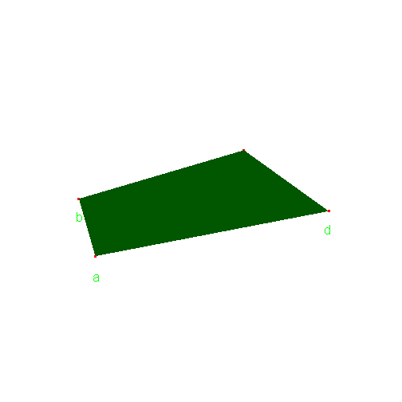
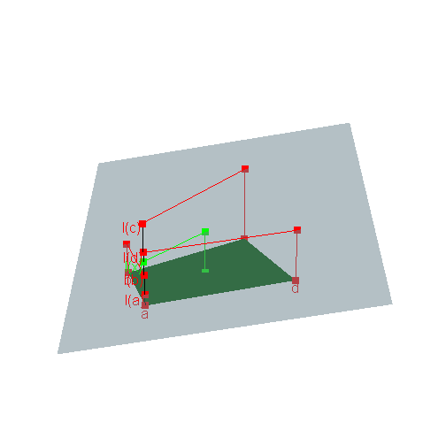

---
title: Using R to compute the Kantorovich distance
date : 2013-07-02
--- &lead


The Kantorovich distance between two probability measures $\mu$ and $\nu$ on a finite set $A$ equipped with a metric $d$ is defined as 
$$d'(\mu,\nu)=
\min_{\Lambda \in {\cal J}(\mu, \nu)} \int d(x,y)\textrm{d}\Lambda(x,y) $$
where ${\cal J}(\mu, \nu)$ is the set of all joinings of $\mu$ and $\nu$, that is, the set of all probability measures $\Lambda$ on $A \times A$ whose margins 
are $\mu$ and $\nu$.    


The  Kantorovich distance can also be defined for more general metric spaces 
$(A,d)$ but our purpose is to show how to compute the Kantorovich distance in R when $A$ is finite.   


Actually the main part of the work will be to get the *extreme points* of 
the set of joinings ${\cal J}(\mu, \nu)$. 
Indeed, 
this set  has a convex structure and the numerical application 
$${\cal J}(\mu, \nu) \ni \Lambda \mapsto \int d(x,y)\textrm{d}\Lambda(x,y)$$
is linear. 
Therefore, any extremal value of this application, 
in particular the  Kantorovich distance $d'(\mu,\nu)$, 
is attained by an extreme joining $\Lambda \in {\cal J}(\mu, \nu)$. 
This latter point will be explained below, and we will also see 
that ${\cal J}(\mu, \nu)$ is a *convex polyhedron*. 


## Computing extreme joinings in R 

What is an extreme joining in ${\cal J}(\mu, \nu)$ ? 
First of all, what is a joining in ${\cal J}(\mu, \nu)$ ? 
Consider for instance $A=\{a_1,a_2,a_3\}$ then a joining of $\mu$ and $\nu$ is 
given by a matrix 
$$P=\begin{pmatrix}
p_{11} & p_{12} & p_{13} \\
p_{21} & p_{22} & p_{23} \\
p_{31} & p_{32} & p_{33} 
\end{pmatrix}$$
whose $(i,j)$-th entry $p_{ij}$ is the probability 
$p_{ij}=\Pr(X=i,Y=j)$ where $X \sim \mu$ and $Y \sim \nu$ are random variables on $A$. 
Given a distance $d$ on $A$, 
the Kantorovich distance $d'(\mu,\nu)$ is then the minimal possible value 
of the mean distance $\mathbb{E}[d(X,Y)]$ between $X$ and $Y$. 
Note that $\mathbb{E}[d(X,Y)]=\Pr(X \neq Y)$ when taking $d$ as the 
discrete $0-1$ distance on $A$. 


### The $H$-representation of ${\cal J}(\mu, \nu)$ 

The possible values of the $p_{ij}$ satisfy the following three sets of 
linear equality/inequality constraints:
$$\begin{cases}
{\rm (1a) } \quad \sum_j p_{ij} = \mu(a_i) & \forall i \\ 
{\rm (1b) } \quad \sum_i p_{ij} = \nu(a_j) & \forall j \\
{\rm (2) } \quad  p_{ij} \geq 0 & \forall i,j \\
\end{cases}.$$
Considering $P$ written in stacked form : 
$$P={\begin{pmatrix}
p_{11} & p_{12} & p_{13} &
p_{21} & p_{22} & p_{23} &
p_{31} & p_{32} & p_{33} 
\end{pmatrix}}'$$
then the first  set ${\rm (1a)}$ of linear equality constraints is $M_1 P = 0$ with 
$$ M_1 = \begin{pmatrix}
1 & 1 & 1 & 0 & 0 & 0 & 0 & 0 & 0 \\
 0 & 0 & 0 & 1 & 1 & 1  & 0 & 0 & 0 \\
 0 & 0 & 0 & 0 & 0 & 0 & 1 & 1 & 1  
\end{pmatrix} $$
and the second set ${\rm (1b)}$ of linear equality constraints is $M_2 P = 0$ with 
$$ M_2 = \begin{pmatrix}
1 & 0 & 0 & 1 & 0 & 0 & 1 & 0 & 0 \\
 0 & 1 & 0 & 0 & 1 & 0  & 0 & 1 & 0 \\
 0 & 0 & 1 & 0 & 0 & 1 & 0 & 0 & 1  
\end{pmatrix}. $$


With the terminology of the [cddlibb library](http://web.mit.edu/sage/export/tmp/cddlib-094b/doc/cddlibman.pdf), ${\cal J}(\mu, \nu)$ is a *convex polyhedron* and the linear constraints above define its *H-representation*. 
Schematically, one can imagine ${\cal J}(\mu, \nu)$ as a convex polyhedra embedded in a higher dimensional space:

<script src="CanvasMatrix.js" type="text/javascript"></script>
<canvas id="rglkantorovich1textureCanvas" style="display: none;" width="256" height="256">
<br>
	Your browser does not support the HTML5 canvas element.</canvas>
<!-- ****** points object 6 ****** -->
<script id="rglkantorovich1vshader6" type="x-shader/x-vertex">
	attribute vec3 aPos;
	attribute vec4 aCol;
	uniform mat4 mvMatrix;
	uniform mat4 prMatrix;
	varying vec4 vCol;
	varying vec4 vPosition;
	void main(void) {
	  vPosition = mvMatrix * vec4(aPos, 1.);
	  gl_Position = prMatrix * vPosition;
	  gl_PointSize = 3.;
	  vCol = aCol;
	}
</script>
<script id="rglkantorovich1fshader6" type="x-shader/x-fragment"> 
	#ifdef GL_ES
	precision highp float;
	#endif
	varying vec4 vCol; // carries alpha
	varying vec4 vPosition;
	void main(void) {
      vec4 colDiff = vCol;
	  vec4 lighteffect = colDiff;
	  gl_FragColor = lighteffect;
	}
</script> 
<!-- ****** quads object 7 ****** -->
<script id="rglkantorovich1vshader7" type="x-shader/x-vertex">
	attribute vec3 aPos;
	attribute vec4 aCol;
	uniform mat4 mvMatrix;
	uniform mat4 prMatrix;
	varying vec4 vCol;
	varying vec4 vPosition;
	attribute vec3 aNorm;
	uniform mat4 normMatrix;
	varying vec3 vNormal;
	void main(void) {
	  vPosition = mvMatrix * vec4(aPos, 1.);
	  gl_Position = prMatrix * vPosition;
	  vCol = aCol;
	  vNormal = normalize((normMatrix * vec4(aNorm, 1.)).xyz);
	}
</script>
<script id="rglkantorovich1fshader7" type="x-shader/x-fragment"> 
	#ifdef GL_ES
	precision highp float;
	#endif
	varying vec4 vCol; // carries alpha
	varying vec4 vPosition;
	varying vec3 vNormal;
	void main(void) {
	  vec3 eye = normalize(-vPosition.xyz);
	  const vec3 emission = vec3(0., 0., 0.);
	  const vec3 ambient1 = vec3(0., 0., 0.);
	  const vec3 specular1 = vec3(1., 1., 1.);// light*material
	  const float shininess1 = 50.;
	  vec4 colDiff1 = vec4(vCol.rgb * vec3(1., 1., 1.), vCol.a);
	  const vec3 lightDir1 = vec3(0., 0., 1.);
	  vec3 halfVec1 = normalize(lightDir1 + eye);
      vec4 lighteffect = vec4(emission, 0.);
	  vec3 n = normalize(vNormal);
	  n = -faceforward(n, n, eye);
	  vec3 col1 = ambient1;
	  float nDotL1 = dot(n, lightDir1);
	  col1 = col1 + max(nDotL1, 0.) * colDiff1.rgb;
	  col1 = col1 + pow(max(dot(halfVec1, n), 0.), shininess1) * specular1;
	  lighteffect = lighteffect + vec4(col1, colDiff1.a);
	  gl_FragColor = lighteffect;
	}
</script> 
<!-- ****** text object 8 ****** -->
<script id="rglkantorovich1vshader8" type="x-shader/x-vertex">
	attribute vec3 aPos;
	attribute vec4 aCol;
	uniform mat4 mvMatrix;
	uniform mat4 prMatrix;
	varying vec4 vCol;
	varying vec4 vPosition;
	attribute vec2 aTexcoord;
	varying vec2 vTexcoord;
	attribute vec2 aOfs;
	void main(void) {
	  vCol = aCol;
	  vTexcoord = aTexcoord;
	  vec4 pos = prMatrix * mvMatrix * vec4(aPos, 1.);
	  pos = pos/pos.w;
	  gl_Position = pos + vec4(aOfs, 0.,0.);
	}
</script>
<script id="rglkantorovich1fshader8" type="x-shader/x-fragment"> 
	#ifdef GL_ES
	precision highp float;
	#endif
	varying vec4 vCol; // carries alpha
	varying vec4 vPosition;
	varying vec2 vTexcoord;
	uniform sampler2D uSampler;
	void main(void) {
      vec4 colDiff = vCol;
	  vec4 lighteffect = colDiff;
	  vec4 textureColor = lighteffect*texture2D(uSampler, vTexcoord);
	  if (textureColor.a < 0.1)
	    discard;
	  else
	    gl_FragColor = textureColor;
	}
</script> 
<script type="text/javascript"> 
	function getShader ( gl, id ){
	   var shaderScript = document.getElementById ( id );
	   var str = "";
	   var k = shaderScript.firstChild;
	   while ( k ){
	     if ( k.nodeType == 3 ) str += k.textContent;
	     k = k.nextSibling;
	   }
	   var shader;
	   if ( shaderScript.type == "x-shader/x-fragment" )
             shader = gl.createShader ( gl.FRAGMENT_SHADER );
	   else if ( shaderScript.type == "x-shader/x-vertex" )
             shader = gl.createShader(gl.VERTEX_SHADER);
	   else return null;
	   gl.shaderSource(shader, str);
	   gl.compileShader(shader);
	   if (gl.getShaderParameter(shader, gl.COMPILE_STATUS) == 0)
	     alert(gl.getShaderInfoLog(shader));
	   return shader;
	}
	var min = Math.min;
	var max = Math.max;
	var sqrt = Math.sqrt;
	var sin = Math.sin;
	var acos = Math.acos;
	var tan = Math.tan;
	var SQRT2 = Math.SQRT2;
	var PI = Math.PI;
	var log = Math.log;
	var exp = Math.exp;
	function rglkantorovich1webGLStart() {
	   var debug = function(msg) {
	     document.getElementById("rglkantorovich1debug").innerHTML = msg;
	   }
	   debug("");
	   var canvas = document.getElementById("rglkantorovich1canvas");
	   if (!window.WebGLRenderingContext){
	     debug("<br> Your browser does not support WebGL. See <a href=\"http://get.webgl.org\">http://get.webgl.org</a>");
	     return;
	   }
	   var gl;
	   try {
	     // Try to grab the standard context. If it fails, fallback to experimental.
	     gl = canvas.getContext("webgl") 
	       || canvas.getContext("experimental-webgl");
	   }
	   catch(e) {}
	   if ( !gl ) {
	     debug("<br> Your browser appears to support WebGL, but did not create a WebGL context.  See <a href=\"http://get.webgl.org\">http://get.webgl.org</a>");
	     return;
	   }
	   var width = 505;  var height = 505;
	   canvas.width = width;   canvas.height = height;
	   gl.viewport(0, 0, width, height);
	   var prMatrix = new CanvasMatrix4();
	   var mvMatrix = new CanvasMatrix4();
	   var normMatrix = new CanvasMatrix4();
	   var saveMat = new CanvasMatrix4();
	   saveMat.makeIdentity();
	   var distance;
	   var posLoc = 0;
	   var colLoc = 1;
	   var zoom = 1;
	   var fov = 30;
	   var userMatrix = new CanvasMatrix4();
	   userMatrix.load([
	    1, 0, 0, 0,
	    0, 0.3420201, -0.9396926, 0,
	    0, 0.9396926, 0.3420201, 0,
	    0, 0, 0, 1
		]);
	   function getPowerOfTwo(value) {
	     var pow = 1;
	     while(pow<value) {
	       pow *= 2;
	     }
	     return pow;
	   }
	   function handleLoadedTexture(texture, textureCanvas) {
	     gl.pixelStorei(gl.UNPACK_FLIP_Y_WEBGL, true);
	     gl.bindTexture(gl.TEXTURE_2D, texture);
	     gl.texImage2D(gl.TEXTURE_2D, 0, gl.RGBA, gl.RGBA, gl.UNSIGNED_BYTE, textureCanvas);
	     gl.texParameteri(gl.TEXTURE_2D, gl.TEXTURE_MAG_FILTER, gl.LINEAR);
	     gl.texParameteri(gl.TEXTURE_2D, gl.TEXTURE_MIN_FILTER, gl.LINEAR_MIPMAP_NEAREST);
	     gl.generateMipmap(gl.TEXTURE_2D);
	     gl.bindTexture(gl.TEXTURE_2D, null);
	   }
	   function loadImageToTexture(filename, texture) {   
	     var canvas = document.getElementById("rglkantorovich1textureCanvas");
	     var ctx = canvas.getContext("2d");
	     var image = new Image();
	     image.onload = function() {
	       var w = image.width;
	       var h = image.height;
	       var canvasX = getPowerOfTwo(w);
	       var canvasY = getPowerOfTwo(h);
	       canvas.width = canvasX;
	       canvas.height = canvasY;
	       ctx.imageSmoothingEnabled = true;
	       ctx.drawImage(image, 0, 0, canvasX, canvasY);
	       handleLoadedTexture(texture, canvas);
   	       drawScene();
	     }
	     image.src = filename;
	   }  	   
	   function drawTextToCanvas(text, cex) {
	     var canvasX, canvasY;
	     var textX, textY;
	     var textHeight = 20 * cex;
	     var textColour = "white";
	     var fontFamily = "Arial";
	     var backgroundColour = "rgba(0,0,0,0)";
	     var canvas = document.getElementById("rglkantorovich1textureCanvas");
	     var ctx = canvas.getContext("2d");
	     ctx.font = textHeight+"px "+fontFamily;
             canvasX = 1;
             var widths = [];
	     for (var i = 0; i < text.length; i++)  {
	       widths[i] = ctx.measureText(text[i]).width;
	       canvasX = (widths[i] > canvasX) ? widths[i] : canvasX;
	     }	  
	     canvasX = getPowerOfTwo(canvasX);
	     var offset = 2*textHeight; // offset to first baseline
	     var skip = 2*textHeight;   // skip between baselines	  
	     canvasY = getPowerOfTwo(offset + text.length*skip);
	     canvas.width = canvasX;
	     canvas.height = canvasY;
	     ctx.fillStyle = backgroundColour;
	     ctx.fillRect(0, 0, ctx.canvas.width, ctx.canvas.height);
	     ctx.fillStyle = textColour;
	     ctx.textAlign = "left";
	     ctx.textBaseline = "alphabetic";
	     ctx.font = textHeight+"px "+fontFamily;
	     for(var i = 0; i < text.length; i++) {
	       textY = i*skip + offset;
	       ctx.fillText(text[i], 0,  textY);
	     }
	     return {canvasX:canvasX, canvasY:canvasY,
	             widths:widths, textHeight:textHeight,
	             offset:offset, skip:skip};
	   }
	   // ****** points object 6 ******
	   var prog6  = gl.createProgram();
	   gl.attachShader(prog6, getShader( gl, "rglkantorovich1vshader6" ));
	   gl.attachShader(prog6, getShader( gl, "rglkantorovich1fshader6" ));
	   //  Force aPos to location 0, aCol to location 1 
	   gl.bindAttribLocation(prog6, 0, "aPos");
	   gl.bindAttribLocation(prog6, 1, "aCol");
	   gl.linkProgram(prog6);
	   var v=new Float32Array([
	    0, 0, 0,
	    -1, 4, 0,
	    4, 9, 0,
	    6, 3, 0
	   ]);
	   var buf6 = gl.createBuffer();
	   gl.bindBuffer(gl.ARRAY_BUFFER, buf6);
	   gl.bufferData(gl.ARRAY_BUFFER, v, gl.STATIC_DRAW);
	   var mvMatLoc6 = gl.getUniformLocation(prog6,"mvMatrix");
	   var prMatLoc6 = gl.getUniformLocation(prog6,"prMatrix");
	   // ****** quads object 7 ******
	   var prog7  = gl.createProgram();
	   gl.attachShader(prog7, getShader( gl, "rglkantorovich1vshader7" ));
	   gl.attachShader(prog7, getShader( gl, "rglkantorovich1fshader7" ));
	   //  Force aPos to location 0, aCol to location 1 
	   gl.bindAttribLocation(prog7, 0, "aPos");
	   gl.bindAttribLocation(prog7, 1, "aCol");
	   gl.linkProgram(prog7);
	   var v=new Float32Array([
	    0, 0, 0, 0, 0, -1,
	    -1, 4, 0, 0, 0, -1,
	    4, 9, 0, 0, 0, -1,
	    6, 3, 0, 0, 0, -1
	   ]);
	   var normLoc7 = gl.getAttribLocation(prog7, "aNorm");
	   var f=new Uint16Array([
	    0, 1, 2, 0, 2, 3
	   ]);
	   var buf7 = gl.createBuffer();
	   gl.bindBuffer(gl.ARRAY_BUFFER, buf7);
	   gl.bufferData(gl.ARRAY_BUFFER, v, gl.STATIC_DRAW);
	   var ibuf7 = gl.createBuffer();
	   gl.bindBuffer(gl.ELEMENT_ARRAY_BUFFER, ibuf7);
	   gl.bufferData(gl.ELEMENT_ARRAY_BUFFER, f, gl.STATIC_DRAW);
	   var mvMatLoc7 = gl.getUniformLocation(prog7,"mvMatrix");
	   var prMatLoc7 = gl.getUniformLocation(prog7,"prMatrix");
	   var normMatLoc7 = gl.getUniformLocation(prog7,"normMatrix");
	   // ****** text object 8 ******
	   var prog8  = gl.createProgram();
	   gl.attachShader(prog8, getShader( gl, "rglkantorovich1vshader8" ));
	   gl.attachShader(prog8, getShader( gl, "rglkantorovich1fshader8" ));
	   //  Force aPos to location 0, aCol to location 1 
	   gl.bindAttribLocation(prog8, 0, "aPos");
	   gl.bindAttribLocation(prog8, 1, "aCol");
	   gl.linkProgram(prog8);
	   var texts = [
	    "a",
	    "b",
	    "c",
	    "d"
	   ];
	   var texinfo = drawTextToCanvas(texts, 1);	 
	   var canvasX8 = texinfo.canvasX;
	   var canvasY8 = texinfo.canvasY;
	   var ofsLoc8 = gl.getAttribLocation(prog8, "aOfs");
	   var texture8 = gl.createTexture();
	   var texLoc8 = gl.getAttribLocation(prog8, "aTexcoord");
	   var sampler8 = gl.getUniformLocation(prog8,"uSampler");
    	   handleLoadedTexture(texture8, document.getElementById("rglkantorovich1textureCanvas"));
	   var v=new Float32Array([
	    0, 0, -0.5, 0, -0.5, 0.5, 0.5,
	    0, 0, -0.5, 1, -0.5, 0.5, 0.5,
	    0, 0, -0.5, 1, 1.5, 0.5, 0.5,
	    0, 0, -0.5, 0, 1.5, 0.5, 0.5,
	    -1, 4, -0.5, 0, -0.5, 0.5, 0.5,
	    -1, 4, -0.5, 1, -0.5, 0.5, 0.5,
	    -1, 4, -0.5, 1, 1.5, 0.5, 0.5,
	    -1, 4, -0.5, 0, 1.5, 0.5, 0.5,
	    4, 9, -0.5, 0, -0.5, 0.5, 0.5,
	    4, 9, -0.5, 1, -0.5, 0.5, 0.5,
	    4, 9, -0.5, 1, 1.5, 0.5, 0.5,
	    4, 9, -0.5, 0, 1.5, 0.5, 0.5,
	    6, 3, -0.5, 0, -0.5, 0.5, 0.5,
	    6, 3, -0.5, 1, -0.5, 0.5, 0.5,
	    6, 3, -0.5, 1, 1.5, 0.5, 0.5,
	    6, 3, -0.5, 0, 1.5, 0.5, 0.5
	   ]);
	   for (var i=0; i<4; i++) 
	     for (var j=0; j<4; j++) {
	         ind = 7*(4*i + j) + 3;
	         v[ind+2] = 2*(v[ind]-v[ind+2])*texinfo.widths[i]/width;
	         v[ind+3] = 2*(v[ind+1]-v[ind+3])*texinfo.textHeight/height;
	         v[ind] *= texinfo.widths[i]/texinfo.canvasX;
	         v[ind+1] = 1.0-(texinfo.offset + i*texinfo.skip 
	           - v[ind+1]*texinfo.textHeight)/texinfo.canvasY;
	     }
	   var f=new Uint16Array([
	    0, 1, 2, 0, 2, 3,
	    4, 5, 6, 4, 6, 7,
	    8, 9, 10, 8, 10, 11,
	    12, 13, 14, 12, 14, 15
	   ]);
	   var buf8 = gl.createBuffer();
	   gl.bindBuffer(gl.ARRAY_BUFFER, buf8);
	   gl.bufferData(gl.ARRAY_BUFFER, v, gl.STATIC_DRAW);
	   var ibuf8 = gl.createBuffer();
	   gl.bindBuffer(gl.ELEMENT_ARRAY_BUFFER, ibuf8);
	   gl.bufferData(gl.ELEMENT_ARRAY_BUFFER, f, gl.STATIC_DRAW);
	   var mvMatLoc8 = gl.getUniformLocation(prog8,"mvMatrix");
	   var prMatLoc8 = gl.getUniformLocation(prog8,"prMatrix");
	   gl.enable(gl.DEPTH_TEST);
	   gl.depthFunc(gl.LEQUAL);
	   gl.clearDepth(1.0);
	   gl.clearColor(1, 1, 1, 1);
	   var xOffs = yOffs = 0,  drag  = 0;
	   drawScene();
	   function drawScene(){
	     gl.depthMask(true);
	     gl.disable(gl.BLEND);
	     var radius = 6.276992;
	     var s = sin(fov*PI/360);
	     var t = tan(fov*PI/360);
	     var distance = radius/s;
	     var near = distance - radius;
	     var far = distance + radius;
	     var hlen = t*near;
	     var aspect = width/height;
	     prMatrix.makeIdentity();
	     if (aspect > 1)
	       prMatrix.frustum(-hlen*aspect*zoom, hlen*aspect*zoom, 
	                        -hlen*zoom, hlen*zoom, near, far);
	     else  
	       prMatrix.frustum(-hlen*zoom, hlen*zoom, 
	                        -hlen*zoom/aspect, hlen*zoom/aspect, 
	                        near, far);
	     mvMatrix.makeIdentity();
	     mvMatrix.translate( -2.5, -4.5, 0.25 );
	     mvMatrix.scale( 1, 1, 1 );   
	     mvMatrix.multRight( userMatrix );  
	     mvMatrix.translate(0, 0, -distance);
	     normMatrix.makeIdentity();
	     normMatrix.scale( 1, 1, 1 );   
	     normMatrix.multRight( userMatrix );
	     gl.clear(gl.COLOR_BUFFER_BIT | gl.DEPTH_BUFFER_BIT);
	     // ****** points object 6 *******
	     gl.useProgram(prog6);
	     gl.bindBuffer(gl.ARRAY_BUFFER, buf6);
	     gl.uniformMatrix4fv( prMatLoc6, false, new Float32Array(prMatrix.getAsArray()) );
	     gl.uniformMatrix4fv( mvMatLoc6, false, new Float32Array(mvMatrix.getAsArray()) );
	     gl.enableVertexAttribArray( posLoc );
	     gl.disableVertexAttribArray( colLoc );
	     gl.vertexAttrib4f( colLoc, 1, 0, 0, 1 );
	     gl.vertexAttribPointer(posLoc,  3, gl.FLOAT, false, 12,  0);
	     gl.drawArrays(gl.POINTS, 0, 4);
	     // ****** quads object 7 *******
	     gl.useProgram(prog7);
	     gl.bindBuffer(gl.ARRAY_BUFFER, buf7);
	     gl.bindBuffer(gl.ELEMENT_ARRAY_BUFFER, ibuf7);
	     gl.uniformMatrix4fv( prMatLoc7, false, new Float32Array(prMatrix.getAsArray()) );
	     gl.uniformMatrix4fv( mvMatLoc7, false, new Float32Array(mvMatrix.getAsArray()) );
	     gl.uniformMatrix4fv( normMatLoc7, false, new Float32Array(normMatrix.getAsArray()) );
	     gl.enableVertexAttribArray( posLoc );
	     gl.disableVertexAttribArray( colLoc );
	     gl.vertexAttrib4f( colLoc, 0, 1, 0, 1 );
	     gl.enableVertexAttribArray( normLoc7 );
	     gl.vertexAttribPointer(normLoc7, 3, gl.FLOAT, false, 24, 12);
	     gl.vertexAttribPointer(posLoc,  3, gl.FLOAT, false, 24,  0);
	     gl.drawElements(gl.TRIANGLES, 6, gl.UNSIGNED_SHORT, 0);
	     // ****** text object 8 *******
	     gl.useProgram(prog8);
	     gl.bindBuffer(gl.ARRAY_BUFFER, buf8);
	     gl.bindBuffer(gl.ELEMENT_ARRAY_BUFFER, ibuf8);
	     gl.uniformMatrix4fv( prMatLoc8, false, new Float32Array(prMatrix.getAsArray()) );
	     gl.uniformMatrix4fv( mvMatLoc8, false, new Float32Array(mvMatrix.getAsArray()) );
	     gl.enableVertexAttribArray( posLoc );
	     gl.disableVertexAttribArray( colLoc );
	     gl.vertexAttrib4f( colLoc, 0, 1, 0, 1 );
	     gl.enableVertexAttribArray( texLoc8 );
	     gl.vertexAttribPointer(texLoc8, 2, gl.FLOAT, false, 28, 12);
	     gl.activeTexture(gl.TEXTURE0);
	     gl.bindTexture(gl.TEXTURE_2D, texture8);
	     gl.uniform1i( sampler8, 0);
	     gl.enableVertexAttribArray( ofsLoc8 );
	     gl.vertexAttribPointer(ofsLoc8, 2, gl.FLOAT, false, 28, 20);
	     gl.vertexAttribPointer(posLoc,  3, gl.FLOAT, false, 28,  0);
	     gl.drawElements(gl.TRIANGLES, 24, gl.UNSIGNED_SHORT, 0);
	     gl.flush ();
	   }
	   var vlen = function(v) {
	     return sqrt(v[0]*v[0] + v[1]*v[1] + v[2]*v[2])
	   }
	   var xprod = function(a, b) {
	     return [a[1]*b[2] - a[2]*b[1],
	             a[2]*b[0] - a[0]*b[2],
	             a[0]*b[1] - a[1]*b[0]];
	   }
	   var screenToVector = function(x, y) {
	     var radius = max(width, height)/2.0;
	     var cx = width/2.0;
	     var cy = height/2.0;
	     var px = (x-cx)/radius;
	     var py = (y-cy)/radius;
	     var plen = sqrt(px*px+py*py);
	     if (plen > 1.e-6) { 
	       px = px/plen;
	       py = py/plen;
	     }
	     var angle = (SQRT2 - plen)/SQRT2*PI/2;
	     var z = sin(angle);
	     var zlen = sqrt(1.0 - z*z);
	     px = px * zlen;
	     py = py * zlen;
	     return [px, py, z];
	   }
	   var rotBase;
	   var trackballdown = function(x,y) {
	     rotBase = screenToVector(x, y);
	     saveMat.load(userMatrix);
	   }
	   var trackballmove = function(x,y) {
	     var rotCurrent = screenToVector(x,y);
	     var dot = rotBase[0]*rotCurrent[0] + 
	   	       rotBase[1]*rotCurrent[1] + 
	   	       rotBase[2]*rotCurrent[2];
	     var angle = acos( dot/vlen(rotBase)/vlen(rotCurrent) )*180./PI;
	     var axis = xprod(rotBase, rotCurrent);
	     userMatrix.load(saveMat);
	     userMatrix.rotate(angle, axis[0], axis[1], axis[2]);
	     drawScene();
	   }
	   var y0zoom = 0;
	   var zoom0 = 1;
	   var zoomdown = function(x, y) {
	     y0zoom = y;
	     zoom0 = log(zoom);
	   }
	   var zoommove = function(x, y) {
	     zoom = exp(zoom0 + (y-y0zoom)/height);
	     drawScene();
	   }
	   var y0fov = 0;
	   var fov0 = 1;
	   var fovdown = function(x, y) {
	     y0fov = y;
	     fov0 = fov;
	   }
	   var fovmove = function(x, y) {
	     fov = max(1, min(179, fov0 + 180*(y-y0fov)/height));
	     drawScene();
	   }
	   var mousedown = [trackballdown, zoomdown, fovdown];
	   var mousemove = [trackballmove, zoommove, fovmove];
	   function relMouseCoords(event){
	     var totalOffsetX = 0;
	     var totalOffsetY = 0;
	     var currentElement = canvas;
	     do{
	       totalOffsetX += currentElement.offsetLeft;
	       totalOffsetY += currentElement.offsetTop;
	     }
	     while(currentElement = currentElement.offsetParent)
	     var canvasX = event.pageX - totalOffsetX;
	     var canvasY = event.pageY - totalOffsetY;
	     return {x:canvasX, y:canvasY}
	   }
	   canvas.onmousedown = function ( ev ){
	     if (!ev.which) // Use w3c defns in preference to MS
	       switch (ev.button) {
	       case 0: ev.which = 1; break;
	       case 1: 
	       case 4: ev.which = 2; break;
	       case 2: ev.which = 3;
	     }
	     drag = ev.which;
	     var f = mousedown[drag-1];
	     if (f) {
	       var coords = relMouseCoords(ev);
	       f(coords.x, height-coords.y); 
	       ev.preventDefault();
	     }
	   }    
	   canvas.onmouseup = function ( ev ){	
	     drag = 0;
	   }
	   canvas.onmouseout = canvas.onmouseup;
	   canvas.onmousemove = function ( ev ){
	     if ( drag == 0 ) return;
	     var f = mousemove[drag-1];
	     if (f) {
	       var coords = relMouseCoords(ev);
	       f(coords.x, height-coords.y);
	     }
	   }
	   var wheelHandler = function(ev) {
	     var del = 1.1;
	     if (ev.shiftKey) del = 1.01;
	     var ds = ((ev.detail || ev.wheelDelta) > 0) ? del : (1 / del);
	     zoom *= ds;
	     drawScene();
	     ev.preventDefault();
	   };
	   canvas.addEventListener("DOMMouseScroll", wheelHandler, false);
	   canvas.addEventListener("mousewheel", wheelHandler, false);
	}
</script>
<canvas id="rglkantorovich1canvas" width="1" height="1"></canvas> 
<p id="rglkantorovich1debug">
<br>
	You must enable Javascript to view this page properly.</p>
<script>rglkantorovich1webGLStart();</script>

Here ${\cal J}(\mu, \nu)$ is a $4$-dimensional convex polyhedron embedded in a $9$-dimensional space: its elements are given by $9$ parameters $p_{ij}$ but they are determined by only $4$ of them because of the linear equality constraints ${\rm (1a)}$ and ${\rm (1b)}$.  

 
### Vertices of ${\cal J}(\mu, \nu)$ achieve the Kantorovich distance

In the introduction we mentionned that the application   
$${\cal J}(\mu, \nu) \ni \Lambda \mapsto \int d(x,y)\textrm{d}\Lambda(x,y)$$
is linear and we claimed that consequently any of its extremal values is attained by an *extreme point* of ${\cal J}(\mu, \nu)$. Why ?

Extreme points of a convex polyhedron are nothing but its vertices. Consider a point $x$ in a convex polyhedron which is not a vertex, as in the figure below. 
Then $x$ is a convex combination of the vertices $a$, $b$, $c$, $d$, and therefore the image $\ell(x)$ of $x$ by any linear function $\ell$ is the same  convex combination of $\ell(a)$, $\ell(b)$, $\ell(c)$, $\ell(d)$. 
See figure below, where the polyhedron is in the $xy$-plane and the value of 
$\ell$ is given on the $z$-axis. 

<script src="CanvasMatrix.js" type="text/javascript"></script>
<canvas id="rglkantorovich2textureCanvas" style="display: none;" width="256" height="256">
<br>
	Your browser does not support the HTML5 canvas element.</canvas>
<!-- ****** lines object 10 ****** -->
<script id="rglkantorovich2vshader10" type="x-shader/x-vertex">
	attribute vec3 aPos;
	attribute vec4 aCol;
	uniform mat4 mvMatrix;
	uniform mat4 prMatrix;
	varying vec4 vCol;
	varying vec4 vPosition;
	void main(void) {
	  vPosition = mvMatrix * vec4(aPos, 1.);
	  gl_Position = prMatrix * vPosition;
	  vCol = aCol;
	}
</script>
<script id="rglkantorovich2fshader10" type="x-shader/x-fragment"> 
	#ifdef GL_ES
	precision highp float;
	#endif
	varying vec4 vCol; // carries alpha
	varying vec4 vPosition;
	void main(void) {
      vec4 colDiff = vCol;
	  vec4 lighteffect = colDiff;
	  gl_FragColor = lighteffect;
	}
</script> 
<!-- ****** lines object 11 ****** -->
<script id="rglkantorovich2vshader11" type="x-shader/x-vertex">
	attribute vec3 aPos;
	attribute vec4 aCol;
	uniform mat4 mvMatrix;
	uniform mat4 prMatrix;
	varying vec4 vCol;
	varying vec4 vPosition;
	void main(void) {
	  vPosition = mvMatrix * vec4(aPos, 1.);
	  gl_Position = prMatrix * vPosition;
	  vCol = aCol;
	}
</script>
<script id="rglkantorovich2fshader11" type="x-shader/x-fragment"> 
	#ifdef GL_ES
	precision highp float;
	#endif
	varying vec4 vCol; // carries alpha
	varying vec4 vPosition;
	void main(void) {
      vec4 colDiff = vCol;
	  vec4 lighteffect = colDiff;
	  gl_FragColor = lighteffect;
	}
</script> 
<!-- ****** text object 12 ****** -->
<script id="rglkantorovich2vshader12" type="x-shader/x-vertex">
	attribute vec3 aPos;
	attribute vec4 aCol;
	uniform mat4 mvMatrix;
	uniform mat4 prMatrix;
	varying vec4 vCol;
	varying vec4 vPosition;
	attribute vec2 aTexcoord;
	varying vec2 vTexcoord;
	attribute vec2 aOfs;
	void main(void) {
	  vCol = aCol;
	  vTexcoord = aTexcoord;
	  vec4 pos = prMatrix * mvMatrix * vec4(aPos, 1.);
	  pos = pos/pos.w;
	  gl_Position = pos + vec4(aOfs, 0.,0.);
	}
</script>
<script id="rglkantorovich2fshader12" type="x-shader/x-fragment"> 
	#ifdef GL_ES
	precision highp float;
	#endif
	varying vec4 vCol; // carries alpha
	varying vec4 vPosition;
	varying vec2 vTexcoord;
	uniform sampler2D uSampler;
	void main(void) {
      vec4 colDiff = vCol;
	  vec4 lighteffect = colDiff;
	  vec4 textureColor = lighteffect*texture2D(uSampler, vTexcoord);
	  if (textureColor.a < 0.1)
	    discard;
	  else
	    gl_FragColor = textureColor;
	}
</script> 
<!-- ****** text object 13 ****** -->
<script id="rglkantorovich2vshader13" type="x-shader/x-vertex">
	attribute vec3 aPos;
	attribute vec4 aCol;
	uniform mat4 mvMatrix;
	uniform mat4 prMatrix;
	varying vec4 vCol;
	varying vec4 vPosition;
	attribute vec2 aTexcoord;
	varying vec2 vTexcoord;
	attribute vec2 aOfs;
	void main(void) {
	  vCol = aCol;
	  vTexcoord = aTexcoord;
	  vec4 pos = prMatrix * mvMatrix * vec4(aPos, 1.);
	  pos = pos/pos.w;
	  gl_Position = pos + vec4(aOfs, 0.,0.);
	}
</script>
<script id="rglkantorovich2fshader13" type="x-shader/x-fragment"> 
	#ifdef GL_ES
	precision highp float;
	#endif
	varying vec4 vCol; // carries alpha
	varying vec4 vPosition;
	varying vec2 vTexcoord;
	uniform sampler2D uSampler;
	void main(void) {
      vec4 colDiff = vCol;
	  vec4 lighteffect = colDiff;
	  vec4 textureColor = lighteffect*texture2D(uSampler, vTexcoord);
	  if (textureColor.a < 0.1)
	    discard;
	  else
	    gl_FragColor = textureColor;
	}
</script> 
<!-- ****** text object 14 ****** -->
<script id="rglkantorovich2vshader14" type="x-shader/x-vertex">
	attribute vec3 aPos;
	attribute vec4 aCol;
	uniform mat4 mvMatrix;
	uniform mat4 prMatrix;
	varying vec4 vCol;
	varying vec4 vPosition;
	attribute vec2 aTexcoord;
	varying vec2 vTexcoord;
	attribute vec2 aOfs;
	void main(void) {
	  vCol = aCol;
	  vTexcoord = aTexcoord;
	  vec4 pos = prMatrix * mvMatrix * vec4(aPos, 1.);
	  pos = pos/pos.w;
	  gl_Position = pos + vec4(aOfs, 0.,0.);
	}
</script>
<script id="rglkantorovich2fshader14" type="x-shader/x-fragment"> 
	#ifdef GL_ES
	precision highp float;
	#endif
	varying vec4 vCol; // carries alpha
	varying vec4 vPosition;
	varying vec2 vTexcoord;
	uniform sampler2D uSampler;
	void main(void) {
      vec4 colDiff = vCol;
	  vec4 lighteffect = colDiff;
	  vec4 textureColor = lighteffect*texture2D(uSampler, vTexcoord);
	  if (textureColor.a < 0.1)
	    discard;
	  else
	    gl_FragColor = textureColor;
	}
</script> 
<!-- ****** surface object 15 ****** -->
<script id="rglkantorovich2vshader15" type="x-shader/x-vertex">
	attribute vec3 aPos;
	attribute vec4 aCol;
	uniform mat4 mvMatrix;
	uniform mat4 prMatrix;
	varying vec4 vCol;
	varying vec4 vPosition;
	attribute vec3 aNorm;
	uniform mat4 normMatrix;
	varying vec3 vNormal;
	void main(void) {
	  vPosition = mvMatrix * vec4(aPos, 1.);
	  gl_Position = prMatrix * vPosition;
	  vCol = aCol;
	  vNormal = normalize((normMatrix * vec4(aNorm, 1.)).xyz);
	}
</script>
<script id="rglkantorovich2fshader15" type="x-shader/x-fragment"> 
	#ifdef GL_ES
	precision highp float;
	#endif
	varying vec4 vCol; // carries alpha
	varying vec4 vPosition;
	varying vec3 vNormal;
	void main(void) {
	  vec3 eye = normalize(-vPosition.xyz);
	  const vec3 emission = vec3(0., 0., 0.);
	  const vec3 ambient1 = vec3(0., 0., 0.);
	  const vec3 specular1 = vec3(1., 1., 1.);// light*material
	  const float shininess1 = 50.;
	  vec4 colDiff1 = vec4(vCol.rgb * vec3(1., 1., 1.), vCol.a);
	  const vec3 lightDir1 = vec3(0., 0., 1.);
	  vec3 halfVec1 = normalize(lightDir1 + eye);
      vec4 lighteffect = vec4(emission, 0.);
	  vec3 n = normalize(vNormal);
	  n = -faceforward(n, n, eye);
	  vec3 col1 = ambient1;
	  float nDotL1 = dot(n, lightDir1);
	  col1 = col1 + max(nDotL1, 0.) * colDiff1.rgb;
	  col1 = col1 + pow(max(dot(halfVec1, n), 0.), shininess1) * specular1;
	  lighteffect = lighteffect + vec4(col1, colDiff1.a);
	  gl_FragColor = lighteffect;
	}
</script> 
<!-- ****** lines object 16 ****** -->
<script id="rglkantorovich2vshader16" type="x-shader/x-vertex">
	attribute vec3 aPos;
	attribute vec4 aCol;
	uniform mat4 mvMatrix;
	uniform mat4 prMatrix;
	varying vec4 vCol;
	varying vec4 vPosition;
	void main(void) {
	  vPosition = mvMatrix * vec4(aPos, 1.);
	  gl_Position = prMatrix * vPosition;
	  vCol = aCol;
	}
</script>
<script id="rglkantorovich2fshader16" type="x-shader/x-fragment"> 
	#ifdef GL_ES
	precision highp float;
	#endif
	varying vec4 vCol; // carries alpha
	varying vec4 vPosition;
	void main(void) {
      vec4 colDiff = vCol;
	  vec4 lighteffect = colDiff;
	  gl_FragColor = lighteffect;
	}
</script> 
<!-- ****** points object 17 ****** -->
<script id="rglkantorovich2vshader17" type="x-shader/x-vertex">
	attribute vec3 aPos;
	attribute vec4 aCol;
	uniform mat4 mvMatrix;
	uniform mat4 prMatrix;
	varying vec4 vCol;
	varying vec4 vPosition;
	void main(void) {
	  vPosition = mvMatrix * vec4(aPos, 1.);
	  gl_Position = prMatrix * vPosition;
	  gl_PointSize = 8.;
	  vCol = aCol;
	}
</script>
<script id="rglkantorovich2fshader17" type="x-shader/x-fragment"> 
	#ifdef GL_ES
	precision highp float;
	#endif
	varying vec4 vCol; // carries alpha
	varying vec4 vPosition;
	void main(void) {
      vec4 colDiff = vCol;
	  vec4 lighteffect = colDiff;
	  gl_FragColor = lighteffect;
	}
</script> 
<!-- ****** quads object 18 ****** -->
<script id="rglkantorovich2vshader18" type="x-shader/x-vertex">
	attribute vec3 aPos;
	attribute vec4 aCol;
	uniform mat4 mvMatrix;
	uniform mat4 prMatrix;
	varying vec4 vCol;
	varying vec4 vPosition;
	attribute vec3 aNorm;
	uniform mat4 normMatrix;
	varying vec3 vNormal;
	void main(void) {
	  vPosition = mvMatrix * vec4(aPos, 1.);
	  gl_Position = prMatrix * vPosition;
	  vCol = aCol;
	  vNormal = normalize((normMatrix * vec4(aNorm, 1.)).xyz);
	}
</script>
<script id="rglkantorovich2fshader18" type="x-shader/x-fragment"> 
	#ifdef GL_ES
	precision highp float;
	#endif
	varying vec4 vCol; // carries alpha
	varying vec4 vPosition;
	varying vec3 vNormal;
	void main(void) {
	  vec3 eye = normalize(-vPosition.xyz);
	  const vec3 emission = vec3(0., 0., 0.);
	  const vec3 ambient1 = vec3(0., 0., 0.);
	  const vec3 specular1 = vec3(1., 1., 1.);// light*material
	  const float shininess1 = 50.;
	  vec4 colDiff1 = vec4(vCol.rgb * vec3(1., 1., 1.), vCol.a);
	  const vec3 lightDir1 = vec3(0., 0., 1.);
	  vec3 halfVec1 = normalize(lightDir1 + eye);
      vec4 lighteffect = vec4(emission, 0.);
	  vec3 n = normalize(vNormal);
	  n = -faceforward(n, n, eye);
	  vec3 col1 = ambient1;
	  float nDotL1 = dot(n, lightDir1);
	  col1 = col1 + max(nDotL1, 0.) * colDiff1.rgb;
	  col1 = col1 + pow(max(dot(halfVec1, n), 0.), shininess1) * specular1;
	  lighteffect = lighteffect + vec4(col1, colDiff1.a);
	  gl_FragColor = lighteffect;
	}
</script> 
<!-- ****** points object 19 ****** -->
<script id="rglkantorovich2vshader19" type="x-shader/x-vertex">
	attribute vec3 aPos;
	attribute vec4 aCol;
	uniform mat4 mvMatrix;
	uniform mat4 prMatrix;
	varying vec4 vCol;
	varying vec4 vPosition;
	void main(void) {
	  vPosition = mvMatrix * vec4(aPos, 1.);
	  gl_Position = prMatrix * vPosition;
	  gl_PointSize = 8.;
	  vCol = aCol;
	}
</script>
<script id="rglkantorovich2fshader19" type="x-shader/x-fragment"> 
	#ifdef GL_ES
	precision highp float;
	#endif
	varying vec4 vCol; // carries alpha
	varying vec4 vPosition;
	void main(void) {
      vec4 colDiff = vCol;
	  vec4 lighteffect = colDiff;
	  gl_FragColor = lighteffect;
	}
</script> 
<!-- ****** lines object 20 ****** -->
<script id="rglkantorovich2vshader20" type="x-shader/x-vertex">
	attribute vec3 aPos;
	attribute vec4 aCol;
	uniform mat4 mvMatrix;
	uniform mat4 prMatrix;
	varying vec4 vCol;
	varying vec4 vPosition;
	void main(void) {
	  vPosition = mvMatrix * vec4(aPos, 1.);
	  gl_Position = prMatrix * vPosition;
	  vCol = aCol;
	}
</script>
<script id="rglkantorovich2fshader20" type="x-shader/x-fragment"> 
	#ifdef GL_ES
	precision highp float;
	#endif
	varying vec4 vCol; // carries alpha
	varying vec4 vPosition;
	void main(void) {
      vec4 colDiff = vCol;
	  vec4 lighteffect = colDiff;
	  gl_FragColor = lighteffect;
	}
</script> 
<!-- ****** lines object 21 ****** -->
<script id="rglkantorovich2vshader21" type="x-shader/x-vertex">
	attribute vec3 aPos;
	attribute vec4 aCol;
	uniform mat4 mvMatrix;
	uniform mat4 prMatrix;
	varying vec4 vCol;
	varying vec4 vPosition;
	void main(void) {
	  vPosition = mvMatrix * vec4(aPos, 1.);
	  gl_Position = prMatrix * vPosition;
	  vCol = aCol;
	}
</script>
<script id="rglkantorovich2fshader21" type="x-shader/x-fragment"> 
	#ifdef GL_ES
	precision highp float;
	#endif
	varying vec4 vCol; // carries alpha
	varying vec4 vPosition;
	void main(void) {
      vec4 colDiff = vCol;
	  vec4 lighteffect = colDiff;
	  gl_FragColor = lighteffect;
	}
</script> 
<!-- ****** points object 22 ****** -->
<script id="rglkantorovich2vshader22" type="x-shader/x-vertex">
	attribute vec3 aPos;
	attribute vec4 aCol;
	uniform mat4 mvMatrix;
	uniform mat4 prMatrix;
	varying vec4 vCol;
	varying vec4 vPosition;
	void main(void) {
	  vPosition = mvMatrix * vec4(aPos, 1.);
	  gl_Position = prMatrix * vPosition;
	  gl_PointSize = 8.;
	  vCol = aCol;
	}
</script>
<script id="rglkantorovich2fshader22" type="x-shader/x-fragment"> 
	#ifdef GL_ES
	precision highp float;
	#endif
	varying vec4 vCol; // carries alpha
	varying vec4 vPosition;
	void main(void) {
      vec4 colDiff = vCol;
	  vec4 lighteffect = colDiff;
	  gl_FragColor = lighteffect;
	}
</script> 
<!-- ****** points object 23 ****** -->
<script id="rglkantorovich2vshader23" type="x-shader/x-vertex">
	attribute vec3 aPos;
	attribute vec4 aCol;
	uniform mat4 mvMatrix;
	uniform mat4 prMatrix;
	varying vec4 vCol;
	varying vec4 vPosition;
	void main(void) {
	  vPosition = mvMatrix * vec4(aPos, 1.);
	  gl_Position = prMatrix * vPosition;
	  gl_PointSize = 8.;
	  vCol = aCol;
	}
</script>
<script id="rglkantorovich2fshader23" type="x-shader/x-fragment"> 
	#ifdef GL_ES
	precision highp float;
	#endif
	varying vec4 vCol; // carries alpha
	varying vec4 vPosition;
	void main(void) {
      vec4 colDiff = vCol;
	  vec4 lighteffect = colDiff;
	  gl_FragColor = lighteffect;
	}
</script> 
<!-- ****** linestrip object 24 ****** -->
<script id="rglkantorovich2vshader24" type="x-shader/x-vertex">
	attribute vec3 aPos;
	attribute vec4 aCol;
	uniform mat4 mvMatrix;
	uniform mat4 prMatrix;
	varying vec4 vCol;
	varying vec4 vPosition;
	void main(void) {
	  vPosition = mvMatrix * vec4(aPos, 1.);
	  gl_Position = prMatrix * vPosition;
	  vCol = aCol;
	}
</script>
<script id="rglkantorovich2fshader24" type="x-shader/x-fragment"> 
	#ifdef GL_ES
	precision highp float;
	#endif
	varying vec4 vCol; // carries alpha
	varying vec4 vPosition;
	void main(void) {
      vec4 colDiff = vCol;
	  vec4 lighteffect = colDiff;
	  gl_FragColor = lighteffect;
	}
</script> 
<!-- ****** text object 25 ****** -->
<script id="rglkantorovich2vshader25" type="x-shader/x-vertex">
	attribute vec3 aPos;
	attribute vec4 aCol;
	uniform mat4 mvMatrix;
	uniform mat4 prMatrix;
	varying vec4 vCol;
	varying vec4 vPosition;
	attribute vec2 aTexcoord;
	varying vec2 vTexcoord;
	attribute vec2 aOfs;
	void main(void) {
	  vCol = aCol;
	  vTexcoord = aTexcoord;
	  vec4 pos = prMatrix * mvMatrix * vec4(aPos, 1.);
	  pos = pos/pos.w;
	  gl_Position = pos + vec4(aOfs, 0.,0.);
	}
</script>
<script id="rglkantorovich2fshader25" type="x-shader/x-fragment"> 
	#ifdef GL_ES
	precision highp float;
	#endif
	varying vec4 vCol; // carries alpha
	varying vec4 vPosition;
	varying vec2 vTexcoord;
	uniform sampler2D uSampler;
	void main(void) {
      vec4 colDiff = vCol;
	  vec4 lighteffect = colDiff;
	  vec4 textureColor = lighteffect*texture2D(uSampler, vTexcoord);
	  if (textureColor.a < 0.1)
	    discard;
	  else
	    gl_FragColor = textureColor;
	}
</script> 
<!-- ****** text object 26 ****** -->
<script id="rglkantorovich2vshader26" type="x-shader/x-vertex">
	attribute vec3 aPos;
	attribute vec4 aCol;
	uniform mat4 mvMatrix;
	uniform mat4 prMatrix;
	varying vec4 vCol;
	varying vec4 vPosition;
	attribute vec2 aTexcoord;
	varying vec2 vTexcoord;
	attribute vec2 aOfs;
	void main(void) {
	  vCol = aCol;
	  vTexcoord = aTexcoord;
	  vec4 pos = prMatrix * mvMatrix * vec4(aPos, 1.);
	  pos = pos/pos.w;
	  gl_Position = pos + vec4(aOfs, 0.,0.);
	}
</script>
<script id="rglkantorovich2fshader26" type="x-shader/x-fragment"> 
	#ifdef GL_ES
	precision highp float;
	#endif
	varying vec4 vCol; // carries alpha
	varying vec4 vPosition;
	varying vec2 vTexcoord;
	uniform sampler2D uSampler;
	void main(void) {
      vec4 colDiff = vCol;
	  vec4 lighteffect = colDiff;
	  vec4 textureColor = lighteffect*texture2D(uSampler, vTexcoord);
	  if (textureColor.a < 0.1)
	    discard;
	  else
	    gl_FragColor = textureColor;
	}
</script> 
<script type="text/javascript"> 
	function getShader ( gl, id ){
	   var shaderScript = document.getElementById ( id );
	   var str = "";
	   var k = shaderScript.firstChild;
	   while ( k ){
	     if ( k.nodeType == 3 ) str += k.textContent;
	     k = k.nextSibling;
	   }
	   var shader;
	   if ( shaderScript.type == "x-shader/x-fragment" )
             shader = gl.createShader ( gl.FRAGMENT_SHADER );
	   else if ( shaderScript.type == "x-shader/x-vertex" )
             shader = gl.createShader(gl.VERTEX_SHADER);
	   else return null;
	   gl.shaderSource(shader, str);
	   gl.compileShader(shader);
	   if (gl.getShaderParameter(shader, gl.COMPILE_STATUS) == 0)
	     alert(gl.getShaderInfoLog(shader));
	   return shader;
	}
	var min = Math.min;
	var max = Math.max;
	var sqrt = Math.sqrt;
	var sin = Math.sin;
	var acos = Math.acos;
	var tan = Math.tan;
	var SQRT2 = Math.SQRT2;
	var PI = Math.PI;
	var log = Math.log;
	var exp = Math.exp;
	function rglkantorovich2webGLStart() {
	   var debug = function(msg) {
	     document.getElementById("rglkantorovich2debug").innerHTML = msg;
	   }
	   debug("");
	   var canvas = document.getElementById("rglkantorovich2canvas");
	   if (!window.WebGLRenderingContext){
	     debug("<br> Your browser does not support WebGL. See <a href=\"http://get.webgl.org\">http://get.webgl.org</a>");
	     return;
	   }
	   var gl;
	   try {
	     // Try to grab the standard context. If it fails, fallback to experimental.
	     gl = canvas.getContext("webgl") 
	       || canvas.getContext("experimental-webgl");
	   }
	   catch(e) {}
	   if ( !gl ) {
	     debug("<br> Your browser appears to support WebGL, but did not create a WebGL context.  See <a href=\"http://get.webgl.org\">http://get.webgl.org</a>");
	     return;
	   }
	   var width = 505;  var height = 505;
	   canvas.width = width;   canvas.height = height;
	   gl.viewport(0, 0, width, height);
	   var prMatrix = new CanvasMatrix4();
	   var mvMatrix = new CanvasMatrix4();
	   var normMatrix = new CanvasMatrix4();
	   var saveMat = new CanvasMatrix4();
	   saveMat.makeIdentity();
	   var distance;
	   var posLoc = 0;
	   var colLoc = 1;
	   var zoom = 1;
	   var fov = 30;
	   var userMatrix = new CanvasMatrix4();
	   userMatrix.load([
	    1, 0, 0, 0,
	    0, 0.3420201, -0.9396926, 0,
	    0, 0.9396926, 0.3420201, 0,
	    0, 0, 0, 1
		]);
	   function getPowerOfTwo(value) {
	     var pow = 1;
	     while(pow<value) {
	       pow *= 2;
	     }
	     return pow;
	   }
	   function handleLoadedTexture(texture, textureCanvas) {
	     gl.pixelStorei(gl.UNPACK_FLIP_Y_WEBGL, true);
	     gl.bindTexture(gl.TEXTURE_2D, texture);
	     gl.texImage2D(gl.TEXTURE_2D, 0, gl.RGBA, gl.RGBA, gl.UNSIGNED_BYTE, textureCanvas);
	     gl.texParameteri(gl.TEXTURE_2D, gl.TEXTURE_MAG_FILTER, gl.LINEAR);
	     gl.texParameteri(gl.TEXTURE_2D, gl.TEXTURE_MIN_FILTER, gl.LINEAR_MIPMAP_NEAREST);
	     gl.generateMipmap(gl.TEXTURE_2D);
	     gl.bindTexture(gl.TEXTURE_2D, null);
	   }
	   function loadImageToTexture(filename, texture) {   
	     var canvas = document.getElementById("rglkantorovich2textureCanvas");
	     var ctx = canvas.getContext("2d");
	     var image = new Image();
	     image.onload = function() {
	       var w = image.width;
	       var h = image.height;
	       var canvasX = getPowerOfTwo(w);
	       var canvasY = getPowerOfTwo(h);
	       canvas.width = canvasX;
	       canvas.height = canvasY;
	       ctx.imageSmoothingEnabled = true;
	       ctx.drawImage(image, 0, 0, canvasX, canvasY);
	       handleLoadedTexture(texture, canvas);
   	       drawScene();
	     }
	     image.src = filename;
	   }  	   
	   function drawTextToCanvas(text, cex) {
	     var canvasX, canvasY;
	     var textX, textY;
	     var textHeight = 20 * cex;
	     var textColour = "white";
	     var fontFamily = "Arial";
	     var backgroundColour = "rgba(0,0,0,0)";
	     var canvas = document.getElementById("rglkantorovich2textureCanvas");
	     var ctx = canvas.getContext("2d");
	     ctx.font = textHeight+"px "+fontFamily;
             canvasX = 1;
             var widths = [];
	     for (var i = 0; i < text.length; i++)  {
	       widths[i] = ctx.measureText(text[i]).width;
	       canvasX = (widths[i] > canvasX) ? widths[i] : canvasX;
	     }	  
	     canvasX = getPowerOfTwo(canvasX);
	     var offset = 2*textHeight; // offset to first baseline
	     var skip = 2*textHeight;   // skip between baselines	  
	     canvasY = getPowerOfTwo(offset + text.length*skip);
	     canvas.width = canvasX;
	     canvas.height = canvasY;
	     ctx.fillStyle = backgroundColour;
	     ctx.fillRect(0, 0, ctx.canvas.width, ctx.canvas.height);
	     ctx.fillStyle = textColour;
	     ctx.textAlign = "left";
	     ctx.textBaseline = "alphabetic";
	     ctx.font = textHeight+"px "+fontFamily;
	     for(var i = 0; i < text.length; i++) {
	       textY = i*skip + offset;
	       ctx.fillText(text[i], 0,  textY);
	     }
	     return {canvasX:canvasX, canvasY:canvasY,
	             widths:widths, textHeight:textHeight,
	             offset:offset, skip:skip};
	   }
	   // ****** lines object 10 ******
	   var prog10  = gl.createProgram();
	   gl.attachShader(prog10, getShader( gl, "rglkantorovich2vshader10" ));
	   gl.attachShader(prog10, getShader( gl, "rglkantorovich2fshader10" ));
	   //  Force aPos to location 0, aCol to location 1 
	   gl.bindAttribLocation(prog10, 0, "aPos");
	   gl.bindAttribLocation(prog10, 1, "aCol");
	   gl.linkProgram(prog10);
	   var v=new Float32Array([
	    -3, -3, -19,
	    -3, -3, -19,
	    9, 12, 119,
	    9, 12, 119
	   ]);
	   var buf10 = gl.createBuffer();
	   gl.bindBuffer(gl.ARRAY_BUFFER, buf10);
	   gl.bufferData(gl.ARRAY_BUFFER, v, gl.STATIC_DRAW);
	   var mvMatLoc10 = gl.getUniformLocation(prog10,"mvMatrix");
	   var prMatLoc10 = gl.getUniformLocation(prog10,"prMatrix");
	   // ****** lines object 11 ******
	   var prog11  = gl.createProgram();
	   gl.attachShader(prog11, getShader( gl, "rglkantorovich2vshader11" ));
	   gl.attachShader(prog11, getShader( gl, "rglkantorovich2fshader11" ));
	   //  Force aPos to location 0, aCol to location 1 
	   gl.bindAttribLocation(prog11, 0, "aPos");
	   gl.bindAttribLocation(prog11, 1, "aCol");
	   gl.linkProgram(prog11);
	   var v=new Float32Array([
	    -3, -3, -22,
	    -3, -3, -22,
	    9, 12, 122,
	    9, 12, 122
	   ]);
	   var buf11 = gl.createBuffer();
	   gl.bindBuffer(gl.ARRAY_BUFFER, buf11);
	   gl.bufferData(gl.ARRAY_BUFFER, v, gl.STATIC_DRAW);
	   var mvMatLoc11 = gl.getUniformLocation(prog11,"mvMatrix");
	   var prMatLoc11 = gl.getUniformLocation(prog11,"prMatrix");
	   // ****** text object 12 ******
	   var prog12  = gl.createProgram();
	   gl.attachShader(prog12, getShader( gl, "rglkantorovich2vshader12" ));
	   gl.attachShader(prog12, getShader( gl, "rglkantorovich2fshader12" ));
	   //  Force aPos to location 0, aCol to location 1 
	   gl.bindAttribLocation(prog12, 0, "aPos");
	   gl.bindAttribLocation(prog12, 1, "aCol");
	   gl.linkProgram(prog12);
	   var texts = [
	    ""
	   ];
	   var texinfo = drawTextToCanvas(texts, 1);	 
	   var canvasX12 = texinfo.canvasX;
	   var canvasY12 = texinfo.canvasY;
	   var ofsLoc12 = gl.getAttribLocation(prog12, "aOfs");
	   var texture12 = gl.createTexture();
	   var texLoc12 = gl.getAttribLocation(prog12, "aTexcoord");
	   var sampler12 = gl.getUniformLocation(prog12,"uSampler");
    	   handleLoadedTexture(texture12, document.getElementById("rglkantorovich2textureCanvas"));
	   var v=new Float32Array([
	    3, -5.5425, -46.408, 0, -0.5, 0.5, 0.5,
	    3, -5.5425, -46.408, 1, -0.5, 0.5, 0.5,
	    3, -5.5425, -46.408, 1, 1.5, 0.5, 0.5,
	    3, -5.5425, -46.408, 0, 1.5, 0.5, 0.5
	   ]);
	   for (var i=0; i<1; i++) 
	     for (var j=0; j<4; j++) {
	         ind = 7*(4*i + j) + 3;
	         v[ind+2] = 2*(v[ind]-v[ind+2])*texinfo.widths[i]/width;
	         v[ind+3] = 2*(v[ind+1]-v[ind+3])*texinfo.textHeight/height;
	         v[ind] *= texinfo.widths[i]/texinfo.canvasX;
	         v[ind+1] = 1.0-(texinfo.offset + i*texinfo.skip 
	           - v[ind+1]*texinfo.textHeight)/texinfo.canvasY;
	     }
	   var f=new Uint16Array([
	    0, 1, 2, 0, 2, 3
	   ]);
	   var buf12 = gl.createBuffer();
	   gl.bindBuffer(gl.ARRAY_BUFFER, buf12);
	   gl.bufferData(gl.ARRAY_BUFFER, v, gl.STATIC_DRAW);
	   var ibuf12 = gl.createBuffer();
	   gl.bindBuffer(gl.ELEMENT_ARRAY_BUFFER, ibuf12);
	   gl.bufferData(gl.ELEMENT_ARRAY_BUFFER, f, gl.STATIC_DRAW);
	   var mvMatLoc12 = gl.getUniformLocation(prog12,"mvMatrix");
	   var prMatLoc12 = gl.getUniformLocation(prog12,"prMatrix");
	   // ****** text object 13 ******
	   var prog13  = gl.createProgram();
	   gl.attachShader(prog13, getShader( gl, "rglkantorovich2vshader13" ));
	   gl.attachShader(prog13, getShader( gl, "rglkantorovich2fshader13" ));
	   //  Force aPos to location 0, aCol to location 1 
	   gl.bindAttribLocation(prog13, 0, "aPos");
	   gl.bindAttribLocation(prog13, 1, "aCol");
	   gl.linkProgram(prog13);
	   var texts = [
	    ""
	   ];
	   var texinfo = drawTextToCanvas(texts, 1);	 
	   var canvasX13 = texinfo.canvasX;
	   var canvasY13 = texinfo.canvasY;
	   var ofsLoc13 = gl.getAttribLocation(prog13, "aOfs");
	   var texture13 = gl.createTexture();
	   var texLoc13 = gl.getAttribLocation(prog13, "aTexcoord");
	   var sampler13 = gl.getUniformLocation(prog13,"uSampler");
    	   handleLoadedTexture(texture13, document.getElementById("rglkantorovich2textureCanvas"));
	   var v=new Float32Array([
	    -5.034, 4.5, -46.408, 0, -0.5, 0.5, 0.5,
	    -5.034, 4.5, -46.408, 1, -0.5, 0.5, 0.5,
	    -5.034, 4.5, -46.408, 1, 1.5, 0.5, 0.5,
	    -5.034, 4.5, -46.408, 0, 1.5, 0.5, 0.5
	   ]);
	   for (var i=0; i<1; i++) 
	     for (var j=0; j<4; j++) {
	         ind = 7*(4*i + j) + 3;
	         v[ind+2] = 2*(v[ind]-v[ind+2])*texinfo.widths[i]/width;
	         v[ind+3] = 2*(v[ind+1]-v[ind+3])*texinfo.textHeight/height;
	         v[ind] *= texinfo.widths[i]/texinfo.canvasX;
	         v[ind+1] = 1.0-(texinfo.offset + i*texinfo.skip 
	           - v[ind+1]*texinfo.textHeight)/texinfo.canvasY;
	     }
	   var f=new Uint16Array([
	    0, 1, 2, 0, 2, 3
	   ]);
	   var buf13 = gl.createBuffer();
	   gl.bindBuffer(gl.ARRAY_BUFFER, buf13);
	   gl.bufferData(gl.ARRAY_BUFFER, v, gl.STATIC_DRAW);
	   var ibuf13 = gl.createBuffer();
	   gl.bindBuffer(gl.ELEMENT_ARRAY_BUFFER, ibuf13);
	   gl.bufferData(gl.ELEMENT_ARRAY_BUFFER, f, gl.STATIC_DRAW);
	   var mvMatLoc13 = gl.getUniformLocation(prog13,"mvMatrix");
	   var prMatLoc13 = gl.getUniformLocation(prog13,"prMatrix");
	   // ****** text object 14 ******
	   var prog14  = gl.createProgram();
	   gl.attachShader(prog14, getShader( gl, "rglkantorovich2vshader14" ));
	   gl.attachShader(prog14, getShader( gl, "rglkantorovich2fshader14" ));
	   //  Force aPos to location 0, aCol to location 1 
	   gl.bindAttribLocation(prog14, 0, "aPos");
	   gl.bindAttribLocation(prog14, 1, "aCol");
	   gl.linkProgram(prog14);
	   var texts = [
	    ""
	   ];
	   var texinfo = drawTextToCanvas(texts, 1);	 
	   var canvasX14 = texinfo.canvasX;
	   var canvasY14 = texinfo.canvasY;
	   var ofsLoc14 = gl.getAttribLocation(prog14, "aOfs");
	   var texture14 = gl.createTexture();
	   var texLoc14 = gl.getAttribLocation(prog14, "aTexcoord");
	   var sampler14 = gl.getUniformLocation(prog14,"uSampler");
    	   handleLoadedTexture(texture14, document.getElementById("rglkantorovich2textureCanvas"));
	   var v=new Float32Array([
	    -5.034, -5.5425, 50, 0, -0.5, 0.5, 0.5,
	    -5.034, -5.5425, 50, 1, -0.5, 0.5, 0.5,
	    -5.034, -5.5425, 50, 1, 1.5, 0.5, 0.5,
	    -5.034, -5.5425, 50, 0, 1.5, 0.5, 0.5
	   ]);
	   for (var i=0; i<1; i++) 
	     for (var j=0; j<4; j++) {
	         ind = 7*(4*i + j) + 3;
	         v[ind+2] = 2*(v[ind]-v[ind+2])*texinfo.widths[i]/width;
	         v[ind+3] = 2*(v[ind+1]-v[ind+3])*texinfo.textHeight/height;
	         v[ind] *= texinfo.widths[i]/texinfo.canvasX;
	         v[ind+1] = 1.0-(texinfo.offset + i*texinfo.skip 
	           - v[ind+1]*texinfo.textHeight)/texinfo.canvasY;
	     }
	   var f=new Uint16Array([
	    0, 1, 2, 0, 2, 3
	   ]);
	   var buf14 = gl.createBuffer();
	   gl.bindBuffer(gl.ARRAY_BUFFER, buf14);
	   gl.bufferData(gl.ARRAY_BUFFER, v, gl.STATIC_DRAW);
	   var ibuf14 = gl.createBuffer();
	   gl.bindBuffer(gl.ELEMENT_ARRAY_BUFFER, ibuf14);
	   gl.bufferData(gl.ELEMENT_ARRAY_BUFFER, f, gl.STATIC_DRAW);
	   var mvMatLoc14 = gl.getUniformLocation(prog14,"mvMatrix");
	   var prMatLoc14 = gl.getUniformLocation(prog14,"prMatrix");
	   // ****** surface object 15 ******
	   var prog15  = gl.createProgram();
	   gl.attachShader(prog15, getShader( gl, "rglkantorovich2vshader15" ));
	   gl.attachShader(prog15, getShader( gl, "rglkantorovich2fshader15" ));
	   //  Force aPos to location 0, aCol to location 1 
	   gl.bindAttribLocation(prog15, 0, "aPos");
	   gl.bindAttribLocation(prog15, 1, "aCol");
	   gl.linkProgram(prog15);
	   var v=new Float32Array([
	    -3, -3, -19, -0.5494424, -0.8241634, 0.1373606,
	    -2.586207, -3, -17.34483, -0.5494424, -0.8241633, 0.1373606,
	    -2.172414, -3, -15.68966, -0.5494424, -0.8241634, 0.1373606,
	    -1.758621, -3, -14.03448, -0.5494422, -0.8241634, 0.1373606,
	    -1.344828, -3, -12.37931, -0.5494422, -0.8241634, 0.1373606,
	    -0.9310345, -3, -10.72414, -0.5494424, -0.8241634, 0.1373606,
	    -0.5172414, -3, -9.068966, -0.5494424, -0.8241634, 0.1373606,
	    -0.1034483, -3, -7.413793, -0.5494424, -0.8241634, 0.1373606,
	    0.3103448, -3, -5.758621, -0.5494424, -0.8241634, 0.1373606,
	    0.7241379, -3, -4.103448, -0.5494424, -0.8241634, 0.1373606,
	    1.137931, -3, -2.448276, -0.5494424, -0.8241634, 0.1373606,
	    1.551724, -3, -0.7931035, -0.5494423, -0.8241635, 0.1373606,
	    1.965517, -3, 0.862069, -0.5494424, -0.8241634, 0.1373606,
	    2.37931, -3, 2.517241, -0.5494424, -0.8241634, 0.1373606,
	    2.793103, -3, 4.172414, -0.5494424, -0.8241634, 0.1373606,
	    3.206897, -3, 5.827586, -0.5494424, -0.8241634, 0.1373606,
	    3.62069, -3, 7.482759, -0.5494424, -0.8241634, 0.1373606,
	    4.034483, -3, 9.137931, -0.5494422, -0.8241634, 0.1373606,
	    4.448276, -3, 10.7931, -0.5494423, -0.8241634, 0.1373606,
	    4.862069, -3, 12.44828, -0.5494422, -0.8241634, 0.1373606,
	    5.275862, -3, 14.10345, -0.5494423, -0.8241634, 0.1373606,
	    5.689655, -3, 15.75862, -0.5494425, -0.8241633, 0.1373606,
	    6.103448, -3, 17.41379, -0.5494425, -0.8241632, 0.1373606,
	    6.517241, -3, 19.06897, -0.5494425, -0.8241632, 0.1373606,
	    6.931035, -3, 20.72414, -0.5494424, -0.8241633, 0.1373606,
	    7.344828, -3, 22.37931, -0.5494423, -0.8241634, 0.1373606,
	    7.758621, -3, 24.03448, -0.5494423, -0.8241634, 0.1373606,
	    8.172414, -3, 25.68966, -0.5494425, -0.8241633, 0.1373605,
	    8.586206, -3, 27.34483, -0.5494422, -0.8241634, 0.1373606,
	    9, -3, 29, -0.5494417, -0.8241638, 0.1373607,
	    -3, -2.482759, -15.89655, -0.5494423, -0.8241634, 0.1373606,
	    -2.586207, -2.482759, -14.24138, -0.5494423, -0.8241634, 0.1373606,
	    -2.172414, -2.482759, -12.58621, -0.5494423, -0.8241634, 0.1373606,
	    -1.758621, -2.482759, -10.93103, -0.5494422, -0.8241636, 0.1373606,
	    -1.344828, -2.482759, -9.275862, -0.5494422, -0.8241636, 0.1373606,
	    -0.9310345, -2.482759, -7.62069, -0.5494423, -0.8241635, 0.1373606,
	    -0.5172414, -2.482759, -5.965517, -0.5494423, -0.8241635, 0.1373606,
	    -0.1034483, -2.482759, -4.310345, -0.5494423, -0.8241635, 0.1373606,
	    0.3103448, -2.482759, -2.655172, -0.5494423, -0.8241635, 0.1373606,
	    0.7241379, -2.482759, -1, -0.5494423, -0.8241635, 0.1373606,
	    1.137931, -2.482759, 0.6551724, -0.5494422, -0.8241636, 0.1373606,
	    1.551724, -2.482759, 2.310345, -0.5494422, -0.8241636, 0.1373606,
	    1.965517, -2.482759, 3.965517, -0.5494423, -0.8241635, 0.1373606,
	    2.37931, -2.482759, 5.62069, -0.5494423, -0.8241635, 0.1373606,
	    2.793103, -2.482759, 7.275862, -0.5494422, -0.8241635, 0.1373606,
	    3.206897, -2.482759, 8.931034, -0.5494423, -0.8241635, 0.1373606,
	    3.62069, -2.482759, 10.58621, -0.5494422, -0.8241636, 0.1373606,
	    4.034483, -2.482759, 12.24138, -0.5494422, -0.8241636, 0.1373606,
	    4.448276, -2.482759, 13.89655, -0.5494423, -0.8241634, 0.1373606,
	    4.862069, -2.482759, 15.55172, -0.5494422, -0.8241636, 0.1373606,
	    5.275862, -2.482759, 17.2069, -0.5494422, -0.8241635, 0.1373606,
	    5.689655, -2.482759, 18.86207, -0.5494423, -0.8241635, 0.1373606,
	    6.103448, -2.482759, 20.51724, -0.5494424, -0.8241634, 0.1373606,
	    6.517241, -2.482759, 22.17241, -0.5494425, -0.8241634, 0.1373606,
	    6.931035, -2.482759, 23.82759, -0.5494424, -0.8241633, 0.1373606,
	    7.344828, -2.482759, 25.48276, -0.5494423, -0.8241634, 0.1373606,
	    7.758621, -2.482759, 27.13793, -0.5494423, -0.8241634, 0.1373606,
	    8.172414, -2.482759, 28.7931, -0.5494425, -0.8241632, 0.1373606,
	    8.586206, -2.482759, 30.44828, -0.5494422, -0.8241635, 0.1373606,
	    9, -2.482759, 32.10345, -0.5494417, -0.8241638, 0.1373606,
	    -3, -1.965517, -12.7931, -0.5494422, -0.8241634, 0.1373606,
	    -2.586207, -1.965517, -11.13793, -0.5494422, -0.8241634, 0.1373605,
	    -2.172414, -1.965517, -9.482759, -0.5494423, -0.8241634, 0.1373606,
	    -1.758621, -1.965517, -7.827586, -0.5494422, -0.8241634, 0.1373606,
	    -1.344828, -1.965517, -6.172414, -0.5494422, -0.8241634, 0.1373606,
	    -0.9310345, -1.965517, -4.517241, -0.5494422, -0.8241634, 0.1373606,
	    -0.5172414, -1.965517, -2.862069, -0.5494422, -0.8241634, 0.1373606,
	    -0.1034483, -1.965517, -1.206897, -0.5494423, -0.8241635, 0.1373606,
	    0.3103448, -1.965517, 0.4482759, -0.5494422, -0.8241634, 0.1373606,
	    0.7241379, -1.965517, 2.103448, -0.5494422, -0.8241634, 0.1373606,
	    1.137931, -1.965517, 3.758621, -0.5494422, -0.8241636, 0.1373606,
	    1.551724, -1.965517, 5.413793, -0.5494422, -0.8241636, 0.1373606,
	    1.965517, -1.965517, 7.068965, -0.5494422, -0.8241634, 0.1373606,
	    2.37931, -1.965517, 8.724138, -0.5494422, -0.8241634, 0.1373606,
	    2.793103, -1.965517, 10.37931, -0.5494422, -0.8241636, 0.1373606,
	    3.206897, -1.965517, 12.03448, -0.5494422, -0.8241636, 0.1373606,
	    3.62069, -1.965517, 13.68966, -0.5494421, -0.8241635, 0.1373606,
	    4.034483, -1.965517, 15.34483, -0.5494422, -0.8241636, 0.1373606,
	    4.448276, -1.965517, 17, -0.5494423, -0.8241635, 0.1373606,
	    4.862069, -1.965517, 18.65517, -0.5494422, -0.8241636, 0.1373606,
	    5.275862, -1.965517, 20.31034, -0.5494422, -0.8241635, 0.1373606,
	    5.689655, -1.965517, 21.96552, -0.5494422, -0.8241634, 0.1373605,
	    6.103448, -1.965517, 23.62069, -0.5494422, -0.8241634, 0.1373605,
	    6.517241, -1.965517, 25.27586, -0.5494423, -0.8241634, 0.1373605,
	    6.931035, -1.965517, 26.93103, -0.5494424, -0.8241634, 0.1373606,
	    7.344828, -1.965517, 28.58621, -0.5494423, -0.8241634, 0.1373606,
	    7.758621, -1.965517, 30.24138, -0.5494424, -0.8241634, 0.1373606,
	    8.172414, -1.965517, 31.89655, -0.5494426, -0.8241633, 0.1373605,
	    8.586206, -1.965517, 33.55172, -0.5494423, -0.8241634, 0.1373605,
	    9, -1.965517, 35.2069, -0.5494418, -0.8241638, 0.1373606,
	    -3, -1.448276, -9.689655, -0.5494423, -0.8241634, 0.1373606,
	    -2.586207, -1.448276, -8.034483, -0.5494424, -0.8241634, 0.1373606,
	    -2.172414, -1.448276, -6.37931, -0.5494423, -0.8241634, 0.1373606,
	    -1.758621, -1.448276, -4.724138, -0.5494422, -0.8241635, 0.1373606,
	    -1.344828, -1.448276, -3.068965, -0.5494422, -0.8241634, 0.1373606,
	    -0.9310345, -1.448276, -1.413793, -0.5494423, -0.8241634, 0.1373606,
	    -0.5172414, -1.448276, 0.2413793, -0.5494423, -0.8241634, 0.1373606,
	    -0.1034483, -1.448276, 1.896552, -0.5494424, -0.8241634, 0.1373606,
	    0.3103448, -1.448276, 3.551724, -0.5494423, -0.8241634, 0.1373606,
	    0.7241379, -1.448276, 5.206897, -0.5494423, -0.8241634, 0.1373606,
	    1.137931, -1.448276, 6.862069, -0.5494423, -0.8241635, 0.1373606,
	    1.551724, -1.448276, 8.517241, -0.5494422, -0.8241634, 0.1373606,
	    1.965517, -1.448276, 10.17241, -0.5494423, -0.8241634, 0.1373606,
	    2.37931, -1.448276, 11.82759, -0.5494424, -0.8241634, 0.1373606,
	    2.793103, -1.448276, 13.48276, -0.5494424, -0.8241634, 0.1373606,
	    3.206897, -1.448276, 15.13793, -0.5494424, -0.8241633, 0.1373606,
	    3.62069, -1.448276, 16.7931, -0.5494423, -0.8241634, 0.1373606,
	    4.034483, -1.448276, 18.44828, -0.5494422, -0.8241634, 0.1373606,
	    4.448276, -1.448276, 20.10345, -0.5494423, -0.8241634, 0.1373606,
	    4.862069, -1.448276, 21.75862, -0.5494423, -0.8241634, 0.1373606,
	    5.275862, -1.448276, 23.41379, -0.5494423, -0.8241634, 0.1373606,
	    5.689655, -1.448276, 25.06897, -0.5494424, -0.8241634, 0.1373606,
	    6.103448, -1.448276, 26.72414, -0.5494424, -0.8241634, 0.1373606,
	    6.517241, -1.448276, 28.37931, -0.5494423, -0.8241634, 0.1373606,
	    6.931035, -1.448276, 30.03448, -0.5494422, -0.8241634, 0.1373606,
	    7.344828, -1.448276, 31.68966, -0.5494422, -0.8241636, 0.1373606,
	    7.758621, -1.448276, 33.34483, -0.5494423, -0.8241635, 0.1373606,
	    8.172414, -1.448276, 35, -0.5494427, -0.8241632, 0.1373605,
	    8.586206, -1.448276, 36.65517, -0.5494424, -0.8241634, 0.1373606,
	    9, -1.448276, 38.31034, -0.5494417, -0.8241638, 0.1373606,
	    -3, -0.9310345, -6.586207, -0.5494422, -0.8241634, 0.1373606,
	    -2.586207, -0.9310345, -4.931035, -0.5494423, -0.8241634, 0.1373606,
	    -2.172414, -0.9310345, -3.275862, -0.5494423, -0.8241635, 0.1373606,
	    -1.758621, -0.9310345, -1.62069, -0.5494422, -0.8241636, 0.1373606,
	    -1.344828, -0.9310345, 0.03448276, -0.5494422, -0.8241634, 0.1373606,
	    -0.9310345, -0.9310345, 1.689655, -0.5494423, -0.8241635, 0.1373606,
	    -0.5172414, -0.9310345, 3.344828, -0.5494422, -0.8241636, 0.1373606,
	    -0.1034483, -0.9310345, 5, -0.5494422, -0.8241634, 0.1373606,
	    0.3103448, -0.9310345, 6.655172, -0.5494423, -0.8241634, 0.1373606,
	    0.7241379, -0.9310345, 8.310345, -0.5494423, -0.8241635, 0.1373606,
	    1.137931, -0.9310345, 9.965517, -0.5494422, -0.8241636, 0.1373606,
	    1.551724, -0.9310345, 11.62069, -0.5494422, -0.8241636, 0.1373606,
	    1.965517, -0.9310345, 13.27586, -0.5494423, -0.8241635, 0.1373606,
	    2.37931, -0.9310345, 14.93103, -0.5494423, -0.8241635, 0.1373606,
	    2.793103, -0.9310345, 16.58621, -0.5494423, -0.8241635, 0.1373606,
	    3.206897, -0.9310345, 18.24138, -0.5494423, -0.8241634, 0.1373606,
	    3.62069, -0.9310345, 19.89655, -0.5494422, -0.8241636, 0.1373606,
	    4.034483, -0.9310345, 21.55172, -0.5494422, -0.8241636, 0.1373606,
	    4.448276, -0.9310345, 23.2069, -0.5494424, -0.8241634, 0.1373606,
	    4.862069, -0.9310345, 24.86207, -0.5494424, -0.8241634, 0.1373606,
	    5.275862, -0.9310345, 26.51724, -0.5494424, -0.8241634, 0.1373606,
	    5.689655, -0.9310345, 28.17241, -0.5494424, -0.8241634, 0.1373606,
	    6.103448, -0.9310345, 29.82759, -0.5494424, -0.8241633, 0.1373605,
	    6.517241, -0.9310345, 31.48276, -0.5494422, -0.8241634, 0.1373606,
	    6.931035, -0.9310345, 33.13793, -0.5494421, -0.8241635, 0.1373606,
	    7.344828, -0.9310345, 34.7931, -0.5494422, -0.8241635, 0.1373605,
	    7.758621, -0.9310345, 36.44828, -0.5494422, -0.8241636, 0.1373606,
	    8.172414, -0.9310345, 38.10345, -0.5494425, -0.8241632, 0.1373605,
	    8.586206, -0.9310345, 39.75862, -0.5494423, -0.8241634, 0.1373606,
	    9, -0.9310345, 41.41379, -0.5494416, -0.8241639, 0.1373606,
	    -3, -0.4137931, -3.482759, -0.5494423, -0.8241634, 0.1373606,
	    -2.586207, -0.4137931, -1.827586, -0.5494423, -0.8241634, 0.1373606,
	    -2.172414, -0.4137931, -0.1724138, -0.5494423, -0.8241634, 0.1373606,
	    -1.758621, -0.4137931, 1.482759, -0.5494422, -0.8241636, 0.1373606,
	    -1.344828, -0.4137931, 3.137931, -0.5494423, -0.8241635, 0.1373606,
	    -0.9310345, -0.4137931, 4.793103, -0.5494423, -0.8241634, 0.1373606,
	    -0.5172414, -0.4137931, 6.448276, -0.5494422, -0.8241634, 0.1373606,
	    -0.1034483, -0.4137931, 8.103448, -0.5494423, -0.8241635, 0.1373606,
	    0.3103448, -0.4137931, 9.75862, -0.5494424, -0.8241634, 0.1373606,
	    0.7241379, -0.4137931, 11.41379, -0.5494423, -0.8241634, 0.1373606,
	    1.137931, -0.4137931, 13.06897, -0.5494423, -0.8241635, 0.1373606,
	    1.551724, -0.4137931, 14.72414, -0.5494422, -0.8241634, 0.1373606,
	    1.965517, -0.4137931, 16.37931, -0.5494422, -0.8241634, 0.1373606,
	    2.37931, -0.4137931, 18.03448, -0.5494422, -0.8241634, 0.1373606,
	    2.793103, -0.4137931, 19.68966, -0.5494422, -0.8241634, 0.1373606,
	    3.206897, -0.4137931, 21.34483, -0.5494422, -0.8241634, 0.1373606,
	    3.62069, -0.4137931, 23, -0.5494421, -0.8241636, 0.1373606,
	    4.034483, -0.4137931, 24.65517, -0.5494421, -0.8241636, 0.1373606,
	    4.448276, -0.4137931, 26.31034, -0.5494422, -0.8241634, 0.1373606,
	    4.862069, -0.4137931, 27.96552, -0.5494422, -0.8241636, 0.1373606,
	    5.275862, -0.4137931, 29.62069, -0.5494423, -0.8241635, 0.1373606,
	    5.689655, -0.4137931, 31.27586, -0.5494424, -0.8241634, 0.1373606,
	    6.103448, -0.4137931, 32.93103, -0.5494425, -0.8241633, 0.1373606,
	    6.517241, -0.4137931, 34.58621, -0.5494424, -0.8241634, 0.1373606,
	    6.931035, -0.4137931, 36.24138, -0.5494422, -0.8241634, 0.1373606,
	    7.344828, -0.4137931, 37.89655, -0.5494424, -0.8241634, 0.1373606,
	    7.758621, -0.4137931, 39.55172, -0.5494422, -0.8241636, 0.1373606,
	    8.172414, -0.4137931, 41.2069, -0.5494424, -0.8241633, 0.1373605,
	    8.586206, -0.4137931, 42.86207, -0.5494422, -0.8241634, 0.1373605,
	    9, -0.4137931, 44.51724, -0.5494418, -0.8241638, 0.1373606,
	    -3, 0.1034483, -0.3793103, -0.5494422, -0.8241634, 0.1373606,
	    -2.586207, 0.1034483, 1.275862, -0.5494423, -0.8241634, 0.1373606,
	    -2.172414, 0.1034483, 2.931035, -0.5494423, -0.8241634, 0.1373606,
	    -1.758621, 0.1034483, 4.586207, -0.5494422, -0.8241636, 0.1373606,
	    -1.344828, 0.1034483, 6.241379, -0.5494422, -0.8241636, 0.1373606,
	    -0.9310345, 0.1034483, 7.896552, -0.5494423, -0.8241634, 0.1373606,
	    -0.5172414, 0.1034483, 9.551724, -0.5494423, -0.8241635, 0.1373606,
	    -0.1034483, 0.1034483, 11.2069, -0.5494422, -0.8241634, 0.1373606,
	    0.3103448, 0.1034483, 12.86207, -0.5494423, -0.8241634, 0.1373606,
	    0.7241379, 0.1034483, 14.51724, -0.5494423, -0.8241634, 0.1373606,
	    1.137931, 0.1034483, 16.17241, -0.5494424, -0.8241634, 0.1373606,
	    1.551724, 0.1034483, 17.82759, -0.5494424, -0.8241634, 0.1373606,
	    1.965517, 0.1034483, 19.48276, -0.5494423, -0.8241634, 0.1373606,
	    2.37931, 0.1034483, 21.13793, -0.5494423, -0.8241634, 0.1373606,
	    2.793103, 0.1034483, 22.7931, -0.5494423, -0.8241634, 0.1373606,
	    3.206897, 0.1034483, 24.44828, -0.5494423, -0.8241634, 0.1373606,
	    3.62069, 0.1034483, 26.10345, -0.5494422, -0.8241636, 0.1373606,
	    4.034483, 0.1034483, 27.75862, -0.5494423, -0.8241635, 0.1373606,
	    4.448276, 0.1034483, 29.41379, -0.5494423, -0.8241634, 0.1373606,
	    4.862069, 0.1034483, 31.06897, -0.5494422, -0.8241636, 0.1373606,
	    5.275862, 0.1034483, 32.72414, -0.5494423, -0.8241634, 0.1373606,
	    5.689655, 0.1034483, 34.37931, -0.5494423, -0.8241635, 0.1373606,
	    6.103448, 0.1034483, 36.03448, -0.5494424, -0.8241633, 0.1373606,
	    6.517241, 0.1034483, 37.68966, -0.5494424, -0.8241634, 0.1373606,
	    6.931035, 0.1034483, 39.34483, -0.5494424, -0.8241634, 0.1373606,
	    7.344828, 0.1034483, 41, -0.5494426, -0.8241633, 0.1373606,
	    7.758621, 0.1034483, 42.65517, -0.5494424, -0.8241634, 0.1373606,
	    8.172414, 0.1034483, 44.31034, -0.5494425, -0.8241632, 0.1373605,
	    8.586206, 0.1034483, 45.96552, -0.5494424, -0.8241634, 0.1373606,
	    9, 0.1034483, 47.62069, -0.5494416, -0.8241637, 0.1373606,
	    -3, 0.6206896, 2.724138, -0.5494423, -0.8241635, 0.1373606,
	    -2.586207, 0.6206896, 4.37931, -0.5494423, -0.8241635, 0.1373606,
	    -2.172414, 0.6206896, 6.034483, -0.5494423, -0.8241634, 0.1373606,
	    -1.758621, 0.6206896, 7.689655, -0.5494422, -0.8241634, 0.1373606,
	    -1.344828, 0.6206896, 9.344828, -0.5494422, -0.8241634, 0.1373606,
	    -0.9310345, 0.6206896, 11, -0.5494423, -0.8241634, 0.1373606,
	    -0.5172414, 0.6206896, 12.65517, -0.5494423, -0.8241634, 0.1373606,
	    -0.1034483, 0.6206896, 14.31034, -0.5494423, -0.8241635, 0.1373606,
	    0.3103448, 0.6206896, 15.96552, -0.5494423, -0.8241635, 0.1373606,
	    0.7241379, 0.6206896, 17.62069, -0.5494422, -0.8241634, 0.1373606,
	    1.137931, 0.6206896, 19.27586, -0.5494422, -0.8241636, 0.1373606,
	    1.551724, 0.6206896, 20.93103, -0.5494423, -0.8241634, 0.1373606,
	    1.965517, 0.6206896, 22.58621, -0.5494424, -0.8241634, 0.1373606,
	    2.37931, 0.6206896, 24.24138, -0.5494424, -0.8241634, 0.1373606,
	    2.793103, 0.6206896, 25.89655, -0.5494424, -0.8241634, 0.1373606,
	    3.206897, 0.6206896, 27.55172, -0.5494424, -0.8241634, 0.1373606,
	    3.62069, 0.6206896, 29.2069, -0.5494422, -0.8241636, 0.1373606,
	    4.034483, 0.6206896, 30.86207, -0.5494423, -0.8241634, 0.1373606,
	    4.448276, 0.6206896, 32.51724, -0.5494422, -0.8241634, 0.1373606,
	    4.862069, 0.6206896, 34.17241, -0.5494422, -0.8241635, 0.1373605,
	    5.275862, 0.6206896, 35.82759, -0.5494422, -0.8241636, 0.1373606,
	    5.689655, 0.6206896, 37.48276, -0.5494422, -0.8241634, 0.1373605,
	    6.103448, 0.6206896, 39.13793, -0.5494422, -0.8241636, 0.1373606,
	    6.517241, 0.6206896, 40.7931, -0.5494422, -0.8241634, 0.1373605,
	    6.931035, 0.6206896, 42.44828, -0.5494422, -0.8241636, 0.1373606,
	    7.344828, 0.6206896, 44.10345, -0.5494424, -0.8241633, 0.1373605,
	    7.758621, 0.6206896, 45.75862, -0.5494423, -0.8241634, 0.1373606,
	    8.172414, 0.6206896, 47.41379, -0.5494425, -0.8241632, 0.1373605,
	    8.586206, 0.6206896, 49.06897, -0.5494423, -0.8241634, 0.1373606,
	    9, 0.6206896, 50.72414, -0.5494416, -0.8241638, 0.1373606,
	    -3, 1.137931, 5.827586, -0.5494423, -0.8241634, 0.1373606,
	    -2.586207, 1.137931, 7.482759, -0.5494424, -0.8241634, 0.1373606,
	    -2.172414, 1.137931, 9.137931, -0.5494423, -0.8241634, 0.1373606,
	    -1.758621, 1.137931, 10.7931, -0.5494422, -0.8241634, 0.1373606,
	    -1.344828, 1.137931, 12.44828, -0.5494422, -0.8241636, 0.1373606,
	    -0.9310345, 1.137931, 14.10345, -0.5494423, -0.8241634, 0.1373606,
	    -0.5172414, 1.137931, 15.75862, -0.5494424, -0.8241634, 0.1373606,
	    -0.1034483, 1.137931, 17.41379, -0.5494424, -0.8241634, 0.1373606,
	    0.3103448, 1.137931, 19.06897, -0.5494424, -0.8241634, 0.1373606,
	    0.7241379, 1.137931, 20.72414, -0.5494423, -0.8241634, 0.1373606,
	    1.137931, 1.137931, 22.37931, -0.5494422, -0.8241636, 0.1373606,
	    1.551724, 1.137931, 24.03448, -0.5494422, -0.8241636, 0.1373606,
	    1.965517, 1.137931, 25.68966, -0.5494422, -0.8241634, 0.1373606,
	    2.37931, 1.137931, 27.34483, -0.5494422, -0.8241636, 0.1373606,
	    2.793103, 1.137931, 29, -0.5494423, -0.8241634, 0.1373606,
	    3.206897, 1.137931, 30.65517, -0.5494423, -0.8241634, 0.1373606,
	    3.62069, 1.137931, 32.31034, -0.5494424, -0.8241634, 0.1373606,
	    4.034483, 1.137931, 33.96552, -0.5494423, -0.8241635, 0.1373606,
	    4.448276, 1.137931, 35.62069, -0.5494424, -0.8241634, 0.1373606,
	    4.862069, 1.137931, 37.27586, -0.5494424, -0.8241634, 0.1373606,
	    5.275862, 1.137931, 38.93103, -0.5494424, -0.8241634, 0.1373606,
	    5.689655, 1.137931, 40.58621, -0.5494424, -0.8241634, 0.1373606,
	    6.103448, 1.137931, 42.24138, -0.5494424, -0.8241634, 0.1373606,
	    6.517241, 1.137931, 43.89655, -0.5494424, -0.8241634, 0.1373606,
	    6.931035, 1.137931, 45.55172, -0.5494422, -0.8241634, 0.1373606,
	    7.344828, 1.137931, 47.2069, -0.5494422, -0.8241636, 0.1373606,
	    7.758621, 1.137931, 48.86207, -0.5494422, -0.8241634, 0.1373606,
	    8.172414, 1.137931, 50.51724, -0.5494425, -0.8241634, 0.1373605,
	    8.586206, 1.137931, 52.17241, -0.5494422, -0.8241634, 0.1373605,
	    9, 1.137931, 53.82759, -0.5494418, -0.8241637, 0.1373606,
	    -3, 1.655172, 8.931034, -0.5494423, -0.8241634, 0.1373606,
	    -2.586207, 1.655172, 10.58621, -0.5494424, -0.8241634, 0.1373606,
	    -2.172414, 1.655172, 12.24138, -0.5494423, -0.8241634, 0.1373606,
	    -1.758621, 1.655172, 13.89655, -0.5494422, -0.8241634, 0.1373606,
	    -1.344828, 1.655172, 15.55172, -0.5494422, -0.8241636, 0.1373606,
	    -0.9310345, 1.655172, 17.2069, -0.5494422, -0.8241635, 0.1373606,
	    -0.5172414, 1.655172, 18.86207, -0.5494423, -0.8241634, 0.1373606,
	    -0.1034483, 1.655172, 20.51724, -0.5494424, -0.8241634, 0.1373606,
	    0.3103448, 1.655172, 22.17241, -0.5494425, -0.8241633, 0.1373606,
	    0.7241379, 1.655172, 23.82759, -0.5494424, -0.8241633, 0.1373606,
	    1.137931, 1.655172, 25.48276, -0.5494422, -0.8241634, 0.1373606,
	    1.551724, 1.655172, 27.13793, -0.5494423, -0.8241634, 0.1373606,
	    1.965517, 1.655172, 28.7931, -0.5494423, -0.8241634, 0.1373606,
	    2.37931, 1.655172, 30.44828, -0.5494422, -0.8241634, 0.1373606,
	    2.793103, 1.655172, 32.10345, -0.5494423, -0.8241634, 0.1373606,
	    3.206897, 1.655172, 33.75862, -0.5494423, -0.8241634, 0.1373606,
	    3.62069, 1.655172, 35.41379, -0.5494423, -0.8241634, 0.1373606,
	    4.034483, 1.655172, 37.06897, -0.5494422, -0.8241634, 0.1373606,
	    4.448276, 1.655172, 38.72414, -0.5494424, -0.8241634, 0.1373606,
	    4.862069, 1.655172, 40.37931, -0.5494424, -0.8241634, 0.1373606,
	    5.275862, 1.655172, 42.03448, -0.5494424, -0.8241634, 0.1373606,
	    5.689655, 1.655172, 43.68966, -0.5494424, -0.8241634, 0.1373606,
	    6.103448, 1.655172, 45.34483, -0.5494424, -0.8241634, 0.1373606,
	    6.517241, 1.655172, 47, -0.5494426, -0.8241633, 0.1373606,
	    6.931035, 1.655172, 48.65517, -0.5494424, -0.8241634, 0.1373606,
	    7.344828, 1.655172, 50.31034, -0.5494424, -0.8241634, 0.1373606,
	    7.758621, 1.655172, 51.96552, -0.5494424, -0.8241634, 0.1373606,
	    8.172414, 1.655172, 53.62069, -0.5494425, -0.8241632, 0.1373606,
	    8.586206, 1.655172, 55.27586, -0.5494424, -0.8241634, 0.1373606,
	    9, 1.655172, 56.93103, -0.5494417, -0.8241638, 0.1373606,
	    -3, 2.172414, 12.03448, -0.5494422, -0.8241634, 0.1373605,
	    -2.586207, 2.172414, 13.68966, -0.5494422, -0.8241635, 0.1373606,
	    -2.172414, 2.172414, 15.34483, -0.5494422, -0.8241635, 0.1373605,
	    -1.758621, 2.172414, 17, -0.5494422, -0.8241636, 0.1373606,
	    -1.344828, 2.172414, 18.65517, -0.5494422, -0.8241636, 0.1373606,
	    -0.9310345, 2.172414, 20.31034, -0.5494421, -0.8241636, 0.1373606,
	    -0.5172414, 2.172414, 21.96552, -0.5494422, -0.8241636, 0.1373605,
	    -0.1034483, 2.172414, 23.62069, -0.5494422, -0.8241636, 0.1373605,
	    0.3103448, 2.172414, 25.27586, -0.5494423, -0.8241635, 0.1373605,
	    0.7241379, 2.172414, 26.93103, -0.5494423, -0.8241635, 0.1373606,
	    1.137931, 2.172414, 28.58621, -0.5494422, -0.8241636, 0.1373606,
	    1.551724, 2.172414, 30.24138, -0.5494423, -0.8241634, 0.1373606,
	    1.965517, 2.172414, 31.89655, -0.5494424, -0.8241633, 0.1373606,
	    2.37931, 2.172414, 33.55172, -0.5494422, -0.8241636, 0.1373605,
	    2.793103, 2.172414, 35.2069, -0.5494422, -0.8241636, 0.1373605,
	    3.206897, 2.172414, 36.86207, -0.5494421, -0.8241635, 0.1373605,
	    3.62069, 2.172414, 38.51724, -0.5494421, -0.8241636, 0.1373606,
	    4.034483, 2.172414, 40.17241, -0.5494421, -0.8241636, 0.1373606,
	    4.448276, 2.172414, 41.82759, -0.5494422, -0.8241636, 0.1373605,
	    4.862069, 2.172414, 43.48276, -0.5494421, -0.8241635, 0.1373605,
	    5.275862, 2.172414, 45.13793, -0.5494422, -0.8241636, 0.1373605,
	    5.689655, 2.172414, 46.7931, -0.5494421, -0.8241635, 0.1373605,
	    6.103448, 2.172414, 48.44828, -0.5494422, -0.8241636, 0.1373605,
	    6.517241, 2.172414, 50.10345, -0.5494423, -0.8241634, 0.1373605,
	    6.931035, 2.172414, 51.75862, -0.5494423, -0.8241635, 0.1373606,
	    7.344828, 2.172414, 53.41379, -0.5494423, -0.8241635, 0.1373606,
	    7.758621, 2.172414, 55.06897, -0.5494423, -0.8241635, 0.1373606,
	    8.172414, 2.172414, 56.72414, -0.5494425, -0.8241633, 0.1373605,
	    8.586206, 2.172414, 58.37931, -0.5494422, -0.8241634, 0.1373606,
	    9, 2.172414, 60.03448, -0.5494416, -0.8241639, 0.1373606,
	    -3, 2.689655, 15.13793, -0.5494424, -0.8241633, 0.1373606,
	    -2.586207, 2.689655, 16.7931, -0.5494423, -0.8241633, 0.1373606,
	    -2.172414, 2.689655, 18.44828, -0.5494423, -0.8241634, 0.1373606,
	    -1.758621, 2.689655, 20.10345, -0.5494422, -0.8241634, 0.1373606,
	    -1.344828, 2.689655, 21.75862, -0.5494422, -0.8241634, 0.1373606,
	    -0.9310345, 2.689655, 23.41379, -0.5494422, -0.8241634, 0.1373606,
	    -0.5172414, 2.689655, 25.06897, -0.5494422, -0.8241634, 0.1373606,
	    -0.1034483, 2.689655, 26.72414, -0.5494423, -0.8241634, 0.1373605,
	    0.3103448, 2.689655, 28.37931, -0.5494422, -0.8241634, 0.1373605,
	    0.7241379, 2.689655, 30.03448, -0.5494421, -0.8241634, 0.1373605,
	    1.137931, 2.689655, 31.68966, -0.5494421, -0.8241636, 0.1373606,
	    1.551724, 2.689655, 33.34483, -0.5494422, -0.8241636, 0.1373606,
	    1.965517, 2.689655, 35, -0.5494425, -0.8241634, 0.1373605,
	    2.37931, 2.689655, 36.65517, -0.5494424, -0.8241634, 0.1373606,
	    2.793103, 2.689655, 38.31034, -0.5494423, -0.8241634, 0.1373606,
	    3.206897, 2.689655, 39.96552, -0.5494423, -0.8241634, 0.1373606,
	    3.62069, 2.689655, 41.62069, -0.5494422, -0.8241635, 0.1373606,
	    4.034483, 2.689655, 43.27586, -0.5494422, -0.8241635, 0.1373606,
	    4.448276, 2.689655, 44.93103, -0.5494423, -0.8241634, 0.1373606,
	    4.862069, 2.689655, 46.58621, -0.5494423, -0.8241634, 0.1373606,
	    5.275862, 2.689655, 48.24138, -0.5494423, -0.8241634, 0.1373606,
	    5.689655, 2.689655, 49.89655, -0.5494423, -0.8241634, 0.1373606,
	    6.103448, 2.689655, 51.55172, -0.5494422, -0.8241636, 0.1373606,
	    6.517241, 2.689655, 53.2069, -0.5494422, -0.8241636, 0.1373606,
	    6.931035, 2.689655, 54.86207, -0.5494422, -0.8241636, 0.1373606,
	    7.344828, 2.689655, 56.51724, -0.5494422, -0.8241636, 0.1373606,
	    7.758621, 2.689655, 58.17241, -0.5494422, -0.8241636, 0.1373606,
	    8.172414, 2.689655, 59.82759, -0.5494424, -0.8241634, 0.1373605,
	    8.586206, 2.689655, 61.48276, -0.5494423, -0.8241634, 0.1373606,
	    9, 2.689655, 63.13793, -0.5494421, -0.8241635, 0.1373606,
	    -3, 3.206897, 18.24138, -0.5494424, -0.8241633, 0.1373606,
	    -2.586207, 3.206897, 19.89655, -0.5494424, -0.8241634, 0.1373606,
	    -2.172414, 3.206897, 21.55172, -0.5494424, -0.8241634, 0.1373606,
	    -1.758621, 3.206897, 23.2069, -0.5494424, -0.8241634, 0.1373606,
	    -1.344828, 3.206897, 24.86207, -0.5494423, -0.8241634, 0.1373606,
	    -0.9310345, 3.206897, 26.51724, -0.5494424, -0.8241634, 0.1373606,
	    -0.5172414, 3.206897, 28.17241, -0.5494425, -0.8241634, 0.1373606,
	    -0.1034483, 3.206897, 29.82759, -0.5494425, -0.8241633, 0.1373606,
	    0.3103448, 3.206897, 31.48276, -0.5494424, -0.8241634, 0.1373606,
	    0.7241379, 3.206897, 33.13793, -0.5494422, -0.8241636, 0.1373606,
	    1.137931, 3.206897, 34.7931, -0.5494422, -0.8241636, 0.1373606,
	    1.551724, 3.206897, 36.44828, -0.5494422, -0.8241636, 0.1373606,
	    1.965517, 3.206897, 38.10345, -0.5494424, -0.8241633, 0.1373606,
	    2.37931, 3.206897, 39.75862, -0.5494424, -0.8241634, 0.1373606,
	    2.793103, 3.206897, 41.41379, -0.5494424, -0.8241634, 0.1373606,
	    3.206897, 3.206897, 43.06897, -0.5494424, -0.8241634, 0.1373606,
	    3.62069, 3.206897, 44.72414, -0.5494423, -0.8241634, 0.1373606,
	    4.034483, 3.206897, 46.37931, -0.5494422, -0.8241634, 0.1373606,
	    4.448276, 3.206897, 48.03448, -0.5494424, -0.8241634, 0.1373606,
	    4.862069, 3.206897, 49.68966, -0.5494424, -0.8241634, 0.1373606,
	    5.275862, 3.206897, 51.34483, -0.5494424, -0.8241634, 0.1373606,
	    5.689655, 3.206897, 53, -0.5494426, -0.8241633, 0.1373606,
	    6.103448, 3.206897, 54.65517, -0.5494424, -0.8241634, 0.1373606,
	    6.517241, 3.206897, 56.31034, -0.5494424, -0.8241634, 0.1373606,
	    6.931035, 3.206897, 57.96552, -0.5494424, -0.8241634, 0.1373606,
	    7.344828, 3.206897, 59.62069, -0.5494424, -0.8241634, 0.1373606,
	    7.758621, 3.206897, 61.27586, -0.5494424, -0.8241634, 0.1373606,
	    8.172414, 3.206897, 62.93103, -0.5494422, -0.8241636, 0.1373606,
	    8.586206, 3.206897, 64.5862, -0.5494423, -0.8241634, 0.1373606,
	    9, 3.206897, 66.24138, -0.5494425, -0.8241633, 0.1373606,
	    -3, 3.724138, 21.34483, -0.5494422, -0.8241636, 0.1373606,
	    -2.586207, 3.724138, 23, -0.5494422, -0.8241636, 0.1373606,
	    -2.172414, 3.724138, 24.65517, -0.5494422, -0.8241636, 0.1373606,
	    -1.758621, 3.724138, 26.31034, -0.5494422, -0.8241636, 0.1373606,
	    -1.344828, 3.724138, 27.96552, -0.5494421, -0.8241635, 0.1373606,
	    -0.9310345, 3.724138, 29.62069, -0.5494422, -0.8241635, 0.1373606,
	    -0.5172414, 3.724138, 31.27586, -0.5494423, -0.8241634, 0.1373606,
	    -0.1034483, 3.724138, 32.93103, -0.5494425, -0.8241633, 0.1373606,
	    0.3103448, 3.724138, 34.58621, -0.5494424, -0.8241634, 0.1373606,
	    0.7241379, 3.724138, 36.24138, -0.5494423, -0.8241634, 0.1373606,
	    1.137931, 3.724138, 37.89655, -0.5494424, -0.8241634, 0.1373606,
	    1.551724, 3.724138, 39.55172, -0.5494422, -0.8241636, 0.1373606,
	    1.965517, 3.724138, 41.2069, -0.5494422, -0.8241635, 0.1373606,
	    2.37931, 3.724138, 42.86207, -0.5494422, -0.8241636, 0.1373606,
	    2.793103, 3.724138, 44.51724, -0.5494422, -0.8241635, 0.1373606,
	    3.206897, 3.724138, 46.17241, -0.5494422, -0.8241636, 0.1373606,
	    3.62069, 3.724138, 47.82759, -0.5494421, -0.8241636, 0.1373606,
	    4.034483, 3.724138, 49.48276, -0.5494421, -0.8241636, 0.1373606,
	    4.448276, 3.724138, 51.13793, -0.5494422, -0.8241635, 0.1373606,
	    4.862069, 3.724138, 52.7931, -0.5494422, -0.8241636, 0.1373606,
	    5.275862, 3.724138, 54.44828, -0.5494422, -0.8241635, 0.1373606,
	    5.689655, 3.724138, 56.10345, -0.5494424, -0.8241634, 0.1373606,
	    6.103448, 3.724138, 57.75862, -0.5494423, -0.8241634, 0.1373606,
	    6.517241, 3.724138, 59.41379, -0.5494424, -0.8241634, 0.1373606,
	    6.931035, 3.724138, 61.06897, -0.5494421, -0.8241636, 0.1373606,
	    7.344828, 3.724138, 62.72414, -0.5494422, -0.8241634, 0.1373606,
	    7.758621, 3.724138, 64.37931, -0.5494427, -0.8241632, 0.1373606,
	    8.172414, 3.724138, 66.03448, -0.5494422, -0.8241636, 0.1373606,
	    8.586206, 3.724138, 67.68965, -0.5494418, -0.8241637, 0.1373606,
	    9, 3.724138, 69.34483, -0.5494417, -0.8241638, 0.1373606,
	    -3, 4.241379, 24.44828, -0.5494423, -0.8241634, 0.1373606,
	    -2.586207, 4.241379, 26.10345, -0.5494423, -0.8241634, 0.1373606,
	    -2.172414, 4.241379, 27.75862, -0.5494423, -0.8241633, 0.1373606,
	    -1.758621, 4.241379, 29.41379, -0.5494422, -0.8241635, 0.1373606,
	    -1.344828, 4.241379, 31.06897, -0.5494422, -0.8241635, 0.1373606,
	    -0.9310345, 4.241379, 32.72414, -0.5494422, -0.8241634, 0.1373606,
	    -0.5172414, 4.241379, 34.37931, -0.5494422, -0.8241636, 0.1373606,
	    -0.1034483, 4.241379, 36.03448, -0.5494424, -0.8241634, 0.1373606,
	    0.3103448, 4.241379, 37.68966, -0.5494423, -0.8241635, 0.1373606,
	    0.7241379, 4.241379, 39.34483, -0.5494423, -0.8241634, 0.1373606,
	    1.137931, 4.241379, 41, -0.5494425, -0.8241633, 0.1373605,
	    1.551724, 4.241379, 42.65517, -0.5494422, -0.8241635, 0.1373606,
	    1.965517, 4.241379, 44.31034, -0.5494423, -0.8241634, 0.1373606,
	    2.37931, 4.241379, 45.96552, -0.5494423, -0.8241634, 0.1373606,
	    2.793103, 4.241379, 47.62069, -0.5494423, -0.8241634, 0.1373606,
	    3.206897, 4.241379, 49.27586, -0.5494423, -0.8241634, 0.1373606,
	    3.62069, 4.241379, 50.93103, -0.5494422, -0.8241635, 0.1373606,
	    4.034483, 4.241379, 52.58621, -0.5494422, -0.8241635, 0.1373606,
	    4.448276, 4.241379, 54.24138, -0.5494423, -0.8241634, 0.1373606,
	    4.862069, 4.241379, 55.89655, -0.5494423, -0.8241634, 0.1373606,
	    5.275862, 4.241379, 57.55172, -0.5494422, -0.8241636, 0.1373606,
	    5.689655, 4.241379, 59.2069, -0.5494422, -0.8241636, 0.1373606,
	    6.103448, 4.241379, 60.86207, -0.5494422, -0.8241636, 0.1373606,
	    6.517241, 4.241379, 62.51724, -0.5494424, -0.8241634, 0.1373605,
	    6.931035, 4.241379, 64.17242, -0.549442, -0.8241637, 0.1373605,
	    7.344828, 4.241379, 65.82758, -0.5494418, -0.8241638, 0.1373606,
	    7.758621, 4.241379, 67.48276, -0.5494425, -0.8241633, 0.1373606,
	    8.172414, 4.241379, 69.13793, -0.5494427, -0.8241632, 0.1373605,
	    8.586206, 4.241379, 70.79311, -0.5494418, -0.8241637, 0.1373605,
	    9, 4.241379, 72.44827, -0.5494411, -0.8241642, 0.1373606,
	    -3, 4.758621, 27.55172, -0.5494424, -0.8241634, 0.1373606,
	    -2.586207, 4.758621, 29.2069, -0.5494425, -0.8241634, 0.1373606,
	    -2.172414, 4.758621, 30.86207, -0.5494424, -0.8241633, 0.1373606,
	    -1.758621, 4.758621, 32.51724, -0.5494423, -0.8241635, 0.1373606,
	    -1.344828, 4.758621, 34.17241, -0.5494422, -0.8241636, 0.1373606,
	    -0.9310345, 4.758621, 35.82759, -0.5494422, -0.8241634, 0.1373606,
	    -0.5172414, 4.758621, 37.48276, -0.5494422, -0.8241634, 0.1373606,
	    -0.1034483, 4.758621, 39.13793, -0.5494423, -0.8241635, 0.1373606,
	    0.3103448, 4.758621, 40.7931, -0.5494422, -0.8241634, 0.1373606,
	    0.7241379, 4.758621, 42.44828, -0.5494423, -0.8241635, 0.1373606,
	    1.137931, 4.758621, 44.10345, -0.5494424, -0.8241634, 0.1373606,
	    1.551724, 4.758621, 45.75862, -0.5494423, -0.8241634, 0.1373606,
	    1.965517, 4.758621, 47.41379, -0.5494424, -0.8241634, 0.1373606,
	    2.37931, 4.758621, 49.06897, -0.5494424, -0.8241634, 0.1373606,
	    2.793103, 4.758621, 50.72414, -0.5494424, -0.8241634, 0.1373606,
	    3.206897, 4.758621, 52.37931, -0.5494424, -0.8241634, 0.1373606,
	    3.62069, 4.758621, 54.03448, -0.5494423, -0.8241634, 0.1373606,
	    4.034483, 4.758621, 55.68966, -0.5494422, -0.8241634, 0.1373606,
	    4.448276, 4.758621, 57.34483, -0.5494424, -0.8241634, 0.1373606,
	    4.862069, 4.758621, 59, -0.5494426, -0.8241633, 0.1373606,
	    5.275862, 4.758621, 60.65517, -0.5494424, -0.8241634, 0.1373606,
	    5.689655, 4.758621, 62.31034, -0.5494422, -0.8241636, 0.1373606,
	    6.103448, 4.758621, 63.96552, -0.5494423, -0.8241633, 0.1373606,
	    6.517241, 4.758621, 65.62069, -0.5494427, -0.8241632, 0.1373606,
	    6.931035, 4.758621, 67.27586, -0.5494426, -0.8241633, 0.1373606,
	    7.344828, 4.758621, 68.93104, -0.5494418, -0.8241637, 0.1373606,
	    7.758621, 4.758621, 70.5862, -0.5494422, -0.8241635, 0.1373606,
	    8.172414, 4.758621, 72.24138, -0.5494431, -0.8241628, 0.1373606,
	    8.586206, 4.758621, 73.89655, -0.5494426, -0.8241632, 0.1373606,
	    9, 4.758621, 75.55173, -0.5494418, -0.8241637, 0.1373606,
	    -3, 5.275862, 30.65517, -0.5494421, -0.8241636, 0.1373606,
	    -2.586207, 5.275862, 32.31034, -0.5494423, -0.8241635, 0.1373605,
	    -2.172414, 5.275862, 33.96552, -0.5494423, -0.8241634, 0.1373605,
	    -1.758621, 5.275862, 35.62069, -0.5494421, -0.8241634, 0.1373605,
	    -1.344828, 5.275862, 37.27586, -0.5494422, -0.8241636, 0.1373606,
	    -0.9310345, 5.275862, 38.93103, -0.5494422, -0.8241634, 0.1373606,
	    -0.5172414, 5.275862, 40.58621, -0.5494422, -0.8241636, 0.1373606,
	    -0.1034483, 5.275862, 42.24138, -0.5494422, -0.8241635, 0.1373606,
	    0.3103448, 5.275862, 43.89655, -0.5494423, -0.8241634, 0.1373605,
	    0.7241379, 5.275862, 45.55172, -0.5494421, -0.8241636, 0.1373605,
	    1.137931, 5.275862, 47.2069, -0.549442, -0.8241636, 0.1373605,
	    1.551724, 5.275862, 48.86207, -0.5494421, -0.8241636, 0.1373605,
	    1.965517, 5.275862, 50.51724, -0.5494421, -0.8241636, 0.1373605,
	    2.37931, 5.275862, 52.17241, -0.5494421, -0.8241636, 0.1373605,
	    2.793103, 5.275862, 53.82759, -0.5494421, -0.8241636, 0.1373605,
	    3.206897, 5.275862, 55.48276, -0.5494421, -0.8241636, 0.1373605,
	    3.62069, 5.275862, 57.13793, -0.549442, -0.8241637, 0.1373606,
	    4.034483, 5.275862, 58.7931, -0.549442, -0.8241636, 0.1373606,
	    4.448276, 5.275862, 60.44828, -0.5494421, -0.8241636, 0.1373605,
	    4.862069, 5.275862, 62.10345, -0.5494424, -0.8241634, 0.1373606,
	    5.275862, 5.275862, 63.75862, -0.5494426, -0.8241632, 0.1373605,
	    5.689655, 5.275862, 65.4138, -0.5494421, -0.8241636, 0.1373606,
	    6.103448, 5.275862, 67.06896, -0.5494419, -0.8241637, 0.1373606,
	    6.517241, 5.275862, 68.72414, -0.5494424, -0.8241634, 0.1373606,
	    6.931035, 5.275862, 70.37931, -0.5494428, -0.8241631, 0.1373605,
	    7.344828, 5.275862, 72.03448, -0.549442, -0.8241636, 0.1373606,
	    7.758621, 5.275862, 73.68965, -0.5494416, -0.8241639, 0.1373606,
	    8.172414, 5.275862, 75.34483, -0.5494426, -0.8241631, 0.1373605,
	    8.586206, 5.275862, 77, -0.5494428, -0.8241631, 0.1373605,
	    9, 5.275862, 78.65517, -0.5494423, -0.8241634, 0.1373606,
	    -3, 5.793103, 33.75862, -0.549442, -0.8241636, 0.1373605,
	    -2.586207, 5.793103, 35.41379, -0.5494422, -0.8241634, 0.1373605,
	    -2.172414, 5.793103, 37.06897, -0.5494422, -0.8241636, 0.1373606,
	    -1.758621, 5.793103, 38.72414, -0.5494422, -0.8241636, 0.1373606,
	    -1.344828, 5.793103, 40.37931, -0.5494422, -0.8241636, 0.1373606,
	    -0.9310345, 5.793103, 42.03448, -0.5494422, -0.8241636, 0.1373606,
	    -0.5172414, 5.793103, 43.68966, -0.5494422, -0.8241636, 0.1373606,
	    -0.1034483, 5.793103, 45.34483, -0.5494422, -0.8241636, 0.1373606,
	    0.3103448, 5.793103, 47, -0.5494425, -0.8241634, 0.1373605,
	    0.7241379, 5.793103, 48.65517, -0.5494422, -0.8241635, 0.1373606,
	    1.137931, 5.793103, 50.31034, -0.5494422, -0.8241636, 0.1373606,
	    1.551724, 5.793103, 51.96552, -0.5494422, -0.8241636, 0.1373606,
	    1.965517, 5.793103, 53.62069, -0.5494422, -0.8241636, 0.1373606,
	    2.37931, 5.793103, 55.27586, -0.5494422, -0.8241635, 0.1373606,
	    2.793103, 5.793103, 56.93103, -0.5494422, -0.8241636, 0.1373606,
	    3.206897, 5.793103, 58.58621, -0.5494422, -0.8241635, 0.1373606,
	    3.62069, 5.793103, 60.24138, -0.5494422, -0.8241636, 0.1373606,
	    4.034483, 5.793103, 61.89655, -0.5494422, -0.8241636, 0.1373605,
	    4.448276, 5.793103, 63.55172, -0.5494419, -0.8241636, 0.1373605,
	    4.862069, 5.793103, 65.20689, -0.5494419, -0.8241637, 0.1373605,
	    5.275862, 5.793103, 66.86207, -0.5494424, -0.8241633, 0.1373605,
	    5.689655, 5.793103, 68.51724, -0.5494424, -0.8241634, 0.1373605,
	    6.103448, 5.793103, 70.17242, -0.5494418, -0.8241639, 0.1373605,
	    6.517241, 5.793103, 71.82758, -0.5494418, -0.8241638, 0.1373605,
	    6.931035, 5.793103, 73.48276, -0.5494424, -0.8241633, 0.1373605,
	    7.344828, 5.793103, 75.13793, -0.5494424, -0.8241634, 0.1373605,
	    7.758621, 5.793103, 76.79311, -0.5494418, -0.8241639, 0.1373605,
	    8.172414, 5.793103, 78.44827, -0.549442, -0.8241637, 0.1373605,
	    8.586206, 5.793103, 80.10345, -0.5494424, -0.8241633, 0.1373605,
	    9, 5.793103, 81.75862, -0.5494424, -0.8241634, 0.1373606,
	    -3, 6.310345, 36.86207, -0.5494423, -0.8241635, 0.1373606,
	    -2.586207, 6.310345, 38.51724, -0.5494423, -0.8241635, 0.1373606,
	    -2.172414, 6.310345, 40.17241, -0.5494422, -0.8241634, 0.1373606,
	    -1.758621, 6.310345, 41.82759, -0.5494422, -0.8241636, 0.1373606,
	    -1.344828, 6.310345, 43.48276, -0.5494422, -0.8241636, 0.1373606,
	    -0.9310345, 6.310345, 45.13793, -0.5494422, -0.8241634, 0.1373606,
	    -0.5172414, 6.310345, 46.7931, -0.5494422, -0.8241634, 0.1373606,
	    -0.1034483, 6.310345, 48.44828, -0.5494423, -0.8241635, 0.1373606,
	    0.3103448, 6.310345, 50.10345, -0.5494424, -0.8241633, 0.1373606,
	    0.7241379, 6.310345, 51.75862, -0.5494424, -0.8241634, 0.1373606,
	    1.137931, 6.310345, 53.41379, -0.5494424, -0.8241634, 0.1373606,
	    1.551724, 6.310345, 55.06897, -0.5494423, -0.8241634, 0.1373606,
	    1.965517, 6.310345, 56.72414, -0.5494424, -0.8241634, 0.1373606,
	    2.37931, 6.310345, 58.37931, -0.5494424, -0.8241634, 0.1373606,
	    2.793103, 6.310345, 60.03448, -0.5494424, -0.8241633, 0.1373606,
	    3.206897, 6.310345, 61.68966, -0.5494422, -0.8241636, 0.1373606,
	    3.62069, 6.310345, 63.34483, -0.5494422, -0.8241634, 0.1373606,
	    4.034483, 6.310345, 65, -0.5494426, -0.8241633, 0.1373606,
	    4.448276, 6.310345, 66.65517, -0.5494425, -0.8241634, 0.1373606,
	    4.862069, 6.310345, 68.31035, -0.5494419, -0.8241637, 0.1373606,
	    5.275862, 6.310345, 69.96552, -0.5494422, -0.8241635, 0.1373606,
	    5.689655, 6.310345, 71.62069, -0.5494429, -0.824163, 0.1373606,
	    6.103448, 6.310345, 73.27586, -0.5494426, -0.8241633, 0.1373606,
	    6.517241, 6.310345, 74.93104, -0.5494418, -0.8241637, 0.1373606,
	    6.931035, 6.310345, 76.5862, -0.5494422, -0.8241635, 0.1373606,
	    7.344828, 6.310345, 78.24138, -0.5494429, -0.824163, 0.1373606,
	    7.758621, 6.310345, 79.89655, -0.5494426, -0.8241633, 0.1373606,
	    8.172414, 6.310345, 81.55173, -0.5494422, -0.8241636, 0.1373605,
	    8.586206, 6.310345, 83.20689, -0.5494419, -0.8241637, 0.1373606,
	    9, 6.310345, 84.86207, -0.5494418, -0.8241637, 0.1373606,
	    -3, 6.827586, 39.96552, -0.5494421, -0.8241636, 0.1373606,
	    -2.586207, 6.827586, 41.62069, -0.5494424, -0.8241634, 0.1373606,
	    -2.172414, 6.827586, 43.27586, -0.5494424, -0.8241634, 0.1373606,
	    -1.758621, 6.827586, 44.93103, -0.5494424, -0.8241634, 0.1373606,
	    -1.344828, 6.827586, 46.58621, -0.5494424, -0.8241634, 0.1373606,
	    -0.9310345, 6.827586, 48.24138, -0.5494424, -0.8241634, 0.1373606,
	    -0.5172414, 6.827586, 49.89655, -0.5494424, -0.8241634, 0.1373606,
	    -0.1034483, 6.827586, 51.55172, -0.5494422, -0.8241634, 0.1373606,
	    0.3103448, 6.827586, 53.2069, -0.5494423, -0.8241635, 0.1373606,
	    0.7241379, 6.827586, 54.86207, -0.5494422, -0.8241634, 0.1373606,
	    1.137931, 6.827586, 56.51724, -0.5494422, -0.8241636, 0.1373606,
	    1.551724, 6.827586, 58.17241, -0.5494422, -0.8241636, 0.1373606,
	    1.965517, 6.827586, 59.82759, -0.5494422, -0.8241635, 0.1373606,
	    2.37931, 6.827586, 61.48276, -0.5494424, -0.8241634, 0.1373606,
	    2.793103, 6.827586, 63.13793, -0.5494426, -0.8241633, 0.1373606,
	    3.206897, 6.827586, 64.79311, -0.5494421, -0.8241636, 0.1373606,
	    3.62069, 6.827586, 66.44827, -0.5494418, -0.8241638, 0.1373606,
	    4.034483, 6.827586, 68.10345, -0.5494425, -0.8241634, 0.1373606,
	    4.448276, 6.827586, 69.75862, -0.5494429, -0.824163, 0.1373606,
	    4.862069, 6.827586, 71.4138, -0.5494421, -0.8241634, 0.1373606,
	    5.275862, 6.827586, 73.06896, -0.5494418, -0.8241638, 0.1373606,
	    5.689655, 6.827586, 74.72414, -0.5494426, -0.8241633, 0.1373606,
	    6.103448, 6.827586, 76.37931, -0.5494429, -0.824163, 0.1373606,
	    6.517241, 6.827586, 78.03448, -0.5494421, -0.8241634, 0.1373606,
	    6.931035, 6.827586, 79.68965, -0.5494418, -0.8241638, 0.1373606,
	    7.344828, 6.827586, 81.34483, -0.5494426, -0.8241633, 0.1373606,
	    7.758621, 6.827586, 83, -0.5494429, -0.824163, 0.1373606,
	    8.172414, 6.827586, 84.65517, -0.5494428, -0.8241631, 0.1373606,
	    8.586206, 6.827586, 86.31035, -0.5494418, -0.8241637, 0.1373606,
	    9, 6.827586, 87.96552, -0.5494409, -0.8241643, 0.1373607,
	    -3, 7.344828, 43.06897, -0.5494421, -0.8241634, 0.1373606,
	    -2.586207, 7.344828, 44.72414, -0.5494424, -0.8241634, 0.1373606,
	    -2.172414, 7.344828, 46.37931, -0.5494424, -0.8241634, 0.1373606,
	    -1.758621, 7.344828, 48.03448, -0.5494424, -0.8241634, 0.1373606,
	    -1.344828, 7.344828, 49.68966, -0.5494424, -0.8241634, 0.1373606,
	    -0.9310345, 7.344828, 51.34483, -0.5494424, -0.8241634, 0.1373606,
	    -0.5172414, 7.344828, 53, -0.5494426, -0.8241633, 0.1373606,
	    -0.1034483, 7.344828, 54.65517, -0.5494424, -0.8241634, 0.1373606,
	    0.3103448, 7.344828, 56.31034, -0.5494424, -0.8241634, 0.1373606,
	    0.7241379, 7.344828, 57.96552, -0.5494424, -0.8241634, 0.1373606,
	    1.137931, 7.344828, 59.62069, -0.5494424, -0.8241634, 0.1373606,
	    1.551724, 7.344828, 61.27586, -0.5494424, -0.8241634, 0.1373606,
	    1.965517, 7.344828, 62.93103, -0.5494419, -0.8241636, 0.1373606,
	    2.37931, 7.344828, 64.5862, -0.5494423, -0.8241634, 0.1373606,
	    2.793103, 7.344828, 66.24138, -0.5494429, -0.824163, 0.1373606,
	    3.206897, 7.344828, 67.89655, -0.5494426, -0.8241633, 0.1373606,
	    3.62069, 7.344828, 69.55173, -0.5494418, -0.8241638, 0.1373606,
	    4.034483, 7.344828, 71.20689, -0.5494418, -0.8241637, 0.1373606,
	    4.448276, 7.344828, 72.86207, -0.5494426, -0.8241633, 0.1373606,
	    4.862069, 7.344828, 74.51724, -0.5494426, -0.8241633, 0.1373606,
	    5.275862, 7.344828, 76.17242, -0.5494419, -0.8241637, 0.1373606,
	    5.689655, 7.344828, 77.82758, -0.5494419, -0.8241637, 0.1373606,
	    6.103448, 7.344828, 79.48276, -0.5494426, -0.8241633, 0.1373606,
	    6.517241, 7.344828, 81.13793, -0.5494426, -0.8241633, 0.1373606,
	    6.931035, 7.344828, 82.79311, -0.5494419, -0.8241637, 0.1373606,
	    7.344828, 7.344828, 84.44827, -0.5494419, -0.8241637, 0.1373606,
	    7.758621, 7.344828, 86.10345, -0.5494426, -0.8241633, 0.1373606,
	    8.172414, 7.344828, 87.75862, -0.5494431, -0.8241628, 0.1373606,
	    8.586206, 7.344828, 89.4138, -0.5494421, -0.8241634, 0.1373606,
	    9, 7.344828, 91.06896, -0.549441, -0.8241643, 0.1373607,
	    -3, 7.862069, 46.17241, -0.5494423, -0.8241635, 0.1373606,
	    -2.586207, 7.862069, 47.82759, -0.5494423, -0.8241635, 0.1373606,
	    -2.172414, 7.862069, 49.48276, -0.5494422, -0.8241634, 0.1373606,
	    -1.758621, 7.862069, 51.13793, -0.5494422, -0.8241636, 0.1373606,
	    -1.344828, 7.862069, 52.7931, -0.5494422, -0.8241636, 0.1373606,
	    -0.9310345, 7.862069, 54.44828, -0.5494422, -0.8241634, 0.1373606,
	    -0.5172414, 7.862069, 56.10345, -0.5494424, -0.8241633, 0.1373606,
	    -0.1034483, 7.862069, 57.75862, -0.5494424, -0.8241634, 0.1373606,
	    0.3103448, 7.862069, 59.41379, -0.5494424, -0.8241633, 0.1373606,
	    0.7241379, 7.862069, 61.06897, -0.5494422, -0.8241636, 0.1373606,
	    1.137931, 7.862069, 62.72414, -0.5494423, -0.8241634, 0.1373606,
	    1.551724, 7.862069, 64.37931, -0.5494427, -0.8241632, 0.1373606,
	    1.965517, 7.862069, 66.03448, -0.549442, -0.8241636, 0.1373606,
	    2.37931, 7.862069, 67.68965, -0.5494419, -0.8241637, 0.1373606,
	    2.793103, 7.862069, 69.34483, -0.5494426, -0.8241633, 0.1373606,
	    3.206897, 7.862069, 71, -0.5494429, -0.824163, 0.1373606,
	    3.62069, 7.862069, 72.65517, -0.5494425, -0.8241633, 0.1373606,
	    4.034483, 7.862069, 74.31035, -0.5494418, -0.8241638, 0.1373606,
	    4.448276, 7.862069, 75.96552, -0.5494422, -0.8241635, 0.1373606,
	    4.862069, 7.862069, 77.62069, -0.5494429, -0.824163, 0.1373606,
	    5.275862, 7.862069, 79.27586, -0.5494426, -0.8241633, 0.1373606,
	    5.689655, 7.862069, 80.93104, -0.5494418, -0.8241637, 0.1373606,
	    6.103448, 7.862069, 82.5862, -0.5494422, -0.8241635, 0.1373606,
	    6.517241, 7.862069, 84.24138, -0.5494429, -0.824163, 0.1373606,
	    6.931035, 7.862069, 85.89655, -0.5494426, -0.8241633, 0.1373606,
	    7.344828, 7.862069, 87.55173, -0.5494419, -0.8241637, 0.1373606,
	    7.758621, 7.862069, 89.20689, -0.5494419, -0.8241637, 0.1373606,
	    8.172414, 7.862069, 90.86207, -0.5494428, -0.8241631, 0.1373606,
	    8.586206, 7.862069, 92.51724, -0.5494426, -0.8241632, 0.1373606,
	    9, 7.862069, 94.17242, -0.5494418, -0.8241637, 0.1373606,
	    -3, 8.379311, 49.27586, -0.5494421, -0.8241636, 0.1373606,
	    -2.586207, 8.379311, 50.93103, -0.5494424, -0.8241634, 0.1373606,
	    -2.172414, 8.379311, 52.58621, -0.5494424, -0.8241634, 0.1373606,
	    -1.758621, 8.379311, 54.24138, -0.5494424, -0.8241634, 0.1373606,
	    -1.344828, 8.379311, 55.89655, -0.5494424, -0.8241634, 0.1373606,
	    -0.9310345, 8.379311, 57.55172, -0.5494422, -0.8241634, 0.1373606,
	    -0.5172414, 8.379311, 59.2069, -0.5494422, -0.8241635, 0.1373606,
	    -0.1034483, 8.379311, 60.86207, -0.5494422, -0.8241634, 0.1373606,
	    0.3103448, 8.379311, 62.51724, -0.5494425, -0.8241633, 0.1373605,
	    0.7241379, 8.379311, 64.17242, -0.5494421, -0.8241636, 0.1373606,
	    1.137931, 8.379311, 65.82758, -0.5494418, -0.8241637, 0.1373606,
	    1.551724, 8.379311, 67.48276, -0.5494425, -0.8241633, 0.1373606,
	    1.965517, 8.379311, 69.13793, -0.5494426, -0.8241633, 0.1373606,
	    2.37931, 8.379311, 70.79311, -0.5494419, -0.8241637, 0.1373606,
	    2.793103, 8.379311, 72.44827, -0.5494419, -0.8241637, 0.1373606,
	    3.206897, 8.379311, 74.10345, -0.5494426, -0.8241633, 0.1373606,
	    3.62069, 8.379311, 75.75862, -0.5494428, -0.8241631, 0.1373606,
	    4.034483, 8.379311, 77.4138, -0.5494421, -0.8241636, 0.1373606,
	    4.448276, 8.379311, 79.06896, -0.5494418, -0.8241638, 0.1373606,
	    4.862069, 8.379311, 80.72414, -0.5494426, -0.8241633, 0.1373606,
	    5.275862, 8.379311, 82.37931, -0.5494429, -0.824163, 0.1373606,
	    5.689655, 8.379311, 84.03448, -0.5494421, -0.8241634, 0.1373606,
	    6.103448, 8.379311, 85.68965, -0.5494418, -0.8241638, 0.1373606,
	    6.517241, 8.379311, 87.34483, -0.5494426, -0.8241633, 0.1373606,
	    6.931035, 8.379311, 89, -0.5494429, -0.824163, 0.1373606,
	    7.344828, 8.379311, 90.65517, -0.5494426, -0.8241633, 0.1373606,
	    7.758621, 8.379311, 92.31035, -0.5494418, -0.8241637, 0.1373606,
	    8.172414, 8.379311, 93.96552, -0.5494424, -0.8241633, 0.1373606,
	    8.586206, 8.379311, 95.62069, -0.5494429, -0.8241631, 0.1373606,
	    9, 8.379311, 97.27586, -0.5494425, -0.8241633, 0.1373606,
	    -3, 8.896552, 52.37931, -0.5494421, -0.8241634, 0.1373606,
	    -2.586207, 8.896552, 54.03448, -0.5494424, -0.8241634, 0.1373606,
	    -2.172414, 8.896552, 55.68966, -0.5494424, -0.8241634, 0.1373606,
	    -1.758621, 8.896552, 57.34483, -0.5494424, -0.8241634, 0.1373606,
	    -1.344828, 8.896552, 59, -0.5494426, -0.8241633, 0.1373606,
	    -0.9310345, 8.896552, 60.65517, -0.5494424, -0.8241633, 0.1373606,
	    -0.5172414, 8.896552, 62.31034, -0.5494422, -0.8241636, 0.1373606,
	    -0.1034483, 8.896552, 63.96552, -0.5494423, -0.8241633, 0.1373606,
	    0.3103448, 8.896552, 65.62069, -0.5494427, -0.8241632, 0.1373606,
	    0.7241379, 8.896552, 67.27586, -0.5494426, -0.8241633, 0.1373606,
	    1.137931, 8.896552, 68.93104, -0.5494418, -0.8241638, 0.1373606,
	    1.551724, 8.896552, 70.5862, -0.5494421, -0.8241636, 0.1373606,
	    1.965517, 8.896552, 72.24138, -0.5494429, -0.824163, 0.1373606,
	    2.37931, 8.896552, 73.89655, -0.5494426, -0.8241633, 0.1373606,
	    2.793103, 8.896552, 75.55173, -0.5494419, -0.8241637, 0.1373606,
	    3.206897, 8.896552, 77.20689, -0.5494419, -0.8241637, 0.1373606,
	    3.62069, 8.896552, 78.86207, -0.5494425, -0.8241633, 0.1373606,
	    4.034483, 8.896552, 80.51724, -0.5494425, -0.8241633, 0.1373606,
	    4.448276, 8.896552, 82.17242, -0.5494419, -0.8241637, 0.1373606,
	    4.862069, 8.896552, 83.82758, -0.5494419, -0.8241637, 0.1373606,
	    5.275862, 8.896552, 85.48276, -0.5494426, -0.8241633, 0.1373606,
	    5.689655, 8.896552, 87.13793, -0.5494426, -0.8241633, 0.1373606,
	    6.103448, 8.896552, 88.79311, -0.5494419, -0.8241637, 0.1373606,
	    6.517241, 8.896552, 90.44827, -0.5494419, -0.8241637, 0.1373606,
	    6.931035, 8.896552, 92.10345, -0.5494426, -0.8241633, 0.1373606,
	    7.344828, 8.896552, 93.75862, -0.5494429, -0.824163, 0.1373606,
	    7.758621, 8.896552, 95.4138, -0.5494421, -0.8241634, 0.1373606,
	    8.172414, 8.896552, 97.06896, -0.549442, -0.8241636, 0.1373606,
	    8.586206, 8.896552, 98.72414, -0.5494425, -0.8241633, 0.1373606,
	    9, 8.896552, 100.3793, -0.5494425, -0.8241633, 0.1373606,
	    -3, 9.413794, 55.48276, -0.5494419, -0.8241637, 0.1373605,
	    -2.586207, 9.413794, 57.13793, -0.5494419, -0.8241636, 0.1373605,
	    -2.172414, 9.413794, 58.7931, -0.5494419, -0.8241637, 0.1373605,
	    -1.758621, 9.413794, 60.44828, -0.5494418, -0.8241637, 0.1373605,
	    -1.344828, 9.413794, 62.10345, -0.5494422, -0.8241636, 0.1373605,
	    -0.9310345, 9.413794, 63.75862, -0.5494424, -0.8241633, 0.1373605,
	    -0.5172414, 9.413794, 65.4138, -0.5494419, -0.8241637, 0.1373605,
	    -0.1034483, 9.413794, 67.06896, -0.5494417, -0.8241639, 0.1373605,
	    0.3103448, 9.413794, 68.72414, -0.5494422, -0.8241634, 0.1373605,
	    0.7241379, 9.413794, 70.37931, -0.5494426, -0.8241632, 0.1373605,
	    1.137931, 9.413794, 72.03448, -0.5494418, -0.8241639, 0.1373605,
	    1.551724, 9.413794, 73.68965, -0.5494414, -0.824164, 0.1373605,
	    1.965517, 9.413794, 75.34483, -0.5494422, -0.8241634, 0.1373605,
	    2.37931, 9.413794, 77, -0.5494426, -0.8241632, 0.1373605,
	    2.793103, 9.413794, 78.65517, -0.5494422, -0.8241634, 0.1373605,
	    3.206897, 9.413794, 80.31035, -0.5494415, -0.824164, 0.1373605,
	    3.62069, 9.413794, 81.96552, -0.5494418, -0.8241638, 0.1373606,
	    4.034483, 9.413794, 83.62069, -0.5494425, -0.8241633, 0.1373605,
	    4.448276, 9.413794, 85.27586, -0.5494422, -0.8241634, 0.1373605,
	    4.862069, 9.413794, 86.93104, -0.5494415, -0.824164, 0.1373605,
	    5.275862, 9.413794, 88.5862, -0.5494418, -0.8241637, 0.1373605,
	    5.689655, 9.413794, 90.24138, -0.5494426, -0.8241632, 0.1373605,
	    6.103448, 9.413794, 91.89655, -0.5494422, -0.8241634, 0.1373605,
	    6.517241, 9.413794, 93.55173, -0.5494416, -0.8241639, 0.1373605,
	    6.931035, 9.413794, 95.20689, -0.5494416, -0.8241639, 0.1373605,
	    7.344828, 9.413794, 96.86207, -0.5494422, -0.8241634, 0.1373605,
	    7.758621, 9.413794, 98.51724, -0.5494422, -0.8241634, 0.1373605,
	    8.172414, 9.413794, 100.1724, -0.5494418, -0.8241637, 0.1373605,
	    8.586206, 9.413794, 101.8276, -0.5494416, -0.8241639, 0.1373605,
	    9, 9.413794, 103.4828, -0.5494415, -0.824164, 0.1373605,
	    -3, 9.931034, 58.58621, -0.5494418, -0.8241637, 0.1373605,
	    -2.586207, 9.931034, 60.24138, -0.549442, -0.8241636, 0.1373605,
	    -2.172414, 9.931034, 61.89655, -0.549442, -0.8241636, 0.1373605,
	    -1.758621, 9.931034, 63.55172, -0.5494417, -0.8241639, 0.1373605,
	    -1.344828, 9.931034, 65.20689, -0.5494417, -0.8241638, 0.1373605,
	    -0.9310345, 9.931034, 66.86207, -0.5494423, -0.8241635, 0.1373605,
	    -0.5172414, 9.931034, 68.51724, -0.5494422, -0.8241636, 0.1373605,
	    -0.1034483, 9.931034, 70.17242, -0.5494415, -0.8241639, 0.1373605,
	    0.3103448, 9.931034, 71.82758, -0.5494416, -0.824164, 0.1373605,
	    0.7241379, 9.931034, 73.48276, -0.5494422, -0.8241635, 0.1373605,
	    1.137931, 9.931034, 75.13793, -0.5494422, -0.8241636, 0.1373605,
	    1.551724, 9.931034, 76.79311, -0.5494415, -0.8241639, 0.1373605,
	    1.965517, 9.931034, 78.44827, -0.5494416, -0.824164, 0.1373605,
	    2.37931, 9.931034, 80.10345, -0.5494422, -0.8241635, 0.1373605,
	    2.793103, 9.931034, 81.75862, -0.5494425, -0.8241633, 0.1373605,
	    3.206897, 9.931034, 83.4138, -0.5494418, -0.8241637, 0.1373605,
	    3.62069, 9.931034, 85.06896, -0.5494414, -0.8241641, 0.1373605,
	    4.034483, 9.931034, 86.72414, -0.5494421, -0.8241636, 0.1373605,
	    4.448276, 9.931034, 88.37931, -0.5494425, -0.8241633, 0.1373605,
	    4.862069, 9.931034, 90.03448, -0.5494418, -0.8241637, 0.1373605,
	    5.275862, 9.931034, 91.68965, -0.5494415, -0.824164, 0.1373605,
	    5.689655, 9.931034, 93.34483, -0.5494422, -0.8241635, 0.1373605,
	    6.103448, 9.931034, 95, -0.5494425, -0.8241633, 0.1373605,
	    6.517241, 9.931034, 96.65517, -0.5494422, -0.8241636, 0.1373605,
	    6.931035, 9.931034, 98.31035, -0.5494415, -0.824164, 0.1373605,
	    7.344828, 9.931034, 99.96552, -0.5494418, -0.8241638, 0.1373605,
	    7.758621, 9.931034, 101.6207, -0.5494425, -0.8241633, 0.1373605,
	    8.172414, 9.931034, 103.2759, -0.5494425, -0.8241633, 0.1373605,
	    8.586206, 9.931034, 104.931, -0.5494415, -0.824164, 0.1373605,
	    9, 9.931034, 106.5862, -0.5494406, -0.8241645, 0.1373606,
	    -3, 10.44828, 61.68966, -0.5494418, -0.8241638, 0.1373607,
	    -2.586207, 10.44828, 63.34483, -0.5494423, -0.8241634, 0.1373606,
	    -2.172414, 10.44828, 65, -0.5494427, -0.8241631, 0.1373606,
	    -1.758621, 10.44828, 66.65517, -0.5494424, -0.8241634, 0.1373606,
	    -1.344828, 10.44828, 68.31035, -0.5494419, -0.8241637, 0.1373606,
	    -0.9310345, 10.44828, 69.96552, -0.5494422, -0.8241635, 0.1373606,
	    -0.5172414, 10.44828, 71.62069, -0.5494429, -0.824163, 0.1373606,
	    -0.1034483, 10.44828, 73.27586, -0.5494426, -0.8241633, 0.1373606,
	    0.3103448, 10.44828, 74.93104, -0.5494418, -0.8241637, 0.1373606,
	    0.7241379, 10.44828, 76.5862, -0.5494422, -0.8241635, 0.1373606,
	    1.137931, 10.44828, 78.24138, -0.5494429, -0.8241631, 0.1373606,
	    1.551724, 10.44828, 79.89655, -0.5494425, -0.8241633, 0.1373606,
	    1.965517, 10.44828, 81.55173, -0.5494419, -0.8241637, 0.1373606,
	    2.37931, 10.44828, 83.20689, -0.5494419, -0.8241637, 0.1373606,
	    2.793103, 10.44828, 84.86207, -0.5494426, -0.8241633, 0.1373606,
	    3.206897, 10.44828, 86.51724, -0.5494426, -0.8241633, 0.1373606,
	    3.62069, 10.44828, 88.17242, -0.5494418, -0.8241638, 0.1373606,
	    4.034483, 10.44828, 89.82758, -0.5494418, -0.8241637, 0.1373606,
	    4.448276, 10.44828, 91.48276, -0.5494426, -0.8241633, 0.1373606,
	    4.862069, 10.44828, 93.13793, -0.5494426, -0.8241633, 0.1373606,
	    5.275862, 10.44828, 94.79311, -0.5494419, -0.8241637, 0.1373606,
	    5.689655, 10.44828, 96.44827, -0.5494419, -0.8241637, 0.1373606,
	    6.103448, 10.44828, 98.10345, -0.5494426, -0.8241633, 0.1373606,
	    6.517241, 10.44828, 99.75862, -0.5494429, -0.824163, 0.1373606,
	    6.931035, 10.44828, 101.4138, -0.5494421, -0.8241634, 0.1373606,
	    7.344828, 10.44828, 103.069, -0.5494418, -0.8241638, 0.1373606,
	    7.758621, 10.44828, 104.7241, -0.5494426, -0.8241633, 0.1373606,
	    8.172414, 10.44828, 106.3793, -0.5494431, -0.8241628, 0.1373606,
	    8.586206, 10.44828, 108.0345, -0.5494421, -0.8241634, 0.1373606,
	    9, 10.44828, 109.6897, -0.549441, -0.8241643, 0.1373607,
	    -3, 10.96552, 64.79311, -0.5494415, -0.824164, 0.1373606,
	    -2.586207, 10.96552, 66.44827, -0.5494419, -0.8241637, 0.1373606,
	    -2.172414, 10.96552, 68.10345, -0.5494426, -0.8241633, 0.1373606,
	    -1.758621, 10.96552, 69.75862, -0.5494429, -0.8241631, 0.1373606,
	    -1.344828, 10.96552, 71.4138, -0.5494421, -0.8241635, 0.1373606,
	    -0.9310345, 10.96552, 73.06896, -0.5494418, -0.8241637, 0.1373606,
	    -0.5172414, 10.96552, 74.72414, -0.5494425, -0.8241632, 0.1373606,
	    -0.1034483, 10.96552, 76.37931, -0.5494429, -0.824163, 0.1373606,
	    0.3103448, 10.96552, 78.03448, -0.5494421, -0.8241634, 0.1373606,
	    0.7241379, 10.96552, 79.68965, -0.5494418, -0.8241638, 0.1373606,
	    1.137931, 10.96552, 81.34483, -0.5494425, -0.8241633, 0.1373606,
	    1.551724, 10.96552, 83, -0.5494429, -0.8241631, 0.1373606,
	    1.965517, 10.96552, 84.65517, -0.5494426, -0.8241633, 0.1373606,
	    2.37931, 10.96552, 86.31035, -0.5494418, -0.8241637, 0.1373606,
	    2.793103, 10.96552, 87.96552, -0.5494422, -0.8241635, 0.1373606,
	    3.206897, 10.96552, 89.62069, -0.5494429, -0.824163, 0.1373606,
	    3.62069, 10.96552, 91.27586, -0.5494425, -0.8241633, 0.1373606,
	    4.034483, 10.96552, 92.93104, -0.5494418, -0.8241638, 0.1373606,
	    4.448276, 10.96552, 94.5862, -0.5494422, -0.8241635, 0.1373606,
	    4.862069, 10.96552, 96.24138, -0.5494429, -0.824163, 0.1373606,
	    5.275862, 10.96552, 97.89655, -0.5494426, -0.8241633, 0.1373606,
	    5.689655, 10.96552, 99.55173, -0.5494419, -0.8241637, 0.1373606,
	    6.103448, 10.96552, 101.2069, -0.5494419, -0.8241637, 0.1373606,
	    6.517241, 10.96552, 102.8621, -0.5494426, -0.8241633, 0.1373606,
	    6.931035, 10.96552, 104.5172, -0.5494426, -0.8241633, 0.1373606,
	    7.344828, 10.96552, 106.1724, -0.5494419, -0.8241637, 0.1373606,
	    7.758621, 10.96552, 107.8276, -0.5494419, -0.8241637, 0.1373606,
	    8.172414, 10.96552, 109.4828, -0.5494428, -0.8241631, 0.1373606,
	    8.586206, 10.96552, 111.1379, -0.5494426, -0.8241632, 0.1373606,
	    9, 10.96552, 112.7931, -0.5494418, -0.8241637, 0.1373606,
	    -3, 11.48276, 67.89655, -0.5494423, -0.8241635, 0.1373606,
	    -2.586207, 11.48276, 69.55173, -0.5494419, -0.8241637, 0.1373606,
	    -2.172414, 11.48276, 71.20689, -0.5494419, -0.8241637, 0.1373606,
	    -1.758621, 11.48276, 72.86207, -0.5494425, -0.8241633, 0.1373606,
	    -1.344828, 11.48276, 74.51724, -0.5494425, -0.8241632, 0.1373606,
	    -0.9310345, 11.48276, 76.17242, -0.5494419, -0.8241636, 0.1373606,
	    -0.5172414, 11.48276, 77.82758, -0.5494419, -0.8241637, 0.1373606,
	    -0.1034483, 11.48276, 79.48276, -0.5494426, -0.8241633, 0.1373606,
	    0.3103448, 11.48276, 81.13793, -0.5494426, -0.8241633, 0.1373606,
	    0.7241379, 11.48276, 82.79311, -0.5494419, -0.8241637, 0.1373606,
	    1.137931, 11.48276, 84.44827, -0.5494419, -0.8241637, 0.1373606,
	    1.551724, 11.48276, 86.10345, -0.5494425, -0.8241633, 0.1373606,
	    1.965517, 11.48276, 87.75862, -0.5494429, -0.824163, 0.1373606,
	    2.37931, 11.48276, 89.4138, -0.5494421, -0.8241634, 0.1373606,
	    2.793103, 11.48276, 91.06896, -0.5494418, -0.8241638, 0.1373606,
	    3.206897, 11.48276, 92.72414, -0.5494426, -0.8241633, 0.1373606,
	    3.62069, 11.48276, 94.37931, -0.5494428, -0.8241631, 0.1373606,
	    4.034483, 11.48276, 96.03448, -0.5494421, -0.8241636, 0.1373606,
	    4.448276, 11.48276, 97.68965, -0.5494418, -0.8241638, 0.1373606,
	    4.862069, 11.48276, 99.34483, -0.5494426, -0.8241633, 0.1373606,
	    5.275862, 11.48276, 101, -0.5494429, -0.824163, 0.1373606,
	    5.689655, 11.48276, 102.6552, -0.5494426, -0.8241633, 0.1373606,
	    6.103448, 11.48276, 104.3103, -0.5494418, -0.8241637, 0.1373606,
	    6.517241, 11.48276, 105.9655, -0.5494422, -0.8241635, 0.1373606,
	    6.931035, 11.48276, 107.6207, -0.5494429, -0.824163, 0.1373606,
	    7.344828, 11.48276, 109.2759, -0.5494426, -0.8241633, 0.1373606,
	    7.758621, 11.48276, 110.931, -0.5494418, -0.8241637, 0.1373606,
	    8.172414, 11.48276, 112.5862, -0.5494424, -0.8241633, 0.1373606,
	    8.586206, 11.48276, 114.2414, -0.5494429, -0.8241631, 0.1373606,
	    9, 11.48276, 115.8966, -0.5494425, -0.8241633, 0.1373606,
	    -3, 12, 71, -0.5494429, -0.824163, 0.1373606,
	    -2.586207, 12, 72.65517, -0.5494423, -0.8241635, 0.1373606,
	    -2.172414, 12, 74.31035, -0.5494416, -0.8241639, 0.1373606,
	    -1.758621, 12, 75.96552, -0.5494422, -0.8241636, 0.1373606,
	    -1.344828, 12, 77.62069, -0.5494429, -0.8241631, 0.1373606,
	    -0.9310345, 12, 79.27586, -0.5494423, -0.8241634, 0.1373606,
	    -0.5172414, 12, 80.93104, -0.5494416, -0.8241639, 0.1373606,
	    -0.1034483, 12, 82.5862, -0.5494423, -0.8241634, 0.1373606,
	    0.3103448, 12, 84.24138, -0.5494429, -0.824163, 0.1373606,
	    0.7241379, 12, 85.89655, -0.5494423, -0.8241635, 0.1373606,
	    1.137931, 12, 87.55173, -0.5494415, -0.824164, 0.1373606,
	    1.551724, 12, 89.20689, -0.5494422, -0.8241636, 0.1373606,
	    1.965517, 12, 90.86207, -0.5494429, -0.824163, 0.1373606,
	    2.37931, 12, 92.51724, -0.5494423, -0.8241635, 0.1373606,
	    2.793103, 12, 94.17242, -0.5494416, -0.8241639, 0.1373606,
	    3.206897, 12, 95.82758, -0.5494423, -0.8241634, 0.1373606,
	    3.62069, 12, 97.48276, -0.5494428, -0.8241631, 0.1373606,
	    4.034483, 12, 99.13793, -0.5494422, -0.8241635, 0.1373606,
	    4.448276, 12, 100.7931, -0.5494416, -0.8241639, 0.1373606,
	    4.862069, 12, 102.4483, -0.5494423, -0.8241634, 0.1373606,
	    5.275862, 12, 104.1034, -0.5494429, -0.824163, 0.1373606,
	    5.689655, 12, 105.7586, -0.5494429, -0.824163, 0.1373606,
	    6.103448, 12, 107.4138, -0.5494421, -0.8241635, 0.1373607,
	    6.517241, 12, 109.069, -0.5494421, -0.8241636, 0.1373607,
	    6.931035, 12, 110.7241, -0.5494429, -0.824163, 0.1373606,
	    7.344828, 12, 112.3793, -0.5494429, -0.824163, 0.1373606,
	    7.758621, 12, 114.0345, -0.5494421, -0.8241635, 0.1373607,
	    8.172414, 12, 115.6897, -0.5494422, -0.8241634, 0.1373606,
	    8.586206, 12, 117.3448, -0.5494429, -0.8241631, 0.1373606,
	    9, 12, 119, -0.5494425, -0.8241633, 0.1373606
	   ]);
	   var normLoc15 = gl.getAttribLocation(prog15, "aNorm");
	   var centers15 = new Float32Array([
	    -2.793103, -2.741379, -16.62069,
	    -2.37931, -2.741379, -14.96552,
	    -1.965517, -2.741379, -13.31034,
	    -1.551724, -2.741379, -11.65517,
	    -1.137931, -2.741379, -10,
	    -0.7241379, -2.741379, -8.344828,
	    -0.3103448, -2.741379, -6.689655,
	    0.1034483, -2.741379, -5.034482,
	    0.5172414, -2.741379, -3.37931,
	    0.9310344, -2.741379, -1.724138,
	    1.344828, -2.741379, -0.06896549,
	    1.758621, -2.741379, 1.586207,
	    2.172414, -2.741379, 3.241379,
	    2.586207, -2.741379, 4.896552,
	    3, -2.741379, 6.551724,
	    3.413793, -2.741379, 8.206896,
	    3.827586, -2.741379, 9.862069,
	    4.24138, -2.741379, 11.51724,
	    4.655172, -2.741379, 13.17241,
	    5.068966, -2.741379, 14.82759,
	    5.482759, -2.741379, 16.48276,
	    5.896552, -2.741379, 18.13793,
	    6.310345, -2.741379, 19.7931,
	    6.724138, -2.741379, 21.44828,
	    7.137931, -2.741379, 23.10345,
	    7.551724, -2.741379, 24.75862,
	    7.965517, -2.741379, 26.41379,
	    8.379311, -2.741379, 28.06897,
	    8.793103, -2.741379, 29.72414,
	    -2.793103, -2.224138, -13.51724,
	    -2.37931, -2.224138, -11.86207,
	    -1.965517, -2.224138, -10.2069,
	    -1.551724, -2.224138, -8.551723,
	    -1.137931, -2.224138, -6.896552,
	    -0.7241379, -2.224138, -5.241379,
	    -0.3103448, -2.224138, -3.586207,
	    0.1034483, -2.224138, -1.931034,
	    0.5172414, -2.224138, -0.275862,
	    0.9310344, -2.224138, 1.37931,
	    1.344828, -2.224138, 3.034483,
	    1.758621, -2.224138, 4.689655,
	    2.172414, -2.224138, 6.344828,
	    2.586207, -2.224138, 8,
	    3, -2.224138, 9.655172,
	    3.413793, -2.224138, 11.31034,
	    3.827586, -2.224138, 12.96552,
	    4.24138, -2.224138, 14.62069,
	    4.655172, -2.224138, 16.27586,
	    5.068966, -2.224138, 17.93103,
	    5.482759, -2.224138, 19.58621,
	    5.896552, -2.224138, 21.24138,
	    6.310345, -2.224138, 22.89655,
	    6.724138, -2.224138, 24.55172,
	    7.137931, -2.224138, 26.2069,
	    7.551724, -2.224138, 27.86207,
	    7.965517, -2.224138, 29.51724,
	    8.379311, -2.224138, 31.17241,
	    8.793103, -2.224138, 32.82759,
	    -2.793103, -1.706897, -10.41379,
	    -2.37931, -1.706897, -8.75862,
	    -1.965517, -1.706897, -7.103448,
	    -1.551724, -1.706897, -5.448276,
	    -1.137931, -1.706897, -3.793104,
	    -0.7241379, -1.706897, -2.137931,
	    -0.3103448, -1.706897, -0.4827586,
	    0.1034483, -1.706897, 1.172414,
	    0.5172414, -1.706897, 2.827586,
	    0.9310344, -1.706897, 4.482759,
	    1.344828, -1.706897, 6.137931,
	    1.758621, -1.706897, 7.793103,
	    2.172414, -1.706897, 9.448277,
	    2.586207, -1.706897, 11.10345,
	    3, -1.706897, 12.75862,
	    3.413793, -1.706897, 14.41379,
	    3.827586, -1.706897, 16.06897,
	    4.24138, -1.706897, 17.72414,
	    4.655172, -1.706897, 19.37931,
	    5.068966, -1.706897, 21.03448,
	    5.482759, -1.706897, 22.68966,
	    5.896552, -1.706897, 24.34483,
	    6.310345, -1.706897, 26,
	    6.724138, -1.706897, 27.65517,
	    7.137931, -1.706897, 29.31034,
	    7.551724, -1.706897, 30.96552,
	    7.965517, -1.706897, 32.62069,
	    8.379311, -1.706897, 34.27586,
	    8.793103, -1.706897, 35.93103,
	    -2.793103, -1.189655, -7.310345,
	    -2.37931, -1.189655, -5.655172,
	    -1.965517, -1.189655, -4,
	    -1.551724, -1.189655, -2.344827,
	    -1.137931, -1.189655, -0.6896551,
	    -0.7241379, -1.189655, 0.9655173,
	    -0.3103448, -1.189655, 2.62069,
	    0.1034483, -1.189655, 4.275862,
	    0.5172414, -1.189655, 5.931035,
	    0.9310344, -1.189655, 7.586207,
	    1.344828, -1.189655, 9.241379,
	    1.758621, -1.189655, 10.89655,
	    2.172414, -1.189655, 12.55172,
	    2.586207, -1.189655, 14.2069,
	    3, -1.189655, 15.86207,
	    3.413793, -1.189655, 17.51724,
	    3.827586, -1.189655, 19.17241,
	    4.24138, -1.189655, 20.82759,
	    4.655172, -1.189655, 22.48276,
	    5.068966, -1.189655, 24.13793,
	    5.482759, -1.189655, 25.7931,
	    5.896552, -1.189655, 27.44828,
	    6.310345, -1.189655, 29.10345,
	    6.724138, -1.189655, 30.75862,
	    7.137931, -1.189655, 32.41379,
	    7.551724, -1.189655, 34.06897,
	    7.965517, -1.189655, 35.72414,
	    8.379311, -1.189655, 37.37931,
	    8.793103, -1.189655, 39.03448,
	    -2.793103, -0.6724138, -4.206897,
	    -2.37931, -0.6724138, -2.551724,
	    -1.965517, -0.6724138, -0.8965517,
	    -1.551724, -0.6724138, 0.7586207,
	    -1.137931, -0.6724138, 2.413793,
	    -0.7241379, -0.6724138, 4.068965,
	    -0.3103448, -0.6724138, 5.724138,
	    0.1034483, -0.6724138, 7.379311,
	    0.5172414, -0.6724138, 9.034483,
	    0.9310344, -0.6724138, 10.68966,
	    1.344828, -0.6724138, 12.34483,
	    1.758621, -0.6724138, 14,
	    2.172414, -0.6724138, 15.65517,
	    2.586207, -0.6724138, 17.31034,
	    3, -0.6724138, 18.96552,
	    3.413793, -0.6724138, 20.62069,
	    3.827586, -0.6724138, 22.27586,
	    4.24138, -0.6724138, 23.93103,
	    4.655172, -0.6724138, 25.5862,
	    5.068966, -0.6724138, 27.24138,
	    5.482759, -0.6724138, 28.89655,
	    5.896552, -0.6724138, 30.55172,
	    6.310345, -0.6724138, 32.2069,
	    6.724138, -0.6724138, 33.86207,
	    7.137931, -0.6724138, 35.51724,
	    7.551724, -0.6724138, 37.17241,
	    7.965517, -0.6724138, 38.82759,
	    8.379311, -0.6724138, 40.48276,
	    8.793103, -0.6724138, 42.13793,
	    -2.793103, -0.1551724, -1.103448,
	    -2.37931, -0.1551724, 0.5517242,
	    -1.965517, -0.1551724, 2.206897,
	    -1.551724, -0.1551724, 3.862069,
	    -1.137931, -0.1551724, 5.517241,
	    -0.7241379, -0.1551724, 7.172414,
	    -0.3103448, -0.1551724, 8.827586,
	    0.1034483, -0.1551724, 10.48276,
	    0.5172414, -0.1551724, 12.13793,
	    0.9310344, -0.1551724, 13.7931,
	    1.344828, -0.1551724, 15.44828,
	    1.758621, -0.1551724, 17.10345,
	    2.172414, -0.1551724, 18.75862,
	    2.586207, -0.1551724, 20.41379,
	    3, -0.1551724, 22.06897,
	    3.413793, -0.1551724, 23.72414,
	    3.827586, -0.1551724, 25.37931,
	    4.24138, -0.1551724, 27.03448,
	    4.655172, -0.1551724, 28.68966,
	    5.068966, -0.1551724, 30.34483,
	    5.482759, -0.1551724, 32,
	    5.896552, -0.1551724, 33.65517,
	    6.310345, -0.1551724, 35.31034,
	    6.724138, -0.1551724, 36.96552,
	    7.137931, -0.1551724, 38.62069,
	    7.551724, -0.1551724, 40.27586,
	    7.965517, -0.1551724, 41.93103,
	    8.379311, -0.1551724, 43.58621,
	    8.793103, -0.1551724, 45.24138,
	    -2.793103, 0.362069, 2,
	    -2.37931, 0.362069, 3.655172,
	    -1.965517, 0.362069, 5.310345,
	    -1.551724, 0.362069, 6.965518,
	    -1.137931, 0.362069, 8.620689,
	    -0.7241379, 0.362069, 10.27586,
	    -0.3103448, 0.362069, 11.93104,
	    0.1034483, 0.362069, 13.58621,
	    0.5172414, 0.362069, 15.24138,
	    0.9310344, 0.362069, 16.89655,
	    1.344828, 0.362069, 18.55172,
	    1.758621, 0.362069, 20.2069,
	    2.172414, 0.362069, 21.86207,
	    2.586207, 0.362069, 23.51724,
	    3, 0.362069, 25.17241,
	    3.413793, 0.362069, 26.82759,
	    3.827586, 0.362069, 28.48276,
	    4.24138, 0.362069, 30.13793,
	    4.655172, 0.362069, 31.7931,
	    5.068966, 0.362069, 33.44828,
	    5.482759, 0.362069, 35.10345,
	    5.896552, 0.362069, 36.75862,
	    6.310345, 0.362069, 38.41379,
	    6.724138, 0.362069, 40.06897,
	    7.137931, 0.362069, 41.72414,
	    7.551724, 0.362069, 43.37931,
	    7.965517, 0.362069, 45.03448,
	    8.379311, 0.362069, 46.68966,
	    8.793103, 0.362069, 48.34483,
	    -2.793103, 0.8793103, 5.103448,
	    -2.37931, 0.8793103, 6.758621,
	    -1.965517, 0.8793103, 8.413793,
	    -1.551724, 0.8793103, 10.06897,
	    -1.137931, 0.8793103, 11.72414,
	    -0.7241379, 0.8793103, 13.37931,
	    -0.3103448, 0.8793103, 15.03448,
	    0.1034483, 0.8793103, 16.68966,
	    0.5172414, 0.8793103, 18.34483,
	    0.9310344, 0.8793103, 20,
	    1.344828, 0.8793103, 21.65517,
	    1.758621, 0.8793103, 23.31034,
	    2.172414, 0.8793103, 24.96552,
	    2.586207, 0.8793103, 26.62069,
	    3, 0.8793103, 28.27586,
	    3.413793, 0.8793103, 29.93103,
	    3.827586, 0.8793103, 31.5862,
	    4.24138, 0.8793103, 33.24138,
	    4.655172, 0.8793103, 34.89655,
	    5.068966, 0.8793103, 36.55172,
	    5.482759, 0.8793103, 38.2069,
	    5.896552, 0.8793103, 39.86207,
	    6.310345, 0.8793103, 41.51724,
	    6.724138, 0.8793103, 43.17241,
	    7.137931, 0.8793103, 44.82759,
	    7.551724, 0.8793103, 46.48276,
	    7.965517, 0.8793103, 48.13793,
	    8.379311, 0.8793103, 49.7931,
	    8.793103, 0.8793103, 51.44828,
	    -2.793103, 1.396552, 8.206896,
	    -2.37931, 1.396552, 9.862069,
	    -1.965517, 1.396552, 11.51724,
	    -1.551724, 1.396552, 13.17241,
	    -1.137931, 1.396552, 14.82759,
	    -0.7241379, 1.396552, 16.48276,
	    -0.3103448, 1.396552, 18.13793,
	    0.1034483, 1.396552, 19.7931,
	    0.5172414, 1.396552, 21.44828,
	    0.9310344, 1.396552, 23.10345,
	    1.344828, 1.396552, 24.75862,
	    1.758621, 1.396552, 26.41379,
	    2.172414, 1.396552, 28.06897,
	    2.586207, 1.396552, 29.72414,
	    3, 1.396552, 31.37931,
	    3.413793, 1.396552, 33.03448,
	    3.827586, 1.396552, 34.68966,
	    4.24138, 1.396552, 36.34483,
	    4.655172, 1.396552, 38,
	    5.068966, 1.396552, 39.65517,
	    5.482759, 1.396552, 41.31034,
	    5.896552, 1.396552, 42.96552,
	    6.310345, 1.396552, 44.62069,
	    6.724138, 1.396552, 46.27586,
	    7.137931, 1.396552, 47.93103,
	    7.551724, 1.396552, 49.58621,
	    7.965517, 1.396552, 51.24138,
	    8.379311, 1.396552, 52.89655,
	    8.793103, 1.396552, 54.55172,
	    -2.793103, 1.913793, 11.31034,
	    -2.37931, 1.913793, 12.96552,
	    -1.965517, 1.913793, 14.62069,
	    -1.551724, 1.913793, 16.27586,
	    -1.137931, 1.913793, 17.93103,
	    -0.7241379, 1.913793, 19.58621,
	    -0.3103448, 1.913793, 21.24138,
	    0.1034483, 1.913793, 22.89655,
	    0.5172414, 1.913793, 24.55172,
	    0.9310344, 1.913793, 26.2069,
	    1.344828, 1.913793, 27.86207,
	    1.758621, 1.913793, 29.51724,
	    2.172414, 1.913793, 31.17241,
	    2.586207, 1.913793, 32.82759,
	    3, 1.913793, 34.48276,
	    3.413793, 1.913793, 36.13793,
	    3.827586, 1.913793, 37.7931,
	    4.24138, 1.913793, 39.44828,
	    4.655172, 1.913793, 41.10345,
	    5.068966, 1.913793, 42.75862,
	    5.482759, 1.913793, 44.41379,
	    5.896552, 1.913793, 46.06897,
	    6.310345, 1.913793, 47.72414,
	    6.724138, 1.913793, 49.37931,
	    7.137931, 1.913793, 51.03448,
	    7.551724, 1.913793, 52.68966,
	    7.965517, 1.913793, 54.34483,
	    8.379311, 1.913793, 56,
	    8.793103, 1.913793, 57.65517,
	    -2.793103, 2.431035, 14.41379,
	    -2.37931, 2.431035, 16.06897,
	    -1.965517, 2.431035, 17.72414,
	    -1.551724, 2.431035, 19.37931,
	    -1.137931, 2.431035, 21.03448,
	    -0.7241379, 2.431035, 22.68966,
	    -0.3103448, 2.431035, 24.34483,
	    0.1034483, 2.431035, 26,
	    0.5172414, 2.431035, 27.65517,
	    0.9310344, 2.431035, 29.31034,
	    1.344828, 2.431035, 30.96552,
	    1.758621, 2.431035, 32.62069,
	    2.172414, 2.431035, 34.27586,
	    2.586207, 2.431035, 35.93103,
	    3, 2.431035, 37.58621,
	    3.413793, 2.431035, 39.24138,
	    3.827586, 2.431035, 40.89655,
	    4.24138, 2.431035, 42.55172,
	    4.655172, 2.431035, 44.2069,
	    5.068966, 2.431035, 45.86207,
	    5.482759, 2.431035, 47.51724,
	    5.896552, 2.431035, 49.17242,
	    6.310345, 2.431035, 50.82759,
	    6.724138, 2.431035, 52.48276,
	    7.137931, 2.431035, 54.13793,
	    7.551724, 2.431035, 55.7931,
	    7.965517, 2.431035, 57.44828,
	    8.379311, 2.431035, 59.10345,
	    8.793103, 2.431035, 60.75862,
	    -2.793103, 2.948276, 17.51724,
	    -2.37931, 2.948276, 19.17241,
	    -1.965517, 2.948276, 20.82759,
	    -1.551724, 2.948276, 22.48276,
	    -1.137931, 2.948276, 24.13793,
	    -0.7241379, 2.948276, 25.7931,
	    -0.3103448, 2.948276, 27.44828,
	    0.1034483, 2.948276, 29.10345,
	    0.5172414, 2.948276, 30.75862,
	    0.9310344, 2.948276, 32.41379,
	    1.344828, 2.948276, 34.06897,
	    1.758621, 2.948276, 35.72414,
	    2.172414, 2.948276, 37.37931,
	    2.586207, 2.948276, 39.03448,
	    3, 2.948276, 40.68966,
	    3.413793, 2.948276, 42.34483,
	    3.827586, 2.948276, 44,
	    4.24138, 2.948276, 45.65517,
	    4.655172, 2.948276, 47.31034,
	    5.068966, 2.948276, 48.96552,
	    5.482759, 2.948276, 50.62069,
	    5.896552, 2.948276, 52.27586,
	    6.310345, 2.948276, 53.93103,
	    6.724138, 2.948276, 55.58621,
	    7.137931, 2.948276, 57.24138,
	    7.551724, 2.948276, 58.89655,
	    7.965517, 2.948276, 60.55172,
	    8.379311, 2.948276, 62.20689,
	    8.793103, 2.948276, 63.86207,
	    -2.793103, 3.465517, 20.62069,
	    -2.37931, 3.465517, 22.27586,
	    -1.965517, 3.465517, 23.93103,
	    -1.551724, 3.465517, 25.5862,
	    -1.137931, 3.465517, 27.24138,
	    -0.7241379, 3.465517, 28.89655,
	    -0.3103448, 3.465517, 30.55172,
	    0.1034483, 3.465517, 32.2069,
	    0.5172414, 3.465517, 33.86207,
	    0.9310344, 3.465517, 35.51724,
	    1.344828, 3.465517, 37.17241,
	    1.758621, 3.465517, 38.82759,
	    2.172414, 3.465517, 40.48276,
	    2.586207, 3.465517, 42.13793,
	    3, 3.465517, 43.7931,
	    3.413793, 3.465517, 45.44828,
	    3.827586, 3.465517, 47.10345,
	    4.24138, 3.465517, 48.75862,
	    4.655172, 3.465517, 50.41379,
	    5.068966, 3.465517, 52.06897,
	    5.482759, 3.465517, 53.72414,
	    5.896552, 3.465517, 55.37931,
	    6.310345, 3.465517, 57.03448,
	    6.724138, 3.465517, 58.68966,
	    7.137931, 3.465517, 60.34483,
	    7.551724, 3.465517, 62,
	    7.965517, 3.465517, 63.65517,
	    8.379311, 3.465517, 65.31035,
	    8.793103, 3.465517, 66.96552,
	    -2.793103, 3.982759, 23.72414,
	    -2.37931, 3.982759, 25.37931,
	    -1.965517, 3.982759, 27.03448,
	    -1.551724, 3.982759, 28.68966,
	    -1.137931, 3.982759, 30.34483,
	    -0.7241379, 3.982759, 32,
	    -0.3103448, 3.982759, 33.65517,
	    0.1034483, 3.982759, 35.31034,
	    0.5172414, 3.982759, 36.96552,
	    0.9310344, 3.982759, 38.62069,
	    1.344828, 3.982759, 40.27586,
	    1.758621, 3.982759, 41.93103,
	    2.172414, 3.982759, 43.58621,
	    2.586207, 3.982759, 45.24138,
	    3, 3.982759, 46.89655,
	    3.413793, 3.982759, 48.55172,
	    3.827586, 3.982759, 50.2069,
	    4.24138, 3.982759, 51.86207,
	    4.655172, 3.982759, 53.51724,
	    5.068966, 3.982759, 55.17242,
	    5.482759, 3.982759, 56.82759,
	    5.896552, 3.982759, 58.48276,
	    6.310345, 3.982759, 60.13793,
	    6.724138, 3.982759, 61.79311,
	    7.137931, 3.982759, 63.44827,
	    7.551724, 3.982759, 65.10345,
	    7.965517, 3.982759, 66.75862,
	    8.379311, 3.982759, 68.41379,
	    8.793103, 3.982759, 70.06897,
	    -2.793103, 4.5, 26.82759,
	    -2.37931, 4.5, 28.48276,
	    -1.965517, 4.5, 30.13793,
	    -1.551724, 4.5, 31.7931,
	    -1.137931, 4.5, 33.44828,
	    -0.7241379, 4.5, 35.10345,
	    -0.3103448, 4.5, 36.75862,
	    0.1034483, 4.5, 38.41379,
	    0.5172414, 4.5, 40.06897,
	    0.9310344, 4.5, 41.72414,
	    1.344828, 4.5, 43.37931,
	    1.758621, 4.5, 45.03448,
	    2.172414, 4.5, 46.68966,
	    2.586207, 4.5, 48.34483,
	    3, 4.5, 50,
	    3.413793, 4.5, 51.65517,
	    3.827586, 4.5, 53.31034,
	    4.24138, 4.5, 54.96552,
	    4.655172, 4.5, 56.62069,
	    5.068966, 4.5, 58.27586,
	    5.482759, 4.5, 59.93103,
	    5.896552, 4.5, 61.58621,
	    6.310345, 4.5, 63.24138,
	    6.724138, 4.5, 64.89655,
	    7.137931, 4.5, 66.55173,
	    7.551724, 4.5, 68.20689,
	    7.965517, 4.5, 69.86208,
	    8.379311, 4.5, 71.51724,
	    8.793103, 4.5, 73.17242,
	    -2.793103, 5.017241, 29.93103,
	    -2.37931, 5.017241, 31.5862,
	    -1.965517, 5.017241, 33.24138,
	    -1.551724, 5.017241, 34.89655,
	    -1.137931, 5.017241, 36.55172,
	    -0.7241379, 5.017241, 38.2069,
	    -0.3103448, 5.017241, 39.86207,
	    0.1034483, 5.017241, 41.51724,
	    0.5172414, 5.017241, 43.17241,
	    0.9310344, 5.017241, 44.82759,
	    1.344828, 5.017241, 46.48276,
	    1.758621, 5.017241, 48.13793,
	    2.172414, 5.017241, 49.7931,
	    2.586207, 5.017241, 51.44828,
	    3, 5.017241, 53.10345,
	    3.413793, 5.017241, 54.75862,
	    3.827586, 5.017241, 56.41379,
	    4.24138, 5.017241, 58.06897,
	    4.655172, 5.017241, 59.72414,
	    5.068966, 5.017241, 61.37931,
	    5.482759, 5.017241, 63.03448,
	    5.896552, 5.017241, 64.68966,
	    6.310345, 5.017241, 66.34483,
	    6.724138, 5.017241, 68,
	    7.137931, 5.017241, 69.65517,
	    7.551724, 5.017241, 71.31035,
	    7.965517, 5.017241, 72.96552,
	    8.379311, 5.017241, 74.62069,
	    8.793103, 5.017241, 76.27586,
	    -2.793103, 5.534483, 33.03448,
	    -2.37931, 5.534483, 34.68966,
	    -1.965517, 5.534483, 36.34483,
	    -1.551724, 5.534483, 38,
	    -1.137931, 5.534483, 39.65517,
	    -0.7241379, 5.534483, 41.31034,
	    -0.3103448, 5.534483, 42.96552,
	    0.1034483, 5.534483, 44.62069,
	    0.5172414, 5.534483, 46.27586,
	    0.9310344, 5.534483, 47.93103,
	    1.344828, 5.534483, 49.58621,
	    1.758621, 5.534483, 51.24138,
	    2.172414, 5.534483, 52.89655,
	    2.586207, 5.534483, 54.55172,
	    3, 5.534483, 56.2069,
	    3.413793, 5.534483, 57.86207,
	    3.827586, 5.534483, 59.51724,
	    4.24138, 5.534483, 61.17242,
	    4.655172, 5.534483, 62.82759,
	    5.068966, 5.534483, 64.48276,
	    5.482759, 5.534483, 66.13793,
	    5.896552, 5.534483, 67.79311,
	    6.310345, 5.534483, 69.44827,
	    6.724138, 5.534483, 71.10345,
	    7.137931, 5.534483, 72.75862,
	    7.551724, 5.534483, 74.41379,
	    7.965517, 5.534483, 76.06897,
	    8.379311, 5.534483, 77.72414,
	    8.793103, 5.534483, 79.37932,
	    -2.793103, 6.051724, 36.13793,
	    -2.37931, 6.051724, 37.7931,
	    -1.965517, 6.051724, 39.44828,
	    -1.551724, 6.051724, 41.10345,
	    -1.137931, 6.051724, 42.75862,
	    -0.7241379, 6.051724, 44.41379,
	    -0.3103448, 6.051724, 46.06897,
	    0.1034483, 6.051724, 47.72414,
	    0.5172414, 6.051724, 49.37931,
	    0.9310344, 6.051724, 51.03448,
	    1.344828, 6.051724, 52.68966,
	    1.758621, 6.051724, 54.34483,
	    2.172414, 6.051724, 56,
	    2.586207, 6.051724, 57.65517,
	    3, 6.051724, 59.31034,
	    3.413793, 6.051724, 60.96552,
	    3.827586, 6.051724, 62.62069,
	    4.24138, 6.051724, 64.27586,
	    4.655172, 6.051724, 65.93103,
	    5.068966, 6.051724, 67.58621,
	    5.482759, 6.051724, 69.24138,
	    5.896552, 6.051724, 70.89656,
	    6.310345, 6.051724, 72.55173,
	    6.724138, 6.051724, 74.20689,
	    7.137931, 6.051724, 75.86208,
	    7.551724, 6.051724, 77.51724,
	    7.965517, 6.051724, 79.17242,
	    8.379311, 6.051724, 80.82759,
	    8.793103, 6.051724, 82.48276,
	    -2.793103, 6.568966, 39.24138,
	    -2.37931, 6.568966, 40.89655,
	    -1.965517, 6.568966, 42.55172,
	    -1.551724, 6.568966, 44.2069,
	    -1.137931, 6.568966, 45.86207,
	    -0.7241379, 6.568966, 47.51724,
	    -0.3103448, 6.568966, 49.17242,
	    0.1034483, 6.568966, 50.82759,
	    0.5172414, 6.568966, 52.48276,
	    0.9310344, 6.568966, 54.13793,
	    1.344828, 6.568966, 55.7931,
	    1.758621, 6.568966, 57.44828,
	    2.172414, 6.568966, 59.10345,
	    2.586207, 6.568966, 60.75862,
	    3, 6.568966, 62.41379,
	    3.413793, 6.568966, 64.06897,
	    3.827586, 6.568966, 65.72414,
	    4.24138, 6.568966, 67.37932,
	    4.655172, 6.568966, 69.03448,
	    5.068966, 6.568966, 70.68966,
	    5.482759, 6.568966, 72.34483,
	    5.896552, 6.568966, 74,
	    6.310345, 6.568966, 75.65517,
	    6.724138, 6.568966, 77.31035,
	    7.137931, 6.568966, 78.96552,
	    7.551724, 6.568966, 80.62069,
	    7.965517, 6.568966, 82.27586,
	    8.379311, 6.568966, 83.93103,
	    8.793103, 6.568966, 85.58621,
	    -2.793103, 7.086207, 42.34483,
	    -2.37931, 7.086207, 44,
	    -1.965517, 7.086207, 45.65517,
	    -1.551724, 7.086207, 47.31034,
	    -1.137931, 7.086207, 48.96552,
	    -0.7241379, 7.086207, 50.62069,
	    -0.3103448, 7.086207, 52.27586,
	    0.1034483, 7.086207, 53.93103,
	    0.5172414, 7.086207, 55.58621,
	    0.9310344, 7.086207, 57.24138,
	    1.344828, 7.086207, 58.89655,
	    1.758621, 7.086207, 60.55172,
	    2.172414, 7.086207, 62.20689,
	    2.586207, 7.086207, 63.86207,
	    3, 7.086207, 65.51724,
	    3.413793, 7.086207, 67.17242,
	    3.827586, 7.086207, 68.82759,
	    4.24138, 7.086207, 70.48276,
	    4.655172, 7.086207, 72.13793,
	    5.068966, 7.086207, 73.79311,
	    5.482759, 7.086207, 75.44827,
	    5.896552, 7.086207, 77.10345,
	    6.310345, 7.086207, 78.75862,
	    6.724138, 7.086207, 80.41379,
	    7.137931, 7.086207, 82.06897,
	    7.551724, 7.086207, 83.72414,
	    7.965517, 7.086207, 85.37932,
	    8.379311, 7.086207, 87.03448,
	    8.793103, 7.086207, 88.68966,
	    -2.793103, 7.603448, 45.44828,
	    -2.37931, 7.603448, 47.10345,
	    -1.965517, 7.603448, 48.75862,
	    -1.551724, 7.603448, 50.41379,
	    -1.137931, 7.603448, 52.06897,
	    -0.7241379, 7.603448, 53.72414,
	    -0.3103448, 7.603448, 55.37931,
	    0.1034483, 7.603448, 57.03448,
	    0.5172414, 7.603448, 58.68966,
	    0.9310344, 7.603448, 60.34483,
	    1.344828, 7.603448, 62,
	    1.758621, 7.603448, 63.65517,
	    2.172414, 7.603448, 65.31035,
	    2.586207, 7.603448, 66.96552,
	    3, 7.603448, 68.62069,
	    3.413793, 7.603448, 70.27586,
	    3.827586, 7.603448, 71.93103,
	    4.24138, 7.603448, 73.58621,
	    4.655172, 7.603448, 75.24138,
	    5.068966, 7.603448, 76.89656,
	    5.482759, 7.603448, 78.55173,
	    5.896552, 7.603448, 80.20689,
	    6.310345, 7.603448, 81.86208,
	    6.724138, 7.603448, 83.51724,
	    7.137931, 7.603448, 85.17242,
	    7.551724, 7.603448, 86.82759,
	    7.965517, 7.603448, 88.48276,
	    8.379311, 7.603448, 90.13793,
	    8.793103, 7.603448, 91.79311,
	    -2.793103, 8.120689, 48.55172,
	    -2.37931, 8.120689, 50.2069,
	    -1.965517, 8.120689, 51.86207,
	    -1.551724, 8.120689, 53.51724,
	    -1.137931, 8.120689, 55.17242,
	    -0.7241379, 8.120689, 56.82759,
	    -0.3103448, 8.120689, 58.48276,
	    0.1034483, 8.120689, 60.13793,
	    0.5172414, 8.120689, 61.79311,
	    0.9310344, 8.120689, 63.44827,
	    1.344828, 8.120689, 65.10345,
	    1.758621, 8.120689, 66.75862,
	    2.172414, 8.120689, 68.41379,
	    2.586207, 8.120689, 70.06897,
	    3, 8.120689, 71.72414,
	    3.413793, 8.120689, 73.37932,
	    3.827586, 8.120689, 75.03448,
	    4.24138, 8.120689, 76.68966,
	    4.655172, 8.120689, 78.34483,
	    5.068966, 8.120689, 80,
	    5.482759, 8.120689, 81.65517,
	    5.896552, 8.120689, 83.31035,
	    6.310345, 8.120689, 84.96552,
	    6.724138, 8.120689, 86.62069,
	    7.137931, 8.120689, 88.27586,
	    7.551724, 8.120689, 89.93103,
	    7.965517, 8.120689, 91.58621,
	    8.379311, 8.120689, 93.24138,
	    8.793103, 8.120689, 94.89656,
	    -2.793103, 8.637932, 51.65517,
	    -2.37931, 8.637932, 53.31034,
	    -1.965517, 8.637932, 54.96552,
	    -1.551724, 8.637932, 56.62069,
	    -1.137931, 8.637932, 58.27586,
	    -0.7241379, 8.637932, 59.93103,
	    -0.3103448, 8.637932, 61.58621,
	    0.1034483, 8.637932, 63.24138,
	    0.5172414, 8.637932, 64.89655,
	    0.9310344, 8.637932, 66.55173,
	    1.344828, 8.637932, 68.20689,
	    1.758621, 8.637932, 69.86208,
	    2.172414, 8.637932, 71.51724,
	    2.586207, 8.637932, 73.17242,
	    3, 8.637932, 74.82759,
	    3.413793, 8.637932, 76.48276,
	    3.827586, 8.637932, 78.13793,
	    4.24138, 8.637932, 79.79311,
	    4.655172, 8.637932, 81.44827,
	    5.068966, 8.637932, 83.10345,
	    5.482759, 8.637932, 84.75862,
	    5.896552, 8.637932, 86.41379,
	    6.310345, 8.637932, 88.06896,
	    6.724138, 8.637932, 89.72414,
	    7.137931, 8.637932, 91.37932,
	    7.551724, 8.637932, 93.03448,
	    7.965517, 8.637932, 94.68966,
	    8.379311, 8.637932, 96.34483,
	    8.793103, 8.637932, 97.99999,
	    -2.793103, 9.155172, 54.75862,
	    -2.37931, 9.155172, 56.41379,
	    -1.965517, 9.155172, 58.06897,
	    -1.551724, 9.155172, 59.72414,
	    -1.137931, 9.155172, 61.37931,
	    -0.7241379, 9.155172, 63.03448,
	    -0.3103448, 9.155172, 64.68966,
	    0.1034483, 9.155172, 66.34483,
	    0.5172414, 9.155172, 68,
	    0.9310344, 9.155172, 69.65517,
	    1.344828, 9.155172, 71.31035,
	    1.758621, 9.155172, 72.96552,
	    2.172414, 9.155172, 74.62069,
	    2.586207, 9.155172, 76.27586,
	    3, 9.155172, 77.93103,
	    3.413793, 9.155172, 79.58621,
	    3.827586, 9.155172, 81.24138,
	    4.24138, 9.155172, 82.89656,
	    4.655172, 9.155172, 84.55173,
	    5.068966, 9.155172, 86.20689,
	    5.482759, 9.155172, 87.86208,
	    5.896552, 9.155172, 89.51724,
	    6.310345, 9.155172, 91.17242,
	    6.724138, 9.155172, 92.82759,
	    7.137931, 9.155172, 94.48276,
	    7.551724, 9.155172, 96.13793,
	    7.965517, 9.155172, 97.79311,
	    8.379311, 9.155172, 99.44827,
	    8.793103, 9.155172, 101.1034,
	    -2.793103, 9.672414, 57.86207,
	    -2.37931, 9.672414, 59.51724,
	    -1.965517, 9.672414, 61.17242,
	    -1.551724, 9.672414, 62.82759,
	    -1.137931, 9.672414, 64.48276,
	    -0.7241379, 9.672414, 66.13793,
	    -0.3103448, 9.672414, 67.79311,
	    0.1034483, 9.672414, 69.44827,
	    0.5172414, 9.672414, 71.10345,
	    0.9310344, 9.672414, 72.75862,
	    1.344828, 9.672414, 74.41379,
	    1.758621, 9.672414, 76.06897,
	    2.172414, 9.672414, 77.72414,
	    2.586207, 9.672414, 79.37932,
	    3, 9.672414, 81.03448,
	    3.413793, 9.672414, 82.68966,
	    3.827586, 9.672414, 84.34483,
	    4.24138, 9.672414, 86,
	    4.655172, 9.672414, 87.65517,
	    5.068966, 9.672414, 89.31035,
	    5.482759, 9.672414, 90.96551,
	    5.896552, 9.672414, 92.62069,
	    6.310345, 9.672414, 94.27586,
	    6.724138, 9.672414, 95.93103,
	    7.137931, 9.672414, 97.58621,
	    7.551724, 9.672414, 99.24138,
	    7.965517, 9.672414, 100.8966,
	    8.379311, 9.672414, 102.5517,
	    8.793103, 9.672414, 104.2069,
	    -2.793103, 10.18966, 60.96552,
	    -2.37931, 10.18966, 62.62069,
	    -1.965517, 10.18966, 64.27586,
	    -1.551724, 10.18966, 65.93103,
	    -1.137931, 10.18966, 67.58621,
	    -0.7241379, 10.18966, 69.24138,
	    -0.3103448, 10.18966, 70.89656,
	    0.1034483, 10.18966, 72.55173,
	    0.5172414, 10.18966, 74.20689,
	    0.9310344, 10.18966, 75.86208,
	    1.344828, 10.18966, 77.51724,
	    1.758621, 10.18966, 79.17242,
	    2.172414, 10.18966, 80.82759,
	    2.586207, 10.18966, 82.48276,
	    3, 10.18966, 84.13793,
	    3.413793, 10.18966, 85.79311,
	    3.827586, 10.18966, 87.44827,
	    4.24138, 10.18966, 89.10345,
	    4.655172, 10.18966, 90.75862,
	    5.068966, 10.18966, 92.41379,
	    5.482759, 10.18966, 94.06896,
	    5.896552, 10.18966, 95.72414,
	    6.310345, 10.18966, 97.37932,
	    6.724138, 10.18966, 99.03448,
	    7.137931, 10.18966, 100.6897,
	    7.551724, 10.18966, 102.3448,
	    7.965517, 10.18966, 104,
	    8.379311, 10.18966, 105.6552,
	    8.793103, 10.18966, 107.3103,
	    -2.793103, 10.7069, 64.06897,
	    -2.37931, 10.7069, 65.72414,
	    -1.965517, 10.7069, 67.37932,
	    -1.551724, 10.7069, 69.03448,
	    -1.137931, 10.7069, 70.68966,
	    -0.7241379, 10.7069, 72.34483,
	    -0.3103448, 10.7069, 74,
	    0.1034483, 10.7069, 75.65517,
	    0.5172414, 10.7069, 77.31035,
	    0.9310344, 10.7069, 78.96552,
	    1.344828, 10.7069, 80.62069,
	    1.758621, 10.7069, 82.27586,
	    2.172414, 10.7069, 83.93103,
	    2.586207, 10.7069, 85.58621,
	    3, 10.7069, 87.24138,
	    3.413793, 10.7069, 88.89656,
	    3.827586, 10.7069, 90.55173,
	    4.24138, 10.7069, 92.20689,
	    4.655172, 10.7069, 93.86208,
	    5.068966, 10.7069, 95.51724,
	    5.482759, 10.7069, 97.17242,
	    5.896552, 10.7069, 98.82759,
	    6.310345, 10.7069, 100.4828,
	    6.724138, 10.7069, 102.1379,
	    7.137931, 10.7069, 103.7931,
	    7.551724, 10.7069, 105.4483,
	    7.965517, 10.7069, 107.1034,
	    8.379311, 10.7069, 108.7586,
	    8.793103, 10.7069, 110.4138,
	    -2.793103, 11.22414, 67.17242,
	    -2.37931, 11.22414, 68.82759,
	    -1.965517, 11.22414, 70.48276,
	    -1.551724, 11.22414, 72.13793,
	    -1.137931, 11.22414, 73.79311,
	    -0.7241379, 11.22414, 75.44827,
	    -0.3103448, 11.22414, 77.10345,
	    0.1034483, 11.22414, 78.75862,
	    0.5172414, 11.22414, 80.41379,
	    0.9310344, 11.22414, 82.06897,
	    1.344828, 11.22414, 83.72414,
	    1.758621, 11.22414, 85.37932,
	    2.172414, 11.22414, 87.03448,
	    2.586207, 11.22414, 88.68966,
	    3, 11.22414, 90.34483,
	    3.413793, 11.22414, 91.99999,
	    3.827586, 11.22414, 93.65517,
	    4.24138, 11.22414, 95.31035,
	    4.655172, 11.22414, 96.96551,
	    5.068966, 11.22414, 98.62069,
	    5.482759, 11.22414, 100.2759,
	    5.896552, 11.22414, 101.931,
	    6.310345, 11.22414, 103.5862,
	    6.724138, 11.22414, 105.2414,
	    7.137931, 11.22414, 106.8966,
	    7.551724, 11.22414, 108.5517,
	    7.965517, 11.22414, 110.2069,
	    8.379311, 11.22414, 111.8621,
	    8.793103, 11.22414, 113.5172,
	    -2.793103, 11.74138, 70.27586,
	    -2.37931, 11.74138, 71.93103,
	    -1.965517, 11.74138, 73.58621,
	    -1.551724, 11.74138, 75.24138,
	    -1.137931, 11.74138, 76.89656,
	    -0.7241379, 11.74138, 78.55173,
	    -0.3103448, 11.74138, 80.20689,
	    0.1034483, 11.74138, 81.86208,
	    0.5172414, 11.74138, 83.51724,
	    0.9310344, 11.74138, 85.17242,
	    1.344828, 11.74138, 86.82759,
	    1.758621, 11.74138, 88.48276,
	    2.172414, 11.74138, 90.13793,
	    2.586207, 11.74138, 91.79311,
	    3, 11.74138, 93.44827,
	    3.413793, 11.74138, 95.10345,
	    3.827586, 11.74138, 96.75862,
	    4.24138, 11.74138, 98.41379,
	    4.655172, 11.74138, 100.069,
	    5.068966, 11.74138, 101.7241,
	    5.482759, 11.74138, 103.3793,
	    5.896552, 11.74138, 105.0345,
	    6.310345, 11.74138, 106.6897,
	    6.724138, 11.74138, 108.3448,
	    7.137931, 11.74138, 110,
	    7.551724, 11.74138, 111.6552,
	    7.965517, 11.74138, 113.3103,
	    8.379311, 11.74138, 114.9655,
	    8.793103, 11.74138, 116.6207
	   ]);
	   var f15=new Uint16Array([
	    0, 30, 31, 0, 31, 1,
	    30, 60, 61, 30, 61, 31,
	    60, 90, 91, 60, 91, 61,
	    90, 120, 121, 90, 121, 91,
	    120, 150, 151, 120, 151, 121,
	    150, 180, 181, 150, 181, 151,
	    180, 210, 211, 180, 211, 181,
	    210, 240, 241, 210, 241, 211,
	    240, 270, 271, 240, 271, 241,
	    270, 300, 301, 270, 301, 271,
	    300, 330, 331, 300, 331, 301,
	    330, 360, 361, 330, 361, 331,
	    360, 390, 391, 360, 391, 361,
	    390, 420, 421, 390, 421, 391,
	    420, 450, 451, 420, 451, 421,
	    450, 480, 481, 450, 481, 451,
	    480, 510, 511, 480, 511, 481,
	    510, 540, 541, 510, 541, 511,
	    540, 570, 571, 540, 571, 541,
	    570, 600, 601, 570, 601, 571,
	    600, 630, 631, 600, 631, 601,
	    630, 660, 661, 630, 661, 631,
	    660, 690, 691, 660, 691, 661,
	    690, 720, 721, 690, 721, 691,
	    720, 750, 751, 720, 751, 721,
	    750, 780, 781, 750, 781, 751,
	    780, 810, 811, 780, 811, 781,
	    810, 840, 841, 810, 841, 811,
	    840, 870, 871, 840, 871, 841,
	    1, 31, 32, 1, 32, 2,
	    31, 61, 62, 31, 62, 32,
	    61, 91, 92, 61, 92, 62,
	    91, 121, 122, 91, 122, 92,
	    121, 151, 152, 121, 152, 122,
	    151, 181, 182, 151, 182, 152,
	    181, 211, 212, 181, 212, 182,
	    211, 241, 242, 211, 242, 212,
	    241, 271, 272, 241, 272, 242,
	    271, 301, 302, 271, 302, 272,
	    301, 331, 332, 301, 332, 302,
	    331, 361, 362, 331, 362, 332,
	    361, 391, 392, 361, 392, 362,
	    391, 421, 422, 391, 422, 392,
	    421, 451, 452, 421, 452, 422,
	    451, 481, 482, 451, 482, 452,
	    481, 511, 512, 481, 512, 482,
	    511, 541, 542, 511, 542, 512,
	    541, 571, 572, 541, 572, 542,
	    571, 601, 602, 571, 602, 572,
	    601, 631, 632, 601, 632, 602,
	    631, 661, 662, 631, 662, 632,
	    661, 691, 692, 661, 692, 662,
	    691, 721, 722, 691, 722, 692,
	    721, 751, 752, 721, 752, 722,
	    751, 781, 782, 751, 782, 752,
	    781, 811, 812, 781, 812, 782,
	    811, 841, 842, 811, 842, 812,
	    841, 871, 872, 841, 872, 842,
	    2, 32, 33, 2, 33, 3,
	    32, 62, 63, 32, 63, 33,
	    62, 92, 93, 62, 93, 63,
	    92, 122, 123, 92, 123, 93,
	    122, 152, 153, 122, 153, 123,
	    152, 182, 183, 152, 183, 153,
	    182, 212, 213, 182, 213, 183,
	    212, 242, 243, 212, 243, 213,
	    242, 272, 273, 242, 273, 243,
	    272, 302, 303, 272, 303, 273,
	    302, 332, 333, 302, 333, 303,
	    332, 362, 363, 332, 363, 333,
	    362, 392, 393, 362, 393, 363,
	    392, 422, 423, 392, 423, 393,
	    422, 452, 453, 422, 453, 423,
	    452, 482, 483, 452, 483, 453,
	    482, 512, 513, 482, 513, 483,
	    512, 542, 543, 512, 543, 513,
	    542, 572, 573, 542, 573, 543,
	    572, 602, 603, 572, 603, 573,
	    602, 632, 633, 602, 633, 603,
	    632, 662, 663, 632, 663, 633,
	    662, 692, 693, 662, 693, 663,
	    692, 722, 723, 692, 723, 693,
	    722, 752, 753, 722, 753, 723,
	    752, 782, 783, 752, 783, 753,
	    782, 812, 813, 782, 813, 783,
	    812, 842, 843, 812, 843, 813,
	    842, 872, 873, 842, 873, 843,
	    3, 33, 34, 3, 34, 4,
	    33, 63, 64, 33, 64, 34,
	    63, 93, 94, 63, 94, 64,
	    93, 123, 124, 93, 124, 94,
	    123, 153, 154, 123, 154, 124,
	    153, 183, 184, 153, 184, 154,
	    183, 213, 214, 183, 214, 184,
	    213, 243, 244, 213, 244, 214,
	    243, 273, 274, 243, 274, 244,
	    273, 303, 304, 273, 304, 274,
	    303, 333, 334, 303, 334, 304,
	    333, 363, 364, 333, 364, 334,
	    363, 393, 394, 363, 394, 364,
	    393, 423, 424, 393, 424, 394,
	    423, 453, 454, 423, 454, 424,
	    453, 483, 484, 453, 484, 454,
	    483, 513, 514, 483, 514, 484,
	    513, 543, 544, 513, 544, 514,
	    543, 573, 574, 543, 574, 544,
	    573, 603, 604, 573, 604, 574,
	    603, 633, 634, 603, 634, 604,
	    633, 663, 664, 633, 664, 634,
	    663, 693, 694, 663, 694, 664,
	    693, 723, 724, 693, 724, 694,
	    723, 753, 754, 723, 754, 724,
	    753, 783, 784, 753, 784, 754,
	    783, 813, 814, 783, 814, 784,
	    813, 843, 844, 813, 844, 814,
	    843, 873, 874, 843, 874, 844,
	    4, 34, 35, 4, 35, 5,
	    34, 64, 65, 34, 65, 35,
	    64, 94, 95, 64, 95, 65,
	    94, 124, 125, 94, 125, 95,
	    124, 154, 155, 124, 155, 125,
	    154, 184, 185, 154, 185, 155,
	    184, 214, 215, 184, 215, 185,
	    214, 244, 245, 214, 245, 215,
	    244, 274, 275, 244, 275, 245,
	    274, 304, 305, 274, 305, 275,
	    304, 334, 335, 304, 335, 305,
	    334, 364, 365, 334, 365, 335,
	    364, 394, 395, 364, 395, 365,
	    394, 424, 425, 394, 425, 395,
	    424, 454, 455, 424, 455, 425,
	    454, 484, 485, 454, 485, 455,
	    484, 514, 515, 484, 515, 485,
	    514, 544, 545, 514, 545, 515,
	    544, 574, 575, 544, 575, 545,
	    574, 604, 605, 574, 605, 575,
	    604, 634, 635, 604, 635, 605,
	    634, 664, 665, 634, 665, 635,
	    664, 694, 695, 664, 695, 665,
	    694, 724, 725, 694, 725, 695,
	    724, 754, 755, 724, 755, 725,
	    754, 784, 785, 754, 785, 755,
	    784, 814, 815, 784, 815, 785,
	    814, 844, 845, 814, 845, 815,
	    844, 874, 875, 844, 875, 845,
	    5, 35, 36, 5, 36, 6,
	    35, 65, 66, 35, 66, 36,
	    65, 95, 96, 65, 96, 66,
	    95, 125, 126, 95, 126, 96,
	    125, 155, 156, 125, 156, 126,
	    155, 185, 186, 155, 186, 156,
	    185, 215, 216, 185, 216, 186,
	    215, 245, 246, 215, 246, 216,
	    245, 275, 276, 245, 276, 246,
	    275, 305, 306, 275, 306, 276,
	    305, 335, 336, 305, 336, 306,
	    335, 365, 366, 335, 366, 336,
	    365, 395, 396, 365, 396, 366,
	    395, 425, 426, 395, 426, 396,
	    425, 455, 456, 425, 456, 426,
	    455, 485, 486, 455, 486, 456,
	    485, 515, 516, 485, 516, 486,
	    515, 545, 546, 515, 546, 516,
	    545, 575, 576, 545, 576, 546,
	    575, 605, 606, 575, 606, 576,
	    605, 635, 636, 605, 636, 606,
	    635, 665, 666, 635, 666, 636,
	    665, 695, 696, 665, 696, 666,
	    695, 725, 726, 695, 726, 696,
	    725, 755, 756, 725, 756, 726,
	    755, 785, 786, 755, 786, 756,
	    785, 815, 816, 785, 816, 786,
	    815, 845, 846, 815, 846, 816,
	    845, 875, 876, 845, 876, 846,
	    6, 36, 37, 6, 37, 7,
	    36, 66, 67, 36, 67, 37,
	    66, 96, 97, 66, 97, 67,
	    96, 126, 127, 96, 127, 97,
	    126, 156, 157, 126, 157, 127,
	    156, 186, 187, 156, 187, 157,
	    186, 216, 217, 186, 217, 187,
	    216, 246, 247, 216, 247, 217,
	    246, 276, 277, 246, 277, 247,
	    276, 306, 307, 276, 307, 277,
	    306, 336, 337, 306, 337, 307,
	    336, 366, 367, 336, 367, 337,
	    366, 396, 397, 366, 397, 367,
	    396, 426, 427, 396, 427, 397,
	    426, 456, 457, 426, 457, 427,
	    456, 486, 487, 456, 487, 457,
	    486, 516, 517, 486, 517, 487,
	    516, 546, 547, 516, 547, 517,
	    546, 576, 577, 546, 577, 547,
	    576, 606, 607, 576, 607, 577,
	    606, 636, 637, 606, 637, 607,
	    636, 666, 667, 636, 667, 637,
	    666, 696, 697, 666, 697, 667,
	    696, 726, 727, 696, 727, 697,
	    726, 756, 757, 726, 757, 727,
	    756, 786, 787, 756, 787, 757,
	    786, 816, 817, 786, 817, 787,
	    816, 846, 847, 816, 847, 817,
	    846, 876, 877, 846, 877, 847,
	    7, 37, 38, 7, 38, 8,
	    37, 67, 68, 37, 68, 38,
	    67, 97, 98, 67, 98, 68,
	    97, 127, 128, 97, 128, 98,
	    127, 157, 158, 127, 158, 128,
	    157, 187, 188, 157, 188, 158,
	    187, 217, 218, 187, 218, 188,
	    217, 247, 248, 217, 248, 218,
	    247, 277, 278, 247, 278, 248,
	    277, 307, 308, 277, 308, 278,
	    307, 337, 338, 307, 338, 308,
	    337, 367, 368, 337, 368, 338,
	    367, 397, 398, 367, 398, 368,
	    397, 427, 428, 397, 428, 398,
	    427, 457, 458, 427, 458, 428,
	    457, 487, 488, 457, 488, 458,
	    487, 517, 518, 487, 518, 488,
	    517, 547, 548, 517, 548, 518,
	    547, 577, 578, 547, 578, 548,
	    577, 607, 608, 577, 608, 578,
	    607, 637, 638, 607, 638, 608,
	    637, 667, 668, 637, 668, 638,
	    667, 697, 698, 667, 698, 668,
	    697, 727, 728, 697, 728, 698,
	    727, 757, 758, 727, 758, 728,
	    757, 787, 788, 757, 788, 758,
	    787, 817, 818, 787, 818, 788,
	    817, 847, 848, 817, 848, 818,
	    847, 877, 878, 847, 878, 848,
	    8, 38, 39, 8, 39, 9,
	    38, 68, 69, 38, 69, 39,
	    68, 98, 99, 68, 99, 69,
	    98, 128, 129, 98, 129, 99,
	    128, 158, 159, 128, 159, 129,
	    158, 188, 189, 158, 189, 159,
	    188, 218, 219, 188, 219, 189,
	    218, 248, 249, 218, 249, 219,
	    248, 278, 279, 248, 279, 249,
	    278, 308, 309, 278, 309, 279,
	    308, 338, 339, 308, 339, 309,
	    338, 368, 369, 338, 369, 339,
	    368, 398, 399, 368, 399, 369,
	    398, 428, 429, 398, 429, 399,
	    428, 458, 459, 428, 459, 429,
	    458, 488, 489, 458, 489, 459,
	    488, 518, 519, 488, 519, 489,
	    518, 548, 549, 518, 549, 519,
	    548, 578, 579, 548, 579, 549,
	    578, 608, 609, 578, 609, 579,
	    608, 638, 639, 608, 639, 609,
	    638, 668, 669, 638, 669, 639,
	    668, 698, 699, 668, 699, 669,
	    698, 728, 729, 698, 729, 699,
	    728, 758, 759, 728, 759, 729,
	    758, 788, 789, 758, 789, 759,
	    788, 818, 819, 788, 819, 789,
	    818, 848, 849, 818, 849, 819,
	    848, 878, 879, 848, 879, 849,
	    9, 39, 40, 9, 40, 10,
	    39, 69, 70, 39, 70, 40,
	    69, 99, 100, 69, 100, 70,
	    99, 129, 130, 99, 130, 100,
	    129, 159, 160, 129, 160, 130,
	    159, 189, 190, 159, 190, 160,
	    189, 219, 220, 189, 220, 190,
	    219, 249, 250, 219, 250, 220,
	    249, 279, 280, 249, 280, 250,
	    279, 309, 310, 279, 310, 280,
	    309, 339, 340, 309, 340, 310,
	    339, 369, 370, 339, 370, 340,
	    369, 399, 400, 369, 400, 370,
	    399, 429, 430, 399, 430, 400,
	    429, 459, 460, 429, 460, 430,
	    459, 489, 490, 459, 490, 460,
	    489, 519, 520, 489, 520, 490,
	    519, 549, 550, 519, 550, 520,
	    549, 579, 580, 549, 580, 550,
	    579, 609, 610, 579, 610, 580,
	    609, 639, 640, 609, 640, 610,
	    639, 669, 670, 639, 670, 640,
	    669, 699, 700, 669, 700, 670,
	    699, 729, 730, 699, 730, 700,
	    729, 759, 760, 729, 760, 730,
	    759, 789, 790, 759, 790, 760,
	    789, 819, 820, 789, 820, 790,
	    819, 849, 850, 819, 850, 820,
	    849, 879, 880, 849, 880, 850,
	    10, 40, 41, 10, 41, 11,
	    40, 70, 71, 40, 71, 41,
	    70, 100, 101, 70, 101, 71,
	    100, 130, 131, 100, 131, 101,
	    130, 160, 161, 130, 161, 131,
	    160, 190, 191, 160, 191, 161,
	    190, 220, 221, 190, 221, 191,
	    220, 250, 251, 220, 251, 221,
	    250, 280, 281, 250, 281, 251,
	    280, 310, 311, 280, 311, 281,
	    310, 340, 341, 310, 341, 311,
	    340, 370, 371, 340, 371, 341,
	    370, 400, 401, 370, 401, 371,
	    400, 430, 431, 400, 431, 401,
	    430, 460, 461, 430, 461, 431,
	    460, 490, 491, 460, 491, 461,
	    490, 520, 521, 490, 521, 491,
	    520, 550, 551, 520, 551, 521,
	    550, 580, 581, 550, 581, 551,
	    580, 610, 611, 580, 611, 581,
	    610, 640, 641, 610, 641, 611,
	    640, 670, 671, 640, 671, 641,
	    670, 700, 701, 670, 701, 671,
	    700, 730, 731, 700, 731, 701,
	    730, 760, 761, 730, 761, 731,
	    760, 790, 791, 760, 791, 761,
	    790, 820, 821, 790, 821, 791,
	    820, 850, 851, 820, 851, 821,
	    850, 880, 881, 850, 881, 851,
	    11, 41, 42, 11, 42, 12,
	    41, 71, 72, 41, 72, 42,
	    71, 101, 102, 71, 102, 72,
	    101, 131, 132, 101, 132, 102,
	    131, 161, 162, 131, 162, 132,
	    161, 191, 192, 161, 192, 162,
	    191, 221, 222, 191, 222, 192,
	    221, 251, 252, 221, 252, 222,
	    251, 281, 282, 251, 282, 252,
	    281, 311, 312, 281, 312, 282,
	    311, 341, 342, 311, 342, 312,
	    341, 371, 372, 341, 372, 342,
	    371, 401, 402, 371, 402, 372,
	    401, 431, 432, 401, 432, 402,
	    431, 461, 462, 431, 462, 432,
	    461, 491, 492, 461, 492, 462,
	    491, 521, 522, 491, 522, 492,
	    521, 551, 552, 521, 552, 522,
	    551, 581, 582, 551, 582, 552,
	    581, 611, 612, 581, 612, 582,
	    611, 641, 642, 611, 642, 612,
	    641, 671, 672, 641, 672, 642,
	    671, 701, 702, 671, 702, 672,
	    701, 731, 732, 701, 732, 702,
	    731, 761, 762, 731, 762, 732,
	    761, 791, 792, 761, 792, 762,
	    791, 821, 822, 791, 822, 792,
	    821, 851, 852, 821, 852, 822,
	    851, 881, 882, 851, 882, 852,
	    12, 42, 43, 12, 43, 13,
	    42, 72, 73, 42, 73, 43,
	    72, 102, 103, 72, 103, 73,
	    102, 132, 133, 102, 133, 103,
	    132, 162, 163, 132, 163, 133,
	    162, 192, 193, 162, 193, 163,
	    192, 222, 223, 192, 223, 193,
	    222, 252, 253, 222, 253, 223,
	    252, 282, 283, 252, 283, 253,
	    282, 312, 313, 282, 313, 283,
	    312, 342, 343, 312, 343, 313,
	    342, 372, 373, 342, 373, 343,
	    372, 402, 403, 372, 403, 373,
	    402, 432, 433, 402, 433, 403,
	    432, 462, 463, 432, 463, 433,
	    462, 492, 493, 462, 493, 463,
	    492, 522, 523, 492, 523, 493,
	    522, 552, 553, 522, 553, 523,
	    552, 582, 583, 552, 583, 553,
	    582, 612, 613, 582, 613, 583,
	    612, 642, 643, 612, 643, 613,
	    642, 672, 673, 642, 673, 643,
	    672, 702, 703, 672, 703, 673,
	    702, 732, 733, 702, 733, 703,
	    732, 762, 763, 732, 763, 733,
	    762, 792, 793, 762, 793, 763,
	    792, 822, 823, 792, 823, 793,
	    822, 852, 853, 822, 853, 823,
	    852, 882, 883, 852, 883, 853,
	    13, 43, 44, 13, 44, 14,
	    43, 73, 74, 43, 74, 44,
	    73, 103, 104, 73, 104, 74,
	    103, 133, 134, 103, 134, 104,
	    133, 163, 164, 133, 164, 134,
	    163, 193, 194, 163, 194, 164,
	    193, 223, 224, 193, 224, 194,
	    223, 253, 254, 223, 254, 224,
	    253, 283, 284, 253, 284, 254,
	    283, 313, 314, 283, 314, 284,
	    313, 343, 344, 313, 344, 314,
	    343, 373, 374, 343, 374, 344,
	    373, 403, 404, 373, 404, 374,
	    403, 433, 434, 403, 434, 404,
	    433, 463, 464, 433, 464, 434,
	    463, 493, 494, 463, 494, 464,
	    493, 523, 524, 493, 524, 494,
	    523, 553, 554, 523, 554, 524,
	    553, 583, 584, 553, 584, 554,
	    583, 613, 614, 583, 614, 584,
	    613, 643, 644, 613, 644, 614,
	    643, 673, 674, 643, 674, 644,
	    673, 703, 704, 673, 704, 674,
	    703, 733, 734, 703, 734, 704,
	    733, 763, 764, 733, 764, 734,
	    763, 793, 794, 763, 794, 764,
	    793, 823, 824, 793, 824, 794,
	    823, 853, 854, 823, 854, 824,
	    853, 883, 884, 853, 884, 854,
	    14, 44, 45, 14, 45, 15,
	    44, 74, 75, 44, 75, 45,
	    74, 104, 105, 74, 105, 75,
	    104, 134, 135, 104, 135, 105,
	    134, 164, 165, 134, 165, 135,
	    164, 194, 195, 164, 195, 165,
	    194, 224, 225, 194, 225, 195,
	    224, 254, 255, 224, 255, 225,
	    254, 284, 285, 254, 285, 255,
	    284, 314, 315, 284, 315, 285,
	    314, 344, 345, 314, 345, 315,
	    344, 374, 375, 344, 375, 345,
	    374, 404, 405, 374, 405, 375,
	    404, 434, 435, 404, 435, 405,
	    434, 464, 465, 434, 465, 435,
	    464, 494, 495, 464, 495, 465,
	    494, 524, 525, 494, 525, 495,
	    524, 554, 555, 524, 555, 525,
	    554, 584, 585, 554, 585, 555,
	    584, 614, 615, 584, 615, 585,
	    614, 644, 645, 614, 645, 615,
	    644, 674, 675, 644, 675, 645,
	    674, 704, 705, 674, 705, 675,
	    704, 734, 735, 704, 735, 705,
	    734, 764, 765, 734, 765, 735,
	    764, 794, 795, 764, 795, 765,
	    794, 824, 825, 794, 825, 795,
	    824, 854, 855, 824, 855, 825,
	    854, 884, 885, 854, 885, 855,
	    15, 45, 46, 15, 46, 16,
	    45, 75, 76, 45, 76, 46,
	    75, 105, 106, 75, 106, 76,
	    105, 135, 136, 105, 136, 106,
	    135, 165, 166, 135, 166, 136,
	    165, 195, 196, 165, 196, 166,
	    195, 225, 226, 195, 226, 196,
	    225, 255, 256, 225, 256, 226,
	    255, 285, 286, 255, 286, 256,
	    285, 315, 316, 285, 316, 286,
	    315, 345, 346, 315, 346, 316,
	    345, 375, 376, 345, 376, 346,
	    375, 405, 406, 375, 406, 376,
	    405, 435, 436, 405, 436, 406,
	    435, 465, 466, 435, 466, 436,
	    465, 495, 496, 465, 496, 466,
	    495, 525, 526, 495, 526, 496,
	    525, 555, 556, 525, 556, 526,
	    555, 585, 586, 555, 586, 556,
	    585, 615, 616, 585, 616, 586,
	    615, 645, 646, 615, 646, 616,
	    645, 675, 676, 645, 676, 646,
	    675, 705, 706, 675, 706, 676,
	    705, 735, 736, 705, 736, 706,
	    735, 765, 766, 735, 766, 736,
	    765, 795, 796, 765, 796, 766,
	    795, 825, 826, 795, 826, 796,
	    825, 855, 856, 825, 856, 826,
	    855, 885, 886, 855, 886, 856,
	    16, 46, 47, 16, 47, 17,
	    46, 76, 77, 46, 77, 47,
	    76, 106, 107, 76, 107, 77,
	    106, 136, 137, 106, 137, 107,
	    136, 166, 167, 136, 167, 137,
	    166, 196, 197, 166, 197, 167,
	    196, 226, 227, 196, 227, 197,
	    226, 256, 257, 226, 257, 227,
	    256, 286, 287, 256, 287, 257,
	    286, 316, 317, 286, 317, 287,
	    316, 346, 347, 316, 347, 317,
	    346, 376, 377, 346, 377, 347,
	    376, 406, 407, 376, 407, 377,
	    406, 436, 437, 406, 437, 407,
	    436, 466, 467, 436, 467, 437,
	    466, 496, 497, 466, 497, 467,
	    496, 526, 527, 496, 527, 497,
	    526, 556, 557, 526, 557, 527,
	    556, 586, 587, 556, 587, 557,
	    586, 616, 617, 586, 617, 587,
	    616, 646, 647, 616, 647, 617,
	    646, 676, 677, 646, 677, 647,
	    676, 706, 707, 676, 707, 677,
	    706, 736, 737, 706, 737, 707,
	    736, 766, 767, 736, 767, 737,
	    766, 796, 797, 766, 797, 767,
	    796, 826, 827, 796, 827, 797,
	    826, 856, 857, 826, 857, 827,
	    856, 886, 887, 856, 887, 857,
	    17, 47, 48, 17, 48, 18,
	    47, 77, 78, 47, 78, 48,
	    77, 107, 108, 77, 108, 78,
	    107, 137, 138, 107, 138, 108,
	    137, 167, 168, 137, 168, 138,
	    167, 197, 198, 167, 198, 168,
	    197, 227, 228, 197, 228, 198,
	    227, 257, 258, 227, 258, 228,
	    257, 287, 288, 257, 288, 258,
	    287, 317, 318, 287, 318, 288,
	    317, 347, 348, 317, 348, 318,
	    347, 377, 378, 347, 378, 348,
	    377, 407, 408, 377, 408, 378,
	    407, 437, 438, 407, 438, 408,
	    437, 467, 468, 437, 468, 438,
	    467, 497, 498, 467, 498, 468,
	    497, 527, 528, 497, 528, 498,
	    527, 557, 558, 527, 558, 528,
	    557, 587, 588, 557, 588, 558,
	    587, 617, 618, 587, 618, 588,
	    617, 647, 648, 617, 648, 618,
	    647, 677, 678, 647, 678, 648,
	    677, 707, 708, 677, 708, 678,
	    707, 737, 738, 707, 738, 708,
	    737, 767, 768, 737, 768, 738,
	    767, 797, 798, 767, 798, 768,
	    797, 827, 828, 797, 828, 798,
	    827, 857, 858, 827, 858, 828,
	    857, 887, 888, 857, 888, 858,
	    18, 48, 49, 18, 49, 19,
	    48, 78, 79, 48, 79, 49,
	    78, 108, 109, 78, 109, 79,
	    108, 138, 139, 108, 139, 109,
	    138, 168, 169, 138, 169, 139,
	    168, 198, 199, 168, 199, 169,
	    198, 228, 229, 198, 229, 199,
	    228, 258, 259, 228, 259, 229,
	    258, 288, 289, 258, 289, 259,
	    288, 318, 319, 288, 319, 289,
	    318, 348, 349, 318, 349, 319,
	    348, 378, 379, 348, 379, 349,
	    378, 408, 409, 378, 409, 379,
	    408, 438, 439, 408, 439, 409,
	    438, 468, 469, 438, 469, 439,
	    468, 498, 499, 468, 499, 469,
	    498, 528, 529, 498, 529, 499,
	    528, 558, 559, 528, 559, 529,
	    558, 588, 589, 558, 589, 559,
	    588, 618, 619, 588, 619, 589,
	    618, 648, 649, 618, 649, 619,
	    648, 678, 679, 648, 679, 649,
	    678, 708, 709, 678, 709, 679,
	    708, 738, 739, 708, 739, 709,
	    738, 768, 769, 738, 769, 739,
	    768, 798, 799, 768, 799, 769,
	    798, 828, 829, 798, 829, 799,
	    828, 858, 859, 828, 859, 829,
	    858, 888, 889, 858, 889, 859,
	    19, 49, 50, 19, 50, 20,
	    49, 79, 80, 49, 80, 50,
	    79, 109, 110, 79, 110, 80,
	    109, 139, 140, 109, 140, 110,
	    139, 169, 170, 139, 170, 140,
	    169, 199, 200, 169, 200, 170,
	    199, 229, 230, 199, 230, 200,
	    229, 259, 260, 229, 260, 230,
	    259, 289, 290, 259, 290, 260,
	    289, 319, 320, 289, 320, 290,
	    319, 349, 350, 319, 350, 320,
	    349, 379, 380, 349, 380, 350,
	    379, 409, 410, 379, 410, 380,
	    409, 439, 440, 409, 440, 410,
	    439, 469, 470, 439, 470, 440,
	    469, 499, 500, 469, 500, 470,
	    499, 529, 530, 499, 530, 500,
	    529, 559, 560, 529, 560, 530,
	    559, 589, 590, 559, 590, 560,
	    589, 619, 620, 589, 620, 590,
	    619, 649, 650, 619, 650, 620,
	    649, 679, 680, 649, 680, 650,
	    679, 709, 710, 679, 710, 680,
	    709, 739, 740, 709, 740, 710,
	    739, 769, 770, 739, 770, 740,
	    769, 799, 800, 769, 800, 770,
	    799, 829, 830, 799, 830, 800,
	    829, 859, 860, 829, 860, 830,
	    859, 889, 890, 859, 890, 860,
	    20, 50, 51, 20, 51, 21,
	    50, 80, 81, 50, 81, 51,
	    80, 110, 111, 80, 111, 81,
	    110, 140, 141, 110, 141, 111,
	    140, 170, 171, 140, 171, 141,
	    170, 200, 201, 170, 201, 171,
	    200, 230, 231, 200, 231, 201,
	    230, 260, 261, 230, 261, 231,
	    260, 290, 291, 260, 291, 261,
	    290, 320, 321, 290, 321, 291,
	    320, 350, 351, 320, 351, 321,
	    350, 380, 381, 350, 381, 351,
	    380, 410, 411, 380, 411, 381,
	    410, 440, 441, 410, 441, 411,
	    440, 470, 471, 440, 471, 441,
	    470, 500, 501, 470, 501, 471,
	    500, 530, 531, 500, 531, 501,
	    530, 560, 561, 530, 561, 531,
	    560, 590, 591, 560, 591, 561,
	    590, 620, 621, 590, 621, 591,
	    620, 650, 651, 620, 651, 621,
	    650, 680, 681, 650, 681, 651,
	    680, 710, 711, 680, 711, 681,
	    710, 740, 741, 710, 741, 711,
	    740, 770, 771, 740, 771, 741,
	    770, 800, 801, 770, 801, 771,
	    800, 830, 831, 800, 831, 801,
	    830, 860, 861, 830, 861, 831,
	    860, 890, 891, 860, 891, 861,
	    21, 51, 52, 21, 52, 22,
	    51, 81, 82, 51, 82, 52,
	    81, 111, 112, 81, 112, 82,
	    111, 141, 142, 111, 142, 112,
	    141, 171, 172, 141, 172, 142,
	    171, 201, 202, 171, 202, 172,
	    201, 231, 232, 201, 232, 202,
	    231, 261, 262, 231, 262, 232,
	    261, 291, 292, 261, 292, 262,
	    291, 321, 322, 291, 322, 292,
	    321, 351, 352, 321, 352, 322,
	    351, 381, 382, 351, 382, 352,
	    381, 411, 412, 381, 412, 382,
	    411, 441, 442, 411, 442, 412,
	    441, 471, 472, 441, 472, 442,
	    471, 501, 502, 471, 502, 472,
	    501, 531, 532, 501, 532, 502,
	    531, 561, 562, 531, 562, 532,
	    561, 591, 592, 561, 592, 562,
	    591, 621, 622, 591, 622, 592,
	    621, 651, 652, 621, 652, 622,
	    651, 681, 682, 651, 682, 652,
	    681, 711, 712, 681, 712, 682,
	    711, 741, 742, 711, 742, 712,
	    741, 771, 772, 741, 772, 742,
	    771, 801, 802, 771, 802, 772,
	    801, 831, 832, 801, 832, 802,
	    831, 861, 862, 831, 862, 832,
	    861, 891, 892, 861, 892, 862,
	    22, 52, 53, 22, 53, 23,
	    52, 82, 83, 52, 83, 53,
	    82, 112, 113, 82, 113, 83,
	    112, 142, 143, 112, 143, 113,
	    142, 172, 173, 142, 173, 143,
	    172, 202, 203, 172, 203, 173,
	    202, 232, 233, 202, 233, 203,
	    232, 262, 263, 232, 263, 233,
	    262, 292, 293, 262, 293, 263,
	    292, 322, 323, 292, 323, 293,
	    322, 352, 353, 322, 353, 323,
	    352, 382, 383, 352, 383, 353,
	    382, 412, 413, 382, 413, 383,
	    412, 442, 443, 412, 443, 413,
	    442, 472, 473, 442, 473, 443,
	    472, 502, 503, 472, 503, 473,
	    502, 532, 533, 502, 533, 503,
	    532, 562, 563, 532, 563, 533,
	    562, 592, 593, 562, 593, 563,
	    592, 622, 623, 592, 623, 593,
	    622, 652, 653, 622, 653, 623,
	    652, 682, 683, 652, 683, 653,
	    682, 712, 713, 682, 713, 683,
	    712, 742, 743, 712, 743, 713,
	    742, 772, 773, 742, 773, 743,
	    772, 802, 803, 772, 803, 773,
	    802, 832, 833, 802, 833, 803,
	    832, 862, 863, 832, 863, 833,
	    862, 892, 893, 862, 893, 863,
	    23, 53, 54, 23, 54, 24,
	    53, 83, 84, 53, 84, 54,
	    83, 113, 114, 83, 114, 84,
	    113, 143, 144, 113, 144, 114,
	    143, 173, 174, 143, 174, 144,
	    173, 203, 204, 173, 204, 174,
	    203, 233, 234, 203, 234, 204,
	    233, 263, 264, 233, 264, 234,
	    263, 293, 294, 263, 294, 264,
	    293, 323, 324, 293, 324, 294,
	    323, 353, 354, 323, 354, 324,
	    353, 383, 384, 353, 384, 354,
	    383, 413, 414, 383, 414, 384,
	    413, 443, 444, 413, 444, 414,
	    443, 473, 474, 443, 474, 444,
	    473, 503, 504, 473, 504, 474,
	    503, 533, 534, 503, 534, 504,
	    533, 563, 564, 533, 564, 534,
	    563, 593, 594, 563, 594, 564,
	    593, 623, 624, 593, 624, 594,
	    623, 653, 654, 623, 654, 624,
	    653, 683, 684, 653, 684, 654,
	    683, 713, 714, 683, 714, 684,
	    713, 743, 744, 713, 744, 714,
	    743, 773, 774, 743, 774, 744,
	    773, 803, 804, 773, 804, 774,
	    803, 833, 834, 803, 834, 804,
	    833, 863, 864, 833, 864, 834,
	    863, 893, 894, 863, 894, 864,
	    24, 54, 55, 24, 55, 25,
	    54, 84, 85, 54, 85, 55,
	    84, 114, 115, 84, 115, 85,
	    114, 144, 145, 114, 145, 115,
	    144, 174, 175, 144, 175, 145,
	    174, 204, 205, 174, 205, 175,
	    204, 234, 235, 204, 235, 205,
	    234, 264, 265, 234, 265, 235,
	    264, 294, 295, 264, 295, 265,
	    294, 324, 325, 294, 325, 295,
	    324, 354, 355, 324, 355, 325,
	    354, 384, 385, 354, 385, 355,
	    384, 414, 415, 384, 415, 385,
	    414, 444, 445, 414, 445, 415,
	    444, 474, 475, 444, 475, 445,
	    474, 504, 505, 474, 505, 475,
	    504, 534, 535, 504, 535, 505,
	    534, 564, 565, 534, 565, 535,
	    564, 594, 595, 564, 595, 565,
	    594, 624, 625, 594, 625, 595,
	    624, 654, 655, 624, 655, 625,
	    654, 684, 685, 654, 685, 655,
	    684, 714, 715, 684, 715, 685,
	    714, 744, 745, 714, 745, 715,
	    744, 774, 775, 744, 775, 745,
	    774, 804, 805, 774, 805, 775,
	    804, 834, 835, 804, 835, 805,
	    834, 864, 865, 834, 865, 835,
	    864, 894, 895, 864, 895, 865,
	    25, 55, 56, 25, 56, 26,
	    55, 85, 86, 55, 86, 56,
	    85, 115, 116, 85, 116, 86,
	    115, 145, 146, 115, 146, 116,
	    145, 175, 176, 145, 176, 146,
	    175, 205, 206, 175, 206, 176,
	    205, 235, 236, 205, 236, 206,
	    235, 265, 266, 235, 266, 236,
	    265, 295, 296, 265, 296, 266,
	    295, 325, 326, 295, 326, 296,
	    325, 355, 356, 325, 356, 326,
	    355, 385, 386, 355, 386, 356,
	    385, 415, 416, 385, 416, 386,
	    415, 445, 446, 415, 446, 416,
	    445, 475, 476, 445, 476, 446,
	    475, 505, 506, 475, 506, 476,
	    505, 535, 536, 505, 536, 506,
	    535, 565, 566, 535, 566, 536,
	    565, 595, 596, 565, 596, 566,
	    595, 625, 626, 595, 626, 596,
	    625, 655, 656, 625, 656, 626,
	    655, 685, 686, 655, 686, 656,
	    685, 715, 716, 685, 716, 686,
	    715, 745, 746, 715, 746, 716,
	    745, 775, 776, 745, 776, 746,
	    775, 805, 806, 775, 806, 776,
	    805, 835, 836, 805, 836, 806,
	    835, 865, 866, 835, 866, 836,
	    865, 895, 896, 865, 896, 866,
	    26, 56, 57, 26, 57, 27,
	    56, 86, 87, 56, 87, 57,
	    86, 116, 117, 86, 117, 87,
	    116, 146, 147, 116, 147, 117,
	    146, 176, 177, 146, 177, 147,
	    176, 206, 207, 176, 207, 177,
	    206, 236, 237, 206, 237, 207,
	    236, 266, 267, 236, 267, 237,
	    266, 296, 297, 266, 297, 267,
	    296, 326, 327, 296, 327, 297,
	    326, 356, 357, 326, 357, 327,
	    356, 386, 387, 356, 387, 357,
	    386, 416, 417, 386, 417, 387,
	    416, 446, 447, 416, 447, 417,
	    446, 476, 477, 446, 477, 447,
	    476, 506, 507, 476, 507, 477,
	    506, 536, 537, 506, 537, 507,
	    536, 566, 567, 536, 567, 537,
	    566, 596, 597, 566, 597, 567,
	    596, 626, 627, 596, 627, 597,
	    626, 656, 657, 626, 657, 627,
	    656, 686, 687, 656, 687, 657,
	    686, 716, 717, 686, 717, 687,
	    716, 746, 747, 716, 747, 717,
	    746, 776, 777, 746, 777, 747,
	    776, 806, 807, 776, 807, 777,
	    806, 836, 837, 806, 837, 807,
	    836, 866, 867, 836, 867, 837,
	    866, 896, 897, 866, 897, 867,
	    27, 57, 58, 27, 58, 28,
	    57, 87, 88, 57, 88, 58,
	    87, 117, 118, 87, 118, 88,
	    117, 147, 148, 117, 148, 118,
	    147, 177, 178, 147, 178, 148,
	    177, 207, 208, 177, 208, 178,
	    207, 237, 238, 207, 238, 208,
	    237, 267, 268, 237, 268, 238,
	    267, 297, 298, 267, 298, 268,
	    297, 327, 328, 297, 328, 298,
	    327, 357, 358, 327, 358, 328,
	    357, 387, 388, 357, 388, 358,
	    387, 417, 418, 387, 418, 388,
	    417, 447, 448, 417, 448, 418,
	    447, 477, 478, 447, 478, 448,
	    477, 507, 508, 477, 508, 478,
	    507, 537, 538, 507, 538, 508,
	    537, 567, 568, 537, 568, 538,
	    567, 597, 598, 567, 598, 568,
	    597, 627, 628, 597, 628, 598,
	    627, 657, 658, 627, 658, 628,
	    657, 687, 688, 657, 688, 658,
	    687, 717, 718, 687, 718, 688,
	    717, 747, 748, 717, 748, 718,
	    747, 777, 778, 747, 778, 748,
	    777, 807, 808, 777, 808, 778,
	    807, 837, 838, 807, 838, 808,
	    837, 867, 868, 837, 868, 838,
	    867, 897, 898, 867, 898, 868,
	    28, 58, 59, 28, 59, 29,
	    58, 88, 89, 58, 89, 59,
	    88, 118, 119, 88, 119, 89,
	    118, 148, 149, 118, 149, 119,
	    148, 178, 179, 148, 179, 149,
	    178, 208, 209, 178, 209, 179,
	    208, 238, 239, 208, 239, 209,
	    238, 268, 269, 238, 269, 239,
	    268, 298, 299, 268, 299, 269,
	    298, 328, 329, 298, 329, 299,
	    328, 358, 359, 328, 359, 329,
	    358, 388, 389, 358, 389, 359,
	    388, 418, 419, 388, 419, 389,
	    418, 448, 449, 418, 449, 419,
	    448, 478, 479, 448, 479, 449,
	    478, 508, 509, 478, 509, 479,
	    508, 538, 539, 508, 539, 509,
	    538, 568, 569, 538, 569, 539,
	    568, 598, 599, 568, 599, 569,
	    598, 628, 629, 598, 629, 599,
	    628, 658, 659, 628, 659, 629,
	    658, 688, 689, 658, 689, 659,
	    688, 718, 719, 688, 719, 689,
	    718, 748, 749, 718, 749, 719,
	    748, 778, 779, 748, 779, 749,
	    778, 808, 809, 778, 809, 779,
	    808, 838, 839, 808, 839, 809,
	    838, 868, 869, 838, 869, 839,
	    868, 898, 899, 868, 899, 869
	   ]);
	   var buf15 = gl.createBuffer();
	   gl.bindBuffer(gl.ARRAY_BUFFER, buf15);
	   gl.bufferData(gl.ARRAY_BUFFER, v, gl.STATIC_DRAW);
	   var ibuf15 = gl.createBuffer();
	   gl.bindBuffer(gl.ELEMENT_ARRAY_BUFFER, ibuf15);
	   gl.bufferData(gl.ELEMENT_ARRAY_BUFFER, f15, gl.DYNAMIC_DRAW);
	   var mvMatLoc15 = gl.getUniformLocation(prog15,"mvMatrix");
	   var prMatLoc15 = gl.getUniformLocation(prog15,"prMatrix");
	   var normMatLoc15 = gl.getUniformLocation(prog15,"normMatrix");
	   // ****** lines object 16 ******
	   var prog16  = gl.createProgram();
	   gl.attachShader(prog16, getShader( gl, "rglkantorovich2vshader16" ));
	   gl.attachShader(prog16, getShader( gl, "rglkantorovich2fshader16" ));
	   //  Force aPos to location 0, aCol to location 1 
	   gl.bindAttribLocation(prog16, 0, "aPos");
	   gl.bindAttribLocation(prog16, 1, "aCol");
	   gl.linkProgram(prog16);
	   var v=new Float32Array([
	    0, 0, 0,
	    0, 0, 80
	   ]);
	   var buf16 = gl.createBuffer();
	   gl.bindBuffer(gl.ARRAY_BUFFER, buf16);
	   gl.bufferData(gl.ARRAY_BUFFER, v, gl.STATIC_DRAW);
	   var mvMatLoc16 = gl.getUniformLocation(prog16,"mvMatrix");
	   var prMatLoc16 = gl.getUniformLocation(prog16,"prMatrix");
	   // ****** points object 17 ******
	   var prog17  = gl.createProgram();
	   gl.attachShader(prog17, getShader( gl, "rglkantorovich2vshader17" ));
	   gl.attachShader(prog17, getShader( gl, "rglkantorovich2fshader17" ));
	   //  Force aPos to location 0, aCol to location 1 
	   gl.bindAttribLocation(prog17, 0, "aPos");
	   gl.bindAttribLocation(prog17, 1, "aCol");
	   gl.linkProgram(prog17);
	   var v=new Float32Array([
	    0, 0, 0,
	    -1, 4, 0,
	    4, 9, 0,
	    6, 3, 0
	   ]);
	   var buf17 = gl.createBuffer();
	   gl.bindBuffer(gl.ARRAY_BUFFER, buf17);
	   gl.bufferData(gl.ARRAY_BUFFER, v, gl.STATIC_DRAW);
	   var mvMatLoc17 = gl.getUniformLocation(prog17,"mvMatrix");
	   var prMatLoc17 = gl.getUniformLocation(prog17,"prMatrix");
	   // ****** quads object 18 ******
	   var prog18  = gl.createProgram();
	   gl.attachShader(prog18, getShader( gl, "rglkantorovich2vshader18" ));
	   gl.attachShader(prog18, getShader( gl, "rglkantorovich2fshader18" ));
	   //  Force aPos to location 0, aCol to location 1 
	   gl.bindAttribLocation(prog18, 0, "aPos");
	   gl.bindAttribLocation(prog18, 1, "aCol");
	   gl.linkProgram(prog18);
	   var v=new Float32Array([
	    0, 0, 0, 0, 0, -1,
	    -1, 4, 0, 0, 0, -1,
	    4, 9, 0, 0, 0, -1,
	    6, 3, 0, 0, 0, -1
	   ]);
	   var normLoc18 = gl.getAttribLocation(prog18, "aNorm");
	   var f=new Uint16Array([
	    0, 1, 2, 0, 2, 3
	   ]);
	   var buf18 = gl.createBuffer();
	   gl.bindBuffer(gl.ARRAY_BUFFER, buf18);
	   gl.bufferData(gl.ARRAY_BUFFER, v, gl.STATIC_DRAW);
	   var ibuf18 = gl.createBuffer();
	   gl.bindBuffer(gl.ELEMENT_ARRAY_BUFFER, ibuf18);
	   gl.bufferData(gl.ELEMENT_ARRAY_BUFFER, f, gl.STATIC_DRAW);
	   var mvMatLoc18 = gl.getUniformLocation(prog18,"mvMatrix");
	   var prMatLoc18 = gl.getUniformLocation(prog18,"prMatrix");
	   var normMatLoc18 = gl.getUniformLocation(prog18,"normMatrix");
	   // ****** points object 19 ******
	   var prog19  = gl.createProgram();
	   gl.attachShader(prog19, getShader( gl, "rglkantorovich2vshader19" ));
	   gl.attachShader(prog19, getShader( gl, "rglkantorovich2fshader19" ));
	   //  Force aPos to location 0, aCol to location 1 
	   gl.bindAttribLocation(prog19, 0, "aPos");
	   gl.bindAttribLocation(prog19, 1, "aCol");
	   gl.linkProgram(prog19);
	   var v=new Float32Array([
	    0, 0, 11,
	    -1, 4, 31,
	    4, 9, 81,
	    6, 3, 53
	   ]);
	   var buf19 = gl.createBuffer();
	   gl.bindBuffer(gl.ARRAY_BUFFER, buf19);
	   gl.bufferData(gl.ARRAY_BUFFER, v, gl.STATIC_DRAW);
	   var mvMatLoc19 = gl.getUniformLocation(prog19,"mvMatrix");
	   var prMatLoc19 = gl.getUniformLocation(prog19,"prMatrix");
	   // ****** lines object 20 ******
	   var prog20  = gl.createProgram();
	   gl.attachShader(prog20, getShader( gl, "rglkantorovich2vshader20" ));
	   gl.attachShader(prog20, getShader( gl, "rglkantorovich2fshader20" ));
	   //  Force aPos to location 0, aCol to location 1 
	   gl.bindAttribLocation(prog20, 0, "aPos");
	   gl.bindAttribLocation(prog20, 1, "aCol");
	   gl.linkProgram(prog20);
	   var v=new Float32Array([
	    0, 0, 0,
	    0, 0, 11,
	    -1, 4, 0,
	    -1, 4, 31,
	    4, 9, 0,
	    4, 9, 81,
	    6, 3, 0,
	    6, 3, 53
	   ]);
	   var buf20 = gl.createBuffer();
	   gl.bindBuffer(gl.ARRAY_BUFFER, buf20);
	   gl.bufferData(gl.ARRAY_BUFFER, v, gl.STATIC_DRAW);
	   var mvMatLoc20 = gl.getUniformLocation(prog20,"mvMatrix");
	   var prMatLoc20 = gl.getUniformLocation(prog20,"prMatrix");
	   // ****** lines object 21 ******
	   var prog21  = gl.createProgram();
	   gl.attachShader(prog21, getShader( gl, "rglkantorovich2vshader21" ));
	   gl.attachShader(prog21, getShader( gl, "rglkantorovich2fshader21" ));
	   //  Force aPos to location 0, aCol to location 1 
	   gl.bindAttribLocation(prog21, 0, "aPos");
	   gl.bindAttribLocation(prog21, 1, "aCol");
	   gl.linkProgram(prog21);
	   var v=new Float32Array([
	    0, 0, 11,
	    0, 0, 11,
	    -1, 4, 31,
	    0, 0, 31,
	    4, 9, 81,
	    0, 0, 81,
	    6, 3, 53,
	    0, 0, 53
	   ]);
	   var buf21 = gl.createBuffer();
	   gl.bindBuffer(gl.ARRAY_BUFFER, buf21);
	   gl.bufferData(gl.ARRAY_BUFFER, v, gl.STATIC_DRAW);
	   var mvMatLoc21 = gl.getUniformLocation(prog21,"mvMatrix");
	   var prMatLoc21 = gl.getUniformLocation(prog21,"prMatrix");
	   // ****** points object 22 ******
	   var prog22  = gl.createProgram();
	   gl.attachShader(prog22, getShader( gl, "rglkantorovich2vshader22" ));
	   gl.attachShader(prog22, getShader( gl, "rglkantorovich2fshader22" ));
	   //  Force aPos to location 0, aCol to location 1 
	   gl.bindAttribLocation(prog22, 0, "aPos");
	   gl.bindAttribLocation(prog22, 1, "aCol");
	   gl.linkProgram(prog22);
	   var v=new Float32Array([
	    2.25, 4, 0,
	    2.25, 4, 44,
	    0, 0, 44
	   ]);
	   var buf22 = gl.createBuffer();
	   gl.bindBuffer(gl.ARRAY_BUFFER, buf22);
	   gl.bufferData(gl.ARRAY_BUFFER, v, gl.STATIC_DRAW);
	   var mvMatLoc22 = gl.getUniformLocation(prog22,"mvMatrix");
	   var prMatLoc22 = gl.getUniformLocation(prog22,"prMatrix");
	   // ****** points object 23 ******
	   var prog23  = gl.createProgram();
	   gl.attachShader(prog23, getShader( gl, "rglkantorovich2vshader23" ));
	   gl.attachShader(prog23, getShader( gl, "rglkantorovich2fshader23" ));
	   //  Force aPos to location 0, aCol to location 1 
	   gl.bindAttribLocation(prog23, 0, "aPos");
	   gl.bindAttribLocation(prog23, 1, "aCol");
	   gl.linkProgram(prog23);
	   var v=new Float32Array([
	    0, 0, 11,
	    0, 0, 31,
	    0, 0, 81,
	    0, 0, 53
	   ]);
	   var buf23 = gl.createBuffer();
	   gl.bindBuffer(gl.ARRAY_BUFFER, buf23);
	   gl.bufferData(gl.ARRAY_BUFFER, v, gl.STATIC_DRAW);
	   var mvMatLoc23 = gl.getUniformLocation(prog23,"mvMatrix");
	   var prMatLoc23 = gl.getUniformLocation(prog23,"prMatrix");
	   // ****** linestrip object 24 ******
	   var prog24  = gl.createProgram();
	   gl.attachShader(prog24, getShader( gl, "rglkantorovich2vshader24" ));
	   gl.attachShader(prog24, getShader( gl, "rglkantorovich2fshader24" ));
	   //  Force aPos to location 0, aCol to location 1 
	   gl.bindAttribLocation(prog24, 0, "aPos");
	   gl.bindAttribLocation(prog24, 1, "aCol");
	   gl.linkProgram(prog24);
	   var v=new Float32Array([
	    2.25, 4, 0,
	    2.25, 4, 44,
	    0, 0, 44
	   ]);
	   var buf24 = gl.createBuffer();
	   gl.bindBuffer(gl.ARRAY_BUFFER, buf24);
	   gl.bufferData(gl.ARRAY_BUFFER, v, gl.STATIC_DRAW);
	   var mvMatLoc24 = gl.getUniformLocation(prog24,"mvMatrix");
	   var prMatLoc24 = gl.getUniformLocation(prog24,"prMatrix");
	   // ****** text object 25 ******
	   var prog25  = gl.createProgram();
	   gl.attachShader(prog25, getShader( gl, "rglkantorovich2vshader25" ));
	   gl.attachShader(prog25, getShader( gl, "rglkantorovich2fshader25" ));
	   //  Force aPos to location 0, aCol to location 1 
	   gl.bindAttribLocation(prog25, 0, "aPos");
	   gl.bindAttribLocation(prog25, 1, "aCol");
	   gl.linkProgram(prog25);
	   var texts = [
	    "a",
	    "b",
	    "c",
	    "d",
	    "x"
	   ];
	   var texinfo = drawTextToCanvas(texts, 1);	 
	   var canvasX25 = texinfo.canvasX;
	   var canvasY25 = texinfo.canvasY;
	   var ofsLoc25 = gl.getAttribLocation(prog25, "aOfs");
	   var texture25 = gl.createTexture();
	   var texLoc25 = gl.getAttribLocation(prog25, "aTexcoord");
	   var sampler25 = gl.getUniformLocation(prog25,"uSampler");
    	   handleLoadedTexture(texture25, document.getElementById("rglkantorovich2textureCanvas"));
	   var v=new Float32Array([
	    0, 0, -6, 1, 0, 0, 1, 0, -0.5, 0.5, 0.5,
	    0, 0, -6, 1, 0, 0, 1, 1, -0.5, 0.5, 0.5,
	    0, 0, -6, 1, 0, 0, 1, 1, 1.5, 0.5, 0.5,
	    0, 0, -6, 1, 0, 0, 1, 0, 1.5, 0.5, 0.5,
	    -1, 4, -6, 1, 0, 0, 1, 0, -0.5, 0.5, 0.5,
	    -1, 4, -6, 1, 0, 0, 1, 1, -0.5, 0.5, 0.5,
	    -1, 4, -6, 1, 0, 0, 1, 1, 1.5, 0.5, 0.5,
	    -1, 4, -6, 1, 0, 0, 1, 0, 1.5, 0.5, 0.5,
	    4, 9, -6, 1, 0, 0, 1, 0, -0.5, 0.5, 0.5,
	    4, 9, -6, 1, 0, 0, 1, 1, -0.5, 0.5, 0.5,
	    4, 9, -6, 1, 0, 0, 1, 1, 1.5, 0.5, 0.5,
	    4, 9, -6, 1, 0, 0, 1, 0, 1.5, 0.5, 0.5,
	    6, 3, -6, 1, 0, 0, 1, 0, -0.5, 0.5, 0.5,
	    6, 3, -6, 1, 0, 0, 1, 1, -0.5, 0.5, 0.5,
	    6, 3, -6, 1, 0, 0, 1, 1, 1.5, 0.5, 0.5,
	    6, 3, -6, 1, 0, 0, 1, 0, 1.5, 0.5, 0.5,
	    2.25, 4, -6, 0, 1, 0, 1, 0, -0.5, 0.5, 0.5,
	    2.25, 4, -6, 0, 1, 0, 1, 1, -0.5, 0.5, 0.5,
	    2.25, 4, -6, 0, 1, 0, 1, 1, 1.5, 0.5, 0.5,
	    2.25, 4, -6, 0, 1, 0, 1, 0, 1.5, 0.5, 0.5
	   ]);
	   for (var i=0; i<5; i++) 
	     for (var j=0; j<4; j++) {
	         ind = 11*(4*i + j) + 7;
	         v[ind+2] = 2*(v[ind]-v[ind+2])*texinfo.widths[i]/width;
	         v[ind+3] = 2*(v[ind+1]-v[ind+3])*texinfo.textHeight/height;
	         v[ind] *= texinfo.widths[i]/texinfo.canvasX;
	         v[ind+1] = 1.0-(texinfo.offset + i*texinfo.skip 
	           - v[ind+1]*texinfo.textHeight)/texinfo.canvasY;
	     }
	   var f=new Uint16Array([
	    0, 1, 2, 0, 2, 3,
	    4, 5, 6, 4, 6, 7,
	    8, 9, 10, 8, 10, 11,
	    12, 13, 14, 12, 14, 15,
	    16, 17, 18, 16, 18, 19
	   ]);
	   var buf25 = gl.createBuffer();
	   gl.bindBuffer(gl.ARRAY_BUFFER, buf25);
	   gl.bufferData(gl.ARRAY_BUFFER, v, gl.STATIC_DRAW);
	   var ibuf25 = gl.createBuffer();
	   gl.bindBuffer(gl.ELEMENT_ARRAY_BUFFER, ibuf25);
	   gl.bufferData(gl.ELEMENT_ARRAY_BUFFER, f, gl.STATIC_DRAW);
	   var mvMatLoc25 = gl.getUniformLocation(prog25,"mvMatrix");
	   var prMatLoc25 = gl.getUniformLocation(prog25,"prMatrix");
	   // ****** text object 26 ******
	   var prog26  = gl.createProgram();
	   gl.attachShader(prog26, getShader( gl, "rglkantorovich2vshader26" ));
	   gl.attachShader(prog26, getShader( gl, "rglkantorovich2fshader26" ));
	   //  Force aPos to location 0, aCol to location 1 
	   gl.bindAttribLocation(prog26, 0, "aPos");
	   gl.bindAttribLocation(prog26, 1, "aCol");
	   gl.linkProgram(prog26);
	   var texts = [
	    "l(a)",
	    "l(b)",
	    "l(c)",
	    "l(d)",
	    "l(x)"
	   ];
	   var texinfo = drawTextToCanvas(texts, 1);	 
	   var canvasX26 = texinfo.canvasX;
	   var canvasY26 = texinfo.canvasY;
	   var ofsLoc26 = gl.getAttribLocation(prog26, "aOfs");
	   var texture26 = gl.createTexture();
	   var texLoc26 = gl.getAttribLocation(prog26, "aTexcoord");
	   var sampler26 = gl.getUniformLocation(prog26,"uSampler");
    	   handleLoadedTexture(texture26, document.getElementById("rglkantorovich2textureCanvas"));
	   var v=new Float32Array([
	    -0.35, -0.35, 11, 1, 0, 0, 1, 0, -0.5, 0.5, 0.5,
	    -0.35, -0.35, 11, 1, 0, 0, 1, 1, -0.5, 0.5, 0.5,
	    -0.35, -0.35, 11, 1, 0, 0, 1, 1, 1.5, 0.5, 0.5,
	    -0.35, -0.35, 11, 1, 0, 0, 1, 0, 1.5, 0.5, 0.5,
	    -0.35, -0.35, 31, 1, 0, 0, 1, 0, -0.5, 0.5, 0.5,
	    -0.35, -0.35, 31, 1, 0, 0, 1, 1, -0.5, 0.5, 0.5,
	    -0.35, -0.35, 31, 1, 0, 0, 1, 1, 1.5, 0.5, 0.5,
	    -0.35, -0.35, 31, 1, 0, 0, 1, 0, 1.5, 0.5, 0.5,
	    -0.35, -0.35, 81, 1, 0, 0, 1, 0, -0.5, 0.5, 0.5,
	    -0.35, -0.35, 81, 1, 0, 0, 1, 1, -0.5, 0.5, 0.5,
	    -0.35, -0.35, 81, 1, 0, 0, 1, 1, 1.5, 0.5, 0.5,
	    -0.35, -0.35, 81, 1, 0, 0, 1, 0, 1.5, 0.5, 0.5,
	    -0.35, -0.35, 53, 1, 0, 0, 1, 0, -0.5, 0.5, 0.5,
	    -0.35, -0.35, 53, 1, 0, 0, 1, 1, -0.5, 0.5, 0.5,
	    -0.35, -0.35, 53, 1, 0, 0, 1, 1, 1.5, 0.5, 0.5,
	    -0.35, -0.35, 53, 1, 0, 0, 1, 0, 1.5, 0.5, 0.5,
	    -0.35, -0.35, 44, 0, 1, 0, 1, 0, -0.5, 0.5, 0.5,
	    -0.35, -0.35, 44, 0, 1, 0, 1, 1, -0.5, 0.5, 0.5,
	    -0.35, -0.35, 44, 0, 1, 0, 1, 1, 1.5, 0.5, 0.5,
	    -0.35, -0.35, 44, 0, 1, 0, 1, 0, 1.5, 0.5, 0.5
	   ]);
	   for (var i=0; i<5; i++) 
	     for (var j=0; j<4; j++) {
	         ind = 11*(4*i + j) + 7;
	         v[ind+2] = 2*(v[ind]-v[ind+2])*texinfo.widths[i]/width;
	         v[ind+3] = 2*(v[ind+1]-v[ind+3])*texinfo.textHeight/height;
	         v[ind] *= texinfo.widths[i]/texinfo.canvasX;
	         v[ind+1] = 1.0-(texinfo.offset + i*texinfo.skip 
	           - v[ind+1]*texinfo.textHeight)/texinfo.canvasY;
	     }
	   var f=new Uint16Array([
	    0, 1, 2, 0, 2, 3,
	    4, 5, 6, 4, 6, 7,
	    8, 9, 10, 8, 10, 11,
	    12, 13, 14, 12, 14, 15,
	    16, 17, 18, 16, 18, 19
	   ]);
	   var buf26 = gl.createBuffer();
	   gl.bindBuffer(gl.ARRAY_BUFFER, buf26);
	   gl.bufferData(gl.ARRAY_BUFFER, v, gl.STATIC_DRAW);
	   var ibuf26 = gl.createBuffer();
	   gl.bindBuffer(gl.ELEMENT_ARRAY_BUFFER, ibuf26);
	   gl.bufferData(gl.ELEMENT_ARRAY_BUFFER, f, gl.STATIC_DRAW);
	   var mvMatLoc26 = gl.getUniformLocation(prog26,"mvMatrix");
	   var prMatLoc26 = gl.getUniformLocation(prog26,"prMatrix");
	   gl.enable(gl.DEPTH_TEST);
	   gl.depthFunc(gl.LEQUAL);
	   gl.clearDepth(1.0);
	   gl.clearColor(1, 1, 1, 1);
	   var xOffs = yOffs = 0,  drag  = 0;
	   drawScene();
	   function drawScene(){
	     gl.depthMask(true);
	     gl.disable(gl.BLEND);
	     var radius = 69.1968;
	     var s = sin(fov*PI/360);
	     var t = tan(fov*PI/360);
	     var distance = radius/s;
	     var near = distance - radius;
	     var far = distance + radius;
	     var hlen = t*near;
	     var aspect = width/height;
	     prMatrix.makeIdentity();
	     if (aspect > 1)
	       prMatrix.frustum(-hlen*aspect*zoom, hlen*aspect*zoom, 
	                        -hlen*zoom, hlen*zoom, near, far);
	     else  
	       prMatrix.frustum(-hlen*zoom, hlen*zoom, 
	                        -hlen*zoom/aspect, hlen*zoom/aspect, 
	                        near, far);
	     mvMatrix.makeIdentity();
	     mvMatrix.translate( -3, -4.5, -50 );
	     mvMatrix.scale( 6.989575, 5.59166, 0.2912323 );   
	     mvMatrix.multRight( userMatrix );  
	     mvMatrix.translate(0, 0, -distance);
	     normMatrix.makeIdentity();
	     normMatrix.scale( 0.1430702, 0.1788378, 3.433685 );   
	     normMatrix.multRight( userMatrix );
	     var prmvMatrix = new CanvasMatrix4();
	     prmvMatrix.load(mvMatrix);
	     prmvMatrix.multRight( prMatrix );
	     gl.clear(gl.COLOR_BUFFER_BIT | gl.DEPTH_BUFFER_BIT);
	     // ****** lines object 10 *******
	     gl.useProgram(prog10);
	     gl.bindBuffer(gl.ARRAY_BUFFER, buf10);
	     gl.uniformMatrix4fv( prMatLoc10, false, new Float32Array(prMatrix.getAsArray()) );
	     gl.uniformMatrix4fv( mvMatLoc10, false, new Float32Array(mvMatrix.getAsArray()) );
	     gl.enableVertexAttribArray( posLoc );
	     gl.disableVertexAttribArray( colLoc );
	     gl.vertexAttrib4f( colLoc, 0, 0, 0, 1 );
	     gl.lineWidth( 1 );
	     gl.vertexAttribPointer(posLoc,  3, gl.FLOAT, false, 12,  0);
	     gl.drawArrays(gl.LINES, 0, 4);
	     // ****** lines object 11 *******
	     gl.useProgram(prog11);
	     gl.bindBuffer(gl.ARRAY_BUFFER, buf11);
	     gl.uniformMatrix4fv( prMatLoc11, false, new Float32Array(prMatrix.getAsArray()) );
	     gl.uniformMatrix4fv( mvMatLoc11, false, new Float32Array(mvMatrix.getAsArray()) );
	     gl.enableVertexAttribArray( posLoc );
	     gl.disableVertexAttribArray( colLoc );
	     gl.vertexAttrib4f( colLoc, 0, 0, 0, 1 );
	     gl.lineWidth( 1 );
	     gl.vertexAttribPointer(posLoc,  3, gl.FLOAT, false, 12,  0);
	     gl.drawArrays(gl.LINES, 0, 4);
	     // ****** text object 12 *******
	     gl.useProgram(prog12);
	     gl.bindBuffer(gl.ARRAY_BUFFER, buf12);
	     gl.bindBuffer(gl.ELEMENT_ARRAY_BUFFER, ibuf12);
	     gl.uniformMatrix4fv( prMatLoc12, false, new Float32Array(prMatrix.getAsArray()) );
	     gl.uniformMatrix4fv( mvMatLoc12, false, new Float32Array(mvMatrix.getAsArray()) );
	     gl.enableVertexAttribArray( posLoc );
	     gl.disableVertexAttribArray( colLoc );
	     gl.vertexAttrib4f( colLoc, 0, 0, 0, 1 );
	     gl.enableVertexAttribArray( texLoc12 );
	     gl.vertexAttribPointer(texLoc12, 2, gl.FLOAT, false, 28, 12);
	     gl.activeTexture(gl.TEXTURE0);
	     gl.bindTexture(gl.TEXTURE_2D, texture12);
	     gl.uniform1i( sampler12, 0);
	     gl.enableVertexAttribArray( ofsLoc12 );
	     gl.vertexAttribPointer(ofsLoc12, 2, gl.FLOAT, false, 28, 20);
	     gl.vertexAttribPointer(posLoc,  3, gl.FLOAT, false, 28,  0);
	     gl.drawElements(gl.TRIANGLES, 6, gl.UNSIGNED_SHORT, 0);
	     // ****** text object 13 *******
	     gl.useProgram(prog13);
	     gl.bindBuffer(gl.ARRAY_BUFFER, buf13);
	     gl.bindBuffer(gl.ELEMENT_ARRAY_BUFFER, ibuf13);
	     gl.uniformMatrix4fv( prMatLoc13, false, new Float32Array(prMatrix.getAsArray()) );
	     gl.uniformMatrix4fv( mvMatLoc13, false, new Float32Array(mvMatrix.getAsArray()) );
	     gl.enableVertexAttribArray( posLoc );
	     gl.disableVertexAttribArray( colLoc );
	     gl.vertexAttrib4f( colLoc, 0, 0, 0, 1 );
	     gl.enableVertexAttribArray( texLoc13 );
	     gl.vertexAttribPointer(texLoc13, 2, gl.FLOAT, false, 28, 12);
	     gl.activeTexture(gl.TEXTURE0);
	     gl.bindTexture(gl.TEXTURE_2D, texture13);
	     gl.uniform1i( sampler13, 0);
	     gl.enableVertexAttribArray( ofsLoc13 );
	     gl.vertexAttribPointer(ofsLoc13, 2, gl.FLOAT, false, 28, 20);
	     gl.vertexAttribPointer(posLoc,  3, gl.FLOAT, false, 28,  0);
	     gl.drawElements(gl.TRIANGLES, 6, gl.UNSIGNED_SHORT, 0);
	     // ****** text object 14 *******
	     gl.useProgram(prog14);
	     gl.bindBuffer(gl.ARRAY_BUFFER, buf14);
	     gl.bindBuffer(gl.ELEMENT_ARRAY_BUFFER, ibuf14);
	     gl.uniformMatrix4fv( prMatLoc14, false, new Float32Array(prMatrix.getAsArray()) );
	     gl.uniformMatrix4fv( mvMatLoc14, false, new Float32Array(mvMatrix.getAsArray()) );
	     gl.enableVertexAttribArray( posLoc );
	     gl.disableVertexAttribArray( colLoc );
	     gl.vertexAttrib4f( colLoc, 0, 0, 0, 1 );
	     gl.enableVertexAttribArray( texLoc14 );
	     gl.vertexAttribPointer(texLoc14, 2, gl.FLOAT, false, 28, 12);
	     gl.activeTexture(gl.TEXTURE0);
	     gl.bindTexture(gl.TEXTURE_2D, texture14);
	     gl.uniform1i( sampler14, 0);
	     gl.enableVertexAttribArray( ofsLoc14 );
	     gl.vertexAttribPointer(ofsLoc14, 2, gl.FLOAT, false, 28, 20);
	     gl.vertexAttribPointer(posLoc,  3, gl.FLOAT, false, 28,  0);
	     gl.drawElements(gl.TRIANGLES, 6, gl.UNSIGNED_SHORT, 0);
	     // ****** lines object 16 *******
	     gl.useProgram(prog16);
	     gl.bindBuffer(gl.ARRAY_BUFFER, buf16);
	     gl.uniformMatrix4fv( prMatLoc16, false, new Float32Array(prMatrix.getAsArray()) );
	     gl.uniformMatrix4fv( mvMatLoc16, false, new Float32Array(mvMatrix.getAsArray()) );
	     gl.enableVertexAttribArray( posLoc );
	     gl.disableVertexAttribArray( colLoc );
	     gl.vertexAttrib4f( colLoc, 0, 0, 0, 1 );
	     gl.lineWidth( 1 );
	     gl.vertexAttribPointer(posLoc,  3, gl.FLOAT, false, 12,  0);
	     gl.drawArrays(gl.LINES, 0, 2);
	     // ****** points object 17 *******
	     gl.useProgram(prog17);
	     gl.bindBuffer(gl.ARRAY_BUFFER, buf17);
	     gl.uniformMatrix4fv( prMatLoc17, false, new Float32Array(prMatrix.getAsArray()) );
	     gl.uniformMatrix4fv( mvMatLoc17, false, new Float32Array(mvMatrix.getAsArray()) );
	     gl.enableVertexAttribArray( posLoc );
	     gl.disableVertexAttribArray( colLoc );
	     gl.vertexAttrib4f( colLoc, 1, 0, 0, 1 );
	     gl.vertexAttribPointer(posLoc,  3, gl.FLOAT, false, 12,  0);
	     gl.drawArrays(gl.POINTS, 0, 4);
	     // ****** quads object 18 *******
	     gl.useProgram(prog18);
	     gl.bindBuffer(gl.ARRAY_BUFFER, buf18);
	     gl.bindBuffer(gl.ELEMENT_ARRAY_BUFFER, ibuf18);
	     gl.uniformMatrix4fv( prMatLoc18, false, new Float32Array(prMatrix.getAsArray()) );
	     gl.uniformMatrix4fv( mvMatLoc18, false, new Float32Array(mvMatrix.getAsArray()) );
	     gl.uniformMatrix4fv( normMatLoc18, false, new Float32Array(normMatrix.getAsArray()) );
	     gl.enableVertexAttribArray( posLoc );
	     gl.disableVertexAttribArray( colLoc );
	     gl.vertexAttrib4f( colLoc, 0, 1, 0, 1 );
	     gl.enableVertexAttribArray( normLoc18 );
	     gl.vertexAttribPointer(normLoc18, 3, gl.FLOAT, false, 24, 12);
	     gl.vertexAttribPointer(posLoc,  3, gl.FLOAT, false, 24,  0);
	     gl.drawElements(gl.TRIANGLES, 6, gl.UNSIGNED_SHORT, 0);
	     // ****** points object 19 *******
	     gl.useProgram(prog19);
	     gl.bindBuffer(gl.ARRAY_BUFFER, buf19);
	     gl.uniformMatrix4fv( prMatLoc19, false, new Float32Array(prMatrix.getAsArray()) );
	     gl.uniformMatrix4fv( mvMatLoc19, false, new Float32Array(mvMatrix.getAsArray()) );
	     gl.enableVertexAttribArray( posLoc );
	     gl.disableVertexAttribArray( colLoc );
	     gl.vertexAttrib4f( colLoc, 1, 0, 0, 1 );
	     gl.vertexAttribPointer(posLoc,  3, gl.FLOAT, false, 12,  0);
	     gl.drawArrays(gl.POINTS, 0, 4);
	     // ****** lines object 20 *******
	     gl.useProgram(prog20);
	     gl.bindBuffer(gl.ARRAY_BUFFER, buf20);
	     gl.uniformMatrix4fv( prMatLoc20, false, new Float32Array(prMatrix.getAsArray()) );
	     gl.uniformMatrix4fv( mvMatLoc20, false, new Float32Array(mvMatrix.getAsArray()) );
	     gl.enableVertexAttribArray( posLoc );
	     gl.disableVertexAttribArray( colLoc );
	     gl.vertexAttrib4f( colLoc, 1, 0, 0, 1 );
	     gl.lineWidth( 1 );
	     gl.vertexAttribPointer(posLoc,  3, gl.FLOAT, false, 12,  0);
	     gl.drawArrays(gl.LINES, 0, 8);
	     // ****** lines object 21 *******
	     gl.useProgram(prog21);
	     gl.bindBuffer(gl.ARRAY_BUFFER, buf21);
	     gl.uniformMatrix4fv( prMatLoc21, false, new Float32Array(prMatrix.getAsArray()) );
	     gl.uniformMatrix4fv( mvMatLoc21, false, new Float32Array(mvMatrix.getAsArray()) );
	     gl.enableVertexAttribArray( posLoc );
	     gl.disableVertexAttribArray( colLoc );
	     gl.vertexAttrib4f( colLoc, 1, 0, 0, 1 );
	     gl.lineWidth( 1 );
	     gl.vertexAttribPointer(posLoc,  3, gl.FLOAT, false, 12,  0);
	     gl.drawArrays(gl.LINES, 0, 8);
	     // ****** points object 22 *******
	     gl.useProgram(prog22);
	     gl.bindBuffer(gl.ARRAY_BUFFER, buf22);
	     gl.uniformMatrix4fv( prMatLoc22, false, new Float32Array(prMatrix.getAsArray()) );
	     gl.uniformMatrix4fv( mvMatLoc22, false, new Float32Array(mvMatrix.getAsArray()) );
	     gl.enableVertexAttribArray( posLoc );
	     gl.disableVertexAttribArray( colLoc );
	     gl.vertexAttrib4f( colLoc, 0, 1, 0, 1 );
	     gl.vertexAttribPointer(posLoc,  3, gl.FLOAT, false, 12,  0);
	     gl.drawArrays(gl.POINTS, 0, 3);
	     // ****** points object 23 *******
	     gl.useProgram(prog23);
	     gl.bindBuffer(gl.ARRAY_BUFFER, buf23);
	     gl.uniformMatrix4fv( prMatLoc23, false, new Float32Array(prMatrix.getAsArray()) );
	     gl.uniformMatrix4fv( mvMatLoc23, false, new Float32Array(mvMatrix.getAsArray()) );
	     gl.enableVertexAttribArray( posLoc );
	     gl.disableVertexAttribArray( colLoc );
	     gl.vertexAttrib4f( colLoc, 1, 0, 0, 1 );
	     gl.vertexAttribPointer(posLoc,  3, gl.FLOAT, false, 12,  0);
	     gl.drawArrays(gl.POINTS, 0, 4);
	     // ****** linestrip object 24 *******
	     gl.useProgram(prog24);
	     gl.bindBuffer(gl.ARRAY_BUFFER, buf24);
	     gl.uniformMatrix4fv( prMatLoc24, false, new Float32Array(prMatrix.getAsArray()) );
	     gl.uniformMatrix4fv( mvMatLoc24, false, new Float32Array(mvMatrix.getAsArray()) );
	     gl.enableVertexAttribArray( posLoc );
	     gl.disableVertexAttribArray( colLoc );
	     gl.vertexAttrib4f( colLoc, 0, 1, 0, 1 );
	     gl.lineWidth( 1 );
	     gl.vertexAttribPointer(posLoc,  3, gl.FLOAT, false, 12,  0);
	     gl.drawArrays(gl.LINE_STRIP, 0, 3);
	     // ****** text object 25 *******
	     gl.useProgram(prog25);
	     gl.bindBuffer(gl.ARRAY_BUFFER, buf25);
	     gl.bindBuffer(gl.ELEMENT_ARRAY_BUFFER, ibuf25);
	     gl.uniformMatrix4fv( prMatLoc25, false, new Float32Array(prMatrix.getAsArray()) );
	     gl.uniformMatrix4fv( mvMatLoc25, false, new Float32Array(mvMatrix.getAsArray()) );
	     gl.enableVertexAttribArray( posLoc );
	     gl.enableVertexAttribArray( colLoc );
	     gl.vertexAttribPointer(colLoc, 4, gl.FLOAT, false, 44, 12);
	     gl.enableVertexAttribArray( texLoc25 );
	     gl.vertexAttribPointer(texLoc25, 2, gl.FLOAT, false, 44, 28);
	     gl.activeTexture(gl.TEXTURE0);
	     gl.bindTexture(gl.TEXTURE_2D, texture25);
	     gl.uniform1i( sampler25, 0);
	     gl.enableVertexAttribArray( ofsLoc25 );
	     gl.vertexAttribPointer(ofsLoc25, 2, gl.FLOAT, false, 44, 36);
	     gl.vertexAttribPointer(posLoc,  3, gl.FLOAT, false, 44,  0);
	     gl.drawElements(gl.TRIANGLES, 30, gl.UNSIGNED_SHORT, 0);
	     // ****** text object 26 *******
	     gl.useProgram(prog26);
	     gl.bindBuffer(gl.ARRAY_BUFFER, buf26);
	     gl.bindBuffer(gl.ELEMENT_ARRAY_BUFFER, ibuf26);
	     gl.uniformMatrix4fv( prMatLoc26, false, new Float32Array(prMatrix.getAsArray()) );
	     gl.uniformMatrix4fv( mvMatLoc26, false, new Float32Array(mvMatrix.getAsArray()) );
	     gl.enableVertexAttribArray( posLoc );
	     gl.enableVertexAttribArray( colLoc );
	     gl.vertexAttribPointer(colLoc, 4, gl.FLOAT, false, 44, 12);
	     gl.enableVertexAttribArray( texLoc26 );
	     gl.vertexAttribPointer(texLoc26, 2, gl.FLOAT, false, 44, 28);
	     gl.activeTexture(gl.TEXTURE0);
	     gl.bindTexture(gl.TEXTURE_2D, texture26);
	     gl.uniform1i( sampler26, 0);
	     gl.enableVertexAttribArray( ofsLoc26 );
	     gl.vertexAttribPointer(ofsLoc26, 2, gl.FLOAT, false, 44, 36);
	     gl.vertexAttribPointer(posLoc,  3, gl.FLOAT, false, 44,  0);
	     gl.drawElements(gl.TRIANGLES, 30, gl.UNSIGNED_SHORT, 0);
  	     // ***** Transparent objects next ****
	     gl.depthMask(false);
	     gl.blendFuncSeparate(gl.SRC_ALPHA, gl.ONE_MINUS_SRC_ALPHA,
	                          gl.ONE, gl.ONE);
	     gl.enable(gl.BLEND);
	     // ****** surface object 15 *******
	     gl.useProgram(prog15);
	     gl.bindBuffer(gl.ARRAY_BUFFER, buf15);
	     gl.bindBuffer(gl.ELEMENT_ARRAY_BUFFER, ibuf15);
	     gl.uniformMatrix4fv( prMatLoc15, false, new Float32Array(prMatrix.getAsArray()) );
	     gl.uniformMatrix4fv( mvMatLoc15, false, new Float32Array(mvMatrix.getAsArray()) );
	     gl.uniformMatrix4fv( normMatLoc15, false, new Float32Array(normMatrix.getAsArray()) );
	     gl.enableVertexAttribArray( posLoc );
	     var depths = new Float32Array(841);
	     var faces = new Array(841);
	     for(var i=0; i<841; i++) {
	       var z = prmvMatrix.m13*centers15[3*i] 
	             + prmvMatrix.m23*centers15[3*i+1]
	             + prmvMatrix.m33*centers15[3*i+2]
	             + prmvMatrix.m43;
	       var w = prmvMatrix.m14*centers15[3*i] 
	             + prmvMatrix.m24*centers15[3*i+1]
	             + prmvMatrix.m34*centers15[3*i+2]
	             + prmvMatrix.m44;
	       depths[i] = z/w;
	       faces[i] = i;
	     }
	     var depthsort = function(i,j) { return depths[j] - depths[i] }
	     faces.sort(depthsort);
	     var f = new Uint16Array(f15.length);
	     for (var i=0; i<841; i++) {
	       for (var j=0; j<6; j++) {
	         f[6*i + j] = f15[6*faces[i] + j];
	       }
	     }	     
	     gl.bufferData(gl.ELEMENT_ARRAY_BUFFER, f, gl.DYNAMIC_DRAW);
	     gl.disableVertexAttribArray( colLoc );
	     gl.vertexAttrib4f( colLoc, 0.6784314, 0.8470588, 0.9019608, 0.4980392 );
	     gl.enableVertexAttribArray( normLoc15 );
	     gl.vertexAttribPointer(normLoc15, 3, gl.FLOAT, false, 24, 12);
	     gl.vertexAttribPointer(posLoc,  3, gl.FLOAT, false, 24,  0);
	     gl.drawElements(gl.TRIANGLES, 5046, gl.UNSIGNED_SHORT, 0);
	     gl.flush ();
	   }
	   var vlen = function(v) {
	     return sqrt(v[0]*v[0] + v[1]*v[1] + v[2]*v[2])
	   }
	   var xprod = function(a, b) {
	     return [a[1]*b[2] - a[2]*b[1],
	             a[2]*b[0] - a[0]*b[2],
	             a[0]*b[1] - a[1]*b[0]];
	   }
	   var screenToVector = function(x, y) {
	     var radius = max(width, height)/2.0;
	     var cx = width/2.0;
	     var cy = height/2.0;
	     var px = (x-cx)/radius;
	     var py = (y-cy)/radius;
	     var plen = sqrt(px*px+py*py);
	     if (plen > 1.e-6) { 
	       px = px/plen;
	       py = py/plen;
	     }
	     var angle = (SQRT2 - plen)/SQRT2*PI/2;
	     var z = sin(angle);
	     var zlen = sqrt(1.0 - z*z);
	     px = px * zlen;
	     py = py * zlen;
	     return [px, py, z];
	   }
	   var rotBase;
	   var trackballdown = function(x,y) {
	     rotBase = screenToVector(x, y);
	     saveMat.load(userMatrix);
	   }
	   var trackballmove = function(x,y) {
	     var rotCurrent = screenToVector(x,y);
	     var dot = rotBase[0]*rotCurrent[0] + 
	   	       rotBase[1]*rotCurrent[1] + 
	   	       rotBase[2]*rotCurrent[2];
	     var angle = acos( dot/vlen(rotBase)/vlen(rotCurrent) )*180./PI;
	     var axis = xprod(rotBase, rotCurrent);
	     userMatrix.load(saveMat);
	     userMatrix.rotate(angle, axis[0], axis[1], axis[2]);
	     drawScene();
	   }
	   var y0zoom = 0;
	   var zoom0 = 1;
	   var zoomdown = function(x, y) {
	     y0zoom = y;
	     zoom0 = log(zoom);
	   }
	   var zoommove = function(x, y) {
	     zoom = exp(zoom0 + (y-y0zoom)/height);
	     drawScene();
	   }
	   var y0fov = 0;
	   var fov0 = 1;
	   var fovdown = function(x, y) {
	     y0fov = y;
	     fov0 = fov;
	   }
	   var fovmove = function(x, y) {
	     fov = max(1, min(179, fov0 + 180*(y-y0fov)/height));
	     drawScene();
	   }
	   var mousedown = [trackballdown, zoomdown, fovdown];
	   var mousemove = [trackballmove, zoommove, fovmove];
	   function relMouseCoords(event){
	     var totalOffsetX = 0;
	     var totalOffsetY = 0;
	     var currentElement = canvas;
	     do{
	       totalOffsetX += currentElement.offsetLeft;
	       totalOffsetY += currentElement.offsetTop;
	     }
	     while(currentElement = currentElement.offsetParent)
	     var canvasX = event.pageX - totalOffsetX;
	     var canvasY = event.pageY - totalOffsetY;
	     return {x:canvasX, y:canvasY}
	   }
	   canvas.onmousedown = function ( ev ){
	     if (!ev.which) // Use w3c defns in preference to MS
	       switch (ev.button) {
	       case 0: ev.which = 1; break;
	       case 1: 
	       case 4: ev.which = 2; break;
	       case 2: ev.which = 3;
	     }
	     drag = ev.which;
	     var f = mousedown[drag-1];
	     if (f) {
	       var coords = relMouseCoords(ev);
	       f(coords.x, height-coords.y); 
	       ev.preventDefault();
	     }
	   }    
	   canvas.onmouseup = function ( ev ){	
	     drag = 0;
	   }
	   canvas.onmouseout = canvas.onmouseup;
	   canvas.onmousemove = function ( ev ){
	     if ( drag == 0 ) return;
	     var f = mousemove[drag-1];
	     if (f) {
	       var coords = relMouseCoords(ev);
	       f(coords.x, height-coords.y);
	     }
	   }
	   var wheelHandler = function(ev) {
	     var del = 1.1;
	     if (ev.shiftKey) del = 1.01;
	     var ds = ((ev.detail || ev.wheelDelta) > 0) ? del : (1 / del);
	     zoom *= ds;
	     drawScene();
	     ev.preventDefault();
	   };
	   canvas.addEventListener("DOMMouseScroll", wheelHandler, false);
	   canvas.addEventListener("mousewheel", wheelHandler, false);
	}
</script>
<canvas id="rglkantorovich2canvas" width="1" height="1"></canvas> 
<p id="rglkantorovich2debug">
<br>
	You must enable Javascript to view this page properly.</p>
<script>rglkantorovich2webGLStart();</script>

Consequently, among the four values $\ell(a)$, $\ell(b)$, $\ell(c)$, $\ell(d)$ of $\ell$ at the vertices, there is at least one lower than $\ell(x)$ and at least one higher than $\ell(x)$. 


### Getting the $V$-representation of ${\cal J}(\mu, \nu)$ and the Kantorovich distance with R

The [rccd package](http://cran.r-project.org/web/packages/rcdd/vignettes/vinny.pdf) for R provides an R interface to the cddlib library. 
Its main function `scdd()` performs the conversion between *$H$-representation* and *$V$-representation* of a convex polyhedron, which is given by the 
set of vertices of the convex polyhedron. 
The set of vertices provide a representation of a polyhedron because 
each point in the polyhedron is a convex combination of the vertices; 
we say that  the convex polyhedra is the convex hull of its extreme points. 

Let us use `scdd()` to get the vertices of ${\cal J}(\mu, \nu)$. 
We consider the following example:

```r
mu <- c(1/7,2/7,4/7)
nu <- c(1/4,1/4,1/2)
```


We firstly define its $H$-representation in a R object with the 
`makeH()` function, whose help page begins as follows:

```r
library(rcdd)
help(makeH)
```


The matrix `a1` and the vector `b1` specify the linear inequality constraints. Our linear inequality constraints ${\rm 2)}$ are defined in this way in R as follows:

```r
m <- length(mu)
n <- length(nu)
a1 <- -diag(m*n)
b1 <- rep(0,m*n)
```

The matrix `a2` and the vector `b2` specify the linear equality constraints. 
We simply construct `b2` by concatenating $\mu$ and $\nu$:

```r
b2 <- c(mu,nu)
```

The matrix `a2` 
is obtained by stacking the two matrices $M_1$ and $M_2$ defined above. 
We construct it as follows in R:

```r
M1 <- t(model.matrix(~0+gl(m,n)))[,]
M2 <- t(model.matrix(~0+factor(rep(1:n,m))))[,] 
a2 <- rbind(M1,M2)
```

Then we can get the vertices of ${\cal J}(\mu, \nu)$ in a list as follows:

```r
H <- makeH(a1,b1,a2,b2)  # H-representation 
V <- scdd(H)$output[,-c(1,2)]  # V-representation (vertices), but not convenient
V <- lapply(1:nrow(V), function(i) matrix(V[i,], ncol=n, byrow=TRUE) )
```

The command lines below show that there are 15 vertices (extreme joinings) and display the first five of them:

```r
length(V)
```

```
## [1] 15
```

```r
head(V,5)
```

```
## [[1]]
##        [,1] [,2]   [,3]
## [1,] 0.1429 0.00 0.0000
## [2,] 0.0000 0.00 0.2857
## [3,] 0.1071 0.25 0.2143
## 
## [[2]]
##        [,1] [,2]   [,3]
## [1,] 0.1429 0.00 0.0000
## [2,] 0.1071 0.00 0.1786
## [3,] 0.0000 0.25 0.3214
## 
## [[3]]
##        [,1]    [,2] [,3]
## [1,] 0.1429 0.00000  0.0
## [2,] 0.1071 0.17857  0.0
## [3,] 0.0000 0.07143  0.5
## 
## [[4]]
##        [,1] [,2]    [,3]
## [1,] 0.1429 0.00 0.00000
## [2,] 0.0000 0.25 0.03571
## [3,] 0.1071 0.00 0.46429
## 
## [[5]]
##         [,1] [,2] [,3]
## [1,] 0.14286 0.00  0.0
## [2,] 0.03571 0.25  0.0
## [3,] 0.07143 0.00  0.5
```

Now, to get the Kantorovich distance, it suffices to evaluate 
 $\mathbb{E}[d(X,Y)]$ for all extreme joinings, and to take the lower value. 
 Consider for instance the discrete distance $d$. Set it as a matrix in R:

```r
( D <- 1-diag(3) )
```

```
##      [,1] [,2] [,3]
## [1,]    0    1    1
## [2,]    1    0    1
## [3,]    1    1    0
```

```r
sapply(V, function(P){ sum(D*P) })
```

```
##  [1] 0.6429 0.5357 0.1786 0.1429 0.1071 0.7857 0.5357 0.4643 0.5714 0.3929
## [11] 0.3929 0.4286 0.9286 0.6071 0.6786
```

Then call `min()` to get the Kantorovich distance $d(\mu,\nu)$

## Use exact arithmetic ! 

Are you satisfied ? I'm not: my probability measures $\mu$ and $\nu$ have rational weights, and then the coordinates of the vertices should be rational too. 

How to get the vertices in exact rational arithmetic ? Remember [my article about the Gauss hypergeometric function](http://stla.overblog.com/the-binary-splitting-with-the-r-gmp-package-application-to-gauss-hypergeometric-function). 
Let's load the `gmp` package:

```r
library(gmp) 
```

Actually this is the point suggested by the message appearing when loading `rcdd`:

```r
library(rcdd)
If you want correct answers, use rational arithmetic.
See the Warnings sections added to help pages for
    functions that do computational geometry.
```

There's almost nothing to change to our previous code: everything is done in `rcdd` to handle rational arithmetic. You just have to set the input parameters as `bigq` numbers. Firstly  define $\mu$ and $\nu$ as "`bigq`" objects:

```r
( mu <- as.bigq(c(1,2,4),7) )
```

```
## Big Rational ('bigq') object of length 3:
## [1] 1/7 2/7 4/7
```

```r
( nu <- as.bigq(c(1,1,1),c(4,4,2)) )
```

```
## Big Rational ('bigq') object of length 3:
## [1] 1/4 1/4 1/2
```

Then define `b2` as before:

```r
b2 <- c(mu,nu)
```

The other input parameters `a1`, `b1`, `a2` contain integers only, it is more straightforward to convert them. Actually these parameters must be in character mode to input them in the `makeH()` function, then we convert them as follows:

```r
asab <- function(x) as.character(as.bigq(x))
a1 <- asab(a1)
b1 <- asab(b1)
a2 <- asab(a2)
b2 <- asab(b2)
```

And now we run exactly the same code as before:

```r
H <- makeH(a1,b1,a2,b2)  # H-representation 
V <- scdd(H)$output[,-c(1,2)]  # V-representation (vertices), but not convenient
V <- lapply(1:nrow(V), function(i) matrix(V[i,], ncol=n, byrow=TRUE) )
head(V,5)
```

```
## [[1]]
##      [,1]   [,2]  [,3]  
## [1,] "1/7"  "0"   "0"   
## [2,] "0"    "0"   "2/7" 
## [3,] "3/28" "1/4" "3/14"
## 
## [[2]]
##      [,1]   [,2]  [,3]  
## [1,] "1/7"  "0"   "0"   
## [2,] "3/28" "0"   "5/28"
## [3,] "0"    "1/4" "9/28"
## 
## [[3]]
##      [,1]   [,2]   [,3] 
## [1,] "1/7"  "0"    "0"  
## [2,] "3/28" "5/28" "0"  
## [3,] "0"    "1/14" "1/2"
## 
## [[4]]
##      [,1]   [,2]  [,3]   
## [1,] "1/7"  "0"   "0"    
## [2,] "0"    "1/4" "1/28" 
## [3,] "3/28" "0"   "13/28"
## 
## [[5]]
##      [,1]   [,2]  [,3] 
## [1,] "1/7"  "0"   "0"  
## [2,] "1/28" "1/4" "0"  
## [3,] "1/14" "0"   "1/2"
```

There's a slight problem when applying the `sapply()` function to a list of `bigq` objects. 
You can use the `lapply()` function which works well but returns a list:

```r
D <- as.bigq(D)
lapply(V, function(P){ sum(D*P) })
```

```
## [[1]]
## Big Rational ('bigq') :
## [1] 9/14
## 
## [[2]]
## Big Rational ('bigq') :
## [1] 15/28
## 
## [[3]]
## Big Rational ('bigq') :
## [1] 5/28
## 
## [[4]]
## Big Rational ('bigq') :
## [1] 1/7
## 
## [[5]]
## Big Rational ('bigq') :
## [1] 3/28
## 
## [[6]]
## Big Rational ('bigq') :
## [1] 11/14
## 
## [[7]]
## Big Rational ('bigq') :
## [1] 15/28
## 
## [[8]]
## Big Rational ('bigq') :
## [1] 13/28
## 
## [[9]]
## Big Rational ('bigq') :
## [1] 4/7
## 
## [[10]]
## Big Rational ('bigq') :
## [1] 11/28
## 
## [[11]]
## Big Rational ('bigq') :
## [1] 11/28
## 
## [[12]]
## Big Rational ('bigq') :
## [1] 3/7
## 
## [[13]]
## Big Rational ('bigq') :
## [1] 13/14
## 
## [[14]]
## Big Rational ('bigq') :
## [1] 17/28
## 
## [[15]]
## Big Rational ('bigq') :
## [1] 19/28
```

We can't convert this list to a `bigq` vector with the `unlist()` function: 
this does not work, and this is why `sapply()` does not work too. 

To get a vector, use a loop:

```r
distances <- as.bigq(rep(NA,length(V)))
  for(i in 1:length(V)){
		distances[i] <- sum(D*V[[i]])
	}
distances
```

```
## Big Rational ('bigq') 15 x 1 matrix:
##       [,1] 
##  [1,] 9/14 
##  [2,] 15/28
##  [3,] 5/28 
##  [4,] 1/7  
##  [5,] 3/28 
##  [6,] 11/14
##  [7,] 15/28
##  [8,] 13/28
##  [9,] 4/7  
## [10,] 11/28
## [11,] 11/28
## [12,] 3/7  
## [13,] 13/14
## [14,] 17/28
## [15,] 19/28
```

The column structure of `distances` is unexpected. To get a usual vector, type:

```r
attr(distances,"nrow") <- NULL
distances
```

```
## Big Rational ('bigq') object of length 15:
##  [1] 9/14  15/28 5/28  1/7   3/28  11/14 15/28 13/28 4/7   11/28 11/28
## [12] 3/7   13/14 17/28 19/28
```

The `min()` function directly works with `bigq` objects:

```r
( Kantorovich <- min(distances) )
```

```
## Big Rational ('bigq') :
## [1] 3/28
```

To get the numeric evaluation, use:

```r
asNumeric(Kantorovich)
```

```
## [1] 0.1071
```


That's all.
 

