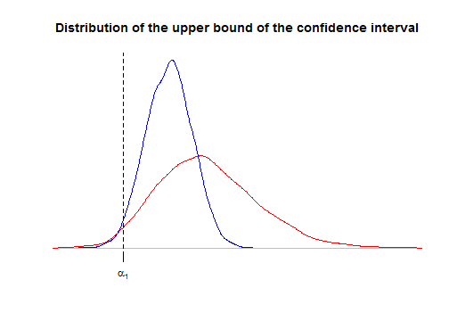

---
title: Reducing a model to get confidence intervals
date : 2014-04-12
--- &lead


**This article is still under construction**


## Reducing the one-way ANOVA model with random effects

Consider the balanced one-way ANOVA model with random effects, call $\cal M$ 
this model:
$$({\cal M})\colon \qquad \begin{cases}
 (y_{ij} \mid \mu_i) \sim_{\text{iid}} {\cal N}(\mu_i, \sigma^2_w) & j=1,\ldots,J \\ 
\mu_i \sim_{\text{iid}} {\cal N}(\mu, \sigma^2_b) & i=1,\ldots,I
\end{cases}.$$
Let us derive the distribution of the observed group means $\bar{y}_{i\bullet}$:
$$(\bar{y}_{i\bullet} \mid \mu_i) \sim {\cal N}\left(\mu_i, \frac{\sigma^2_w}{I}\right)$$ 
for every $i=1,\ldots,I$, and finally 
$$\bar{y}_{i\bullet}\sim_{\text{iid}} {\cal N}\left(\mu, \sigma^2_b+\frac{\sigma^2_w}{I}\right) \qquad i=1,\ldots,I.$$

Denote $z_i=\bar{y}_{i\bullet}$ for more clarity. Thus ${(z_i)}_{i=1}^I$ is a sample 
of *iid* Gaussian distributions:
$$({\cal M}')\colon \qquad
z_i \sim_{\text{iid}} {\cal N}\left(\mu, \delta^2\right), \quad i=1,\ldots,I$$ 
with $\delta^2=\sigma^2_b+\frac{\sigma^2_w}{I}$. 

Thus, we have a new model ${\cal M}'$ derived from $\cal M$ and for which there is 
a well-known $100(1-\alpha)\%$-confidence interval around $\mu$:
$$\bar{z}_{\bullet} \pm t^*_{I-1}(\alpha/2)\frac{SS(z)}{(I-1)I}$$
where $SS(z)=\sum_{i=1}^I{(z_i-\bar{z}_{\bullet})}^2$ is the total variation 
of the $z_i$. 
Compare this confidence interval to the one derived at 
the end of my article about 
[the balanced one-way ANOVA model with random effects](http://stla.github.io/stlapblog/posts/Anova1random.html): *they are exactly the same !* 

Thus, there's no lost of information about $\mu$ when we observe only 
the group means $\bar{y}_{i\bullet}$.


## General principle of model reduction 

Was the previous remark an expected one ? 
Given the original model $\cal M$ with observations $y=(y_{ij})$, the reduced 
model ${\cal M}'$ has been derived by considering the $z_i:=f_i(y)$ as the 
observations for some functions $f_i$. 
The parameter $\mu$ appears in both models. 

The obvious thing is that any  $100(1-\alpha)\%$-confidence interval 
about $\mu$ in the reduced model ${\cal M}'$ also is a 
$100(1-\alpha)\%$-confidence interval 
about $\mu$ in the original model $\cal M$. 
But generally such a method will not provide an *optimal* confidence interval 
(in a sense to be made precise), as shown by the following other example


## Reducing the two-ways ANOVA model without interaction

Consider the fixed effects two-ways ANOVA model 
with replications but without interaction :
$$({\cal M})\colon \qquad
y_{ijk} \sim {\cal N}(\mu+\alpha_i+\beta_j, \sigma^2), 
\qquad i=1,\ldots,I, \quad j=1,\ldots,J, \quad k=1,\ldots,K,$$
with $\sum \alpha_i=\sum \beta_j=0$ and 
assuming as usual independent observations $y_{ijk}$.

Now consider the reduced model obtained by averaging the observations 
in the same "cell" $(i,j)$:

$$({\cal M}')\colon \qquad
\bar y_{ij\bullet} \sim {\cal N}\left(\mu+\alpha_i+\beta_j, \frac{\sigma^2}{K}\right), \qquad i=1,\ldots,I, \quad j=1,\ldots,J.$$

The reduced model ${\cal M}'$ is  a fixed effects two-ways ANOVA model 
without interaction and without replications. 
We will consider for our illustration that $I=2$, hence $\alpha_2=-\alpha_1$, 
and we will compare the confidence intervals about $\alpha_1$ obtained by 
considering either model $\cal M$ or model ${\cal M}'$. 

Let us simulate some data 


```r
I <- 2 
J <- 3
K <- 4
effects1 <- c(1,-1)
effects2 <- 1:J - mean(1:J)
dat <- data.frame(factor1=rep(1:I,each=J*K), factor2=rep(1:J,times=I*K))
set.seed(666)
dat <- transform(dat, 
                 y=rnorm(I*J*K, effects1[factor1]+effects2[factor2]), 
                 factor1=factor(factor1), 
                 factor2=factor(factor2)
                 ) 
head(dat)
```

```
##   factor1 factor2       y
## 1       1       1  0.7533
## 2       1       2  3.0144
## 3       1       3  1.6449
## 4       1       1  2.0282
## 5       1       2 -1.2169
## 6       1       3  2.7584
```


Fitting the model as follows, the parameter of interest $\alpha_1=1$ is named `factor11` in R:


```r
fit1 <- lm(y~factor1+factor2,data=dat,contrasts=list(factor1="contr.sum",factor2="contr.sum"))
pandoc.table(confint(fit1), style="rmarkdown", digits=3, emphasize.rows=2)
```


|      &nbsp;       |  2.5 %  |  97.5 %  |
|:-----------------:|:-------:|:--------:|
|  **(Intercept)**  | -0.595  |  0.521   |
|   **factor11**    | *0.43*  |  *1.55*  |
|   **factor21**    |  -1.7   |  -0.116  |
|   **factor22**    |  -0.46  |   1.12   |


Now we look at the confidence interval in the reducel model ${\cal M}'$:


```r
mdat <- aggregate(y~factor1+factor2, data=dat, FUN=mean)
fit2 <- lm(y~factor1+factor2,data=mdat,contrasts=list(factor1="contr.sum",factor2="contr.sum"))
pandoc.table(confint(fit2), style="rmarkdown", digits=3, emphasize.rows=2)
```


|      &nbsp;       |  2.5 %  |  97.5 %  |
|:-----------------:|:-------:|:--------:|
|  **(Intercept)**  |  -0.82  |  0.746   |
|   **factor11**    | *0.206* |  *1.77*  |
|   **factor21**    |  -2.01  |  0.202   |
|   **factor22**    | -0.778  |   1.44   |


The confidence interval in ${\cal M}'$ is wider than the one in $\cal M$. 
Let us use simulations to see this more precisely. 
Below we use simulations to derive the distributions of the upper bound 
of the confidence interval in $\cal M$ and ${\cal M}'$. 
We use the `local` function to preserve our preliminary defined 
objects `dat`, `fit1`, and `fit2`. 
We also evaluate, for each model the power of the test for 
$H_0\colon\{\alpha_1=0\}$ derived from the confidence interval.


```r
nsims <- 2000
confint1 <- confint2 <- NULL
power1 <- power2 <- rep(NA,nsims)
local({
  for(i in 1:nsims){
    # new data
    dat <- within(dat, y <- rnorm(I*J*K, effects1[factor1]+effects2[factor2])) 
    # model M
    fit1 <- lm(y~factor1+factor2,data=dat,contrasts=list(factor1="contr.sum",factor2="contr.sum"))
    ci <- confint(fit1)[2,]
    power1[i] <<- ci[1]>0 || ci[2]<0
    confint1 <<- rbind(confint1,ci)
    # model M'
    mdat <- aggregate(y~factor1+factor2, data=dat, FUN=mean)
    fit2 <- lm(y~factor1+factor2,data=mdat,contrasts=list(factor1="contr.sum",factor2="contr.sum"))
    ci <- confint(fit2)[2,]
    power2[i] <<- ci[1]>0 || ci[2]<0
    confint2 <<- rbind(confint2,ci)
    }
  })
plot(density(confint1[,2]), 
     main="Distribution of the upper bound of the confidence interval", 
     ylab=NA, xlab=NA, 
     axes=FALSE, col="blue",
     xlim=range(confint2[,2]))
lines(density(confint2[,2]), col="red")
alpha1 <- effects1[1]
axis(1, at=alpha1, labels=expression(alpha[1]))
abline(v=alpha1, lty="dashed")
```

 


As we said in the previous section, the confidence interval derived from 
the reduced model ${\cal M}'$ is correct: for both curves, the area at the left 
of $\alpha_1$ is $2.5\%$. 
But the upper bound is considerably more dispersed for model ${\cal M}'$, 
thereby showing that the confidence interval  is more likely wider 
 for model ${\cal M}'$. 
 
 As a consequence, the power of the test of $H_0\colon\{\alpha_1=0\}$ is higher 
for $\cal M$:


```r
mean(power1)
```

```
## [1] 0.9965
```

```r
mean(power2)
```

```
## [1] 0.6995
```


Note that $H_0$ means that the first factor has no effect, and actually it can 
be shown that the test based on the confidence interval is exactly the same 
as the classical Fisher test provided by the `anova` function:


```r
anova(fit1)
```

```
## Analysis of Variance Table
## 
## Response: y
##           Df Sum Sq Mean Sq F value Pr(>F)   
## factor1    1   23.5   23.46   13.64 0.0014 **
## factor2    2   10.1    5.05    2.93 0.0763 . 
## Residuals 20   34.4    1.72                  
## ---
## Signif. codes:  0 '***' 0.001 '**' 0.01 '*' 0.05 '.' 0.1 ' ' 1
```

```r
anova(fit2)
```

```
## Analysis of Variance Table
## 
## Response: y
##           Df Sum Sq Mean Sq F value Pr(>F)  
## factor1    1   5.86    5.86   29.51  0.032 *
## factor2    2   2.52    1.26    6.35  0.136  
## Residuals  2   0.40    0.20                 
## ---
## Signif. codes:  0 '***' 0.001 '**' 0.01 '*' 0.05 '.' 0.1 ' ' 1
```


We can understand why the power is suboptimal in ${\cal M}'$. 
As you know, the $F$ statistic is the ratio of the mean square of 
factor $1$ over the residual mean square. 
The residual sum of squares  in the 
decomposition of the variation provided by `anova(fit1)`:
$$ 
SS(y) = SS_A(y) + SS_B(y) + SS_{{(1+A+B)}^\perp}(y)
$$
can be itself decomposed by including the interaction term, thereby 
yielding a new decomposition :
$$ 
SS(y) = SS_A(y) + SS_B(y) + SS_{AB} + SS_{{(1+A+B+AB)}^\perp}(y)
$$
which is here:


```r
anova(update(fit1, y~factor1*factor2)) 
```

```
## Analysis of Variance Table
## 
## Response: y
##                 Df Sum Sq Mean Sq F value Pr(>F)   
## factor1          1   23.5   23.46   12.87 0.0021 **
## factor2          2   10.1    5.05    2.77 0.0895 . 
## factor1:factor2  2    1.6    0.80    0.44 0.6531   
## Residuals       18   32.8    1.82                  
## ---
## Signif. codes:  0 '***' 0.001 '**' 0.01 '*' 0.05 '.' 0.1 ' ' 1
```


The first three mean squares are exactly $K=4$ times the sum of squares in 
${\cal M}'$:


```r
K*anova(fit2)[,2:3]
```

```
##           Sum Sq Mean Sq
## factor1    23.46 23.4594
## factor2    10.09  5.0454
## Residuals   1.59  0.7951
```


 
Thus, we have the following equality about the classical Fisher statistic $F'$ 
for $H_0\colon\{\alpha_1=0\}$ in the reduced model ${\cal M}'$:
$$
F' := \frac{MS_A(z)}{MS_{{(1+A+B)}^\perp}(z)} 
= \frac{MS_A(y)}{MS_{AB}(y)} 
\sim F_{I-1, (I-1)(J-1)}
$$ 
whereas the  classical Fisher statistic $F$ 
for $H_0\colon\{\alpha_1=0\}$ in the unreduced model ${\cal M}$ is:
$$
F = \frac{MS_A(y)}{MS_{{(1+A+B)}^\perp}(y)}
\sim F_{I-1, (I-1)(J-1) + IJ(K-1)}
$$
thereby showing that the reducel model ${\cal M}'$ yields a less 
powerful test. 


## Why does it work for the random effects one-way ANOVA model ?


