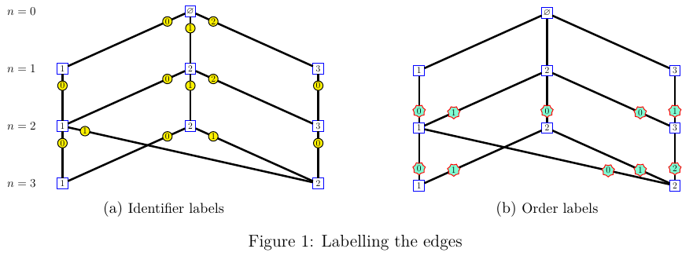
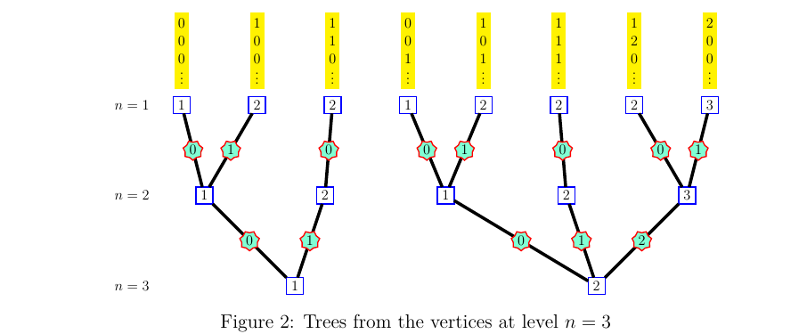

The way one labels the edges on a Bratteli graph possibly causes some confusion for someone discovering this topic. 

There are two different labellings. 

- The first labelling, shown on Figure 1(a), consists in identifying 
the edges from a vertex $v$ at level $n$ to all the vertices connected to $v$ at 
level $n+1$. These labels allow to identify a path starting at the root vertex. 

- The second labelling, shown on Figure 1(b), is done in the other direction. 
For each vertex $v$ at level $n\geq 1$, the labels identify the edges connecting $v$ 
to all the vertices connected to $v$ at level $n-1$. 
Note that these labels are useless for $n=1$, because there is only one edge from 
a vertex $v$ at level $n=1$ to the root vertex at level $n=0$. 

The second labelling defines the order between the paths. To see it, it is convenient to visualize the trees shown on Figure 2. One tree is drawn for each vertex at level $n=3$. Each tree, when one reads it from the bottom to the top, shows the possible paths from this vertex to the vertices at level $n=1$. 

The branches are ordered by the lexicographic order on the sequences of labels, and this corresponds to the order between the paths. 

Here, one sees on the first tree: 

000x < 100x < 110x

and on the second one: 

001x < 101x < 111x < 120x < 200x

Technical details about this order can be found in the Paper *"Ordered Bratteli Diagrams, dimension groups and topological dynamics"* by Herman, Putnam \& Skau.
