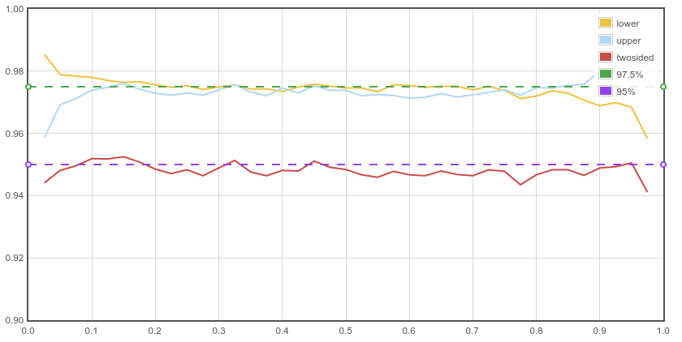

<style type="text/css">
body, td {
   font-family: sans-serif;
   background-color: white;
   font-size: 17px;
   margin: 8px;
}
</style>
<style type="text/css">
#wrap { width: 1100px; height: 400px; padding: 0; overflow: hidden; }
#frame {
    width: 1280px;
    height: 786px;
    border: 0;
    -ms-transform: scale(0.75);
    -moz-transform: scale(0.75);
    -o-transform: scale(0.75);
    -webkit-transform: scale(0.75);
    transform: scale(0.75);
    
    -ms-transform-origin: 0 0;
    -moz-transform-origin: 0 0;
    -o-transform-origin: 0 0;
    -webkit-transform-origin: 0 0;
    transform-origin: 0 0;
}
</style>

$\newcommand{\logit}{\mathrm{logit}\,}$
$\newcommand{\expit}{\mathrm{expit}\,}$

```{r, include=FALSE}
library(data.table)
library(lme4)
library(magrittr)
library(knitr)
opts_chunk$set(collapse=FALSE, fig.path='assets/fig/Psi_Bem_RandomEffects-', 
               prompt=TRUE, collapse=TRUE, comment=NA)
K <- 0.9 # scale figures
```


```{r auxFunctions, include=FALSE}
source('/home/stla/Github/stlapblog/posts/assets/Rfunctions/inertia_macro_v1.R', encoding='UTF-8')
library(diagram)
hbinom_plot <- function (I, J, root=expression(Theta), colors=rep("white",I), mar=c(.1,.1,.1,.1)) 
{
  if (length(J) == 1) {
    J <- rep(J, I)
  }
  elpos <- coordinates(c(1, I, sum(J)))
  fromto <- NULL
  for (i in 1:I) {
    fromto <- rbind(fromto, c(1, 1 + i))
  }
  for (i in 1:I) {
    add <- NULL
    for (j in 1:J[i]) {
      add <- rbind(add, c(1 + i, 1 + I + sum(J[0:(i - 1)]) + 
                            j))
    }
    fromto <- rbind(fromto, add)
  }
  nr <- nrow(fromto)
  arrpos <- matrix(ncol = 2, nrow = nr)
  par(mar = mar)
  openplotmat()
  for (i in 1:nr) {
    arrpos[i, ] <- straightarrow(to = elpos[fromto[i, 2], 
                                            ], from = elpos[fromto[i, 1], ], lwd = 2, arr.pos = 0.83, 
                                 arr.length = 0.4, endhead=TRUE, arr.type="triangle")
  }
  textellipse(elpos[1, ], 0.05, lab = root, box.col = "white", lcol="white",  
              shadow.col = "white", shadow.size = 0, cex = 2.5)
  for (i in 1:I) {
    textellipse(elpos[1 + i, ], 0.04, lab = as.expression(bquote(theta[.(i)])),  # paste(fac1, i), 
             box.col = "white", shadow.col = "cyan1", shadow.size = 0, lcol="white", 
             cex = 1.5, col="black")
    for (j in 1:J[i]) {
      textellipse(elpos[1 + I + sum(J[0:(i - 1)]) + j, 
                        ], 0.02, 0.03, lab = rbinom(1,1,.5), box.col = colors[i], 
                  shadow.col = "tan2", shadow.size = 0, cex = 1.4, lcol="white")
    }
  }
}
```


[Bem's statisical analyses][BemFTF] of his experiments yield significant effects interpreted as evidence for the existence of [*psi*][psi]. These results immediately faced a wave of criticisms. But I was concerned by a point nobody challenged: the statistical model used in Bem's first experiment. 

## Bem's experiment 1

In this experiment, $100$ subjects performed a series of Bernoulli trials: they had to guess behind which of two curtains there is an erotic picture. 

The design of the experiment is not clear from my reading of Bem's article. I understand that $40$ subjects performed $12$ trials and $60$ subjects performed $18$ trials - a total of $1560$ trials. But the results provided in the article are not consistent with $1560$; rather they are consistent with $1360$. 

But this is not important for my purpose. Let us say there were $I=100$ subjects who each performed $J=15$ trials. And let's make a picture with $I=3$ and $J=4$ for the sake of readability:  


```{r hbinom_plot, echo=FALSE, fig.width=5.5*K, fig.height=5.5*K}
set.seed(666)
hbinom_plot(3,4, colors=c("tan1", "cyan1", "olivedrab1"), mar=c(.1,.1,0,.1))
inertia(0.5, 0.7, a=0.35, b=0.05, r=1/8, l=.04, d=3, s=-0.03, lwd=3, col="red", w=.01)
textempty(c(0.25,0.74), expression(sigma^2), cex=2.5, col="white")
text(0.25,0.745, expression(sigma^2), cex=2)
```

## Hierarchical binomial model

The picture above represents the model I would use for the experiment. Let me explain each point appearing in the picture, *from the bottom to the top*:

1. For each of the three subjects, a $0/1$ result is recorded for each of the 4 trials: a $0$ means the individual failed to guess the location of the erotic picture, whereas a $1$ indicates a success. 

2. For each subject $i=1,2,3$, the series of $0/1$ results is modelled as $4$ independent Bernoulli trials with success probability $\theta_i$.

3. Assuming these subjects are selected at random in the population, the probabilities of success $\theta_i$ are modelled by a distribution centered around an unknown value $\Theta$, representing the overall probability of succes in the population. The red ellipse [represents the variance](http://stla.github.io/stlapblog/posts/Variance_inertia.html) of the $\theta_i$'s.  This is just a way to show that the $\theta_i$ are random. There are two common choices for the distribution of the $\theta_i$:

    - a Beta distribution whose two shape parameters are unknown;

    - a Gaussian distribution after *logit* transformation with unknown mean $\mathrm{logit}\,\Theta$ and unknown standard deviation $\sigma$ (so the $\sigma$ appearing in the previous picture is the standard deviation of the $\logit \theta_i$, not the one of the $\theta_i$).

This is called a *hierarchical* binomial model, or a model with *random effects* (the $\theta_i$). With (short) mathematical notations, denoting by $y_{ij}$ the result of the $j$-th trial for individual $i$:
$$\begin{cases}
 (y_{ij} \mid \theta_i) \sim_{\text{iid}} \mathrm{Bernoulli}(\theta_i) & j=1,\ldots,J \\ 
\theta_i \sim_{\text{iid}} {\rm Beta}(a, b) & i=1,\ldots,I
\end{cases}$$
or 
$$\begin{cases}
 (y_{ij} \mid \theta_i) \sim_{\text{iid}} \mathrm{Bernoulli}(\theta_i) & j=1,\ldots,J \\ 
\logit \theta_i \sim_{\text{iid}} {\cal N}(\logit \Theta, \sigma^2) & i=1,\ldots,I
\end{cases}.$$

Distributions of Beta family generates random values in the interval $(0,1)$, but from a technical perspective they are more difficult to deal with than the normal (Gaussian distribution). 
In the second model, using the *logit* transformation is a way to map the interval $(0,1)$ to the entire line of real numbers $(-\infty, +\infty)$, thereby allowing to use a simple normal distribution.  
This model can be fitted with the `glmer` function of the `lme4` package. 
To show how it works, I simulate some fictive data with $I=100$, $J=15$, and an overall proportion of success $53\%$ (hence $795$ successes), similarly to the result of Bem's experiments: 

```{r}
library(data.table)
dat <- data.table(subject=1:100)[, list(result=rep(0,15)), by=subject]
set.seed(3141593)
dat$result <- sample(rep(c(0,1), c(1500-795, 795)), 1500, replace=FALSE)
```

These data are not simulated according to the model assumptions: I simply allocated  $795$ successess ($1$) and $1500-795$ ($0$) at random.  Below is a short part of the simulated data:

```{r, echo=TRUE}
dat
```

And below are the proportions of success (the $\theta_i$) for the first $8$ individuals: 

```{r}
dat[, list(success=mean(result)), by=subject] %>% head(8)
```

As you see, there are small proportions of success, such as $27\%$, and high proportions of success, such as $73\%$. Bem's article does not show anything about their variability. Fitting the hierarchical binomial model gives an estimate of the overall proportion of success $\Theta$ as well as an estimate of this variability:

```{r}
library(lme4)
fit <- glmer(cbind(result,1-result)~(1|subject), data=dat, family="binomial")
summary(fit)
```

The value `0.12065` appearing in the `Fixed effects` part of the output is the estimated value of $\logit \Theta$. Back-transforming gives an estimated value of $\Theta$ close to $53\%$, as expected: 

```{r}
logit <- function(p) log(p)-log(1-p)
expit <- function(x) exp(x)/(1+exp(x))
expit(0.12065)
```

The estimate of the standard deviation $\sigma$ is given in the `Random effects` part of the output. It is approximately `0.1295`. Recall that $\sigma$ is the standard deviation of the $\logit \theta_i$, not of the $\theta_i$. The estimated distribution of the $\theta_i$ is derived from the estimated distribution of the $\logit \theta_i$ by a simple application of the change of variables formula. One obtains the distribution shown on figure below:  

```{r, echo=FALSE, fig.width=8*K, fig.height=5*K}
layout(t(c(1,2)))
curve(dnorm(x, 0.12065, 0.1295), from=-0.6, to=0.6, 
      axes=FALSE, xlab=NA, ylab=NA, 
      lwd=2,
      main=expression(paste("estimated distribution of the logit(", theta[i], ")")))
axis(1)
abline(v = 0.12065, lty="dashed")
curve((1/x+1/(1-x))*dnorm(logit(x), 0.12065, 0.1295), from=0.3, to=0.7,
      axes=FALSE, xlab=NA, ylab=NA, 
      lwd=2,
      main=expression(paste("estimated distribution of the ", theta[i])))
axis(1)
abline(v=expit(0.12065), lty="dashed")
```

The `lme4` package provides confidence intervals based on the profile-likelihood:
```{r, error=TRUE}
fit_profile <- profile(fit)
( intervals <- confint(fit_profile) )
```

The first line is a $95\%$-confidence interval about the standard deviation $\sigma$, the second one is a $95\%$-confidence interval about $\logit \Theta$. Back-transforming gives a $95\%$-confidence interval about $\Theta$: 

```{r, error=TRUE}
intervals[2,] %>% expit
```

The lower bound $\approx 50.4\%$ is higher than $50\%$. Thus, using this confidence interval to test $H_0\colon\{\Theta=50\%\}$ vs $H_1\colon\{\Theta>50\%\}$ gives a significant result at the $2.5\%$ significance level. 


## Bem's analysis (not questioned by criticisms)

Bem proceeds as follows. Denoting by $\bar y_{i\bullet}$ the proportion of success for individual $i$, Bem applies the classical $t$-test to the $\bar y_{i\bullet}$ to test  $H_0\colon\{\Theta=50\%\}$ vs $H_1\colon\{\Theta>50\%\}$. 

As I mention in two previous articles ([this one][stla1] and [this one][stla2]), this procedure is totally correct for the analogue Gaussian hierarchical model. But is it correct here ? This is the point I was concerned about.  

One gets this $95\%$-confidence interval by following Bem's procedure:

```{r}
t.test(dat[, list(success=mean(result)), by=subject]$success)
```

The confidence interval is almost the same as the profile-likelihood confidence interval previously derived (say, for short, the PL interval). But the profile-likelihood is not always correct: it is based on asymptotic theory, that is, it is correct when $I$ and $J$ are not too small. When they are too small, I think (I have not checked) that the PL intervals are too small. 


Bem's method implicitly assumes the statistical model on which the $t$-test is founded, namely, that the $\bar y_{i\bullet}$ are *i.i.d.* realizations from a Gaussian distribution. 

At the intermediate level of the hierarchical model, by the normal approximation to the binomial distribution, the $\bar y_{i\bullet}$ can be approximated by independent, but *not i.i.d.* Gaussian distributions:
$$(\bar y_{i\bullet} \mid \theta_i) \approx {\cal N}\left(\theta_i, \frac{\theta_i(1-\theta_i)}{J}\right).$$

```{r, include=FALSE}
theta <- 0.53
y <- rbinom(1000, 15, theta)/15
qqnorm(y)
qqline(y)
```


And at the top level of the hierarchical model, that is, after integrating the conditional distributions over the distribution of the $\theta_i$,  the $\bar y_{i\bullet}$ are independent, identically distributed, but not approximately Gaussian for all situations, even when assuming the normal approximation at the intermediate level: 

```{r, include=FALSE}
theta <- expit(rnorm(1000, 0.12065, 0.1295))
y <- rbinom(1000, 15, theta)/15
qqnorm(y)
qqline(y)
```

```{r}
theta <- expit(rnorm(1000, 0, 1))
y <- rnorm(1000, theta, sqrt(theta*(1-theta)/15))
qqnorm(y)
qqline(y)
```

However the approximation is good when the $\theta_i$ are not too dispersed, such as the case of the previously fitted distribution on our fictive data:

```{r}
theta <- expit(rnorm(1000, 0.12065, 0.1295))
y <- rnorm(1000, theta, sqrt(theta*(1-theta)/15))
qqnorm(y)
qqline(y)
```

Now, assuming or not the normal approximation to the binomial distribution  at the intermediate level, the expectation of  $\bar y_{i\bullet}$ at this level is :
$$E(\bar y_{i\bullet} \mid \theta_i)=\theta_i,$$
then at the top level the expectation is $E(\theta_i)$. 
Thus, Bem's inference method is about $E(\theta_i)$ whereas the `glmer` method draws inference about $\logit\Theta=E(\logit \theta_i)$ and, after back-transforming, yields inference about $\Theta$. Theoretically, $E(\theta_i) \neq \Theta$, but in the present situation, where the $\theta_i$ are not too dispersed, $E(\theta_i)$ is very close to $\Theta$:

```{r}
mean(theta)
expit(0.12065)
```

Thus, Bem's method, up to approximation, falls into the method I called [*Reducing a model to get a confidence interval*][stla2]. Thus this method should approximately control the significance level as long as the approximation is not bad. Moreover, from the closeness between the $t$-test interval and the PL interval previously seen, I suspect that the method is close to optimatility when it is valid. 

I have written a Javascript program to assess the frequentist coverage of the intervals. For $I=100$ and $J=15$, I get the following graph that displays the coverage of the $95\%$-confidence interval in function of $\Theta$:



It is really good. You can see the coverage for smaller values of $I$ and $J$ by playing with this interactive implementation of my Javascript program (computations take a while - be patient):

<div id="wrap">
<iframe id="frame" src="assets/htmlframes/hbinom_logit01.html"></iframe>
</div>

You can see that the coverage is always better (close to the target level) at \(\Theta=0.5\). 

## Conclusion

Do Bem and his criticizers are aware that the $t$-test applied to the individual proportions of succes is an approximation of the model with random effects ? I don't know, but when reading them I think the answer is *no* because I am under the impression they consider $\Theta$ as an individual proportion of success common to all individuals, instead of an overall proportion in the population.  And I don't see why to use the reduction method when it is possible to fit the hierarchical model. Moreover, the non-existence of *psi* should be translated by the null hypothesis $H_0\colon\{\Theta=50\% \,\, \mathrm{and}\,\, \sigma=0\}$, rather than $H_0\colon\{\Theta=50\%\}$.

Note that Bem's method does not correspond to the reduction of the hierarchial binomial model in case of an unbalanced design (not all subjects perform the same number of trials), because the $\bar y_{i\bullet}$ in this case, are not identically distributed. It should remain approximately correct when the design is not too unbalanced, but, again, there is no interest to use this method when it is possible to use the model with random effects. 


[BemFTF]: http://dbem.ws/FeelingFuture.pdf "Feeling the future: Experimental evidence for anomalous retroactive influences on cognition and affect."

[stla1]: http://stla.github.io/stlapblog/posts/Anova1random.html "The balanced ANOVA model with random effects."

[stla2]: http://stla.github.io/stlapblog/posts/ModelReduction.html "Reducing a model to get confidence intervals"

[psi]: http://en.wikipedia.org/wiki/Parapsychology#Terminology "Wikipedia: Parapsychology"


