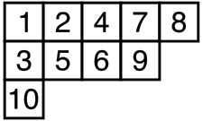

```{r setup, include=FALSE}
# use highlight: pygments
```

Given a permutation $\sigma$ of $\{1, \ldots, n\}$, the Robinson-Schensted correspondence associates to $\sigma$ a pair $(P,Q)$ of two standard Young tableaux of weight $n$ having the same shape. 

This map $RS\colon \sigma \mapsto (P,Q)$ is obtained by the Schensted algorithm, and we give an Haskell implementation of this algorithm below (I gave a R implementation of this map in [a previous article](http://stla.github.io/stlapblog/posts/YoungTableaux.html#robinson-schensted-correspondence)). 
A nice explanation of this algorithm is given in [R. T. Bayley's master thesis](https://www.google.be/url?sa=t&rct=j&q=&esrc=s&source=web&cd=1&cad=rja&uact=8&ved=0ahUKEwiOx5X-hK_OAhXkDsAKHX9wA8kQFggbMAA&url=http%3A%2F%2Fwww.maths.qmul.ac.uk%2F~rtb%2Fmathpage%2FRichard%2520Bayley%27s%2520Homepage_files%2Frichardmmath.pdf&usg=AFQjCNE7yebCMY2jwykMkBqF1BKhaYiEXg&sig2=gOJekMgyDQx5af2HUcyltQ&bvm=bv.129391328,d.d24), to which we refer for more details, if needed. 


In Haskell, we represent a permutation as a list of integers and a Young tableau as a list of lists of integers. 
For example, the Haskell list `[[1,2,4,7,8], [3,5,6,9], [10]]` represents this (standard) Young tableau:




The main part of the algorithm giving the pair $(P,Q)=RS(\sigma)$ is the construction of the first Young tableau $P$. 
Given the permutation $\sigma=(\sigma_1, \ldots, \sigma_n)$, the standard Young tableau $P$  is the final Young tableau $P_n$ of the sequence $(P_0, \ldots, P_n)$ of Young tableaux which is recursively obtained as follows. 
One starts with the empty Young tableau $P_0=[\,]$ and one recursively defines $P_{k+1}$ as the Young tableau obtained by *bumping* $\sigma_{k+1}$ to $P_k$, an action to be explained below. This is denoted by $P_{k+1} = P_k \leftarrow \sigma_{k+1}$, so that the final Young tableau is  
$$
P_n = \Bigl(\cdots\bigl(([\,] \leftarrow \sigma_1) \leftarrow \sigma_2\bigr) \cdots \leftarrow \sigma_n\Bigr).
$$
Now we explain the *bumping* action. The *bumping* action of an integer $e$ to a Young tableau $P$ is a Young tableau denoted by $P \leftarrow e$ which is obtained by this algorithm:

- if $P$ is empty then $P \leftarrow e = [[e]]$;

- if $e$ is strictly greater than all the numbers in the first row of $P$, then the Young tableau $P \leftarrow e$ is obtained from $P$ by placing $e$ at the end of its first row;

- otherwise, $P \leftarrow e$ is the Young tableau whose first row is obtained by replacing the first element $w$ of the first row of $P$ that is larger than $e$ with $e$, and by stacking this new row on the top of $P_{-1} \leftarrow w$, where $P_{-1}$ is the Young tableau obtained from $P$ by removing its first row. 


Thus, the shape of $P \leftarrow e$ is the shape of $P$ plus an additional square. 
Consider for example the permutation $\sigma = (2,3,1)$. 
The action of $\sigma_1=2$ to the empty tableau $P_0=[\,]$ generates the tableau $P_1 := P_0 \leftarrow \sigma_1 = [[2]]$. 
The action of $\sigma_2=3$ to the tableau $P_1$ generates the tableau $P_2 := P_1 \leftarrow \sigma_2 = [[2,3]]$. 
The action of $\sigma_3=1$ to the tableau $P_2$ generates the tableau $P_3 := P_2 \leftarrow \sigma_3 = [[1,3], [2]]$. 

The `replace` function below performs the replacement. It takes as arguments a list of integers `xs` and an integer `e`. It finds the index of the first element of `xs` greater than `e`, replaces this element with `e`, and returns the new list and the replaced element in a pair.

```haskell
import Control.Lens 
import Data.List
let replace :: [Int] -> Int -> ([Int], Int);
    replace xs e = ((element i .~ e) xs, xs !! i)
          where i = (\(Just x) -> x) (findIndex (>= e) xs)
```

For example:

```haskell
> replace [1, 3, 5, 6] 4
([1,3,4,6],5)
```

This function does not work if there is no element greater `e` in the list. 

Now, the Young tableau $Q$ is the final Young tableau $Q_n$ of the sequence $(Q_0, \ldots, Q_n)$ constructed in parallel as follows. This sequence starts with the empty Young tableau $Q_0 = [\,]$. Each Young tableau $Q_k$ has the same shape as $P_k$. The Young tableau $Q_k$ is obtained by adding a square to $Q_{k-1}$ at the same location of the square which is added to $P_{k-1}$ to get $P_k$, and by putting the integer $k$ in this square. 
For the above example where $\sigma=(2,3,1)$, this gives $Q_1=[[1]]$, $Q_2=[[1,2]]$ and $Q_3=[[1,2], [3]]$.  

Finally, the Schensted algorithm has the following form:

<div style="margin-left:30px">
*given a permutation $\sigma=(\sigma_1, \ldots, \sigma_n)$, do:* 
</div>
<div style="margin-left:45px; margin-top:-20px">
  * $(P_0, Q_0) \leftarrow ([\,],[\,])$
  * for $i$ in $1:n$
      + $(P_i, Q_i) \leftarrow \text{bump}(P_{i-1}, Q_{i-1}, \sigma_i, i)$
</div>

Therefore, once we get an implementation of the `bump` function, the $RS$ map is implemented as follows in Haskell:

```haskell
let rs :: [Int] -> ([[Int]],[[Int]]);
    rs sigma | (n == 1) = bump [] [] (sigma !! 0) 1
             | otherwise = bump p q (last sigma) n
                    where (p,q) = rs (fst (splitAt (n-1) sigma))
                          n = length sigma
```

It remains to write the `bump` function. 

```haskell
let bump :: [[Int]] -> [[Int]] -> Int -> Int -> ([[Int]],[[Int]]);
    bump p q e i = if p==[] 
    then ([[e]], [[i]]) 
    else if e > (last (p !! 0))
        then (((p1 !! 0) ++ [e]) : pend, ((q1 !! 0) ++ [i]) : qend)
        else (newp1 : p2, (q !! 0) : q2)
          where (p1, pend) = splitAt 1 p
                (q1, qend) = splitAt 1 q
                (newp1, w) = replace (p !! 0) e
                (p2, q2) = bump (drop 1 p) (drop 1 q) w i
```

As an example:

```haskell
> rs [1, 3, 6, 4, 7, 5, 2]
([[1,2,4,5],[3,7],[6]],[[1,2,3,5],[4,6],[7]])
```