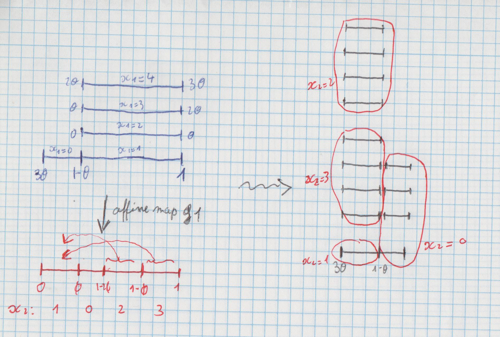

***(latest update : `r Sys.time()`)***
<br/>

```{r setup, echo=FALSE}
library(magrittr)
library(contfrac)
library(knitr)
opts_chunk$set(collapse=TRUE, fig.path="./assets/fig/RotationAdic-")
# trim figures
knitr::knit_hooks$set(trim = function(before, options, envir) {
  if(!before) {
    fig <- knitr::fig_path(".png", num=1) # OK chunk avec un seul plot
    #command <- sprintf("convert %s -trim %s", fig, fig)
    #system(command)
    knitr::plot_crop(fig, quiet=TRUE)
    return(invisible())
  }
})
fscale <- 1 # scale for figures
```

```{r Rfunctions, include=FALSE}
# plot a rotation
plot_rot <- function(theta, xlim=c(0, 1), ylim=c(0,1), ...){
  curve((x+theta)%%1, from=0, to=1-theta-.Machine$double.eps, xaxs="i", yaxs="i", axes=FALSE, xlim=xlim, ylim=ylim, ...)
  curve((x+theta)%%1, from=1-theta, to=1, add=TRUE)
  return(invisible())
}
# plot a tower
tower2 <- function(nlevels=2, height=3, xclass=3/4, xclass_labels=NULL, x0=0, x1=x0+1, labels=NULL, epsilon=0.2, mar=c(1,1,1,1), cex.labels=1, add=FALSE, ...){
  #if(!is.null(xclass)) xclass <- x1*xclass
  y <- seq(0, height, len=nlevels)
  if(!add){
    par(mar=mar, xpd=TRUE)
    plot(0, 0, ylim=c(0,height+2*max(epsilon,0)), axes=FALSE, type="n", xlab=NA, ylab=NA, ...)
  }
  for(i in 1:nlevels){
    segments(x0, y[i], x1, y[i])
  }
  if(!is.null(xclass)){
    for(x in xclass)  points(rep(xclass, nlevels), y, pch=19)
    segments(xclass, 0, xclass, height, lty="dashed")
    if(!is.null(xclass_labels)){
      for(i in 1:nlevels) text(xclass-(x1-x0)/20, y[i], xclass_labels[i], pos=3, cex=cex.labels)
    }
  }
  if(!is.null(labels)){
    if(!is.list(labels)) labels <- list(labels[1:nlevels], labels[2:(nlevels+1)])
    text(x0, y+epsilon, labels[[1]], cex=cex.labels)
    text(x1, y+epsilon, labels[[2]], cex=cex.labels)
  }
  return(invisible())
}
# gauss function
G <- function(x) 1/x-floor(1/x)
F <- function(theta, n=1){ # the function theta -> theta'
  if(theta<1/2) out <- 1/(1+G(theta))
  if(theta>1/2) out <- G(1-theta)/(1+G(1-theta))
  a <- ifelse(theta<1/2, as_cf(1-out)[2], as_cf(out)[2])
  if(n==1){
    attr(out, "a") <- a
    return(out)
  }else{
    out <- c(out, numeric(n-1))
    a <- c(a, integer(n-1))
    for(i in 1:(n-1)){
      Next <- F(out[i], 1)
      out[i+1] <- Next
      a[i+1] <- attr(Next, "a")
    }
#     x <- F(out, n-1)
#     oout <- c(out, x)
#     attr(oout, "a") <- c(attr(out, "a"), attr(x, "a"))
#     return(oout)
    attr(out, "a") <- a
    return(out)
  }
}
# induced rotation 
induced <- function(x, theta){
  # retourner aussi le range
  if(theta<0.5){
    a <- floor(1/theta)-1
    return(vapply(x, function(x){
      if(x %% 1 < a*theta) return(NaN)
      if(x %% 1 < (1-theta)) return((x+theta) %% 1) else return((x + (a+1)*theta) %% 1)
    }, numeric(1)))
  }else{
    a <- floor(1/(1-theta))-1
    return(vapply(x, function(x){
      if(x %% 1 > 1-a*(1-theta)) return(NaN)
      if(x %% 1 > (1-theta)) return((x+theta) %% 1) else return((x + (a+1)*theta) %% 1)
    }, numeric(1)))
  }
}
```

```{r Rfunctions_orbits, include=FALSE}
# renormalization [0,1] -> [a,b]
affine <- function(a, b){
  forward <- function(x) a + (b-a)*x
  backward <- function(y) (y-a)/(b-a)
  return(list(f=forward, b=backward))
}
H <- function(theta){
  a <- ifelse(theta<1/2, (floor(1/theta)-1)*theta, 0)
  b <- ifelse(theta<1/2, 1, 1-(floor(1/(1-theta))-1)*(1-theta))
  return(affine(a,b))
}
# join points of orbit
plot_orbit <- function(orb, r=1, ...){
  orb <- sort(orb)
  orb <- c(orb, orb[1])
  x <- r*cos(orb*2*pi); y <- r*sin(orb*2*pi)
  for(i in 1:(length(orb)-1)){
    segments(x[i], y[i], x[i+1], y[i+1], ...)
  }
  return(invisible())
}
Class <- function(x, theta){
  if(theta < 1/2){
    a <- floor(1/theta)-1
    if(x>a*theta && x<1-theta) return(x)
    k <- cut(x, breaks=c(theta*c(0:a))) %>% as.integer
    k <- ifelse(is.na(k), 0, k)
    return(c(x+c((-k):(-k+a))*theta) %% 1)
  }
  if(theta > 1/2){
    phi <- 1-theta
    a <- floor(1/phi)-1
    if(x>phi && x<1-a*phi) return(x)
    k <- cut(x, breaks=c(1-phi*c(0:a))) %>% as.integer
    k <- ifelse(is.na(k), 0, a-k+1)
    return(c(x+c((-k):(-k+a))*theta) %% 1)
  }
}
#sapply(seq(0,1,len=100), function(x) length(Class(x,theta)))
Repr <- function(x, theta){
  if(theta < 1/2){
    a <- floor(1/theta)-1
    if(x>a*theta && x<1-theta) return(x)
    k <- cut(x, breaks=c(theta*c(0:a))) %>% as.integer
    k <- ifelse(is.na(k), 0, k)
    return((x-k*theta) %% 1)
  }
  if(theta > 1/2){
    phi <- 1-theta
    a <- floor(1/phi)-1
    if(x>phi && x<1-a*phi) return(x)
    k <- cut(x, breaks=c(1-phi*c(0:a))) %>% as.integer
    k <- ifelse(is.na(k), 0, a-k+1)
    return((x+(-k+a)*theta) %% 1)
  }
}
```


Je vais tâcher ici d'expliquer la construction de "la" filtration adique associée à une rotation. En fait, c'est une suite décroissante de partitions mesurables qu'on construit, mais il est facile de voir qu'elle correspond à la filtration d'un processus de Markov.

Dans un second temps, j'expliquerai comment on obtient le graphe de Bratteli associé à cette filtration. 

## Construction de la filtration adique 

Résumons d'abord la construction présentée. 
On se donne une rotation $R_\theta$ d'angle irrationel $\theta$ sur $(0,1)$. À la première étape, on regroupe les points de $(0,1)$ en classes d'équivalence. Chaque classe contient un nombre fini de points, qui est donné par le premier chiffre dans le développement en fraction continue de $\theta$. Cette relation d'équivalence qui définit alors la première partition mesurable $\xi_1$ apparaît lorsqu'on considère une certaine transformation induite par $R_\theta$. Celle-ci agit sur l'espace des classes d'équivalence $(0,1)/\xi_1$. Or, cette transformation induite est conjuguée à  une rotation par une simple transformation affine. On recommence alors le procédé, et on obtient une partition mesurable $\xi_2 \prec \xi_1$, et ainsi de suite. 

Le choix de la transformation induite à chaque étape ne paraîtra pas justifié, mais c'est une construction qui est connue plus généralement pour les [homéomorphismes du cercle](http://www.dam.brown.edu/people/menon/apma2210/circle.pdf). Il y a deux possibilités, selon que $\theta < \frac12$ ou $\theta > \frac12$. Par ailleurs, ces deux situations possibles s'alternent lors de la construction : si $\theta < \frac12$ à la première étape, alors la rotation à la deuxième étape est d'angle $\theta' > \frac12$ et ainsi de suite. 


### 1ère étape, avec $\theta < \frac12$.

Pour illustrer la construction dans le cas d'un angle $\theta < \frac12$, nous prenons $\theta \approx 0.2254$ donné par une fraction continue :
$$
\theta = 0 + \cfrac{1}{4 + \cfrac{1}{ 2 + \cfrac{1}{ 3+ \cfrac{1}{\ddots}}}}
$$

```{r thetacontfrac, include=TRUE}
(theta <- contfrac::CF(c(0,4,2,3,2,3,4,5,4,3,2,4), finite=TRUE))
```

```{r theta0, include=FALSE}
theta0 <- theta
b1 <- floor(1/theta)-1
```

Nous notons $[a_1, a_2, \ldots]$ la suite des entiers du développement en fraction continue de $\theta$ (nous omettons $a_0=0$). 

La figure ci-dessous montre le graphe de la rotation $R_\theta$ :

```{r rot1, echo=FALSE, fig.width=fscale*4, fig.align='center', trim=TRUE}
par(pty="s")
plot_rot(theta, xlab=expression(x), ylab=expression(R[theta](x)))
axis(1, cex.axis=0.8); axis(2, cex.axis=0.8)
points(c(1-theta,0), c(0,theta), pch=19, col="blue", xpd=TRUE)
text(1-theta, 0, expression(1-theta), xpd=TRUE, pos=1, cex=1.2, col="blue")
text(0, theta, expression(theta), xpd=TRUE, pos=2, cex=1.2, col="blue")
```

Considérons l'entier 
$$
b = \max\{k\geq 0 \mid k\theta < 1-\theta\}  \geq 1. 
$$
Il n'est pas difficile de voir que :

* $b = \lfloor \frac{1}{\theta} \rfloor -1$ ; 
* $b = a_1-1$, d'où $b=3$ pour notre exemple ;
* $b$ est le plus petit entier tel que les intervalles $J$, $R_\theta(J)$, $\ldots$, $R_\theta^{b+1}(J)$ recouvrent $(0,1)$, où $\boxed{J=(1-\theta,1)}$.

```{r b1}
( b <- floor(1/theta)-1 )
```

On s'intéresse à la transformation induite par $R_\theta$ sur l'intervalle 
$$
B=(b\theta, 1)= J \cup R_\theta^{b+1}(J) = (b\theta, 1-\theta) \cup (1-\theta,1),
$$
représenté en rouge sur cette figure: 

```{r rot1_redB, echo=FALSE, fig.width=fscale*5, fig.align='center', trim=TRUE}
plot_rot(theta, ylim=c(0, 0.35), asp=1, xlab=NA, ylab=NA)
at <- c(c(0:b)*theta, 1-theta, (b+1)*theta, 1)
labels <- labels0 <- c(expression(0, theta), if(b>1) sapply(2:b, function(k) parse(text=sprintf("%s*theta", k))) else NULL,
  expression(1-theta), parse(text=sprintf("%s*theta", b+1)), expression(1))
axis(1, at=at, labels=labels, pos=0)
segments(b*theta, 0, 1, 0, col="red", lwd=2)
axis(2, pos=0, at=c(0,0.2,0.4,0.6,0.8))
curve(x+ theta, add=TRUE, lty=2, xpd=TRUE, to=2*theta)
```

Rappelons que la transformation $T_B$ induite  par une transformation $T$ sur un ensemble $B$ est définie par $T_B(x) = T^k(x)$ où $k=k(x)$ est le premier entier $\geq 1$ tel que $T^k(x) \in B$. Ici elle est donnée par 
$$
T_B(x) = \begin{cases}
T(x) & \text{si } x \in (b\theta, 1-\theta) \\
T^{b+1}(x) & \text{si } x \in J=(1-\theta, 1)
\end{cases},
$$
ce que l'on peut voir sur la figure suivante: 

```{r tower1, echo=FALSE, fig.width=fscale*2.5, fig.height=fscale*3.3, fig.align='center', trim=TRUE}
theta <- theta0
x <- x0 <- 1-theta/4
labels <- labels0
a <- floor(1/theta)-1
cexlabs <- 1.3
xclass_labels <- c(expression(x, Tx), if(a>1) sapply(2:a, function(k) parse(text=sprintf("T^%s*x", k)))  else NULL)
tower2(nlevels=a+1, height=3, xclass=x, xclass_labels=xclass_labels, 
       x0=1-theta, x1=1, 
       labels=list(c(expression(1-theta), labels[1:a]), c(expression(1), labels[2:(a+1)])), 
       epsilon=-0.23, cex.labels=cexlabs, 
      xlim=c(a*theta, 1), mar=c(3,1,2,1), yaxs="i")
tower2(nlevels=1, height=1, xclass=NULL, x0=a*theta, x1=1-theta, labels=NULL, epsilon=0.2, 
      add=TRUE)
axis(1, labels=c(substitute(a*theta, list(a=a)), expression(NULL, NULL)),  at=c(a*theta, 1-theta, 1), lwd=1, padj=-0.3, cex.axis=cexlabs, tck=-0.03)
points((x+(a+1)*theta) %% 1, 0, pch=19, col="red")
text((x+(a+1)*theta) %% 1 - (1-a*theta)/20, 0,  parse(text=sprintf("T^%s*x", a+1)), pos=3, col="red", 
     cex=cexlabs)
```

Cette image est appelée un *découpage-empilage*. L'intervalle du bas, $B$, est appelé sa *base*. Ce découpage-empilage a deux *tours* : celle de gauche n'a qu'un seul étage, celle de droite en a quatre. 

La transformation induite préserve la restriction à $B$ de la mesure préservée par $T$ (ceci est une généralité sur les transformations induites). 
Il est facile de voir que le graphe de cette transformation est celui d'une rotation:

```{r inducedrotation, echo=FALSE, fig.width=fscale*3, fig.align='center', trim=TRUE}
a <- floor(1/theta)-1
par(pty="s")
cexlabs <- 1.1
curve(induced(x, theta), from=a*theta, to=1-theta-.Machine$double.eps, xlim=c(a*theta, 1), ylim=c(a*theta, 1), xaxs="i", yaxs="i", axes=FALSE, xlab=NA, ylab=NA)
curve(induced(x, theta), from=1-theta, to=1, add=TRUE)
axis(1, labels=expression(b*theta, 1-theta, 1), at=c(a*theta, 1-theta, 1), lwd=1, padj=-0.3, cex.axis=cexlabs)
axis(2, labels=expression(b*theta, 1-theta, 1), at=c(a*theta, 1-theta, 1), lwd=1, padj=0.5, cex.axis=cexlabs)
axis(3, labels=expression(0, 1-theta*"'", 1), at=c(a*theta, 1-theta, 1), lwd=1, padj=0.5, cex.axis=cexlabs, 
     col="forestgreen", col.axis="forestgreen")
```

Autrement dit, la transformation $T_B$ est une rotation, à ceci près qu'elle n'est pas définie sur $(0,1)$ mais sur $B=(b\theta, 1)$. On obtient une rotation sur $(0,1)$ en la conjuguant avec la transformation affine $g_1\colon B \to (0,1)$ qui envoie $b\theta$ sur $0$ et $1$ sur $1$. L'angle de cette rotation est
$$
\theta'=\frac{\theta}{1-b\theta}=\frac{1}{1+G(\theta)} > \frac{1}{2}
$$
où $G(x)=\frac{1}{x} - \lfloor \frac{1}{x} \rfloor$ est la fonction de Gauss. Notons que le développement en fraction continue de $1-\theta'$ est $[a'_1, a'_2, a'_3, \ldots] = [a_2+1, a_3, a_4, \ldots]$. C'est donc $[3, 3, 2, \ldots]$ pour notre exemple.

```{r theta1, include=FALSE}
theta1 <- F(theta) %>% as.numeric
```

<div style="text-align:center">
<figure>
<figcaption style="text-align: center; line-height:10px; font-weight:normal; font-family:times; font-size:16px; font-style:italic">Renormalisation de la rotation <em>R<sub>&theta;</sub></em></figcaption></figure>
</div>


### La sous-tribu définie par la transformation induite 

Regardons à nouveau le découpage-empilage :

```{r tower1again, ref.label='tower1', echo=FALSE, fig.width=fscale*2.5, fig.height=fscale*3.3, fig.align='center', trim=TRUE}
```

Elle définit une partition mesurable $\xi_1$ de l'espace de Lebesgue $(0,1)$. 
La classe d'équivalence $\xi_1(x)$ d'un point $x \in (0,1)$ contient un élément ou quatre éléments, et on a un représentant dans la base $B=(b\theta, 1)$. 
Pour $x \in B$, 
$$
\xi_1(x) = \begin{cases}
\{x\} & \text{si } x \in (b\theta, 1-\theta) \\
\{x, Tx, \ldots, T^{b}x\} & \text{si } x \in (1-\theta, 1)
\end{cases},
$$
et l'espace quotient $(0,1)/\xi_1$ s'identifie à $B$.
 
Notant $\xi_0$ la partition mesurable de $(0,1)$ en singletons, la paire de partitions mesurables $(\xi_0, \xi_1)$ s'identifie alors à la paire de tribus $({\cal F}_0, {\cal F}_1)$ définie par ${\cal F}_1=\sigma(U_1)$ et ${\cal F}_0=\sigma(U_1, U_0)$ où :

* $U_1$ est une variable aléatoire uniforme sur l'espace $(0,1)$ représenté par le petit cercle sur la figure ci-dessous, et sa réalisation correspond à un point $g_1^{-1}(U_1) \in B$  ;
* $U_0$ est une variable aléatoire uniforme sur l'espace $(0,1)$ représenté par le grand cercle sur la figure ci-dessous, et conditionnellement $U_1$, sa réalisation est uniforme sur la classe d'équivalence du point de $B$ correspondant à $U_1$.

```{r filtration1, fig.width=fscale*6, echo=FALSE, fig.align='center', trim=TRUE}
theta <- theta0
fplot <- function(theta, x, cexlabs=1.3){
  a <- floor(1/theta)-1
  orb <- Class(x,theta)
  x1 <- Repr(x, theta)
  x2 <- H(theta)$b(x1)
  x2 <- (1-a*theta)*c(cos(x2*2*pi), sin(x2*2*pi))
  x1 <- c(cos(x1*2*pi), sin(x1*2*pi))
  par(mar=c(1,1,1,1))
  curve(sqrt(1-x^2), from=-1, to=1, ylim=c(-1.01,1.01), asp=1,
        axes=FALSE, xlab=NA, ylab=NA)
  curve(-sqrt(1-x^2), from=-1, to=1, add=TRUE)
  arrows(x1[1], x1[2], x2[1], x2[2], lty=1, col="gray", code=1)
  points(cos(orb*2*pi), sin(orb*2*pi), col="blue", pch=19)
  plot_orbit(orb, lty="dashed", col="blue")
  # J(theta)
  seq(a*theta, 1, len=100) %>% {lines(cos(.*2*pi), sin(.*2*pi), col="red", lwd=3)}
  curve(sqrt((1-a*theta)^2-x^2), from=-(1-a*theta), to=(1-a*theta), add=TRUE, col="red", lwd=2)
  curve(-sqrt((1-a*theta)^2-x^2), from=-(1-a*theta), to=(1-a*theta), add=TRUE, col="red", lwd=2)
  points(x2[1], x2[2], col="green", pch=19)
  # 
  points(1, 0, pch=19)
  text(1, 0, expression(0), pos=4, cex=cexlabs, xpd=TRUE)
  points(cos((1-theta)*2*pi), sin((1-theta)*2*pi), pch=19)
  text(cos((1-theta)*2*pi), sin((1-theta)*2*pi), expression(1-theta), pos=1, cex=cexlabs)
  points(cos(a*theta*2*pi), sin(a*theta*2*pi), pch=19)
  text(cos(a*theta*2*pi), sin(a*theta*2*pi), expression(b*theta), pos=2, cex=cexlabs)
  r <- 1-a*theta
  points(r*cos(2*pi*(1-theta0/r)), r*sin(2*pi*(1-theta0/r)), pch=19)
  text(r*cos(2*pi*(1-theta0/r)), r*sin(2*pi*(1-theta0/r)), expression(1-theta*"'"), pos=3, cex=cexlabs)
  return(invisible())
}
layout(t(c(1,2)))
x <- mean(c(3*theta,1-theta)) 
fplot(theta,x)
x <- x0 <- 1-theta/4  # H(theta)$f(1-F(theta)+.001) #
fplot(theta,x)
```

</br>

### 2ème étape, avec $\theta' > \frac12$

La rotation $R_{\theta'}$ conjuguée à la transformation induite sur la base de la tour, est appelée *renormalisation* de la rotation de départ $R_\theta$. Son graphe est représenté ci-dessous:

```{r rot2, echo=FALSE, fig.width=fscale*4, fig.align='center', trim=TRUE}
theta <- theta1
par(pty="s")
plot_rot(theta, xlab=expression(x), ylab=expression(R[theta*"'"](x)))
axis(1, cex.axis=0.8); axis(2, cex.axis=0.8)
points(c(1-theta,0), c(0,theta), pch=19, col="blue", xpd=TRUE)
text(1-theta, 0, expression(1-theta*"'"), xpd=TRUE, pos=1, cex=1.2, col="blue")
text(0, theta, expression(theta*"'"), xpd=TRUE, pos=2, cex=1.2, col="blue")
```

Notons $\phi=1-\theta'$ et définissons l'entier $b = \max\{k\geq 0 \mid 1-k\phi > 1-\theta'\} \geq 1$. 
Il est facile de voir que:

* $b = \lfloor \frac{1}{\phi} \rfloor -1$ ; 
* $b = a'_1-1 = a_2$, d'où $b=2$ pour notre exemple ;
* $b$ est le plus petit entier tel que les intervalles $J$, $R_{\theta'}(J)$, $\ldots$, $R_{\theta'}^{b+1}(J)$ recouvrent $(0,1)$, où $\boxed{J=(0, 1-\theta')}$.

```{r b2, include=FALSE}
theta <- theta1
phi <- 1-theta
b <- b2 <- floor(1/phi)-1
```

On s'intéresse à la transformation induite par $R_{\theta'}$ sur l'intervalle 
$$
B=(0, 1-b\phi)= J \cup R_{\theta'}^{b+1}(J) = (0,\phi) \cup (\phi, 1-b\phi),
$$
représenté en rouge sur cette figure: 

```{r rot2_redB, echo=FALSE, fig.width=fscale*4, fig.align='center', trim=TRUE}
plot_rot(theta, ylim=c(0, 0.4), asp=1, xlab=NA, ylab=NA)
phi <- 1-theta
a <- floor(1/(1-theta))-1
at <- c(0, 1-(a+1)*phi, 1-theta, 1-c(a:2)*phi, theta, 1)
labels <- labels1 <- c(expression(0), parse(text=sprintf("1-%s*phi", a+1)), expression(1-theta*"'"),  if(a>1) sapply(a:2, function(k) parse(text=sprintf("1-%s*phi", k))) else NULL,  expression(1-phi,1))
axis(1, at=at, labels=labels, pos=0, las=3)
segments(0, 0, 1-a*phi, 0, col="red", lwd=3)
axis(2, pos=0, at=c(0,0.2,0.4, 0.6, 0.8))
curve(x+ theta, add=TRUE, lty=2, xpd=TRUE, to=phi/2)
#abline(h=theta1)
```

La transformation induite sur $B$ est donnée par 
$$
T_{B}(x) = \begin{cases}
T^{b+1}(x) & \text{si } x \in (0, \phi) \\ 
T(x) & \text{si } x \in (\phi, 1-b\phi) 
\end{cases},
$$
ce que l'on peut voir sur la figure suivante: 

```{r tower2, fig.width=fscale*3, fig.height=fscale*2.8, fig.align='center', echo=FALSE, trim=TRUE}
theta <- theta1
a <- b2
cexlabs <- 1.1
tower2(nlevels=a+1, height=3, xclass=(1-theta)/4, x0=0, x1=1-theta, 
       labels=list(c(expression(0), rev(labels)[2:(a+1)]), c(expression(phi, 1), if(a>1) rev(labels)[2:a] else NULL)), 
       epsilon=0.19, cex.labels=cexlabs, 
      xlim=c(0, 1-a*phi), mar=c(3,4,1,3), yaxs="i")
tower2(nlevels=1, height=1, xclass=NULL, x0=1-theta, x1=1-a*phi, labels=NULL, epsilon=0.2, 
      add=TRUE)
#points(c(a*theta,1-theta,1), c(0,0,0), xpd=TRUE)
#axis(1, labels=c("a theta", "1-theta", "1"), at=c(a*theta,1-theta,1), lwd=1)
axis(1, labels= c(expression(NULL, NULL), substitute(1-a*phi, list(a=a))), at=c(0, 1-theta, 1-a*(1-theta)), lwd=1, padj=-0.3, cex.axis=cexlabs)
```

Cette transformation a le même graphe qu'une rotation:

```{r, echo=FALSE, fig.width=fscale*3.5, fig.align='center', trim=TRUE}
theta <- theta1
a <- b2
par(pty="s")
curve(induced(x, theta), from=0, to=1-theta-.Machine$double.eps, xlim=c(0, 1-a*(1-theta)), 
      ylim=c(0, 1-a*(1-theta)), xaxs="i", yaxs="i", axes=FALSE, xlab=NA, ylab=NA)
curve(induced(x, theta), from=1-theta+.Machine$double.eps, to=1-a*(1-theta), add=TRUE)
axis(1, labels=expression(0, phi, 1-b*phi), at=c(0, 1-theta, 1-a*(1-theta)), 
     lwd=1, padj=-0.2, cex.axis=1.3)
axis(3, labels=expression(0, 1-theta*"''", 1), at=c(0, 1-theta, 1-a*(1-theta)), 
     lwd=1, padj=0.2, cex.axis=1.3, 
     col="forestgreen", col.axis="forestgreen")
axis(2, labels=expression(0, phi, 1-b*phi), at=c(0, 1-theta, 1-a*(1-theta)), lwd=1, padj=-0.3, cex.axis=1.3)
```

Comme dans le cas précédent, on envoie $B$ sur $(0,1)$ avec l'application affine, et on obtient alors la rotation sur $(0,1)$ d'angle 
$$
\theta''=\frac{1-(b+1)\phi}{1-b\phi}=\frac{G(\phi)}{1+G(\phi)} < \frac{1}{2},
$$
où $G$ est la fonction de Gauss. 
Rappelons que le développement en fraction continue de $1-\theta'$ est $[a'_1, a'_2, a'_3, \ldots] = [a_2+1, a_3, a_4, \ldots]$. Celui de $\theta''$ est alors $[a'_2+1, a'_3, a'_4, \ldots] = [a_3+1, a_4, a_5, \ldots]$.

```{r contfractheta2, eval=FALSE, echo=FALSE}
theta <- theta1
( theta2 <- (1-(a+1)*(1-theta))/(1-a*(1-theta)) ) 
G(1-theta)/(1+G(1-theta))
contfrac::as_cf(theta2)
contfrac::as_cf(1-theta)
```

<br/>

***Remarque.*** *Notons $(p_n/q_n)$ la suite des convergents de $\theta$ et $\alpha_n = |q_n\theta-p_n|$. Alors $\alpha_1 = (1-\theta) - b_1\theta$, $\alpha_2 = |B_1| \times [(1-b_2\phi) - \phi]$, $\ldots$ (à chaque fois la longueur du petit segment multipliée par la longueur de la base précédente).*

```{r, eval=FALSE, echo=FALSE}
cf <- as_cf(theta0, n = 12) # c(0,4,2,3,2,3,4,5,4,3,2,4)
cvrgts <- convergents(cf)
( alpha <- abs(cvrgts$B*theta0-cvrgts$A)[-1] )
( alpha1 <- (1-theta0) - 3*theta0 )
( alpha2 <- (1-3*theta0)*(1-2*phi - phi) )
(0:5)*alpha1
# où est envoyé (a_1+1, a_2+1, ...). Sur 1 ?
n <- 30
cf <- c(0, rep(2,n))
cf <- c(0, rep(2,10), rep(1,20))
CF(cf, finite = TRUE) < 0.5
cvrgts <- convergents(cf)
alpha <- abs(cvrgts$B*CF(cf, finite=TRUE)-cvrgts$A)[-1]
all(diff(alpha) < 0)
#S ARRETER QUAND ALPHA N'EST PLUS DECROISSANT !!!!!!!
if(any(diff(alpha)>0)) n <- which.min(diff(alpha)<=0) 
b <- integer(n)
b[1] <- cf[2]-1
b[2:n] <- cf[3:(n+1)]
sum((b+2)*alpha[1:n]) # OK POUR (2,2,2,2)
b[seq(1,n,2)] <- 0
sum((b+2)*alpha[1:n])
```


### La sous-tribu pour $n=2$. 

Comme à la première étape, on a maintenant une partition mesurable $\xi'_2$ de l'espace $(0,1) \simeq (0,1)/\xi_1$. 

Il y a trois cas possibles, représentés sur la figure ci-dessous :

* *Cas 1* : $\# \xi_1(x)=4$ et $\# \xi'_2\bigl(\xi_1(x)\bigr)=3$  
* *Cas 2* : $\# \xi_1(x)=4$ et $\# \xi'_2\bigl(\xi_1(x)\bigr)=1$
* *Cas 3* : $\# \xi_1(x)=1$ et $\# \xi'_2\bigl(\xi_1(x)\bigr)=3$

```{r threecases, fig.width=fscale*6, echo=FALSE, fig.align='center', trim=TRUE}
theta <- theta0
a <- b1
#
labs <- function(cexlabs=1.3){
  points(1, 0, pch=19)
  text(1, 0, expression(0), pos=4, cex=cexlabs, xpd=TRUE)
  points(cos((1-theta)*2*pi), sin((1-theta)*2*pi), pch=19)
  text(cos((1-theta)*2*pi), sin((1-theta)*2*pi), expression(1-theta), pos=1, cex=cexlabs)
  points(cos(a*theta*2*pi), sin(a*theta*2*pi), pch=19)
  text(cos(a*theta*2*pi), sin(a*theta*2*pi), expression(b[1]*theta), pos=2, cex=cexlabs)
  r <- 1-a*theta
  points(r*cos(2*pi*(1-theta0/r)), r*sin(2*pi*(1-theta0/r)), pch=19)
  text(r*cos(2*pi*(1-theta0/r)), r*sin(2*pi*(1-theta0/r)), expression(1-theta*"'"), pos=3, cex=cexlabs)
  return(invisible())
}
## 1er cas 
x <- x0
#layout(t(matrix(1:4,ncol=2)))
layout(t(matrix(1:3,ncol=1)))
par(mar=c(0,.1,0,1))
curve(sqrt(1-x^2), from=-1, to=1, ylim=c(-1.01,1.01), asp=1,
      axes=FALSE, xlab=NA, ylab=NA)
curve(-sqrt(1-x^2), from=-1, to=1, add=TRUE)
orb <- Class(x,theta)
points(cos(orb*2*pi), sin(orb*2*pi), col="blue", pch=19)
plot_orbit(orb, lty="dashed", col="blue")
# J(theta)
seq(a*theta, 1, len=100) %>% {lines(cos(.*2*pi), sin(.*2*pi), col="red", lwd=3)}
curve(sqrt((1-a*theta)^2-x^2), from=-(1-a*theta), to=(1-a*theta), add=TRUE, col="red", lwd=2)
curve(-sqrt((1-a*theta)^2-x^2), from=-(1-a*theta), to=(1-a*theta), add=TRUE, col="red", lwd=2)
x1 <- Repr(x, theta) # representative of x
x2 <- H(theta)$b(x1) # image of x1 on the small circle
orb <- Class(x2, F(theta))
x2 <- (1-a*theta)*c(cos(x2*2*pi), sin(x2*2*pi))
x1 <- c(cos(x1*2*pi), sin(x1*2*pi))
arrows(x1[1], x1[2], x2[1], x2[2], lty=1, col="gray")
points(x2[1], x2[2], col="green", pch=19)
## 
points((1-a*theta)*cos(orb*2*pi), (1-a*theta)*sin(orb*2*pi), col="green", pch=19)
plot_orbit(orb, r=(1-a*theta), lty=2, col="green")
#
labs()
## 2ème cas
x <- H(theta)$f(1-F(theta)+.05)
par(mar=c(0,.1,0,1))
curve(sqrt(1-x^2), from=-1, to=1, ylim=c(-1.01,1.01), asp=1,
      axes=FALSE, xlab=NA, ylab=NA)
curve(-sqrt(1-x^2), from=-1, to=1, add=TRUE)
orb <- Class(x,theta)
points(cos(orb*2*pi), sin(orb*2*pi), col="blue", pch=19)
plot_orbit(orb, lty="dashed", col="blue")
# J(theta)
seq(a*theta, 1, len=100) %>% {lines(cos(.*2*pi), sin(.*2*pi), col="red", lwd=3)}
curve(sqrt((1-a*theta)^2-x^2), from=-(1-a*theta), to=(1-a*theta), add=TRUE, col="red", lwd=2)
curve(-sqrt((1-a*theta)^2-x^2), from=-(1-a*theta), to=(1-a*theta), add=TRUE, col="red", lwd=2)
x1 <- Repr(x, theta)
x2 <- H(theta)$b(x1)
orb <- Class(x2, F(theta))
x2 <- (1-a*theta)*c(cos(x2*2*pi), sin(x2*2*pi))
x1 <- c(cos(x1*2*pi), sin(x1*2*pi))
arrows(x1[1], x1[2], x2[1], x2[2], lty=1, col="gray")
points(x2[1], x2[2], col="green", pch=19)
## 
points((1-a*theta)*cos(orb*2*pi), (1-a*theta)*sin(orb*2*pi), col="green", pch=19)
#
labs()
## 3ème cas 
x <- (a*theta+1-theta)/2
par(mar=c(0,.1,0,1))
curve(sqrt(1-x^2), from=-1, to=1, ylim=c(-1.01,1), asp=1,
      axes=FALSE, xlab=NA, ylab=NA)
curve(-sqrt(1-x^2), from=-1, to=1, add=TRUE)
orb <- Class(x,theta)
points(cos(orb*2*pi), sin(orb*2*pi), col="blue", pch=19)
# J(theta)
seq(a*theta, 1, len=100) %>% {lines(cos(.*2*pi), sin(.*2*pi), col="red", lwd=3)}
curve(sqrt((1-a*theta)^2-x^2), from=-(1-a*theta), to=(1-a*theta), add=TRUE, col="red", lwd=2)
curve(-sqrt((1-a*theta)^2-x^2), from=-(1-a*theta), to=(1-a*theta), add=TRUE, col="red", lwd=2)
x1 <- Repr(x, theta)
x2 <- H(theta)$b(x1)
orb <- Class(x2, F(theta))
x2 <- (1-a*theta)*c(cos(x2*2*pi), sin(x2*2*pi))
x1 <- c(cos(x1*2*pi), sin(x1*2*pi))
arrows(x1[1], x1[2], x2[1], x2[2], lty=1, col="gray")
points(x2[1], x2[2], col="green", pch=19)
## 
points((1-a*theta)*cos(orb*2*pi), (1-a*theta)*sin(orb*2*pi), col="green", pch=19)
plot_orbit(orb, r=(1-a*theta), lty=2, col="green")
# 
labs()
```

*(à faire sur la figure: dessiner le $B$ du petit cercle)*


La partition mesurable $\xi_2 \prec \xi_1$ apparaît alors comme suit.
Sur la figure, le point $x$ est un des points bleus de sa classe-$\xi_1$. Son représentant dans l'arc rouge est envoyé sur le point vert $x' \simeq \xi_1(x)$ du petit cercle $(0,1) \simeq (0,1)/\xi_1$ par l'application affine $g_1$, ce qui est montré la flèche.
Mais chaque autre point vert dans  $\xi'_2(x')$ correspond lui aussi à un représentant-$\xi_1$ point sur l'arc rouge par $g_1^{-1}$, et ainsi à une classe-$\xi_1$ sur l'espace $(0,1)$ de départ (le grand cercle). La classe-$\xi_2$ de $x$ est alors la réunion de ces classes-$\xi_1$. Par exemple, dans le cas 1, on obtient ceci pour $\xi_2(x)$ (les $9$ points bleus) : 

```{r case1more, echo=FALSE, fig.width=fscale*3.3, fig.align='center', trim=TRUE}
theta <- theta0
a <- b1
x <- x0
par(mar=c(0,.1,0,1))
curve(sqrt(1-x^2), from=-1, to=1, ylim=c(-1.01,1.01), asp=1,
      axes=FALSE, xlab=NA, ylab=NA)
curve(-sqrt(1-x^2), from=-1, to=1, add=TRUE)
seq(a*theta, 1, len=100) %>% {lines(cos(.*2*pi), sin(.*2*pi), col="red", lwd=3)}
curve(sqrt((1-a*theta)^2-x^2), from=-(1-a*theta), to=(1-a*theta), add=TRUE, col="red", lwd=2)
curve(-sqrt((1-a*theta)^2-x^2), from=-(1-a*theta), to=(1-a*theta), add=TRUE, col="red", lwd=2)
x1 <- Repr(x, theta) # representative of x
x2 <- H(theta)$b(x1) # image of x1 on the small circle
orb2 <- Class(x2, F(theta))
plot_orbit(orb2, r=(1-a*theta), lty=2, col="green")
x_repr <- x1
blues <- H(theta)$f(orb2) # représentants bleus de orb(x2)
i0 <- which(blues==x1)
for(i in seq_along(blues)){
  x1 <- blues[i]
  orb <- Class(x1,theta)
  points(cos(orb*2*pi), sin(orb*2*pi), col="blue", pch=19)
  if(length(orb)>1) plot_orbit(orb, lty="dashed", col="blue")
  x2 <- orb2[i]
  x2 <- (1-a*theta)*c(cos(x2*2*pi), sin(x2*2*pi))
  x1 <- c(cos(x1*2*pi), sin(x1*2*pi))
  arrows(x1[1], x1[2], x2[1], x2[2], lty=1, col="gray", code=ifelse(i==i0, 2, 1))
  points(x2[1], x2[2], col="green", pch=19)
}
labs()
```

La classe-$\xi_2$ de $x$ dans la partition mesurable $\xi_2 \prec \xi_1$ est ainsi la réunion des $\#\xi'_2\bigl(\xi_1(x)\bigr)$ classes-$\xi_1$ correspondant à chaque point vert.  

Elle se visualise en découpant-empilant la 1ère tour selon le découpage-empilage de la 2ème tour (dessin à droite): 

<div style="text-align:center">
<figure><figcaption style="text-align: center; line-height:30px; font-weight:normal; font-family:times; font-size:16px; font-style:italic">Le découpage-empilage correspondant à $\xi_2$ (à droite).</figcaption></figure>
</div>

Notons qu'il y a deux possibilités pour le représentant-$\xi_1$ de $x$ : il est soit dans $(3\theta, 1-\theta)$ (tour de gauche) soit dans $(1-\theta, 1)$ (tour de droite). De même il y a deux possibilités pour le représentant-$\xi'_2$ de $x'=\xi_1(x)$ : il est soit dans $(0,\phi)$ soit dans $(\phi, 1-2\phi)$. Cela fait a priori quatre cas mais l'un d'eux n'est pas possible ; les trois cas possibles que nous avons déjà mentionnés précédemment sont les suivants :

* *Cas 1* : le représentant-$\xi_1$ de $x$ est dans $(1-\theta, 1)$ et le représentant-$\xi'_2$ de $x'=\xi_1(x)$ est dans $(0,\phi)$. Dans ce cas, $\xi_2(x)$ est la réunion de $3$ classes-$\xi_1$, l'une d'elles est un singleton et les deux autres contiennent $4$ points (on est dans la tour de gauche).
* *Cas 2* : le représentant-$\xi_1$ de $x$ est dans $(1-\theta, 1)$ et le représentant-$\xi'_2$ de $x'=\xi_1(x)$ est dans $(\phi, 1-2\phi)$. Dans ce cas, $\xi_2(x) = \xi_1(x)$ (on est dans la tour de droite). 
* *Cas 3* : le représentant-$\xi_1$ de $x$ est dans $(3\theta, 1-\theta)$ et le représentant-$\xi'_2$ de $x'=\xi_1(x)$ est nécessairement dans $(0,\phi)$. Dans ce cas on est dans la tour de droite, comme dans le cas 1.

Ainsi $\#\xi_2(x) = 9 \text{ ou } 4$. Et la mesure conditionnelle sur $\xi_2(x)$ est uniforme sur ces $9$ ou $4$ points. 

On visualise quelque chose de plus sur le découpage-empilage : la mesure conditionnelle sur $\xi_2(x)$ ne donne pas d'autre information que les $9$ ou $4$ points qui sont dans $\xi_2(x)$. Mais lorsque $\#\xi_2(x) = 9$, on visualise aussi les trois classes-$\xi_1$ qui composent $\xi_2(x)$. C'est la différence entre $\xi_2(x)$ et $\xi'_2\bigl(\xi_1(x)\bigr)$: 
$$
\xi'_2\bigl(\xi_1(x)\bigr) = \bigl\{\{x_1\}, \{x_{21}, x_{22}, x_{23}, x_{24}\}, \{x_{31}, x_{32}, x_{33}, x_{34}\} \bigr\}
$$
alors que 
$$
\xi_2(x) =  \{x_1, x_{21}, x_{22}, x_{23}, x_{24}, x_{31}, x_{32}, x_{33}, x_{34}\}. 
$$

Ceci correspond à la différence entre la mesure conditionnelle-$\xi_2$ et *la mesure conditionnelle de la mesure conditionnelle*. En language probabiliste c'est la loi conditionnelle itérée $\pi_2(U_0)$, si on considère la filtration $({\cal F}_2, {\cal F}_1, {\cal F}_0)$ qui correspond à $(\xi_2, \xi_1, \xi_0)$, engendrée par un triplet $(U_2, U_1, U_0)$.  

</br> 

***Remarque.*** *Notons $(p_n/q_n)$ la suite des convergents de $\theta$. À l'étape $n$ il y aura toujours deux tours, et les hauteurs de ces deux tours sont $q_{n-1}$ et $q_n$.*

<!--
La partition mesurable $\xi_2 \prec \xi_1$  est alors définie par 
$$
\xi_2(x) = \bigcup_{y' \in \xi'_2\bigl(\xi_1(x)\bigr)} \bigcup_{y \in \xi_1(g_1^{-1}(y'))} \{y\}.
$$
-->

## Graphe de Bratteli 

Cette succession de découpage-empilages se représente par un graphe de Bratteli. 
Un chemin partant de la racine représente un point $x \in (0,1)$. 

<div style="text-align:center">
<figure>
<figcaption style="text-align: center; line-height:10px; font-weight:normal; font-family:times; font-size:16px; font-style:italic"></figcaption></figure>
</div>

* À la racine de l'arbre, que nous indexions par $n=-1$, l'intervalle $(0,1)$ n'est pas découpé, nous disons qu'il est constitué d'un seul bloc $B_{-1}=(0,1)$.

* Au niveau $n=0$,l'intervalle $(0,1)$ est découpé en deux blocs:
$$
B_0 = (0, 1) = \underset{B_{00}}{\underbrace{(0, 1-\theta)}} \cup \underset{B_{01}}{\underbrace{(1-\theta, 1)}}.
$$
Les deux connexions entre la racine de l'arbre et un des deux sommets au niveau $n=0$ indiquent si le point $x$ est dans $B_{00}$ ou dans $B_{01}$. À ce niveau, les deux sommets fournissent la même information.  

* Au niveau $n=1$, on trouve le premier découpage-empilage que nous avons vu. La base est découpée en deux morceaux :
$$
B_1 = \underset{B_{10}}{\underbrace{(3\theta, 1-\theta)}} \cup \underset{B_{11}}{\underbrace{(1-\theta, 1)}}.
$$
Ainsi, le sommet au niveau $n=1$ indique seulement si le point $x$ est dans la tour de gauche ou dans la tour de droite. Et ici, la connexion entre le niveau $n=1$ et le niveau $n=0$ indique dans quel étage de la tour se situe $x$. 

* Au niveau $n=2$, on trouve le second découpage-empilage que nous avons vu. La base est découpée en deux morceaux :
$$
B_2 = \underset{B_{20}}{\underbrace{(3\theta, 1-\theta)}} \cup \underset{B_{21}}{\underbrace{\bigl(1-\theta, g_1^{-1}(1-2\phi)\bigr)}}.
$$
Le sommet au niveau $n=2$ indique dans quelle tour se situe $x$. 
La connexion entre le niveau $n=2$ et le niveau $n=1$ n'indique *pas* dans quel étage se situe $x$, mais dans quel morceau de la tour. Par exemple, si $x$ est dans la tour de gauche, nous avons vu que ce que nous avons appelé la classe-$\xi_2$ d'équivalence de $x$ est constituée de $9$ points :
$$
\xi_2(x) =  \{x_1, x_{21}, x_{22}, x_{23}, x_{24}, x_{31}, x_{32}, x_{33}, x_{34}\}. 
$$
et que ces $9$ points sont partitionnés en trois classes-$\xi_1$ d'équivalence:
$$
\bigl\{\{x_1\}, \{x_{21}, x_{22}, x_{23}, x_{24}\}, \{x_{31}, x_{32}, x_{33}, x_{34}\} \bigr\},
$$
comme le montrent les accolades sur la figure. 

On voit bien que le chemin de la racine à $n \to \infty$ va déterminer le point $x$. Au niveau $n$, on sait dans quelle tour et dans quel étage du $n$-ième découpage-empilage se situe $x$, et la longueur des étages tend vers $0$. 

```{r include=FALSE}
knitr::knit_exit()
```

____
xxxx

Le chemin représenté en rouge sur le graphe ci-dessous montre dans quel segment du découpage-empilage se situe le point $x$ à chaque étape. 

<div style="text-align:center">
<figure>
<figcaption style="text-align: center; line-height:10px; font-weight:normal; font-family:times; font-size:16px; font-style:italic"></figcaption></figure>
</div>

Le premier morceau du graphe, entre la racine et le niveau $n=1$, représente le premier découpage-empilage, de base 
$$
B_1 = \underset{B_{10}}{\underbrace{(3\theta, 1-\theta)}} \cup \underset{B_{11}}{\underbrace{(1-\theta, 1)}}.
$$
Le point rouge au niveau $n=1$ est à droite, cela indique que $x$ est dans la tour de droite, autrement dit que le représentant de $x$ dans $B_1$ est dans le segment $B_{11}=(1-\theta, 1)$, ce qu'on peut noter $\xi_1(x) \in B_{11}$ en confondant la classe  $\xi_1(x)$ et son représentant. Cette tour a $4$ étages, et le chemin rouge indique dans lequel de ces $4$ segments est situé $x$. Nous notons $v_1(x) \in \{0,1\}$ le point rouge au niveau $n=1$, ici $\boxed{v_1(x)=1}$. 

Entre le niveau $n=2$ et $n=1$ c'est le découpage-empilage correspondant à $\xi'_2$, de base 
$$
B_2 = \underset{B_{20}}{\underbrace{(0, \phi)}} \cup \underset{B_{21}}{\underbrace{(\phi, 1-\phi)}}.
$$
 Le point rouge montre que $\xi'_2(x) \in B_{20}$, ce que nous notons $\boxed{v_2(x)=0}$. La tour au-dessus de $B_{20}$ a $3$ étages, représentés par les $3$ chemins qui connectent ce point à un point du niveau $n=1$. Ces $3$ étages sont $(0, \phi)$, $(1-2\phi, 1-\phi)$ et $(1-\phi,1)$. Un seul chemin, correspondant à l'étage $B_{20}=(0,\phi)$, connecte $v_2=0$ à $v_1=0$, car si $\xi'_2(x) \in B_{20}$ alors on a nécessairement $\xi_1(x) \in B_{10}$ (c'est le cas 3 des trois cas possibles que nous avons précédemment énumérés). Les deux autres chemins montrent que les deux autres étages sont connectés à $B_{11}$. 

Le découpage-empilage correspondant à la partition mesurable $\xi_2$ se visualise alors entre le niveau $n=2$ et la racine du graphe. Le point rouge $v_2(x)=0$ indique que $x$ est dans la tour de gauche. On comptabilise $9$ chemins possibles qui connectent ce point à la racine, qui correspondent aux $9$ étages de cette tour. 

### Graphe sans arête multiple 

Le graphe de Bratteli sans arête multiple s'obtient en représentant par des points à chaque niveau tous les étages du découpage-empilage.  

```{r}
knit_exit()
```


### Adresse d'un point $x \in (0,1)$ 

À l'étape $n$ on a la partition mesurable $\xi'_n$, représentée par un découpage empilage avec deux tours, l'une ayant un seul étage et l'autre ayant $a_n+1$ étages, sauf si $n=1$, auquel cas l'autre tour a $a_1$ étages. Nous notons $v_n(x)=0$ si le point correspondant à $x$ se trouve dans la tour à un seul étage, $v_n(x)=1$ sinon. Et nous notons $\epsilon_{n-1}(x)$ l'étage dans lequel il se trouve. Le couple $(v_n(x), \epsilon_{n-1}(x))$ détermine alors xxxxxxxxxxx

Ainsi à chaque $x$ on associe son *adresse* ${\bigl((v_n(x), \epsilon_n(x))\bigr)}_{n \geq 1}$. 

### maths stackexchange 

Take the case $\boxed{\theta \in (0,\frac12)}$. 

Let $a = \max\{k\geq 0 \mid k\theta < 1-\theta\} = \lfloor \frac{1}{\theta} \rfloor -1 \geq 1$.

Take $x \in  (0,\theta)$. Then after $a-1$ iterations, $y:=T^{(a-1)} x \in ((a-1)\theta, a\theta)$. At the next iteration, $Ty$ falls in $(a\theta, (a+1) \theta) = (a\theta,1-\theta)\dot{\cup}(1-\theta, (a+1)\theta)$. 
It falls in the first interval $(a\theta,1-\theta)$ if $x \in (0,\theta')$ where $\boxed{\theta'=(1-\theta)-a\theta}<\theta$, otherwise it falls in the second interval $(1-\theta, (a+1)\theta)$. 

If $Ty \in (a\theta,1-\theta)$, then $T^2y \in ((a+1)\theta,1)$ and $T^3y\in(0,\theta)$. 
If $Ty \in (1-\theta, (a+1)\theta)$, then $T^2y\in(0,\theta)$.

Finally, 
$$n(x)=\begin{cases}
a+2 & \text{if }  x \in (0,\theta') \\
a+1 & \text{if }  x \in (\theta', \theta)
\end{cases}
$$


We can check the result by checking that Kac's lemma holds:
$$
\int n(x) d\lambda(x) = (a+2)\theta' + (a+1)(\theta-\theta') = (a+1)\theta+\theta'= 1.
$$

```{r}
G <- function(x) 1/x-floor(1/x)
( alpha <- (sqrt(5)-1)/2 )
1- G(1-alpha)/(1+G(1-alpha))
```

