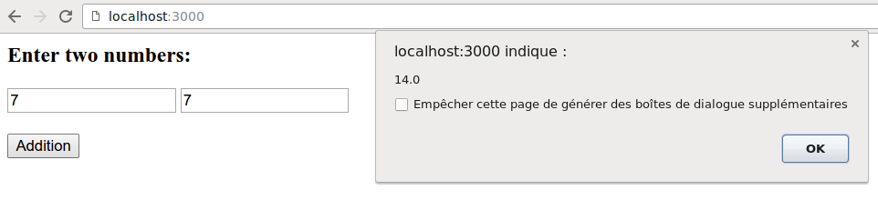

<link rel="stylesheet" type="text/css" href="assets/css/myhighlight.css">

```{r setup, include=FALSE}
knitr::knit_engines$set(pygmentize = function (options) 
{
  f = basename(tempfile("pygmentize", ".", ".txt"))
  writeLines(options$code, f)
  on.exit(unlink(f))
  code = paste("-f html", options$engine.opts, f)
  message("running: pygmentize ", code)
  out = tryCatch(system2("pygmentize", code, stdout = TRUE, stderr = FALSE), 
                 error = function(e) {
                   if (!options$error)
                     stop(e)
                   "Error in running pygmentize"
                 })
  if (!options$error && !is.null(attr(out, "status"))) 
    stop(paste(out, collapse = "\n"))
  knitr::engine_output(options, options$code, out)
}
)
knitr::opts_chunk$set(engine="pygmentize", echo=FALSE, results="asis")
```


### Basic demo




This small app takes two numbers and returns their sum after performing the addition in R. 

This is an Haskell app created with [Yesod](https://en.wikipedia.org/wiki/Yesod_(web_framework)), and R is called from Haskell with the help of the [inline-R](https://tweag.github.io/HaskellR/) package. You make take a look at my [inline-R demo](http://stla.github.io/stlapblog/posts/CallRinHaskell.html) and the article [Hello Yesod+Ajax](http://stla.github.io/stlapblog/posts/HelloYesodAjax.html) before.

```{r, engine.opts="-l haskell"}
{-# LANGUAGE DataKinds #-}
{-# LANGUAGE GADTs #-}
{-# LANGUAGE PartialTypeSignatures #-}
{-# LANGUAGE OverloadedLists #-}
{-# LANGUAGE ScopedTypeVariables #-}
{-# LANGUAGE QuasiQuotes       #-}
{-# LANGUAGE TemplateHaskell   #-}
{-# LANGUAGE ViewPatterns      #-}
{-# LANGUAGE OverloadedStrings, DeriveGeneric #-}
{-# LANGUAGE TypeFamilies      #-}

import Yesod
import GHC.Generics
import qualified Language.R.Instance as R
import H.Prelude.Interactive

data HelloInlineR = HelloInlineR

mkYesod "HelloInlineR" [parseRoutes|
/ HomeR GET
/data DataR PUT
|]

instance Yesod HelloInlineR

data Args = Args {
    _x :: Double,
    _y :: Double
} deriving (Show,Generic)

instance FromJSON Args

getHomeR :: Handler ()
getHomeR = sendFile typeHtml "static/raddition.html"

runR :: Double -> Double -> IO(Double)
runR x y = 
  do
    r <-  [r|x_hs + y_hs|]
    return $ (fromSomeSEXP r :: Double) 

putDataR :: Handler String
putDataR = do
    arguments <- requireJsonBody :: Handler Args
    r <- liftIO $ runR (_x arguments) (_y arguments)
    return $ show r

main :: IO ()
main = do 
    R.initialize R.defaultConfig
    warp 3000 HelloInlineR
```


File *raddition.html*:

```{r, engine.opts="-l html"}
<html>
	<head>
		 <script src="//ajax.googleapis.com/ajax/libs/jquery/2.1.0/jquery.min.js"></script>

		<script type="text/javascript">
			function save() {
				$.ajax({
				url: "/data",
				type: "PUT",
				processData: false,
				data: JSON.stringify({
										_x: Number($("#x").val()), 
										_y: Number($("#y").val())
									}),
				success: function (result) {
					alert (result);
				},
				error: function(xhr, status, error) {
				  alert("Error: " + xhr.responseText);
				},
				dataType: "text",
				contentType: "application/json"
				}); 
			}
		</script>
	</head>
	<body>

		<h3>Enter two numbers:</h3>
		<input id="x" type="number" />
		<input id="y" type="number" />

		<br><br>
		
		<input id="submit" type="button" value="Addition" onclick="save()">

	</body>
</html>
```


Instead of requesting a html file, we can create its contents in the Haskell code:

```{r, engine.opts="-l haskell"}
...

import Yesod.Form.Jquery (YesodJquery (urlJqueryJs))

...

instance Yesod HelloInlineR
instance YesodJquery HelloInlineR

...

getHomeR :: Handler Html
getHomeR = defaultLayout $ do
    setTitle "Yesod + Ajax"
    getYesod >>= addScriptEither . urlJqueryJs
    [whamlet|
        <input #x type=number>
        <input #y type=number>
        <button #add>Addition
    |]
    toWidget script

script = [julius|
$(function(){
    $("#add").click(function(){
        $.ajax({
            contentType: "application/json",
            processData: false,
            url: "@{DataR}",
            type: "PUT",
            data: JSON.stringify({
									_x: Number($("#x").val()), 
									_y: Number($("#y").val())
								}),
            success: function(result) {
                alert(result);
            },
            dataType: "text"
        });
    });
});
|]

...
```

<br>

### Passing a dataframe 

Get the dataframe as a stringified JSON object, and use the `jsonlite` package.

```{r, engine.opts="-l haskell"}
getHomeR :: Handler Html
getHomeR = defaultLayout $ do
    setTitle "Yesod + Ajax"
    getYesod >>= addScriptEither . urlJqueryJs
    [whamlet|
        <button #submit>Submit
    |]
    toWidget script

script = [julius|
$(function(){
    $("#submit").click(function(){
        $.ajax({
            contentType: "text",
            processData: false,
            url: "@{DataR}",
            type: "PUT",
            data: JSON.stringify(JSON.stringify([{name: "Alice", age: 25}, {name: "Bob", age: 30}])),
            success: function(result) {
                alert(result);
            },
            dataType: "text"
        });
    });
});
|]

runR :: String -> IO(Int32) -- requires Data.Int
runR dat = do
    r <- [r|ncol(jsonlite::fromJSON(dat_hs))|]
    return $ (fromSomeSEXP r :: Int32) 

putDataR :: Handler String
putDataR = do
    dat <- requireJsonBody :: Handler String
    r <- liftIO $ runR dat
    return $ show r
```

