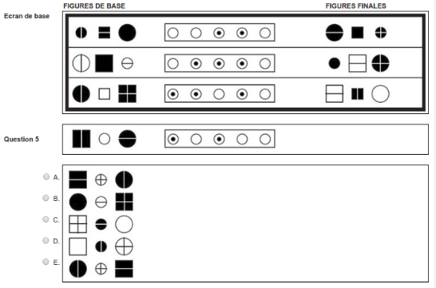
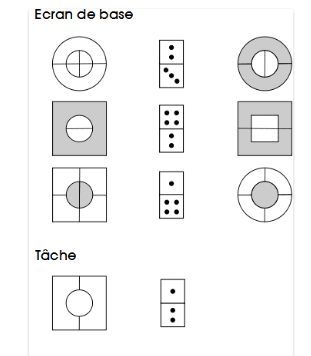
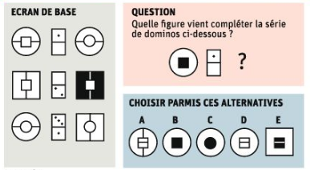

```{r setup, include=FALSE}
library(pander)
knitr::opts_chunk$set(echo = TRUE)
tab0 <- matrix(character(6), nrow=1)
colnames(tab0) <- 1:6
```


Voici un exemple de question du test de "capacité de raisonnement abstrait" du Selor, issu du [test d'entraînement en ligne](http://www.selor.be/fr/tests/tests-sur-pc/capacit%C3%A9-de-raisonnement-abstrait/) :


C'est assez facile de deviner le principe : chacun des cinq "boutons", lorsqu'il est sélectionné, produit une transformation sur la figure de base. 

Cette question fait partie des questions faciles du test. On observe que les deux premières figures changent de forme : le cercle devient un carré, le carré devient un cercle. Puisque le bouton 2 est sélectionné pour ces figures, mais pas pour la troisième, on devine donc que l'action de ce bouton est le changement de la forme.

Le bouton 1 est sélectionné pour les trois figures. On peut aussi deviner son action : il change la taille de la figure. Quand la figure de base est petite, la figure finale est grande, et vice-versa.

Le bouton 3 est sélectionné pour la première et troisième figures. Nous avons vu que le grand cercle de la troisième figure se transforme en petit cercle par le bouton 1. Il reste à ajouter le trait vertical pour obtenir la figure finale. On devine donc que c'est l'action du bouton 3 : il ajoute le trait vertical. Sur la première figure de base, il y a un trait vertical, et il n'y est plus sur la figure finale. L'action de ce bouton est donc d'ajouter un trait vertical s'il n'y en a pas, et de le supprimer s'il y en a un.

On dispose de 1min30 pour répondre à chaque question du test d'entrainement en ligne. Ce n'est pas facile de faire ce raisonnement en un temps si court. 

Passons à la deuxième question :


Cela semble plus compliqué, il va être difficile de résoudre la devinette en 1min30. 

En fait, cela devient assez simple lorsqu'on connaît la liste de transformations possibles :

- "**T**" : *change la taille de la figure*

- "**C**" : *change la couleur de la figure*

- "**F**" : *change la forme de la figure*

- "**-**" : *ajoute/supprime un trait vertical*

- "**|**" : *ajoute/supprime un trait horizontal*

- "**<->**" : *permute les figures*

Dans cette question, il y a deux figures de base à chaque ligne. Il faut aussi savoir que chaque bouton produit la même transformation sur les deux figures.

Ces règles, je ne les ai pas trouvées sur le site du Selor, mais dans [le livre publié par l'ORSEU](http://www.orseu-concours.com/blog/preparation-au-test-de-raisonnement-abstrait-du-selor-ce-quil-faut-savoir/), en vente à 29€ en librairie. Les codes que j'ai introduits ci-dessus ("**T**" pour le changement de taille, etc), sont ceux utilisés dans ce livre.

Connaissant ces règles, il devient aisé de voir que :

- le bouton 1 change la couleur

- le bouton 3 permute les figures

- le bouton 2 ajoute/supprime un trait vertical

- le bouton 4 ajoute/supprime un trait horizontal

Suivant les conseils du livre de l'ORSEU, une bonne méthode consiste à reporter ces transformations dans un tableau, au fur et à mesure qu'on les découvre :

```{r, echo=FALSE, comment=""}
#panderOptions('knitr.auto.asis', FALSE)
tab <- tab0
tab[1, 1:4] <- c("C", "|", "<->", "-")
pander(tab)
```

Puis on obtient que la bonne réponse est B en appliquant ces transformations aux deux  figures de la question.

Les test du Selor peuvent changer. Rien ne garantit qu'il faudra toujours appliquer ces mêmes règles. Mais si elles changent, on peut espérer qu'elles ne feront que varier légèrement. Il faudra alors deviner ces variations sur les questions.


Question suivante :


On peut deviner que le bouton 2, qui agit sur la ligne 1 et la ligne 3 mais pas sur la ligne 2, produit l'une des deux actions suivantes : il permute les figures, ou bien il change leur forme. S'il changeait leur forme, on voit sur la ligne 1 qu'il faudrait encore appliquer deux actions : changer la couleur et changer la taille. Mais il reste un seul bouton sélectionné, le bouton 1. Donc l'action du bouton 2 est l'autre possibilité : il permute les figures, et on voit alors que l'action de l'autre bouton sélectionné à la ligne 1, le bouton 1, est d'ajouter/supprimer un trait vertical. Il est alors facile de trouver l'action du bouton 3 en observant la ligne 2 ou la ligne 3 : celui-ci change la taille. On obtient finalement :

```{r, echo=FALSE}
tab <- tab0
tab[1, 1:3] <- c("|", "<->", "T")
pander(tab)
```

La bonne réponse est alors la E.


Question suivante :


Comme dans la question précédente, on voit que le bouton 3 change la forme ou permute les figures. On élimine la première possibilité, parce qu'en supposant qu'il change la forme, il faudrait encore deux actions pour obtenir les figures finales de la ligne 3 : changer la taille et ajouter/supprimer un trait vertical. Donc le bouton 3 permute les figures. C'est ensuite facile de compléter le tableau, on obtient :

```{r, echo=FALSE}
tab <- tab0
tab[1, 1:4] <- c("-", "C", "<->", "T")
pander(tab)
```

La bonne réponse est alors la C.

Question suivante :



Il y a une "astuce" pour les séries de trois figures : observer d'abord les figures du milieu, car la permutation n'a pas d'effet sur cette figure. On voit ici en observant les figures du milieu que le bouton 2, sélectionné aux lignes 2 et 3 mais pas à la ligne 1, change la couleur. On voit aussi que le bouton 3 ajoute/supprime un trait horizontal. C'est ensuite facile de compléter le tableau, on obtient :

```{r, echo=FALSE}
tab <- tab0
tab[1, 1:4] <- c("|", "C", "-", "<->")
pander(tab)
```

La bonne réponse est alors la A.

Question suivante :


On voit que la couleur a changé sur la ligne 2, et c'est donc l'action du bouton 2 ou du bouton 3. La ligne 3 permet d'éliminer la possibilité que ce soit le bouton 2, c'est donc le bouton 3. L'autre action pour parvenir aux figures finales de la ligne 2, produite par le bouton 2, est l'ajout/suppresion d'une ligne horizontale. La ligne 3 permet alors de déterminer l'action du bouton 1 : c'est la permutation. On obtient :


```{r, echo=FALSE}
tab <- tab0
tab[1, 1:4] <- c("<->", "-", "C", "|")
pander(tab)
```

La bonne réponse est la D.

J'ai trouvé la question suivante sur le site [lalibre.be](http://www.lalibre.be/actu/belgique/l-hecatombe-lors-des-tests-abstraits-du-selor-52bd03cc35701baedaaa1ea8) :


Il me semble qu'elle est erronée. Pour obtenir la ligne 1 en deux actions, il faut permuter puis ajouter/supprimer un trait vertical. Pour la ligne 2, on change la taille et on ajoute/supprime un trait vertical. Donc le bouton 1 ajoute/supprime un trait vertical, le bouton 2 permute, et le bouton 3 change la taille. Il manque alors l'action qui change la couleur dans la ligne 3.

Voici un autre type de question (trouvée [ici](http://www.orseu-concours.com/blog/preparation-au-test-de-raisonnement-abstrait-du-selor-ce-quil-faut-savoir/)), avec des dominos : 



Pour résoudre ces questions, il faut savoir que : 

- la figure est en deux parties : elle est composée d'une "grande figure", extérieure,  avec un "trou" à l'intérieur, et une "petite figure", intérieure, complète ce trou ;

- chaque score sur un domino agit sur l'une des deux figures, par exemple le score du haut (2 à la ligne 1) agit sur la grande figure et le score du bas (3 à la ligne 1) agit sur la petite figure, et ceci est commun à toutes les lignes.

On peut alors deviner que le 4 du domino change la forme : à la ligne 2, il est en haut et il agit sur la petite figure ;  à la ligne 3 il est en bas et il agit sur la grande figure. Donc le 1 à la ligne 3 agit sur la petite figure, et son action est d'ajouter/supprimer un trait vertical. Le 2 à la ligne 2 agit sur la grande figure et son action est d'ajouter/supprimer un trait horizontal. En appliquant ces transformations, on obtient que la bonne réponse est la A.

Voici une autre question avec des dominos, venant du site [lalibre.be](http://www.lalibre.be/actu/belgique/l-hecatombe-lors-des-tests-abstraits-du-selor-52bd03cc35701baedaaa1ea8) :



Il y a ici encore une chose à savoir : quand une moitié du domino est vide, elle n'a pas d'action. En observant la ligne 1 ou la ligne 2, on en déduit que la partie basse du domino agit (ou plutôt n'agit pas, parce qu'elle est vide) sur la grande figure, et la partie haute agit sur la petite figure. Sur la ligne 1 on observe alors que le 1 a pour action de modifier la forme. La bonne réponse est donc la C.

Vous trouverez [un autre exemple ici](https://aurian2012.wordpress.com/2013/12/28/conseils-pour-le-passage-de-la-phase-1-de-laccession-au-niveau-a-dans-ladministration-federale-belge/comment-page-1/), avec des traits obliques.

Il existe aussi des questions avec deux dominos. Les deux agissent de la même façon : si la partie haute du premier domino agit sur la grande figure, il en est de même pour le deuxième domino. C'est du moins ainsi que ça s'est passé jusqu'à maintenant, mais, comme nous l'avons dit précédemment, les tests Selor peuvent varier.

