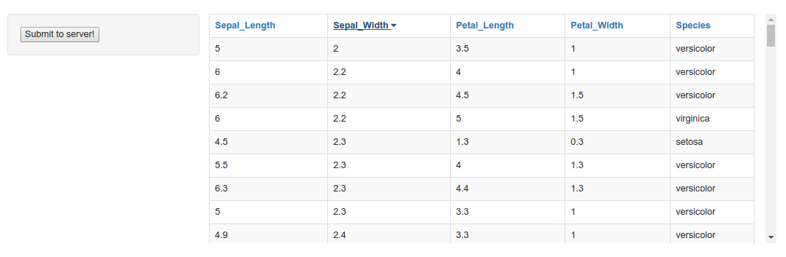

<link rel="stylesheet" type="text/css" href="assets/css/myhighlight.css">

```{r setup, include=FALSE}
knitr::knit_engines$set(pygmentize = function (options) 
{
  f = basename(tempfile("pygmentize", ".", ".txt"))
  writeLines(options$code, f)
  on.exit(unlink(f))
  code = paste("-f html", options$engine.opts, f)
  message("running: pygmentize ", code)
  out = tryCatch(system2("pygmentize", code, stdout = TRUE, stderr = FALSE), 
                 error = function(e) {
                   if (!options$error)
                     stop(e)
                   "Error in running pygmentize"
                 })
  if (!options$error && !is.null(attr(out, "status"))) 
    stop(paste(out, collapse = "\n"))
  knitr::engine_output(options, options$code, out)
}
)
knitr::opts_chunk$set(engine="pygmentize", engine.opts="-l html", echo=FALSE, results='asis')
```

We give three ways to make a table in an opencpu app from a dataframe returned by a call to a R function.
The `getDF` function used for the example has no argument and returns a dataframe only:

```{r, engine.opts="-l r"}
getDF <- function(){
  df <- iris
  colnames(df) <- sub(".", "_", colnames(df), fixed=TRUE)
  return(df)
}
```


## Using jsonTable

This way uses the [jsonTable](https://github.com/omkarkhair/jsonTable) library. I use the following Javascript function based on this library.

```{r, engine.opts="-l js" }
// js/jsontotable.js
function jsontotable(selector, data, columns, colnames=columns, rowclass="classy", callback=function(){}){
	var options = {
		source: data,
		rowClass: rowclass,
		callback: callback
	};
	$(selector).jsonTable({
		head : colnames,
		json : columns
	});
	$(selector).jsonTableUpdate(options);
}
```

I also use [bootstrap](http://www.w3schools.com/bootstrap/bootstrap_tables.asp) in order to get a nice style.

```{r}
<html>
  <head>
    <script src="opencpu/jquery-1.10.2.min.js"></script>
    <script src="opencpu/opencpu-0.4.js"></script>
    <script src="bootstrap/js/bootstrap.min.js"></script>
    <link rel="stylesheet" href="bootstrap/css/bootstrap.min.css">
  	<script type="text/javascript" src="jsonTable/jsonTable.js"></script>
  	<script type="text/javascript" charset="utf8" src="js/jsontotable.js"></script>

    <style type="text/css">
        /* style for the rows */
        #dataTable .classy {
            color: green;
        }
    </style>

    <script>
    // init this script when the page has loaded
    $(document).ready(function() {
        $("#submitbutton").on("click", function() {
            // disable the button 
            $("#submitbutton").attr("disabled", "disabled");

            // perform the request
            var req = ocpu.rpc(
                "getDF", 
                {},
                function(df) {
                  // get the column names
                  var columns = Object.keys(df[0]);
                  // create the table
                  jsontotable("#dataTable", df, columns);
                }
            );

            // if R returns an error, alert the error message
            req.fail(function() {
                alert("Server error: " + req.responseText);
            });

        });
    });
    </script>

  </head>
  <body>

    <button id="submitbutton" type="button">Submit to server!</button>

    <br><br>

		<div class="container">
			<div class="row">
				<div class="col-sm-8" style="height:350px; display:block; overflow-y:auto">
					<table id="dataTable"  class="table table-bordered"></table>
				</div>
				<div class="col-sm-4">
				  <h4>Table created with <a href="https://github.com/omkarkhair/jsonTable">jsonTable.js</a>.</h4>
				</div>
			</div>
    </div>

  </body>
</html>
```

The output:


## Using datatables

Here is the way to render a `datatables` table in an `opencpu` application. 

```{r}
<html>
<head>
  <script src="opencpu/jquery-1.10.2.min.js"></script>
  <script src="opencpu/opencpu-0.4.js"></script>
  <link rel="stylesheet" type="text/css" href="http://cdn.datatables.net/1.10.12/css/jquery.dataTables.css">
  <script type="text/javascript" charset="utf8" src="http://cdn.datatables.net/1.10.12/js/jquery.dataTables.js"></script>

  <script type="text/javascript">
    function makeHeaders(colnames) {
      var str = "";
      for (var i = 0; i < colnames.length; i++) {
        str += "<th>" + colnames[i] + "</th>";
      }
      return (str);
    }
  </script>

  <script>
    // init this script when the page has loaded
    $(document).ready(function() {
      $("#submitbutton").click(function() {
        //disable the button
        $("#submitbutton").attr("disabled", "disabled");

        //perform the request
        var req = ocpu.rpc(
          "getDF",
          {},
          function(df) {
            // get the column names
            var colnames = Object.keys(df[0]);
            // create the JSON array for the columns required by DataTable
            var columns = [];
            for (i = 0; i < colnames.length; i++) {
              var obj = {};
              obj['data'] = colnames[i]
              columns.push(obj);
            }
            // first make the header row, then run DataTable
            $.when($.ajax({
              success: function() {
                $('#mytable thead tr').append(makeHeaders(colnames));
              }
            })).done(function() {
              $('#mytable').DataTable({
                data: df,
                columns: columns
              })
            });
          }
        );

        // if R returns an error, alert the error message
        req.fail(function() {
          alert("Server error: " + req.responseText);
        });

      });
    });
  </script>

</head>
<body>

  <button id="submitbutton" type="button">Submit to server!</button>

  <div style="width:600px;display:block;margin-left:auto;margin-right:auto">
    <table id="mytable" class="display">
      <thead>
        <tr role="row"></tr>
      </thead>
      <tbody></tbody>
    </table>
  </div>

</body>
</html>
```

The output:


## Using angular.js (with sorting feature)


```{r}
<html>
<head>
	<script src="opencpu/jquery-1.10.2.min.js"></script>
	<script src="opencpu/opencpu-0.4.js"></script>
	<link rel="stylesheet" href="http://maxcdn.bootstrapcdn.com/bootstrap/3.3.7/css/bootstrap.min.css">
	<link rel="stylesheet" href="http://maxcdn.bootstrapcdn.com/font-awesome/4.2.0/css/font-awesome.min.css">
	<script src="http://ajax.googleapis.com/ajax/libs/angularjs/1.4.8/angular.min.js"></script>
</head>

<body>
  <br><br>

	<div ng-app="myApp" ng-controller="myCtrl">

		<div class="container">
			<div class="row">

				<div class="col-sm-3 well">
					<button id="submitbutton" type="button" ng-click="clicked()">Submit to server!</button>
				</div>

				<div class="col-sm-9" style="height:350px; display:block; overflow-y:auto">
					<table id="dataTable" width="100%" class="table table-bordered table-striped">
						<thead>
							<tr>
								<th ng-repeat="header in columns">
									<a href="#" ng-click="sortTable(header)">
										{{header}}
										<span ng-show="sortType == header && !sortReverse" class="fa fa-caret-down"></span>
										<span ng-show="sortType == header && sortReverse" class="fa fa-caret-up"></span>
									</a>
								</th>
							</tr>
						</thead>
						<tbody>
							<tr ng-repeat="row in jsonTable | orderBy:sortType:sortReverse">
								<td ng-repeat="cell in row">{{cell}}</td>
							</tr>
						</tbody>
					</table>
				</div>

			</div>
		</div>

	</div>

	<script>
		var app = angular.module('myApp', []);

		app.controller('myCtrl', function($scope) {
			// on click action
			$scope.clicked = function() {
				//perform the request
				var req = ocpu.rpc(
					"getDF",
					{},
					function(df) {
						// send the table as JSON to the scope
						$scope.$apply(function() {
							// sort options
							$scope.sortReverse = false;
							$scope.sortTable = function(header) {
								$scope.sortReverse = !$scope.sortReverse;
								$scope.sortType = header;
							}
							// table
							$scope.columns = Object.keys(df[0]);
							$scope.jsonTable = df;
						});
					}
				);
				//if R returns an error, alert the error message
				req.fail(function() {
					alert("Server error: " + req.responseText);
				});

			}
		});
	</script>

</body>
</html>
```

The output:



