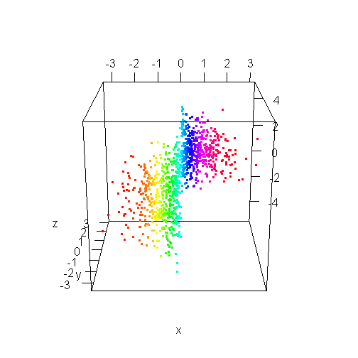
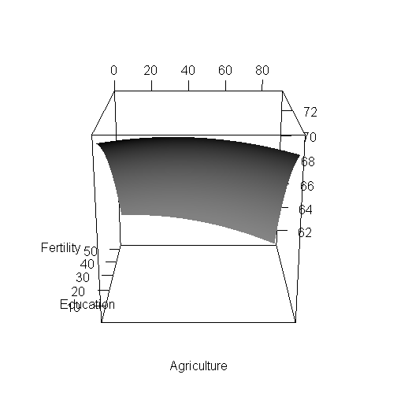

---
title: Including an interactive 3D `rgl` graphic in a html report with `knitr`
author: Stéphane Laurent
date : 2013-03-08
--- &lead


I posted [a question on StackOverflow](http://stackoverflow.com/questions/14879210/including-a-interactive-3d-figure-with-knitr): *how to embed an interactive 3D figure created with the `rgl` package into an html report created with `knitr` ?* The next day, Yihui Xie has posted a solution. He has updated `knitr` to include this possibility. 


The first example
--------------------------------

Below is the rendering of the example given by Yihui.


```r
library(rgl)
knit_hooks$set(webgl = hook_webgl)
```


```r
x <- sort(rnorm(1000))
y <- rnorm(1000)
z <- rnorm(1000) + atan2(x, y)
open3d()
plot3d(x, y, z, col = rainbow(1000))
```

<script src="CanvasMatrix.js" type="text/javascript"></script>
<canvas id="rgl_firstexampletextureCanvas" style="display: none;" width="256" height="256">
<br>
	Your browser does not support the HTML5 canvas element.</canvas>
<!-- ****** points object 39 ****** -->
<script id="rgl_firstexamplevshader39" type="x-shader/x-vertex">
	attribute vec3 aPos;
	attribute vec4 aCol;
	uniform mat4 mvMatrix;
	uniform mat4 prMatrix;
	varying vec4 vCol;
	varying vec4 vPosition;
	void main(void) {
	  vPosition = mvMatrix * vec4(aPos, 1.);
	  gl_Position = prMatrix * vPosition;
	  gl_PointSize = 3.;
	  vCol = aCol;
	}
</script>
<script id="rgl_firstexamplefshader39" type="x-shader/x-fragment"> 
	#ifdef GL_ES
	precision highp float;
	#endif
	varying vec4 vCol; // carries alpha
	varying vec4 vPosition;
	void main(void) {
      vec4 colDiff = vCol;
	  vec4 lighteffect = colDiff;
	  gl_FragColor = lighteffect;
	}
</script> 
<!-- ****** text object 41 ****** -->
<script id="rgl_firstexamplevshader41" type="x-shader/x-vertex">
	attribute vec3 aPos;
	attribute vec4 aCol;
	uniform mat4 mvMatrix;
	uniform mat4 prMatrix;
	varying vec4 vCol;
	varying vec4 vPosition;
	attribute vec2 aTexcoord;
	varying vec2 vTexcoord;
	attribute vec2 aOfs;
	void main(void) {
	  vCol = aCol;
	  vTexcoord = aTexcoord;
	  vec4 pos = prMatrix * mvMatrix * vec4(aPos, 1.);
	  pos = pos/pos.w;
	  gl_Position = pos + vec4(aOfs, 0.,0.);
	}
</script>
<script id="rgl_firstexamplefshader41" type="x-shader/x-fragment"> 
	#ifdef GL_ES
	precision highp float;
	#endif
	varying vec4 vCol; // carries alpha
	varying vec4 vPosition;
	varying vec2 vTexcoord;
	uniform sampler2D uSampler;
	void main(void) {
      vec4 colDiff = vCol;
	  vec4 lighteffect = colDiff;
	  vec4 textureColor = lighteffect*texture2D(uSampler, vTexcoord);
	  if (textureColor.a < 0.1)
	    discard;
	  else
	    gl_FragColor = textureColor;
	}
</script> 
<!-- ****** text object 42 ****** -->
<script id="rgl_firstexamplevshader42" type="x-shader/x-vertex">
	attribute vec3 aPos;
	attribute vec4 aCol;
	uniform mat4 mvMatrix;
	uniform mat4 prMatrix;
	varying vec4 vCol;
	varying vec4 vPosition;
	attribute vec2 aTexcoord;
	varying vec2 vTexcoord;
	attribute vec2 aOfs;
	void main(void) {
	  vCol = aCol;
	  vTexcoord = aTexcoord;
	  vec4 pos = prMatrix * mvMatrix * vec4(aPos, 1.);
	  pos = pos/pos.w;
	  gl_Position = pos + vec4(aOfs, 0.,0.);
	}
</script>
<script id="rgl_firstexamplefshader42" type="x-shader/x-fragment"> 
	#ifdef GL_ES
	precision highp float;
	#endif
	varying vec4 vCol; // carries alpha
	varying vec4 vPosition;
	varying vec2 vTexcoord;
	uniform sampler2D uSampler;
	void main(void) {
      vec4 colDiff = vCol;
	  vec4 lighteffect = colDiff;
	  vec4 textureColor = lighteffect*texture2D(uSampler, vTexcoord);
	  if (textureColor.a < 0.1)
	    discard;
	  else
	    gl_FragColor = textureColor;
	}
</script> 
<!-- ****** text object 43 ****** -->
<script id="rgl_firstexamplevshader43" type="x-shader/x-vertex">
	attribute vec3 aPos;
	attribute vec4 aCol;
	uniform mat4 mvMatrix;
	uniform mat4 prMatrix;
	varying vec4 vCol;
	varying vec4 vPosition;
	attribute vec2 aTexcoord;
	varying vec2 vTexcoord;
	attribute vec2 aOfs;
	void main(void) {
	  vCol = aCol;
	  vTexcoord = aTexcoord;
	  vec4 pos = prMatrix * mvMatrix * vec4(aPos, 1.);
	  pos = pos/pos.w;
	  gl_Position = pos + vec4(aOfs, 0.,0.);
	}
</script>
<script id="rgl_firstexamplefshader43" type="x-shader/x-fragment"> 
	#ifdef GL_ES
	precision highp float;
	#endif
	varying vec4 vCol; // carries alpha
	varying vec4 vPosition;
	varying vec2 vTexcoord;
	uniform sampler2D uSampler;
	void main(void) {
      vec4 colDiff = vCol;
	  vec4 lighteffect = colDiff;
	  vec4 textureColor = lighteffect*texture2D(uSampler, vTexcoord);
	  if (textureColor.a < 0.1)
	    discard;
	  else
	    gl_FragColor = textureColor;
	}
</script> 
<!-- ****** lines object 44 ****** -->
<script id="rgl_firstexamplevshader44" type="x-shader/x-vertex">
	attribute vec3 aPos;
	attribute vec4 aCol;
	uniform mat4 mvMatrix;
	uniform mat4 prMatrix;
	varying vec4 vCol;
	varying vec4 vPosition;
	void main(void) {
	  vPosition = mvMatrix * vec4(aPos, 1.);
	  gl_Position = prMatrix * vPosition;
	  vCol = aCol;
	}
</script>
<script id="rgl_firstexamplefshader44" type="x-shader/x-fragment"> 
	#ifdef GL_ES
	precision highp float;
	#endif
	varying vec4 vCol; // carries alpha
	varying vec4 vPosition;
	void main(void) {
      vec4 colDiff = vCol;
	  vec4 lighteffect = colDiff;
	  gl_FragColor = lighteffect;
	}
</script> 
<!-- ****** text object 45 ****** -->
<script id="rgl_firstexamplevshader45" type="x-shader/x-vertex">
	attribute vec3 aPos;
	attribute vec4 aCol;
	uniform mat4 mvMatrix;
	uniform mat4 prMatrix;
	varying vec4 vCol;
	varying vec4 vPosition;
	attribute vec2 aTexcoord;
	varying vec2 vTexcoord;
	attribute vec2 aOfs;
	void main(void) {
	  vCol = aCol;
	  vTexcoord = aTexcoord;
	  vec4 pos = prMatrix * mvMatrix * vec4(aPos, 1.);
	  pos = pos/pos.w;
	  gl_Position = pos + vec4(aOfs, 0.,0.);
	}
</script>
<script id="rgl_firstexamplefshader45" type="x-shader/x-fragment"> 
	#ifdef GL_ES
	precision highp float;
	#endif
	varying vec4 vCol; // carries alpha
	varying vec4 vPosition;
	varying vec2 vTexcoord;
	uniform sampler2D uSampler;
	void main(void) {
      vec4 colDiff = vCol;
	  vec4 lighteffect = colDiff;
	  vec4 textureColor = lighteffect*texture2D(uSampler, vTexcoord);
	  if (textureColor.a < 0.1)
	    discard;
	  else
	    gl_FragColor = textureColor;
	}
</script> 
<!-- ****** lines object 46 ****** -->
<script id="rgl_firstexamplevshader46" type="x-shader/x-vertex">
	attribute vec3 aPos;
	attribute vec4 aCol;
	uniform mat4 mvMatrix;
	uniform mat4 prMatrix;
	varying vec4 vCol;
	varying vec4 vPosition;
	void main(void) {
	  vPosition = mvMatrix * vec4(aPos, 1.);
	  gl_Position = prMatrix * vPosition;
	  vCol = aCol;
	}
</script>
<script id="rgl_firstexamplefshader46" type="x-shader/x-fragment"> 
	#ifdef GL_ES
	precision highp float;
	#endif
	varying vec4 vCol; // carries alpha
	varying vec4 vPosition;
	void main(void) {
      vec4 colDiff = vCol;
	  vec4 lighteffect = colDiff;
	  gl_FragColor = lighteffect;
	}
</script> 
<!-- ****** text object 47 ****** -->
<script id="rgl_firstexamplevshader47" type="x-shader/x-vertex">
	attribute vec3 aPos;
	attribute vec4 aCol;
	uniform mat4 mvMatrix;
	uniform mat4 prMatrix;
	varying vec4 vCol;
	varying vec4 vPosition;
	attribute vec2 aTexcoord;
	varying vec2 vTexcoord;
	attribute vec2 aOfs;
	void main(void) {
	  vCol = aCol;
	  vTexcoord = aTexcoord;
	  vec4 pos = prMatrix * mvMatrix * vec4(aPos, 1.);
	  pos = pos/pos.w;
	  gl_Position = pos + vec4(aOfs, 0.,0.);
	}
</script>
<script id="rgl_firstexamplefshader47" type="x-shader/x-fragment"> 
	#ifdef GL_ES
	precision highp float;
	#endif
	varying vec4 vCol; // carries alpha
	varying vec4 vPosition;
	varying vec2 vTexcoord;
	uniform sampler2D uSampler;
	void main(void) {
      vec4 colDiff = vCol;
	  vec4 lighteffect = colDiff;
	  vec4 textureColor = lighteffect*texture2D(uSampler, vTexcoord);
	  if (textureColor.a < 0.1)
	    discard;
	  else
	    gl_FragColor = textureColor;
	}
</script> 
<!-- ****** lines object 48 ****** -->
<script id="rgl_firstexamplevshader48" type="x-shader/x-vertex">
	attribute vec3 aPos;
	attribute vec4 aCol;
	uniform mat4 mvMatrix;
	uniform mat4 prMatrix;
	varying vec4 vCol;
	varying vec4 vPosition;
	void main(void) {
	  vPosition = mvMatrix * vec4(aPos, 1.);
	  gl_Position = prMatrix * vPosition;
	  vCol = aCol;
	}
</script>
<script id="rgl_firstexamplefshader48" type="x-shader/x-fragment"> 
	#ifdef GL_ES
	precision highp float;
	#endif
	varying vec4 vCol; // carries alpha
	varying vec4 vPosition;
	void main(void) {
      vec4 colDiff = vCol;
	  vec4 lighteffect = colDiff;
	  gl_FragColor = lighteffect;
	}
</script> 
<!-- ****** text object 49 ****** -->
<script id="rgl_firstexamplevshader49" type="x-shader/x-vertex">
	attribute vec3 aPos;
	attribute vec4 aCol;
	uniform mat4 mvMatrix;
	uniform mat4 prMatrix;
	varying vec4 vCol;
	varying vec4 vPosition;
	attribute vec2 aTexcoord;
	varying vec2 vTexcoord;
	attribute vec2 aOfs;
	void main(void) {
	  vCol = aCol;
	  vTexcoord = aTexcoord;
	  vec4 pos = prMatrix * mvMatrix * vec4(aPos, 1.);
	  pos = pos/pos.w;
	  gl_Position = pos + vec4(aOfs, 0.,0.);
	}
</script>
<script id="rgl_firstexamplefshader49" type="x-shader/x-fragment"> 
	#ifdef GL_ES
	precision highp float;
	#endif
	varying vec4 vCol; // carries alpha
	varying vec4 vPosition;
	varying vec2 vTexcoord;
	uniform sampler2D uSampler;
	void main(void) {
      vec4 colDiff = vCol;
	  vec4 lighteffect = colDiff;
	  vec4 textureColor = lighteffect*texture2D(uSampler, vTexcoord);
	  if (textureColor.a < 0.1)
	    discard;
	  else
	    gl_FragColor = textureColor;
	}
</script> 
<!-- ****** lines object 50 ****** -->
<script id="rgl_firstexamplevshader50" type="x-shader/x-vertex">
	attribute vec3 aPos;
	attribute vec4 aCol;
	uniform mat4 mvMatrix;
	uniform mat4 prMatrix;
	varying vec4 vCol;
	varying vec4 vPosition;
	void main(void) {
	  vPosition = mvMatrix * vec4(aPos, 1.);
	  gl_Position = prMatrix * vPosition;
	  vCol = aCol;
	}
</script>
<script id="rgl_firstexamplefshader50" type="x-shader/x-fragment"> 
	#ifdef GL_ES
	precision highp float;
	#endif
	varying vec4 vCol; // carries alpha
	varying vec4 vPosition;
	void main(void) {
      vec4 colDiff = vCol;
	  vec4 lighteffect = colDiff;
	  gl_FragColor = lighteffect;
	}
</script> 
<script type="text/javascript"> 
	function getShader ( gl, id ){
	   var shaderScript = document.getElementById ( id );
	   var str = "";
	   var k = shaderScript.firstChild;
	   while ( k ){
	     if ( k.nodeType == 3 ) str += k.textContent;
	     k = k.nextSibling;
	   }
	   var shader;
	   if ( shaderScript.type == "x-shader/x-fragment" )
             shader = gl.createShader ( gl.FRAGMENT_SHADER );
	   else if ( shaderScript.type == "x-shader/x-vertex" )
             shader = gl.createShader(gl.VERTEX_SHADER);
	   else return null;
	   gl.shaderSource(shader, str);
	   gl.compileShader(shader);
	   if (gl.getShaderParameter(shader, gl.COMPILE_STATUS) == 0)
	     alert(gl.getShaderInfoLog(shader));
	   return shader;
	}
	var min = Math.min;
	var max = Math.max;
	var sqrt = Math.sqrt;
	var sin = Math.sin;
	var acos = Math.acos;
	var tan = Math.tan;
	var SQRT2 = Math.SQRT2;
	var PI = Math.PI;
	var log = Math.log;
	var exp = Math.exp;
	function rgl_firstexamplewebGLStart() {
	   var debug = function(msg) {
	     document.getElementById("rgl_firstexampledebug").innerHTML = msg;
	   }
	   debug("");
	   var canvas = document.getElementById("rgl_firstexamplecanvas");
	   if (!window.WebGLRenderingContext){
	     debug("<br> Your browser does not support WebGL. See <a href=\"http://get.webgl.org\">http://get.webgl.org</a>");
	     return;
	   }
	   var gl;
	   try {
	     // Try to grab the standard context. If it fails, fallback to experimental.
	     gl = canvas.getContext("webgl") 
	       || canvas.getContext("experimental-webgl");
	   }
	   catch(e) {}
	   if ( !gl ) {
	     debug("<br> Your browser appears to support WebGL, but did not create a WebGL context.  See <a href=\"http://get.webgl.org\">http://get.webgl.org</a>");
	     return;
	   }
	   var width = 505;  var height = 505;
	   canvas.width = width;   canvas.height = height;
	   gl.viewport(0, 0, width, height);
	   var prMatrix = new CanvasMatrix4();
	   var mvMatrix = new CanvasMatrix4();
	   var normMatrix = new CanvasMatrix4();
	   var saveMat = new CanvasMatrix4();
	   saveMat.makeIdentity();
	   var distance;
	   var posLoc = 0;
	   var colLoc = 1;
	   var zoom = 1;
	   var fov = 30;
	   var userMatrix = new CanvasMatrix4();
	   userMatrix.load([
	    1, 0, 0, 0,
	    0, 0.3420201, -0.9396926, 0,
	    0, 0.9396926, 0.3420201, 0,
	    0, 0, 0, 1
		]);
	   function getPowerOfTwo(value) {
	     var pow = 1;
	     while(pow<value) {
	       pow *= 2;
	     }
	     return pow;
	   }
	   function handleLoadedTexture(texture, textureCanvas) {
	     gl.pixelStorei(gl.UNPACK_FLIP_Y_WEBGL, true);
	     gl.bindTexture(gl.TEXTURE_2D, texture);
	     gl.texImage2D(gl.TEXTURE_2D, 0, gl.RGBA, gl.RGBA, gl.UNSIGNED_BYTE, textureCanvas);
	     gl.texParameteri(gl.TEXTURE_2D, gl.TEXTURE_MAG_FILTER, gl.LINEAR);
	     gl.texParameteri(gl.TEXTURE_2D, gl.TEXTURE_MIN_FILTER, gl.LINEAR_MIPMAP_NEAREST);
	     gl.generateMipmap(gl.TEXTURE_2D);
	     gl.bindTexture(gl.TEXTURE_2D, null);
	   }
	   function loadImageToTexture(filename, texture) {   
	     var canvas = document.getElementById("rgl_firstexampletextureCanvas");
	     var ctx = canvas.getContext("2d");
	     var image = new Image();
	     image.onload = function() {
	       var w = image.width;
	       var h = image.height;
	       var canvasX = getPowerOfTwo(w);
	       var canvasY = getPowerOfTwo(h);
	       canvas.width = canvasX;
	       canvas.height = canvasY;
	       ctx.imageSmoothingEnabled = true;
	       ctx.drawImage(image, 0, 0, canvasX, canvasY);
	       handleLoadedTexture(texture, canvas);
   	       drawScene();
	     }
	     image.src = filename;
	   }  	   
	   function drawTextToCanvas(text, cex) {
	     var canvasX, canvasY;
	     var textX, textY;
	     var textHeight = 20 * cex;
	     var textColour = "white";
	     var fontFamily = "Arial";
	     var backgroundColour = "rgba(0,0,0,0)";
	     var canvas = document.getElementById("rgl_firstexampletextureCanvas");
	     var ctx = canvas.getContext("2d");
	     ctx.font = textHeight+"px "+fontFamily;
             canvasX = 1;
             var widths = [];
	     for (var i = 0; i < text.length; i++)  {
	       widths[i] = ctx.measureText(text[i]).width;
	       canvasX = (widths[i] > canvasX) ? widths[i] : canvasX;
	     }	  
	     canvasX = getPowerOfTwo(canvasX);
	     var offset = 2*textHeight; // offset to first baseline
	     var skip = 2*textHeight;   // skip between baselines	  
	     canvasY = getPowerOfTwo(offset + text.length*skip);
	     canvas.width = canvasX;
	     canvas.height = canvasY;
	     ctx.fillStyle = backgroundColour;
	     ctx.fillRect(0, 0, ctx.canvas.width, ctx.canvas.height);
	     ctx.fillStyle = textColour;
	     ctx.textAlign = "left";
	     ctx.textBaseline = "alphabetic";
	     ctx.font = textHeight+"px "+fontFamily;
	     for(var i = 0; i < text.length; i++) {
	       textY = i*skip + offset;
	       ctx.fillText(text[i], 0,  textY);
	     }
	     return {canvasX:canvasX, canvasY:canvasY,
	             widths:widths, textHeight:textHeight,
	             offset:offset, skip:skip};
	   }
	   // ****** points object 39 ******
	   var prog39  = gl.createProgram();
	   gl.attachShader(prog39, getShader( gl, "rgl_firstexamplevshader39" ));
	   gl.attachShader(prog39, getShader( gl, "rgl_firstexamplefshader39" ));
	   //  Force aPos to location 0, aCol to location 1 
	   gl.bindAttribLocation(prog39, 0, "aPos");
	   gl.bindAttribLocation(prog39, 1, "aCol");
	   gl.linkProgram(prog39);
	   var v=new Float32Array([
	    -3.405628, 0.1935234, -0.6867363, 1, 0, 0, 1,
	    -3.196587, 1.618555, 0.01483536, 1, 0.007843138, 0, 1,
	    -2.983315, 1.604016, 0.5090724, 1, 0.01176471, 0, 1,
	    -2.861646, -1.014344, -1.792637, 1, 0.01960784, 0, 1,
	    -2.714415, -0.897164, -1.064351, 1, 0.02352941, 0, 1,
	    -2.605501, -0.2707454, -0.6656787, 1, 0.03137255, 0, 1,
	    -2.590266, -1.726905, -3.59774, 1, 0.03529412, 0, 1,
	    -2.584229, -0.4645318, -0.3756665, 1, 0.04313726, 0, 1,
	    -2.442239, 0.4421975, -1.974192, 1, 0.04705882, 0, 1,
	    -2.369748, 0.005688656, -3.438487, 1, 0.05490196, 0, 1,
	    -2.361289, 1.760672, -0.973645, 1, 0.05882353, 0, 1,
	    -2.315236, 2.020302, -0.1085043, 1, 0.06666667, 0, 1,
	    -2.301918, -0.2704582, -2.764496, 1, 0.07058824, 0, 1,
	    -2.275495, -0.24029, -0.7904145, 1, 0.07843138, 0, 1,
	    -2.232146, -0.01822641, -1.725687, 1, 0.08235294, 0, 1,
	    -2.23197, 0.06684411, -3.763882, 1, 0.09019608, 0, 1,
	    -2.220719, -1.77998, -1.913205, 1, 0.09411765, 0, 1,
	    -2.166048, -0.3408051, -1.646972, 1, 0.1019608, 0, 1,
	    -2.163293, 0.8687202, -2.138341, 1, 0.1098039, 0, 1,
	    -2.026108, 0.4390896, -1.2871, 1, 0.1137255, 0, 1,
	    -1.969978, 0.7576264, -2.434845, 1, 0.1215686, 0, 1,
	    -1.968039, -1.909663, -1.371548, 1, 0.1254902, 0, 1,
	    -1.95782, 0.1655079, -2.428226, 1, 0.1333333, 0, 1,
	    -1.933514, -0.007431606, -2.091174, 1, 0.1372549, 0, 1,
	    -1.900429, -0.2593319, -1.955542, 1, 0.145098, 0, 1,
	    -1.896315, 1.615637, -1.579121, 1, 0.1490196, 0, 1,
	    -1.872169, 0.8371539, -2.977359, 1, 0.1568628, 0, 1,
	    -1.860674, -0.776329, -1.20507, 1, 0.1607843, 0, 1,
	    -1.843235, 0.2868477, -1.386134, 1, 0.1686275, 0, 1,
	    -1.734231, 0.8695709, -0.5716937, 1, 0.172549, 0, 1,
	    -1.724239, -0.01072018, -2.370337, 1, 0.1803922, 0, 1,
	    -1.711875, -1.83621, -4.509853, 1, 0.1843137, 0, 1,
	    -1.697488, -0.3982922, -0.756565, 1, 0.1921569, 0, 1,
	    -1.678233, -0.6366565, -1.355844, 1, 0.1960784, 0, 1,
	    -1.677182, 1.125059, -1.580843, 1, 0.2039216, 0, 1,
	    -1.675596, 1.649209, -0.9932134, 1, 0.2117647, 0, 1,
	    -1.668779, -0.6600844, -1.122528, 1, 0.2156863, 0, 1,
	    -1.652432, -0.7176318, -2.871156, 1, 0.2235294, 0, 1,
	    -1.644284, 0.01252604, -1.251531, 1, 0.227451, 0, 1,
	    -1.630058, 1.834818, -0.6192563, 1, 0.2352941, 0, 1,
	    -1.612813, 1.467913, -1.23888, 1, 0.2392157, 0, 1,
	    -1.590856, 0.4927507, 0.6211907, 1, 0.2470588, 0, 1,
	    -1.590565, 2.427518, -0.8348709, 1, 0.2509804, 0, 1,
	    -1.587942, -0.5770088, -0.7876424, 1, 0.2588235, 0, 1,
	    -1.574631, 1.172244, -1.381861, 1, 0.2627451, 0, 1,
	    -1.571087, 0.6524405, -2.357481, 1, 0.2705882, 0, 1,
	    -1.569203, -0.3175868, -1.952981, 1, 0.2745098, 0, 1,
	    -1.560825, -0.2607431, -0.4761962, 1, 0.282353, 0, 1,
	    -1.551568, 0.9739925, -3.222904, 1, 0.2862745, 0, 1,
	    -1.547754, 0.5678143, -2.97685, 1, 0.2941177, 0, 1,
	    -1.54645, 0.5397198, -1.286788, 1, 0.3019608, 0, 1,
	    -1.541557, -0.7567272, -2.401033, 1, 0.3058824, 0, 1,
	    -1.536863, 1.510715, 0.508872, 1, 0.3137255, 0, 1,
	    -1.533273, -0.525676, -1.849432, 1, 0.3176471, 0, 1,
	    -1.528763, -1.025235, -3.279469, 1, 0.3254902, 0, 1,
	    -1.528551, 0.2018448, -1.214456, 1, 0.3294118, 0, 1,
	    -1.521049, -0.3953102, -2.11191, 1, 0.3372549, 0, 1,
	    -1.515345, 1.276743, -0.001222982, 1, 0.3411765, 0, 1,
	    -1.509351, 1.851972, -1.08246, 1, 0.3490196, 0, 1,
	    -1.505945, -1.135488, -3.80916, 1, 0.3529412, 0, 1,
	    -1.492063, -0.06249446, -1.387823, 1, 0.3607843, 0, 1,
	    -1.490395, 0.2137786, -0.3922451, 1, 0.3647059, 0, 1,
	    -1.486836, -0.7973628, -2.657146, 1, 0.372549, 0, 1,
	    -1.483741, -0.2297698, -3.310449, 1, 0.3764706, 0, 1,
	    -1.480099, -0.1295174, -1.799747, 1, 0.3843137, 0, 1,
	    -1.475233, 1.256416, -1.744875, 1, 0.3882353, 0, 1,
	    -1.472479, -1.047388, -1.528397, 1, 0.3960784, 0, 1,
	    -1.466767, 0.2974482, -0.8315209, 1, 0.4039216, 0, 1,
	    -1.443564, -1.587135, -4.508553, 1, 0.4078431, 0, 1,
	    -1.442319, -0.4501154, 0.3870211, 1, 0.4156863, 0, 1,
	    -1.438836, -0.4193921, -1.783407, 1, 0.4196078, 0, 1,
	    -1.437124, -0.8164257, -2.670959, 1, 0.427451, 0, 1,
	    -1.430802, 0.4683806, -2.805947, 1, 0.4313726, 0, 1,
	    -1.420008, 1.968023, -1.14733, 1, 0.4392157, 0, 1,
	    -1.41965, -0.2250907, -0.02719061, 1, 0.4431373, 0, 1,
	    -1.414431, -0.7760753, -1.846012, 1, 0.4509804, 0, 1,
	    -1.403863, -1.34185, -1.652844, 1, 0.454902, 0, 1,
	    -1.403167, -2.060551, -2.552399, 1, 0.4627451, 0, 1,
	    -1.402758, 0.1617593, -1.478425, 1, 0.4666667, 0, 1,
	    -1.389428, -2.053617, -3.246917, 1, 0.4745098, 0, 1,
	    -1.387731, -0.1162264, -0.553268, 1, 0.4784314, 0, 1,
	    -1.379717, -0.362087, -1.355953, 1, 0.4862745, 0, 1,
	    -1.373982, -1.720516, -3.651223, 1, 0.4901961, 0, 1,
	    -1.366785, -0.191681, -1.340397, 1, 0.4980392, 0, 1,
	    -1.364873, 0.9779989, -0.9228355, 1, 0.5058824, 0, 1,
	    -1.352849, -0.6053627, -1.970162, 1, 0.509804, 0, 1,
	    -1.351911, -0.6508887, -1.254427, 1, 0.5176471, 0, 1,
	    -1.348635, 1.662762, 0.03803618, 1, 0.5215687, 0, 1,
	    -1.344362, -1.243092, -5.412207, 1, 0.5294118, 0, 1,
	    -1.337187, -1.390754, -3.991067, 1, 0.5333334, 0, 1,
	    -1.332455, 0.3359313, -1.270653, 1, 0.5411765, 0, 1,
	    -1.332213, -0.3278521, -1.604466, 1, 0.5450981, 0, 1,
	    -1.331487, -0.1357267, -1.906425, 1, 0.5529412, 0, 1,
	    -1.327144, 1.594357, -1.325328, 1, 0.5568628, 0, 1,
	    -1.315963, 1.560088, 0.4591164, 1, 0.5647059, 0, 1,
	    -1.302527, 0.9730402, -0.3083834, 1, 0.5686275, 0, 1,
	    -1.299375, -0.2132181, -0.536914, 1, 0.5764706, 0, 1,
	    -1.298779, -0.6613513, -1.752197, 1, 0.5803922, 0, 1,
	    -1.292647, 0.6551756, -0.9822723, 1, 0.5882353, 0, 1,
	    -1.289123, -1.216318, -0.9475089, 1, 0.5921569, 0, 1,
	    -1.28794, 0.08989152, -1.994534, 1, 0.6, 0, 1,
	    -1.281164, -1.187958, -1.634005, 1, 0.6078432, 0, 1,
	    -1.279068, -0.8471242, -1.88361, 1, 0.6117647, 0, 1,
	    -1.259043, -1.686466, -2.697993, 1, 0.6196079, 0, 1,
	    -1.246182, 0.5274711, -0.3862348, 1, 0.6235294, 0, 1,
	    -1.245784, 0.04310964, -3.050205, 1, 0.6313726, 0, 1,
	    -1.245409, -0.05367953, -1.781954, 1, 0.6352941, 0, 1,
	    -1.241207, -0.3232896, -2.57167, 1, 0.6431373, 0, 1,
	    -1.230825, -0.6612659, -2.438388, 1, 0.6470588, 0, 1,
	    -1.228947, -0.07081263, -1.158582, 1, 0.654902, 0, 1,
	    -1.225126, -1.460493, -3.899187, 1, 0.6588235, 0, 1,
	    -1.223219, 0.6748863, -1.447384, 1, 0.6666667, 0, 1,
	    -1.220119, -0.1969742, -1.625682, 1, 0.6705883, 0, 1,
	    -1.21674, -0.4067572, -2.494112, 1, 0.6784314, 0, 1,
	    -1.216621, 0.1687634, -2.494384, 1, 0.682353, 0, 1,
	    -1.215454, -0.184002, -2.969487, 1, 0.6901961, 0, 1,
	    -1.211814, -0.4283634, -1.311726, 1, 0.6941177, 0, 1,
	    -1.211386, -0.3706689, -1.841228, 1, 0.7019608, 0, 1,
	    -1.209194, -0.1329992, -5.170735, 1, 0.7098039, 0, 1,
	    -1.203942, -0.8904828, -3.926057, 1, 0.7137255, 0, 1,
	    -1.202731, 0.3515302, -2.57182, 1, 0.7215686, 0, 1,
	    -1.199995, 0.2731355, -1.174887, 1, 0.7254902, 0, 1,
	    -1.198948, -1.204208, -1.512889, 1, 0.7333333, 0, 1,
	    -1.190277, -0.458028, -1.852037, 1, 0.7372549, 0, 1,
	    -1.183408, 0.003848128, -2.342644, 1, 0.7450981, 0, 1,
	    -1.183007, -0.1357694, -1.494932, 1, 0.7490196, 0, 1,
	    -1.176723, 0.8100188, -1.914522, 1, 0.7568628, 0, 1,
	    -1.166358, 0.2270293, -2.144149, 1, 0.7607843, 0, 1,
	    -1.165394, 0.3326159, 0.670981, 1, 0.7686275, 0, 1,
	    -1.156572, 0.574909, -1.675542, 1, 0.772549, 0, 1,
	    -1.154846, -0.2693541, -0.2427873, 1, 0.7803922, 0, 1,
	    -1.150961, 1.11584, -0.3767411, 1, 0.7843137, 0, 1,
	    -1.147897, 0.5373393, -0.887046, 1, 0.7921569, 0, 1,
	    -1.13838, 0.4197592, -1.326325, 1, 0.7960784, 0, 1,
	    -1.134381, 1.163795, -1.444545, 1, 0.8039216, 0, 1,
	    -1.124199, 0.730136, -1.362321, 1, 0.8117647, 0, 1,
	    -1.120556, -1.574461, -1.963079, 1, 0.8156863, 0, 1,
	    -1.115806, 0.04953358, -1.307061, 1, 0.8235294, 0, 1,
	    -1.10286, 0.7328213, -1.579196, 1, 0.827451, 0, 1,
	    -1.102315, 0.3013858, -2.009755, 1, 0.8352941, 0, 1,
	    -1.101158, 1.838252, 0.2419033, 1, 0.8392157, 0, 1,
	    -1.095177, -0.7310092, -0.9433445, 1, 0.8470588, 0, 1,
	    -1.090126, -0.4802199, -3.216373, 1, 0.8509804, 0, 1,
	    -1.084892, 0.6746005, -1.584266, 1, 0.8588235, 0, 1,
	    -1.083609, 0.2192599, -2.570843, 1, 0.8627451, 0, 1,
	    -1.082228, -0.3471889, -2.721915, 1, 0.8705882, 0, 1,
	    -1.078425, -0.6857715, -0.6731876, 1, 0.8745098, 0, 1,
	    -1.074583, -0.7776781, -1.97355, 1, 0.8823529, 0, 1,
	    -1.063428, 0.7839661, -1.168428, 1, 0.8862745, 0, 1,
	    -1.059198, -0.2519214, -2.982111, 1, 0.8941177, 0, 1,
	    -1.055264, -0.8710489, -2.373263, 1, 0.8980392, 0, 1,
	    -1.053902, -0.3402873, -2.044138, 1, 0.9058824, 0, 1,
	    -1.049662, 0.4825225, -2.068014, 1, 0.9137255, 0, 1,
	    -1.045612, 1.182125, -0.9464796, 1, 0.9176471, 0, 1,
	    -1.039774, -0.9425621, -1.271835, 1, 0.9254902, 0, 1,
	    -1.039101, -0.1805375, -3.755986, 1, 0.9294118, 0, 1,
	    -1.038255, -2.205135, -3.280859, 1, 0.9372549, 0, 1,
	    -1.037283, 0.02021211, -3.571942, 1, 0.9411765, 0, 1,
	    -1.035468, 0.6393677, -1.348629, 1, 0.9490196, 0, 1,
	    -1.033637, 0.4594722, -0.5956516, 1, 0.9529412, 0, 1,
	    -1.033094, 0.4964555, -1.07565, 1, 0.9607843, 0, 1,
	    -1.031075, 0.6775817, -0.4551584, 1, 0.9647059, 0, 1,
	    -1.030233, -0.3139854, -2.39361, 1, 0.972549, 0, 1,
	    -1.027772, 0.3623163, 2.546087, 1, 0.9764706, 0, 1,
	    -1.026072, -1.400219, -1.77562, 1, 0.9843137, 0, 1,
	    -1.025812, -0.8606883, -4.044287, 1, 0.9882353, 0, 1,
	    -1.02555, 0.06872744, -0.5052534, 1, 0.9960784, 0, 1,
	    -1.02527, -1.497387, -2.999351, 0.9960784, 1, 0, 1,
	    -1.017441, 0.375771, -1.208527, 0.9921569, 1, 0, 1,
	    -1.016156, 0.3501711, -1.729396, 0.9843137, 1, 0, 1,
	    -1.015021, -1.403175, -3.082043, 0.9803922, 1, 0, 1,
	    -1.014664, -0.5724972, -2.489941, 0.972549, 1, 0, 1,
	    -1.014588, 1.411305, -0.3506484, 0.9686275, 1, 0, 1,
	    -1.011948, 0.3730763, -0.4982354, 0.9607843, 1, 0, 1,
	    -1.005276, 1.548561, -1.536233, 0.9568627, 1, 0, 1,
	    -0.9960926, -1.179198, -3.103568, 0.9490196, 1, 0, 1,
	    -0.9828361, 0.08972022, -0.02110851, 0.945098, 1, 0, 1,
	    -0.9819978, -0.3514581, -1.520244, 0.9372549, 1, 0, 1,
	    -0.9790794, -0.1886978, -1.302984, 0.9333333, 1, 0, 1,
	    -0.9788711, 0.6681728, -1.976509, 0.9254902, 1, 0, 1,
	    -0.9770355, -0.3540942, -0.9579376, 0.9215686, 1, 0, 1,
	    -0.9763347, 0.6644129, -1.218021, 0.9137255, 1, 0, 1,
	    -0.9744163, 1.606528, 0.1262794, 0.9098039, 1, 0, 1,
	    -0.9706084, -1.116645, -0.8942751, 0.9019608, 1, 0, 1,
	    -0.9678527, -1.489058, -1.51955, 0.8941177, 1, 0, 1,
	    -0.9620366, -0.007889075, -2.544541, 0.8901961, 1, 0, 1,
	    -0.958975, 0.8316634, 0.3868484, 0.8823529, 1, 0, 1,
	    -0.9563932, 0.4247127, -2.20943, 0.8784314, 1, 0, 1,
	    -0.9563377, -0.03991206, -3.226462, 0.8705882, 1, 0, 1,
	    -0.9558802, 0.3529116, -1.325748, 0.8666667, 1, 0, 1,
	    -0.9556767, 1.105485, -0.9072493, 0.8588235, 1, 0, 1,
	    -0.9479734, -0.08878409, -2.083301, 0.854902, 1, 0, 1,
	    -0.9467448, -0.6227361, -2.613385, 0.8470588, 1, 0, 1,
	    -0.9447982, -1.48488, -4.096159, 0.8431373, 1, 0, 1,
	    -0.9445853, 0.1427544, -0.9205702, 0.8352941, 1, 0, 1,
	    -0.9443756, -0.6831798, -2.542045, 0.8313726, 1, 0, 1,
	    -0.9398024, 0.6706176, -2.410206, 0.8235294, 1, 0, 1,
	    -0.9389418, -0.6584333, -1.624375, 0.8196079, 1, 0, 1,
	    -0.9350168, 1.277262, -0.7840534, 0.8117647, 1, 0, 1,
	    -0.9347909, 0.05684355, -1.444121, 0.8078431, 1, 0, 1,
	    -0.9330223, 1.190845, 0.09363608, 0.8, 1, 0, 1,
	    -0.9328784, -0.240256, -1.979168, 0.7921569, 1, 0, 1,
	    -0.9253232, 0.04330169, -1.824379, 0.7882353, 1, 0, 1,
	    -0.9247964, -1.823613, -1.8365, 0.7803922, 1, 0, 1,
	    -0.9162321, -0.1839751, -1.124509, 0.7764706, 1, 0, 1,
	    -0.9149301, 0.3905829, -1.467197, 0.7686275, 1, 0, 1,
	    -0.9142261, 0.1206649, -1.102457, 0.7647059, 1, 0, 1,
	    -0.914064, -0.2209404, -1.560716, 0.7568628, 1, 0, 1,
	    -0.9073963, -1.005003, -3.276912, 0.7529412, 1, 0, 1,
	    -0.905822, -1.32485, -2.036875, 0.7450981, 1, 0, 1,
	    -0.8940871, -2.086455, -2.732052, 0.7411765, 1, 0, 1,
	    -0.8939717, -1.196379, -2.321663, 0.7333333, 1, 0, 1,
	    -0.8934182, -0.04093656, 1.615114, 0.7294118, 1, 0, 1,
	    -0.8920442, 0.7363614, -2.401698, 0.7215686, 1, 0, 1,
	    -0.887163, -1.251665, -1.007578, 0.7176471, 1, 0, 1,
	    -0.8869536, 0.2433437, -1.679236, 0.7098039, 1, 0, 1,
	    -0.8812585, -1.673134, -4.391917, 0.7058824, 1, 0, 1,
	    -0.8791896, -0.7016487, -0.7592121, 0.6980392, 1, 0, 1,
	    -0.8788507, 1.057696, 0.6787465, 0.6901961, 1, 0, 1,
	    -0.8698573, 0.6375481, 0.3269346, 0.6862745, 1, 0, 1,
	    -0.8652186, 0.02445508, -0.9747098, 0.6784314, 1, 0, 1,
	    -0.8634996, -0.9359154, -3.291117, 0.6745098, 1, 0, 1,
	    -0.8623236, -1.538178, -2.340291, 0.6666667, 1, 0, 1,
	    -0.8595197, -1.121092, -0.92944, 0.6627451, 1, 0, 1,
	    -0.8564842, 0.1163272, -3.100708, 0.654902, 1, 0, 1,
	    -0.8538944, 0.6613002, 0.4779794, 0.6509804, 1, 0, 1,
	    -0.8511192, -0.1554887, -1.760447, 0.6431373, 1, 0, 1,
	    -0.8491139, 0.06666587, -0.4215355, 0.6392157, 1, 0, 1,
	    -0.8444391, 0.9014388, -1.002521, 0.6313726, 1, 0, 1,
	    -0.8428245, -1.376757, -3.551813, 0.627451, 1, 0, 1,
	    -0.8365012, 0.4960377, -1.651279, 0.6196079, 1, 0, 1,
	    -0.8336509, 1.477689, -1.510527, 0.6156863, 1, 0, 1,
	    -0.8309785, -2.176587, -4.245771, 0.6078432, 1, 0, 1,
	    -0.8297825, -0.7756228, -2.110335, 0.6039216, 1, 0, 1,
	    -0.8198072, -1.108631, -2.723992, 0.5960785, 1, 0, 1,
	    -0.8167212, 1.420683, 0.03917174, 0.5882353, 1, 0, 1,
	    -0.8161119, -0.5532179, -1.145031, 0.5843138, 1, 0, 1,
	    -0.8136163, 0.4159257, -2.110031, 0.5764706, 1, 0, 1,
	    -0.8089451, 0.4764784, -2.50298, 0.572549, 1, 0, 1,
	    -0.8055834, -1.385201, -3.748097, 0.5647059, 1, 0, 1,
	    -0.799023, 0.5176496, -1.678004, 0.5607843, 1, 0, 1,
	    -0.7940616, 0.4783867, 0.112935, 0.5529412, 1, 0, 1,
	    -0.7914462, 0.1580138, -0.7915716, 0.5490196, 1, 0, 1,
	    -0.7910606, 1.417601, -1.144507, 0.5411765, 1, 0, 1,
	    -0.7904513, 0.2753401, -2.4085, 0.5372549, 1, 0, 1,
	    -0.7816133, -1.745055, -2.302894, 0.5294118, 1, 0, 1,
	    -0.7719939, 0.7934902, -0.7223852, 0.5254902, 1, 0, 1,
	    -0.7712771, 0.5956807, -0.6403543, 0.5176471, 1, 0, 1,
	    -0.7617265, -1.036794, -2.232248, 0.5137255, 1, 0, 1,
	    -0.75912, -0.1870563, -0.0234815, 0.5058824, 1, 0, 1,
	    -0.7531908, 0.200158, -2.045822, 0.5019608, 1, 0, 1,
	    -0.7473245, 0.657803, -1.224792, 0.4941176, 1, 0, 1,
	    -0.7444402, -0.405059, -2.731093, 0.4862745, 1, 0, 1,
	    -0.7370921, -0.8297048, -3.632038, 0.4823529, 1, 0, 1,
	    -0.7264079, -0.07263757, -1.309292, 0.4745098, 1, 0, 1,
	    -0.722756, -0.721446, -1.778784, 0.4705882, 1, 0, 1,
	    -0.7203739, -0.8160551, -3.7339, 0.4627451, 1, 0, 1,
	    -0.7183713, -0.1584416, -0.7685961, 0.4588235, 1, 0, 1,
	    -0.7132533, -0.4077341, -1.769211, 0.4509804, 1, 0, 1,
	    -0.7112303, 0.2261914, -0.5906064, 0.4470588, 1, 0, 1,
	    -0.7102114, 0.8923692, -0.889241, 0.4392157, 1, 0, 1,
	    -0.710038, 0.905841, -1.90189, 0.4352941, 1, 0, 1,
	    -0.7076105, -1.622248, -3.027461, 0.427451, 1, 0, 1,
	    -0.7063885, -0.5539944, -0.7534228, 0.4235294, 1, 0, 1,
	    -0.7016455, -0.7555334, -3.090413, 0.4156863, 1, 0, 1,
	    -0.6960105, -1.071345, -2.663252, 0.4117647, 1, 0, 1,
	    -0.6955773, -1.22448, -2.594103, 0.4039216, 1, 0, 1,
	    -0.6943833, -0.7929434, -2.11444, 0.3960784, 1, 0, 1,
	    -0.6916081, 0.2024306, -1.892749, 0.3921569, 1, 0, 1,
	    -0.6886215, 0.2534855, -0.8629898, 0.3843137, 1, 0, 1,
	    -0.6864872, 4.468579, -0.09323349, 0.3803922, 1, 0, 1,
	    -0.6843784, 0.5082781, 0.3880247, 0.372549, 1, 0, 1,
	    -0.672912, 0.1127046, -3.119262, 0.3686275, 1, 0, 1,
	    -0.670664, -0.3509381, -0.5568709, 0.3607843, 1, 0, 1,
	    -0.6699012, -0.7817903, -1.34321, 0.3568628, 1, 0, 1,
	    -0.6661966, 0.6511185, -1.710299, 0.3490196, 1, 0, 1,
	    -0.6610813, 0.1031038, -1.247269, 0.345098, 1, 0, 1,
	    -0.660919, -0.2736228, -2.889859, 0.3372549, 1, 0, 1,
	    -0.6605313, 0.2761799, -2.648497, 0.3333333, 1, 0, 1,
	    -0.6596632, 1.926226, 0.5001345, 0.3254902, 1, 0, 1,
	    -0.6586208, -1.418921, -1.16619, 0.3215686, 1, 0, 1,
	    -0.6538001, 0.7886497, -0.3783384, 0.3137255, 1, 0, 1,
	    -0.6495152, -1.91331, -2.10021, 0.3098039, 1, 0, 1,
	    -0.6479739, -1.082183, -1.05168, 0.3019608, 1, 0, 1,
	    -0.6449688, 1.658088, -1.197697, 0.2941177, 1, 0, 1,
	    -0.6380537, -0.8064874, -2.263836, 0.2901961, 1, 0, 1,
	    -0.6355666, -2.156276, -3.892311, 0.282353, 1, 0, 1,
	    -0.6352242, 0.6663964, -1.017941, 0.2784314, 1, 0, 1,
	    -0.6345317, 0.4830565, 0.1872526, 0.2705882, 1, 0, 1,
	    -0.6328633, 0.4131785, -0.4865687, 0.2666667, 1, 0, 1,
	    -0.6312947, 0.9431858, -0.1833106, 0.2588235, 1, 0, 1,
	    -0.6298202, -1.183559, -2.319139, 0.254902, 1, 0, 1,
	    -0.623636, -0.3223554, -1.882085, 0.2470588, 1, 0, 1,
	    -0.623129, -0.2213521, -0.7491274, 0.2431373, 1, 0, 1,
	    -0.6208926, 0.3023743, -2.815526, 0.2352941, 1, 0, 1,
	    -0.6201256, -1.958916, -2.217715, 0.2313726, 1, 0, 1,
	    -0.619611, -1.363783, -4.542472, 0.2235294, 1, 0, 1,
	    -0.6185528, -2.048145, -1.987435, 0.2196078, 1, 0, 1,
	    -0.618052, 0.08133043, -1.479696, 0.2117647, 1, 0, 1,
	    -0.6167553, -1.021708, -1.76042, 0.2078431, 1, 0, 1,
	    -0.615711, 0.7184785, -0.4803429, 0.2, 1, 0, 1,
	    -0.6124246, 0.9617314, -1.164648, 0.1921569, 1, 0, 1,
	    -0.6085778, -0.1646876, -2.341585, 0.1882353, 1, 0, 1,
	    -0.6022223, -0.3381935, -2.705366, 0.1803922, 1, 0, 1,
	    -0.5974037, 0.5900014, -2.363318, 0.1764706, 1, 0, 1,
	    -0.5942845, -0.7413116, -3.942451, 0.1686275, 1, 0, 1,
	    -0.5937293, -0.2590729, -3.706572, 0.1647059, 1, 0, 1,
	    -0.5903338, -1.225016, -3.219671, 0.1568628, 1, 0, 1,
	    -0.5900366, -0.4405324, -1.906702, 0.1529412, 1, 0, 1,
	    -0.5842327, 0.01301771, -2.221077, 0.145098, 1, 0, 1,
	    -0.5836279, -0.6867859, -2.528625, 0.1411765, 1, 0, 1,
	    -0.5790622, -0.1191654, -0.7443117, 0.1333333, 1, 0, 1,
	    -0.577028, -0.5176897, -1.92455, 0.1294118, 1, 0, 1,
	    -0.5720342, 2.068639, 0.2379071, 0.1215686, 1, 0, 1,
	    -0.5682505, 0.1581882, -0.09359778, 0.1176471, 1, 0, 1,
	    -0.5520118, 1.595913, 0.588073, 0.1098039, 1, 0, 1,
	    -0.55183, -0.7109141, -1.581422, 0.1058824, 1, 0, 1,
	    -0.5513263, -2.833275, -3.746437, 0.09803922, 1, 0, 1,
	    -0.5498629, 0.9746693, -0.3613624, 0.09019608, 1, 0, 1,
	    -0.5484904, -0.03934191, -0.06521664, 0.08627451, 1, 0, 1,
	    -0.5475492, -0.102123, -0.8061083, 0.07843138, 1, 0, 1,
	    -0.5472327, 1.139002, -2.055973, 0.07450981, 1, 0, 1,
	    -0.5415701, -1.510733, -5.825511, 0.06666667, 1, 0, 1,
	    -0.5406365, -0.978459, -4.109494, 0.0627451, 1, 0, 1,
	    -0.5404812, -1.928137, -3.408095, 0.05490196, 1, 0, 1,
	    -0.540368, 0.1618682, -1.701017, 0.05098039, 1, 0, 1,
	    -0.5392137, -0.149724, -2.613384, 0.04313726, 1, 0, 1,
	    -0.5372974, 0.4232645, -1.613216, 0.03921569, 1, 0, 1,
	    -0.5347223, -0.7115195, -3.63126, 0.03137255, 1, 0, 1,
	    -0.533091, 1.611057, -0.1498996, 0.02745098, 1, 0, 1,
	    -0.5322763, -0.2594257, -0.6502505, 0.01960784, 1, 0, 1,
	    -0.5257612, -1.128698, -5.900388, 0.01568628, 1, 0, 1,
	    -0.5231935, -0.2101744, -1.821824, 0.007843138, 1, 0, 1,
	    -0.5201884, 0.508831, -1.722229, 0.003921569, 1, 0, 1,
	    -0.5147729, -0.4404452, -3.390992, 0, 1, 0.003921569, 1,
	    -0.5146171, -0.0897333, -0.9069881, 0, 1, 0.01176471, 1,
	    -0.5118107, 0.7521909, -1.911999, 0, 1, 0.01568628, 1,
	    -0.5071556, 0.7459431, 0.2456246, 0, 1, 0.02352941, 1,
	    -0.501012, 0.421872, -0.3614252, 0, 1, 0.02745098, 1,
	    -0.4915667, -0.7987275, -3.662503, 0, 1, 0.03529412, 1,
	    -0.4898746, -1.160661, -2.810392, 0, 1, 0.03921569, 1,
	    -0.4878142, -0.1213561, -1.094217, 0, 1, 0.04705882, 1,
	    -0.4849876, 0.3672974, -2.205124, 0, 1, 0.05098039, 1,
	    -0.4836097, -1.316017, -3.369217, 0, 1, 0.05882353, 1,
	    -0.4824951, -1.607627, -3.608432, 0, 1, 0.0627451, 1,
	    -0.4824584, 0.1921244, -1.839381, 0, 1, 0.07058824, 1,
	    -0.4776267, 0.2182188, -0.3542067, 0, 1, 0.07450981, 1,
	    -0.4727672, 2.307762, 0.3341961, 0, 1, 0.08235294, 1,
	    -0.4726287, 0.1394968, -0.9297227, 0, 1, 0.08627451, 1,
	    -0.4711427, -1.76874, -3.276979, 0, 1, 0.09411765, 1,
	    -0.4703139, -0.7679889, -3.477607, 0, 1, 0.1019608, 1,
	    -0.4687295, 2.345769, 1.452458, 0, 1, 0.1058824, 1,
	    -0.4671503, 0.1377288, -1.008063, 0, 1, 0.1137255, 1,
	    -0.46478, 0.8241032, 0.8055927, 0, 1, 0.1176471, 1,
	    -0.4626357, 0.04103583, -3.252475, 0, 1, 0.1254902, 1,
	    -0.4585644, -2.180043, -2.096252, 0, 1, 0.1294118, 1,
	    -0.4585087, -0.3515075, -2.149445, 0, 1, 0.1372549, 1,
	    -0.4441671, 1.830405, -0.0605239, 0, 1, 0.1411765, 1,
	    -0.4417292, -0.915226, -2.980303, 0, 1, 0.1490196, 1,
	    -0.4363245, -1.764904, -0.9282663, 0, 1, 0.1529412, 1,
	    -0.4245658, -0.2004512, -2.962463, 0, 1, 0.1607843, 1,
	    -0.4227934, -0.4459896, -2.333999, 0, 1, 0.1647059, 1,
	    -0.4189022, -0.2252123, -1.322236, 0, 1, 0.172549, 1,
	    -0.4186997, 0.1843105, -1.404702, 0, 1, 0.1764706, 1,
	    -0.417353, 0.2541673, -0.9940279, 0, 1, 0.1843137, 1,
	    -0.4147483, 0.8381199, -0.4012413, 0, 1, 0.1882353, 1,
	    -0.4135394, -0.7882496, -3.81979, 0, 1, 0.1960784, 1,
	    -0.4131124, 0.2126476, -2.271341, 0, 1, 0.2039216, 1,
	    -0.4121764, 0.2691637, -3.50487, 0, 1, 0.2078431, 1,
	    -0.3980814, 0.0440443, -2.13878, 0, 1, 0.2156863, 1,
	    -0.39514, 0.9164693, -1.392448, 0, 1, 0.2196078, 1,
	    -0.3942121, -1.676274, -3.814688, 0, 1, 0.227451, 1,
	    -0.3918018, 1.706841, -0.9314498, 0, 1, 0.2313726, 1,
	    -0.3846315, -0.8182355, -2.880237, 0, 1, 0.2392157, 1,
	    -0.3828435, 1.890604, -0.8637019, 0, 1, 0.2431373, 1,
	    -0.3779343, 0.1870306, -1.44878, 0, 1, 0.2509804, 1,
	    -0.3749331, 0.2210339, -0.128592, 0, 1, 0.254902, 1,
	    -0.3734894, -0.05935436, -4.113272, 0, 1, 0.2627451, 1,
	    -0.3726254, -0.7774262, -3.009411, 0, 1, 0.2666667, 1,
	    -0.3574024, -0.1806249, 0.03606162, 0, 1, 0.2745098, 1,
	    -0.3541017, 0.3019317, 1.259179, 0, 1, 0.2784314, 1,
	    -0.3520831, 1.901283, -0.395035, 0, 1, 0.2862745, 1,
	    -0.3518613, -0.152838, -2.998076, 0, 1, 0.2901961, 1,
	    -0.3460695, -0.2447038, -3.681864, 0, 1, 0.2980392, 1,
	    -0.3434997, 0.4702412, -0.3640593, 0, 1, 0.3058824, 1,
	    -0.3412879, 1.863579, -1.6392, 0, 1, 0.3098039, 1,
	    -0.3399098, 0.2828362, -1.628549, 0, 1, 0.3176471, 1,
	    -0.3281084, 0.3190236, 1.0162, 0, 1, 0.3215686, 1,
	    -0.3237658, -0.2062643, -2.202654, 0, 1, 0.3294118, 1,
	    -0.3206972, -0.4949444, -4.340839, 0, 1, 0.3333333, 1,
	    -0.3093307, 0.3240999, -1.60472, 0, 1, 0.3411765, 1,
	    -0.307903, 1.50635, -0.9742193, 0, 1, 0.345098, 1,
	    -0.3066398, -0.8898495, -0.9810579, 0, 1, 0.3529412, 1,
	    -0.3019179, 1.147381, 0.170047, 0, 1, 0.3568628, 1,
	    -0.3006005, -0.6645424, -2.686857, 0, 1, 0.3647059, 1,
	    -0.2966095, -0.3617361, -0.7833962, 0, 1, 0.3686275, 1,
	    -0.296148, 0.5378765, 1.87289, 0, 1, 0.3764706, 1,
	    -0.2953123, -1.273865, -2.255488, 0, 1, 0.3803922, 1,
	    -0.2952808, 2.277686, -0.8977776, 0, 1, 0.3882353, 1,
	    -0.2950069, 0.03201706, -1.543913, 0, 1, 0.3921569, 1,
	    -0.2927429, -0.7984462, -1.536509, 0, 1, 0.4, 1,
	    -0.290252, 1.037748, -0.7486672, 0, 1, 0.4078431, 1,
	    -0.2878246, 1.089818, 1.14648, 0, 1, 0.4117647, 1,
	    -0.282546, -1.092107, -1.594643, 0, 1, 0.4196078, 1,
	    -0.2783962, -0.4225858, -2.767422, 0, 1, 0.4235294, 1,
	    -0.2783602, -1.188168, -2.604684, 0, 1, 0.4313726, 1,
	    -0.2746486, -0.7157179, -1.804559, 0, 1, 0.4352941, 1,
	    -0.273726, -1.242165, -4.592756, 0, 1, 0.4431373, 1,
	    -0.2724656, 1.254336, 0.4181815, 0, 1, 0.4470588, 1,
	    -0.2709132, -0.2870385, -4.589699, 0, 1, 0.454902, 1,
	    -0.2638946, -0.023819, -1.890408, 0, 1, 0.4588235, 1,
	    -0.2630345, 2.725669, 0.7590142, 0, 1, 0.4666667, 1,
	    -0.2587836, 0.2875606, -0.6768416, 0, 1, 0.4705882, 1,
	    -0.2575946, -0.8603932, -3.008252, 0, 1, 0.4784314, 1,
	    -0.2534458, 0.09331463, -1.281378, 0, 1, 0.4823529, 1,
	    -0.2522298, 0.724117, 0.4494634, 0, 1, 0.4901961, 1,
	    -0.2509817, 0.4888177, 1.40066, 0, 1, 0.4941176, 1,
	    -0.2494658, 0.8521639, -0.3437532, 0, 1, 0.5019608, 1,
	    -0.2482888, -0.7541861, -2.837237, 0, 1, 0.509804, 1,
	    -0.2477718, 1.093896, -0.5799736, 0, 1, 0.5137255, 1,
	    -0.2408988, -0.6789614, -3.876513, 0, 1, 0.5215687, 1,
	    -0.2363338, 1.029104, -0.9951586, 0, 1, 0.5254902, 1,
	    -0.2335775, 0.5313022, -0.4437326, 0, 1, 0.5333334, 1,
	    -0.2265822, 0.08108167, -0.9731825, 0, 1, 0.5372549, 1,
	    -0.2264709, 0.4007301, -0.8120601, 0, 1, 0.5450981, 1,
	    -0.2261854, 0.05031323, -1.620324, 0, 1, 0.5490196, 1,
	    -0.2261834, 1.188276, -1.403444, 0, 1, 0.5568628, 1,
	    -0.2242436, -1.027174, -2.898402, 0, 1, 0.5607843, 1,
	    -0.2202963, 0.055967, -1.284169, 0, 1, 0.5686275, 1,
	    -0.2200521, 0.06027105, -2.79299, 0, 1, 0.572549, 1,
	    -0.2141487, 0.5530024, -1.814776, 0, 1, 0.5803922, 1,
	    -0.2123159, -0.2879754, -1.429737, 0, 1, 0.5843138, 1,
	    -0.2104371, -1.289034, -2.711589, 0, 1, 0.5921569, 1,
	    -0.2102175, -0.6482622, -3.90275, 0, 1, 0.5960785, 1,
	    -0.2087332, 0.8419462, -0.4410327, 0, 1, 0.6039216, 1,
	    -0.2055742, -0.7838799, -3.276799, 0, 1, 0.6117647, 1,
	    -0.2034571, -0.956025, -3.892153, 0, 1, 0.6156863, 1,
	    -0.2034381, 1.283744, 0.06992789, 0, 1, 0.6235294, 1,
	    -0.2025313, -0.8116403, -3.196072, 0, 1, 0.627451, 1,
	    -0.1959185, -0.3959064, -4.04316, 0, 1, 0.6352941, 1,
	    -0.1903631, 0.7589116, 0.1976615, 0, 1, 0.6392157, 1,
	    -0.188085, 0.9350066, -0.07804067, 0, 1, 0.6470588, 1,
	    -0.1859859, -2.343513, -2.11894, 0, 1, 0.6509804, 1,
	    -0.1698506, 1.467939, -1.022743, 0, 1, 0.6588235, 1,
	    -0.1648813, 0.3647452, -0.6955209, 0, 1, 0.6627451, 1,
	    -0.1648168, -1.64465, -3.781838, 0, 1, 0.6705883, 1,
	    -0.1638335, -2.112458, -4.30105, 0, 1, 0.6745098, 1,
	    -0.1582853, 0.5104719, 0.7582155, 0, 1, 0.682353, 1,
	    -0.1564184, 1.113976, 0.289008, 0, 1, 0.6862745, 1,
	    -0.1562822, -0.4385242, -3.845166, 0, 1, 0.6941177, 1,
	    -0.1546349, 1.305028, -0.6355644, 0, 1, 0.7019608, 1,
	    -0.1545062, 0.4640152, -0.1344943, 0, 1, 0.7058824, 1,
	    -0.1542146, 0.7860603, 0.2018324, 0, 1, 0.7137255, 1,
	    -0.1531071, 0.2441589, 0.09413124, 0, 1, 0.7176471, 1,
	    -0.1530162, -0.5286113, -1.376537, 0, 1, 0.7254902, 1,
	    -0.1507064, 1.484896, -1.587177, 0, 1, 0.7294118, 1,
	    -0.1473872, 0.1414204, -0.5301785, 0, 1, 0.7372549, 1,
	    -0.1454139, -2.127496, -4.327826, 0, 1, 0.7411765, 1,
	    -0.1412633, -0.5124345, -3.153328, 0, 1, 0.7490196, 1,
	    -0.1393857, -1.044076, -3.838949, 0, 1, 0.7529412, 1,
	    -0.1389511, 2.527308, 2.279037, 0, 1, 0.7607843, 1,
	    -0.1335181, -1.073646, -3.376729, 0, 1, 0.7647059, 1,
	    -0.128686, -0.1840974, -3.761978, 0, 1, 0.772549, 1,
	    -0.1283557, 1.923814, 1.343845, 0, 1, 0.7764706, 1,
	    -0.1275731, -0.8121154, -1.839413, 0, 1, 0.7843137, 1,
	    -0.1250624, 0.4125641, -0.7471259, 0, 1, 0.7882353, 1,
	    -0.1237864, 0.4222215, -1.519893, 0, 1, 0.7960784, 1,
	    -0.1220152, -0.7372376, -2.93204, 0, 1, 0.8039216, 1,
	    -0.1192435, 0.7060152, -0.6338336, 0, 1, 0.8078431, 1,
	    -0.1180662, -0.2012582, -1.553934, 0, 1, 0.8156863, 1,
	    -0.115823, -1.358646, -3.014749, 0, 1, 0.8196079, 1,
	    -0.1126459, 0.1158116, 0.9999291, 0, 1, 0.827451, 1,
	    -0.1119504, 1.075054, 1.354146, 0, 1, 0.8313726, 1,
	    -0.1093747, -0.2132448, -2.45938, 0, 1, 0.8392157, 1,
	    -0.1073935, -0.578896, -2.499634, 0, 1, 0.8431373, 1,
	    -0.1058531, 1.184965, 1.499146, 0, 1, 0.8509804, 1,
	    -0.1049822, -2.498286, -2.289594, 0, 1, 0.854902, 1,
	    -0.09656845, -0.6693157, -3.486043, 0, 1, 0.8627451, 1,
	    -0.09615722, -0.8854303, -3.96516, 0, 1, 0.8666667, 1,
	    -0.09182713, -1.337599, -1.261974, 0, 1, 0.8745098, 1,
	    -0.09167936, 0.6951235, 0.6469066, 0, 1, 0.8784314, 1,
	    -0.09126441, 1.274737, 0.06766172, 0, 1, 0.8862745, 1,
	    -0.08985588, -0.4609982, -3.084206, 0, 1, 0.8901961, 1,
	    -0.08925407, -0.4211685, -2.535783, 0, 1, 0.8980392, 1,
	    -0.08828908, -0.04262118, -1.161039, 0, 1, 0.9058824, 1,
	    -0.08496917, -1.09474, -2.805563, 0, 1, 0.9098039, 1,
	    -0.08257915, 0.05084528, -1.928174, 0, 1, 0.9176471, 1,
	    -0.08153383, -0.5032723, -3.694617, 0, 1, 0.9215686, 1,
	    -0.08126786, 1.102246, -2.108991, 0, 1, 0.9294118, 1,
	    -0.07021672, -1.213775, -3.409446, 0, 1, 0.9333333, 1,
	    -0.06169121, 0.6663986, -0.8986899, 0, 1, 0.9411765, 1,
	    -0.06065158, 0.1732624, -0.2578017, 0, 1, 0.945098, 1,
	    -0.05830439, -0.02017345, -1.667444, 0, 1, 0.9529412, 1,
	    -0.05808868, -1.670023, -2.04888, 0, 1, 0.9568627, 1,
	    -0.05255322, -0.5497708, -1.413363, 0, 1, 0.9647059, 1,
	    -0.04874128, -1.518737, -2.534177, 0, 1, 0.9686275, 1,
	    -0.04869745, -0.1218896, -3.9856, 0, 1, 0.9764706, 1,
	    -0.04431014, 0.1306224, 0.8715848, 0, 1, 0.9803922, 1,
	    -0.04369227, 0.607383, 0.6627562, 0, 1, 0.9882353, 1,
	    -0.04294545, -2.02392, -1.360932, 0, 1, 0.9921569, 1,
	    -0.03786336, -0.1579733, -2.718992, 0, 1, 1, 1,
	    -0.0373716, -0.6919752, -2.757596, 0, 0.9921569, 1, 1,
	    -0.03334644, 0.1803467, 0.4628797, 0, 0.9882353, 1, 1,
	    -0.0331334, 1.268766, 0.9456924, 0, 0.9803922, 1, 1,
	    -0.0209622, 0.316303, -0.01848861, 0, 0.9764706, 1, 1,
	    -0.0193978, 0.6035321, -0.6216181, 0, 0.9686275, 1, 1,
	    -0.01912082, 0.003684897, -1.92435, 0, 0.9647059, 1, 1,
	    -0.01789305, -2.054171, -4.205183, 0, 0.9568627, 1, 1,
	    -0.01443692, 0.588171, -0.5360836, 0, 0.9529412, 1, 1,
	    -0.01164313, 1.001447, -1.515216, 0, 0.945098, 1, 1,
	    -0.0003402983, 1.233828, 1.009919, 0, 0.9411765, 1, 1,
	    0.001966872, -0.7069651, 5.249064, 0, 0.9333333, 1, 1,
	    0.01053519, 0.242694, -0.7890642, 0, 0.9294118, 1, 1,
	    0.01068971, -0.7959839, 5.946788, 0, 0.9215686, 1, 1,
	    0.01389212, -0.5493062, 3.719076, 0, 0.9176471, 1, 1,
	    0.02198333, -1.144273, 2.840787, 0, 0.9098039, 1, 1,
	    0.02570448, 0.2461974, -1.319958, 0, 0.9058824, 1, 1,
	    0.02693145, 1.878218, 1.088885, 0, 0.8980392, 1, 1,
	    0.02850783, -0.2175244, 1.599008, 0, 0.8901961, 1, 1,
	    0.03035314, 0.02836465, 0.6030268, 0, 0.8862745, 1, 1,
	    0.03171203, 0.08695564, 0.9702975, 0, 0.8784314, 1, 1,
	    0.03472188, -0.3147222, 3.301808, 0, 0.8745098, 1, 1,
	    0.03907329, -0.8577961, 2.929429, 0, 0.8666667, 1, 1,
	    0.03918711, -1.145109, 1.567172, 0, 0.8627451, 1, 1,
	    0.04134759, -1.852684, 1.860781, 0, 0.854902, 1, 1,
	    0.04460632, -0.9819554, 4.270502, 0, 0.8509804, 1, 1,
	    0.04769859, -2.098888, 4.003668, 0, 0.8431373, 1, 1,
	    0.05806955, -0.726842, 3.216877, 0, 0.8392157, 1, 1,
	    0.05817084, 1.010851, 1.059777, 0, 0.8313726, 1, 1,
	    0.05931567, -0.003263126, 2.134705, 0, 0.827451, 1, 1,
	    0.06380633, 0.8789846, 0.7012545, 0, 0.8196079, 1, 1,
	    0.07131709, -0.9329734, 4.525367, 0, 0.8156863, 1, 1,
	    0.07611098, -1.422628, 3.52789, 0, 0.8078431, 1, 1,
	    0.0782423, 0.8964738, 0.7536302, 0, 0.8039216, 1, 1,
	    0.08036539, -0.4349079, 2.123781, 0, 0.7960784, 1, 1,
	    0.08435386, -0.2732514, 4.5582, 0, 0.7882353, 1, 1,
	    0.08486021, 0.2936022, 0.3689864, 0, 0.7843137, 1, 1,
	    0.09075224, 1.304109, 0.6300939, 0, 0.7764706, 1, 1,
	    0.09639455, -0.5806584, 3.331172, 0, 0.772549, 1, 1,
	    0.09751748, -0.8006533, 4.766552, 0, 0.7647059, 1, 1,
	    0.09842362, -0.8741237, 4.039327, 0, 0.7607843, 1, 1,
	    0.102675, 1.4387, 0.8574659, 0, 0.7529412, 1, 1,
	    0.1079001, -0.5816184, 2.730844, 0, 0.7490196, 1, 1,
	    0.1104965, 2.287464, -1.109115, 0, 0.7411765, 1, 1,
	    0.1144908, -0.632791, 3.152817, 0, 0.7372549, 1, 1,
	    0.1176925, 1.171393, 1.363791, 0, 0.7294118, 1, 1,
	    0.1188662, -0.01698757, 2.608077, 0, 0.7254902, 1, 1,
	    0.1231732, -0.2004339, 2.171293, 0, 0.7176471, 1, 1,
	    0.1243242, -0.5797295, 2.565955, 0, 0.7137255, 1, 1,
	    0.1336087, -1.280112, 2.672301, 0, 0.7058824, 1, 1,
	    0.1399649, 0.5090773, -2.119899, 0, 0.6980392, 1, 1,
	    0.1403541, 0.416325, 1.874893, 0, 0.6941177, 1, 1,
	    0.1409973, 0.1809457, 0.1851479, 0, 0.6862745, 1, 1,
	    0.142687, -2.350937, 3.191498, 0, 0.682353, 1, 1,
	    0.1484346, 0.3780991, 1.247469, 0, 0.6745098, 1, 1,
	    0.1507154, -0.4124396, 2.57295, 0, 0.6705883, 1, 1,
	    0.1528885, -1.046311, 4.531976, 0, 0.6627451, 1, 1,
	    0.1534856, -0.08053989, 3.362433, 0, 0.6588235, 1, 1,
	    0.1536842, 1.660952, -1.050197, 0, 0.6509804, 1, 1,
	    0.1537119, 0.1426808, -0.1087024, 0, 0.6470588, 1, 1,
	    0.1569123, -1.160185, 1.571181, 0, 0.6392157, 1, 1,
	    0.1598197, 0.9467263, -1.235631, 0, 0.6352941, 1, 1,
	    0.1639869, 2.053154, -2.032684, 0, 0.627451, 1, 1,
	    0.1667487, -0.1021752, 1.435093, 0, 0.6235294, 1, 1,
	    0.1674557, 0.4729103, -0.117227, 0, 0.6156863, 1, 1,
	    0.1784497, 0.6677759, 0.9978677, 0, 0.6117647, 1, 1,
	    0.1830326, -0.02424124, 2.027437, 0, 0.6039216, 1, 1,
	    0.1894841, -1.409675, 3.59268, 0, 0.5960785, 1, 1,
	    0.1896531, -1.789522, 2.984994, 0, 0.5921569, 1, 1,
	    0.1901257, -0.3112924, 3.987634, 0, 0.5843138, 1, 1,
	    0.1901299, 1.199266, -0.3298331, 0, 0.5803922, 1, 1,
	    0.1922711, -1.902575, 2.433888, 0, 0.572549, 1, 1,
	    0.201838, -0.2771405, 2.699947, 0, 0.5686275, 1, 1,
	    0.2091054, -1.043586, 3.682614, 0, 0.5607843, 1, 1,
	    0.2133739, -0.9437991, 1.404999, 0, 0.5568628, 1, 1,
	    0.2144579, -0.2220292, 1.912081, 0, 0.5490196, 1, 1,
	    0.2196541, 2.426361, -0.1748687, 0, 0.5450981, 1, 1,
	    0.2219853, 0.675271, 0.5548515, 0, 0.5372549, 1, 1,
	    0.2257033, 0.6781024, -0.3853935, 0, 0.5333334, 1, 1,
	    0.2281108, -0.2390202, 2.106601, 0, 0.5254902, 1, 1,
	    0.2334809, 0.5344282, -0.5248275, 0, 0.5215687, 1, 1,
	    0.2363432, 0.6384073, 1.474879, 0, 0.5137255, 1, 1,
	    0.2394293, -0.3084553, 1.018738, 0, 0.509804, 1, 1,
	    0.2404377, 0.3523112, 1.27932, 0, 0.5019608, 1, 1,
	    0.2410954, -0.2766471, 0.1713817, 0, 0.4941176, 1, 1,
	    0.2428303, -0.3912084, 2.32286, 0, 0.4901961, 1, 1,
	    0.2432161, -0.6783919, 3.692924, 0, 0.4823529, 1, 1,
	    0.2490428, 0.1092704, 1.44253, 0, 0.4784314, 1, 1,
	    0.2534094, -0.005374035, 2.5936, 0, 0.4705882, 1, 1,
	    0.2543218, 1.12648, 0.4071933, 0, 0.4666667, 1, 1,
	    0.2602636, -0.7500472, 2.803984, 0, 0.4588235, 1, 1,
	    0.2613443, -1.707285, 2.011714, 0, 0.454902, 1, 1,
	    0.2698354, 0.5146001, 0.5977929, 0, 0.4470588, 1, 1,
	    0.2703059, 2.110631, 0.2566317, 0, 0.4431373, 1, 1,
	    0.2704908, 2.053098, 1.163475, 0, 0.4352941, 1, 1,
	    0.2716709, -0.8222615, 2.08091, 0, 0.4313726, 1, 1,
	    0.2737428, -0.8299012, 1.521183, 0, 0.4235294, 1, 1,
	    0.2782438, 0.8474174, 1.219013, 0, 0.4196078, 1, 1,
	    0.2797965, 0.08257966, 2.578132, 0, 0.4117647, 1, 1,
	    0.2809944, -0.5951481, 3.3901, 0, 0.4078431, 1, 1,
	    0.2837645, -0.7453172, 2.105592, 0, 0.4, 1, 1,
	    0.2872327, 0.06804206, 1.848472, 0, 0.3921569, 1, 1,
	    0.2904315, -1.612845, 3.445894, 0, 0.3882353, 1, 1,
	    0.2951947, 0.2827772, -0.1473393, 0, 0.3803922, 1, 1,
	    0.2978651, -0.05537316, 3.645279, 0, 0.3764706, 1, 1,
	    0.3012456, -0.4438681, 0.3267072, 0, 0.3686275, 1, 1,
	    0.3048128, 0.9770046, -0.2485197, 0, 0.3647059, 1, 1,
	    0.3075399, -0.01550232, 1.653576, 0, 0.3568628, 1, 1,
	    0.314754, -1.278776, 3.944807, 0, 0.3529412, 1, 1,
	    0.3159783, 0.1955407, 0.2643636, 0, 0.345098, 1, 1,
	    0.3190431, -0.8940349, 2.553059, 0, 0.3411765, 1, 1,
	    0.319083, 0.6950445, -1.242397, 0, 0.3333333, 1, 1,
	    0.3192711, -0.01699354, 1.149341, 0, 0.3294118, 1, 1,
	    0.3233195, -0.1887533, 2.250788, 0, 0.3215686, 1, 1,
	    0.3234602, 0.4744336, 1.481347, 0, 0.3176471, 1, 1,
	    0.3299522, 1.277275, 0.4073191, 0, 0.3098039, 1, 1,
	    0.3423764, -1.566776, 2.118958, 0, 0.3058824, 1, 1,
	    0.3426124, 0.06773482, 1.301486, 0, 0.2980392, 1, 1,
	    0.3450235, -0.400973, 1.403618, 0, 0.2901961, 1, 1,
	    0.346466, 0.9960069, 0.981263, 0, 0.2862745, 1, 1,
	    0.3482538, -0.02261147, 1.526598, 0, 0.2784314, 1, 1,
	    0.3513123, -0.6748248, 3.62586, 0, 0.2745098, 1, 1,
	    0.3523601, 0.7914181, 0.4682927, 0, 0.2666667, 1, 1,
	    0.3537199, -1.194271, 2.32782, 0, 0.2627451, 1, 1,
	    0.3628374, -0.4135013, 2.60417, 0, 0.254902, 1, 1,
	    0.3643626, -0.5897492, 3.474217, 0, 0.2509804, 1, 1,
	    0.3687339, 1.878801, 0.789377, 0, 0.2431373, 1, 1,
	    0.3704452, 0.6513232, -0.6690691, 0, 0.2392157, 1, 1,
	    0.3734265, 1.017797, -0.8022483, 0, 0.2313726, 1, 1,
	    0.3739174, 0.01600557, 1.557195, 0, 0.227451, 1, 1,
	    0.3746404, -1.767736, 2.568055, 0, 0.2196078, 1, 1,
	    0.3777506, -1.601083, 4.420522, 0, 0.2156863, 1, 1,
	    0.3790655, 0.4924026, 0.467669, 0, 0.2078431, 1, 1,
	    0.3791624, 1.367156, -0.258581, 0, 0.2039216, 1, 1,
	    0.3798209, -0.8125777, 3.730195, 0, 0.1960784, 1, 1,
	    0.3803921, 0.06225055, 2.349678, 0, 0.1882353, 1, 1,
	    0.3836842, 0.9783992, -0.4628641, 0, 0.1843137, 1, 1,
	    0.3863364, -0.5570151, 2.306462, 0, 0.1764706, 1, 1,
	    0.3881909, -0.7038409, 2.927016, 0, 0.172549, 1, 1,
	    0.3888254, -0.6828805, 4.247708, 0, 0.1647059, 1, 1,
	    0.3916795, -0.7007818, 3.227044, 0, 0.1607843, 1, 1,
	    0.3953984, 0.1158206, -0.4319424, 0, 0.1529412, 1, 1,
	    0.3976372, 0.2977897, 0.4995717, 0, 0.1490196, 1, 1,
	    0.4039483, 1.965931, 0.6759732, 0, 0.1411765, 1, 1,
	    0.4101562, -1.144236, 4.053866, 0, 0.1372549, 1, 1,
	    0.4209873, -1.149227, 2.361352, 0, 0.1294118, 1, 1,
	    0.42525, 0.8916429, 1.223709, 0, 0.1254902, 1, 1,
	    0.4283735, 1.235234, 1.564551, 0, 0.1176471, 1, 1,
	    0.4292508, -0.08659706, 2.822902, 0, 0.1137255, 1, 1,
	    0.4300999, 0.2032278, -0.3537057, 0, 0.1058824, 1, 1,
	    0.435973, -0.2936465, 0.8916246, 0, 0.09803922, 1, 1,
	    0.441416, 1.132253, 0.374358, 0, 0.09411765, 1, 1,
	    0.4495041, 0.4872261, -0.4918175, 0, 0.08627451, 1, 1,
	    0.4507793, 0.07916886, 1.099796, 0, 0.08235294, 1, 1,
	    0.4526737, -1.449038, 2.095019, 0, 0.07450981, 1, 1,
	    0.4578944, -1.223779, 2.470963, 0, 0.07058824, 1, 1,
	    0.4626815, -0.6948396, 1.73425, 0, 0.0627451, 1, 1,
	    0.471879, 1.321149, -1.048868, 0, 0.05882353, 1, 1,
	    0.4760595, 0.01259036, -0.3543619, 0, 0.05098039, 1, 1,
	    0.476444, 0.3136134, 3.475321, 0, 0.04705882, 1, 1,
	    0.4794782, -0.03771203, 3.415369, 0, 0.03921569, 1, 1,
	    0.4818077, -1.073052, 1.837034, 0, 0.03529412, 1, 1,
	    0.4821222, 0.8510954, -1.143224, 0, 0.02745098, 1, 1,
	    0.4833913, 1.487433, 1.569246, 0, 0.02352941, 1, 1,
	    0.4852984, 2.03166, 0.3275746, 0, 0.01568628, 1, 1,
	    0.485949, 2.523008, -0.1045602, 0, 0.01176471, 1, 1,
	    0.4860786, 0.4503558, 2.369276, 0, 0.003921569, 1, 1,
	    0.4954877, -0.4809034, 4.127446, 0.003921569, 0, 1, 1,
	    0.4975569, -0.3094655, 4.274864, 0.007843138, 0, 1, 1,
	    0.5045298, 1.670979, 0.7209949, 0.01568628, 0, 1, 1,
	    0.5047296, -0.6287281, 3.270283, 0.01960784, 0, 1, 1,
	    0.5070459, -1.548527, 2.042391, 0.02745098, 0, 1, 1,
	    0.5111439, 0.4087764, 0.9759365, 0.03137255, 0, 1, 1,
	    0.5122799, -0.04480382, 1.30695, 0.03921569, 0, 1, 1,
	    0.5133646, 1.005958, 2.871764, 0.04313726, 0, 1, 1,
	    0.5157883, 1.620052, -0.9452957, 0.05098039, 0, 1, 1,
	    0.5264124, 1.171382, 0.1810542, 0.05490196, 0, 1, 1,
	    0.5294417, -0.04583491, 0.5264058, 0.0627451, 0, 1, 1,
	    0.5310062, -0.0507185, 3.097665, 0.06666667, 0, 1, 1,
	    0.531287, 0.1722899, 1.108991, 0.07450981, 0, 1, 1,
	    0.5313228, 0.2258409, 0.9077623, 0.07843138, 0, 1, 1,
	    0.5410637, -2.079508, 2.144148, 0.08627451, 0, 1, 1,
	    0.541637, 1.034342, 0.8277671, 0.09019608, 0, 1, 1,
	    0.5446514, -0.698451, 3.42285, 0.09803922, 0, 1, 1,
	    0.5447198, -0.1065813, 0.4957086, 0.1058824, 0, 1, 1,
	    0.5474929, -0.06961777, 0.9039425, 0.1098039, 0, 1, 1,
	    0.5492287, -0.8177251, 1.916889, 0.1176471, 0, 1, 1,
	    0.5512454, -1.876189, 2.23071, 0.1215686, 0, 1, 1,
	    0.5634279, -0.2658121, 3.224976, 0.1294118, 0, 1, 1,
	    0.5663972, -0.4044015, 1.533001, 0.1333333, 0, 1, 1,
	    0.5734797, -0.09355739, 2.81511, 0.1411765, 0, 1, 1,
	    0.5760853, 0.1879664, 1.331243, 0.145098, 0, 1, 1,
	    0.5786241, 1.013132, 0.8094729, 0.1529412, 0, 1, 1,
	    0.579358, 0.8091161, 0.6820421, 0.1568628, 0, 1, 1,
	    0.5854486, -0.118644, 1.948401, 0.1647059, 0, 1, 1,
	    0.5855788, 0.0606629, 2.659375, 0.1686275, 0, 1, 1,
	    0.5899822, -1.188158, 2.504338, 0.1764706, 0, 1, 1,
	    0.5908942, 0.4579588, 2.007741, 0.1803922, 0, 1, 1,
	    0.5959786, -0.5130095, 2.33525, 0.1882353, 0, 1, 1,
	    0.6061927, -0.3201535, 2.078753, 0.1921569, 0, 1, 1,
	    0.6066232, -0.9221458, 1.950009, 0.2, 0, 1, 1,
	    0.6067308, 0.2653463, 2.483513, 0.2078431, 0, 1, 1,
	    0.6101415, -1.220474, 3.270457, 0.2117647, 0, 1, 1,
	    0.617642, -0.1311397, 3.317108, 0.2196078, 0, 1, 1,
	    0.6192744, 1.575262, 0.5382178, 0.2235294, 0, 1, 1,
	    0.6311159, -0.2376835, 1.56394, 0.2313726, 0, 1, 1,
	    0.6324022, -0.2919822, 3.367445, 0.2352941, 0, 1, 1,
	    0.6334046, 0.882791, 0.3170147, 0.2431373, 0, 1, 1,
	    0.6346419, 0.004475929, 0.9385896, 0.2470588, 0, 1, 1,
	    0.6395705, -0.6152896, 3.346281, 0.254902, 0, 1, 1,
	    0.6452228, -1.301082, 3.089967, 0.2588235, 0, 1, 1,
	    0.6507052, -1.2941, 2.23355, 0.2666667, 0, 1, 1,
	    0.6508645, 0.6603019, 0.009968779, 0.2705882, 0, 1, 1,
	    0.6512255, -0.6169211, 1.263546, 0.2784314, 0, 1, 1,
	    0.6529161, 0.4288758, 0.3352842, 0.282353, 0, 1, 1,
	    0.6535344, -1.538608, 4.127717, 0.2901961, 0, 1, 1,
	    0.6556131, 1.108384, 0.3252604, 0.2941177, 0, 1, 1,
	    0.6556267, -0.1412519, 0.4968484, 0.3019608, 0, 1, 1,
	    0.6565296, 0.09233376, 0.9074663, 0.3098039, 0, 1, 1,
	    0.6602618, -0.7799889, 3.05393, 0.3137255, 0, 1, 1,
	    0.6683151, -0.1291387, 1.300783, 0.3215686, 0, 1, 1,
	    0.6686668, -0.3000516, 2.822481, 0.3254902, 0, 1, 1,
	    0.672008, -0.8570195, 2.618246, 0.3333333, 0, 1, 1,
	    0.6781561, -0.610032, 2.467639, 0.3372549, 0, 1, 1,
	    0.6784445, -0.0838451, 2.290353, 0.345098, 0, 1, 1,
	    0.6811852, 0.3489054, 0.1969363, 0.3490196, 0, 1, 1,
	    0.6877726, -0.3975533, 2.078763, 0.3568628, 0, 1, 1,
	    0.6886525, 0.230226, 1.974628, 0.3607843, 0, 1, 1,
	    0.6953958, 0.5366887, 3.0736, 0.3686275, 0, 1, 1,
	    0.699129, -0.5768714, 0.3179148, 0.372549, 0, 1, 1,
	    0.6994334, 0.2194321, 1.454502, 0.3803922, 0, 1, 1,
	    0.7020036, -1.618056, 2.221501, 0.3843137, 0, 1, 1,
	    0.705279, 0.8604416, 0.149779, 0.3921569, 0, 1, 1,
	    0.7072571, 0.7602473, 0.3017332, 0.3960784, 0, 1, 1,
	    0.7088463, -0.9427226, 2.478328, 0.4039216, 0, 1, 1,
	    0.7105868, -0.5350805, 2.779632, 0.4117647, 0, 1, 1,
	    0.7122365, 0.3705392, 1.202, 0.4156863, 0, 1, 1,
	    0.7124072, 1.255383, 0.8140268, 0.4235294, 0, 1, 1,
	    0.7128447, 0.1197005, 2.235399, 0.427451, 0, 1, 1,
	    0.7134157, 0.1491056, 1.17137, 0.4352941, 0, 1, 1,
	    0.7146861, -1.346625, 3.830332, 0.4392157, 0, 1, 1,
	    0.7187089, 1.641658, 0.002125733, 0.4470588, 0, 1, 1,
	    0.7197606, -0.147295, 1.129416, 0.4509804, 0, 1, 1,
	    0.7221289, -0.1113217, 2.474716, 0.4588235, 0, 1, 1,
	    0.72434, 0.6942968, 0.5059133, 0.4627451, 0, 1, 1,
	    0.7254776, 2.537165, -1.30793, 0.4705882, 0, 1, 1,
	    0.7255039, -0.5436804, 2.564925, 0.4745098, 0, 1, 1,
	    0.7261285, 0.9355507, 0.8877634, 0.4823529, 0, 1, 1,
	    0.7294549, 0.0769073, 0.8059984, 0.4862745, 0, 1, 1,
	    0.7338852, 0.02257119, 1.604158, 0.4941176, 0, 1, 1,
	    0.7340293, -0.3203009, 1.106099, 0.5019608, 0, 1, 1,
	    0.7364071, -0.2505443, 3.450607, 0.5058824, 0, 1, 1,
	    0.7372316, 0.1994336, 1.069592, 0.5137255, 0, 1, 1,
	    0.7402957, 0.7311012, -0.1899758, 0.5176471, 0, 1, 1,
	    0.7418945, -1.182368, 2.117136, 0.5254902, 0, 1, 1,
	    0.7448284, 0.5198455, 0.3504854, 0.5294118, 0, 1, 1,
	    0.7470068, -0.8615513, 2.804497, 0.5372549, 0, 1, 1,
	    0.7490989, 0.8894994, 0.744537, 0.5411765, 0, 1, 1,
	    0.7503137, -0.4005431, 1.774175, 0.5490196, 0, 1, 1,
	    0.7561652, -1.973416, 3.116929, 0.5529412, 0, 1, 1,
	    0.756411, 0.798031, -1.065184, 0.5607843, 0, 1, 1,
	    0.7591764, -0.1993171, 0.8098446, 0.5647059, 0, 1, 1,
	    0.7603423, 0.3264398, -0.2932786, 0.572549, 0, 1, 1,
	    0.7672768, 0.1712748, 2.950138, 0.5764706, 0, 1, 1,
	    0.7693039, -1.85375, 3.504642, 0.5843138, 0, 1, 1,
	    0.7783181, -1.971705, 1.634874, 0.5882353, 0, 1, 1,
	    0.7829099, 1.108318, 0.628572, 0.5960785, 0, 1, 1,
	    0.7842467, 0.1922592, 1.26237, 0.6039216, 0, 1, 1,
	    0.7877616, -2.210378, 3.630072, 0.6078432, 0, 1, 1,
	    0.7881531, -0.736932, 4.19433, 0.6156863, 0, 1, 1,
	    0.7882705, -0.4557321, 2.442843, 0.6196079, 0, 1, 1,
	    0.7904618, -1.171043, 1.681503, 0.627451, 0, 1, 1,
	    0.7927756, 0.5738872, 0.7287414, 0.6313726, 0, 1, 1,
	    0.7935053, -0.8045817, 0.1525955, 0.6392157, 0, 1, 1,
	    0.7936016, -0.07573082, 1.995592, 0.6431373, 0, 1, 1,
	    0.7958166, 0.4150478, 2.482317, 0.6509804, 0, 1, 1,
	    0.7986636, 0.2096006, 2.377641, 0.654902, 0, 1, 1,
	    0.8076192, 1.140663, 1.490031, 0.6627451, 0, 1, 1,
	    0.8094966, -0.6277977, 1.578727, 0.6666667, 0, 1, 1,
	    0.8101647, 0.4887213, 2.273571, 0.6745098, 0, 1, 1,
	    0.8119613, 0.3423698, 1.841684, 0.6784314, 0, 1, 1,
	    0.8143758, -0.9548954, 3.137447, 0.6862745, 0, 1, 1,
	    0.8184803, 0.8015448, 1.429301, 0.6901961, 0, 1, 1,
	    0.8195643, 0.8212838, 1.384811, 0.6980392, 0, 1, 1,
	    0.8351262, -2.874669, 4.105369, 0.7058824, 0, 1, 1,
	    0.8361362, 1.436531, 1.252248, 0.7098039, 0, 1, 1,
	    0.8387099, 0.4257317, -0.1894733, 0.7176471, 0, 1, 1,
	    0.8387107, 1.092241, 1.080115, 0.7215686, 0, 1, 1,
	    0.8411487, -0.5858319, 0.5532681, 0.7294118, 0, 1, 1,
	    0.8422297, 0.9669999, 2.573834, 0.7333333, 0, 1, 1,
	    0.8430949, 1.107316, 1.129795, 0.7411765, 0, 1, 1,
	    0.8476806, 0.1038865, 1.351754, 0.7450981, 0, 1, 1,
	    0.8482367, 1.277785, -0.2412438, 0.7529412, 0, 1, 1,
	    0.8549923, -0.468455, 2.27122, 0.7568628, 0, 1, 1,
	    0.8553411, 2.516827, -0.8422252, 0.7647059, 0, 1, 1,
	    0.8589971, -1.295369, 2.540508, 0.7686275, 0, 1, 1,
	    0.8611948, 1.20797, 0.5218018, 0.7764706, 0, 1, 1,
	    0.8635703, 2.118556, 1.194153, 0.7803922, 0, 1, 1,
	    0.8693625, -0.2672061, 1.439792, 0.7882353, 0, 1, 1,
	    0.8696488, 0.07628704, 2.873406, 0.7921569, 0, 1, 1,
	    0.8722271, 0.903309, -0.01492267, 0.8, 0, 1, 1,
	    0.8723747, -1.419313, 2.990861, 0.8078431, 0, 1, 1,
	    0.8842667, 0.9687733, -0.4719866, 0.8117647, 0, 1, 1,
	    0.8943331, 1.695586, 0.3289806, 0.8196079, 0, 1, 1,
	    0.8956345, -0.1275971, 2.649956, 0.8235294, 0, 1, 1,
	    0.8958411, -0.352012, 2.804959, 0.8313726, 0, 1, 1,
	    0.896751, 1.167482, 2.313225, 0.8352941, 0, 1, 1,
	    0.8974044, -1.237154, 3.634439, 0.8431373, 0, 1, 1,
	    0.8974976, 0.436781, 0.07127864, 0.8470588, 0, 1, 1,
	    0.8978215, 0.4979484, 2.377818, 0.854902, 0, 1, 1,
	    0.8986662, -0.5557787, 1.76298, 0.8588235, 0, 1, 1,
	    0.9036008, 2.291563, -0.2462066, 0.8666667, 0, 1, 1,
	    0.9045575, 0.637522, 1.607435, 0.8705882, 0, 1, 1,
	    0.9162231, 0.7712816, 0.80853, 0.8784314, 0, 1, 1,
	    0.9165229, 0.9018294, 2.518605, 0.8823529, 0, 1, 1,
	    0.918512, 0.4841167, 0.6471536, 0.8901961, 0, 1, 1,
	    0.9187722, -1.053633, 0.7707584, 0.8941177, 0, 1, 1,
	    0.9246176, -1.988814, 2.74482, 0.9019608, 0, 1, 1,
	    0.9260874, 0.5968888, 1.581545, 0.9098039, 0, 1, 1,
	    0.926789, -0.3972393, 2.451839, 0.9137255, 0, 1, 1,
	    0.9315199, 0.1426047, 1.140524, 0.9215686, 0, 1, 1,
	    0.9326003, 2.704863, -0.2591144, 0.9254902, 0, 1, 1,
	    0.9402878, -0.9345111, 3.865378, 0.9333333, 0, 1, 1,
	    0.9640566, 1.221195, 0.9855787, 0.9372549, 0, 1, 1,
	    0.9731584, 0.3757719, 0.1990408, 0.945098, 0, 1, 1,
	    0.9740007, 1.077548, 3.378099, 0.9490196, 0, 1, 1,
	    0.9757726, -0.9612644, 2.957475, 0.9568627, 0, 1, 1,
	    0.9803778, -1.464747, 1.68185, 0.9607843, 0, 1, 1,
	    0.9819129, -0.4541016, 1.552145, 0.9686275, 0, 1, 1,
	    0.9858878, 0.2452683, 1.137978, 0.972549, 0, 1, 1,
	    0.9907206, -0.5415542, 3.005574, 0.9803922, 0, 1, 1,
	    0.9942456, -1.375623, 2.508986, 0.9843137, 0, 1, 1,
	    0.9943053, -1.127449, 2.977374, 0.9921569, 0, 1, 1,
	    0.9957603, 0.3440796, 2.65482, 0.9960784, 0, 1, 1,
	    0.997037, -0.278092, 2.341619, 1, 0, 0.9960784, 1,
	    1.008076, -0.5514757, 3.385412, 1, 0, 0.9882353, 1,
	    1.01148, -1.156472, 0.6604481, 1, 0, 0.9843137, 1,
	    1.024821, 0.7918859, 2.83714, 1, 0, 0.9764706, 1,
	    1.027703, -1.090632, 1.056473, 1, 0, 0.972549, 1,
	    1.033029, -0.5228905, 3.9519, 1, 0, 0.9647059, 1,
	    1.037589, -2.666344, 4.231983, 1, 0, 0.9607843, 1,
	    1.03837, 0.5804752, 0.5978223, 1, 0, 0.9529412, 1,
	    1.041762, -2.346656, 2.904649, 1, 0, 0.9490196, 1,
	    1.042165, 3.610322, 0.6618075, 1, 0, 0.9411765, 1,
	    1.04317, 0.3237558, 2.375335, 1, 0, 0.9372549, 1,
	    1.04531, 1.903081, 0.1661065, 1, 0, 0.9294118, 1,
	    1.046335, 1.269068, 0.6083127, 1, 0, 0.9254902, 1,
	    1.046456, 2.689617, -0.2428278, 1, 0, 0.9176471, 1,
	    1.047585, 1.244485, 0.6732787, 1, 0, 0.9137255, 1,
	    1.059022, 0.8286785, 0.05300641, 1, 0, 0.9058824, 1,
	    1.073067, -0.1511124, 0.2431041, 1, 0, 0.9019608, 1,
	    1.073171, -0.6867157, 2.375253, 1, 0, 0.8941177, 1,
	    1.073902, -1.084119, 1.754427, 1, 0, 0.8862745, 1,
	    1.075009, 0.2901059, 1.88297, 1, 0, 0.8823529, 1,
	    1.079767, 1.645016, 1.568896, 1, 0, 0.8745098, 1,
	    1.080612, 0.4324355, 1.49322, 1, 0, 0.8705882, 1,
	    1.085509, -0.6060861, 2.242916, 1, 0, 0.8627451, 1,
	    1.086563, 0.3235814, 1.835742, 1, 0, 0.8588235, 1,
	    1.092563, -0.3690405, 1.759848, 1, 0, 0.8509804, 1,
	    1.093043, 0.5560179, 3.318113, 1, 0, 0.8470588, 1,
	    1.095176, 0.8947961, 2.176309, 1, 0, 0.8392157, 1,
	    1.102254, -2.711522, 3.065017, 1, 0, 0.8352941, 1,
	    1.115523, -0.7102038, 0.4883733, 1, 0, 0.827451, 1,
	    1.116731, -1.366922, 3.229592, 1, 0, 0.8235294, 1,
	    1.132709, -0.2662278, 1.178734, 1, 0, 0.8156863, 1,
	    1.13763, 0.06220178, 2.510633, 1, 0, 0.8117647, 1,
	    1.138477, 1.165977, 0.7897784, 1, 0, 0.8039216, 1,
	    1.139382, 1.645713, -0.6295323, 1, 0, 0.7960784, 1,
	    1.143951, -1.711766, 1.200687, 1, 0, 0.7921569, 1,
	    1.147059, 0.04912231, 1.535428, 1, 0, 0.7843137, 1,
	    1.148121, -1.689533, 2.435658, 1, 0, 0.7803922, 1,
	    1.152744, -1.875203, 2.046701, 1, 0, 0.772549, 1,
	    1.155125, -0.4148457, 2.522, 1, 0, 0.7686275, 1,
	    1.159396, -0.08440707, 2.545825, 1, 0, 0.7607843, 1,
	    1.159917, -0.9502896, 3.500185, 1, 0, 0.7568628, 1,
	    1.169192, 0.9476959, 0.6429057, 1, 0, 0.7490196, 1,
	    1.172943, -0.1088084, 3.284461, 1, 0, 0.7450981, 1,
	    1.174762, -1.104937, 2.993842, 1, 0, 0.7372549, 1,
	    1.17513, -0.8595743, 1.354318, 1, 0, 0.7333333, 1,
	    1.180681, -0.6959199, 2.503974, 1, 0, 0.7254902, 1,
	    1.181545, -0.2053683, 0.7831503, 1, 0, 0.7215686, 1,
	    1.184477, -0.9175346, 3.783082, 1, 0, 0.7137255, 1,
	    1.184505, 0.09473783, 0.7613435, 1, 0, 0.7098039, 1,
	    1.184829, 0.7342502, 2.0372, 1, 0, 0.7019608, 1,
	    1.18496, -0.9124928, 0.4944395, 1, 0, 0.6941177, 1,
	    1.190282, 0.411149, -1.169386, 1, 0, 0.6901961, 1,
	    1.210099, 1.379938, 1.858909, 1, 0, 0.682353, 1,
	    1.221915, -1.019916, 1.591856, 1, 0, 0.6784314, 1,
	    1.222543, -0.8907072, 1.076295, 1, 0, 0.6705883, 1,
	    1.230919, 1.248582, 1.447404, 1, 0, 0.6666667, 1,
	    1.232577, -0.3715294, 2.239107, 1, 0, 0.6588235, 1,
	    1.251387, 0.1222771, 1.222401, 1, 0, 0.654902, 1,
	    1.255808, -0.3518153, 1.580445, 1, 0, 0.6470588, 1,
	    1.260296, -0.3427474, 1.884719, 1, 0, 0.6431373, 1,
	    1.261592, 1.880853, 1.128414, 1, 0, 0.6352941, 1,
	    1.267565, 1.18947, 0.9020433, 1, 0, 0.6313726, 1,
	    1.277155, -0.2745775, 2.967828, 1, 0, 0.6235294, 1,
	    1.277735, -0.01095543, 3.701268, 1, 0, 0.6196079, 1,
	    1.280423, -1.05288, 3.744612, 1, 0, 0.6117647, 1,
	    1.282883, 1.066342, 1.902099, 1, 0, 0.6078432, 1,
	    1.290281, 0.6948701, -0.8076592, 1, 0, 0.6, 1,
	    1.296943, 0.138746, 2.332249, 1, 0, 0.5921569, 1,
	    1.312524, 0.4751704, 0.7338142, 1, 0, 0.5882353, 1,
	    1.312605, 0.6190563, 1.176991, 1, 0, 0.5803922, 1,
	    1.318859, -1.181842, 1.45889, 1, 0, 0.5764706, 1,
	    1.319776, -2.48433, 1.655516, 1, 0, 0.5686275, 1,
	    1.325408, -0.3624951, 2.095342, 1, 0, 0.5647059, 1,
	    1.32556, -0.6390358, 2.180439, 1, 0, 0.5568628, 1,
	    1.32835, -0.2143663, 1.696417, 1, 0, 0.5529412, 1,
	    1.330435, -0.7172112, 1.595755, 1, 0, 0.5450981, 1,
	    1.341366, -0.429371, -0.2149209, 1, 0, 0.5411765, 1,
	    1.341746, -0.05010998, 1.655118, 1, 0, 0.5333334, 1,
	    1.344921, -0.9862363, 2.378245, 1, 0, 0.5294118, 1,
	    1.347527, -0.7719468, 3.371249, 1, 0, 0.5215687, 1,
	    1.35116, 0.1748374, 0.9165189, 1, 0, 0.5176471, 1,
	    1.358875, 1.179853, 1.185834, 1, 0, 0.509804, 1,
	    1.385442, -1.228673, 3.692822, 1, 0, 0.5058824, 1,
	    1.389716, 0.1108662, 1.010128, 1, 0, 0.4980392, 1,
	    1.394233, 1.319407, 0.7226277, 1, 0, 0.4901961, 1,
	    1.39944, 0.111217, 1.754056, 1, 0, 0.4862745, 1,
	    1.404776, -0.7377878, 2.002084, 1, 0, 0.4784314, 1,
	    1.406311, 1.394003, 0.1192432, 1, 0, 0.4745098, 1,
	    1.416328, 0.6096883, 0.7165709, 1, 0, 0.4666667, 1,
	    1.416519, 0.7006069, 2.186418, 1, 0, 0.4627451, 1,
	    1.421668, 1.064502, 1.876055, 1, 0, 0.454902, 1,
	    1.423119, -0.2662653, 2.117863, 1, 0, 0.4509804, 1,
	    1.431771, -0.5087934, 1.894689, 1, 0, 0.4431373, 1,
	    1.453248, -0.6155596, 5.650671, 1, 0, 0.4392157, 1,
	    1.454328, 1.106026, 0.7225044, 1, 0, 0.4313726, 1,
	    1.465765, -0.3636434, 0.1125943, 1, 0, 0.427451, 1,
	    1.468335, 1.598593, 0.8214847, 1, 0, 0.4196078, 1,
	    1.469622, -0.6706946, 2.192574, 1, 0, 0.4156863, 1,
	    1.477532, 0.01783392, 2.1842, 1, 0, 0.4078431, 1,
	    1.480115, -0.2185138, 0.4496693, 1, 0, 0.4039216, 1,
	    1.48449, 0.6160979, 1.62187, 1, 0, 0.3960784, 1,
	    1.500762, -0.4017681, 0.9056588, 1, 0, 0.3882353, 1,
	    1.502869, -0.3096632, 2.704452, 1, 0, 0.3843137, 1,
	    1.509672, 0.8651561, 1.365528, 1, 0, 0.3764706, 1,
	    1.511817, 0.4393806, 1.211951, 1, 0, 0.372549, 1,
	    1.51341, 1.228629, -0.9356272, 1, 0, 0.3647059, 1,
	    1.519891, 0.4034323, 2.586644, 1, 0, 0.3607843, 1,
	    1.525086, -2.029737, 3.497382, 1, 0, 0.3529412, 1,
	    1.526466, -0.370114, 2.736037, 1, 0, 0.3490196, 1,
	    1.551009, 2.419392, 0.8768022, 1, 0, 0.3411765, 1,
	    1.556128, 1.321617, 0.01332449, 1, 0, 0.3372549, 1,
	    1.559425, 2.318653, 0.7757758, 1, 0, 0.3294118, 1,
	    1.566262, 0.5965255, -0.1318634, 1, 0, 0.3254902, 1,
	    1.577993, -0.8325446, 1.326897, 1, 0, 0.3176471, 1,
	    1.594626, -0.3134861, 3.341882, 1, 0, 0.3137255, 1,
	    1.604462, 0.1613636, 2.100399, 1, 0, 0.3058824, 1,
	    1.609632, -0.2060867, 1.799728, 1, 0, 0.2980392, 1,
	    1.610817, -0.4310548, 2.093456, 1, 0, 0.2941177, 1,
	    1.614063, 0.4388304, 1.234262, 1, 0, 0.2862745, 1,
	    1.617047, 0.5744153, -0.1370017, 1, 0, 0.282353, 1,
	    1.62126, 1.005835, 1.068605, 1, 0, 0.2745098, 1,
	    1.636487, 0.7981458, 1.462252, 1, 0, 0.2705882, 1,
	    1.642073, -0.2820577, 1.932728, 1, 0, 0.2627451, 1,
	    1.645412, -1.395638, 3.13103, 1, 0, 0.2588235, 1,
	    1.654327, 0.5805364, 1.279457, 1, 0, 0.2509804, 1,
	    1.664112, 0.955615, 0.6560391, 1, 0, 0.2470588, 1,
	    1.673571, 0.2954592, 0.8176892, 1, 0, 0.2392157, 1,
	    1.713873, -0.7995873, 3.396427, 1, 0, 0.2352941, 1,
	    1.724308, -1.003501, 2.601416, 1, 0, 0.227451, 1,
	    1.743304, -1.310835, 2.130021, 1, 0, 0.2235294, 1,
	    1.743688, 1.445007, 2.51692, 1, 0, 0.2156863, 1,
	    1.789615, -0.6658169, 1.330073, 1, 0, 0.2117647, 1,
	    1.791528, 0.5159445, 3.66028, 1, 0, 0.2039216, 1,
	    1.830876, -1.517973, 2.956505, 1, 0, 0.1960784, 1,
	    1.834708, -1.198687, 2.884921, 1, 0, 0.1921569, 1,
	    1.848443, -0.03928619, 2.740794, 1, 0, 0.1843137, 1,
	    1.871587, 1.095203, 1.955634, 1, 0, 0.1803922, 1,
	    1.876094, -0.283399, 1.831153, 1, 0, 0.172549, 1,
	    1.903432, 1.455391, 0.5968124, 1, 0, 0.1686275, 1,
	    1.922781, -1.788641, 1.263372, 1, 0, 0.1607843, 1,
	    1.973318, 2.076269, 0.8357898, 1, 0, 0.1568628, 1,
	    1.992888, 1.608177, 1.592043, 1, 0, 0.1490196, 1,
	    2.03862, -0.807712, 0.893402, 1, 0, 0.145098, 1,
	    2.089545, -1.137687, 1.738847, 1, 0, 0.1372549, 1,
	    2.096475, -1.451343, 2.157858, 1, 0, 0.1333333, 1,
	    2.116223, -2.383251, 3.061417, 1, 0, 0.1254902, 1,
	    2.123238, -0.9234705, 2.468795, 1, 0, 0.1215686, 1,
	    2.137572, -1.482502, 3.038268, 1, 0, 0.1137255, 1,
	    2.185903, 0.6810477, 0.3339503, 1, 0, 0.1098039, 1,
	    2.198304, -0.2983883, 1.765554, 1, 0, 0.1019608, 1,
	    2.260471, 0.1614687, 2.628012, 1, 0, 0.09411765, 1,
	    2.268804, 0.6514295, 3.018031, 1, 0, 0.09019608, 1,
	    2.269756, 1.077574, 0.6363072, 1, 0, 0.08235294, 1,
	    2.298072, -0.1076353, 2.48118, 1, 0, 0.07843138, 1,
	    2.313899, -0.8961579, 1.749158, 1, 0, 0.07058824, 1,
	    2.33926, -0.5426525, 1.349591, 1, 0, 0.06666667, 1,
	    2.356332, -1.550319, 2.409283, 1, 0, 0.05882353, 1,
	    2.412511, -0.1967155, 2.945822, 1, 0, 0.05490196, 1,
	    2.43459, -0.0833286, 2.197699, 1, 0, 0.04705882, 1,
	    2.477606, -1.411077, 1.743097, 1, 0, 0.04313726, 1,
	    2.485733, 0.4518095, 1.909468, 1, 0, 0.03529412, 1,
	    2.509798, -1.52442, 1.780661, 1, 0, 0.03137255, 1,
	    2.512231, 0.542487, 2.356179, 1, 0, 0.02352941, 1,
	    2.675661, 1.10266, 0.8016759, 1, 0, 0.01960784, 1,
	    2.707715, 1.066776, 0.3272782, 1, 0, 0.01176471, 1,
	    2.819922, -0.3866241, 1.232019, 1, 0, 0.007843138, 1
	   ]);
	   var buf39 = gl.createBuffer();
	   gl.bindBuffer(gl.ARRAY_BUFFER, buf39);
	   gl.bufferData(gl.ARRAY_BUFFER, v, gl.STATIC_DRAW);
	   var mvMatLoc39 = gl.getUniformLocation(prog39,"mvMatrix");
	   var prMatLoc39 = gl.getUniformLocation(prog39,"prMatrix");
	   // ****** text object 41 ******
	   var prog41  = gl.createProgram();
	   gl.attachShader(prog41, getShader( gl, "rgl_firstexamplevshader41" ));
	   gl.attachShader(prog41, getShader( gl, "rgl_firstexamplefshader41" ));
	   //  Force aPos to location 0, aCol to location 1 
	   gl.bindAttribLocation(prog41, 0, "aPos");
	   gl.bindAttribLocation(prog41, 1, "aCol");
	   gl.linkProgram(prog41);
	   var texts = [
	    "x"
	   ];
	   var texinfo = drawTextToCanvas(texts, 1);	 
	   var canvasX41 = texinfo.canvasX;
	   var canvasY41 = texinfo.canvasY;
	   var ofsLoc41 = gl.getAttribLocation(prog41, "aOfs");
	   var texture41 = gl.createTexture();
	   var texLoc41 = gl.getAttribLocation(prog41, "aTexcoord");
	   var sampler41 = gl.getUniformLocation(prog41,"uSampler");
    	   handleLoadedTexture(texture41, document.getElementById("rgl_firstexampletextureCanvas"));
	   var v=new Float32Array([
	    -0.2928529, -4.11935, -7.908484, 0, -0.5, 0.5, 0.5,
	    -0.2928529, -4.11935, -7.908484, 1, -0.5, 0.5, 0.5,
	    -0.2928529, -4.11935, -7.908484, 1, 1.5, 0.5, 0.5,
	    -0.2928529, -4.11935, -7.908484, 0, 1.5, 0.5, 0.5
	   ]);
	   for (var i=0; i<1; i++) 
	     for (var j=0; j<4; j++) {
	         ind = 7*(4*i + j) + 3;
	         v[ind+2] = 2*(v[ind]-v[ind+2])*texinfo.widths[i]/width;
	         v[ind+3] = 2*(v[ind+1]-v[ind+3])*texinfo.textHeight/height;
	         v[ind] *= texinfo.widths[i]/texinfo.canvasX;
	         v[ind+1] = 1.0-(texinfo.offset + i*texinfo.skip 
	           - v[ind+1]*texinfo.textHeight)/texinfo.canvasY;
	     }
	   var f=new Uint16Array([
	    0, 1, 2, 0, 2, 3
	   ]);
	   var buf41 = gl.createBuffer();
	   gl.bindBuffer(gl.ARRAY_BUFFER, buf41);
	   gl.bufferData(gl.ARRAY_BUFFER, v, gl.STATIC_DRAW);
	   var ibuf41 = gl.createBuffer();
	   gl.bindBuffer(gl.ELEMENT_ARRAY_BUFFER, ibuf41);
	   gl.bufferData(gl.ELEMENT_ARRAY_BUFFER, f, gl.STATIC_DRAW);
	   var mvMatLoc41 = gl.getUniformLocation(prog41,"mvMatrix");
	   var prMatLoc41 = gl.getUniformLocation(prog41,"prMatrix");
	   // ****** text object 42 ******
	   var prog42  = gl.createProgram();
	   gl.attachShader(prog42, getShader( gl, "rgl_firstexamplevshader42" ));
	   gl.attachShader(prog42, getShader( gl, "rgl_firstexamplefshader42" ));
	   //  Force aPos to location 0, aCol to location 1 
	   gl.bindAttribLocation(prog42, 0, "aPos");
	   gl.bindAttribLocation(prog42, 1, "aCol");
	   gl.linkProgram(prog42);
	   var texts = [
	    "y"
	   ];
	   var texinfo = drawTextToCanvas(texts, 1);	 
	   var canvasX42 = texinfo.canvasX;
	   var canvasY42 = texinfo.canvasY;
	   var ofsLoc42 = gl.getAttribLocation(prog42, "aOfs");
	   var texture42 = gl.createTexture();
	   var texLoc42 = gl.getAttribLocation(prog42, "aTexcoord");
	   var sampler42 = gl.getUniformLocation(prog42,"uSampler");
    	   handleLoadedTexture(texture42, document.getElementById("rgl_firstexampletextureCanvas"));
	   var v=new Float32Array([
	    -4.460859, 0.7969548, -7.908484, 0, -0.5, 0.5, 0.5,
	    -4.460859, 0.7969548, -7.908484, 1, -0.5, 0.5, 0.5,
	    -4.460859, 0.7969548, -7.908484, 1, 1.5, 0.5, 0.5,
	    -4.460859, 0.7969548, -7.908484, 0, 1.5, 0.5, 0.5
	   ]);
	   for (var i=0; i<1; i++) 
	     for (var j=0; j<4; j++) {
	         ind = 7*(4*i + j) + 3;
	         v[ind+2] = 2*(v[ind]-v[ind+2])*texinfo.widths[i]/width;
	         v[ind+3] = 2*(v[ind+1]-v[ind+3])*texinfo.textHeight/height;
	         v[ind] *= texinfo.widths[i]/texinfo.canvasX;
	         v[ind+1] = 1.0-(texinfo.offset + i*texinfo.skip 
	           - v[ind+1]*texinfo.textHeight)/texinfo.canvasY;
	     }
	   var f=new Uint16Array([
	    0, 1, 2, 0, 2, 3
	   ]);
	   var buf42 = gl.createBuffer();
	   gl.bindBuffer(gl.ARRAY_BUFFER, buf42);
	   gl.bufferData(gl.ARRAY_BUFFER, v, gl.STATIC_DRAW);
	   var ibuf42 = gl.createBuffer();
	   gl.bindBuffer(gl.ELEMENT_ARRAY_BUFFER, ibuf42);
	   gl.bufferData(gl.ELEMENT_ARRAY_BUFFER, f, gl.STATIC_DRAW);
	   var mvMatLoc42 = gl.getUniformLocation(prog42,"mvMatrix");
	   var prMatLoc42 = gl.getUniformLocation(prog42,"prMatrix");
	   // ****** text object 43 ******
	   var prog43  = gl.createProgram();
	   gl.attachShader(prog43, getShader( gl, "rgl_firstexamplevshader43" ));
	   gl.attachShader(prog43, getShader( gl, "rgl_firstexamplefshader43" ));
	   //  Force aPos to location 0, aCol to location 1 
	   gl.bindAttribLocation(prog43, 0, "aPos");
	   gl.bindAttribLocation(prog43, 1, "aCol");
	   gl.linkProgram(prog43);
	   var texts = [
	    "z"
	   ];
	   var texinfo = drawTextToCanvas(texts, 1);	 
	   var canvasX43 = texinfo.canvasX;
	   var canvasY43 = texinfo.canvasY;
	   var ofsLoc43 = gl.getAttribLocation(prog43, "aOfs");
	   var texture43 = gl.createTexture();
	   var texLoc43 = gl.getAttribLocation(prog43, "aTexcoord");
	   var sampler43 = gl.getUniformLocation(prog43,"uSampler");
    	   handleLoadedTexture(texture43, document.getElementById("rgl_firstexampletextureCanvas"));
	   var v=new Float32Array([
	    -4.460859, -4.11935, 0.02320004, 0, -0.5, 0.5, 0.5,
	    -4.460859, -4.11935, 0.02320004, 1, -0.5, 0.5, 0.5,
	    -4.460859, -4.11935, 0.02320004, 1, 1.5, 0.5, 0.5,
	    -4.460859, -4.11935, 0.02320004, 0, 1.5, 0.5, 0.5
	   ]);
	   for (var i=0; i<1; i++) 
	     for (var j=0; j<4; j++) {
	         ind = 7*(4*i + j) + 3;
	         v[ind+2] = 2*(v[ind]-v[ind+2])*texinfo.widths[i]/width;
	         v[ind+3] = 2*(v[ind+1]-v[ind+3])*texinfo.textHeight/height;
	         v[ind] *= texinfo.widths[i]/texinfo.canvasX;
	         v[ind+1] = 1.0-(texinfo.offset + i*texinfo.skip 
	           - v[ind+1]*texinfo.textHeight)/texinfo.canvasY;
	     }
	   var f=new Uint16Array([
	    0, 1, 2, 0, 2, 3
	   ]);
	   var buf43 = gl.createBuffer();
	   gl.bindBuffer(gl.ARRAY_BUFFER, buf43);
	   gl.bufferData(gl.ARRAY_BUFFER, v, gl.STATIC_DRAW);
	   var ibuf43 = gl.createBuffer();
	   gl.bindBuffer(gl.ELEMENT_ARRAY_BUFFER, ibuf43);
	   gl.bufferData(gl.ELEMENT_ARRAY_BUFFER, f, gl.STATIC_DRAW);
	   var mvMatLoc43 = gl.getUniformLocation(prog43,"mvMatrix");
	   var prMatLoc43 = gl.getUniformLocation(prog43,"prMatrix");
	   // ****** lines object 44 ******
	   var prog44  = gl.createProgram();
	   gl.attachShader(prog44, getShader( gl, "rgl_firstexamplevshader44" ));
	   gl.attachShader(prog44, getShader( gl, "rgl_firstexamplefshader44" ));
	   //  Force aPos to location 0, aCol to location 1 
	   gl.bindAttribLocation(prog44, 0, "aPos");
	   gl.bindAttribLocation(prog44, 1, "aCol");
	   gl.linkProgram(prog44);
	   var v=new Float32Array([
	    -3, -2.984818, -6.078096,
	    2, -2.984818, -6.078096,
	    -3, -2.984818, -6.078096,
	    -3, -3.173907, -6.383161,
	    -2, -2.984818, -6.078096,
	    -2, -3.173907, -6.383161,
	    -1, -2.984818, -6.078096,
	    -1, -3.173907, -6.383161,
	    0, -2.984818, -6.078096,
	    0, -3.173907, -6.383161,
	    1, -2.984818, -6.078096,
	    1, -3.173907, -6.383161,
	    2, -2.984818, -6.078096,
	    2, -3.173907, -6.383161
	   ]);
	   var buf44 = gl.createBuffer();
	   gl.bindBuffer(gl.ARRAY_BUFFER, buf44);
	   gl.bufferData(gl.ARRAY_BUFFER, v, gl.STATIC_DRAW);
	   var mvMatLoc44 = gl.getUniformLocation(prog44,"mvMatrix");
	   var prMatLoc44 = gl.getUniformLocation(prog44,"prMatrix");
	   // ****** text object 45 ******
	   var prog45  = gl.createProgram();
	   gl.attachShader(prog45, getShader( gl, "rgl_firstexamplevshader45" ));
	   gl.attachShader(prog45, getShader( gl, "rgl_firstexamplefshader45" ));
	   //  Force aPos to location 0, aCol to location 1 
	   gl.bindAttribLocation(prog45, 0, "aPos");
	   gl.bindAttribLocation(prog45, 1, "aCol");
	   gl.linkProgram(prog45);
	   var texts = [
	    "-3",
	    "-2",
	    "-1",
	    "0",
	    "1",
	    "2"
	   ];
	   var texinfo = drawTextToCanvas(texts, 1);	 
	   var canvasX45 = texinfo.canvasX;
	   var canvasY45 = texinfo.canvasY;
	   var ofsLoc45 = gl.getAttribLocation(prog45, "aOfs");
	   var texture45 = gl.createTexture();
	   var texLoc45 = gl.getAttribLocation(prog45, "aTexcoord");
	   var sampler45 = gl.getUniformLocation(prog45,"uSampler");
    	   handleLoadedTexture(texture45, document.getElementById("rgl_firstexampletextureCanvas"));
	   var v=new Float32Array([
	    -3, -3.552084, -6.99329, 0, -0.5, 0.5, 0.5,
	    -3, -3.552084, -6.99329, 1, -0.5, 0.5, 0.5,
	    -3, -3.552084, -6.99329, 1, 1.5, 0.5, 0.5,
	    -3, -3.552084, -6.99329, 0, 1.5, 0.5, 0.5,
	    -2, -3.552084, -6.99329, 0, -0.5, 0.5, 0.5,
	    -2, -3.552084, -6.99329, 1, -0.5, 0.5, 0.5,
	    -2, -3.552084, -6.99329, 1, 1.5, 0.5, 0.5,
	    -2, -3.552084, -6.99329, 0, 1.5, 0.5, 0.5,
	    -1, -3.552084, -6.99329, 0, -0.5, 0.5, 0.5,
	    -1, -3.552084, -6.99329, 1, -0.5, 0.5, 0.5,
	    -1, -3.552084, -6.99329, 1, 1.5, 0.5, 0.5,
	    -1, -3.552084, -6.99329, 0, 1.5, 0.5, 0.5,
	    0, -3.552084, -6.99329, 0, -0.5, 0.5, 0.5,
	    0, -3.552084, -6.99329, 1, -0.5, 0.5, 0.5,
	    0, -3.552084, -6.99329, 1, 1.5, 0.5, 0.5,
	    0, -3.552084, -6.99329, 0, 1.5, 0.5, 0.5,
	    1, -3.552084, -6.99329, 0, -0.5, 0.5, 0.5,
	    1, -3.552084, -6.99329, 1, -0.5, 0.5, 0.5,
	    1, -3.552084, -6.99329, 1, 1.5, 0.5, 0.5,
	    1, -3.552084, -6.99329, 0, 1.5, 0.5, 0.5,
	    2, -3.552084, -6.99329, 0, -0.5, 0.5, 0.5,
	    2, -3.552084, -6.99329, 1, -0.5, 0.5, 0.5,
	    2, -3.552084, -6.99329, 1, 1.5, 0.5, 0.5,
	    2, -3.552084, -6.99329, 0, 1.5, 0.5, 0.5
	   ]);
	   for (var i=0; i<6; i++) 
	     for (var j=0; j<4; j++) {
	         ind = 7*(4*i + j) + 3;
	         v[ind+2] = 2*(v[ind]-v[ind+2])*texinfo.widths[i]/width;
	         v[ind+3] = 2*(v[ind+1]-v[ind+3])*texinfo.textHeight/height;
	         v[ind] *= texinfo.widths[i]/texinfo.canvasX;
	         v[ind+1] = 1.0-(texinfo.offset + i*texinfo.skip 
	           - v[ind+1]*texinfo.textHeight)/texinfo.canvasY;
	     }
	   var f=new Uint16Array([
	    0, 1, 2, 0, 2, 3,
	    4, 5, 6, 4, 6, 7,
	    8, 9, 10, 8, 10, 11,
	    12, 13, 14, 12, 14, 15,
	    16, 17, 18, 16, 18, 19,
	    20, 21, 22, 20, 22, 23
	   ]);
	   var buf45 = gl.createBuffer();
	   gl.bindBuffer(gl.ARRAY_BUFFER, buf45);
	   gl.bufferData(gl.ARRAY_BUFFER, v, gl.STATIC_DRAW);
	   var ibuf45 = gl.createBuffer();
	   gl.bindBuffer(gl.ELEMENT_ARRAY_BUFFER, ibuf45);
	   gl.bufferData(gl.ELEMENT_ARRAY_BUFFER, f, gl.STATIC_DRAW);
	   var mvMatLoc45 = gl.getUniformLocation(prog45,"mvMatrix");
	   var prMatLoc45 = gl.getUniformLocation(prog45,"prMatrix");
	   // ****** lines object 46 ******
	   var prog46  = gl.createProgram();
	   gl.attachShader(prog46, getShader( gl, "rgl_firstexamplevshader46" ));
	   gl.attachShader(prog46, getShader( gl, "rgl_firstexamplefshader46" ));
	   //  Force aPos to location 0, aCol to location 1 
	   gl.bindAttribLocation(prog46, 0, "aPos");
	   gl.bindAttribLocation(prog46, 1, "aCol");
	   gl.linkProgram(prog46);
	   var v=new Float32Array([
	    -3.499012, -2, -6.078096,
	    -3.499012, 4, -6.078096,
	    -3.499012, -2, -6.078096,
	    -3.659319, -2, -6.383161,
	    -3.499012, 0, -6.078096,
	    -3.659319, 0, -6.383161,
	    -3.499012, 2, -6.078096,
	    -3.659319, 2, -6.383161,
	    -3.499012, 4, -6.078096,
	    -3.659319, 4, -6.383161
	   ]);
	   var buf46 = gl.createBuffer();
	   gl.bindBuffer(gl.ARRAY_BUFFER, buf46);
	   gl.bufferData(gl.ARRAY_BUFFER, v, gl.STATIC_DRAW);
	   var mvMatLoc46 = gl.getUniformLocation(prog46,"mvMatrix");
	   var prMatLoc46 = gl.getUniformLocation(prog46,"prMatrix");
	   // ****** text object 47 ******
	   var prog47  = gl.createProgram();
	   gl.attachShader(prog47, getShader( gl, "rgl_firstexamplevshader47" ));
	   gl.attachShader(prog47, getShader( gl, "rgl_firstexamplefshader47" ));
	   //  Force aPos to location 0, aCol to location 1 
	   gl.bindAttribLocation(prog47, 0, "aPos");
	   gl.bindAttribLocation(prog47, 1, "aCol");
	   gl.linkProgram(prog47);
	   var texts = [
	    "-2",
	    "0",
	    "2",
	    "4"
	   ];
	   var texinfo = drawTextToCanvas(texts, 1);	 
	   var canvasX47 = texinfo.canvasX;
	   var canvasY47 = texinfo.canvasY;
	   var ofsLoc47 = gl.getAttribLocation(prog47, "aOfs");
	   var texture47 = gl.createTexture();
	   var texLoc47 = gl.getAttribLocation(prog47, "aTexcoord");
	   var sampler47 = gl.getUniformLocation(prog47,"uSampler");
    	   handleLoadedTexture(texture47, document.getElementById("rgl_firstexampletextureCanvas"));
	   var v=new Float32Array([
	    -3.979935, -2, -6.99329, 0, -0.5, 0.5, 0.5,
	    -3.979935, -2, -6.99329, 1, -0.5, 0.5, 0.5,
	    -3.979935, -2, -6.99329, 1, 1.5, 0.5, 0.5,
	    -3.979935, -2, -6.99329, 0, 1.5, 0.5, 0.5,
	    -3.979935, 0, -6.99329, 0, -0.5, 0.5, 0.5,
	    -3.979935, 0, -6.99329, 1, -0.5, 0.5, 0.5,
	    -3.979935, 0, -6.99329, 1, 1.5, 0.5, 0.5,
	    -3.979935, 0, -6.99329, 0, 1.5, 0.5, 0.5,
	    -3.979935, 2, -6.99329, 0, -0.5, 0.5, 0.5,
	    -3.979935, 2, -6.99329, 1, -0.5, 0.5, 0.5,
	    -3.979935, 2, -6.99329, 1, 1.5, 0.5, 0.5,
	    -3.979935, 2, -6.99329, 0, 1.5, 0.5, 0.5,
	    -3.979935, 4, -6.99329, 0, -0.5, 0.5, 0.5,
	    -3.979935, 4, -6.99329, 1, -0.5, 0.5, 0.5,
	    -3.979935, 4, -6.99329, 1, 1.5, 0.5, 0.5,
	    -3.979935, 4, -6.99329, 0, 1.5, 0.5, 0.5
	   ]);
	   for (var i=0; i<4; i++) 
	     for (var j=0; j<4; j++) {
	         ind = 7*(4*i + j) + 3;
	         v[ind+2] = 2*(v[ind]-v[ind+2])*texinfo.widths[i]/width;
	         v[ind+3] = 2*(v[ind+1]-v[ind+3])*texinfo.textHeight/height;
	         v[ind] *= texinfo.widths[i]/texinfo.canvasX;
	         v[ind+1] = 1.0-(texinfo.offset + i*texinfo.skip 
	           - v[ind+1]*texinfo.textHeight)/texinfo.canvasY;
	     }
	   var f=new Uint16Array([
	    0, 1, 2, 0, 2, 3,
	    4, 5, 6, 4, 6, 7,
	    8, 9, 10, 8, 10, 11,
	    12, 13, 14, 12, 14, 15
	   ]);
	   var buf47 = gl.createBuffer();
	   gl.bindBuffer(gl.ARRAY_BUFFER, buf47);
	   gl.bufferData(gl.ARRAY_BUFFER, v, gl.STATIC_DRAW);
	   var ibuf47 = gl.createBuffer();
	   gl.bindBuffer(gl.ELEMENT_ARRAY_BUFFER, ibuf47);
	   gl.bufferData(gl.ELEMENT_ARRAY_BUFFER, f, gl.STATIC_DRAW);
	   var mvMatLoc47 = gl.getUniformLocation(prog47,"mvMatrix");
	   var prMatLoc47 = gl.getUniformLocation(prog47,"prMatrix");
	   // ****** lines object 48 ******
	   var prog48  = gl.createProgram();
	   gl.attachShader(prog48, getShader( gl, "rgl_firstexamplevshader48" ));
	   gl.attachShader(prog48, getShader( gl, "rgl_firstexamplefshader48" ));
	   //  Force aPos to location 0, aCol to location 1 
	   gl.bindAttribLocation(prog48, 0, "aPos");
	   gl.bindAttribLocation(prog48, 1, "aCol");
	   gl.linkProgram(prog48);
	   var v=new Float32Array([
	    -3.499012, -2.984818, -4,
	    -3.499012, -2.984818, 4,
	    -3.499012, -2.984818, -4,
	    -3.659319, -3.173907, -4,
	    -3.499012, -2.984818, -2,
	    -3.659319, -3.173907, -2,
	    -3.499012, -2.984818, 0,
	    -3.659319, -3.173907, 0,
	    -3.499012, -2.984818, 2,
	    -3.659319, -3.173907, 2,
	    -3.499012, -2.984818, 4,
	    -3.659319, -3.173907, 4
	   ]);
	   var buf48 = gl.createBuffer();
	   gl.bindBuffer(gl.ARRAY_BUFFER, buf48);
	   gl.bufferData(gl.ARRAY_BUFFER, v, gl.STATIC_DRAW);
	   var mvMatLoc48 = gl.getUniformLocation(prog48,"mvMatrix");
	   var prMatLoc48 = gl.getUniformLocation(prog48,"prMatrix");
	   // ****** text object 49 ******
	   var prog49  = gl.createProgram();
	   gl.attachShader(prog49, getShader( gl, "rgl_firstexamplevshader49" ));
	   gl.attachShader(prog49, getShader( gl, "rgl_firstexamplefshader49" ));
	   //  Force aPos to location 0, aCol to location 1 
	   gl.bindAttribLocation(prog49, 0, "aPos");
	   gl.bindAttribLocation(prog49, 1, "aCol");
	   gl.linkProgram(prog49);
	   var texts = [
	    "-4",
	    "-2",
	    "0",
	    "2",
	    "4"
	   ];
	   var texinfo = drawTextToCanvas(texts, 1);	 
	   var canvasX49 = texinfo.canvasX;
	   var canvasY49 = texinfo.canvasY;
	   var ofsLoc49 = gl.getAttribLocation(prog49, "aOfs");
	   var texture49 = gl.createTexture();
	   var texLoc49 = gl.getAttribLocation(prog49, "aTexcoord");
	   var sampler49 = gl.getUniformLocation(prog49,"uSampler");
    	   handleLoadedTexture(texture49, document.getElementById("rgl_firstexampletextureCanvas"));
	   var v=new Float32Array([
	    -3.979935, -3.552084, -4, 0, -0.5, 0.5, 0.5,
	    -3.979935, -3.552084, -4, 1, -0.5, 0.5, 0.5,
	    -3.979935, -3.552084, -4, 1, 1.5, 0.5, 0.5,
	    -3.979935, -3.552084, -4, 0, 1.5, 0.5, 0.5,
	    -3.979935, -3.552084, -2, 0, -0.5, 0.5, 0.5,
	    -3.979935, -3.552084, -2, 1, -0.5, 0.5, 0.5,
	    -3.979935, -3.552084, -2, 1, 1.5, 0.5, 0.5,
	    -3.979935, -3.552084, -2, 0, 1.5, 0.5, 0.5,
	    -3.979935, -3.552084, 0, 0, -0.5, 0.5, 0.5,
	    -3.979935, -3.552084, 0, 1, -0.5, 0.5, 0.5,
	    -3.979935, -3.552084, 0, 1, 1.5, 0.5, 0.5,
	    -3.979935, -3.552084, 0, 0, 1.5, 0.5, 0.5,
	    -3.979935, -3.552084, 2, 0, -0.5, 0.5, 0.5,
	    -3.979935, -3.552084, 2, 1, -0.5, 0.5, 0.5,
	    -3.979935, -3.552084, 2, 1, 1.5, 0.5, 0.5,
	    -3.979935, -3.552084, 2, 0, 1.5, 0.5, 0.5,
	    -3.979935, -3.552084, 4, 0, -0.5, 0.5, 0.5,
	    -3.979935, -3.552084, 4, 1, -0.5, 0.5, 0.5,
	    -3.979935, -3.552084, 4, 1, 1.5, 0.5, 0.5,
	    -3.979935, -3.552084, 4, 0, 1.5, 0.5, 0.5
	   ]);
	   for (var i=0; i<5; i++) 
	     for (var j=0; j<4; j++) {
	         ind = 7*(4*i + j) + 3;
	         v[ind+2] = 2*(v[ind]-v[ind+2])*texinfo.widths[i]/width;
	         v[ind+3] = 2*(v[ind+1]-v[ind+3])*texinfo.textHeight/height;
	         v[ind] *= texinfo.widths[i]/texinfo.canvasX;
	         v[ind+1] = 1.0-(texinfo.offset + i*texinfo.skip 
	           - v[ind+1]*texinfo.textHeight)/texinfo.canvasY;
	     }
	   var f=new Uint16Array([
	    0, 1, 2, 0, 2, 3,
	    4, 5, 6, 4, 6, 7,
	    8, 9, 10, 8, 10, 11,
	    12, 13, 14, 12, 14, 15,
	    16, 17, 18, 16, 18, 19
	   ]);
	   var buf49 = gl.createBuffer();
	   gl.bindBuffer(gl.ARRAY_BUFFER, buf49);
	   gl.bufferData(gl.ARRAY_BUFFER, v, gl.STATIC_DRAW);
	   var ibuf49 = gl.createBuffer();
	   gl.bindBuffer(gl.ELEMENT_ARRAY_BUFFER, ibuf49);
	   gl.bufferData(gl.ELEMENT_ARRAY_BUFFER, f, gl.STATIC_DRAW);
	   var mvMatLoc49 = gl.getUniformLocation(prog49,"mvMatrix");
	   var prMatLoc49 = gl.getUniformLocation(prog49,"prMatrix");
	   // ****** lines object 50 ******
	   var prog50  = gl.createProgram();
	   gl.attachShader(prog50, getShader( gl, "rgl_firstexamplevshader50" ));
	   gl.attachShader(prog50, getShader( gl, "rgl_firstexamplefshader50" ));
	   //  Force aPos to location 0, aCol to location 1 
	   gl.bindAttribLocation(prog50, 0, "aPos");
	   gl.bindAttribLocation(prog50, 1, "aCol");
	   gl.linkProgram(prog50);
	   var v=new Float32Array([
	    -3.499012, -2.984818, -6.078096,
	    -3.499012, 4.578728, -6.078096,
	    -3.499012, -2.984818, 6.124496,
	    -3.499012, 4.578728, 6.124496,
	    -3.499012, -2.984818, -6.078096,
	    -3.499012, -2.984818, 6.124496,
	    -3.499012, 4.578728, -6.078096,
	    -3.499012, 4.578728, 6.124496,
	    -3.499012, -2.984818, -6.078096,
	    2.913306, -2.984818, -6.078096,
	    -3.499012, -2.984818, 6.124496,
	    2.913306, -2.984818, 6.124496,
	    -3.499012, 4.578728, -6.078096,
	    2.913306, 4.578728, -6.078096,
	    -3.499012, 4.578728, 6.124496,
	    2.913306, 4.578728, 6.124496,
	    2.913306, -2.984818, -6.078096,
	    2.913306, 4.578728, -6.078096,
	    2.913306, -2.984818, 6.124496,
	    2.913306, 4.578728, 6.124496,
	    2.913306, -2.984818, -6.078096,
	    2.913306, -2.984818, 6.124496,
	    2.913306, 4.578728, -6.078096,
	    2.913306, 4.578728, 6.124496
	   ]);
	   var buf50 = gl.createBuffer();
	   gl.bindBuffer(gl.ARRAY_BUFFER, buf50);
	   gl.bufferData(gl.ARRAY_BUFFER, v, gl.STATIC_DRAW);
	   var mvMatLoc50 = gl.getUniformLocation(prog50,"mvMatrix");
	   var prMatLoc50 = gl.getUniformLocation(prog50,"prMatrix");
	   gl.enable(gl.DEPTH_TEST);
	   gl.depthFunc(gl.LEQUAL);
	   gl.clearDepth(1.0);
	   gl.clearColor(1, 1, 1, 1);
	   var xOffs = yOffs = 0,  drag  = 0;
	   drawScene();
	   function drawScene(){
	     gl.depthMask(true);
	     gl.disable(gl.BLEND);
	     var radius = 8.396041;
	     var s = sin(fov*PI/360);
	     var t = tan(fov*PI/360);
	     var distance = radius/s;
	     var near = distance - radius;
	     var far = distance + radius;
	     var hlen = t*near;
	     var aspect = width/height;
	     prMatrix.makeIdentity();
	     if (aspect > 1)
	       prMatrix.frustum(-hlen*aspect*zoom, hlen*aspect*zoom, 
	                        -hlen*zoom, hlen*zoom, near, far);
	     else  
	       prMatrix.frustum(-hlen*zoom, hlen*zoom, 
	                        -hlen*zoom/aspect, hlen*zoom/aspect, 
	                        near, far);
	     mvMatrix.makeIdentity();
	     mvMatrix.translate( 0.2928529, -0.7969548, -0.02320004 );
	     mvMatrix.scale( 1.415707, 1.200226, 0.7439374 );   
	     mvMatrix.multRight( userMatrix );  
	     mvMatrix.translate(0, 0, -distance);
	     gl.clear(gl.COLOR_BUFFER_BIT | gl.DEPTH_BUFFER_BIT);
	     // ****** points object 39 *******
	     gl.useProgram(prog39);
	     gl.bindBuffer(gl.ARRAY_BUFFER, buf39);
	     gl.uniformMatrix4fv( prMatLoc39, false, new Float32Array(prMatrix.getAsArray()) );
	     gl.uniformMatrix4fv( mvMatLoc39, false, new Float32Array(mvMatrix.getAsArray()) );
	     gl.enableVertexAttribArray( posLoc );
	     gl.enableVertexAttribArray( colLoc );
	     gl.vertexAttribPointer(colLoc, 4, gl.FLOAT, false, 28, 12);
	     gl.vertexAttribPointer(posLoc,  3, gl.FLOAT, false, 28,  0);
	     gl.drawArrays(gl.POINTS, 0, 1000);
	     // ****** text object 41 *******
	     gl.useProgram(prog41);
	     gl.bindBuffer(gl.ARRAY_BUFFER, buf41);
	     gl.bindBuffer(gl.ELEMENT_ARRAY_BUFFER, ibuf41);
	     gl.uniformMatrix4fv( prMatLoc41, false, new Float32Array(prMatrix.getAsArray()) );
	     gl.uniformMatrix4fv( mvMatLoc41, false, new Float32Array(mvMatrix.getAsArray()) );
	     gl.enableVertexAttribArray( posLoc );
	     gl.disableVertexAttribArray( colLoc );
	     gl.vertexAttrib4f( colLoc, 0, 0, 0, 1 );
	     gl.enableVertexAttribArray( texLoc41 );
	     gl.vertexAttribPointer(texLoc41, 2, gl.FLOAT, false, 28, 12);
	     gl.activeTexture(gl.TEXTURE0);
	     gl.bindTexture(gl.TEXTURE_2D, texture41);
	     gl.uniform1i( sampler41, 0);
	     gl.enableVertexAttribArray( ofsLoc41 );
	     gl.vertexAttribPointer(ofsLoc41, 2, gl.FLOAT, false, 28, 20);
	     gl.vertexAttribPointer(posLoc,  3, gl.FLOAT, false, 28,  0);
	     gl.drawElements(gl.TRIANGLES, 6, gl.UNSIGNED_SHORT, 0);
	     // ****** text object 42 *******
	     gl.useProgram(prog42);
	     gl.bindBuffer(gl.ARRAY_BUFFER, buf42);
	     gl.bindBuffer(gl.ELEMENT_ARRAY_BUFFER, ibuf42);
	     gl.uniformMatrix4fv( prMatLoc42, false, new Float32Array(prMatrix.getAsArray()) );
	     gl.uniformMatrix4fv( mvMatLoc42, false, new Float32Array(mvMatrix.getAsArray()) );
	     gl.enableVertexAttribArray( posLoc );
	     gl.disableVertexAttribArray( colLoc );
	     gl.vertexAttrib4f( colLoc, 0, 0, 0, 1 );
	     gl.enableVertexAttribArray( texLoc42 );
	     gl.vertexAttribPointer(texLoc42, 2, gl.FLOAT, false, 28, 12);
	     gl.activeTexture(gl.TEXTURE0);
	     gl.bindTexture(gl.TEXTURE_2D, texture42);
	     gl.uniform1i( sampler42, 0);
	     gl.enableVertexAttribArray( ofsLoc42 );
	     gl.vertexAttribPointer(ofsLoc42, 2, gl.FLOAT, false, 28, 20);
	     gl.vertexAttribPointer(posLoc,  3, gl.FLOAT, false, 28,  0);
	     gl.drawElements(gl.TRIANGLES, 6, gl.UNSIGNED_SHORT, 0);
	     // ****** text object 43 *******
	     gl.useProgram(prog43);
	     gl.bindBuffer(gl.ARRAY_BUFFER, buf43);
	     gl.bindBuffer(gl.ELEMENT_ARRAY_BUFFER, ibuf43);
	     gl.uniformMatrix4fv( prMatLoc43, false, new Float32Array(prMatrix.getAsArray()) );
	     gl.uniformMatrix4fv( mvMatLoc43, false, new Float32Array(mvMatrix.getAsArray()) );
	     gl.enableVertexAttribArray( posLoc );
	     gl.disableVertexAttribArray( colLoc );
	     gl.vertexAttrib4f( colLoc, 0, 0, 0, 1 );
	     gl.enableVertexAttribArray( texLoc43 );
	     gl.vertexAttribPointer(texLoc43, 2, gl.FLOAT, false, 28, 12);
	     gl.activeTexture(gl.TEXTURE0);
	     gl.bindTexture(gl.TEXTURE_2D, texture43);
	     gl.uniform1i( sampler43, 0);
	     gl.enableVertexAttribArray( ofsLoc43 );
	     gl.vertexAttribPointer(ofsLoc43, 2, gl.FLOAT, false, 28, 20);
	     gl.vertexAttribPointer(posLoc,  3, gl.FLOAT, false, 28,  0);
	     gl.drawElements(gl.TRIANGLES, 6, gl.UNSIGNED_SHORT, 0);
	     // ****** lines object 44 *******
	     gl.useProgram(prog44);
	     gl.bindBuffer(gl.ARRAY_BUFFER, buf44);
	     gl.uniformMatrix4fv( prMatLoc44, false, new Float32Array(prMatrix.getAsArray()) );
	     gl.uniformMatrix4fv( mvMatLoc44, false, new Float32Array(mvMatrix.getAsArray()) );
	     gl.enableVertexAttribArray( posLoc );
	     gl.disableVertexAttribArray( colLoc );
	     gl.vertexAttrib4f( colLoc, 0, 0, 0, 1 );
	     gl.lineWidth( 1 );
	     gl.vertexAttribPointer(posLoc,  3, gl.FLOAT, false, 12,  0);
	     gl.drawArrays(gl.LINES, 0, 14);
	     // ****** text object 45 *******
	     gl.useProgram(prog45);
	     gl.bindBuffer(gl.ARRAY_BUFFER, buf45);
	     gl.bindBuffer(gl.ELEMENT_ARRAY_BUFFER, ibuf45);
	     gl.uniformMatrix4fv( prMatLoc45, false, new Float32Array(prMatrix.getAsArray()) );
	     gl.uniformMatrix4fv( mvMatLoc45, false, new Float32Array(mvMatrix.getAsArray()) );
	     gl.enableVertexAttribArray( posLoc );
	     gl.disableVertexAttribArray( colLoc );
	     gl.vertexAttrib4f( colLoc, 0, 0, 0, 1 );
	     gl.enableVertexAttribArray( texLoc45 );
	     gl.vertexAttribPointer(texLoc45, 2, gl.FLOAT, false, 28, 12);
	     gl.activeTexture(gl.TEXTURE0);
	     gl.bindTexture(gl.TEXTURE_2D, texture45);
	     gl.uniform1i( sampler45, 0);
	     gl.enableVertexAttribArray( ofsLoc45 );
	     gl.vertexAttribPointer(ofsLoc45, 2, gl.FLOAT, false, 28, 20);
	     gl.vertexAttribPointer(posLoc,  3, gl.FLOAT, false, 28,  0);
	     gl.drawElements(gl.TRIANGLES, 36, gl.UNSIGNED_SHORT, 0);
	     // ****** lines object 46 *******
	     gl.useProgram(prog46);
	     gl.bindBuffer(gl.ARRAY_BUFFER, buf46);
	     gl.uniformMatrix4fv( prMatLoc46, false, new Float32Array(prMatrix.getAsArray()) );
	     gl.uniformMatrix4fv( mvMatLoc46, false, new Float32Array(mvMatrix.getAsArray()) );
	     gl.enableVertexAttribArray( posLoc );
	     gl.disableVertexAttribArray( colLoc );
	     gl.vertexAttrib4f( colLoc, 0, 0, 0, 1 );
	     gl.lineWidth( 1 );
	     gl.vertexAttribPointer(posLoc,  3, gl.FLOAT, false, 12,  0);
	     gl.drawArrays(gl.LINES, 0, 10);
	     // ****** text object 47 *******
	     gl.useProgram(prog47);
	     gl.bindBuffer(gl.ARRAY_BUFFER, buf47);
	     gl.bindBuffer(gl.ELEMENT_ARRAY_BUFFER, ibuf47);
	     gl.uniformMatrix4fv( prMatLoc47, false, new Float32Array(prMatrix.getAsArray()) );
	     gl.uniformMatrix4fv( mvMatLoc47, false, new Float32Array(mvMatrix.getAsArray()) );
	     gl.enableVertexAttribArray( posLoc );
	     gl.disableVertexAttribArray( colLoc );
	     gl.vertexAttrib4f( colLoc, 0, 0, 0, 1 );
	     gl.enableVertexAttribArray( texLoc47 );
	     gl.vertexAttribPointer(texLoc47, 2, gl.FLOAT, false, 28, 12);
	     gl.activeTexture(gl.TEXTURE0);
	     gl.bindTexture(gl.TEXTURE_2D, texture47);
	     gl.uniform1i( sampler47, 0);
	     gl.enableVertexAttribArray( ofsLoc47 );
	     gl.vertexAttribPointer(ofsLoc47, 2, gl.FLOAT, false, 28, 20);
	     gl.vertexAttribPointer(posLoc,  3, gl.FLOAT, false, 28,  0);
	     gl.drawElements(gl.TRIANGLES, 24, gl.UNSIGNED_SHORT, 0);
	     // ****** lines object 48 *******
	     gl.useProgram(prog48);
	     gl.bindBuffer(gl.ARRAY_BUFFER, buf48);
	     gl.uniformMatrix4fv( prMatLoc48, false, new Float32Array(prMatrix.getAsArray()) );
	     gl.uniformMatrix4fv( mvMatLoc48, false, new Float32Array(mvMatrix.getAsArray()) );
	     gl.enableVertexAttribArray( posLoc );
	     gl.disableVertexAttribArray( colLoc );
	     gl.vertexAttrib4f( colLoc, 0, 0, 0, 1 );
	     gl.lineWidth( 1 );
	     gl.vertexAttribPointer(posLoc,  3, gl.FLOAT, false, 12,  0);
	     gl.drawArrays(gl.LINES, 0, 12);
	     // ****** text object 49 *******
	     gl.useProgram(prog49);
	     gl.bindBuffer(gl.ARRAY_BUFFER, buf49);
	     gl.bindBuffer(gl.ELEMENT_ARRAY_BUFFER, ibuf49);
	     gl.uniformMatrix4fv( prMatLoc49, false, new Float32Array(prMatrix.getAsArray()) );
	     gl.uniformMatrix4fv( mvMatLoc49, false, new Float32Array(mvMatrix.getAsArray()) );
	     gl.enableVertexAttribArray( posLoc );
	     gl.disableVertexAttribArray( colLoc );
	     gl.vertexAttrib4f( colLoc, 0, 0, 0, 1 );
	     gl.enableVertexAttribArray( texLoc49 );
	     gl.vertexAttribPointer(texLoc49, 2, gl.FLOAT, false, 28, 12);
	     gl.activeTexture(gl.TEXTURE0);
	     gl.bindTexture(gl.TEXTURE_2D, texture49);
	     gl.uniform1i( sampler49, 0);
	     gl.enableVertexAttribArray( ofsLoc49 );
	     gl.vertexAttribPointer(ofsLoc49, 2, gl.FLOAT, false, 28, 20);
	     gl.vertexAttribPointer(posLoc,  3, gl.FLOAT, false, 28,  0);
	     gl.drawElements(gl.TRIANGLES, 30, gl.UNSIGNED_SHORT, 0);
	     // ****** lines object 50 *******
	     gl.useProgram(prog50);
	     gl.bindBuffer(gl.ARRAY_BUFFER, buf50);
	     gl.uniformMatrix4fv( prMatLoc50, false, new Float32Array(prMatrix.getAsArray()) );
	     gl.uniformMatrix4fv( mvMatLoc50, false, new Float32Array(mvMatrix.getAsArray()) );
	     gl.enableVertexAttribArray( posLoc );
	     gl.disableVertexAttribArray( colLoc );
	     gl.vertexAttrib4f( colLoc, 0, 0, 0, 1 );
	     gl.lineWidth( 1 );
	     gl.vertexAttribPointer(posLoc,  3, gl.FLOAT, false, 12,  0);
	     gl.drawArrays(gl.LINES, 0, 24);
	     gl.flush ();
	   }
	   var vlen = function(v) {
	     return sqrt(v[0]*v[0] + v[1]*v[1] + v[2]*v[2])
	   }
	   var xprod = function(a, b) {
	     return [a[1]*b[2] - a[2]*b[1],
	             a[2]*b[0] - a[0]*b[2],
	             a[0]*b[1] - a[1]*b[0]];
	   }
	   var screenToVector = function(x, y) {
	     var radius = max(width, height)/2.0;
	     var cx = width/2.0;
	     var cy = height/2.0;
	     var px = (x-cx)/radius;
	     var py = (y-cy)/radius;
	     var plen = sqrt(px*px+py*py);
	     if (plen > 1.e-6) { 
	       px = px/plen;
	       py = py/plen;
	     }
	     var angle = (SQRT2 - plen)/SQRT2*PI/2;
	     var z = sin(angle);
	     var zlen = sqrt(1.0 - z*z);
	     px = px * zlen;
	     py = py * zlen;
	     return [px, py, z];
	   }
	   var rotBase;
	   var trackballdown = function(x,y) {
	     rotBase = screenToVector(x, y);
	     saveMat.load(userMatrix);
	   }
	   var trackballmove = function(x,y) {
	     var rotCurrent = screenToVector(x,y);
	     var dot = rotBase[0]*rotCurrent[0] + 
	   	       rotBase[1]*rotCurrent[1] + 
	   	       rotBase[2]*rotCurrent[2];
	     var angle = acos( dot/vlen(rotBase)/vlen(rotCurrent) )*180./PI;
	     var axis = xprod(rotBase, rotCurrent);
	     userMatrix.load(saveMat);
	     userMatrix.rotate(angle, axis[0], axis[1], axis[2]);
	     drawScene();
	   }
	   var y0zoom = 0;
	   var zoom0 = 1;
	   var zoomdown = function(x, y) {
	     y0zoom = y;
	     zoom0 = log(zoom);
	   }
	   var zoommove = function(x, y) {
	     zoom = exp(zoom0 + (y-y0zoom)/height);
	     drawScene();
	   }
	   var y0fov = 0;
	   var fov0 = 1;
	   var fovdown = function(x, y) {
	     y0fov = y;
	     fov0 = fov;
	   }
	   var fovmove = function(x, y) {
	     fov = max(1, min(179, fov0 + 180*(y-y0fov)/height));
	     drawScene();
	   }
	   var mousedown = [trackballdown, zoomdown, fovdown];
	   var mousemove = [trackballmove, zoommove, fovmove];
	   function relMouseCoords(event){
	     var totalOffsetX = 0;
	     var totalOffsetY = 0;
	     var currentElement = canvas;
	     do{
	       totalOffsetX += currentElement.offsetLeft;
	       totalOffsetY += currentElement.offsetTop;
	     }
	     while(currentElement = currentElement.offsetParent)
	     var canvasX = event.pageX - totalOffsetX;
	     var canvasY = event.pageY - totalOffsetY;
	     return {x:canvasX, y:canvasY}
	   }
	   canvas.onmousedown = function ( ev ){
	     if (!ev.which) // Use w3c defns in preference to MS
	       switch (ev.button) {
	       case 0: ev.which = 1; break;
	       case 1: 
	       case 4: ev.which = 2; break;
	       case 2: ev.which = 3;
	     }
	     drag = ev.which;
	     var f = mousedown[drag-1];
	     if (f) {
	       var coords = relMouseCoords(ev);
	       f(coords.x, height-coords.y); 
	       ev.preventDefault();
	     }
	   }    
	   canvas.onmouseup = function ( ev ){	
	     drag = 0;
	   }
	   canvas.onmouseout = canvas.onmouseup;
	   canvas.onmousemove = function ( ev ){
	     if ( drag == 0 ) return;
	     var f = mousemove[drag-1];
	     if (f) {
	       var coords = relMouseCoords(ev);
	       f(coords.x, height-coords.y);
	     }
	   }
	   var wheelHandler = function(ev) {
	     var del = 1.1;
	     if (ev.shiftKey) del = 1.01;
	     var ds = ((ev.detail || ev.wheelDelta) > 0) ? del : (1 / del);
	     zoom *= ds;
	     drawScene();
	     ev.preventDefault();
	   };
	   canvas.addEventListener("DOMMouseScroll", wheelHandler, false);
	   canvas.addEventListener("mousewheel", wheelHandler, false);
	}
</script>
<canvas id="rgl_firstexamplecanvas" width="1" height="1"></canvas> 
<p id="rgl_firstexampledebug">
<br>
	You must enable Javascript to view this page properly.</p>
<script>rgl_firstexamplewebGLStart();</script>


A real-life motivated example
-------------------------------

As a statistician consultant I sometimes have to write statistical reports about a  response surface  analysis.  Wouldn't it be great to include an interactive  response surface in a statistical report ? 
(At least, for fun --- I do not want to encourage an abusive practice of 3D visualization, even when it is interactive)

Russell V. Lenth's `rsm` package provides convenient functions  to draw the response surface fitted with the `lm()` funtion or the  `rsm()` function,  as shown in the vignette [Surface Plots in the rsm Package](http://cran.r-project.org/web/packages/rsm/vignettes/rsm-plots.pdf). 
Below is the interactive `rgl` version of the first example of the vignette.


```r
library(rsm)
swiss2.lm <- lm(Fertility ~ poly(Agriculture, Education, degree = 2), data = swiss)
open3d()
persp3d.lm(swiss2.lm, Education ~ Agriculture, zlab = "Fertility")
```

<script src="CanvasMatrix.js" type="text/javascript"></script>
<canvas id="rgl_persp3dlmtextureCanvas" style="display: none;" width="256" height="256">
<br>
	Your browser does not support the HTML5 canvas element.</canvas>
<!-- ****** surface object 55 ****** -->
<script id="rgl_persp3dlmvshader55" type="x-shader/x-vertex">
	attribute vec3 aPos;
	attribute vec4 aCol;
	uniform mat4 mvMatrix;
	uniform mat4 prMatrix;
	varying vec4 vCol;
	varying vec4 vPosition;
	attribute vec3 aNorm;
	uniform mat4 normMatrix;
	varying vec3 vNormal;
	void main(void) {
	  vPosition = mvMatrix * vec4(aPos, 1.);
	  gl_Position = prMatrix * vPosition;
	  vCol = aCol;
	  vNormal = normalize((normMatrix * vec4(aNorm, 1.)).xyz);
	}
</script>
<script id="rgl_persp3dlmfshader55" type="x-shader/x-fragment"> 
	#ifdef GL_ES
	precision highp float;
	#endif
	varying vec4 vCol; // carries alpha
	varying vec4 vPosition;
	varying vec3 vNormal;
	void main(void) {
	  vec3 eye = normalize(-vPosition.xyz);
	  const vec3 emission = vec3(0., 0., 0.);
	  const vec3 ambient1 = vec3(0., 0., 0.);
	  const vec3 specular1 = vec3(1., 1., 1.);// light*material
	  const float shininess1 = 50.;
	  vec4 colDiff1 = vec4(vCol.rgb * vec3(1., 1., 1.), vCol.a);
	  const vec3 lightDir1 = vec3(0., 0., 1.);
	  vec3 halfVec1 = normalize(lightDir1 + eye);
      vec4 lighteffect = vec4(emission, 0.);
	  vec3 n = normalize(vNormal);
	  n = -faceforward(n, n, eye);
	  vec3 col1 = ambient1;
	  float nDotL1 = dot(n, lightDir1);
	  col1 = col1 + max(nDotL1, 0.) * colDiff1.rgb;
	  col1 = col1 + pow(max(dot(halfVec1, n), 0.), shininess1) * specular1;
	  lighteffect = lighteffect + vec4(col1, colDiff1.a);
	  gl_FragColor = lighteffect;
	}
</script> 
<!-- ****** lines object 56 ****** -->
<script id="rgl_persp3dlmvshader56" type="x-shader/x-vertex">
	attribute vec3 aPos;
	attribute vec4 aCol;
	uniform mat4 mvMatrix;
	uniform mat4 prMatrix;
	varying vec4 vCol;
	varying vec4 vPosition;
	void main(void) {
	  vPosition = mvMatrix * vec4(aPos, 1.);
	  gl_Position = prMatrix * vPosition;
	  vCol = aCol;
	}
</script>
<script id="rgl_persp3dlmfshader56" type="x-shader/x-fragment"> 
	#ifdef GL_ES
	precision highp float;
	#endif
	varying vec4 vCol; // carries alpha
	varying vec4 vPosition;
	void main(void) {
      vec4 colDiff = vCol;
	  vec4 lighteffect = colDiff;
	  gl_FragColor = lighteffect;
	}
</script> 
<!-- ****** text object 58 ****** -->
<script id="rgl_persp3dlmvshader58" type="x-shader/x-vertex">
	attribute vec3 aPos;
	attribute vec4 aCol;
	uniform mat4 mvMatrix;
	uniform mat4 prMatrix;
	varying vec4 vCol;
	varying vec4 vPosition;
	attribute vec2 aTexcoord;
	varying vec2 vTexcoord;
	attribute vec2 aOfs;
	void main(void) {
	  vCol = aCol;
	  vTexcoord = aTexcoord;
	  vec4 pos = prMatrix * mvMatrix * vec4(aPos, 1.);
	  pos = pos/pos.w;
	  gl_Position = pos + vec4(aOfs, 0.,0.);
	}
</script>
<script id="rgl_persp3dlmfshader58" type="x-shader/x-fragment"> 
	#ifdef GL_ES
	precision highp float;
	#endif
	varying vec4 vCol; // carries alpha
	varying vec4 vPosition;
	varying vec2 vTexcoord;
	uniform sampler2D uSampler;
	void main(void) {
      vec4 colDiff = vCol;
	  vec4 lighteffect = colDiff;
	  vec4 textureColor = lighteffect*texture2D(uSampler, vTexcoord);
	  if (textureColor.a < 0.1)
	    discard;
	  else
	    gl_FragColor = textureColor;
	}
</script> 
<!-- ****** text object 59 ****** -->
<script id="rgl_persp3dlmvshader59" type="x-shader/x-vertex">
	attribute vec3 aPos;
	attribute vec4 aCol;
	uniform mat4 mvMatrix;
	uniform mat4 prMatrix;
	varying vec4 vCol;
	varying vec4 vPosition;
	attribute vec2 aTexcoord;
	varying vec2 vTexcoord;
	attribute vec2 aOfs;
	void main(void) {
	  vCol = aCol;
	  vTexcoord = aTexcoord;
	  vec4 pos = prMatrix * mvMatrix * vec4(aPos, 1.);
	  pos = pos/pos.w;
	  gl_Position = pos + vec4(aOfs, 0.,0.);
	}
</script>
<script id="rgl_persp3dlmfshader59" type="x-shader/x-fragment"> 
	#ifdef GL_ES
	precision highp float;
	#endif
	varying vec4 vCol; // carries alpha
	varying vec4 vPosition;
	varying vec2 vTexcoord;
	uniform sampler2D uSampler;
	void main(void) {
      vec4 colDiff = vCol;
	  vec4 lighteffect = colDiff;
	  vec4 textureColor = lighteffect*texture2D(uSampler, vTexcoord);
	  if (textureColor.a < 0.1)
	    discard;
	  else
	    gl_FragColor = textureColor;
	}
</script> 
<!-- ****** text object 60 ****** -->
<script id="rgl_persp3dlmvshader60" type="x-shader/x-vertex">
	attribute vec3 aPos;
	attribute vec4 aCol;
	uniform mat4 mvMatrix;
	uniform mat4 prMatrix;
	varying vec4 vCol;
	varying vec4 vPosition;
	attribute vec2 aTexcoord;
	varying vec2 vTexcoord;
	attribute vec2 aOfs;
	void main(void) {
	  vCol = aCol;
	  vTexcoord = aTexcoord;
	  vec4 pos = prMatrix * mvMatrix * vec4(aPos, 1.);
	  pos = pos/pos.w;
	  gl_Position = pos + vec4(aOfs, 0.,0.);
	}
</script>
<script id="rgl_persp3dlmfshader60" type="x-shader/x-fragment"> 
	#ifdef GL_ES
	precision highp float;
	#endif
	varying vec4 vCol; // carries alpha
	varying vec4 vPosition;
	varying vec2 vTexcoord;
	uniform sampler2D uSampler;
	void main(void) {
      vec4 colDiff = vCol;
	  vec4 lighteffect = colDiff;
	  vec4 textureColor = lighteffect*texture2D(uSampler, vTexcoord);
	  if (textureColor.a < 0.1)
	    discard;
	  else
	    gl_FragColor = textureColor;
	}
</script> 
<!-- ****** lines object 61 ****** -->
<script id="rgl_persp3dlmvshader61" type="x-shader/x-vertex">
	attribute vec3 aPos;
	attribute vec4 aCol;
	uniform mat4 mvMatrix;
	uniform mat4 prMatrix;
	varying vec4 vCol;
	varying vec4 vPosition;
	void main(void) {
	  vPosition = mvMatrix * vec4(aPos, 1.);
	  gl_Position = prMatrix * vPosition;
	  vCol = aCol;
	}
</script>
<script id="rgl_persp3dlmfshader61" type="x-shader/x-fragment"> 
	#ifdef GL_ES
	precision highp float;
	#endif
	varying vec4 vCol; // carries alpha
	varying vec4 vPosition;
	void main(void) {
      vec4 colDiff = vCol;
	  vec4 lighteffect = colDiff;
	  gl_FragColor = lighteffect;
	}
</script> 
<!-- ****** text object 62 ****** -->
<script id="rgl_persp3dlmvshader62" type="x-shader/x-vertex">
	attribute vec3 aPos;
	attribute vec4 aCol;
	uniform mat4 mvMatrix;
	uniform mat4 prMatrix;
	varying vec4 vCol;
	varying vec4 vPosition;
	attribute vec2 aTexcoord;
	varying vec2 vTexcoord;
	attribute vec2 aOfs;
	void main(void) {
	  vCol = aCol;
	  vTexcoord = aTexcoord;
	  vec4 pos = prMatrix * mvMatrix * vec4(aPos, 1.);
	  pos = pos/pos.w;
	  gl_Position = pos + vec4(aOfs, 0.,0.);
	}
</script>
<script id="rgl_persp3dlmfshader62" type="x-shader/x-fragment"> 
	#ifdef GL_ES
	precision highp float;
	#endif
	varying vec4 vCol; // carries alpha
	varying vec4 vPosition;
	varying vec2 vTexcoord;
	uniform sampler2D uSampler;
	void main(void) {
      vec4 colDiff = vCol;
	  vec4 lighteffect = colDiff;
	  vec4 textureColor = lighteffect*texture2D(uSampler, vTexcoord);
	  if (textureColor.a < 0.1)
	    discard;
	  else
	    gl_FragColor = textureColor;
	}
</script> 
<!-- ****** lines object 63 ****** -->
<script id="rgl_persp3dlmvshader63" type="x-shader/x-vertex">
	attribute vec3 aPos;
	attribute vec4 aCol;
	uniform mat4 mvMatrix;
	uniform mat4 prMatrix;
	varying vec4 vCol;
	varying vec4 vPosition;
	void main(void) {
	  vPosition = mvMatrix * vec4(aPos, 1.);
	  gl_Position = prMatrix * vPosition;
	  vCol = aCol;
	}
</script>
<script id="rgl_persp3dlmfshader63" type="x-shader/x-fragment"> 
	#ifdef GL_ES
	precision highp float;
	#endif
	varying vec4 vCol; // carries alpha
	varying vec4 vPosition;
	void main(void) {
      vec4 colDiff = vCol;
	  vec4 lighteffect = colDiff;
	  gl_FragColor = lighteffect;
	}
</script> 
<!-- ****** text object 64 ****** -->
<script id="rgl_persp3dlmvshader64" type="x-shader/x-vertex">
	attribute vec3 aPos;
	attribute vec4 aCol;
	uniform mat4 mvMatrix;
	uniform mat4 prMatrix;
	varying vec4 vCol;
	varying vec4 vPosition;
	attribute vec2 aTexcoord;
	varying vec2 vTexcoord;
	attribute vec2 aOfs;
	void main(void) {
	  vCol = aCol;
	  vTexcoord = aTexcoord;
	  vec4 pos = prMatrix * mvMatrix * vec4(aPos, 1.);
	  pos = pos/pos.w;
	  gl_Position = pos + vec4(aOfs, 0.,0.);
	}
</script>
<script id="rgl_persp3dlmfshader64" type="x-shader/x-fragment"> 
	#ifdef GL_ES
	precision highp float;
	#endif
	varying vec4 vCol; // carries alpha
	varying vec4 vPosition;
	varying vec2 vTexcoord;
	uniform sampler2D uSampler;
	void main(void) {
      vec4 colDiff = vCol;
	  vec4 lighteffect = colDiff;
	  vec4 textureColor = lighteffect*texture2D(uSampler, vTexcoord);
	  if (textureColor.a < 0.1)
	    discard;
	  else
	    gl_FragColor = textureColor;
	}
</script> 
<!-- ****** lines object 65 ****** -->
<script id="rgl_persp3dlmvshader65" type="x-shader/x-vertex">
	attribute vec3 aPos;
	attribute vec4 aCol;
	uniform mat4 mvMatrix;
	uniform mat4 prMatrix;
	varying vec4 vCol;
	varying vec4 vPosition;
	void main(void) {
	  vPosition = mvMatrix * vec4(aPos, 1.);
	  gl_Position = prMatrix * vPosition;
	  vCol = aCol;
	}
</script>
<script id="rgl_persp3dlmfshader65" type="x-shader/x-fragment"> 
	#ifdef GL_ES
	precision highp float;
	#endif
	varying vec4 vCol; // carries alpha
	varying vec4 vPosition;
	void main(void) {
      vec4 colDiff = vCol;
	  vec4 lighteffect = colDiff;
	  gl_FragColor = lighteffect;
	}
</script> 
<!-- ****** text object 66 ****** -->
<script id="rgl_persp3dlmvshader66" type="x-shader/x-vertex">
	attribute vec3 aPos;
	attribute vec4 aCol;
	uniform mat4 mvMatrix;
	uniform mat4 prMatrix;
	varying vec4 vCol;
	varying vec4 vPosition;
	attribute vec2 aTexcoord;
	varying vec2 vTexcoord;
	attribute vec2 aOfs;
	void main(void) {
	  vCol = aCol;
	  vTexcoord = aTexcoord;
	  vec4 pos = prMatrix * mvMatrix * vec4(aPos, 1.);
	  pos = pos/pos.w;
	  gl_Position = pos + vec4(aOfs, 0.,0.);
	}
</script>
<script id="rgl_persp3dlmfshader66" type="x-shader/x-fragment"> 
	#ifdef GL_ES
	precision highp float;
	#endif
	varying vec4 vCol; // carries alpha
	varying vec4 vPosition;
	varying vec2 vTexcoord;
	uniform sampler2D uSampler;
	void main(void) {
      vec4 colDiff = vCol;
	  vec4 lighteffect = colDiff;
	  vec4 textureColor = lighteffect*texture2D(uSampler, vTexcoord);
	  if (textureColor.a < 0.1)
	    discard;
	  else
	    gl_FragColor = textureColor;
	}
</script> 
<!-- ****** lines object 67 ****** -->
<script id="rgl_persp3dlmvshader67" type="x-shader/x-vertex">
	attribute vec3 aPos;
	attribute vec4 aCol;
	uniform mat4 mvMatrix;
	uniform mat4 prMatrix;
	varying vec4 vCol;
	varying vec4 vPosition;
	void main(void) {
	  vPosition = mvMatrix * vec4(aPos, 1.);
	  gl_Position = prMatrix * vPosition;
	  vCol = aCol;
	}
</script>
<script id="rgl_persp3dlmfshader67" type="x-shader/x-fragment"> 
	#ifdef GL_ES
	precision highp float;
	#endif
	varying vec4 vCol; // carries alpha
	varying vec4 vPosition;
	void main(void) {
      vec4 colDiff = vCol;
	  vec4 lighteffect = colDiff;
	  gl_FragColor = lighteffect;
	}
</script> 
<script type="text/javascript"> 
	function getShader ( gl, id ){
	   var shaderScript = document.getElementById ( id );
	   var str = "";
	   var k = shaderScript.firstChild;
	   while ( k ){
	     if ( k.nodeType == 3 ) str += k.textContent;
	     k = k.nextSibling;
	   }
	   var shader;
	   if ( shaderScript.type == "x-shader/x-fragment" )
             shader = gl.createShader ( gl.FRAGMENT_SHADER );
	   else if ( shaderScript.type == "x-shader/x-vertex" )
             shader = gl.createShader(gl.VERTEX_SHADER);
	   else return null;
	   gl.shaderSource(shader, str);
	   gl.compileShader(shader);
	   if (gl.getShaderParameter(shader, gl.COMPILE_STATUS) == 0)
	     alert(gl.getShaderInfoLog(shader));
	   return shader;
	}
	var min = Math.min;
	var max = Math.max;
	var sqrt = Math.sqrt;
	var sin = Math.sin;
	var acos = Math.acos;
	var tan = Math.tan;
	var SQRT2 = Math.SQRT2;
	var PI = Math.PI;
	var log = Math.log;
	var exp = Math.exp;
	function rgl_persp3dlmwebGLStart() {
	   var debug = function(msg) {
	     document.getElementById("rgl_persp3dlmdebug").innerHTML = msg;
	   }
	   debug("");
	   var canvas = document.getElementById("rgl_persp3dlmcanvas");
	   if (!window.WebGLRenderingContext){
	     debug("<br> Your browser does not support WebGL. See <a href=\"http://get.webgl.org\">http://get.webgl.org</a>");
	     return;
	   }
	   var gl;
	   try {
	     // Try to grab the standard context. If it fails, fallback to experimental.
	     gl = canvas.getContext("webgl") 
	       || canvas.getContext("experimental-webgl");
	   }
	   catch(e) {}
	   if ( !gl ) {
	     debug("<br> Your browser appears to support WebGL, but did not create a WebGL context.  See <a href=\"http://get.webgl.org\">http://get.webgl.org</a>");
	     return;
	   }
	   var width = 505;  var height = 505;
	   canvas.width = width;   canvas.height = height;
	   gl.viewport(0, 0, width, height);
	   var prMatrix = new CanvasMatrix4();
	   var mvMatrix = new CanvasMatrix4();
	   var normMatrix = new CanvasMatrix4();
	   var saveMat = new CanvasMatrix4();
	   saveMat.makeIdentity();
	   var distance;
	   var posLoc = 0;
	   var colLoc = 1;
	   var zoom = 1;
	   var fov = 30;
	   var userMatrix = new CanvasMatrix4();
	   userMatrix.load([
	    1, 0, 0, 0,
	    0, 0.3420201, -0.9396926, 0,
	    0, 0.9396926, 0.3420201, 0,
	    0, 0, 0, 1
		]);
	   function getPowerOfTwo(value) {
	     var pow = 1;
	     while(pow<value) {
	       pow *= 2;
	     }
	     return pow;
	   }
	   function handleLoadedTexture(texture, textureCanvas) {
	     gl.pixelStorei(gl.UNPACK_FLIP_Y_WEBGL, true);
	     gl.bindTexture(gl.TEXTURE_2D, texture);
	     gl.texImage2D(gl.TEXTURE_2D, 0, gl.RGBA, gl.RGBA, gl.UNSIGNED_BYTE, textureCanvas);
	     gl.texParameteri(gl.TEXTURE_2D, gl.TEXTURE_MAG_FILTER, gl.LINEAR);
	     gl.texParameteri(gl.TEXTURE_2D, gl.TEXTURE_MIN_FILTER, gl.LINEAR_MIPMAP_NEAREST);
	     gl.generateMipmap(gl.TEXTURE_2D);
	     gl.bindTexture(gl.TEXTURE_2D, null);
	   }
	   function loadImageToTexture(filename, texture) {   
	     var canvas = document.getElementById("rgl_persp3dlmtextureCanvas");
	     var ctx = canvas.getContext("2d");
	     var image = new Image();
	     image.onload = function() {
	       var w = image.width;
	       var h = image.height;
	       var canvasX = getPowerOfTwo(w);
	       var canvasY = getPowerOfTwo(h);
	       canvas.width = canvasX;
	       canvas.height = canvasY;
	       ctx.imageSmoothingEnabled = true;
	       ctx.drawImage(image, 0, 0, canvasX, canvasY);
	       handleLoadedTexture(texture, canvas);
   	       drawScene();
	     }
	     image.src = filename;
	   }  	   
	   function drawTextToCanvas(text, cex) {
	     var canvasX, canvasY;
	     var textX, textY;
	     var textHeight = 20 * cex;
	     var textColour = "white";
	     var fontFamily = "Arial";
	     var backgroundColour = "rgba(0,0,0,0)";
	     var canvas = document.getElementById("rgl_persp3dlmtextureCanvas");
	     var ctx = canvas.getContext("2d");
	     ctx.font = textHeight+"px "+fontFamily;
             canvasX = 1;
             var widths = [];
	     for (var i = 0; i < text.length; i++)  {
	       widths[i] = ctx.measureText(text[i]).width;
	       canvasX = (widths[i] > canvasX) ? widths[i] : canvasX;
	     }	  
	     canvasX = getPowerOfTwo(canvasX);
	     var offset = 2*textHeight; // offset to first baseline
	     var skip = 2*textHeight;   // skip between baselines	  
	     canvasY = getPowerOfTwo(offset + text.length*skip);
	     canvas.width = canvasX;
	     canvas.height = canvasY;
	     ctx.fillStyle = backgroundColour;
	     ctx.fillRect(0, 0, ctx.canvas.width, ctx.canvas.height);
	     ctx.fillStyle = textColour;
	     ctx.textAlign = "left";
	     ctx.textBaseline = "alphabetic";
	     ctx.font = textHeight+"px "+fontFamily;
	     for(var i = 0; i < text.length; i++) {
	       textY = i*skip + offset;
	       ctx.fillText(text[i], 0,  textY);
	     }
	     return {canvasX:canvasX, canvasY:canvasY,
	             widths:widths, textHeight:textHeight,
	             offset:offset, skip:skip};
	   }
	   // ****** surface object 55 ******
	   var prog55  = gl.createProgram();
	   gl.attachShader(prog55, getShader( gl, "rgl_persp3dlmvshader55" ));
	   gl.attachShader(prog55, getShader( gl, "rgl_persp3dlmfshader55" ));
	   //  Force aPos to location 0, aCol to location 1 
	   gl.bindAttribLocation(prog55, 0, "aPos");
	   gl.bindAttribLocation(prog55, 1, "aCol");
	   gl.linkProgram(prog55);
	   var v=new Float32Array([
	    1.2, 1, 72.92789, 0.02351678, -0.08777684, -0.9958625,
	    4.74, 1, 73.01148, 0.02236517, -0.08869245, -0.9958079,
	    8.28, 1, 73.08569, 0.01972478, -0.09006461, -0.9957406,
	    11.82, 1, 73.15052, 0.01708244, -0.09143698, -0.9956643,
	    15.36, 1, 73.20596, 0.0144411, -0.0928071, -0.9955794,
	    18.9, 1, 73.25201, 0.01180082, -0.09417496, -0.9954857,
	    22.44, 1, 73.28867, 0.00916024, -0.09554171, -0.9953833,
	    25.98, 1, 73.31595, 0.006519434, -0.09690732, -0.9952721,
	    29.52, 1, 73.33384, 0.00388061, -0.09827176, -0.9951521,
	    33.06, 1, 73.34235, 0.001241699, -0.09963739, -0.995023,
	    36.6, 1, 73.34147, -0.001395802, -0.1010006, -0.9948854,
	    40.14, 1, 73.3312, -0.004033966, -0.1023613, -0.9947391,
	    43.68, 1, 73.31155, -0.00667058, -0.1037231, -0.9945838,
	    47.22, 1, 73.28251, -0.00930558, -0.1050823, -0.99442,
	    50.76, 1, 73.24408, -0.01194104, -0.106439, -0.9942475,
	    54.3, 1, 73.19627, -0.01457401, -0.1077942, -0.9940664,
	    57.84, 1, 73.13907, -0.01720659, -0.1091504, -0.9938763,
	    61.38, 1, 73.07249, -0.01983729, -0.1105038, -0.9936777,
	    64.92, 1, 72.99651, -0.02246816, -0.1118546, -0.9934705,
	    68.46, 1, 72.91116, -0.02509628, -0.1132038, -0.9932548,
	    72, 1, 72.81641, -0.02772372, -0.1145538, -0.9930301,
	    75.54, 1, 72.71229, -0.03034971, -0.1159034, -0.9927967,
	    79.08, 1, 72.59877, -0.03297419, -0.1172489, -0.992555,
	    82.62, 1, 72.47587, -0.03559708, -0.1185916, -0.9923048,
	    86.16, 1, 72.34357, -0.03821834, -0.1199325, -0.9920461,
	    89.7, 1, 72.2019, -0.04009716, -0.1210518, -0.991836,
	    1.2, 3.08, 72.74455, 0.02296997, -0.09083006, -0.9956015,
	    4.74, 3.08, 72.82526, 0.0213777, -0.09303999, -0.9954328,
	    8.28, 3.08, 72.8966, 0.01873713, -0.09441051, -0.995357,
	    11.82, 3.08, 72.95854, 0.01609611, -0.09578058, -0.9952723,
	    15.36, 3.08, 73.0111, 0.01345649, -0.09714774, -0.995179,
	    18.9, 3.08, 73.05428, 0.01081691, -0.09851498, -0.9950768,
	    22.44, 3.08, 73.08807, 0.008177449, -0.09988046, -0.9949658,
	    25.98, 3.08, 73.11246, 0.005538168, -0.1012441, -0.9948462,
	    29.52, 3.08, 73.12748, 0.002899495, -0.1026084, -0.9947176,
	    33.06, 3.08, 73.1331, 0.0002625735, -0.1039713, -0.9945803,
	    36.6, 3.08, 73.12935, -0.002373956, -0.1053324, -0.9944342,
	    40.14, 3.08, 73.1162, -0.005010737, -0.1066921, -0.9942795,
	    43.68, 3.08, 73.09367, -0.007645204, -0.1080493, -0.9941161,
	    47.22, 3.08, 73.06175, -0.01027943, -0.1094056, -0.993944,
	    50.76, 3.08, 73.02045, -0.01291263, -0.1107605, -0.9937632,
	    54.3, 3.08, 72.96976, -0.01554509, -0.1121151, -0.9935736,
	    57.84, 3.08, 72.90968, -0.01817496, -0.113467, -0.9933755,
	    61.38, 3.08, 72.84022, -0.02080468, -0.1148174, -0.9931687,
	    64.92, 3.08, 72.76137, -0.02343344, -0.1161674, -0.9929532,
	    68.46, 3.08, 72.67313, -0.02606011, -0.1175151, -0.9927291,
	    72, 3.08, 72.57551, -0.02868606, -0.1188618, -0.9924963,
	    75.54, 3.08, 72.4685, -0.0313098, -0.1202062, -0.9922551,
	    79.08, 3.08, 72.3521, -0.03393162, -0.1215478, -0.9920054,
	    82.62, 3.08, 72.22633, -0.03655322, -0.1228887, -0.9917471,
	    86.16, 3.08, 72.09116, -0.03917208, -0.1242279, -0.9914802,
	    89.7, 3.08, 71.9466, -0.0407412, -0.126402, -0.9911421,
	    1.2, 5.16, 72.54482, 0.0221457, -0.09860508, -0.9948802,
	    4.74, 5.16, 72.62266, 0.02055326, -0.1008108, -0.9946933,
	    8.28, 5.16, 72.69111, 0.01791377, -0.102179, -0.9946047,
	    11.82, 5.16, 72.75018, 0.01527569, -0.1035443, -0.9945075,
	    15.36, 5.16, 72.79986, 0.0126373, -0.1049089, -0.9944015,
	    18.9, 5.16, 72.84015, 0.009999743, -0.1062729, -0.9942867,
	    22.44, 5.16, 72.87106, 0.007362729, -0.1076357, -0.9941631,
	    25.98, 5.16, 72.89259, 0.004724899, -0.1089983, -0.9940307,
	    29.52, 5.16, 72.90472, 0.002088823, -0.1103578, -0.9938897,
	    33.06, 5.16, 72.90746, -0.0005457845, -0.1117154, -0.9937401,
	    36.6, 5.16, 72.90083, -0.003180284, -0.1130739, -0.9935815,
	    40.14, 5.16, 72.8848, -0.005813179, -0.1144286, -0.9934145,
	    43.68, 5.16, 72.8594, -0.008445827, -0.1157824, -0.9932387,
	    47.22, 5.16, 72.8246, -0.01107781, -0.1171359, -0.9930541,
	    50.76, 5.16, 72.78042, -0.01370833, -0.1184867, -0.992861,
	    54.3, 5.16, 72.72684, -0.01633768, -0.1198359, -0.9926593,
	    57.84, 5.16, 72.66389, -0.01896473, -0.1211835, -0.9924489,
	    61.38, 5.16, 72.59155, -0.02159263, -0.1225312, -0.9922297,
	    64.92, 5.16, 72.50982, -0.02421772, -0.1238761, -0.9920021,
	    68.46, 5.16, 72.41871, -0.02684135, -0.1252192, -0.9917659,
	    72, 5.16, 72.31821, -0.02946386, -0.12656, -0.9915213,
	    75.54, 5.16, 72.20832, -0.03208408, -0.1278984, -0.9912682,
	    79.08, 5.16, 72.08905, -0.03470371, -0.1292368, -0.9910063,
	    82.62, 5.16, 71.96039, -0.03732164, -0.1305734, -0.9907359,
	    86.16, 5.16, 71.82234, -0.03993678, -0.1319063, -0.9904574,
	    89.7, 5.16, 71.67491, -0.04150361, -0.1340737, -0.9901019,
	    1.2, 7.24, 72.32869, 0.02131988, -0.1063635, -0.9940987,
	    4.74, 7.24, 72.40365, 0.01972812, -0.108564, -0.9938937,
	    8.28, 7.24, 72.46922, 0.01709168, -0.1099272, -0.9937927,
	    11.82, 7.24, 72.52541, 0.01445529, -0.1112904, -0.9936828,
	    15.36, 7.24, 72.57222, 0.01181867, -0.1126528, -0.9935641,
	    18.9, 7.24, 72.60963, 0.009183306, -0.1140133, -0.9934368,
	    22.44, 7.24, 72.63766, 0.006547849, -0.1153731, -0.9933006,
	    25.98, 7.24, 72.6563, 0.003913437, -0.1167302, -0.9931559,
	    29.52, 7.24, 72.66557, 0.001280493, -0.1180853, -0.9930026,
	    33.06, 7.24, 72.66544, -0.001353052, -0.1194402, -0.9928405,
	    36.6, 7.24, 72.65591, -0.003984632, -0.1207935, -0.9926697,
	    40.14, 7.24, 72.63702, -0.006614533, -0.1221447, -0.9924903,
	    43.68, 7.24, 72.60873, -0.009245541, -0.1234961, -0.992302,
	    47.22, 7.24, 72.57105, -0.01187332, -0.1248442, -0.9921053,
	    50.76, 7.24, 72.52399, -0.0145017, -0.1261911, -0.9918999,
	    54.3, 7.24, 72.46754, -0.01712777, -0.1275365, -0.991686,
	    57.84, 7.24, 72.40171, -0.01975254, -0.1288801, -0.9914634,
	    61.38, 7.24, 72.32649, -0.02237667, -0.1302207, -0.9912325,
	    64.92, 7.24, 72.24188, -0.02499898, -0.1315602, -0.9909929,
	    68.46, 7.24, 72.14789, -0.02761942, -0.1328985, -0.9907448,
	    72, 7.24, 72.04451, -0.03023829, -0.1342349, -0.9904881,
	    75.54, 7.24, 71.93175, -0.03285552, -0.1355695, -0.9902229,
	    79.08, 7.24, 71.80959, -0.03547211, -0.1369022, -0.9899493,
	    82.62, 7.24, 71.67805, -0.03808585, -0.1382329, -0.9896672,
	    86.16, 7.24, 71.53713, -0.0406978, -0.1395616, -0.9893767,
	    89.7, 7.24, 71.38682, -0.04226259, -0.1417208, -0.9890041,
	    1.2, 9.32, 72.09617, 0.02049411, -0.1141015, -0.9932577,
	    4.74, 9.32, 72.16825, 0.01890422, -0.1162959, -0.9930347,
	    8.28, 9.32, 72.23095, 0.01626886, -0.1176574, -0.992921,
	    11.82, 9.32, 72.28426, 0.01363434, -0.1190182, -0.9927985,
	    15.36, 9.32, 72.32818, 0.01100074, -0.1203763, -0.9926674,
	    18.9, 9.32, 72.36272, 0.008368109, -0.1217319, -0.9925277,
	    22.44, 9.32, 72.38787, 0.005734746, -0.1230872, -0.9923793,
	    25.98, 9.32, 72.40363, 0.003103212, -0.1244409, -0.9922222,
	    29.52, 9.32, 72.41001, 0.0004725064, -0.1257932, -0.9920564,
	    33.06, 9.32, 72.40701, -0.002158371, -0.1271439, -0.9918819,
	    36.6, 9.32, 72.39461, -0.004786499, -0.1284924, -0.9916989,
	    40.14, 9.32, 72.37283, -0.007415014, -0.1298404, -0.9915072,
	    43.68, 9.32, 72.34166, -0.01004207, -0.1311856, -0.991307,
	    47.22, 9.32, 72.30111, -0.01266761, -0.1325296, -0.9910981,
	    50.76, 9.32, 72.25117, -0.01529261, -0.1338726, -0.9908806,
	    54.3, 9.32, 72.19184, -0.01791523, -0.1352119, -0.9906547,
	    57.84, 9.32, 72.12313, -0.02053684, -0.1365507, -0.9904202,
	    61.38, 9.32, 72.04504, -0.02315737, -0.137887, -0.9901772,
	    64.92, 9.32, 71.95755, -0.02577674, -0.1392209, -0.9899258,
	    68.46, 9.32, 71.86068, -0.02839451, -0.1405547, -0.9896657,
	    72, 9.32, 71.75442, -0.03100959, -0.1418865, -0.9893971,
	    75.54, 9.32, 71.63878, -0.03362331, -0.1432158, -0.9891202,
	    79.08, 9.32, 71.51375, -0.03623632, -0.144543, -0.9888348,
	    82.62, 9.32, 71.37933, -0.03884607, -0.1458671, -0.9885412,
	    86.16, 9.32, 71.23553, -0.04145467, -0.1471897, -0.9882392,
	    89.7, 9.32, 71.08234, -0.04301589, -0.1493408, -0.9878497,
	    1.2, 11.4, 71.84725, 0.01966924, -0.1218203, -0.9923573,
	    4.74, 11.4, 71.91646, 0.01807956, -0.1240104, -0.9921162,
	    8.28, 11.4, 71.97627, 0.0154469, -0.125367, -0.9919902,
	    11.82, 11.4, 72.0267, 0.01281479, -0.1267221, -0.9918555,
	    15.36, 11.4, 72.06775, 0.01018438, -0.1280757, -0.9917121,
	    18.9, 11.4, 72.09941, 0.007553231, -0.129429, -0.9915599,
	    22.44, 11.4, 72.12168, 0.004922849, -0.1307808, -0.9913991,
	    25.98, 11.4, 72.13457, 0.00229437, -0.1321291, -0.9912299,
	    29.52, 11.4, 72.13807, -0.0003339217, -0.1334765, -0.9910519,
	    33.06, 11.4, 72.13218, -0.002961957, -0.1348227, -0.9908653,
	    36.6, 11.4, 72.11691, -0.005587173, -0.1361667, -0.9906702,
	    40.14, 11.4, 72.09225, -0.008212703, -0.1375101, -0.9904663,
	    43.68, 11.4, 72.0582, -0.01083635, -0.1388512, -0.990254,
	    47.22, 11.4, 72.01477, -0.01345947, -0.140191, -0.990033,
	    50.76, 11.4, 71.96195, -0.01608021, -0.1415273, -0.9898037,
	    54.3, 11.4, 71.89975, -0.01870028, -0.1428623, -0.9895659,
	    57.84, 11.4, 71.82816, -0.02131855, -0.144196, -0.9893195,
	    61.38, 11.4, 71.74718, -0.02393533, -0.1455277, -0.9890646,
	    64.92, 11.4, 71.65682, -0.02655193, -0.1468587, -0.9888011,
	    68.46, 11.4, 71.55707, -0.02916581, -0.1481859, -0.9885294,
	    72, 11.4, 71.44793, -0.03177729, -0.1495105, -0.9882494,
	    75.54, 11.4, 71.32941, -0.03438768, -0.1508354, -0.9879606,
	    79.08, 11.4, 71.2015, -0.03699554, -0.1521558, -0.9876639,
	    82.62, 11.4, 71.06421, -0.03960219, -0.1534747, -0.9873587,
	    86.16, 11.4, 70.91753, -0.04220727, -0.1547927, -0.987045,
	    89.7, 11.4, 70.76146, -0.04376481, -0.1569348, -0.9866388,
	    1.2, 13.48, 71.58194, 0.01884329, -0.1295183, -0.991398,
	    4.74, 13.48, 71.64826, 0.0172561, -0.1317002, -0.9911394,
	    8.28, 13.48, 71.70521, 0.01462594, -0.1330528, -0.991001,
	    11.82, 13.48, 71.75275, 0.01199642, -0.1344038, -0.990854,
	    15.36, 13.48, 71.79092, 0.009367948, -0.1357539, -0.9906983,
	    18.9, 13.48, 71.8197, 0.00673953, -0.1371029, -0.9905339,
	    22.44, 13.48, 71.8391, 0.004113018, -0.1384484, -0.9903611,
	    25.98, 13.48, 71.84911, 0.001487054, -0.1397935, -0.9901796,
	    29.52, 13.48, 71.84973, -0.001138649, -0.1411374, -0.9899894,
	    33.06, 13.48, 71.84097, -0.003762959, -0.1424784, -0.9897908,
	    36.6, 13.48, 71.82281, -0.006386157, -0.1438176, -0.9895836,
	    40.14, 13.48, 71.79527, -0.00900853, -0.1451562, -0.9893677,
	    43.68, 13.48, 71.75835, -0.01162895, -0.1464923, -0.9891435,
	    47.22, 13.48, 71.71204, -0.01424772, -0.1478253, -0.9889109,
	    50.76, 13.48, 71.65634, -0.01686545, -0.1491576, -0.9886696,
	    54.3, 13.48, 71.59126, -0.01948243, -0.1504885, -0.9884198,
	    57.84, 13.48, 71.51679, -0.0220972, -0.1518168, -0.9881616,
	    61.38, 13.48, 71.43294, -0.02471112, -0.1531437, -0.9878949,
	    64.92, 13.48, 71.33969, -0.02732302, -0.1544674, -0.98762,
	    68.46, 13.48, 71.23707, -0.02993249, -0.1557884, -0.9873368,
	    72, 13.48, 71.12505, -0.03254161, -0.1571085, -0.9870451,
	    75.54, 13.48, 71.00365, -0.03514782, -0.1584264, -0.986745,
	    79.08, 13.48, 70.87286, -0.03775142, -0.1597416, -0.9864367,
	    82.62, 13.48, 70.73269, -0.04035515, -0.1610563, -0.9861198,
	    86.16, 13.48, 70.58313, -0.04295479, -0.162367, -0.985795,
	    89.7, 13.48, 70.42419, -0.04450995, -0.1645016, -0.9853721,
	    1.2, 15.56, 71.30023, 0.01801855, -0.1371908, -0.9903807,
	    4.74, 15.56, 71.36368, 0.01643326, -0.1393665, -0.9901045,
	    8.28, 15.56, 71.41774, 0.01380579, -0.1407148, -0.9899539,
	    11.82, 15.56, 71.46242, 0.01117902, -0.1420615, -0.9897947,
	    15.36, 15.56, 71.4977, 0.008552668, -0.1434077, -0.9896267,
	    18.9, 15.56, 71.52361, 0.005928222, -0.1447504, -0.9894504,
	    22.44, 15.56, 71.54012, 0.003303615, -0.1460931, -0.9892653,
	    25.98, 15.56, 71.54725, 0.0006803402, -0.1474346, -0.9890716,
	    29.52, 15.56, 71.54499, -0.001941536, -0.1487731, -0.9888695,
	    33.06, 15.56, 71.53335, -0.00456195, -0.1501085, -0.988659,
	    36.6, 15.56, 71.51232, -0.007182602, -0.1514433, -0.9884399,
	    40.14, 15.56, 71.4819, -0.009801295, -0.1527755, -0.9882123,
	    43.68, 15.56, 71.4421, -0.01241797, -0.1541053, -0.9879764,
	    47.22, 15.56, 71.39291, -0.01503433, -0.1554348, -0.9877317,
	    50.76, 15.56, 71.33434, -0.01764888, -0.1567628, -0.9874786,
	    54.3, 15.56, 71.26637, -0.02026156, -0.1580877, -0.9872172,
	    57.84, 15.56, 71.18903, -0.02287231, -0.1594093, -0.9869476,
	    61.38, 15.56, 71.10229, -0.02548285, -0.1607299, -0.9866694,
	    64.92, 15.56, 71.00617, -0.02809059, -0.1620484, -0.9863829,
	    68.46, 15.56, 70.90067, -0.03069654, -0.1633648, -0.9860881,
	    72, 15.56, 70.78577, -0.03330173, -0.1646789, -0.9857849,
	    75.54, 15.56, 70.66149, -0.03590324, -0.1659902, -0.9854736,
	    79.08, 15.56, 70.52783, -0.03850418, -0.1673005, -0.9851538,
	    82.62, 15.56, 70.38477, -0.04110274, -0.1686072, -0.984826,
	    86.16, 15.56, 70.23234, -0.04369888, -0.1699122, -0.9844898,
	    89.7, 15.56, 70.07051, -0.04525121, -0.1720377, -0.9840505,
	    1.2, 17.64, 71.00213, 0.01719518, -0.14484, -0.9893057,
	    4.74, 17.64, 71.0627, 0.01561119, -0.1470079, -0.9890121,
	    8.28, 17.64, 71.11388, 0.01298622, -0.1483529, -0.9888492,
	    11.82, 17.64, 71.15568, 0.01036203, -0.1496962, -0.9886777,
	    15.36, 17.64, 71.18809, 0.00773975, -0.1510359, -0.988498,
	    18.9, 17.64, 71.21111, 0.005117311, -0.1523755, -0.9883094,
	    22.44, 17.64, 71.22475, 0.00249585, -0.1537133, -0.9881123,
	    25.98, 17.64, 71.229, -0.0001234988, -0.1550475, -0.987907,
	    29.52, 17.64, 71.22386, -0.002741736, -0.1563797, -0.9876932,
	    33.06, 17.64, 71.20934, -0.005359859, -0.1577118, -0.9874706,
	    36.6, 17.64, 71.18543, -0.00797673, -0.1590418, -0.9872396,
	    40.14, 17.64, 71.15214, -0.01059122, -0.1603681, -0.9870004,
	    43.68, 17.64, 71.10946, -0.01320539, -0.1616942, -0.9867526,
	    47.22, 17.64, 71.05739, -0.01581778, -0.163017, -0.9864965,
	    50.76, 17.64, 70.99593, -0.01842863, -0.1643376, -0.986232,
	    54.3, 17.64, 70.92509, -0.02103684, -0.1656562, -0.9859592,
	    57.84, 17.64, 70.84487, -0.02364482, -0.1669737, -0.9856778,
	    61.38, 17.64, 70.75526, -0.0262511, -0.168289, -0.9853881,
	    64.92, 17.64, 70.65626, -0.02885453, -0.1696004, -0.9850904,
	    68.46, 17.64, 70.54787, -0.03145681, -0.1709101, -0.9847843,
	    72, 17.64, 70.4301, -0.0340579, -0.1722181, -0.9844699,
	    75.54, 17.64, 70.30294, -0.03665526, -0.1735231, -0.9841474,
	    79.08, 17.64, 70.1664, -0.03925198, -0.174827, -0.9838164,
	    82.62, 17.64, 70.02047, -0.04184589, -0.1761279, -0.9834774,
	    86.16, 17.64, 69.86515, -0.04443839, -0.177427, -0.9831301,
	    89.7, 17.64, 69.70045, -0.04598638, -0.1795418, -0.9826749,
	    1.2, 19.72, 70.68763, 0.01637261, -0.1524634, -0.9881735,
	    4.74, 19.72, 70.74532, 0.01478969, -0.1546244, -0.9878626,
	    8.28, 19.72, 70.79362, 0.0121674, -0.155964, -0.9876878,
	    11.82, 19.72, 70.83254, 0.009547025, -0.1573018, -0.9875044,
	    15.36, 19.72, 70.86208, 0.00692756, -0.1586377, -0.9873126,
	    18.9, 19.72, 70.88222, 0.004308011, -0.1599717, -0.9871122,
	    22.44, 19.72, 70.89297, 0.00169093, -0.1613026, -0.9869035,
	    25.98, 19.72, 70.89435, -0.0009250373, -0.1626315, -0.9866864,
	    29.52, 19.72, 70.88634, -0.003540884, -0.1639602, -0.9864606,
	    33.06, 19.72, 70.86893, -0.006155485, -0.1652868, -0.9862263,
	    36.6, 19.72, 70.84215, -0.008767705, -0.1666096, -0.985984,
	    40.14, 19.72, 70.80598, -0.0113796, -0.1679321, -0.9857329,
	    43.68, 19.72, 70.76041, -0.01398934, -0.1692518, -0.9854735,
	    47.22, 19.72, 70.70547, -0.01659793, -0.1705688, -0.985206,
	    50.76, 19.72, 70.64114, -0.01920492, -0.1718836, -0.98493,
	    54.3, 19.72, 70.56742, -0.02180991, -0.1731968, -0.9846457,
	    57.84, 19.72, 70.48431, -0.0244139, -0.1745083, -0.984353,
	    61.38, 19.72, 70.39182, -0.02701507, -0.1758158, -0.9840523,
	    64.92, 19.72, 70.28995, -0.02961473, -0.1771221, -0.9837432,
	    68.46, 19.72, 70.17869, -0.03221316, -0.1784266, -0.9834258,
	    72, 19.72, 70.05804, -0.0348093, -0.1797276, -0.9831004,
	    75.54, 19.72, 69.928, -0.0374034, -0.1810262, -0.9827668,
	    79.08, 19.72, 69.78857, -0.03999574, -0.1823235, -0.9824248,
	    82.62, 19.72, 69.63976, -0.04258522, -0.1836178, -0.9820748,
	    86.16, 19.72, 69.48157, -0.04517217, -0.1849084, -0.981717,
	    89.7, 19.72, 69.31399, -0.04671747, -0.1870141, -0.9812457,
	    1.2, 21.8, 70.35674, 0.01555099, -0.1600586, -0.986985,
	    4.74, 21.8, 70.41155, 0.01396926, -0.1622117, -0.9866571,
	    8.28, 21.8, 70.45698, 0.01134982, -0.1635475, -0.9864702,
	    11.82, 21.8, 70.49301, 0.008733428, -0.1648796, -0.986275,
	    15.36, 21.8, 70.51967, 0.006116952, -0.1662097, -0.9860715,
	    18.9, 21.8, 70.53693, 0.003501525, -0.1675378, -0.9858594,
	    22.44, 21.8, 70.54482, 0.000887923, -0.1688633, -0.9856391,
	    25.98, 21.8, 70.54331, -0.001725556, -0.1701885, -0.98541,
	    29.52, 21.8, 70.53242, -0.004337784, -0.1715116, -0.9851725,
	    33.06, 21.8, 70.51214, -0.006947638, -0.1728308, -0.984927,
	    36.6, 21.8, 70.48248, -0.009557162, -0.1741497, -0.9846728,
	    40.14, 21.8, 70.44342, -0.01216523, -0.1754663, -0.9844103,
	    43.68, 21.8, 70.39498, -0.01477038, -0.1767795, -0.9841396,
	    47.22, 21.8, 70.33716, -0.01737501, -0.1780905, -0.9838607,
	    50.76, 21.8, 70.26995, -0.01997799, -0.1793992, -0.9835735,
	    54.3, 21.8, 70.19335, -0.02257959, -0.1807068, -0.9832778,
	    57.84, 21.8, 70.10737, -0.02517837, -0.1820103, -0.9829742,
	    61.38, 21.8, 70.012, -0.02777638, -0.1833131, -0.9826621,
	    64.92, 21.8, 69.90724, -0.03037211, -0.1846141, -0.9823417,
	    68.46, 21.8, 69.7931, -0.0329655, -0.1859116, -0.9820133,
	    72, 21.8, 69.66957, -0.03555653, -0.1872054, -0.9816771,
	    75.54, 21.8, 69.53666, -0.03814685, -0.1884979, -0.9813324,
	    79.08, 21.8, 69.39436, -0.04073432, -0.1897872, -0.9809799,
	    82.62, 21.8, 69.24267, -0.04331886, -0.1910735, -0.9806194,
	    86.16, 21.8, 69.0816, -0.04590221, -0.1923589, -0.9802505,
	    89.7, 21.8, 68.91113, -0.04744436, -0.1944556, -0.9797633,
	    1.2, 23.88, 70.00945, 0.01472905, -0.1676268, -0.9857405,
	    4.74, 23.88, 70.06139, 0.01314934, -0.1697728, -0.9853955,
	    8.28, 23.88, 70.10393, 0.01053434, -0.1711015, -0.9851971,
	    11.82, 23.88, 70.13709, 0.007921385, -0.1724283, -0.9849902,
	    15.36, 23.88, 70.16087, 0.005308062, -0.1737541, -0.9847748,
	    18.9, 23.88, 70.17525, 0.002696922, -0.1750761, -0.9845512,
	    22.44, 23.88, 70.18026, 8.590613e-05, -0.1763977, -0.984319,
	    25.98, 23.88, 70.17587, -0.002523857, -0.1777172, -0.9840784,
	    29.52, 23.88, 70.1621, -0.005131241, -0.1790328, -0.9838297,
	    33.06, 23.88, 70.13895, -0.007738303, -0.1803479, -0.9835725,
	    36.6, 23.88, 70.1064, -0.01034391, -0.1816607, -0.9833069,
	    40.14, 23.88, 70.06447, -0.01294694, -0.1829695, -0.9830333,
	    43.68, 23.88, 70.01315, -0.01554839, -0.184276, -0.9827515,
	    47.22, 23.88, 69.95245, -0.01814926, -0.1855819, -0.9824612,
	    50.76, 23.88, 69.88236, -0.0207484, -0.1868855, -0.9821626,
	    54.3, 23.88, 69.80289, -0.02334471, -0.1881849, -0.9818561,
	    57.84, 23.88, 69.71403, -0.02594023, -0.1894836, -0.9815412,
	    61.38, 23.88, 69.61578, -0.02853387, -0.1907799, -0.981218,
	    64.92, 23.88, 69.50814, -0.03112447, -0.1920719, -0.9808872,
	    68.46, 23.88, 69.39112, -0.03371302, -0.1933615, -0.9805482,
	    72, 23.88, 69.26472, -0.03630053, -0.1946502, -0.9802008,
	    75.54, 23.88, 69.12892, -0.03888588, -0.1959363, -0.9798453,
	    79.08, 23.88, 68.98374, -0.04146797, -0.1972182, -0.9794822,
	    82.62, 23.88, 68.82918, -0.04404881, -0.1984991, -0.9791107,
	    86.16, 23.88, 68.66522, -0.04662701, -0.1997762, -0.9787315,
	    89.7, 23.88, 68.49188, -0.04816559, -0.2018607, -0.9782292,
	    1.2, 25.96, 69.64577, 0.01390905, -0.1751666, -0.9844405,
	    4.74, 25.96, 69.69482, 0.01233185, -0.1773022, -0.9840792,
	    8.28, 25.96, 69.73449, 0.009720387, -0.1786255, -0.9838691,
	    11.82, 25.96, 69.76477, 0.007110326, -0.1799472, -0.9836506,
	    15.36, 25.96, 69.78567, 0.004501387, -0.1812668, -0.9834237,
	    18.9, 25.96, 69.79718, 0.001893634, -0.1825842, -0.9831884,
	    22.44, 25.96, 69.7993, -0.0007139245, -0.1838994, -0.9829448,
	    25.98, 25.96, 69.79204, -0.003319103, -0.1852123, -0.9826929,
	    29.52, 25.96, 69.77539, -0.005922895, -0.186523, -0.9824327,
	    33.06, 25.96, 69.74935, -0.0085263, -0.1878314, -0.9821643,
	    36.6, 25.96, 69.71393, -0.01112677, -0.1891363, -0.9818878,
	    40.14, 25.96, 69.66912, -0.01372566, -0.1904388, -0.9816031,
	    43.68, 25.96, 69.61493, -0.01632396, -0.1917407, -0.9813099,
	    47.22, 25.96, 69.55135, -0.01892056, -0.1930401, -0.9810084,
	    50.76, 25.96, 69.47838, -0.02151432, -0.1943354, -0.9806992,
	    54.3, 25.96, 69.39603, -0.02410727, -0.1956299, -0.9803814,
	    57.84, 25.96, 69.30428, -0.02669833, -0.1969219, -0.9800556,
	    61.38, 25.96, 69.20316, -0.0292864, -0.1982097, -0.979722,
	    64.92, 25.96, 69.09264, -0.03187241, -0.1994949, -0.9793804,
	    68.46, 25.96, 68.97275, -0.03445736, -0.2007792, -0.9790303,
	    72, 25.96, 68.84346, -0.03704016, -0.2020608, -0.9786723,
	    75.54, 25.96, 68.70479, -0.0396197, -0.2033382, -0.9783066,
	    79.08, 25.96, 68.55673, -0.042198, -0.2046145, -0.9779326,
	    82.62, 25.96, 68.39928, -0.04477325, -0.2058876, -0.9775508,
	    86.16, 25.96, 68.23246, -0.04734651, -0.2071574, -0.9771613,
	    89.7, 25.96, 68.05624, -0.04888175, -0.2092317, -0.9766436,
	    1.2, 28.04, 69.26569, 0.01309116, -0.1826735, -0.9830865,
	    4.74, 28.04, 69.31187, 0.01151587, -0.1848007, -0.9827085,
	    8.28, 28.04, 69.34866, 0.008908099, -0.1861183, -0.982487,
	    11.82, 28.04, 69.37606, 0.006301102, -0.1874347, -0.9822568,
	    15.36, 28.04, 69.39407, 0.003696704, -0.1887478, -0.9820186,
	    18.9, 28.04, 69.40271, 0.001092503, -0.1900587, -0.9817721,
	    22.44, 28.04, 69.40195, -0.001511435, -0.1913689, -0.981517,
	    25.98, 28.04, 69.39181, -0.004111873, -0.1926751, -0.981254,
	    29.52, 28.04, 69.37228, -0.006711914, -0.193979, -0.9809827,
	    33.06, 28.04, 69.34337, -0.009310447, -0.1952805, -0.9807032,
	    36.6, 28.04, 69.30507, -0.01190704, -0.1965801, -0.9804155,
	    40.14, 28.04, 69.25739, -0.01450198, -0.1978773, -0.9801195,
	    43.68, 28.04, 69.20031, -0.01709627, -0.199172, -0.9798154,
	    47.22, 28.04, 69.13385, -0.01968739, -0.200463, -0.9795034,
	    50.76, 28.04, 69.05801, -0.0222777, -0.2017533, -0.979183,
	    54.3, 28.04, 68.97277, -0.02486611, -0.2030409, -0.9788545,
	    57.84, 28.04, 68.87815, -0.02745151, -0.2043243, -0.9785183,
	    61.38, 28.04, 68.77415, -0.0300349, -0.2056051, -0.978174,
	    64.92, 28.04, 68.66076, -0.03261722, -0.2068849, -0.9778214,
	    68.46, 28.04, 68.53798, -0.03519737, -0.208162, -0.9774609,
	    72, 28.04, 68.40582, -0.03777427, -0.2094348, -0.9770927,
	    75.54, 28.04, 68.26427, -0.04034994, -0.2107065, -0.9767163,
	    79.08, 28.04, 68.11333, -0.04292326, -0.2119754, -0.9763319,
	    82.62, 28.04, 67.953, -0.04549278, -0.2132405, -0.97594,
	    86.16, 28.04, 67.78329, -0.04806095, -0.2145027, -0.9755402,
	    89.7, 28.04, 67.6042, -0.04959137, -0.2165655, -0.9750077,
	    1.2, 30.12, 68.86922, 0.01227338, -0.19015, -0.9816783,
	    4.74, 30.12, 68.91251, 0.01070117, -0.1922684, -0.981284,
	    8.28, 30.12, 68.94643, 0.008097263, -0.19358, -0.9810511,
	    11.82, 30.12, 68.97095, 0.00549455, -0.1948893, -0.9808099,
	    15.36, 30.12, 68.98609, 0.00289415, -0.1961962, -0.9805604,
	    18.9, 30.12, 68.99184, 0.0002929552, -0.1975026, -0.9803023,
	    22.44, 30.12, 68.9882, -0.002305796, -0.1988048, -0.9800364,
	    25.98, 30.12, 68.97519, -0.004902038, -0.2001046, -0.9797623,
	    29.52, 30.12, 68.95278, -0.00749817, -0.2014031, -0.9794797,
	    33.06, 30.12, 68.92099, -0.01009238, -0.202698, -0.9791893,
	    36.6, 30.12, 68.87981, -0.01268458, -0.203991, -0.9788906,
	    40.14, 30.12, 68.82925, -0.01527506, -0.2052815, -0.9785838,
	    43.68, 30.12, 68.76929, -0.01786413, -0.2065688, -0.978269,
	    47.22, 30.12, 68.69996, -0.02045172, -0.2078547, -0.9779459,
	    50.76, 30.12, 68.62123, -0.0230374, -0.209138, -0.9776147,
	    54.3, 30.12, 68.53312, -0.02562005, -0.2104169, -0.977276,
	    57.84, 30.12, 68.43562, -0.02820069, -0.2116931, -0.9769292,
	    61.38, 30.12, 68.32874, -0.0307803, -0.2129684, -0.9765741,
	    64.92, 30.12, 68.21247, -0.03335773, -0.2142409, -0.9762111,
	    68.46, 30.12, 68.08681, -0.0359319, -0.215509, -0.9758405,
	    72, 30.12, 67.95177, -0.03850484, -0.216776, -0.9754617,
	    75.54, 30.12, 67.80734, -0.04107544, -0.2180402, -0.975075,
	    79.08, 30.12, 67.65353, -0.04364261, -0.2192999, -0.9746809,
	    82.62, 30.12, 67.49033, -0.04620732, -0.2205567, -0.974279,
	    86.16, 30.12, 67.31774, -0.04877059, -0.2218124, -0.9738689,
	    89.7, 30.12, 67.13577, -0.05029782, -0.2238655, -0.9733213,
	    1.2, 32.2, 68.45634, 0.01145798, -0.1975934, -0.9802171,
	    4.74, 32.2, 68.49677, 0.009888957, -0.1997005, -0.9798071,
	    8.28, 32.2, 68.5278, 0.007288373, -0.2010065, -0.9795628,
	    11.82, 32.2, 68.54945, 0.0046901, -0.2023101, -0.9793103,
	    15.36, 32.2, 68.56171, 0.002093149, -0.2036113, -0.9790496,
	    18.9, 32.2, 68.56458, -0.0005034701, -0.20491, -0.9787807,
	    22.44, 32.2, 68.55807, -0.003097583, -0.2062063, -0.9785036,
	    25.98, 32.2, 68.54217, -0.005690179, -0.2075001, -0.9782184,
	    29.52, 32.2, 68.51688, -0.008280844, -0.2087902, -0.9779254,
	    33.06, 32.2, 68.48222, -0.01087127, -0.2100789, -0.977624,
	    36.6, 32.2, 68.43816, -0.01345893, -0.2113651, -0.9773145,
	    40.14, 32.2, 68.38471, -0.01604482, -0.2126486, -0.976997,
	    43.68, 32.2, 68.32188, -0.01862956, -0.2139301, -0.9766713,
	    47.22, 32.2, 68.24966, -0.02121243, -0.2152089, -0.9763376,
	    50.76, 32.2, 68.16806, -0.02379227, -0.2164833, -0.9759964,
	    54.3, 32.2, 68.07707, -0.02637007, -0.2177549, -0.9756472,
	    57.84, 32.2, 67.9767, -0.02894684, -0.2190256, -0.9752896,
	    61.38, 32.2, 67.86694, -0.03152148, -0.2202934, -0.9749242,
	    64.92, 32.2, 67.74779, -0.03409285, -0.2215568, -0.9745513,
	    68.46, 32.2, 67.61926, -0.03666296, -0.222819, -0.9741702,
	    72, 32.2, 67.48133, -0.03923076, -0.2240784, -0.9737812,
	    75.54, 32.2, 67.33402, -0.04179513, -0.2253332, -0.9733849,
	    79.08, 32.2, 67.17733, -0.04435704, -0.2265851, -0.9729808,
	    82.62, 32.2, 67.01125, -0.04691746, -0.2278358, -0.9725686,
	    86.16, 32.2, 66.83578, -0.04947536, -0.2290835, -0.9721486,
	    89.7, 32.2, 66.65093, -0.05099762, -0.2311228, -0.9715871,
	    1.2, 34.28, 68.02708, 0.01064509, -0.2050006, -0.978704,
	    4.74, 34.28, 68.06463, 0.009077609, -0.2070999, -0.9782777,
	    8.28, 34.28, 68.09278, 0.006481556, -0.2084, -0.9780222,
	    11.82, 34.28, 68.11155, 0.003887882, -0.209696, -0.9777589,
	    15.36, 34.28, 68.12093, 0.001294539, -0.2109912, -0.9774871,
	    18.9, 34.28, 68.12093, -0.001297352, -0.2122838, -0.9772072,
	    22.44, 34.28, 68.11153, -0.003886675, -0.2135723, -0.9769195,
	    25.98, 34.28, 68.09276, -0.006474419, -0.2148581, -0.9766238,
	    29.52, 34.28, 68.0646, -0.009061566, -0.216143, -0.9763197,
	    33.06, 34.28, 68.02705, -0.01164701, -0.2174253, -0.9760075,
	    36.6, 34.28, 67.98011, -0.01422964, -0.2187033, -0.9756876,
	    40.14, 34.28, 67.92379, -0.01681146, -0.2199803, -0.9753595,
	    43.68, 34.28, 67.85808, -0.01939139, -0.2212545, -0.9750233,
	    47.22, 34.28, 67.78298, -0.02196834, -0.2225243, -0.9746796,
	    50.76, 34.28, 67.6985, -0.02454325, -0.2237914, -0.974328,
	    54.3, 34.28, 67.60464, -0.0271171, -0.2250573, -0.9739681,
	    57.84, 34.28, 67.50138, -0.02968881, -0.2263204, -0.9736004,
	    61.38, 34.28, 67.38874, -0.0322573, -0.227579, -0.9732252,
	    64.92, 34.28, 67.26672, -0.03482454, -0.2288364, -0.9728418,
	    68.46, 34.28, 67.1353, -0.03738942, -0.2300909, -0.9724506,
	    72, 34.28, 66.9945, -0.0399509, -0.2313407, -0.9720522,
	    75.54, 34.28, 66.84431, -0.04250993, -0.2325877, -0.971646,
	    79.08, 34.28, 66.68475, -0.04506748, -0.2338333, -0.9712316,
	    82.62, 34.28, 66.51579, -0.04762245, -0.235076, -0.9708097,
	    86.16, 34.28, 66.33744, -0.05017382, -0.2363139, -0.9703805,
	    89.7, 34.28, 66.14971, -0.05169272, -0.2383429, -0.9698044,
	    1.2, 36.36, 67.58143, 0.009832733, -0.2123771, -0.9771383,
	    4.74, 36.36, 67.61609, 0.00826831, -0.2144657, -0.9766965,
	    8.28, 36.36, 67.64137, 0.005677649, -0.2157575, -0.9764305,
	    11.82, 36.36, 67.65726, 0.003087322, -0.2170485, -0.9761559,
	    15.36, 36.36, 67.66376, 0.0004984444, -0.2183369, -0.9758733,
	    18.9, 36.36, 67.66087, -0.002087865, -0.219621, -0.975583,
	    22.44, 36.36, 67.64861, -0.004672598, -0.2209024, -0.9752847,
	    25.98, 36.36, 67.62695, -0.007256736, -0.222183, -0.974978,
	    29.52, 36.36, 67.59591, -0.009839165, -0.2234608, -0.9746633,
	    33.06, 36.36, 67.55548, -0.01241879, -0.2247342, -0.974341,
	    36.6, 36.36, 67.50567, -0.01499761, -0.2260066, -0.9740103,
	    40.14, 36.36, 67.44646, -0.01757454, -0.2272763, -0.9736717,
	    43.68, 36.36, 67.37788, -0.02014847, -0.2285414, -0.9733257,
	    47.22, 36.36, 67.2999, -0.02272039, -0.2298038, -0.9729717,
	    50.76, 36.36, 67.21255, -0.02529126, -0.2310649, -0.9726096,
	    54.3, 36.36, 67.1158, -0.02785997, -0.2323232, -0.9722395,
	    57.84, 36.36, 67.00967, -0.03042546, -0.233577, -0.9718622,
	    61.38, 36.36, 66.89415, -0.03298973, -0.2348295, -0.9714766,
	    64.92, 36.36, 66.76924, -0.03555165, -0.236079, -0.9710833,
	    68.46, 36.36, 66.63495, -0.03811014, -0.2373239, -0.9706827,
	    72, 36.36, 66.49127, -0.0406662, -0.2385658, -0.9702745,
	    75.54, 36.36, 66.33821, -0.04322078, -0.2398063, -0.9698582,
	    79.08, 36.36, 66.17576, -0.04577279, -0.2410438, -0.9694342,
	    82.62, 36.36, 66.00392, -0.04832116, -0.2422766, -0.9690032,
	    86.16, 36.36, 65.8227, -0.05086791, -0.2435079, -0.9685641,
	    89.7, 36.36, 65.63209, -0.05238234, -0.2455244, -0.9679741,
	    1.2, 38.44, 67.11937, 0.009023154, -0.2197154, -0.9755223,
	    4.74, 38.44, 67.15115, 0.007462254, -0.2217916, -0.9750655,
	    8.28, 38.44, 67.17355, 0.004875028, -0.2230783, -0.9747883,
	    11.82, 38.44, 67.18656, 0.002289251, -0.2243624, -0.9745031,
	    15.36, 38.44, 67.19019, -0.000293959, -0.2256421, -0.9742102,
	    18.9, 38.44, 67.18443, -0.002875593, -0.2269191, -0.9739094,
	    22.44, 38.44, 67.16928, -0.005456634, -0.2281952, -0.9736001,
	    25.98, 38.44, 67.14474, -0.008035969, -0.2294685, -0.9732829,
	    29.52, 38.44, 67.11082, -0.01061249, -0.2307373, -0.9729582,
	    33.06, 38.44, 67.06752, -0.01318823, -0.2320051, -0.9726252,
	    36.6, 38.44, 67.01482, -0.01576207, -0.2332701, -0.9722842,
	    40.14, 38.44, 66.95274, -0.01833291, -0.2345305, -0.9719359,
	    43.68, 38.44, 66.88128, -0.02090174, -0.2357881, -0.9715797,
	    47.22, 38.44, 66.80043, -0.02346954, -0.2370444, -0.9712153,
	    50.76, 38.44, 66.71019, -0.02603519, -0.2382978, -0.9708431,
	    54.3, 38.44, 66.61057, -0.02859759, -0.2395467, -0.9704636,
	    57.84, 38.44, 66.50156, -0.03115877, -0.2407942, -0.9700759,
	    61.38, 38.44, 66.38316, -0.03371765, -0.2420387, -0.9696806,
	    64.92, 38.44, 66.25537, -0.0362731, -0.2432786, -0.969278,
	    68.46, 38.44, 66.1182, -0.03882609, -0.2445154, -0.9688678,
	    72, 38.44, 65.97165, -0.04137762, -0.2457508, -0.9684495,
	    75.54, 38.44, 65.8157, -0.0439266, -0.2469831, -0.9680237,
	    79.08, 38.44, 65.65038, -0.04647193, -0.2482106, -0.9675907,
	    82.62, 38.44, 65.47566, -0.0490156, -0.2494367, -0.9671498,
	    86.16, 38.44, 65.29156, -0.0515559, -0.250659, -0.9667016,
	    89.7, 38.44, 65.09808, -0.05306509, -0.2526625, -0.9660982,
	    1.2, 40.52, 66.64092, 0.008216488, -0.2270141, -0.9738568,
	    4.74, 40.52, 66.66983, 0.006657457, -0.2290818, -0.9733844,
	    8.28, 40.52, 66.68935, 0.004074868, -0.2303615, -0.9730966,
	    11.82, 40.52, 66.69948, 0.001494844, -0.2316368, -0.9728012,
	    15.36, 40.52, 66.70023, -0.001083605, -0.2329093, -0.9724979,
	    18.9, 40.52, 66.69159, -0.003661461, -0.2341808, -0.9721862,
	    22.44, 40.52, 66.67356, -0.006237616, -0.2354495, -0.9718666,
	    25.98, 40.52, 66.64615, -0.008810959, -0.2367137, -0.9715395,
	    29.52, 40.52, 66.60935, -0.01138351, -0.2379768, -0.9712041,
	    33.06, 40.52, 66.56316, -0.01395419, -0.239237, -0.9708609,
	    36.6, 40.52, 66.50759, -0.01652186, -0.2404926, -0.9705103,
	    40.14, 40.52, 66.44263, -0.01908752, -0.2417454, -0.970152,
	    43.68, 40.52, 66.36829, -0.02165214, -0.2429968, -0.9697854,
	    47.22, 40.52, 66.28456, -0.02421465, -0.2442454, -0.9694111,
	    50.76, 40.52, 66.19144, -0.0267739, -0.2454892, -0.9690295,
	    54.3, 40.52, 66.08894, -0.02933192, -0.2467317, -0.9686398,
	    57.84, 40.52, 65.97705, -0.03188763, -0.2479712, -0.9682425,
	    61.38, 40.52, 65.85577, -0.03443996, -0.2492059, -0.967838,
	    64.92, 40.52, 65.72511, -0.03698983, -0.2504376, -0.9674259,
	    68.46, 40.52, 65.58507, -0.03953821, -0.2516678, -0.9670057,
	    72, 40.52, 65.43563, -0.04208406, -0.2528948, -0.9665781,
	    75.54, 40.52, 65.27681, -0.04462627, -0.2541171, -0.9661434,
	    79.08, 40.52, 65.1086, -0.04716683, -0.2553378, -0.9657007,
	    82.62, 40.52, 64.93101, -0.04970466, -0.2565554, -0.9652506,
	    86.16, 40.52, 64.74403, -0.05223839, -0.2577686, -0.9647935,
	    89.7, 40.52, 64.54766, -0.05374466, -0.2597606, -0.9641763,
	    1.2, 42.6, 66.14608, 0.00741075, -0.2342784, -0.9721413,
	    4.74, 42.6, 66.1721, 0.005855099, -0.2363336, -0.9716543,
	    8.28, 42.6, 66.18874, 0.003278346, -0.2376044, -0.9713565,
	    11.82, 42.6, 66.196, 0.0007028189, -0.2388735, -0.9710504,
	    15.36, 42.6, 66.19387, -0.001871419, -0.2401409, -0.9707362,
	    18.9, 42.6, 66.18235, -0.004444304, -0.241405, -0.9704143,
	    22.44, 42.6, 66.16145, -0.007014383, -0.2426645, -0.9700849,
	    25.98, 42.6, 66.13116, -0.009583332, -0.2439217, -0.9697476,
	    29.52, 42.6, 66.09148, -0.01215109, -0.2451765, -0.9694023,
	    33.06, 42.6, 66.04241, -0.01471586, -0.2464284, -0.9690493,
	    36.6, 42.6, 65.98396, -0.01727792, -0.2476768, -0.9686886,
	    40.14, 42.6, 65.91613, -0.01983929, -0.2489233, -0.96832,
	    43.68, 42.6, 65.83891, -0.02239853, -0.2501669, -0.9679436,
	    47.22, 42.6, 65.7523, -0.02495456, -0.2514057, -0.9675601,
	    50.76, 42.6, 65.6563, -0.02750935, -0.2526431, -0.9671684,
	    54.3, 42.6, 65.55092, -0.03006149, -0.2538763, -0.9667694,
	    57.84, 42.6, 65.43615, -0.03261126, -0.2551065, -0.9663629,
	    61.38, 42.6, 65.312, -0.03515758, -0.2563335, -0.9659488,
	    64.92, 42.6, 65.17846, -0.03770276, -0.2575584, -0.9655269,
	    68.46, 42.6, 65.03553, -0.04024538, -0.2587802, -0.9650975,
	    72, 42.6, 64.88322, -0.04278439, -0.2599971, -0.9646611,
	    75.54, 42.6, 64.72152, -0.04532176, -0.2612125, -0.9642168,
	    79.08, 42.6, 64.55043, -0.04785623, -0.262424, -0.9637652,
	    82.62, 42.6, 64.36996, -0.05038725, -0.263631, -0.9633067,
	    86.16, 42.6, 64.1801, -0.05291583, -0.2648357, -0.9628406,
	    89.7, 42.6, 63.98085, -0.05441757, -0.2668142, -0.9622104,
	    1.2, 44.68, 65.63484, 0.006608173, -0.2415022, -0.9703778,
	    4.74, 44.68, 65.65799, 0.005056351, -0.2435461, -0.9698761,
	    8.28, 44.68, 65.67175, 0.002483831, -0.24481, -0.9695679,
	    11.82, 44.68, 65.67612, -8.740073e-05, -0.2460722, -0.9692515,
	    15.36, 44.68, 65.67111, -0.002656238, -0.2473309, -0.9689274,
	    18.9, 44.68, 65.65672, -0.005222968, -0.2485857, -0.9685958,
	    22.44, 44.68, 65.63293, -0.007788224, -0.2498386, -0.9682562,
	    25.98, 44.68, 65.59977, -0.01035229, -0.2510891, -0.9679086,
	    29.52, 44.68, 65.55721, -0.01291475, -0.2523361, -0.9675535,
	    33.06, 44.68, 65.50526, -0.01547384, -0.253579, -0.9671909,
	    36.6, 44.68, 65.44394, -0.01803119, -0.25482, -0.9668204,
	    40.14, 44.68, 65.37322, -0.02058709, -0.2560585, -0.966442,
	    43.68, 44.68, 65.29312, -0.02313979, -0.2572922, -0.9660566,
	    47.22, 44.68, 65.20364, -0.02569128, -0.2585245, -0.965663,
	    50.76, 44.68, 65.10476, -0.02823976, -0.2597531, -0.9652621,
	    54.3, 44.68, 64.99651, -0.03078621, -0.260978, -0.9648537,
	    57.84, 44.68, 64.87885, -0.03333025, -0.2621998, -0.9644378,
	    61.38, 44.68, 64.75182, -0.03587148, -0.2634189, -0.9640144,
	    64.92, 44.68, 64.6154, -0.03841083, -0.2646353, -0.9635833,
	    68.46, 44.68, 64.4696, -0.0409467, -0.2658474, -0.9631451,
	    72, 44.68, 64.31441, -0.04348045, -0.2670571, -0.9626993,
	    75.54, 44.68, 64.14983, -0.04601149, -0.2682626, -0.9622464,
	    79.08, 44.68, 63.97586, -0.04853942, -0.2694646, -0.9617862,
	    82.62, 44.68, 63.79251, -0.05106485, -0.2706643, -0.9613185,
	    86.16, 44.68, 63.59978, -0.05358729, -0.2718602, -0.9608436,
	    89.7, 44.68, 63.39766, -0.05508441, -0.2738257, -0.9602006,
	    1.2, 46.76, 65.1072, 0.005808874, -0.2486873, -0.9685664,
	    4.74, 46.76, 65.12747, 0.004260285, -0.2507183, -0.9680507,
	    8.28, 46.76, 65.13836, 0.001692143, -0.2519752, -0.9677322,
	    11.82, 46.76, 65.13985, -0.0008736079, -0.2532286, -0.9674061,
	    15.36, 46.76, 65.13197, -0.003436907, -0.2544785, -0.9670723,
	    18.9, 46.76, 65.11469, -0.005999426, -0.2557271, -0.9667304,
	    22.44, 46.76, 65.08803, -0.008559718, -0.2569732, -0.9663806,
	    25.98, 46.76, 65.05198, -0.01111772, -0.2582153, -0.9660234,
	    29.52, 46.76, 65.00655, -0.01367373, -0.2594526, -0.965659,
	    33.06, 46.76, 64.95173, -0.01622802, -0.260688, -0.9652867,
	    36.6, 46.76, 64.88752, -0.01878053, -0.2619213, -0.9649065,
	    40.14, 46.76, 64.81393, -0.02132981, -0.26315, -0.9645191,
	    43.68, 46.76, 64.73095, -0.02387789, -0.2643771, -0.9641238,
	    47.22, 46.76, 64.63858, -0.02642368, -0.265601, -0.9637209,
	    50.76, 46.76, 64.53683, -0.02896572, -0.2668207, -0.9633108,
	    54.3, 46.76, 64.42569, -0.03150637, -0.2680371, -0.9628933,
	    57.84, 46.76, 64.30517, -0.03404455, -0.2692503, -0.9624683,
	    61.38, 46.76, 64.17525, -0.03658055, -0.2704613, -0.9620356,
	    64.92, 46.76, 64.03596, -0.03911326, -0.2716677, -0.961596,
	    68.46, 46.76, 63.88727, -0.04164363, -0.2728719, -0.9611486,
	    72, 46.76, 63.7292, -0.04417081, -0.274072, -0.9606943,
	    75.54, 46.76, 63.56175, -0.04669591, -0.2752692, -0.9602324,
	    79.08, 46.76, 63.3849, -0.04921801, -0.2764634, -0.9597633,
	    82.62, 46.76, 63.19867, -0.05173707, -0.2776536, -0.9592871,
	    86.16, 46.76, 63.00306, -0.05425308, -0.2788407, -0.9588037,
	    89.7, 46.76, 62.79806, -0.05574619, -0.2807933, -0.9581479,
	    1.2, 48.84, 64.56317, 0.005012282, -0.255828, -0.9667093,
	    4.74, 48.84, 64.58057, 0.003466326, -0.2578482, -0.9661792,
	    8.28, 48.84, 64.58857, 0.0009033973, -0.2590973, -0.9658508,
	    11.82, 48.84, 64.58719, -0.001656735, -0.2603435, -0.9655147,
	    15.36, 48.84, 64.57642, -0.004215052, -0.2615866, -0.9651708,
	    18.9, 48.84, 64.55627, -0.00677253, -0.2628267, -0.9648193,
	    22.44, 48.84, 64.52673, -0.00932669, -0.2640626, -0.9644605,
	    25.98, 48.84, 64.4878, -0.01187902, -0.2652959, -0.9640938,
	    29.52, 48.84, 64.43949, -0.01442998, -0.2665276, -0.9637193,
	    33.06, 48.84, 64.38179, -0.01697901, -0.2677558, -0.9633372,
	    36.6, 48.84, 64.3147, -0.01952482, -0.2689792, -0.9629481,
	    40.14, 48.84, 64.23824, -0.0220694, -0.2702011, -0.9625509,
	    43.68, 48.84, 64.15237, -0.02461154, -0.2714192, -0.9621465,
	    47.22, 48.84, 64.05713, -0.02715082, -0.2726333, -0.9617349,
	    50.76, 48.84, 63.9525, -0.02968733, -0.2738446, -0.9613157,
	    54.3, 48.84, 63.83849, -0.03222203, -0.2750533, -0.9608889,
	    57.84, 48.84, 63.71508, -0.03475474, -0.2762586, -0.9604547,
	    61.38, 48.84, 63.58229, -0.03728385, -0.2774598, -0.9600135,
	    64.92, 48.84, 63.44012, -0.03981099, -0.2786582, -0.9595648,
	    68.46, 48.84, 63.28855, -0.0423349, -0.2798524, -0.9591092,
	    72, 48.84, 63.12761, -0.0448564, -0.2810443, -0.9586459,
	    75.54, 48.84, 62.95727, -0.04737509, -0.2822329, -0.9581755,
	    79.08, 48.84, 62.77755, -0.04989059, -0.2834169, -0.9576982,
	    82.62, 48.84, 62.58844, -0.05240366, -0.2845983, -0.9572135,
	    86.16, 48.84, 62.38995, -0.05491364, -0.2857765, -0.9567216,
	    89.7, 48.84, 62.18206, -0.05640184, -0.2877152, -0.9560538,
	    1.2, 50.92, 64.00275, 0.004218505, -0.2629289, -0.964806,
	    4.74, 50.92, 64.01727, 0.002675284, -0.264937, -0.964262,
	    8.28, 50.92, 64.02239, 0.0001175336, -0.2661787, -0.9639237,
	    11.82, 50.92, 64.01813, -0.002436847, -0.2674165, -0.9635779,
	    15.36, 50.92, 64.00449, -0.004989872, -0.2686513, -0.9632246,
	    18.9, 50.92, 63.98145, -0.007541138, -0.2698827, -0.9628637,
	    22.44, 50.92, 63.94904, -0.01009024, -0.2711112, -0.9624951,
	    25.98, 50.92, 63.90723, -0.01263745, -0.2723372, -0.9621189,
	    29.52, 50.92, 63.85604, -0.01518273, -0.2735596, -0.9617352,
	    33.06, 50.92, 63.79546, -0.01772515, -0.2747784, -0.9613442,
	    36.6, 50.92, 63.7255, -0.02026585, -0.2759947, -0.9609455,
	    40.14, 50.92, 63.64614, -0.02280442, -0.2772075, -0.9605394,
	    43.68, 50.92, 63.55741, -0.02534014, -0.2784162, -0.9601262,
	    47.22, 50.92, 63.45929, -0.02787398, -0.2796224, -0.9597053,
	    50.76, 50.92, 63.35178, -0.03040449, -0.2808251, -0.9592772,
	    54.3, 50.92, 63.23488, -0.03293331, -0.2820247, -0.9588417,
	    57.84, 50.92, 63.1086, -0.03545957, -0.2832209, -0.958399,
	    61.38, 50.92, 62.97293, -0.0379827, -0.2844137, -0.9579489,
	    64.92, 50.92, 62.82788, -0.04050329, -0.2856029, -0.9574918,
	    68.46, 50.92, 62.67344, -0.04302111, -0.2867887, -0.9570274,
	    72, 50.92, 62.50961, -0.04553684, -0.2879715, -0.9565557,
	    75.54, 50.92, 62.3364, -0.0480485, -0.2891504, -0.9560771,
	    79.08, 50.92, 62.1538, -0.05055794, -0.2903263, -0.9555912,
	    82.62, 50.92, 61.96181, -0.05306441, -0.2914979, -0.9550985,
	    86.16, 50.92, 61.76044, -0.05556793, -0.292666, -0.9545988,
	    89.7, 50.92, 61.54968, -0.05705131, -0.2945906, -0.953919,
	    1.2, 53, 63.42593, 0.003559077, -0.2678486, -0.9634545,
	    4.74, 53, 63.43756, 0.001724102, -0.2688822, -0.9631715,
	    8.28, 53, 63.43981, -0.0008298985, -0.270118, -0.9628269,
	    11.82, 53, 63.43267, -0.003380661, -0.2713501, -0.9624748,
	    15.36, 53, 63.41615, -0.00593089, -0.2725813, -0.9621145,
	    18.9, 53, 63.39024, -0.008478453, -0.2738078, -0.9617471,
	    22.44, 53, 63.35494, -0.01102433, -0.2750316, -0.961372,
	    25.98, 53, 63.31026, -0.01356811, -0.2762511, -0.9609897,
	    29.52, 53, 63.25619, -0.01610973, -0.2774679, -0.9605998,
	    33.06, 53, 63.19273, -0.01864881, -0.2786826, -0.9602022,
	    36.6, 53, 63.11989, -0.02118629, -0.2798935, -0.9597973,
	    40.14, 53, 63.03766, -0.02372041, -0.2811006, -0.9593851,
	    43.68, 53, 62.94605, -0.02625317, -0.2823049, -0.9589654,
	    47.22, 53, 62.84505, -0.02878284, -0.2835048, -0.9585388,
	    50.76, 53, 62.73466, -0.03130996, -0.2847018, -0.9581047,
	    54.3, 53, 62.61489, -0.0338352, -0.2858966, -0.9576629,
	    57.84, 53, 62.48573, -0.0363575, -0.2870875, -0.9572141,
	    61.38, 53, 62.34718, -0.03887682, -0.2882744, -0.9567583,
	    64.92, 53, 62.19925, -0.04139335, -0.2894589, -0.956295,
	    68.46, 53, 62.04193, -0.04390779, -0.2906394, -0.9558247,
	    72, 53, 61.87522, -0.04641907, -0.291816, -0.9553474,
	    75.54, 53, 61.69913, -0.0489271, -0.2929901, -0.9548628,
	    79.08, 53, 61.51365, -0.05143219, -0.2941602, -0.9543713,
	    82.62, 53, 61.31879, -0.05393464, -0.2953257, -0.9538731,
	    86.16, 53, 61.11454, -0.0564341, -0.2964881, -0.9533677,
	    89.7, 53, 60.9009, -0.05751702, -0.297272, -0.9530588
	   ]);
	   var normLoc55 = gl.getAttribLocation(prog55, "aNorm");
	   var f=new Uint16Array([
	    0, 26, 27, 0, 27, 1,
	    26, 52, 53, 26, 53, 27,
	    52, 78, 79, 52, 79, 53,
	    78, 104, 105, 78, 105, 79,
	    104, 130, 131, 104, 131, 105,
	    130, 156, 157, 130, 157, 131,
	    156, 182, 183, 156, 183, 157,
	    182, 208, 209, 182, 209, 183,
	    208, 234, 235, 208, 235, 209,
	    234, 260, 261, 234, 261, 235,
	    260, 286, 287, 260, 287, 261,
	    286, 312, 313, 286, 313, 287,
	    312, 338, 339, 312, 339, 313,
	    338, 364, 365, 338, 365, 339,
	    364, 390, 391, 364, 391, 365,
	    390, 416, 417, 390, 417, 391,
	    416, 442, 443, 416, 443, 417,
	    442, 468, 469, 442, 469, 443,
	    468, 494, 495, 468, 495, 469,
	    494, 520, 521, 494, 521, 495,
	    520, 546, 547, 520, 547, 521,
	    546, 572, 573, 546, 573, 547,
	    572, 598, 599, 572, 599, 573,
	    598, 624, 625, 598, 625, 599,
	    624, 650, 651, 624, 651, 625,
	    1, 27, 28, 1, 28, 2,
	    27, 53, 54, 27, 54, 28,
	    53, 79, 80, 53, 80, 54,
	    79, 105, 106, 79, 106, 80,
	    105, 131, 132, 105, 132, 106,
	    131, 157, 158, 131, 158, 132,
	    157, 183, 184, 157, 184, 158,
	    183, 209, 210, 183, 210, 184,
	    209, 235, 236, 209, 236, 210,
	    235, 261, 262, 235, 262, 236,
	    261, 287, 288, 261, 288, 262,
	    287, 313, 314, 287, 314, 288,
	    313, 339, 340, 313, 340, 314,
	    339, 365, 366, 339, 366, 340,
	    365, 391, 392, 365, 392, 366,
	    391, 417, 418, 391, 418, 392,
	    417, 443, 444, 417, 444, 418,
	    443, 469, 470, 443, 470, 444,
	    469, 495, 496, 469, 496, 470,
	    495, 521, 522, 495, 522, 496,
	    521, 547, 548, 521, 548, 522,
	    547, 573, 574, 547, 574, 548,
	    573, 599, 600, 573, 600, 574,
	    599, 625, 626, 599, 626, 600,
	    625, 651, 652, 625, 652, 626,
	    2, 28, 29, 2, 29, 3,
	    28, 54, 55, 28, 55, 29,
	    54, 80, 81, 54, 81, 55,
	    80, 106, 107, 80, 107, 81,
	    106, 132, 133, 106, 133, 107,
	    132, 158, 159, 132, 159, 133,
	    158, 184, 185, 158, 185, 159,
	    184, 210, 211, 184, 211, 185,
	    210, 236, 237, 210, 237, 211,
	    236, 262, 263, 236, 263, 237,
	    262, 288, 289, 262, 289, 263,
	    288, 314, 315, 288, 315, 289,
	    314, 340, 341, 314, 341, 315,
	    340, 366, 367, 340, 367, 341,
	    366, 392, 393, 366, 393, 367,
	    392, 418, 419, 392, 419, 393,
	    418, 444, 445, 418, 445, 419,
	    444, 470, 471, 444, 471, 445,
	    470, 496, 497, 470, 497, 471,
	    496, 522, 523, 496, 523, 497,
	    522, 548, 549, 522, 549, 523,
	    548, 574, 575, 548, 575, 549,
	    574, 600, 601, 574, 601, 575,
	    600, 626, 627, 600, 627, 601,
	    626, 652, 653, 626, 653, 627,
	    3, 29, 30, 3, 30, 4,
	    29, 55, 56, 29, 56, 30,
	    55, 81, 82, 55, 82, 56,
	    81, 107, 108, 81, 108, 82,
	    107, 133, 134, 107, 134, 108,
	    133, 159, 160, 133, 160, 134,
	    159, 185, 186, 159, 186, 160,
	    185, 211, 212, 185, 212, 186,
	    211, 237, 238, 211, 238, 212,
	    237, 263, 264, 237, 264, 238,
	    263, 289, 290, 263, 290, 264,
	    289, 315, 316, 289, 316, 290,
	    315, 341, 342, 315, 342, 316,
	    341, 367, 368, 341, 368, 342,
	    367, 393, 394, 367, 394, 368,
	    393, 419, 420, 393, 420, 394,
	    419, 445, 446, 419, 446, 420,
	    445, 471, 472, 445, 472, 446,
	    471, 497, 498, 471, 498, 472,
	    497, 523, 524, 497, 524, 498,
	    523, 549, 550, 523, 550, 524,
	    549, 575, 576, 549, 576, 550,
	    575, 601, 602, 575, 602, 576,
	    601, 627, 628, 601, 628, 602,
	    627, 653, 654, 627, 654, 628,
	    4, 30, 31, 4, 31, 5,
	    30, 56, 57, 30, 57, 31,
	    56, 82, 83, 56, 83, 57,
	    82, 108, 109, 82, 109, 83,
	    108, 134, 135, 108, 135, 109,
	    134, 160, 161, 134, 161, 135,
	    160, 186, 187, 160, 187, 161,
	    186, 212, 213, 186, 213, 187,
	    212, 238, 239, 212, 239, 213,
	    238, 264, 265, 238, 265, 239,
	    264, 290, 291, 264, 291, 265,
	    290, 316, 317, 290, 317, 291,
	    316, 342, 343, 316, 343, 317,
	    342, 368, 369, 342, 369, 343,
	    368, 394, 395, 368, 395, 369,
	    394, 420, 421, 394, 421, 395,
	    420, 446, 447, 420, 447, 421,
	    446, 472, 473, 446, 473, 447,
	    472, 498, 499, 472, 499, 473,
	    498, 524, 525, 498, 525, 499,
	    524, 550, 551, 524, 551, 525,
	    550, 576, 577, 550, 577, 551,
	    576, 602, 603, 576, 603, 577,
	    602, 628, 629, 602, 629, 603,
	    628, 654, 655, 628, 655, 629,
	    5, 31, 32, 5, 32, 6,
	    31, 57, 58, 31, 58, 32,
	    57, 83, 84, 57, 84, 58,
	    83, 109, 110, 83, 110, 84,
	    109, 135, 136, 109, 136, 110,
	    135, 161, 162, 135, 162, 136,
	    161, 187, 188, 161, 188, 162,
	    187, 213, 214, 187, 214, 188,
	    213, 239, 240, 213, 240, 214,
	    239, 265, 266, 239, 266, 240,
	    265, 291, 292, 265, 292, 266,
	    291, 317, 318, 291, 318, 292,
	    317, 343, 344, 317, 344, 318,
	    343, 369, 370, 343, 370, 344,
	    369, 395, 396, 369, 396, 370,
	    395, 421, 422, 395, 422, 396,
	    421, 447, 448, 421, 448, 422,
	    447, 473, 474, 447, 474, 448,
	    473, 499, 500, 473, 500, 474,
	    499, 525, 526, 499, 526, 500,
	    525, 551, 552, 525, 552, 526,
	    551, 577, 578, 551, 578, 552,
	    577, 603, 604, 577, 604, 578,
	    603, 629, 630, 603, 630, 604,
	    629, 655, 656, 629, 656, 630,
	    6, 32, 33, 6, 33, 7,
	    32, 58, 59, 32, 59, 33,
	    58, 84, 85, 58, 85, 59,
	    84, 110, 111, 84, 111, 85,
	    110, 136, 137, 110, 137, 111,
	    136, 162, 163, 136, 163, 137,
	    162, 188, 189, 162, 189, 163,
	    188, 214, 215, 188, 215, 189,
	    214, 240, 241, 214, 241, 215,
	    240, 266, 267, 240, 267, 241,
	    266, 292, 293, 266, 293, 267,
	    292, 318, 319, 292, 319, 293,
	    318, 344, 345, 318, 345, 319,
	    344, 370, 371, 344, 371, 345,
	    370, 396, 397, 370, 397, 371,
	    396, 422, 423, 396, 423, 397,
	    422, 448, 449, 422, 449, 423,
	    448, 474, 475, 448, 475, 449,
	    474, 500, 501, 474, 501, 475,
	    500, 526, 527, 500, 527, 501,
	    526, 552, 553, 526, 553, 527,
	    552, 578, 579, 552, 579, 553,
	    578, 604, 605, 578, 605, 579,
	    604, 630, 631, 604, 631, 605,
	    630, 656, 657, 630, 657, 631,
	    7, 33, 34, 7, 34, 8,
	    33, 59, 60, 33, 60, 34,
	    59, 85, 86, 59, 86, 60,
	    85, 111, 112, 85, 112, 86,
	    111, 137, 138, 111, 138, 112,
	    137, 163, 164, 137, 164, 138,
	    163, 189, 190, 163, 190, 164,
	    189, 215, 216, 189, 216, 190,
	    215, 241, 242, 215, 242, 216,
	    241, 267, 268, 241, 268, 242,
	    267, 293, 294, 267, 294, 268,
	    293, 319, 320, 293, 320, 294,
	    319, 345, 346, 319, 346, 320,
	    345, 371, 372, 345, 372, 346,
	    371, 397, 398, 371, 398, 372,
	    397, 423, 424, 397, 424, 398,
	    423, 449, 450, 423, 450, 424,
	    449, 475, 476, 449, 476, 450,
	    475, 501, 502, 475, 502, 476,
	    501, 527, 528, 501, 528, 502,
	    527, 553, 554, 527, 554, 528,
	    553, 579, 580, 553, 580, 554,
	    579, 605, 606, 579, 606, 580,
	    605, 631, 632, 605, 632, 606,
	    631, 657, 658, 631, 658, 632,
	    8, 34, 35, 8, 35, 9,
	    34, 60, 61, 34, 61, 35,
	    60, 86, 87, 60, 87, 61,
	    86, 112, 113, 86, 113, 87,
	    112, 138, 139, 112, 139, 113,
	    138, 164, 165, 138, 165, 139,
	    164, 190, 191, 164, 191, 165,
	    190, 216, 217, 190, 217, 191,
	    216, 242, 243, 216, 243, 217,
	    242, 268, 269, 242, 269, 243,
	    268, 294, 295, 268, 295, 269,
	    294, 320, 321, 294, 321, 295,
	    320, 346, 347, 320, 347, 321,
	    346, 372, 373, 346, 373, 347,
	    372, 398, 399, 372, 399, 373,
	    398, 424, 425, 398, 425, 399,
	    424, 450, 451, 424, 451, 425,
	    450, 476, 477, 450, 477, 451,
	    476, 502, 503, 476, 503, 477,
	    502, 528, 529, 502, 529, 503,
	    528, 554, 555, 528, 555, 529,
	    554, 580, 581, 554, 581, 555,
	    580, 606, 607, 580, 607, 581,
	    606, 632, 633, 606, 633, 607,
	    632, 658, 659, 632, 659, 633,
	    9, 35, 36, 9, 36, 10,
	    35, 61, 62, 35, 62, 36,
	    61, 87, 88, 61, 88, 62,
	    87, 113, 114, 87, 114, 88,
	    113, 139, 140, 113, 140, 114,
	    139, 165, 166, 139, 166, 140,
	    165, 191, 192, 165, 192, 166,
	    191, 217, 218, 191, 218, 192,
	    217, 243, 244, 217, 244, 218,
	    243, 269, 270, 243, 270, 244,
	    269, 295, 296, 269, 296, 270,
	    295, 321, 322, 295, 322, 296,
	    321, 347, 348, 321, 348, 322,
	    347, 373, 374, 347, 374, 348,
	    373, 399, 400, 373, 400, 374,
	    399, 425, 426, 399, 426, 400,
	    425, 451, 452, 425, 452, 426,
	    451, 477, 478, 451, 478, 452,
	    477, 503, 504, 477, 504, 478,
	    503, 529, 530, 503, 530, 504,
	    529, 555, 556, 529, 556, 530,
	    555, 581, 582, 555, 582, 556,
	    581, 607, 608, 581, 608, 582,
	    607, 633, 634, 607, 634, 608,
	    633, 659, 660, 633, 660, 634,
	    10, 36, 37, 10, 37, 11,
	    36, 62, 63, 36, 63, 37,
	    62, 88, 89, 62, 89, 63,
	    88, 114, 115, 88, 115, 89,
	    114, 140, 141, 114, 141, 115,
	    140, 166, 167, 140, 167, 141,
	    166, 192, 193, 166, 193, 167,
	    192, 218, 219, 192, 219, 193,
	    218, 244, 245, 218, 245, 219,
	    244, 270, 271, 244, 271, 245,
	    270, 296, 297, 270, 297, 271,
	    296, 322, 323, 296, 323, 297,
	    322, 348, 349, 322, 349, 323,
	    348, 374, 375, 348, 375, 349,
	    374, 400, 401, 374, 401, 375,
	    400, 426, 427, 400, 427, 401,
	    426, 452, 453, 426, 453, 427,
	    452, 478, 479, 452, 479, 453,
	    478, 504, 505, 478, 505, 479,
	    504, 530, 531, 504, 531, 505,
	    530, 556, 557, 530, 557, 531,
	    556, 582, 583, 556, 583, 557,
	    582, 608, 609, 582, 609, 583,
	    608, 634, 635, 608, 635, 609,
	    634, 660, 661, 634, 661, 635,
	    11, 37, 38, 11, 38, 12,
	    37, 63, 64, 37, 64, 38,
	    63, 89, 90, 63, 90, 64,
	    89, 115, 116, 89, 116, 90,
	    115, 141, 142, 115, 142, 116,
	    141, 167, 168, 141, 168, 142,
	    167, 193, 194, 167, 194, 168,
	    193, 219, 220, 193, 220, 194,
	    219, 245, 246, 219, 246, 220,
	    245, 271, 272, 245, 272, 246,
	    271, 297, 298, 271, 298, 272,
	    297, 323, 324, 297, 324, 298,
	    323, 349, 350, 323, 350, 324,
	    349, 375, 376, 349, 376, 350,
	    375, 401, 402, 375, 402, 376,
	    401, 427, 428, 401, 428, 402,
	    427, 453, 454, 427, 454, 428,
	    453, 479, 480, 453, 480, 454,
	    479, 505, 506, 479, 506, 480,
	    505, 531, 532, 505, 532, 506,
	    531, 557, 558, 531, 558, 532,
	    557, 583, 584, 557, 584, 558,
	    583, 609, 610, 583, 610, 584,
	    609, 635, 636, 609, 636, 610,
	    635, 661, 662, 635, 662, 636,
	    12, 38, 39, 12, 39, 13,
	    38, 64, 65, 38, 65, 39,
	    64, 90, 91, 64, 91, 65,
	    90, 116, 117, 90, 117, 91,
	    116, 142, 143, 116, 143, 117,
	    142, 168, 169, 142, 169, 143,
	    168, 194, 195, 168, 195, 169,
	    194, 220, 221, 194, 221, 195,
	    220, 246, 247, 220, 247, 221,
	    246, 272, 273, 246, 273, 247,
	    272, 298, 299, 272, 299, 273,
	    298, 324, 325, 298, 325, 299,
	    324, 350, 351, 324, 351, 325,
	    350, 376, 377, 350, 377, 351,
	    376, 402, 403, 376, 403, 377,
	    402, 428, 429, 402, 429, 403,
	    428, 454, 455, 428, 455, 429,
	    454, 480, 481, 454, 481, 455,
	    480, 506, 507, 480, 507, 481,
	    506, 532, 533, 506, 533, 507,
	    532, 558, 559, 532, 559, 533,
	    558, 584, 585, 558, 585, 559,
	    584, 610, 611, 584, 611, 585,
	    610, 636, 637, 610, 637, 611,
	    636, 662, 663, 636, 663, 637,
	    13, 39, 40, 13, 40, 14,
	    39, 65, 66, 39, 66, 40,
	    65, 91, 92, 65, 92, 66,
	    91, 117, 118, 91, 118, 92,
	    117, 143, 144, 117, 144, 118,
	    143, 169, 170, 143, 170, 144,
	    169, 195, 196, 169, 196, 170,
	    195, 221, 222, 195, 222, 196,
	    221, 247, 248, 221, 248, 222,
	    247, 273, 274, 247, 274, 248,
	    273, 299, 300, 273, 300, 274,
	    299, 325, 326, 299, 326, 300,
	    325, 351, 352, 325, 352, 326,
	    351, 377, 378, 351, 378, 352,
	    377, 403, 404, 377, 404, 378,
	    403, 429, 430, 403, 430, 404,
	    429, 455, 456, 429, 456, 430,
	    455, 481, 482, 455, 482, 456,
	    481, 507, 508, 481, 508, 482,
	    507, 533, 534, 507, 534, 508,
	    533, 559, 560, 533, 560, 534,
	    559, 585, 586, 559, 586, 560,
	    585, 611, 612, 585, 612, 586,
	    611, 637, 638, 611, 638, 612,
	    637, 663, 664, 637, 664, 638,
	    14, 40, 41, 14, 41, 15,
	    40, 66, 67, 40, 67, 41,
	    66, 92, 93, 66, 93, 67,
	    92, 118, 119, 92, 119, 93,
	    118, 144, 145, 118, 145, 119,
	    144, 170, 171, 144, 171, 145,
	    170, 196, 197, 170, 197, 171,
	    196, 222, 223, 196, 223, 197,
	    222, 248, 249, 222, 249, 223,
	    248, 274, 275, 248, 275, 249,
	    274, 300, 301, 274, 301, 275,
	    300, 326, 327, 300, 327, 301,
	    326, 352, 353, 326, 353, 327,
	    352, 378, 379, 352, 379, 353,
	    378, 404, 405, 378, 405, 379,
	    404, 430, 431, 404, 431, 405,
	    430, 456, 457, 430, 457, 431,
	    456, 482, 483, 456, 483, 457,
	    482, 508, 509, 482, 509, 483,
	    508, 534, 535, 508, 535, 509,
	    534, 560, 561, 534, 561, 535,
	    560, 586, 587, 560, 587, 561,
	    586, 612, 613, 586, 613, 587,
	    612, 638, 639, 612, 639, 613,
	    638, 664, 665, 638, 665, 639,
	    15, 41, 42, 15, 42, 16,
	    41, 67, 68, 41, 68, 42,
	    67, 93, 94, 67, 94, 68,
	    93, 119, 120, 93, 120, 94,
	    119, 145, 146, 119, 146, 120,
	    145, 171, 172, 145, 172, 146,
	    171, 197, 198, 171, 198, 172,
	    197, 223, 224, 197, 224, 198,
	    223, 249, 250, 223, 250, 224,
	    249, 275, 276, 249, 276, 250,
	    275, 301, 302, 275, 302, 276,
	    301, 327, 328, 301, 328, 302,
	    327, 353, 354, 327, 354, 328,
	    353, 379, 380, 353, 380, 354,
	    379, 405, 406, 379, 406, 380,
	    405, 431, 432, 405, 432, 406,
	    431, 457, 458, 431, 458, 432,
	    457, 483, 484, 457, 484, 458,
	    483, 509, 510, 483, 510, 484,
	    509, 535, 536, 509, 536, 510,
	    535, 561, 562, 535, 562, 536,
	    561, 587, 588, 561, 588, 562,
	    587, 613, 614, 587, 614, 588,
	    613, 639, 640, 613, 640, 614,
	    639, 665, 666, 639, 666, 640,
	    16, 42, 43, 16, 43, 17,
	    42, 68, 69, 42, 69, 43,
	    68, 94, 95, 68, 95, 69,
	    94, 120, 121, 94, 121, 95,
	    120, 146, 147, 120, 147, 121,
	    146, 172, 173, 146, 173, 147,
	    172, 198, 199, 172, 199, 173,
	    198, 224, 225, 198, 225, 199,
	    224, 250, 251, 224, 251, 225,
	    250, 276, 277, 250, 277, 251,
	    276, 302, 303, 276, 303, 277,
	    302, 328, 329, 302, 329, 303,
	    328, 354, 355, 328, 355, 329,
	    354, 380, 381, 354, 381, 355,
	    380, 406, 407, 380, 407, 381,
	    406, 432, 433, 406, 433, 407,
	    432, 458, 459, 432, 459, 433,
	    458, 484, 485, 458, 485, 459,
	    484, 510, 511, 484, 511, 485,
	    510, 536, 537, 510, 537, 511,
	    536, 562, 563, 536, 563, 537,
	    562, 588, 589, 562, 589, 563,
	    588, 614, 615, 588, 615, 589,
	    614, 640, 641, 614, 641, 615,
	    640, 666, 667, 640, 667, 641,
	    17, 43, 44, 17, 44, 18,
	    43, 69, 70, 43, 70, 44,
	    69, 95, 96, 69, 96, 70,
	    95, 121, 122, 95, 122, 96,
	    121, 147, 148, 121, 148, 122,
	    147, 173, 174, 147, 174, 148,
	    173, 199, 200, 173, 200, 174,
	    199, 225, 226, 199, 226, 200,
	    225, 251, 252, 225, 252, 226,
	    251, 277, 278, 251, 278, 252,
	    277, 303, 304, 277, 304, 278,
	    303, 329, 330, 303, 330, 304,
	    329, 355, 356, 329, 356, 330,
	    355, 381, 382, 355, 382, 356,
	    381, 407, 408, 381, 408, 382,
	    407, 433, 434, 407, 434, 408,
	    433, 459, 460, 433, 460, 434,
	    459, 485, 486, 459, 486, 460,
	    485, 511, 512, 485, 512, 486,
	    511, 537, 538, 511, 538, 512,
	    537, 563, 564, 537, 564, 538,
	    563, 589, 590, 563, 590, 564,
	    589, 615, 616, 589, 616, 590,
	    615, 641, 642, 615, 642, 616,
	    641, 667, 668, 641, 668, 642,
	    18, 44, 45, 18, 45, 19,
	    44, 70, 71, 44, 71, 45,
	    70, 96, 97, 70, 97, 71,
	    96, 122, 123, 96, 123, 97,
	    122, 148, 149, 122, 149, 123,
	    148, 174, 175, 148, 175, 149,
	    174, 200, 201, 174, 201, 175,
	    200, 226, 227, 200, 227, 201,
	    226, 252, 253, 226, 253, 227,
	    252, 278, 279, 252, 279, 253,
	    278, 304, 305, 278, 305, 279,
	    304, 330, 331, 304, 331, 305,
	    330, 356, 357, 330, 357, 331,
	    356, 382, 383, 356, 383, 357,
	    382, 408, 409, 382, 409, 383,
	    408, 434, 435, 408, 435, 409,
	    434, 460, 461, 434, 461, 435,
	    460, 486, 487, 460, 487, 461,
	    486, 512, 513, 486, 513, 487,
	    512, 538, 539, 512, 539, 513,
	    538, 564, 565, 538, 565, 539,
	    564, 590, 591, 564, 591, 565,
	    590, 616, 617, 590, 617, 591,
	    616, 642, 643, 616, 643, 617,
	    642, 668, 669, 642, 669, 643,
	    19, 45, 46, 19, 46, 20,
	    45, 71, 72, 45, 72, 46,
	    71, 97, 98, 71, 98, 72,
	    97, 123, 124, 97, 124, 98,
	    123, 149, 150, 123, 150, 124,
	    149, 175, 176, 149, 176, 150,
	    175, 201, 202, 175, 202, 176,
	    201, 227, 228, 201, 228, 202,
	    227, 253, 254, 227, 254, 228,
	    253, 279, 280, 253, 280, 254,
	    279, 305, 306, 279, 306, 280,
	    305, 331, 332, 305, 332, 306,
	    331, 357, 358, 331, 358, 332,
	    357, 383, 384, 357, 384, 358,
	    383, 409, 410, 383, 410, 384,
	    409, 435, 436, 409, 436, 410,
	    435, 461, 462, 435, 462, 436,
	    461, 487, 488, 461, 488, 462,
	    487, 513, 514, 487, 514, 488,
	    513, 539, 540, 513, 540, 514,
	    539, 565, 566, 539, 566, 540,
	    565, 591, 592, 565, 592, 566,
	    591, 617, 618, 591, 618, 592,
	    617, 643, 644, 617, 644, 618,
	    643, 669, 670, 643, 670, 644,
	    20, 46, 47, 20, 47, 21,
	    46, 72, 73, 46, 73, 47,
	    72, 98, 99, 72, 99, 73,
	    98, 124, 125, 98, 125, 99,
	    124, 150, 151, 124, 151, 125,
	    150, 176, 177, 150, 177, 151,
	    176, 202, 203, 176, 203, 177,
	    202, 228, 229, 202, 229, 203,
	    228, 254, 255, 228, 255, 229,
	    254, 280, 281, 254, 281, 255,
	    280, 306, 307, 280, 307, 281,
	    306, 332, 333, 306, 333, 307,
	    332, 358, 359, 332, 359, 333,
	    358, 384, 385, 358, 385, 359,
	    384, 410, 411, 384, 411, 385,
	    410, 436, 437, 410, 437, 411,
	    436, 462, 463, 436, 463, 437,
	    462, 488, 489, 462, 489, 463,
	    488, 514, 515, 488, 515, 489,
	    514, 540, 541, 514, 541, 515,
	    540, 566, 567, 540, 567, 541,
	    566, 592, 593, 566, 593, 567,
	    592, 618, 619, 592, 619, 593,
	    618, 644, 645, 618, 645, 619,
	    644, 670, 671, 644, 671, 645,
	    21, 47, 48, 21, 48, 22,
	    47, 73, 74, 47, 74, 48,
	    73, 99, 100, 73, 100, 74,
	    99, 125, 126, 99, 126, 100,
	    125, 151, 152, 125, 152, 126,
	    151, 177, 178, 151, 178, 152,
	    177, 203, 204, 177, 204, 178,
	    203, 229, 230, 203, 230, 204,
	    229, 255, 256, 229, 256, 230,
	    255, 281, 282, 255, 282, 256,
	    281, 307, 308, 281, 308, 282,
	    307, 333, 334, 307, 334, 308,
	    333, 359, 360, 333, 360, 334,
	    359, 385, 386, 359, 386, 360,
	    385, 411, 412, 385, 412, 386,
	    411, 437, 438, 411, 438, 412,
	    437, 463, 464, 437, 464, 438,
	    463, 489, 490, 463, 490, 464,
	    489, 515, 516, 489, 516, 490,
	    515, 541, 542, 515, 542, 516,
	    541, 567, 568, 541, 568, 542,
	    567, 593, 594, 567, 594, 568,
	    593, 619, 620, 593, 620, 594,
	    619, 645, 646, 619, 646, 620,
	    645, 671, 672, 645, 672, 646,
	    22, 48, 49, 22, 49, 23,
	    48, 74, 75, 48, 75, 49,
	    74, 100, 101, 74, 101, 75,
	    100, 126, 127, 100, 127, 101,
	    126, 152, 153, 126, 153, 127,
	    152, 178, 179, 152, 179, 153,
	    178, 204, 205, 178, 205, 179,
	    204, 230, 231, 204, 231, 205,
	    230, 256, 257, 230, 257, 231,
	    256, 282, 283, 256, 283, 257,
	    282, 308, 309, 282, 309, 283,
	    308, 334, 335, 308, 335, 309,
	    334, 360, 361, 334, 361, 335,
	    360, 386, 387, 360, 387, 361,
	    386, 412, 413, 386, 413, 387,
	    412, 438, 439, 412, 439, 413,
	    438, 464, 465, 438, 465, 439,
	    464, 490, 491, 464, 491, 465,
	    490, 516, 517, 490, 517, 491,
	    516, 542, 543, 516, 543, 517,
	    542, 568, 569, 542, 569, 543,
	    568, 594, 595, 568, 595, 569,
	    594, 620, 621, 594, 621, 595,
	    620, 646, 647, 620, 647, 621,
	    646, 672, 673, 646, 673, 647,
	    23, 49, 50, 23, 50, 24,
	    49, 75, 76, 49, 76, 50,
	    75, 101, 102, 75, 102, 76,
	    101, 127, 128, 101, 128, 102,
	    127, 153, 154, 127, 154, 128,
	    153, 179, 180, 153, 180, 154,
	    179, 205, 206, 179, 206, 180,
	    205, 231, 232, 205, 232, 206,
	    231, 257, 258, 231, 258, 232,
	    257, 283, 284, 257, 284, 258,
	    283, 309, 310, 283, 310, 284,
	    309, 335, 336, 309, 336, 310,
	    335, 361, 362, 335, 362, 336,
	    361, 387, 388, 361, 388, 362,
	    387, 413, 414, 387, 414, 388,
	    413, 439, 440, 413, 440, 414,
	    439, 465, 466, 439, 466, 440,
	    465, 491, 492, 465, 492, 466,
	    491, 517, 518, 491, 518, 492,
	    517, 543, 544, 517, 544, 518,
	    543, 569, 570, 543, 570, 544,
	    569, 595, 596, 569, 596, 570,
	    595, 621, 622, 595, 622, 596,
	    621, 647, 648, 621, 648, 622,
	    647, 673, 674, 647, 674, 648,
	    24, 50, 51, 24, 51, 25,
	    50, 76, 77, 50, 77, 51,
	    76, 102, 103, 76, 103, 77,
	    102, 128, 129, 102, 129, 103,
	    128, 154, 155, 128, 155, 129,
	    154, 180, 181, 154, 181, 155,
	    180, 206, 207, 180, 207, 181,
	    206, 232, 233, 206, 233, 207,
	    232, 258, 259, 232, 259, 233,
	    258, 284, 285, 258, 285, 259,
	    284, 310, 311, 284, 311, 285,
	    310, 336, 337, 310, 337, 311,
	    336, 362, 363, 336, 363, 337,
	    362, 388, 389, 362, 389, 363,
	    388, 414, 415, 388, 415, 389,
	    414, 440, 441, 414, 441, 415,
	    440, 466, 467, 440, 467, 441,
	    466, 492, 493, 466, 493, 467,
	    492, 518, 519, 492, 519, 493,
	    518, 544, 545, 518, 545, 519,
	    544, 570, 571, 544, 571, 545,
	    570, 596, 597, 570, 597, 571,
	    596, 622, 623, 596, 623, 597,
	    622, 648, 649, 622, 649, 623,
	    648, 674, 675, 648, 675, 649
	   ]);
	   var buf55 = gl.createBuffer();
	   gl.bindBuffer(gl.ARRAY_BUFFER, buf55);
	   gl.bufferData(gl.ARRAY_BUFFER, v, gl.STATIC_DRAW);
	   var ibuf55 = gl.createBuffer();
	   gl.bindBuffer(gl.ELEMENT_ARRAY_BUFFER, ibuf55);
	   gl.bufferData(gl.ELEMENT_ARRAY_BUFFER, f, gl.STATIC_DRAW);
	   var mvMatLoc55 = gl.getUniformLocation(prog55,"mvMatrix");
	   var prMatLoc55 = gl.getUniformLocation(prog55,"prMatrix");
	   var normMatLoc55 = gl.getUniformLocation(prog55,"normMatrix");
	   // ****** lines object 56 ******
	   var prog56  = gl.createProgram();
	   gl.attachShader(prog56, getShader( gl, "rgl_persp3dlmvshader56" ));
	   gl.attachShader(prog56, getShader( gl, "rgl_persp3dlmfshader56" ));
	   //  Force aPos to location 0, aCol to location 1 
	   gl.bindAttribLocation(prog56, 0, "aPos");
	   gl.bindAttribLocation(prog56, 1, "aCol");
	   gl.linkProgram(prog56);
	   var v=new Float32Array([
	    1.2, 1, 60.9009,
	    1.2, 1, 60.9009,
	    89.7, 53, 73.34235,
	    89.7, 53, 73.34235
	   ]);
	   var buf56 = gl.createBuffer();
	   gl.bindBuffer(gl.ARRAY_BUFFER, buf56);
	   gl.bufferData(gl.ARRAY_BUFFER, v, gl.STATIC_DRAW);
	   var mvMatLoc56 = gl.getUniformLocation(prog56,"mvMatrix");
	   var prMatLoc56 = gl.getUniformLocation(prog56,"prMatrix");
	   // ****** text object 58 ******
	   var prog58  = gl.createProgram();
	   gl.attachShader(prog58, getShader( gl, "rgl_persp3dlmvshader58" ));
	   gl.attachShader(prog58, getShader( gl, "rgl_persp3dlmfshader58" ));
	   //  Force aPos to location 0, aCol to location 1 
	   gl.bindAttribLocation(prog58, 0, "aPos");
	   gl.bindAttribLocation(prog58, 1, "aCol");
	   gl.linkProgram(prog58);
	   var texts = [
	    "Agriculture"
	   ];
	   var texinfo = drawTextToCanvas(texts, 1);	 
	   var canvasX58 = texinfo.canvasX;
	   var canvasY58 = texinfo.canvasY;
	   var ofsLoc58 = gl.getAttribLocation(prog58, "aOfs");
	   var texture58 = gl.createTexture();
	   var texLoc58 = gl.getAttribLocation(prog58, "aTexcoord");
	   var sampler58 = gl.getUniformLocation(prog58,"uSampler");
    	   handleLoadedTexture(texture58, document.getElementById("rgl_persp3dlmtextureCanvas"));
	   var v=new Float32Array([
	    45.45, -7.814, 58.79207, 0, -0.5, 0.5, 0.5,
	    45.45, -7.814, 58.79207, 1, -0.5, 0.5, 0.5,
	    45.45, -7.814, 58.79207, 1, 1.5, 0.5, 0.5,
	    45.45, -7.814, 58.79207, 0, 1.5, 0.5, 0.5
	   ]);
	   for (var i=0; i<1; i++) 
	     for (var j=0; j<4; j++) {
	         ind = 7*(4*i + j) + 3;
	         v[ind+2] = 2*(v[ind]-v[ind+2])*texinfo.widths[i]/width;
	         v[ind+3] = 2*(v[ind+1]-v[ind+3])*texinfo.textHeight/height;
	         v[ind] *= texinfo.widths[i]/texinfo.canvasX;
	         v[ind+1] = 1.0-(texinfo.offset + i*texinfo.skip 
	           - v[ind+1]*texinfo.textHeight)/texinfo.canvasY;
	     }
	   var f=new Uint16Array([
	    0, 1, 2, 0, 2, 3
	   ]);
	   var buf58 = gl.createBuffer();
	   gl.bindBuffer(gl.ARRAY_BUFFER, buf58);
	   gl.bufferData(gl.ARRAY_BUFFER, v, gl.STATIC_DRAW);
	   var ibuf58 = gl.createBuffer();
	   gl.bindBuffer(gl.ELEMENT_ARRAY_BUFFER, ibuf58);
	   gl.bufferData(gl.ELEMENT_ARRAY_BUFFER, f, gl.STATIC_DRAW);
	   var mvMatLoc58 = gl.getUniformLocation(prog58,"mvMatrix");
	   var prMatLoc58 = gl.getUniformLocation(prog58,"prMatrix");
	   // ****** text object 59 ******
	   var prog59  = gl.createProgram();
	   gl.attachShader(prog59, getShader( gl, "rgl_persp3dlmvshader59" ));
	   gl.attachShader(prog59, getShader( gl, "rgl_persp3dlmfshader59" ));
	   //  Force aPos to location 0, aCol to location 1 
	   gl.bindAttribLocation(prog59, 0, "aPos");
	   gl.bindAttribLocation(prog59, 1, "aCol");
	   gl.linkProgram(prog59);
	   var texts = [
	    "Education"
	   ];
	   var texinfo = drawTextToCanvas(texts, 1);	 
	   var canvasX59 = texinfo.canvasX;
	   var canvasY59 = texinfo.canvasY;
	   var ofsLoc59 = gl.getAttribLocation(prog59, "aOfs");
	   var texture59 = gl.createTexture();
	   var texLoc59 = gl.getAttribLocation(prog59, "aTexcoord");
	   var sampler59 = gl.getUniformLocation(prog59,"uSampler");
    	   handleLoadedTexture(texture59, document.getElementById("rgl_persp3dlmtextureCanvas"));
	   var v=new Float32Array([
	    -13.80075, 27, 58.79207, 0, -0.5, 0.5, 0.5,
	    -13.80075, 27, 58.79207, 1, -0.5, 0.5, 0.5,
	    -13.80075, 27, 58.79207, 1, 1.5, 0.5, 0.5,
	    -13.80075, 27, 58.79207, 0, 1.5, 0.5, 0.5
	   ]);
	   for (var i=0; i<1; i++) 
	     for (var j=0; j<4; j++) {
	         ind = 7*(4*i + j) + 3;
	         v[ind+2] = 2*(v[ind]-v[ind+2])*texinfo.widths[i]/width;
	         v[ind+3] = 2*(v[ind+1]-v[ind+3])*texinfo.textHeight/height;
	         v[ind] *= texinfo.widths[i]/texinfo.canvasX;
	         v[ind+1] = 1.0-(texinfo.offset + i*texinfo.skip 
	           - v[ind+1]*texinfo.textHeight)/texinfo.canvasY;
	     }
	   var f=new Uint16Array([
	    0, 1, 2, 0, 2, 3
	   ]);
	   var buf59 = gl.createBuffer();
	   gl.bindBuffer(gl.ARRAY_BUFFER, buf59);
	   gl.bufferData(gl.ARRAY_BUFFER, v, gl.STATIC_DRAW);
	   var ibuf59 = gl.createBuffer();
	   gl.bindBuffer(gl.ELEMENT_ARRAY_BUFFER, ibuf59);
	   gl.bufferData(gl.ELEMENT_ARRAY_BUFFER, f, gl.STATIC_DRAW);
	   var mvMatLoc59 = gl.getUniformLocation(prog59,"mvMatrix");
	   var prMatLoc59 = gl.getUniformLocation(prog59,"prMatrix");
	   // ****** text object 60 ******
	   var prog60  = gl.createProgram();
	   gl.attachShader(prog60, getShader( gl, "rgl_persp3dlmvshader60" ));
	   gl.attachShader(prog60, getShader( gl, "rgl_persp3dlmfshader60" ));
	   //  Force aPos to location 0, aCol to location 1 
	   gl.bindAttribLocation(prog60, 0, "aPos");
	   gl.bindAttribLocation(prog60, 1, "aCol");
	   gl.linkProgram(prog60);
	   var texts = [
	    "Fertility"
	   ];
	   var texinfo = drawTextToCanvas(texts, 1);	 
	   var canvasX60 = texinfo.canvasX;
	   var canvasY60 = texinfo.canvasY;
	   var ofsLoc60 = gl.getAttribLocation(prog60, "aOfs");
	   var texture60 = gl.createTexture();
	   var texLoc60 = gl.getAttribLocation(prog60, "aTexcoord");
	   var sampler60 = gl.getUniformLocation(prog60,"uSampler");
    	   handleLoadedTexture(texture60, document.getElementById("rgl_persp3dlmtextureCanvas"));
	   var v=new Float32Array([
	    -13.80075, -7.814, 67.12162, 0, -0.5, 0.5, 0.5,
	    -13.80075, -7.814, 67.12162, 1, -0.5, 0.5, 0.5,
	    -13.80075, -7.814, 67.12162, 1, 1.5, 0.5, 0.5,
	    -13.80075, -7.814, 67.12162, 0, 1.5, 0.5, 0.5
	   ]);
	   for (var i=0; i<1; i++) 
	     for (var j=0; j<4; j++) {
	         ind = 7*(4*i + j) + 3;
	         v[ind+2] = 2*(v[ind]-v[ind+2])*texinfo.widths[i]/width;
	         v[ind+3] = 2*(v[ind+1]-v[ind+3])*texinfo.textHeight/height;
	         v[ind] *= texinfo.widths[i]/texinfo.canvasX;
	         v[ind+1] = 1.0-(texinfo.offset + i*texinfo.skip 
	           - v[ind+1]*texinfo.textHeight)/texinfo.canvasY;
	     }
	   var f=new Uint16Array([
	    0, 1, 2, 0, 2, 3
	   ]);
	   var buf60 = gl.createBuffer();
	   gl.bindBuffer(gl.ARRAY_BUFFER, buf60);
	   gl.bufferData(gl.ARRAY_BUFFER, v, gl.STATIC_DRAW);
	   var ibuf60 = gl.createBuffer();
	   gl.bindBuffer(gl.ELEMENT_ARRAY_BUFFER, ibuf60);
	   gl.bufferData(gl.ELEMENT_ARRAY_BUFFER, f, gl.STATIC_DRAW);
	   var mvMatLoc60 = gl.getUniformLocation(prog60,"mvMatrix");
	   var prMatLoc60 = gl.getUniformLocation(prog60,"prMatrix");
	   // ****** lines object 61 ******
	   var prog61  = gl.createProgram();
	   gl.attachShader(prog61, getShader( gl, "rgl_persp3dlmvshader61" ));
	   gl.attachShader(prog61, getShader( gl, "rgl_persp3dlmfshader61" ));
	   //  Force aPos to location 0, aCol to location 1 
	   gl.bindAttribLocation(prog61, 0, "aPos");
	   gl.bindAttribLocation(prog61, 1, "aCol");
	   gl.linkProgram(prog61);
	   var v=new Float32Array([
	    20, 0.22, 60.71428,
	    80, 0.22, 60.71428,
	    20, 0.22, 60.71428,
	    20, -1.119, 60.39391,
	    40, 0.22, 60.71428,
	    40, -1.119, 60.39391,
	    60, 0.22, 60.71428,
	    60, -1.119, 60.39391,
	    80, 0.22, 60.71428,
	    80, -1.119, 60.39391
	   ]);
	   var buf61 = gl.createBuffer();
	   gl.bindBuffer(gl.ARRAY_BUFFER, buf61);
	   gl.bufferData(gl.ARRAY_BUFFER, v, gl.STATIC_DRAW);
	   var mvMatLoc61 = gl.getUniformLocation(prog61,"mvMatrix");
	   var prMatLoc61 = gl.getUniformLocation(prog61,"prMatrix");
	   // ****** text object 62 ******
	   var prog62  = gl.createProgram();
	   gl.attachShader(prog62, getShader( gl, "rgl_persp3dlmvshader62" ));
	   gl.attachShader(prog62, getShader( gl, "rgl_persp3dlmfshader62" ));
	   //  Force aPos to location 0, aCol to location 1 
	   gl.bindAttribLocation(prog62, 0, "aPos");
	   gl.bindAttribLocation(prog62, 1, "aCol");
	   gl.linkProgram(prog62);
	   var texts = [
	    "20",
	    "40",
	    "60",
	    "80"
	   ];
	   var texinfo = drawTextToCanvas(texts, 1);	 
	   var canvasX62 = texinfo.canvasX;
	   var canvasY62 = texinfo.canvasY;
	   var ofsLoc62 = gl.getAttribLocation(prog62, "aOfs");
	   var texture62 = gl.createTexture();
	   var texLoc62 = gl.getAttribLocation(prog62, "aTexcoord");
	   var sampler62 = gl.getUniformLocation(prog62,"uSampler");
    	   handleLoadedTexture(texture62, document.getElementById("rgl_persp3dlmtextureCanvas"));
	   var v=new Float32Array([
	    20, -3.797, 59.75317, 0, -0.5, 0.5, 0.5,
	    20, -3.797, 59.75317, 1, -0.5, 0.5, 0.5,
	    20, -3.797, 59.75317, 1, 1.5, 0.5, 0.5,
	    20, -3.797, 59.75317, 0, 1.5, 0.5, 0.5,
	    40, -3.797, 59.75317, 0, -0.5, 0.5, 0.5,
	    40, -3.797, 59.75317, 1, -0.5, 0.5, 0.5,
	    40, -3.797, 59.75317, 1, 1.5, 0.5, 0.5,
	    40, -3.797, 59.75317, 0, 1.5, 0.5, 0.5,
	    60, -3.797, 59.75317, 0, -0.5, 0.5, 0.5,
	    60, -3.797, 59.75317, 1, -0.5, 0.5, 0.5,
	    60, -3.797, 59.75317, 1, 1.5, 0.5, 0.5,
	    60, -3.797, 59.75317, 0, 1.5, 0.5, 0.5,
	    80, -3.797, 59.75317, 0, -0.5, 0.5, 0.5,
	    80, -3.797, 59.75317, 1, -0.5, 0.5, 0.5,
	    80, -3.797, 59.75317, 1, 1.5, 0.5, 0.5,
	    80, -3.797, 59.75317, 0, 1.5, 0.5, 0.5
	   ]);
	   for (var i=0; i<4; i++) 
	     for (var j=0; j<4; j++) {
	         ind = 7*(4*i + j) + 3;
	         v[ind+2] = 2*(v[ind]-v[ind+2])*texinfo.widths[i]/width;
	         v[ind+3] = 2*(v[ind+1]-v[ind+3])*texinfo.textHeight/height;
	         v[ind] *= texinfo.widths[i]/texinfo.canvasX;
	         v[ind+1] = 1.0-(texinfo.offset + i*texinfo.skip 
	           - v[ind+1]*texinfo.textHeight)/texinfo.canvasY;
	     }
	   var f=new Uint16Array([
	    0, 1, 2, 0, 2, 3,
	    4, 5, 6, 4, 6, 7,
	    8, 9, 10, 8, 10, 11,
	    12, 13, 14, 12, 14, 15
	   ]);
	   var buf62 = gl.createBuffer();
	   gl.bindBuffer(gl.ARRAY_BUFFER, buf62);
	   gl.bufferData(gl.ARRAY_BUFFER, v, gl.STATIC_DRAW);
	   var ibuf62 = gl.createBuffer();
	   gl.bindBuffer(gl.ELEMENT_ARRAY_BUFFER, ibuf62);
	   gl.bufferData(gl.ELEMENT_ARRAY_BUFFER, f, gl.STATIC_DRAW);
	   var mvMatLoc62 = gl.getUniformLocation(prog62,"mvMatrix");
	   var prMatLoc62 = gl.getUniformLocation(prog62,"prMatrix");
	   // ****** lines object 63 ******
	   var prog63  = gl.createProgram();
	   gl.attachShader(prog63, getShader( gl, "rgl_persp3dlmvshader63" ));
	   gl.attachShader(prog63, getShader( gl, "rgl_persp3dlmfshader63" ));
	   //  Force aPos to location 0, aCol to location 1 
	   gl.bindAttribLocation(prog63, 0, "aPos");
	   gl.bindAttribLocation(prog63, 1, "aCol");
	   gl.linkProgram(prog63);
	   var v=new Float32Array([
	    -0.1274999, 10, 60.71428,
	    -0.1274999, 50, 60.71428,
	    -0.1274999, 10, 60.71428,
	    -2.406375, 10, 60.39391,
	    -0.1274999, 20, 60.71428,
	    -2.406375, 20, 60.39391,
	    -0.1274999, 30, 60.71428,
	    -2.406375, 30, 60.39391,
	    -0.1274999, 40, 60.71428,
	    -2.406375, 40, 60.39391,
	    -0.1274999, 50, 60.71428,
	    -2.406375, 50, 60.39391
	   ]);
	   var buf63 = gl.createBuffer();
	   gl.bindBuffer(gl.ARRAY_BUFFER, buf63);
	   gl.bufferData(gl.ARRAY_BUFFER, v, gl.STATIC_DRAW);
	   var mvMatLoc63 = gl.getUniformLocation(prog63,"mvMatrix");
	   var prMatLoc63 = gl.getUniformLocation(prog63,"prMatrix");
	   // ****** text object 64 ******
	   var prog64  = gl.createProgram();
	   gl.attachShader(prog64, getShader( gl, "rgl_persp3dlmvshader64" ));
	   gl.attachShader(prog64, getShader( gl, "rgl_persp3dlmfshader64" ));
	   //  Force aPos to location 0, aCol to location 1 
	   gl.bindAttribLocation(prog64, 0, "aPos");
	   gl.bindAttribLocation(prog64, 1, "aCol");
	   gl.linkProgram(prog64);
	   var texts = [
	    "10",
	    "20",
	    "30",
	    "40",
	    "50"
	   ];
	   var texinfo = drawTextToCanvas(texts, 1);	 
	   var canvasX64 = texinfo.canvasX;
	   var canvasY64 = texinfo.canvasY;
	   var ofsLoc64 = gl.getAttribLocation(prog64, "aOfs");
	   var texture64 = gl.createTexture();
	   var texLoc64 = gl.getAttribLocation(prog64, "aTexcoord");
	   var sampler64 = gl.getUniformLocation(prog64,"uSampler");
    	   handleLoadedTexture(texture64, document.getElementById("rgl_persp3dlmtextureCanvas"));
	   var v=new Float32Array([
	    -6.964125, 10, 59.75317, 0, -0.5, 0.5, 0.5,
	    -6.964125, 10, 59.75317, 1, -0.5, 0.5, 0.5,
	    -6.964125, 10, 59.75317, 1, 1.5, 0.5, 0.5,
	    -6.964125, 10, 59.75317, 0, 1.5, 0.5, 0.5,
	    -6.964125, 20, 59.75317, 0, -0.5, 0.5, 0.5,
	    -6.964125, 20, 59.75317, 1, -0.5, 0.5, 0.5,
	    -6.964125, 20, 59.75317, 1, 1.5, 0.5, 0.5,
	    -6.964125, 20, 59.75317, 0, 1.5, 0.5, 0.5,
	    -6.964125, 30, 59.75317, 0, -0.5, 0.5, 0.5,
	    -6.964125, 30, 59.75317, 1, -0.5, 0.5, 0.5,
	    -6.964125, 30, 59.75317, 1, 1.5, 0.5, 0.5,
	    -6.964125, 30, 59.75317, 0, 1.5, 0.5, 0.5,
	    -6.964125, 40, 59.75317, 0, -0.5, 0.5, 0.5,
	    -6.964125, 40, 59.75317, 1, -0.5, 0.5, 0.5,
	    -6.964125, 40, 59.75317, 1, 1.5, 0.5, 0.5,
	    -6.964125, 40, 59.75317, 0, 1.5, 0.5, 0.5,
	    -6.964125, 50, 59.75317, 0, -0.5, 0.5, 0.5,
	    -6.964125, 50, 59.75317, 1, -0.5, 0.5, 0.5,
	    -6.964125, 50, 59.75317, 1, 1.5, 0.5, 0.5,
	    -6.964125, 50, 59.75317, 0, 1.5, 0.5, 0.5
	   ]);
	   for (var i=0; i<5; i++) 
	     for (var j=0; j<4; j++) {
	         ind = 7*(4*i + j) + 3;
	         v[ind+2] = 2*(v[ind]-v[ind+2])*texinfo.widths[i]/width;
	         v[ind+3] = 2*(v[ind+1]-v[ind+3])*texinfo.textHeight/height;
	         v[ind] *= texinfo.widths[i]/texinfo.canvasX;
	         v[ind+1] = 1.0-(texinfo.offset + i*texinfo.skip 
	           - v[ind+1]*texinfo.textHeight)/texinfo.canvasY;
	     }
	   var f=new Uint16Array([
	    0, 1, 2, 0, 2, 3,
	    4, 5, 6, 4, 6, 7,
	    8, 9, 10, 8, 10, 11,
	    12, 13, 14, 12, 14, 15,
	    16, 17, 18, 16, 18, 19
	   ]);
	   var buf64 = gl.createBuffer();
	   gl.bindBuffer(gl.ARRAY_BUFFER, buf64);
	   gl.bufferData(gl.ARRAY_BUFFER, v, gl.STATIC_DRAW);
	   var ibuf64 = gl.createBuffer();
	   gl.bindBuffer(gl.ELEMENT_ARRAY_BUFFER, ibuf64);
	   gl.bufferData(gl.ELEMENT_ARRAY_BUFFER, f, gl.STATIC_DRAW);
	   var mvMatLoc64 = gl.getUniformLocation(prog64,"mvMatrix");
	   var prMatLoc64 = gl.getUniformLocation(prog64,"prMatrix");
	   // ****** lines object 65 ******
	   var prog65  = gl.createProgram();
	   gl.attachShader(prog65, getShader( gl, "rgl_persp3dlmvshader65" ));
	   gl.attachShader(prog65, getShader( gl, "rgl_persp3dlmfshader65" ));
	   //  Force aPos to location 0, aCol to location 1 
	   gl.bindAttribLocation(prog65, 0, "aPos");
	   gl.bindAttribLocation(prog65, 1, "aCol");
	   gl.linkProgram(prog65);
	   var v=new Float32Array([
	    -0.1274999, 0.22, 62,
	    -0.1274999, 0.22, 72,
	    -0.1274999, 0.22, 62,
	    -2.406375, -1.119, 62,
	    -0.1274999, 0.22, 64,
	    -2.406375, -1.119, 64,
	    -0.1274999, 0.22, 66,
	    -2.406375, -1.119, 66,
	    -0.1274999, 0.22, 68,
	    -2.406375, -1.119, 68,
	    -0.1274999, 0.22, 70,
	    -2.406375, -1.119, 70,
	    -0.1274999, 0.22, 72,
	    -2.406375, -1.119, 72
	   ]);
	   var buf65 = gl.createBuffer();
	   gl.bindBuffer(gl.ARRAY_BUFFER, buf65);
	   gl.bufferData(gl.ARRAY_BUFFER, v, gl.STATIC_DRAW);
	   var mvMatLoc65 = gl.getUniformLocation(prog65,"mvMatrix");
	   var prMatLoc65 = gl.getUniformLocation(prog65,"prMatrix");
	   // ****** text object 66 ******
	   var prog66  = gl.createProgram();
	   gl.attachShader(prog66, getShader( gl, "rgl_persp3dlmvshader66" ));
	   gl.attachShader(prog66, getShader( gl, "rgl_persp3dlmfshader66" ));
	   //  Force aPos to location 0, aCol to location 1 
	   gl.bindAttribLocation(prog66, 0, "aPos");
	   gl.bindAttribLocation(prog66, 1, "aCol");
	   gl.linkProgram(prog66);
	   var texts = [
	    "62",
	    "64",
	    "66",
	    "68",
	    "70",
	    "72"
	   ];
	   var texinfo = drawTextToCanvas(texts, 1);	 
	   var canvasX66 = texinfo.canvasX;
	   var canvasY66 = texinfo.canvasY;
	   var ofsLoc66 = gl.getAttribLocation(prog66, "aOfs");
	   var texture66 = gl.createTexture();
	   var texLoc66 = gl.getAttribLocation(prog66, "aTexcoord");
	   var sampler66 = gl.getUniformLocation(prog66,"uSampler");
    	   handleLoadedTexture(texture66, document.getElementById("rgl_persp3dlmtextureCanvas"));
	   var v=new Float32Array([
	    -6.964125, -3.797, 62, 0, -0.5, 0.5, 0.5,
	    -6.964125, -3.797, 62, 1, -0.5, 0.5, 0.5,
	    -6.964125, -3.797, 62, 1, 1.5, 0.5, 0.5,
	    -6.964125, -3.797, 62, 0, 1.5, 0.5, 0.5,
	    -6.964125, -3.797, 64, 0, -0.5, 0.5, 0.5,
	    -6.964125, -3.797, 64, 1, -0.5, 0.5, 0.5,
	    -6.964125, -3.797, 64, 1, 1.5, 0.5, 0.5,
	    -6.964125, -3.797, 64, 0, 1.5, 0.5, 0.5,
	    -6.964125, -3.797, 66, 0, -0.5, 0.5, 0.5,
	    -6.964125, -3.797, 66, 1, -0.5, 0.5, 0.5,
	    -6.964125, -3.797, 66, 1, 1.5, 0.5, 0.5,
	    -6.964125, -3.797, 66, 0, 1.5, 0.5, 0.5,
	    -6.964125, -3.797, 68, 0, -0.5, 0.5, 0.5,
	    -6.964125, -3.797, 68, 1, -0.5, 0.5, 0.5,
	    -6.964125, -3.797, 68, 1, 1.5, 0.5, 0.5,
	    -6.964125, -3.797, 68, 0, 1.5, 0.5, 0.5,
	    -6.964125, -3.797, 70, 0, -0.5, 0.5, 0.5,
	    -6.964125, -3.797, 70, 1, -0.5, 0.5, 0.5,
	    -6.964125, -3.797, 70, 1, 1.5, 0.5, 0.5,
	    -6.964125, -3.797, 70, 0, 1.5, 0.5, 0.5,
	    -6.964125, -3.797, 72, 0, -0.5, 0.5, 0.5,
	    -6.964125, -3.797, 72, 1, -0.5, 0.5, 0.5,
	    -6.964125, -3.797, 72, 1, 1.5, 0.5, 0.5,
	    -6.964125, -3.797, 72, 0, 1.5, 0.5, 0.5
	   ]);
	   for (var i=0; i<6; i++) 
	     for (var j=0; j<4; j++) {
	         ind = 7*(4*i + j) + 3;
	         v[ind+2] = 2*(v[ind]-v[ind+2])*texinfo.widths[i]/width;
	         v[ind+3] = 2*(v[ind+1]-v[ind+3])*texinfo.textHeight/height;
	         v[ind] *= texinfo.widths[i]/texinfo.canvasX;
	         v[ind+1] = 1.0-(texinfo.offset + i*texinfo.skip 
	           - v[ind+1]*texinfo.textHeight)/texinfo.canvasY;
	     }
	   var f=new Uint16Array([
	    0, 1, 2, 0, 2, 3,
	    4, 5, 6, 4, 6, 7,
	    8, 9, 10, 8, 10, 11,
	    12, 13, 14, 12, 14, 15,
	    16, 17, 18, 16, 18, 19,
	    20, 21, 22, 20, 22, 23
	   ]);
	   var buf66 = gl.createBuffer();
	   gl.bindBuffer(gl.ARRAY_BUFFER, buf66);
	   gl.bufferData(gl.ARRAY_BUFFER, v, gl.STATIC_DRAW);
	   var ibuf66 = gl.createBuffer();
	   gl.bindBuffer(gl.ELEMENT_ARRAY_BUFFER, ibuf66);
	   gl.bufferData(gl.ELEMENT_ARRAY_BUFFER, f, gl.STATIC_DRAW);
	   var mvMatLoc66 = gl.getUniformLocation(prog66,"mvMatrix");
	   var prMatLoc66 = gl.getUniformLocation(prog66,"prMatrix");
	   // ****** lines object 67 ******
	   var prog67  = gl.createProgram();
	   gl.attachShader(prog67, getShader( gl, "rgl_persp3dlmvshader67" ));
	   gl.attachShader(prog67, getShader( gl, "rgl_persp3dlmfshader67" ));
	   //  Force aPos to location 0, aCol to location 1 
	   gl.bindAttribLocation(prog67, 0, "aPos");
	   gl.bindAttribLocation(prog67, 1, "aCol");
	   gl.linkProgram(prog67);
	   var v=new Float32Array([
	    -0.1274999, 0.22, 60.71428,
	    -0.1274999, 53.78, 60.71428,
	    -0.1274999, 0.22, 73.52897,
	    -0.1274999, 53.78, 73.52897,
	    -0.1274999, 0.22, 60.71428,
	    -0.1274999, 0.22, 73.52897,
	    -0.1274999, 53.78, 60.71428,
	    -0.1274999, 53.78, 73.52897,
	    -0.1274999, 0.22, 60.71428,
	    91.0275, 0.22, 60.71428,
	    -0.1274999, 0.22, 73.52897,
	    91.0275, 0.22, 73.52897,
	    -0.1274999, 53.78, 60.71428,
	    91.0275, 53.78, 60.71428,
	    -0.1274999, 53.78, 73.52897,
	    91.0275, 53.78, 73.52897,
	    91.0275, 0.22, 60.71428,
	    91.0275, 53.78, 60.71428,
	    91.0275, 0.22, 73.52897,
	    91.0275, 53.78, 73.52897,
	    91.0275, 0.22, 60.71428,
	    91.0275, 0.22, 73.52897,
	    91.0275, 53.78, 60.71428,
	    91.0275, 53.78, 73.52897
	   ]);
	   var buf67 = gl.createBuffer();
	   gl.bindBuffer(gl.ARRAY_BUFFER, buf67);
	   gl.bufferData(gl.ARRAY_BUFFER, v, gl.STATIC_DRAW);
	   var mvMatLoc67 = gl.getUniformLocation(prog67,"mvMatrix");
	   var prMatLoc67 = gl.getUniformLocation(prog67,"prMatrix");
	   gl.enable(gl.DEPTH_TEST);
	   gl.depthFunc(gl.LEQUAL);
	   gl.clearDepth(1.0);
	   gl.clearColor(1, 1, 1, 1);
	   var xOffs = yOffs = 0,  drag  = 0;
	   drawScene();
	   function drawScene(){
	     gl.depthMask(true);
	     gl.disable(gl.BLEND);
	     var radius = 56.86862;
	     var s = sin(fov*PI/360);
	     var t = tan(fov*PI/360);
	     var distance = radius/s;
	     var near = distance - radius;
	     var far = distance + radius;
	     var hlen = t*near;
	     var aspect = width/height;
	     prMatrix.makeIdentity();
	     if (aspect > 1)
	       prMatrix.frustum(-hlen*aspect*zoom, hlen*aspect*zoom, 
	                        -hlen*zoom, hlen*zoom, near, far);
	     else  
	       prMatrix.frustum(-hlen*zoom, hlen*zoom, 
	                        -hlen*zoom/aspect, hlen*zoom/aspect, 
	                        near, far);
	     mvMatrix.makeIdentity();
	     mvMatrix.translate( -45.45, -27, -67.12162 );
	     mvMatrix.scale( 0.6745375, 1.148011, 4.798201 );   
	     mvMatrix.multRight( userMatrix );  
	     mvMatrix.translate(0, 0, -distance);
	     normMatrix.makeIdentity();
	     normMatrix.scale( 1.482497, 0.8710719, 0.2084115 );   
	     normMatrix.multRight( userMatrix );
	     gl.clear(gl.COLOR_BUFFER_BIT | gl.DEPTH_BUFFER_BIT);
	     // ****** surface object 55 *******
	     gl.useProgram(prog55);
	     gl.bindBuffer(gl.ARRAY_BUFFER, buf55);
	     gl.bindBuffer(gl.ELEMENT_ARRAY_BUFFER, ibuf55);
	     gl.uniformMatrix4fv( prMatLoc55, false, new Float32Array(prMatrix.getAsArray()) );
	     gl.uniformMatrix4fv( mvMatLoc55, false, new Float32Array(mvMatrix.getAsArray()) );
	     gl.uniformMatrix4fv( normMatLoc55, false, new Float32Array(normMatrix.getAsArray()) );
	     gl.enableVertexAttribArray( posLoc );
	     gl.disableVertexAttribArray( colLoc );
	     gl.vertexAttrib4f( colLoc, 1, 1, 1, 1 );
	     gl.enableVertexAttribArray( normLoc55 );
	     gl.vertexAttribPointer(normLoc55, 3, gl.FLOAT, false, 24, 12);
	     gl.vertexAttribPointer(posLoc,  3, gl.FLOAT, false, 24,  0);
	     gl.drawElements(gl.TRIANGLES, 3750, gl.UNSIGNED_SHORT, 0);
	     // ****** lines object 56 *******
	     gl.useProgram(prog56);
	     gl.bindBuffer(gl.ARRAY_BUFFER, buf56);
	     gl.uniformMatrix4fv( prMatLoc56, false, new Float32Array(prMatrix.getAsArray()) );
	     gl.uniformMatrix4fv( mvMatLoc56, false, new Float32Array(mvMatrix.getAsArray()) );
	     gl.enableVertexAttribArray( posLoc );
	     gl.disableVertexAttribArray( colLoc );
	     gl.vertexAttrib4f( colLoc, 0, 0, 0, 1 );
	     gl.lineWidth( 1 );
	     gl.vertexAttribPointer(posLoc,  3, gl.FLOAT, false, 12,  0);
	     gl.drawArrays(gl.LINES, 0, 4);
	     // ****** text object 58 *******
	     gl.useProgram(prog58);
	     gl.bindBuffer(gl.ARRAY_BUFFER, buf58);
	     gl.bindBuffer(gl.ELEMENT_ARRAY_BUFFER, ibuf58);
	     gl.uniformMatrix4fv( prMatLoc58, false, new Float32Array(prMatrix.getAsArray()) );
	     gl.uniformMatrix4fv( mvMatLoc58, false, new Float32Array(mvMatrix.getAsArray()) );
	     gl.enableVertexAttribArray( posLoc );
	     gl.disableVertexAttribArray( colLoc );
	     gl.vertexAttrib4f( colLoc, 0, 0, 0, 1 );
	     gl.enableVertexAttribArray( texLoc58 );
	     gl.vertexAttribPointer(texLoc58, 2, gl.FLOAT, false, 28, 12);
	     gl.activeTexture(gl.TEXTURE0);
	     gl.bindTexture(gl.TEXTURE_2D, texture58);
	     gl.uniform1i( sampler58, 0);
	     gl.enableVertexAttribArray( ofsLoc58 );
	     gl.vertexAttribPointer(ofsLoc58, 2, gl.FLOAT, false, 28, 20);
	     gl.vertexAttribPointer(posLoc,  3, gl.FLOAT, false, 28,  0);
	     gl.drawElements(gl.TRIANGLES, 6, gl.UNSIGNED_SHORT, 0);
	     // ****** text object 59 *******
	     gl.useProgram(prog59);
	     gl.bindBuffer(gl.ARRAY_BUFFER, buf59);
	     gl.bindBuffer(gl.ELEMENT_ARRAY_BUFFER, ibuf59);
	     gl.uniformMatrix4fv( prMatLoc59, false, new Float32Array(prMatrix.getAsArray()) );
	     gl.uniformMatrix4fv( mvMatLoc59, false, new Float32Array(mvMatrix.getAsArray()) );
	     gl.enableVertexAttribArray( posLoc );
	     gl.disableVertexAttribArray( colLoc );
	     gl.vertexAttrib4f( colLoc, 0, 0, 0, 1 );
	     gl.enableVertexAttribArray( texLoc59 );
	     gl.vertexAttribPointer(texLoc59, 2, gl.FLOAT, false, 28, 12);
	     gl.activeTexture(gl.TEXTURE0);
	     gl.bindTexture(gl.TEXTURE_2D, texture59);
	     gl.uniform1i( sampler59, 0);
	     gl.enableVertexAttribArray( ofsLoc59 );
	     gl.vertexAttribPointer(ofsLoc59, 2, gl.FLOAT, false, 28, 20);
	     gl.vertexAttribPointer(posLoc,  3, gl.FLOAT, false, 28,  0);
	     gl.drawElements(gl.TRIANGLES, 6, gl.UNSIGNED_SHORT, 0);
	     // ****** text object 60 *******
	     gl.useProgram(prog60);
	     gl.bindBuffer(gl.ARRAY_BUFFER, buf60);
	     gl.bindBuffer(gl.ELEMENT_ARRAY_BUFFER, ibuf60);
	     gl.uniformMatrix4fv( prMatLoc60, false, new Float32Array(prMatrix.getAsArray()) );
	     gl.uniformMatrix4fv( mvMatLoc60, false, new Float32Array(mvMatrix.getAsArray()) );
	     gl.enableVertexAttribArray( posLoc );
	     gl.disableVertexAttribArray( colLoc );
	     gl.vertexAttrib4f( colLoc, 0, 0, 0, 1 );
	     gl.enableVertexAttribArray( texLoc60 );
	     gl.vertexAttribPointer(texLoc60, 2, gl.FLOAT, false, 28, 12);
	     gl.activeTexture(gl.TEXTURE0);
	     gl.bindTexture(gl.TEXTURE_2D, texture60);
	     gl.uniform1i( sampler60, 0);
	     gl.enableVertexAttribArray( ofsLoc60 );
	     gl.vertexAttribPointer(ofsLoc60, 2, gl.FLOAT, false, 28, 20);
	     gl.vertexAttribPointer(posLoc,  3, gl.FLOAT, false, 28,  0);
	     gl.drawElements(gl.TRIANGLES, 6, gl.UNSIGNED_SHORT, 0);
	     // ****** lines object 61 *******
	     gl.useProgram(prog61);
	     gl.bindBuffer(gl.ARRAY_BUFFER, buf61);
	     gl.uniformMatrix4fv( prMatLoc61, false, new Float32Array(prMatrix.getAsArray()) );
	     gl.uniformMatrix4fv( mvMatLoc61, false, new Float32Array(mvMatrix.getAsArray()) );
	     gl.enableVertexAttribArray( posLoc );
	     gl.disableVertexAttribArray( colLoc );
	     gl.vertexAttrib4f( colLoc, 0, 0, 0, 1 );
	     gl.lineWidth( 1 );
	     gl.vertexAttribPointer(posLoc,  3, gl.FLOAT, false, 12,  0);
	     gl.drawArrays(gl.LINES, 0, 10);
	     // ****** text object 62 *******
	     gl.useProgram(prog62);
	     gl.bindBuffer(gl.ARRAY_BUFFER, buf62);
	     gl.bindBuffer(gl.ELEMENT_ARRAY_BUFFER, ibuf62);
	     gl.uniformMatrix4fv( prMatLoc62, false, new Float32Array(prMatrix.getAsArray()) );
	     gl.uniformMatrix4fv( mvMatLoc62, false, new Float32Array(mvMatrix.getAsArray()) );
	     gl.enableVertexAttribArray( posLoc );
	     gl.disableVertexAttribArray( colLoc );
	     gl.vertexAttrib4f( colLoc, 0, 0, 0, 1 );
	     gl.enableVertexAttribArray( texLoc62 );
	     gl.vertexAttribPointer(texLoc62, 2, gl.FLOAT, false, 28, 12);
	     gl.activeTexture(gl.TEXTURE0);
	     gl.bindTexture(gl.TEXTURE_2D, texture62);
	     gl.uniform1i( sampler62, 0);
	     gl.enableVertexAttribArray( ofsLoc62 );
	     gl.vertexAttribPointer(ofsLoc62, 2, gl.FLOAT, false, 28, 20);
	     gl.vertexAttribPointer(posLoc,  3, gl.FLOAT, false, 28,  0);
	     gl.drawElements(gl.TRIANGLES, 24, gl.UNSIGNED_SHORT, 0);
	     // ****** lines object 63 *******
	     gl.useProgram(prog63);
	     gl.bindBuffer(gl.ARRAY_BUFFER, buf63);
	     gl.uniformMatrix4fv( prMatLoc63, false, new Float32Array(prMatrix.getAsArray()) );
	     gl.uniformMatrix4fv( mvMatLoc63, false, new Float32Array(mvMatrix.getAsArray()) );
	     gl.enableVertexAttribArray( posLoc );
	     gl.disableVertexAttribArray( colLoc );
	     gl.vertexAttrib4f( colLoc, 0, 0, 0, 1 );
	     gl.lineWidth( 1 );
	     gl.vertexAttribPointer(posLoc,  3, gl.FLOAT, false, 12,  0);
	     gl.drawArrays(gl.LINES, 0, 12);
	     // ****** text object 64 *******
	     gl.useProgram(prog64);
	     gl.bindBuffer(gl.ARRAY_BUFFER, buf64);
	     gl.bindBuffer(gl.ELEMENT_ARRAY_BUFFER, ibuf64);
	     gl.uniformMatrix4fv( prMatLoc64, false, new Float32Array(prMatrix.getAsArray()) );
	     gl.uniformMatrix4fv( mvMatLoc64, false, new Float32Array(mvMatrix.getAsArray()) );
	     gl.enableVertexAttribArray( posLoc );
	     gl.disableVertexAttribArray( colLoc );
	     gl.vertexAttrib4f( colLoc, 0, 0, 0, 1 );
	     gl.enableVertexAttribArray( texLoc64 );
	     gl.vertexAttribPointer(texLoc64, 2, gl.FLOAT, false, 28, 12);
	     gl.activeTexture(gl.TEXTURE0);
	     gl.bindTexture(gl.TEXTURE_2D, texture64);
	     gl.uniform1i( sampler64, 0);
	     gl.enableVertexAttribArray( ofsLoc64 );
	     gl.vertexAttribPointer(ofsLoc64, 2, gl.FLOAT, false, 28, 20);
	     gl.vertexAttribPointer(posLoc,  3, gl.FLOAT, false, 28,  0);
	     gl.drawElements(gl.TRIANGLES, 30, gl.UNSIGNED_SHORT, 0);
	     // ****** lines object 65 *******
	     gl.useProgram(prog65);
	     gl.bindBuffer(gl.ARRAY_BUFFER, buf65);
	     gl.uniformMatrix4fv( prMatLoc65, false, new Float32Array(prMatrix.getAsArray()) );
	     gl.uniformMatrix4fv( mvMatLoc65, false, new Float32Array(mvMatrix.getAsArray()) );
	     gl.enableVertexAttribArray( posLoc );
	     gl.disableVertexAttribArray( colLoc );
	     gl.vertexAttrib4f( colLoc, 0, 0, 0, 1 );
	     gl.lineWidth( 1 );
	     gl.vertexAttribPointer(posLoc,  3, gl.FLOAT, false, 12,  0);
	     gl.drawArrays(gl.LINES, 0, 14);
	     // ****** text object 66 *******
	     gl.useProgram(prog66);
	     gl.bindBuffer(gl.ARRAY_BUFFER, buf66);
	     gl.bindBuffer(gl.ELEMENT_ARRAY_BUFFER, ibuf66);
	     gl.uniformMatrix4fv( prMatLoc66, false, new Float32Array(prMatrix.getAsArray()) );
	     gl.uniformMatrix4fv( mvMatLoc66, false, new Float32Array(mvMatrix.getAsArray()) );
	     gl.enableVertexAttribArray( posLoc );
	     gl.disableVertexAttribArray( colLoc );
	     gl.vertexAttrib4f( colLoc, 0, 0, 0, 1 );
	     gl.enableVertexAttribArray( texLoc66 );
	     gl.vertexAttribPointer(texLoc66, 2, gl.FLOAT, false, 28, 12);
	     gl.activeTexture(gl.TEXTURE0);
	     gl.bindTexture(gl.TEXTURE_2D, texture66);
	     gl.uniform1i( sampler66, 0);
	     gl.enableVertexAttribArray( ofsLoc66 );
	     gl.vertexAttribPointer(ofsLoc66, 2, gl.FLOAT, false, 28, 20);
	     gl.vertexAttribPointer(posLoc,  3, gl.FLOAT, false, 28,  0);
	     gl.drawElements(gl.TRIANGLES, 36, gl.UNSIGNED_SHORT, 0);
	     // ****** lines object 67 *******
	     gl.useProgram(prog67);
	     gl.bindBuffer(gl.ARRAY_BUFFER, buf67);
	     gl.uniformMatrix4fv( prMatLoc67, false, new Float32Array(prMatrix.getAsArray()) );
	     gl.uniformMatrix4fv( mvMatLoc67, false, new Float32Array(mvMatrix.getAsArray()) );
	     gl.enableVertexAttribArray( posLoc );
	     gl.disableVertexAttribArray( colLoc );
	     gl.vertexAttrib4f( colLoc, 0, 0, 0, 1 );
	     gl.lineWidth( 1 );
	     gl.vertexAttribPointer(posLoc,  3, gl.FLOAT, false, 12,  0);
	     gl.drawArrays(gl.LINES, 0, 24);
	     gl.flush ();
	   }
	   var vlen = function(v) {
	     return sqrt(v[0]*v[0] + v[1]*v[1] + v[2]*v[2])
	   }
	   var xprod = function(a, b) {
	     return [a[1]*b[2] - a[2]*b[1],
	             a[2]*b[0] - a[0]*b[2],
	             a[0]*b[1] - a[1]*b[0]];
	   }
	   var screenToVector = function(x, y) {
	     var radius = max(width, height)/2.0;
	     var cx = width/2.0;
	     var cy = height/2.0;
	     var px = (x-cx)/radius;
	     var py = (y-cy)/radius;
	     var plen = sqrt(px*px+py*py);
	     if (plen > 1.e-6) { 
	       px = px/plen;
	       py = py/plen;
	     }
	     var angle = (SQRT2 - plen)/SQRT2*PI/2;
	     var z = sin(angle);
	     var zlen = sqrt(1.0 - z*z);
	     px = px * zlen;
	     py = py * zlen;
	     return [px, py, z];
	   }
	   var rotBase;
	   var trackballdown = function(x,y) {
	     rotBase = screenToVector(x, y);
	     saveMat.load(userMatrix);
	   }
	   var trackballmove = function(x,y) {
	     var rotCurrent = screenToVector(x,y);
	     var dot = rotBase[0]*rotCurrent[0] + 
	   	       rotBase[1]*rotCurrent[1] + 
	   	       rotBase[2]*rotCurrent[2];
	     var angle = acos( dot/vlen(rotBase)/vlen(rotCurrent) )*180./PI;
	     var axis = xprod(rotBase, rotCurrent);
	     userMatrix.load(saveMat);
	     userMatrix.rotate(angle, axis[0], axis[1], axis[2]);
	     drawScene();
	   }
	   var y0zoom = 0;
	   var zoom0 = 1;
	   var zoomdown = function(x, y) {
	     y0zoom = y;
	     zoom0 = log(zoom);
	   }
	   var zoommove = function(x, y) {
	     zoom = exp(zoom0 + (y-y0zoom)/height);
	     drawScene();
	   }
	   var y0fov = 0;
	   var fov0 = 1;
	   var fovdown = function(x, y) {
	     y0fov = y;
	     fov0 = fov;
	   }
	   var fovmove = function(x, y) {
	     fov = max(1, min(179, fov0 + 180*(y-y0fov)/height));
	     drawScene();
	   }
	   var mousedown = [trackballdown, zoomdown, fovdown];
	   var mousemove = [trackballmove, zoommove, fovmove];
	   function relMouseCoords(event){
	     var totalOffsetX = 0;
	     var totalOffsetY = 0;
	     var currentElement = canvas;
	     do{
	       totalOffsetX += currentElement.offsetLeft;
	       totalOffsetY += currentElement.offsetTop;
	     }
	     while(currentElement = currentElement.offsetParent)
	     var canvasX = event.pageX - totalOffsetX;
	     var canvasY = event.pageY - totalOffsetY;
	     return {x:canvasX, y:canvasY}
	   }
	   canvas.onmousedown = function ( ev ){
	     if (!ev.which) // Use w3c defns in preference to MS
	       switch (ev.button) {
	       case 0: ev.which = 1; break;
	       case 1: 
	       case 4: ev.which = 2; break;
	       case 2: ev.which = 3;
	     }
	     drag = ev.which;
	     var f = mousedown[drag-1];
	     if (f) {
	       var coords = relMouseCoords(ev);
	       f(coords.x, height-coords.y); 
	       ev.preventDefault();
	     }
	   }    
	   canvas.onmouseup = function ( ev ){	
	     drag = 0;
	   }
	   canvas.onmouseout = canvas.onmouseup;
	   canvas.onmousemove = function ( ev ){
	     if ( drag == 0 ) return;
	     var f = mousemove[drag-1];
	     if (f) {
	       var coords = relMouseCoords(ev);
	       f(coords.x, height-coords.y);
	     }
	   }
	   var wheelHandler = function(ev) {
	     var del = 1.1;
	     if (ev.shiftKey) del = 1.01;
	     var ds = ((ev.detail || ev.wheelDelta) > 0) ? del : (1 / del);
	     zoom *= ds;
	     drawScene();
	     ev.preventDefault();
	   };
	   canvas.addEventListener("DOMMouseScroll", wheelHandler, false);
	   canvas.addEventListener("mousewheel", wheelHandler, false);
	}
</script>
<canvas id="rgl_persp3dlmcanvas" width="1" height="1"></canvas> 
<p id="rgl_persp3dlmdebug">
<br>
	You must enable Javascript to view this page properly.</p>
<script>rgl_persp3dlmwebGLStart();</script>


I have obtained the function `persp3d.lm()` I used above from the `persp.lm()` function of the 
`rsm` package by replacing every occurence of a call to the `persp()` function (`graphics` package)  with a call 
to the `persp3d()` function (`rgl` package). 
Thus this example is nothing but a default output whose aesthetics could be greatly improved 
with the possibilites of Adler & Murdoch's `rgl` package. 


