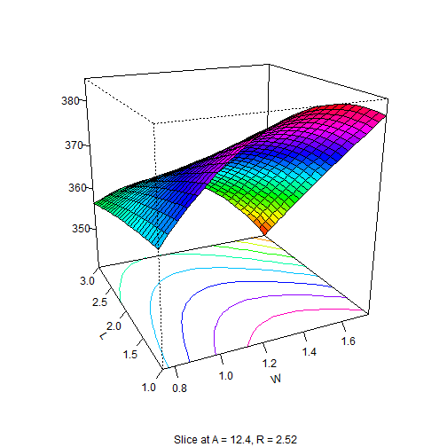

---
title: A reactive sliced 3D surface response
date : 2013-03-15
--- &lead


In [my previous article](http://stla.github.io/stlapblog/posts/rgl_knitr.html) I showed an interactive 3D surface response fitted from a model with two continous predictors. But when there is more than two continuous predictors, since we can use only two predictors at time in the image, we can only show a surface plot depending on the fixed values of the other predictors. Here we will build a `Shiny` application allowing to visualize a surface plot *reactive* to the values of the other predictors.

For our illustration we use the (coded) dataset `heli` available in the `rsm` package. 
The variables are coded variables `x1`, `x2`, `x3`, `x4`, which respectively are: linear functions of wing area
`A`, wing length ratio `R`, body width `W`, and body length `L`. The experiment was run in two
blocks, and the response variable is `ave`, the average flight time in seconds.


```r
library(rsm)
print(heli)
```

```
##    block    A    R    W   L ave logSD
## 1      1 11.8 2.26 1.00 1.5 367    72
## 2      1 13.0 2.26 1.00 1.5 369    72
## 3      1 11.8 2.78 1.00 1.5 374    74
## 4      1 13.0 2.78 1.00 1.5 370    79
## 5      1 11.8 2.26 1.50 1.5 372    72
## 6      1 13.0 2.26 1.50 1.5 355    81
## 7      1 11.8 2.78 1.50 1.5 397    72
## 8      1 13.0 2.78 1.50 1.5 377    99
## 9      1 11.8 2.26 1.00 2.5 350    90
## 10     1 13.0 2.26 1.00 2.5 373    86
## 11     1 11.8 2.78 1.00 2.5 358    92
## 12     1 13.0 2.78 1.00 2.5 363   112
## 13     1 11.8 2.26 1.50 2.5 344    76
## 14     1 13.0 2.26 1.50 2.5 355    69
## 15     1 11.8 2.78 1.50 2.5 370    91
## 16     1 13.0 2.78 1.50 2.5 362    71
## 17     1 12.4 2.52 1.25 2.0 377    51
## 18     1 12.4 2.52 1.25 2.0 375    74
## 19     2 11.2 2.52 1.25 2.0 361   111
## 20     2 13.6 2.52 1.25 2.0 364    93
## 21     2 12.4 2.00 1.25 2.0 355   100
## 22     2 12.4 3.04 1.25 2.0 373    80
## 23     2 12.4 2.52 0.75 2.0 361    71
## 24     2 12.4 2.52 1.75 2.0 360    98
## 25     2 12.4 2.52 1.25 1.0 380    69
## 26     2 12.4 2.52 1.25 3.0 360    74
## 27     2 12.4 2.52 1.25 2.0 370    86
## 28     2 12.4 2.52 1.25 2.0 368    74
## 29     2 12.4 2.52 1.25 2.0 369    89
## 30     2 12.4 2.52 1.25 2.0 366    76
## 
## Data are stored in coded form using these coding formulas ...
## x1 ~ (A - 12.4)/0.6
## x2 ~ (R - 2.52)/0.26
## x3 ~ (W - 1.25)/0.25
## x4 ~ (L - 2)/0.5
```

```r
print(heli, decode = FALSE)
```

```
##    block x1 x2 x3 x4 ave logSD
## 1      1 -1 -1 -1 -1 367    72
## 2      1  1 -1 -1 -1 369    72
## 3      1 -1  1 -1 -1 374    74
## 4      1  1  1 -1 -1 370    79
## 5      1 -1 -1  1 -1 372    72
## 6      1  1 -1  1 -1 355    81
## 7      1 -1  1  1 -1 397    72
## 8      1  1  1  1 -1 377    99
## 9      1 -1 -1 -1  1 350    90
## 10     1  1 -1 -1  1 373    86
## 11     1 -1  1 -1  1 358    92
## 12     1  1  1 -1  1 363   112
## 13     1 -1 -1  1  1 344    76
## 14     1  1 -1  1  1 355    69
## 15     1 -1  1  1  1 370    91
## 16     1  1  1  1  1 362    71
## 17     1  0  0  0  0 377    51
## 18     1  0  0  0  0 375    74
## 19     2 -2  0  0  0 361   111
## 20     2  2  0  0  0 364    93
## 21     2  0 -2  0  0 355   100
## 22     2  0  2  0  0 373    80
## 23     2  0  0 -2  0 361    71
## 24     2  0  0  2  0 360    98
## 25     2  0  0  0 -2 380    69
## 26     2  0  0  0  2 360    74
## 27     2  0  0  0  0 370    86
## 28     2  0  0  0  0 368    74
## 29     2  0  0  0  0 369    89
## 30     2  0  0  0  0 366    76
## 
## Variable codings ...
## x1 ~ (A - 12.4)/0.6
## x2 ~ (R - 2.52)/0.26
## x3 ~ (W - 1.25)/0.25
## x4 ~ (L - 2)/0.5
```


A second-order response-surface model for these data is fitted using

```r
heli.rsm <- rsm(ave ~ block + SO(x1, x2, x3, x4), data = heli)
```


The fitted surface response is shown below as a function of `x3` and `x4` with 
the values of `x1` and `x2` both fixed at $0$:  


```r
persp(heli.rsm, ~x3 + x4, at = list(x1 = 0, x2 = 0), col = rainbow(50), contours = "colors")
```

 


Now we build a `Shiny` application which does the same plot with *reactive* values of `x1` and `x2`. 

**ui.R file** defining the user interface:

```r
library(shiny)
library(rsm)

shinyUI(pageWithSidebar(
  
  # Application title
  headerPanel("Sliced 3D plot"),
  
  # Sidebar with two slider inputs
  sidebarPanel(
    sliderInput("Aslice", 
                "A:", 
                min = 11.8, 
                max = 13, 
                value = 12.4),
    sliderInput("Rslice", 
               "R:", 
                min = 2.26, 
                max = 2.78, 
                value = 2.52)
  ),
  
  # Show plot 
  mainPanel(
    plotOutput("surfPlot")
  )
))
```


**server.R file** drawing the surface:

```r
library(shiny)
library(rsm)

heli.rsm <- rsm(ave ~ block + SO(x1, x2, x3, x4), data = heli)

shinyServer(function(input, output) {
    output$surfPlot <- renderPlot({
        x1 <- (input$Aslice - 12.4)/0.6
        x2 <- (input$Rslice - 2.52)/0.26
        persp(heli.rsm, ~x3 + x4, at = list(x1 = x1, x2 = x2), col = rainbow(50), 
            contours = "colors")
    })
})
```

This `Shiny` application you see below is actually hosted at my  *Shiny beta hosting account* and 
is accessible at [http://glimmer.rstudio.com/stla/3Dsliced/](http://glimmer.rstudio.com/stla/3Dsliced/). 
I have embedded it here by typing the following html code: 

```
<iframe src="http://glimmer.rstudio.com/stla/3Dsliced/" style="border: none; width: 500px; height: 700px"></iframe>
```

<iframe src="http://glimmer.rstudio.com/stla/3Dsliced/" style="border: none; width: 500px; height: 700px"></iframe>


An interactive and reactive 3D plot ? 
---------------------------------------------

Similarly to interactive plots, reactive 3D plots embedded into a html report are great. Now, how to embed an interactive *and* reactive 3D plot ? 
There is [an open discussion](https://groups.google.com/forum/#!msg/shiny-discuss/VV-vw3VFpj0/bszBuHkgtS8J) about this possibility in the Shiny Google group. It's just a matter of time. 
How could we be able to afford to press the R developers who freely provide these wonderful tools ? 


