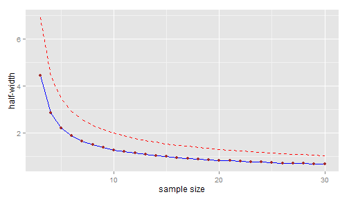
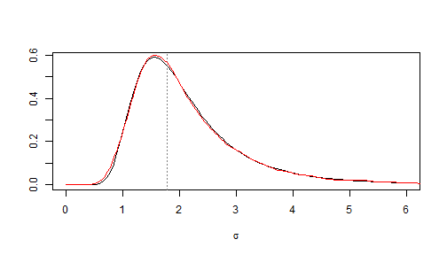

---
title: Sample size determination for a Gaussian mean
date : 2013-04-13
--- &lead


This article explains the methodology implemented in the Shiny application available at http://glimmer.rstudio.com/stla/samplesize_mean/

Statement of the problem 
-----------------------------

Consider a preliminary experiment ${\cal E}_0$, whose issue is a sample $y_0$ of size $n_0=5$ generated from a normal distribution with unknown mean $\mu$ and standard deviation $\sigma$. This expriment is simulated below (I voluntary hide the unknown values of the parameters!)

```r
n0 <- 5
(y0 <- rnorm(n0, mu, sigma))
```

```
## [1] 10.753 12.014  9.645 12.028  7.783
```

Now you want to plan a new experiment ${\cal E}^{\text{new}}$ under the same conditions as ${\cal E}_0$, after which you hope to get a reliable estimate of 
the mean $\mu$. 
For instance you wonder *how to optimally chose the sample size $n$ of ${\cal E}^{\text{new}}$ in order to have $80\%$ probability to the half-width of the $95\%$-confidence interval about $\mu$ being less than $2$ ?* 


A naive solution 
-----------------------

At the issue of the future experiment ${\cal E}^{\text{new}}$, 
the half-width of the $95\%$-confidence interval about the mean is 
$\boxed{t^*_{n-1}(2.5\%)\dfrac{sd(y^{\text{new}})}{\sqrt{n}}}$, denoting by 
$y^{\text{new}}$ the new generated sample of size $n$. 


Let's take a look at the estimated standard deviation of the preliminary sample:

```r
(sd0 <- sd(y0))
```

```
## [1] 1.788
```


Then we can plot *the half-width that  would be obtained if the new sample 
standard deviation $sd(y^{\text{new}}$) would exactly equal to the 
sample standard deviation $sd(y_0)$ of the preliminary sample*:


```r
hwidth <- function(n, sd, alpha = 5/100) {
    qt(1 - alpha/2, n - 1) * sd/sqrt(n)
}
n.range <- 3:30
names(n.range) <- paste0("n=", n.range)
library(ggplot2)
dfplot <- data.frame(n = n.range, hw = hwidth(n.range, sd0))
p <- ggplot(data = dfplot, aes(x = n, y = hw)) + geom_line(colour = "blue") + 
    geom_point(colour = "brown") + xlab("sample size") + ylab("half-width")
print(p)
```

 


Taking into account the uncertainty about the preliminary estimate
---------------------------------------------------------------------

Of course we cannot expect that the future sample standard deviation will be exactly equal to the preliminary one;  basing our choice of the sample size on the blue line would not take account of *risk*.

### Wrong approach: Using a confidence interval about the theoretical standard deviation 

It is well known that 
$$
sd^2(y_0) \sim \sigma^2\frac{\chi^2_{n_0-1}}{n_0-1} = \sigma^2F_{n_0-1,\infty}.
$$
Consequently, an upper $80\%$-confidence bound about the unknown standard deviation $\sigma$ 
can be derived from the preliminary experiment ${\cal E}_0$ as follows. 
Let $q$ be the lower $20\%$-quantile of the
chi-squared distribution $\chi^2_{n_0-1}$, defined by 
$\Pr(\chi^2_{n_0-1} > q)=80\%$. Then the interval
$$
\left[0, \frac{\sqrt{n_0-1}sd(y_0)}{\sqrt{q}} \right] 
$$
is the left-sided $80\%$-confidence interval about $\sigma$ derived from 
the preliminary sample. In other words, 
$\boxed{\sigma^+=  \dfrac{\sqrt{n_0-1}sd(y_0)}{\sqrt{q}}}$ is an upper $80\%$-confidence
bound for $\sigma$. 

Note that this fact has a Bayesian counterpart. 
Considering the [noninformative reference prior](http://www.stats.org.uk/priors/noninformative/YangBerger1998.pdf), 
the posterior distribution of $1/\sigma^2$ is the Gamma distribution 
${\cal G}\left(\frac{n_0-1}{2},\frac{(n_0-1)sd^2(y_0)}{2}\right)$. 
Then the $80\%$-confidence interval given above is also the left-sided 
$80\%$-credibility interval arising from the posterior distribution of 
$\sigma$ induced by the posterior Gamma distribution of $1/\sigma^2$.

Now, in addition to the blue line 
$n \mapsto t^*_{n-1}(2.5\%)\dfrac{sd(y_0)}{\sqrt{n}}$ plotted above, let's plot the *upper $80\%$-confidence line* 
$n \mapsto t^*_{n-1}(2.5\%)\dfrac{\sigma^+}{\sqrt{n}}$:  


```r
upperbound <- function(n, sd, level = 80/100) {
    sqrt(n - 1) * sd/sqrt(qchisq(1 - level, n - 1))
}
(sigma.upper <- upperbound(n0, sd0))
```

```
## [1] 2.785
```

```r
dfplot$hw.upper <- hwidth(n.range, sigma.upper)
p <- p + geom_line(data = dfplot, aes(x = n, y = hw.upper), colour = "red", 
    linetype = "dashed")
print(p)
```

 


The upper confidence bound is approximately 2.14 for $n=9$ and approximately 1.99 for $n=10$.  

Thus, would you consider taking $n=10$ as a $80\%$-guarantee that the half-width 
of your confidence interval will be less than $2$ ?
**This approach is conceptually wrong**:

 - $t^*_{n-1}(2.5\%)\dfrac{\sigma^+}{\sqrt{n}}$ is an upper $80\%$-confidence bound for the "theoretical half-width" $t^*_{n-1}(2.5\%)\dfrac{\sigma}{\sqrt{n}}$ (note this is $\sigma$ in the numerator of the fraction), which does not really makes sense;
 
 - whereas you want $80\%$-probability for the *observed* half-width $t^*_{n-1}(2.5\%)\dfrac{sd(y^{\text{new}})}{\sqrt{n}}$ being less than $2$.


### Correct approach: using a prediction interval about the sample standard deviation

Let's firstly consider the Bayesian approach. After some elementary calculations, it is easy to write down the density function of the posterior distribution of $\sigma$ with the help of the Gamma density function:

```r
# firstly define the density function of the inverse square root of
# Gamma(a,b)
dsqrtigamma <- function(x, a, b) {
    dgamma(1/x^2, a, b) * 2/x^3
}
# posterior density of sigma
dsigma <- function(x, n, sd) {
    dsqrtigamma(x, (n - 1)/2, (n - 1) * sd^2/2)
}
```

We put the code plotting this distribution in a function in order to call  the same plot later:

```r
fplot <- function(from = 0, to = 6) {
    curve(dsigma(x, n0, sd0), from = from, to = to, xlab = expression(sigma), 
        ylab = NA, axes = FALSE, main = expression(paste("Posterior distribution of ", 
            sigma)))
    axis(1)
    abline(v = sd0, lty = "dotted", col = "grey50")
}
fplot()
```

 

This distribution describes the uncertainty about the unknown theoretical standard deviation $\sigma$ after the preliminary experiment ${\cal E}_0$ was performed, whereas uncertainty about the future sample standard deviation $sd(y^{\text{new}})$ is described by its *posterior predicitve distribution*. 
The posterior predictive distribution of $sd^2(y^{\text{new}})$ is obtained by averaging its distribution  conditionally to a given value of $\sigma$:
$$
\left(sd^2(y^{\text{new}}) \mid \sigma\right) \sim \sigma^2\frac{\chi^2_{n-1}}{n-1}.
$$
over the posterior distribution of $\sigma$ which is given by 
$$\frac{1}{\sigma^2} \sim {\cal G}\left(\frac{n_0-1}{2},\frac{(n_0-1)sd^2(y_0)}{2}\right).$$


### Simulated posterior predictive distribution

Thus the posterior predictive distribution of $sd(y^{\text{new}})$ is very easy to simulate:

```r
nsims <- 6000
sdnew.sims <- array(NA, dim = c(nsims, length(n.range)))
colnames(sdnew.sims) <- names(n.range)
for (i in 1:nsims) {
    # sample from the posterior distribution of sigma :
    inv.sigma2 <- rgamma(1, (n0 - 1)/2, sd0^2 * (n0 - 1)/2)
    for (j in 1:length(n.range)) {
        sdnew.sims[i, j] <- sqrt(1/inv.sigma2 * rchisq(1, n.range[j] - 1)/(n.range[j] - 
            1))
    }
}
par(lwd = 2)
fplot()
j <- 8
lines(density(sdnew.sims[, j], from = 0), col = "red")
legend1 <- paste0("predictive sd with n=", n.range[j])
j <- 18
lines(density(sdnew.sims[, j], from = 0), col = "blue")
legend2 <- paste0("predictive sd with n=", n.range[j])
j <- 28
lines(density(sdnew.sims[, j], from = 0), col = "green")
legend3 <- paste0("predictive sd with n=", n.range[j])
legend("topright", legend = c("posterior sigma", legend1, legend2, legend3), 
    text.col = c("black", "red", "blue", "green"), lty = "solid", col = c("black", 
        "red", "blue", "green"))
```

 


And now we could be able to plot the *upper $80\%$-prediction line* $n \mapsto t^*_{n-1}(2.5\%)\dfrac{sd(y^{\text{new}})^+}{\sqrt{n}}$ because we can estimate the upper $80\%$-prediction bound $sd(y^{\text{new}})^+$ of $sd(y^{\text{new}})$ (depending on $n$):

```r
apply(sdnew.sims, 2, FUN = function(x) quantile(x, probs = 80/100))
```

```
##   n=3   n=4   n=5   n=6   n=7   n=8   n=9  n=10  n=11  n=12  n=13  n=14 
## 2.872 2.789 2.775 2.778 2.746 2.785 2.793 2.772 2.818 2.785 2.785 2.774 
##  n=15  n=16  n=17  n=18  n=19  n=20  n=21  n=22  n=23  n=24  n=25  n=26 
## 2.757 2.811 2.789 2.783 2.785 2.769 2.768 2.746 2.758 2.778 2.763 2.778 
##  n=27  n=28  n=29  n=30 
## 2.779 2.765 2.742 2.772
```

But wait, instead of using simulations, we will use exact calculations.


### Theoretical posterior predictive distribution

Let's have a theoretical look at the posterior predictive distribution of the future sample standard deviation. Firstly recall that 
$$
\left(sd^2(y^{\text{new}}) \mid \sigma\right) \sim \sigma^2\frac{\chi^2_{n-1}}{n-1}.
$$
Then recall the posterior distribution 
$$\frac{1}{\sigma^2} \sim {\cal G}\left(\frac{n_0-1}{2},\frac{(n_0-1)sd^2(y_0)}{2}\right)=
\frac{1}{(n_0-1)sd^2(y_0)}\chi^2_{n_0-1},$$
hence the posterior predictive distribution of $sd^2(y^{\text{new}})$ is
(where the $\chi^2$ variates in the fraction are independent):
$$
sd^2(y^{\text{new}}) \sim 
sd^2(y_0) \frac{n_0-1}{n-1}\frac{\chi^2_{n-1}}{\chi^2_{n_0-1}}
=sd^2(y_0)F(n-1, n_0-1).$$

So let's define the posterior predictive density of $sd(y^{\text{new}})$ in R:


```r
# firstly define the density of the square root of Fisher distribution:
dsqrtF <- function(x, ...) {
    df(x^2, ...) * 2 * x
}
# now define the posterior predicitve of sd(ynew):
dsdnew <- function(x, n0, sd0, n) {
    scale <- sd0
    dsqrtF(x/scale, n - 1, n0 - 1)/scale
}
```

And let's compare with the red density in the previous figure: 

```r
curve(dsdnew(x, n0, sd0, n = 20), from = 0, to = 6, xlab = expression(sigma), 
    ylab = NA)
abline(v = sd0, lty = "dotted", col = "grey50")
lines(density(sdnew.sims[, 18], from = 0), col = "red")
```

 


Very nice. We don't need simulations anymore because we are also able to define the inverse cumulative distribution function of the posterior predictive distribution of $sd(y^{\text{new}})$:

```r
# firstly define the density of the square root of Fisher distribution:
qsqrtF <- function(p, ...) {
    sqrt(qf(p, ...))
}
# now define the posterior predicitve of sd(ynew):
qsdnew <- function(x, n0, sd0, n) {
    scale <- sd0
    scale * qsqrtF(x, n - 1, n0 - 1)
}
```

Thus the Bayesian upper $80\%$-prediction bound of $sd(y^{\text{new}})$ is 
$$
sd(y^{\text{new}})^+=
sd(y_0) \times \sqrt{F_{n-1,n_0-1}(0.8)}. 
$$
So now in addition to the blue line 
$n \mapsto t^*_{n-1}(2.5\%)\dfrac{sd(y_0)}{\sqrt{n}}$ of our first figure, we can plot the *upper $80\%$-prediction line* $n \mapsto t^*_{n-1}(2.5\%)\dfrac{sd(y^{\text{new}})^+}{\sqrt{n}}$: 


```r
(sdnew.upper <- qsdnew(80/100, n0, sd0, n.range))
```

```
##   n=3   n=4   n=5   n=6   n=7   n=8   n=9  n=10  n=11  n=12  n=13  n=14 
## 2.812 2.819 2.817 2.815 2.812 2.810 2.808 2.806 2.804 2.803 2.802 2.801 
##  n=15  n=16  n=17  n=18  n=19  n=20  n=21  n=22  n=23  n=24  n=25  n=26 
## 2.800 2.799 2.798 2.798 2.797 2.797 2.796 2.796 2.795 2.795 2.794 2.794 
##  n=27  n=28  n=29  n=30 
## 2.794 2.793 2.793 2.793
```

```r
dfplot$hw.upper.pred <- hwidth(n.range, sdnew.upper)
p <- p + geom_line(data = dfplot, aes(x = n, y = hw.upper.pred), colour = "green", 
    linetype = "dashed")
print(p)
```

 


Well, I agree... no large difference with the confidence line ! 
This is not surprising: we have just seen that
$$
sd(y^{\text{new}})^+=
sd(y_0) \times \sqrt{F_{n-1,n_0-1}(0.8)}
$$
and in fact the upper $80\%$-confidence bound of $\sigma$ can  be written as
$$
\sigma^+=
sd(y_0) \times \sqrt{F_{\infty,n_0-1}(0.8)}.
$$
But I cannot guarantee that the two lines will always be as close in every possible situations.


### Back to the frequentist framework 

We have seen that 
$$
sd(y^{\text{new}})^+=
sd(y_0) \times \sqrt{F_{n-1,n_0-2}(0.8)}. 
$$
is the Bayesian upper $80\%$-prediction bound of the future sample standard deviation $sd(y^{\text{new}})$ (derived from the noninformative reference prior).
Actually it is a frequentist  $80\%$-prediction bound too, as a consequence of the obvious distributional equality
$$
\frac{sd^2(y^{\text{new}})}
{sd^2(y_0)} \sim F_{n-1,n_0-1}. 
$$
When the size $n$ of the future sample goes to $\infty$, 
$$
\frac{sd^2(y^{\text{new}})}
{sd^2(y_0)} \sim F_{\infty,n_0-1} = \frac{n_0-1}{\chi^2_{n_0-1}}, 
$$
and the asymptotic $80\%$-prediction bound of $sd(y^{\text{new}})$ is nothing but the $80\%$-confidence bound of $\sigma$. 


That shows that, if we run the following algorithm, then we are sure that the $80\%$-prediction approach is successful in at least  $80\%$ of simulations, 
but the $80\%$-confidence approach is only asymptotically ($n\to\infty$) successful in at least  $80\%$ of simulations,


**Algorithm:**  

1. Simulate $n_0=5$ values from the Gaussian distribution ${\cal N}(\mu,\sigma^2)$ with fixed $\mu$ and $\sigma$

2. Derive the optimal sample size $n$ required to expect a half-width smaller than $2$
  * using the $80\%$-confidence line approach
  * or using the $80\%$-prediction line approach

3. Simulate $n$ values from the Gaussian distribution ${\cal N}(\mu,\sigma^2)$ and say the approach is successful if the  half-width is smaller than $2$.


## Note on the Bayesian approach

We have seen a Bayesian approach and a frequentist approach that lead both the same result. But besides its better interpretability, the Bayesian approache has another advantage. The Bayesian way to get a prediction interval about the sample standard deviation is conceptually straightforward: we just have to derive the posterior predictive distribution by doing direct calculations. On the other hand, generally speaking, the frequentist approach requires that we find a "trick" to derive a prediction interval. Of course here this is a simple example and it was not difficult to think of the distributional equality
$\frac{sd^2(y^{\text{new}})}{sd^2(y_0)} \sim F_{n-1,n_0-1}$. But I mean that, unlike the Bayesian approach, the frequentist approach is not driven by a general method not depending on the particular statistical model of interest. 
